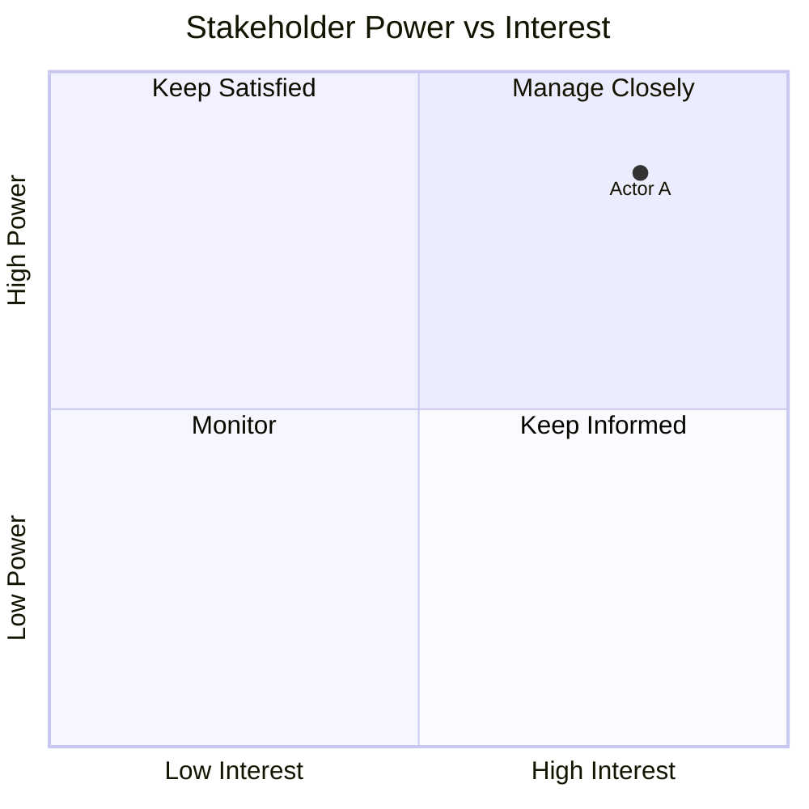
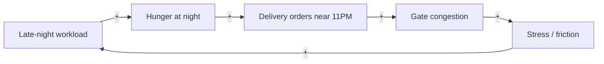

# Systems & Design Thinking Toolkit

This project follows a fixed course framework (see `project_framework .pdf` and `ProblemStatements.pdf`
in the project root). The team picks ONE of four campus puzzles and works through 3 phases /
10 activities producing 15 deliverables over 4 weeks. Always check `deliverables/` first for what's
already been produced before generating something new — don't contradict earlier phases without
flagging the change explicitly.

## The four puzzles (pick one, stay consistent across all deliverables)

1. **The Breakfast Paradox** — mess hours (7:30–9:30 AM) vs 8:30 AM class start vs late-night work
   habits → skipped breakfast → wasted food → 11 AM energy crash → double-paying for canteen food.
2. **The 11 O'Clock Cliff** — academic late-night workload vs 11 PM delivery-vehicle security cutoff →
   gate congestion, cold food, walk-to-gate friction.
3. **The Research Lab Commons** — unwritten rules for shared desks/coffee machine/fridge between
   Software Lab and Electronics Lab → squatting, free-rider depletion, no restocking accountability.
4. **The Induction Week Pile-Up** — fixed admin slot (Student Life Office) + ~11 competing groups
   (Clubs Council, APEX, robotics, dance, Student Parliament) negotiating one calendar → low-power
   groups (Parliament) get pushed to dead slots.

Whichever is chosen, keep actor names/details from the source PDF consistent in every diagram.

## Phase → Method → Deliverable map

| # | Deliverable (exact course name) | Core method | Best rendering |
|---|---|---|---|
| 1 | System Context Brief | Boundary framing (in/out of scope), purpose, symptoms vs issues | Structured markdown doc |
| 2 | Stakeholder Map | Primary/secondary/indirect actors, relationships, interests | Mermaid `graph` / `flowchart`, clustered by tier |
| 3 | Stakeholder Power–Interest/Leverage Map | Power-interest grid (Mendelow matrix) | Mermaid `quadrantChart` |
| 4 | Current-State Process Map / Process Trace | Swimlane of actors × decisions/handoffs, incl. workarounds | Mermaid `flowchart` (subgraphs as lanes) or `sequenceDiagram` |
| 5 | System Timeline / Behaviour-Over-Time Map | BOT graph: variable(s) vs time showing the recurring pattern | **Load the `dataviz` skill** — this is a real line chart (e.g. "food wasted/day", "gate queue length"), not a diagram |
| 6 | System Map / Rich Picture | Holistic actors+flows+tensions+bottlenecks | Mermaid `flowchart` with icon/emoji annotations for tension points, or freeform SVG artifact |
| 7 | Causal Loop / Feedback Analysis (CLD) | Reinforcing (R) / balancing (B) loops, +/- polarity, delays | Mermaid `flowchart LR` with `+`/`-` edge labels; **load `artifact-diagramming` skill** for layout technique |
| 8 | Systemic Problem Analysis | **Iceberg Model** (Events → Patterns → Structures → Mental Models) + loop naming | Structured markdown + iceberg diagram (stacked boxes) |
| 9 | Reframed Systemic Problem Statement | Assumption-challenge, "How Might We", contradiction mapping | Markdown, short |
| 10 | Design Opportunity Statement | Point-of-view + opportunity framing | Markdown, short |
| 11 | Leverage-Point / Intervention Map | Meadows' 12 leverage points (see below), ranked by depth | Table + annotated CLD (mark leverage points ON the loop diagram from #7) |
| 12 | Design Principles | 3–5 principles derived from leverage points | Markdown list, each with rationale |
| 13 | Intervention Concepts / Prototypes | Concept sketches, storyboards, low-fi prototypes | HTML/SVG artifact or annotated flow |
| 14 | Scenario Model & Impact Evaluation | Before/after BOT projection, stakeholder response simulation, second-order effects | `dataviz` skill for projected graphs + markdown table of unintended consequences |
| 15 | Final System Design Recommendation | Synthesis narrative: problem → root cause → leverage point → intervention → expected system effect | Full artifact combining prior diagrams |

## Workflow when asked to produce a deliverable

1. Confirm which puzzle and check `deliverables/` for prior-phase files that this one depends on
   (e.g. the CLD needs the Stakeholder Map's actor list; leverage points need the CLD's loops).
2. Draft the content in plain markdown first and show it — these are analytical claims (who has
   power, what the root cause is), not just pictures. Get the substance right before polishing.
3. Only then render as a polished Artifact if a visual is warranted. Load `artifact-design` before
   any Artifact publish (mandatory per house rules), plus `artifact-diagramming` for CLDs/system maps
   or `dataviz` for any time-series/BOT graph.
4. Save the finished deliverable's markdown source into the matching file under `deliverables/`.

## Reference frameworks

### Iceberg Model (for Systemic Problem Analysis)
- **Events** — what actually happened (the anecdote in the puzzle brief).
- **Patterns/Trends** — what keeps happening, how often, since when (needs real data: interviews/surveys).
- **Structures** — the rules, incentives, schedules, physical layouts, org structures producing the pattern.
- **Mental Models** — the beliefs/assumptions/values that keep the structures in place ("I paid for it,
  why would I waste it?", "rules exist to be followed, not questioned").

### 5 Whys (root-cause drilling, feeds the Structures/Mental Models layers)
Ask "why" 5x from a symptom until you hit a structural or belief-level cause, not another symptom.

### Meadows' 12 Leverage Points (weakest → strongest; higher numbers = shallower/easier but less impactful)
12. Constants, parameters, numbers (subsidies, quotas, cutoff times)
11. Buffer sizes relative to flows (e.g. food surplus buffer, calendar slack)
10. Structure of material stocks and flows (physical layout, who's connected to whom)
9. Length of delays relative to system change rate
8. Strength of balancing (negative) feedback loops
7. Gain around reinforcing (positive) feedback loops
6. Structure of information flows (who knows what, transparency)
5. Rules of the system (incentives, penalties, who decides)
4. Power to add/change/self-organize system structure
3. Goals of the system
2. Mindset/paradigm the system arises from
1. Power to transcend paradigms entirely

When ranking intervention options for deliverable #11, prefer higher-leverage (lower-numbered) points
over parameter tweaks, but flag the feasibility tradeoff — a 4-week student project usually can only
*propose*, not implement, a paradigm-level change.

### Power–Interest grid quadrants (for deliverable #3)
- High power / high interest → **Manage closely** (key players)
- High power / low interest → **Keep satisfied**
- Low power / high interest → **Keep informed**
- Low power / low interest → **Monitor**
(Sameer/Student Parliament in Puzzle 4 is a textbook "low power, high interest" case being
mismanaged as "monitor.")

## Mermaid snippets

Power-Interest quadrant:

CLD loop (polarity + loop label):

Label loops explicitly in surrounding text/callout as "R1: Late-night hunger spiral" etc. — Mermaid
has no native loop-name annotation, so add it as a text note next to the diagram.

## External tools (see `research/tool-notes.md` for the full survey)

Vendored locally, static HTML, no build/server needed — open `index.html` directly in a browser:
- `tools/loopy/index.html` — Nicky Case's Loopy, hand-sketch + live-simulate a CLD
- `tools/cld-editor/index.html` — lighter Loopy-derived CLD sketcher
- `tools/stakeholder-map/index.html` — power-interest matrix + network graph, local-storage persistence

Reference material (methods, not software): `research/service-design-playbook/`,
`research/dt-worksheets/`. Default to generating diagrams as Artifacts (tailored to this project's
actual content) rather than pointing the user at these tools — offer them only when the team wants to
hand-sketch/iterate live as a group. A Claude Code plugin claiming to cover "systems thinking"
(`fakoli/systems-thinking-plugin`) was checked and rejected — it's built for infra/architecture risk
analysis, not this project's domain; see `tool-notes.md` for why.
