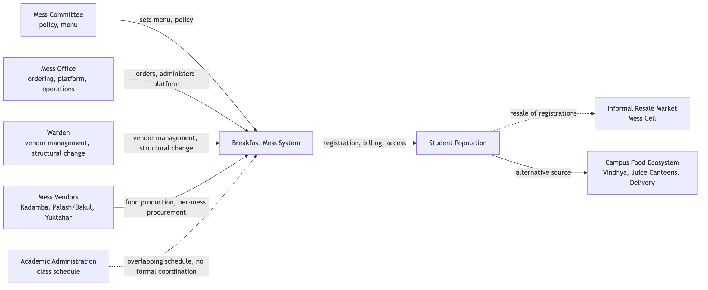
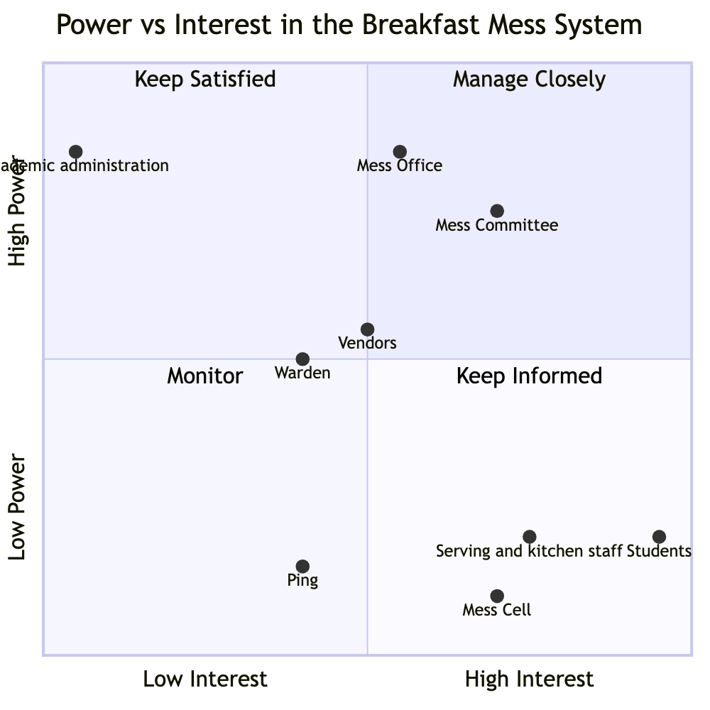
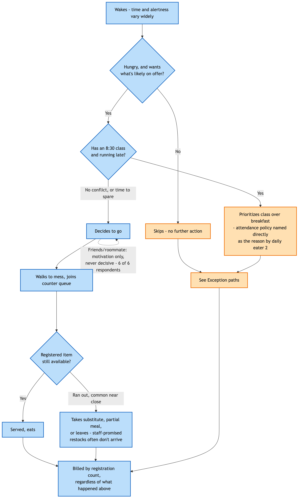
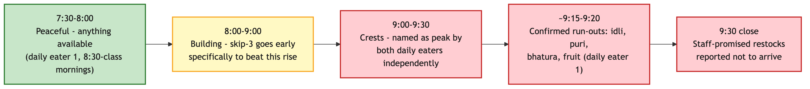
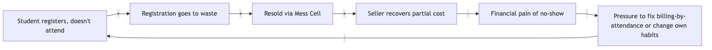

# Introduction

Phase 1 of the Systems Thinking and Design capstone project asks for five deliverables, each corresponding to one activity in the project framework: the System Context Brief, the Stakeholder Map, the Stakeholder Power-Interest/Leverage Map and Power Analysis Brief, the Current-State Process Map / Process Trace, and the System Timeline / Behaviour-Over-Time Map. This report consolidates the main concepts from all five full documents into a single submission. The full, detailed version of each deliverable — every table, every diagram, every respondent quotation — is filed separately as its own document; this report carries forward the findings that matter most, not a line-by-line reproduction.

The problem under study: students at IIIT Hyderabad routinely register for breakfast at a materially higher rate than they attend, converting a portion of registered demand into food that is prepared and paid for but not consumed. Six real respondents, a full stakeholder analysis, a governance investigation, and a process trace all converge on the same underlying shape: a registration-and-billing structure that rewards advance commitment without rewarding actual attendance or providing flexibility, layered under a set of governance relationships where the actor best placed to help — Academic administration — has no engagement with the problem at all.

# Task 1 — System Context Brief

**System boundary.** The breakfast registration, billing, and service process across IIIT Hyderabad's four residential messes — Kadamba (South Indian), Palash (North Indian, vegetarian only), Bakul (North Indian, vegetarian and non-vegetarian), and Yuktāhār (Jain-oriented) — together with the digital platform (dining.iiit.ac.in) governing access to all four, and the platform's interface with the academic class schedule. Vindhya Canteen, the juice canteens, and delivery platforms sit at the boundary as competing alternatives. Lunch and dinner run on the same platform but are out of scope; this report covers breakfast only.

**Purpose and intended outcomes.** The system exists to provide reliable, adequate, good-quality food each morning at a predictable, affordable cost, accommodating dietary needs, in a way that supports student health, energy, and academic performance. Measured against this purpose, the mechanism as built rewards a different goal: billing by registration rather than attendance, a walk-in price set 70-90% above the registered rate, and a Skip Meal function that returns no value to the student collectively reward pre-committing and do nothing for actual attendance or flexibility.

**Context.** Four cuisines, four kitchens, and (for Palash/Bakul) two different procurement arrangements are unified only at the registration and billing layer. Food procurement is per-mess, not centralized. Confirmed breakfast capacity across all four messes is approximately 2,755 registrations per day. Mess governance splits across three separate bodies — the Mess Committee (policy), the Mess Office (operations), and the Warden (vendor management) — with Academic administration entirely outside that structure, formally disconnected from mess-hours decisions despite the 8:30 AM class start overlapping the 7:30-9:30 AM breakfast window.

**Leading symptoms and their underlying issues.** A student who registers and does not attend is still billed the full price, because billing tracks registration, not attendance. The Skip Meal function returns nothing to the student, so an informal peer-to-peer resale market ("Mess Cell," on WhatsApp) has emerged to do what the formal tool does not — recover partial or full value. Registered uptake is markedly lower at every mess serving North Indian food than at the South Indian mess, a pattern consistent across three independently operated messes rather than one, making cuisine preference a stronger explanation than any single mess's individual circumstances. Real interview data confirms the class/breakfast overlap is not only a scheduling inconvenience: a student who wakes late enough to conflict with an 8:30 class explicitly prioritizes class attendance over breakfast, citing the academic attendance policy directly. No student or staff account describes a specific instance of mess feedback producing a policy change, despite three real input channels existing (an in-app rating, a public email, and coverage in the student publication Ping).

**Initial problem framing.** Many students register for breakfast and do not eat it. The meal is still cooked and the student is still charged. The system's own tools for anticipated non-attendance — cancellation and Skip Meal — either return no money (Skip Meal) or require advance knowledge (both), leaving last-minute non-attendance with no mechanism at all. The core question: why doesn't registration reliably reflect who is actually going to eat, and what in the system is causing that gap?

# Task 2 — Stakeholder Map

Twenty-seven candidate stakeholders were identified across seventeen analytical lenses and narrowed to seventeen through direct evidence: six primary stakeholders with daily, direct interaction (students and the three vendor lines, plus serving and kitchen staff); four secondary, governing stakeholders (Mess Committee, Mess Office, Warden, and — added after later governance research — the Student Parliament's elected Mess Secretary and per-mess Deputy Secretaries); and eight indirect or latent stakeholders, including Academic administration, the Facilities/Estate team, the Portal/IT owner, the Mess Cell WhatsApp community, unofficial registration-tool developers, Ping, and the competing food outlets.

The single most consequential finding of this map: Academic administration has no confirmed relationship of any kind — formal or informal — to any of the three mess-governance actors, despite holding the one lever (class start time) most likely to resolve the core overlap. A second finding, not previously recognized in this project's own earlier drafts: the Mess Office is a distinct actor from the Mess Committee, separating who decides policy from who executes it. A third: the informal Mess Cell market may function as a more economically significant actor than its unofficial status implies, since it is doing work — recovering value from unused registrations — that the formal system's own tool does not.

# Task 3 — Stakeholder Power-Interest/Leverage Map and Power Analysis Brief

Power in this system does not move as a single current. It splits across three governance bodies whose relationship to one another is only partly established (Mess Committee, Mess Office, Warden), it is exercised informally by actors with no official standing (roommates and friends, the Mess Cell market, Ping, unofficial tools), and its most consequential feature is an absence: no relationship links Academic administration to any mess-governance actor, confirmed to reflect inattention rather than refusal — nobody has really tried to raise it.

Governance research fetched directly from the Student Parliament's own records identified a fifth actor missing from earlier drafts: an elected Mess Secretary and a Mess Deputy Secretary per mess. A separately-named "Mess Council" is very likely a naming artifact — the real Mess Monitoring Council belongs to a different institution (IIT Hyderabad) with a near-identical name. Four historical precedents were identified: Bakul's creation after Kadamba's capacity ceiling was reached; a November 2024 incident ("Let Them Eat Frogs") where the Mess Office unilaterally cancelled non-vegetarian meals after a frog was found in food; a December 2024 cancellation-policy tightening, issued to reduce Mess Office workload, over which Ping ran a student opinion survey and Parliament held two meetings with the Mess Office — opposition was registered, but the policy was implemented regardless; and a 2023 water-quality episode at the same institution showing the same complaint-then-ignored-then-crisis pattern in a different domain.

The central asymmetry: students control the one input every other actor's planning depends on (registration intent) while bearing no cost for supplying it inaccurately, and hold more power than any formal actor over the accuracy of that data even while holding no power over billing structure, cancellation rules, or class timing. This is best described as **exercised-but-unmeasured leverage** — real organizing capacity (the Mess Cell market, and at least one prior organized approach to governance) exists but has never had its effectiveness measured or followed up on.

# Task 4 — Current-State Process Map / Process Trace

Registration and attendance run on two decoupled timescales. Registration is **monthly**: three of six real respondents describe registering for an entire month at once, not day-by-day — a wider decoupling between the registration decision and the morning-of attendance decision than this project's earlier drafts assumed. The actual go/skip decision happens separately, each morning, driven primarily by wake time and alertness, an 8:30 class conflict (where class attendance is explicitly prioritized over breakfast), and whether the desired item is still available on arrival.

A hypothesis this round's real data disconfirms: peer influence was previously treated as a meaningful attendance driver. Six real respondents now describe it consistently as a motivational add-on at most, never the deciding factor — no respondent reports skipping because a friend didn't go, or attending only because one did.

No respondent describes a working escalation path for a mess rule or timing change — every one of five new respondents said no when asked directly, distinct from the reactive, same-incident-only fixes the mess does make (a run-out, a technical error). This corroborates the Power Analysis Brief's central governance finding at the student-experience level. A genuinely new finding: **broken restock promises** — staff say a run-out item will return before close, and respondents report it typically doesn't. Two respondents also independently estimate that only around 30% of registered students actually attend, and that even that smaller group is not reliably well served — an unverified figure, but a concrete, checkable claim for the pending mess-staff interview.

The kitchen and vendor side of this process remains entirely unobserved from any source gathered. **This data will be collected and submitted later**, once mess-committee and mess-vendor interviews, and a direct observation of a live service window, are completed.

# Task 5 — System Timeline / Behaviour-Over-Time Map

Six real respondents do not agree on a single direction of change: one reports attendance increasing this semester, one reports a specific decline over the last three to six weeks, one has been at zero all semester, and the rest show no clear trend. There is no single "the paradox is worsening" or "improving" claim this dataset supports — this is itself the honest system-level finding, not a gap to be closed with more of the same kind of interview.

What first looked like two competing crowd-peak claims reconciles into one continuously building crowd that crests just before the 9:30 close, with confirmed item run-outs (idli, puri, bhatura, fruit) concentrated near the end of the window.

Two feedback loops are now confirmed on their central mechanisms. **R1**, a Shifting-the-Burden loop: the Mess Cell resale market provides just enough relief that nobody is forced to fix the underlying billing structure — zero of six respondents who addressed Skip Meal have used it, and four of six have used Mess Cell instead. **B1**, a Fix That Fails: Skip Meal balances kitchen preparation in design only — with zero real usage, it may not be closing even the kitchen-side problem it was built for. A new candidate loop, not previously identified: registration inflation (from habit, scarcity-driven registration at Kadamba, and random allocation) may be pushing preparation to calibrate against a low true-attendance figure rather than peak-hour clustering, meaning the paradox may be as much about under-provisioning for real attendees as it is about waste from no-shows.

# Consolidated Findings Across All Five Deliverables

1. **The core mechanism.** Registration-based billing, a no-refund Skip Meal function, and a 70-90% walk-in markup jointly reward advance commitment and do nothing for actual attendance or flexibility — this is the structural driver behind the registration-attendance gap, evidenced across the Context Brief, the Power Analysis, and the Process Trace alike.
2. **A governance split hidden until this project separated it.** The Mess Committee (policy) and Mess Office (operations) are two different actors with different, sometimes misaligned, incentives — the Office's one confirmed policy action was driven by reducing its own workload, not a student-facing goal.
3. **Academic administration is the clearest sleeping stakeholder in the entire system** — total authority over the one variable (class start time) most likely to resolve the core overlap, zero relationship to any mess-governance actor, confirmed to reflect inattention rather than refusal.
4. **Students hold an unusual structural position:** they are the sole source of the one input (registration intent) every other actor's planning depends on, face no cost for supplying it inaccurately, and simultaneously bear the entire visible cost of the pattern that results — wasted food, lost money, and for some, a poorly served morning even when they do attend.
5. **Exercised-but-unmeasured collective leverage.** The Mess Cell market and at least one prior organized approach to governance (via Ping and the Student Parliament) show real organizing capacity among students — capacity that has never had its effectiveness measured or followed up on.
6. **Feedback exists; a confirmed output does not.** Three real channels (in-app rating, email, Ping) and one real precedent of organized pushback all show inputs reaching the system — no source, in any deliverable, can point to a specific instance where that input changed a decision.
7. **Convergent, low-cost intervention candidates surfaced directly by respondents, not inferred:** extending the 9:30 closing time was the single most-requested fix, repeated independently by every respondent who offered a suggestion; a pay-as-you-go, canteen-style alternative to fixed registration was proposed as a structural alternative to patching the current model.

# Outstanding Data Collection

The following depends on a mess-committee or mess-vendor source, and on direct observation of a live service window — **this data will be collected and submitted later**:

- What quantity the kitchen actually prepares against, and whether the unverified "~30% attendance" figure two respondents cited independently is real.
- Vendor compensation structure, and any specific instance of vendor bargaining or contract renegotiation.
- Who sees and acts on per-meal ratings once submitted.
- Whether the December 2024 Ping-survey-and-Parliament-negotiation episode is the specific "organized" student effort this project has otherwise only heard about secondhand — the single highest-priority open question across all five deliverables.
- Why specific items run out ahead of others, and what a staff "restock promise" actually means operationally.
- A realistic minimum of four to eight weeks of daily registration and attendance data per mess, to replace recall-based trend statements with measured ones.

# Status Summary

| # | Deliverable | Status |
|---|---|---|
| 1 | System Context Brief | Complete |
| 2 | Stakeholder Map | Complete |
| 3 | Stakeholder Power-Interest/Leverage Map and Power Analysis Brief | Substantially complete — governance structure and precedent established; vendor-side items pending |
| 4 | Current-State Process Map / Process Trace | Complete for the student-facing half; kitchen/vendor half pending |
| 5 | System Timeline / Behaviour-Over-Time Map | Complete for qualitative, respondent-sourced patterns; quantitative validation pending |

Everything that could be established from confirmed facts, direct interviews, and structural reasoning is done. The remaining gaps are exactly where the project framework itself requires further human input — a mess-committee or mess-vendor interview, and direct observation of a live service window — both already scoped and ready to run.
