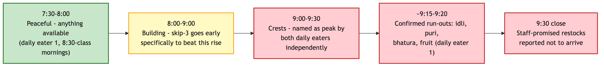
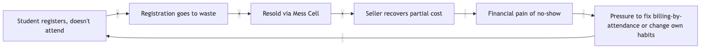

# Introduction

Phase 1 of the Systems Thinking and Design capstone project asks for five deliverables, each corresponding to one activity in the project framework: the System Context Brief, the Stakeholder Map, the Stakeholder Power-Interest/Leverage Map and Power Analysis Brief, the Current-State Process Map / Process Trace, and the System Timeline / Behaviour-Over-Time Map. This report consolidates the main findings of all five into a single submission.

The problem under study: students at IIIT Hyderabad are registered for breakfast far more often than they eat it. The evidence covers both halves of the system. On the student side, six respondents, the published rules and a governance investigation describe how registration works and why mornings are skipped. On the kitchen side, interviews with the operators of three messes, the photographed books of Yuktāhār, a month of timestamped Kadamba breakfast scans, and a team member's first-hand account of the Kadamba and Yuktāhār visits show how registrations become cooked food and what happens to it. Several earlier findings were overturned by this operations evidence and are stated below in their revised form.

# Task 1: System Context Brief

**System boundary.** Breakfast as it is registered, billed, cooked and served across the four residential dining halls (Kadamba, Palash, Bakul and Yuktāhār), in three layers: the registration and billing platform (dining.iiit.ac.in) with the QR scan at the counter; the kitchen layer, meaning each catering operator's planning, cooking, pre-service food-safety checks, top-up, reuse and disposal (Prism at Kadamba, ABC Hospitality Services at Yuktāhār, Vijayalakshmi Caterers at Bakul, cooking at the off-site Hafizpet kitchen); and the governance layer that sets the menu, the rules and the contracts. Suppliers, the garbage contractor, the institution's site team, its facility team and weekly quality-control inspection, and the tender sit on the boundary. Non-student diners also draw on the same food across it: at Kadamba, 30 to 50 people from outside the registration, such as night-shift security, and about half of the operator's own staff (single-sourced). The class schedule sits outside the boundary but shapes it, and Vindhya Canteen, the juice canteens and delivery platforms compete at the outer edge. Lunch and dinner are out of scope and serve as the comparison: at Yuktāhār in September 2026, lunch turnout ran between 56 and 89 percent of registrations while breakfast on the same days ran between 18 and 40 percent (confirmed from records).

**Purpose and actual mechanism.** The institution's stated method is "minimizing food wastage through advance meal planning." In practice registration is a default rather than a choice: every student is registered automatically, on campus or not, and the only exit is five cancellations per meal type per month, each at least four days ahead, with no other way to remove the charge (confirmed). The count stays flat across the week (about 1,070 Kadamba breakfast registrations every day in April 2026, Sunday included), while turnout varies from 42.1 percent on Tuesdays to 27.3 percent on Sundays (confirmed from records). No kitchen cooks to the count. Yuktāhār plans at a twice-daily meeting from its Wastage Book for the matching week, a weekday attendance register, the month's pattern and the event calendar (confirmed), then re-projects the rest of each meal from its first half hour (single-sourced). Kadamba cooks a first batch of 70 percent of registrations, veg and non-veg planned separately, to a gram standard for each dish, and a supervisor calls top-ups from the counter (single-sourced). Bakul (Vijayalakshmi Caterers) cooks for 70 to 80 percent by item, a share its manager revises weekly from past attendance, but under his rule of "no shortage, even if some wastage" keeps food for about 70 percent even on low weekends (single-sourced; no records). Kadamba's fixed ratio is not calibrated to breakfast turnout; Bakul's is adjusted by judgement, with no known record, only down to that floor, which revises an earlier reading of it as fixed. Yuktāhār's planning does learn from its own recorded outcomes, although its site head's stated breakfast figure (about 50 percent) sits well above its own register (about 28 percent). The two on-site operators also read the count with opposite aims: Kadamba treats it as the obligation it is paid for, while Yuktāhār names lower cost and higher profit alongside quality as goals (single-sourced for both).

**Context.** Kadamba (South Indian) is run by Prism, an outside vendor contracted by tender that runs all of Kadamba's operations; this revises an earlier reading of Prism as the name of Kadamba's floor team. Yuktāhār (vegetarian Satvik and Jain) is run by ABC Hospitality Services. Bakul (North Indian) is run by Vijayalakshmi Caterers from the Hafizpet kitchen, about 8 km away (single-sourced), revising an earlier candidate reading. Palash (North Indian, vegetarian only) shares one off-site kitchen with Bakul until the Felicity facility opens in December 2026; that the same operator serves it is a candidate. Registered breakfast costs ₹48 vegetarian or ₹66 non-vegetarian (₹53 at Yuktāhār); walk-in access costs roughly 70 percent more. Governance splits across the Mess Committee (menu and policy), the Mess Office (registration platform and operational rules) and the Warden (vendors and structure). The Kadamba operator describes its line of authority as CFS, then CDS, then Prism, then an operations manager, a manager, a supervisor and the service staff (single-sourced). How CFS and CDS map onto the Mess Committee, the Mess Office and the Warden is unconfirmed, and the operator and an earlier institutional interview name different people as head of CDS, an open question. Operators are paid monthly as a lump sum on plates, with deductions (single-sourced). Bakul's operator reports payment on plates served, while Kadamba's remark points to registrations (single-sourced for both); the two are in tension, and the basis stays unconfirmed for every operator.

**Leading symptoms and their underlying issues.** About two thirds of breakfast registrations go unused: 62.9 percent at Kadamba in April and about 72 percent at Yuktāhār in September (confirmed). This revises the earlier working estimate of a gap of about 30 percent, which matches lunch, not breakfast. Arrivals pile up at the close, with 26.5 percent of Kadamba scans between 9:15 and 9:30, so shortage and waste occur on the same morning. Items that always waste (uttapam, set dosa, upma at Kadamba) are seen only by the operator, and no route connects that record to the menu. Billing follows registration, Skip Meal returns nothing, and the Mess Cell resale market recovers value the formal tools do not. Whether Skip Meal changes what Kadamba cooks is open: the institution's account says the declarations reach the kitchen, while the operator says it cooks on registrations alone. At Kadamba, food is cooked ahead, reheated and moved between vessels, which the team judged to lower its quality (candidate; an open chain, not a loop). The earlier finding that cuisine is the stronger explanation of low breakfast uptake is revised: within Kadamba vegetarian registrants attend at 32.4 percent against 48.5 percent for non-vegetarian.

**Initial problem framing.** Breakfast registration does not reflect who will eat, by a margin of roughly two thirds, while the same system works at Yuktāhār lunch. Kitchens know this and cook to their own discounted guesses, which remain well above turnout. The surplus is partly reused, partly eaten by outside diners and operator staff, at Kadamba probably held and reheated into later service, and the rest is binned. Kadamba's operator puts waste at 5 to 10 percent a day on an unstated base, a figure hard to square with a first batch nearly twice turnout; the tension is left open. Bakul's manager likewise expects at most about 60 percent yet cooks for 70 to 80 percent (single-sourced; no records). Students are booked by default, can leave only five times a month four days ahead, and a student who decides on the morning itself has no option at all. The problem question asks why registration fails for breakfast specifically, and why each kitchen must guess its own conversion when the data to calibrate it is already recorded, and one operator already learns from its books, another applies a fixed ratio, and a third adjusts by weekly judgement down to a shortage floor.

# Task 2: Stakeholder Map

Thirty-two candidate stakeholders were narrowed to twenty-four. Seven primary stakeholders: students, the three operators (Prism at Kadamba; Vijayalakshmi Caterers at Bakul, with Palash a candidate; ABC Hospitality Services at Yuktāhār), operator site management, serving staff and kitchen staff. Five secondary: the Mess Committee, the Mess Office (candidate: CDS), the CDS site team, the Warden, and the Student Parliament's Mess Secretary and per-mess Deputy Secretaries. Twelve indirect: Academic administration, event and exam organisers, Facilities/Estate, the Portal/IT owner, suppliers, the garbage contractor, the non-student diners fed at Kadamba, the Mess Cell community, unofficial tool developers, Ping, and the competing food outlets. The non-student diners are new: they were earlier recorded as 20 to 30 staff eating what was left after students, a figure revised to 30 to 50 outside people plus about half of Kadamba's staff, cooked for in advance.

The two observed operators are organised as opposites. Kadamba is a ladder, from the institution through Prism's operations manager and manager to a supervisor who decides each top-up at the counter. Yuktāhār has no hierarchy: two project managers (revised from an earlier five-person team), a mess in-charge who keeps the accounts and the Wastage Book, rotating roles, peer cross-checking, and a set of paper books reconciled against one another every day.

The most consequential findings. Academic administration holds the one lever most directly in conflict with breakfast, the 8:30 class start, and has no relationship of any kind to mess governance; exams and events reach the kitchen only if someone mentions them in a planning meeting. The Mess Office owns the four-day registration rule but does not place food orders, which revises the earlier finding: operators buy their own stock on their own cadence. The gap between registration and turnout is measured twice, in the CDS scan records and in the operators' registers, and neither measurement reaches whoever sets registration or billing rules. The outside diners and staff who eat from Kadamba's surplus depend on it, so any cut to the first batch that does not plan their portions would take food from them. The unresolved dependency that matters most is the payment basis: if operators are paid per registered plate, each no-show is margin for them. Kadamba's statement that it is paid for the registration leans toward that reading without settling it, while Bakul's operator reports plates served (single-sourced), a tension left open.

# Task 3: Stakeholder Power-Interest/Leverage Map and Power Analysis Brief

Power splits across governance bodies whose relationship to one another is only partly established, and is exercised informally by actors with no standing: friends, the Mess Cell market, Ping, unofficial tools, and the operators' own accommodations. Two absences define it. No relationship links Academic administration to any mess-governance actor, which reflects inattention rather than refusal. No route carries the kitchen's records of the gap to anyone who sets the rules that produce it.

The mess operator is the data-rich, authority-poor actor. Yuktāhār keeps the only per-item, per-weekday record of registered, eaten and wasted food, and every operator sets the parameter with the largest immediate effect on breakfast waste, the share of each registration that gets cooked. None has authority over the cut-off, cancellation, billing or menu. This revises the earlier placement of vendors as passive actors at moderate power and low interest, and the earlier view that the Mess Office holds the system's evidence base. The two on-site operators take opposite stances, one learning from its books to cut cost, the other cooking a fixed ratio as an obligation, and Bakul's states a third, no shortage even at the price of waste (single-sourced), which makes operator culture a candidate lever. The institution is present in the Kadamba kitchen every meal, through temperature checks, a 72-hour sample, a display plate and a joint tasting, and weekly through quality control, but every check covers safety and taste and none covers how much is cooked or wasted. Students are locked in four days ahead while on-site operators adjust within 10 to 15 minutes: the flexibility asymmetry runs against the party who knows least about the morning.

Precedent shows how rules have changed. The Mess Office tightened cancellation rules in December 2024 to reduce its workload, over organized student pushback through Ping and Parliament. During an LPG shortage registration was made non-compulsory and the cancellation cap raised from five to ten (single-sourced), so the rule can loosen quickly under a shock. The only deliberate waste reduction on record sits inside a kitchen: Yuktāhār began per-item waste weighing in August of its first year, its managers made the weighing blame-free, and by December its staff reported that waste had fallen. It never reached a rule owner.

# Task 4: Current-State Process Map / Process Trace

Three timescales are kept distinct. Registration closes four days ahead, and because every student is registered automatically it runs as a standing default (confirmed). Cooked quantity is set the day before, as a share of registrations at Kadamba, as a share revised weekly by the manager at Bakul, and from the mess's own books at Yuktāhār. The decision to eat is made each morning, driven mainly by wake time, the 8:30 class, and whether the wanted item is still there; the operator responds to it live, and Yuktāhār also re-forecasts the rest of the meal from its first half hour.

The kitchen half, earlier unobserved, is now traced. The four-day lock applies to registration, not to buying: Yuktāhār buys groceries fortnightly, vegetables two to three times a week and milk daily (confirmed), and Kadamba buys dry goods a week ahead, some vegetables two to three days ahead and other perishables the day before (single-sourced). This revises the earlier finding that the Mess Office fixed each vendor's order four days out. Kadamba's first batch is cooked from 5:30 and passes a fixed food-safety sequence before service. The binding constraint on waste is that cooked first batch, since cooked food lasts three to four hours while raw stock returns to the store. At Bakul it is fixed earlier, when it leaves the Hafizpet kitchen to arrive about 7 AM, and a top-up needs a call, cooking and a 20 to 40 minute drive, so the earlier reading of about 30 minutes is unverified and the lead time unknown (single-sourced). Yuktāhār runs two corrections: a matching-week Wastage Book lookup with a two-week delay, and a first-half-hour projection that samples the calmest part of the morning, before the closing crest.

The student-reported broken restock promises gain a candidate mechanism: a re-cook rule that leaves late run-outs unfilled, top-ups taking 10 to 15 minutes on site and longer from off site against a close minutes away, and items that float above their gram standard. The earlier reading that the mess under-provisions for real attendees is revised. Total food runs well above turnout; the shortages students meet are a timing and item-mix failure at the closing crest. Peer influence is disconfirmed as a deciding factor. An operational complaint path works for same-incident fixes, while no path for changing rules or timing works for students or for operators.

Surplus leaves through reuse at Yuktāhār (idli into idli upma or idli poha for lunch, batter to the fridge, milk to curd), through the 30 to 50 outside diners and about half of Kadamba's staff who eat from the same food, through holding and reheating into later service at Kadamba (candidate), through late-comers served by the back door after 9:30, and through the bin. This revises the earlier figure of 20 to 30 staff eating after students. Kadamba does not compost; its waste goes to a dustbin collected by a garbage contractor (single-sourced), which revises the earlier assumption that composting absorbs the physical surplus.

# Task 5: System Timeline / Behaviour-Over-Time Map

The within-morning crowd is measured: a burst at 7:30, a flat plateau until 9:00, then a steep climb, with 40 percent of Kadamba diners in the last half hour and about 9 percent after the nominal 9:30 close, many by the back door; the effective close is 9:35 to 9:45 (confirmed from records). The Kadamba operator's own rule of thumb, about 150 diners in the last ten minutes, has the same shape; the records remain the measurement. The curve is Kadamba's: Yuktāhār's site head describes the same closing rush, but Bakul's manager places his main rush at 8:00 to 8:30, with 10 to 15 in the last ten minutes (single-sourced; no Bakul records), so arrival curves differ by hall.

Across the week, registrations stay flat while turnout falls every Sunday at both messes with records (Kadamba 25 to 33 percent, Yuktāhār 18 to 24 percent)). Each week of Kadamba's April sits between 35 and 39 percent with no drift, while individual respondents move in different directions; no semester trend is claimed. The standing registration and billing rules have been stable since early 2025, but the kitchens behind them have changed repeatedly: Yuktāhār's blame-free waste weighing, its move to rock salt and cold-pressed oil, a dropped ERP trial, paneer supplier switches and a new manager at Bakul, and a dropped dinner item at Kadamba. An earlier reading of a raised first-batch ratio at Bakul is withdrawn: the share varies by item and day.

**R1, Shifting the Burden via Mess Cell**, is held as an open chain: zero of six respondents who addressed Skip Meal use it and four of six have used Mess Cell, but the closing link, that resale reduces pressure to fix billing, is not evidenced. **B1, kitchen waste control**, is revised: waste is balanced by operators, not by Skip Meal. Kadamba closes its loop against shortage only, within minutes; Bakul's weekly review closes against surplus only down to its floor, and its phoned top-up acts upward only (single-sourced), revising an earlier fixed-ratio reading; Yuktāhār's matching-week channel also closes against surplus, with a two-week delay, and its first-half-hour projection sees only about 15 percent of a morning's diners on the measured curve (candidate). None is calibrated to breakfast turnout. The earlier candidate under-provisioning loop is replaced by an open chain, **same meal, two failures**: at Kadamba, a fixed first batch meeting a curve that crests at close produces surplus in total and item run-outs at the crest. Over-preparation leading to held, reheated food is a second open chain; no link from reheated food to skipping is evidenced.

# Consolidated Findings Across All Five Deliverables

1. **Registration is a default, not a demand signal.** Automatic registration with five early cancellations a month as the only exit, billing on registration, a Skip Meal that refunds nothing and walk-in pricing roughly 70 percent higher together reward staying booked and ignore attendance. About two thirds of breakfast registrations go unused, while lunch at the same mess mostly works.
2. **Every kitchen guesses its own conversion, and every guess is too high.** Kadamba cooks 70 percent of registrations and Bakul 70 to 80 percent (single-sourced); Yuktāhār's site head believes turnout is at most about 50 percent. Recorded turnout is 37.1 percent at Kadamba and about 28 percent at Yuktāhār; Bakul's manager estimates at most about 60 percent (no records). Kadamba applies a fixed ratio; Bakul adjusts weekly by judgement down to a shortage floor; Yuktāhār learns from its books and re-projects within the meal.
3. **The gap is measured and goes nowhere.** The CDS scan records and the operators' books both measure it; at Bakul it is only the manager's weekly judgement, with no known record. Neither reaches the owner of registration or billing rules, and the two are not connected to each other.
4. **The binding constraint is the cooked first batch, not procurement.** The four-day lock applies to registration; kitchens buy perishables a day ahead and top up within 10 to 15 minutes on site, but nothing shrinks a first batch once it is cooked and approved.
5. **Shortage and waste happen on the same morning.** At Kadamba a late crest, with a quarter of diners in the last fifteen minutes, meets a fixed first batch: total surplus, item run-outs at the close. Bakul's manager describes an earlier peak.
6. **Academic administration is the clearest sleeping stakeholder.** It has total authority over class start time and no relationship to mess governance, and the academic and event calendar reaches the kitchen only by word of mouth.
7. **Oversight and feedback change kitchens, not rules.** Institutional checks in the kitchen cover safety and taste, never quantity. No confirmed instance exists of student input changing registration, billing or hours. Change does happen inside operators (Yuktāhār's blame-free waste weighing; Kadamba shifting from ragi idli to plain idli), and the two-week menu rotation is the one reported feedback-driven policy change.
8. **Surplus is absorbed out of sight.** Resale absorbs the student's loss; reuse, 30 to 50 outside diners and about half of Kadamba's staff, holding and reheating, and the bin absorb the food; back-door service absorbs lateness. Kadamba's reported 5 to 10 percent waste, on an unstated base, is in unresolved tension with a first batch nearly twice turnout. Each absorber is locally beneficial, and some feed real people, so an intervention that cuts the first batch must plan for them. Together they keep the gap from becoming a signal.
9. **Respondent-proposed changes.** Extending the 9:30 close was the most requested fix, and a pay-as-you-go alternative to fixed registration was proposed as a structural alternative.

# Outstanding Data Collection

The operator visits, the team's first-hand account and the Kadamba records answered what the kitchen prepares against, the Kadamba first-batch rule and cancellation limit, whether the "about 30 percent" figure was real (it is a lunch-sized figure; breakfast is 63 to 72 percent), why items run out, where unclaimed food goes, who runs Kadamba, which hall Vijayalakshmi Caterers serves (Bakul, single-sourced), and the shape of the crowd. What remains open **will be collected and submitted later**:

- Whether each operator is paid per registered or per served plate, and what the deductions are, confirming Bakul's reported served-plate basis from the contract or CDS.
- The base of Kadamba's 5 to 10 percent waste figure, and how it squares with a 70 percent first batch against 37 percent turnout.
- Whether a Skip Meal declaration lowers the count Kadamba cooks from.
- Who heads CDS, given two differing names; whether CDS is the Mess Office; how CFS relates to the governance bodies; and who the facility team that tastes Kadamba's food is.
- How the outside diners are registered and who pays for their portions, and whether staff meals are a written entitlement.
- Whether Palash is served by the same operator and kitchen as Bakul.
- A Bakul breakfast scan export; whether anything behind Bakul's weekly adjustment is written down; and the top-up lead time from the Hafizpet kitchen.
- Where the garbage contractor takes the waste, and direct observation of disposal after close.
- Multi-month records for all four halls and all meals, including an exam window, and any Yuktāhār arrival timestamps.
- Whether any institutional actor has ever received an operator's books, and whether the December 2024 pushback is the "organized" student effort heard of secondhand.

# Status Summary

| # | Deliverable | Status |
|---|---|---|
| 1 | System Context Brief | Complete; revised on the operations evidence and the team's first-hand account |
| 2 | Stakeholder Map | Complete; twenty-four stakeholders, non-student diners added |
| 3 | Stakeholder Power-Interest/Leverage Map and Power Analysis Brief | Complete; payment basis, CDS leadership and facility-team identity open |
| 4 | Current-State Process Map / Process Trace | Complete for both the student and the kitchen halves; disposal after close unobserved |
| 5 | System Timeline / Behaviour-Over-Time Map | Complete; measured within the morning, the week and the month; semester trends unmeasured |
