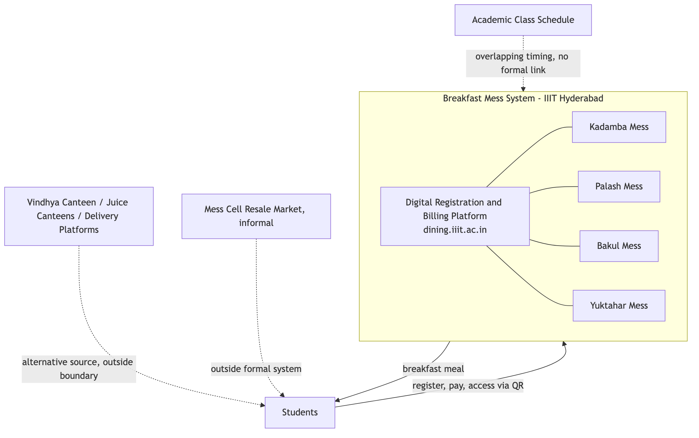

# System Boundary and Context

## System Boundary

The system under study is the breakfast meal registration, billing, and service process operated across the four residential dining messes at IIIT Hyderabad — Kadamba, Palash, Bakul, and Yuktāhār — together with the digital registration and billing platform (dining.iiit.ac.in) that governs access to all four. The boundary includes the interface between this system and the academic class schedule, since the two operate on overlapping but independently controlled timings.

On-campus alternatives that compete for the same demand — Vindhya Canteen, the juice canteens, and third-party food delivery services — sit at the edge of this boundary. They are not part of the mess system's own operation, but they materially affect it: a student who does not eat at a mess draws instead on one of these.

Lunch and dinner registration at the same four messes fall outside this boundary. The system described here is scoped to the breakfast meal, though it runs on the same underlying platform and the same rules as the other two meals.

## Context

The breakfast system serves the entire resident student population of the institute across four messes, operating daily from 7:30 AM to 9:30 AM. Total confirmed breakfast capacity across the four messes is approximately 2,755 registrations per day: Kadamba (700 vegetarian, 600 non-vegetarian), Bakul (350 vegetarian, 350 non-vegetarian), Palāsh (400), and Yuktāhār (340 regular, 15 Jain).

Structurally, the system combines centralized demand management with decentralized supply. A single digital platform governs registration, billing, and access across all four messes, while food production itself is distributed and non-uniform, and organized around cuisine rather than being interchangeable outlets. Kadamba serves South Indian food, vegetarian and non-vegetarian, and operates its own kitchen and vendor. Palash serves North Indian vegetarian food and cannot produce non-vegetarian food at all. Bakul serves North Indian food, vegetarian and non-vegetarian: its vegetarian food is cooked at Palash and physically transported to Bakul, while its non-vegetarian food is prepared on-site. Yuktāhār serves Jain-oriented food, with a separate Jain registration variant, and operates independently. Food procurement is handled separately by each mess's own vendor, not centrally. Four different cuisines, kitchens, and procurement arrangements are unified only at the registration, billing, and access layer — the mess system is not one kitchen serving one population through one process, but a coordinated platform sitting over four structurally different operations.

The system operates inside, and is shaped by, several adjacent systems it does not control:

- **Academic administration and class schedule.** Classes begin at 8:30 AM and run until 6:40 PM, with a class lunch break from 1:00 PM to 2:00 PM. Class scheduling is not continuous — most students have a limited number of classes on a given day — and there is no formal channel of coordination between the mess system and the academic calendar; the two schedules are set independently of one another by separate authorities.
- **Warden, Mess Committee, and Mess Office governance.** Mess governance is split across three actors. The Mess Committee is a policy body, chaired by a faculty member, that sets the menu and mess-specific policy, incorporating student input approximately one month ahead of service. The Mess Office is the operational arm: it places food orders with each vendor on a four-day lead time, administers the registration platform, and issues operational policy changes — a policy change tightening cancellation rules was issued by the Mess Office specifically to reduce staff workload. The Warden holds authority over vendor management and structural changes to the mess; the working relationship between the Warden and the Mess Office is not established.
- **An informal peer-to-peer resale market ("Mess Cell").** A WhatsApp group has formed in which students who hold a breakfast registration they will not use offer it for resale to other students at a negotiated price below the registered rate. This market operates entirely outside the mess system's own registration and billing infrastructure, transacted through the same personal QR-based access credential the formal system issues.
- **The wider campus food ecosystem.** Vindhya Canteen (open Monday to Saturday, from 10:00 AM), the juice canteens (open mornings), and delivery platforms (accepting orders until 11:00 PM, with delivery personnel required to remain outside the campus gate) all draw on the same student population and stand as alternatives to mess breakfast.

Billing operates on a monthly cycle tied to registration, not attendance: a student is charged for every meal they are registered for, regardless of whether they eat it, and may cancel a registration in advance, subject to a limit of five cancellations per meal type per month. Unregistered ("walk-in") access to a meal is priced materially higher than registered access to the same meal.

# Purpose and Intended Outcomes

## Purpose

The breakfast mess system exists to provide the resident student population with reliable, adequate, good-quality food each morning, at a predictable and affordable cost, accommodating dietary requirements — vegetarian, non-vegetarian, and Jain — in a manner that supports student health, energy, and academic performance.

## Intended Outcomes

- Every registered student obtains a breakfast meal matching their dietary requirement within the operating window.
- Food quality and preparation quantity remain consistent with actual demand, minimizing both shortage and waste.
- The cost structure remains affordable and predictable for students across a full semester.
- Access to breakfast does not depend on a student's ability to navigate informal workarounds; the formal system functions as the primary and sufficient channel on its own.
- The system remains responsive to changes in student needs and circumstances — schedule conflicts, dietary changes, feedback — through its own governance structure.

# Visible Symptoms and Underlying Issues

| Visible Symptom | Underlying Issue |
|---|---|
| A student registers for breakfast, does not attend, and is still charged the full registered price. | Billing is tied to registration, not attendance. The cost is incurred at the point of registering, independent of whether the meal is ultimately consumed. |
| The registration platform imposes a cap of five cancellations per meal type per month. | Uncancelled, unattended registrations occur often enough, across the student population, that an explicit limit was necessary to manage them — the cap is itself evidence of the scale of the pattern it constrains. |
| A "Skip Meal" function lets a student notify the kitchen in advance that they will not attend, but this does not reduce or refund the charge. | The mechanism built for anticipated non-attendance addresses only the kitchen's production planning, not the student's cost. It returns zero value to the student for the same situation a cancellation — capped at five per month — would address instead. |
| An unofficial, student-run resale market ("Mess Cell") has formed, where students sell registrations they will not use to other students at a negotiated price. | Reselling a registration returns partial or full value to the student, while using Skip Meal returns none. For a student who knows in advance they will not attend, resale is a materially better option than the system's own built-in mechanism for the same situation — the formal tool is outcompeted by an informal one because it was designed to reduce kitchen waste, not to return value to the student. |
| Registered-but-unclaimed meals persist despite both a cancellation option and a resale market being available. | Cancellation and resale both require advance knowledge that the student will not attend. Non-attendance decided at the last minute — oversleeping, running out of time, a change of plans — has no mechanism available to it at all; this is the specific category of registration that converts into prepared, uneaten food with no value returned to anyone. |
| Walk-in (unregistered) access to a meal costs substantially more than the same meal accessed through a prior registration. | The pricing structure creates a standing incentive to register in advance even when attendance is uncertain, since deciding same-day costs more. Registration counts are inflated by this incentive independent of a student's actual intention to attend. |
| Registered breakfast attendance is markedly lower, relative to capacity, at every mess serving North Indian food (Palash, Bakul) than at Kadamba, the South Indian mess — Kadamba runs 51-79% uptake against 11-36.5% at the North Indian lines. | The gap tracks cuisine, not any single mess's individual circumstances — it holds consistently across three independently operated messes sharing that one variable. Bakul's status as a newer mess, housed in a converted warehouse with part of its food transported in from Palash, remains a contributing factor, but the cuisine pattern is the stronger and better-evidenced explanation for the low uptake. |
| Neither students nor mess-side staff describe a specific example of mess feedback leading to a change in policy, hours, or operations. | Three real channels carry student input into the system — an in-app per-meal rating captured after every meal, a public email address for raising mess issues, and coverage of mess problems in Ping, the student publication. None of the three has a confirmed instance of producing a policy change. The overlap between breakfast hours and the academic schedule has never been formally raised for the same reason: there is no established path for a cross-authority issue to be escalated by either side, and no evidence that raising an issue through any existing channel changes an outcome. |
| Breakfast hours (7:30–9:30 AM) overlap with the start of the academic day (8:30 AM), while the two schedules are set by entirely separate authorities. | The Mess Committee, Mess Office, and Warden together control mess operations; the academic administration controls class scheduling; neither side has authority over the other's schedule, and no coordination mechanism links the two. A timing conflict between them can persist indefinitely without either side being positioned to resolve it unilaterally. |
| The registration platform includes a random-allocation mechanism, evidenced by a settings option to notify a student when they have been randomly allocated a meal. | Some registrations are generated by the system itself rather than by active student choice. Recorded registration counts do not uniformly represent expressed intent to attend. |
| A portion of students report skipping breakfast for reasons unrelated to the mess system's own operation — personal dietary practice, sleep schedule, and established habit. | Breakfast non-attendance is not driven by a single cause. It includes a population of students whose non-attendance would persist regardless of any change to mess hours, pricing, or process, because the driving factor is a personal routine formed independently of the mess system. |
| Students report that companionship affects whether they attend breakfast — attendance is more likely when a roommate or friend is also going. | Breakfast attendance, for at least part of the student population, is a socially coordinated decision rather than a purely individual one; a student's own registration does not reliably predict their attendance independent of who else is going that morning. |

# Key Actors, Institutions, Processes, Resources and Constraints

## Actors

- **Students** — the registrants and consumers of the meal; attendance and dietary preference vary across the population.
- **Mess Committee** — a faculty-chaired policy body that sets the menu and mess-specific policy, incorporating student input approximately one month in advance.
- **Mess Office** — the operational and administrative arm; places food orders with each vendor, administers the registration platform, and issues operational policy changes.
- **Warden** — holds authority over vendor management and structural changes to the mess.
- **Per-mess vendors** — Kadamba's vendor (South Indian); the shared Palash/Bakul vendor (North Indian); Yuktāhār's vendor (Jain-oriented).
- **Mess serving and cleaning staff** — also consume mess food after student service hours conclude.
- **Academic administration** — sets the class schedule; holds no authority over mess operations.
- **Students participating in the Mess Cell resale market** — an unofficial secondary role occupied by a subset of registered students.
- **Guests** — parents, visiting relatives, and non-student campus affiliates who pay the vendor directly for access.

## Institutions

- The Mess Committee (policy), the Mess Office (operations), and the Office of the Warden (vendor management and structural change) — three separate governance actors holding different parts of mess governance.
- The academic administration/timetable authority, operating independently with no formal link to any of the three mess-governance actors.
- The four mess vendors, each handling its own procurement and cooking, operating as independent entities under one shared registration platform.

## Processes

- **Registration** — a student selects a mess and meal date through the digital platform in advance of service.
- **Billing** — charges are applied monthly, calculated from registration count, independent of attendance.
- **Cancellation** — a registered meal may be cancelled in advance, up to five times per meal type per month, removing the associated charge.
- **Skip Meal** — a registered student may flag in advance that they will not attend; this notifies the kitchen for production planning but does not affect billing.
- **Access** — a student presents a personal QR code at the mess counter to receive a plate matching their registered dietary category. The code can be reset at any time, and mess staff can reassign it on the spot if a student eats at a different mess than the one registered.
- **Walk-in access** — a student without a registration may pay the vendor directly at a higher rate, subject to a separate, smaller capacity allocation.
- **Resale** — outside the formal platform, a registered student may transfer their registration to another student through the Mess Cell WhatsApp group, in exchange for a negotiated payment.
- **Menu setting** — the Mess Committee finalizes the menu approximately one month ahead of service, incorporating student input.
- **Food ordering** — the Mess Office places an order with each vendor four days ahead of service; vendors prepare food against that four-day-old figure, not against same-day registration or cancellation activity.
- **Feedback intake** — student input reaches the system through an in-app per-meal rating, a public email address, and coverage in the student publication Ping; none of the three has a confirmed record of producing a resulting policy change.

## Resources

- The digital registration and billing platform (dining.iiit.ac.in).
- Four physical mess facilities of differing capacity and origin — Kadamba (purpose-built, largest capacity), Bakul (a converted warehouse), and Palash and Yuktāhār as separate facilities.
- Per-mess food production capacity, distributed unevenly by cuisine — Kadamba (South Indian) and Yuktāhār (Jain-oriented) produce on-site; Bakul's North Indian vegetarian supply is transported from Palash while its non-vegetarian food is prepared on-site; each vendor procures its own ingredients independently.
- The personal QR access credential issued to each student.

## Constraints

- Billing is registration-based, not attendance-based, and cancellations are capped at five per meal type per month.
- Walk-in pricing is set materially higher than registered pricing.
- Vegetarian and non-vegetarian food is segregated by registration type at the point of service.
- Palash's kitchen cannot produce non-vegetarian food — a fixed physical limitation, not a policy choice.
- Mess operating hours and the academic class schedule are set independently by separate authorities, with no formal coordination mechanism between them.
- Governance authority over mess operations is split across the Mess Committee, the Mess Office, and the Warden; the academic administration has no formal role in mess-related decisions.
- Vendors order and prepare food against a four-day-old registration figure; nothing in the system lets same-day registration, cancellation, or Skip Meal activity change what is actually cooked.

# Initial Problem Framing

Many students register for breakfast and do not eat it. The meal is still cooked, and the student is still charged.

The system gives students two ways to avoid this: cancel the registration, or mark it as skipped. Skip Meal returns no money to the student — only cancellation does, and only five times a month per meal. Both require the student to decide in advance. A student who decides at the last minute has no option at all, and that meal is simply wasted. Students have built their own workaround outside the system — reselling registrations to each other — because it pays back more than the system's own tools do.

**The problem: registration does not reliably reflect who is actually going to eat. Why not, and what in the system is causing that gap?**
