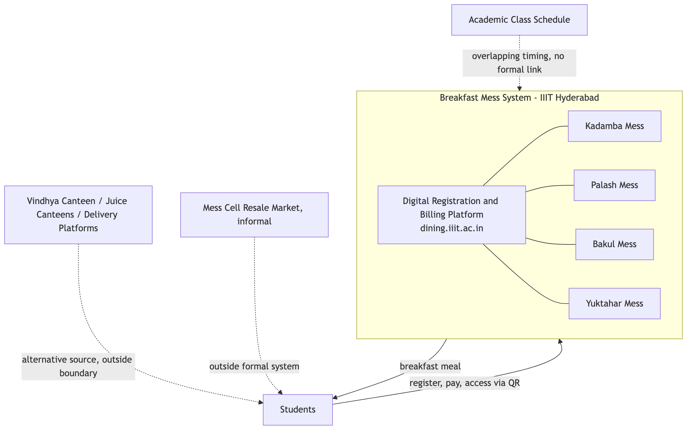
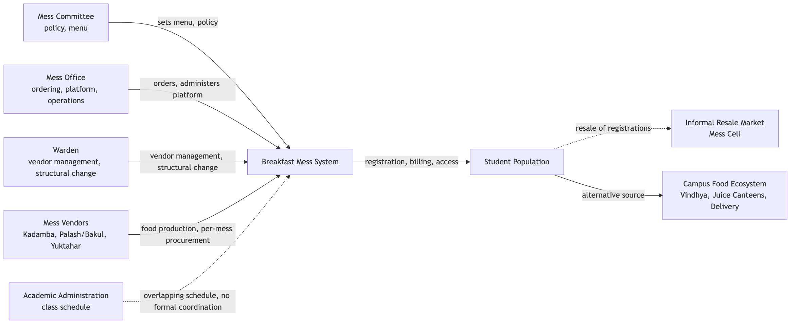

# System Boundary and Context

## System Boundary

The system under study is the breakfast meal as it is registered, billed, cooked and served across the four residential dining halls at IIIT Hyderabad: Kadamba, Palash, Bakul, and Yuktāhār. It has three layers, and all three sit inside the boundary.

- **The registration and billing layer.** The digital platform (dining.iiit.ac.in) through which students book, cancel and pay for meals, and the QR scan at the counter that records who actually ate.
- **The kitchen layer.** The outside catering firms that run each hall (Prism at Kadamba, ABC Hospitality Services at Yuktāhār, and Vijayalakshmi Caterers at Bakul, cooking in an off-site kitchen shared with Palash, whose own operator is not yet confirmed): their day-before or week-by-week quantity planning, their cooking, the pre-service food-safety checks, the counter, the live top-up during service, and the reuse or disposal of what is left. For Bakul and Palash this layer includes an off-site kitchen, the transport link that brings food in, and the hot holding of that food at the hall.
- **The governance layer.** The institutional bodies that set the menu, the registration and billing rules, and the vendor contracts.

Several actors sit on the boundary itself, exchanging material or information with the system without being run by it: the operators' suppliers (grocery, vegetables, milk, paneer), the garbage contractor that removes food waste, the institution's site team that relays complaints into the operators, the institution's facility team and weekly quality-control inspection, and the tender through which each operator is contracted. Non-student diners also draw on the same food across the boundary: at Kadamba, 30 to 50 people from outside the registration, such as night-shift security, and about half of the operator's own staff eat from what the kitchen cooks (single-sourced). The academic class schedule sits outside the boundary but shapes it directly, since the two run on overlapping but independently controlled timings.

On-campus alternatives that compete for the same demand (Vindhya Canteen, the juice canteens, and third-party food delivery) sit at the outer edge. They are not part of the mess system's operation, but they materially affect it: a student who does not eat at a mess draws on one of these instead.

Lunch and dinner at the same four halls fall outside the boundary, and they serve as the comparison that justifies it. The same platform, the same rules and the same operator produce very different turnout at the two meals: at Yuktāhār in September 2026, lunch attendance ran between 56 and 89 percent of registrations (15 of 20 days at 70 percent or above), while breakfast on the same days ran between 18 and 40 percent (confirmed from the operator's attendance register). The problem is specific to breakfast, which is why breakfast is the scoped meal.

## Context

The breakfast system serves the resident student population across four halls. The published service window is 7:30 AM to 9:30 AM. In practice, scans at Kadamba begin at about 7:28, service closes between 9:35 and 9:45, and the latest recorded scan in April 2026 was at 10:07 (confirmed from scan records). Kitchen staff start work between 5:00 and 5:30 AM, batch items are cooked from 5:30 and ready by about 7:30, and at Kadamba live items such as dosa are made at the counter from 7:00 (single-sourced, consistent across the operators). Bakul is the exception for labour-heavy items: because its food is cooked off site, preparation of items such as aloo paratha can start at about 3 AM so that the food reaches the hall at about 7 AM (single-sourced). Operator practice marked single-sourced is the operator's own account of its practice.

Capacity on the registration platform is approximately 2,755 breakfast registrations per day: Kadamba (700 vegetarian, 600 non-vegetarian), Bakul (350 vegetarian, 350 non-vegetarian), Palash (400), and Yuktāhār (340 regular, 15 Jain). Registered rates are ₹48 for a vegetarian breakfast and ₹66 for a non-vegetarian one at Kadamba, Bakul and Palash, and ₹53 at Yuktāhār. The same breakfast bought without prior registration costs ₹81 (vegetarian) or ₹111 (non-vegetarian) at the first three halls and ₹92 at Yuktāhār (confirmed from posted rates).

Registration volume is high and steady; turnout is low and variable. Kadamba recorded 32,162 breakfast registrations in April 2026, about 1,070 a day on every day of the week including Sunday, against 11,941 breakfasts actually scanned: a turnout of 37.1 percent and a no-show rate of 62.9 percent (confirmed from scan records). At Yuktāhār, breakfast registrations ran between 228 and 404 a day in September 2026, and turnout averaged about 28 percent (confirmed from the operator's register). Record-level turnout exists for these two halls only; there are no turnout records for Bakul or Palash. The only Bakul figure is its manager's estimate that at most about 60 percent of registered students come to breakfast (single-sourced; no records behind it).

Structurally, the system combines centralized demand management with decentralized supply. A single digital platform governs registration, billing and access across all four halls, while food production is distributed, non-uniform, and organized around cuisine rather than as interchangeable outlets. Kadamba serves South Indian food, vegetarian and non-vegetarian, planned separately, from an on-site kitchen run by Prism. Bakul serves North Indian food, vegetarian and non-vegetarian. Palash serves North Indian vegetarian food. Yuktāhār serves vegetarian Satvik food only, with a separate Jain registration variant, from an on-site kitchen run by ABC Hospitality Services (confirmed). Food for both Bakul and Palash is cooked in one approved off-site kitchen and transported in, a temporary arrangement until the Felicity Kitchen and Dining Facility opens, expected in December 2026 (confirmed). An earlier version of this brief stated that Bakul's vegetarian food was cooked at Palash and carried over; that finding has been revised. Bakul is run by Vijayalakshmi Caterers, which cooks at its Hafizpet kitchen about 8 km away, a drive of about 20 minutes early in the morning and about 40 minutes in normal traffic. Food travels in insulated boxes that hold it at about 60 to 72 °C, and at the hall the boxes stand in a hot-water setup (single-sourced). This revises an earlier reading of the same conversation, which left the hall unnamed and placed the kitchen near the airport. Palash is not mentioned in that account, so that Vijayalakshmi Caterers also serves Palash remains a candidate. Each operator procures its own ingredients on its own cadence. Four different cuisines, kitchens and procurement arrangements are unified only at the registration, billing and access layer: the mess system is not one kitchen serving one population through one process, but a coordinated platform sitting over four structurally different operations.

The system operates inside, and is shaped by, several adjacent systems it does not control:

- **Academic administration and class schedule.** Classes begin at 8:30 AM and run until 6:40 PM, with a lunch break from 1:00 PM to 2:00 PM. Most students have a limited number of classes on a given day, and there is no formal channel of coordination between the mess system and the academic calendar; the two schedules are set independently by separate authorities. Exams, events and holidays reach the kitchen only if someone raises them in the operator's own planning meeting: the Yuktāhār site head put it as "we don't come to know until we sit in the meeting" (confirmed).
- **Institutional governance: Mess Committee, Mess Office, and Warden.** The Mess Committee is a policy body, chaired by a faculty member, that sets the menu and mess-specific policy, taking student input about one month ahead of service. The Mess Office is the operational arm: it administers the registration platform, from which each operator reads its registration count, and issues operational policy changes; a policy change tightening cancellation rules was issued specifically to reduce staff workload. The Warden holds authority over vendor management and structural changes; the working relationship between the Warden and the Mess Office is not established. The operators refer to the institution's side as the "CDS team". The Kadamba operator describes its line of authority as running from CFS to CDS, then to Prism, and down through an operations manager, a manager and a supervisor to the service staff (single-sourced). The person the operator names as head of CDS is not the person an earlier institutional interview named as CDS Chair; whether these are two roles or one misattributed name is an open question. Whether CDS is the same body as the Mess Office, and how CFS relates to the Mess Committee and the Warden, is unconfirmed.
- **The catering operators and their contracts.** Each hall is run by an outside catering firm chosen by tender and paid monthly as a lump sum on the number of plates, with deductions (single-sourced). Whether "plates" means registered plates or plates actually served is not known, and it decides who bears the cost of a no-show. Kadamba's operator speaks of being paid for what is registered (single-sourced), which points to a registered-plate basis but does not confirm it (candidate). Bakul's operator reports that its monthly payment is based on the number of plates served (single-sourced). The two remarks pull in opposite directions: the contracts may differ by operator, or one remark may describe a duty or a billed count rather than the payment formula. The basis therefore stays unconfirmed for every operator, and Bakul's account is not taken to hold for the others. The institution sets the menu and the registration and billing rules; the operator decides how much to cook. The operators are organised differently. Prism, which wins the Kadamba contract by tender and runs all of Kadamba's operations, is layered: a supervisor watches the counters and tells the kitchen how much to cook, under a manager and an operations manager (single-sourced). A separate short staff recording, not tied to one mess, describes staff reporting to a supervisor, then a manager, an operations manager and a director (single-sourced); reading it as Prism's chain is a candidate. Yuktāhār's operator has no hierarchy on site: staff rotate across every job and check one another's records (single-sourced). Each also runs its own complaint route, in which complaints from the institution's site team or by email reach the manager and then the kitchen, at Kadamba through a WhatsApp group (single-sourced at each of two operators).
- **An informal peer-to-peer resale market ("Mess Cell").** A WhatsApp group in which students who hold a breakfast registration they will not use offer it to other students at a negotiated price below the registered rate. It operates entirely outside the platform, transacted through the same personal QR credential the formal system issues. Kadamba's manager independently describes students who register "even if you are in the village" while a friend eats in their place (single-sourced): operator-side corroboration that registrations are transferred informally, though not of Mess Cell specifically.
- **The wider campus food ecosystem.** Vindhya Canteen (open Monday to Saturday, from 10:00 AM), the juice canteens (open mornings), and delivery platforms (accepting orders until 11:00 PM, with delivery personnel required to remain outside the campus gate) all draw on the same students and stand as alternatives to mess breakfast.

Registration is automatic: every student is registered for every meal by default, whether on campus or not, holidays included (confirmed). The only way out is a cancellation, allowed five times per meal type per month and only at least four days before the meal; beyond that, a registered meal cannot be removed from the bill (confirmed). Billing operates on a monthly cycle tied to registration, not attendance: a student is charged for every meal they are registered for, regardless of whether they eat it. Operators describe breakfast counts as reaching them in weekly blocks (single-sourced), while students interviewed earlier described registration as monthly; how the automatic default is batched on the platform is unconfirmed. Unregistered ("walk-in") access costs roughly 70 percent more than registered access to the same meal.

# Purpose and Intended Outcomes

## Purpose

The breakfast mess system exists to provide the resident student population with reliable, adequate, good-quality food each morning, at a predictable and affordable cost, accommodating dietary requirements (vegetarian, non-vegetarian, Jain) in a manner that supports student health, energy and academic performance.

The institution states its own objective in the same terms and names its method: to "provide nutritious, hygienic, and affordable meals while ensuring efficient operations and minimizing food wastage through advance meal planning." Advance registration is the mechanism the institution relies on to match food to demand.

## Actual Mechanism

Registration is a default rather than a choice. Every student is registered automatically, and the only way out is one of five cancellations per meal type per month, made at least four days ahead (confirmed). The booking therefore records the absence of an opt-out, not a decision to eat. It stays flat across the week: Kadamba's roughly 1,070 daily breakfast registrations hold steady from Monday to Sunday while turnout varies by weekday, from 42.1 percent on Tuesdays to 27.3 percent on Sundays (confirmed from scan records). Billing follows the booking, not the meal.

The kitchen does not cook to the booking. Each operator reads the closed registration count ahead of service (the day before at Yuktāhār and Kadamba) and applies its own discount to it:

- **Yuktāhār** plans in daily meetings attended by all staff, one in the first half of the day for the next day's breakfast and lunch and one later for snacks and dinner. It reads portal registrations alongside a Wastage Book entry for the matching day of the menu cycle (the menu repeats every two weeks, so a week-3 Thursday is planned from the week-1 Thursday), an attendance register grouped by weekday, the month's turnout pattern, and any holidays, special weeks or campus events. The Wastage Book records, per item, raw issued, cooked, left over, percentage wasted and the time the item ran out, and it is used as a rule: an item that runs out well before close is re-cooked, one that runs out near close is not (confirmed from the operator and its records). During service, the first half hour is used as a sample to project how many will come for the rest of the meal, which drives top-up cooking (single-sourced). That sample is taken before the closing crest in which about a quarter of Kadamba's breakfast diners arrive; whether Yuktāhār has the same crest is not measured (candidate).
- **Kadamba** cooks a first batch for about 70 percent of registrations, planned separately for vegetarian and non-vegetarian, and portioned by a gram standard for each dish (four idlis or 100 g of sambar per person, for example). It keeps the rest of the raw material ready, and a supervisor watches the counters and tells the kitchen how much more to cook, within 10 to 15 minutes, from registrations and the turnout so far (single-sourced). It keeps no record that carries one day's outcome into the next day's ratio; its manager says of past attempts that "it was wasted many times" (single-sourced). Biryani lunch, outside the boundary, is the contrast case: it is cooked for 100 percent of registrations (single-sourced).
- **Bakul (Vijayalakshmi Caterers)** cooks a first batch for 70 to 80 percent of registrations, the share depending on the item. The manager sets it from past attendance, reviewed week by week: if Mondays have drawn about 70 percent, he cooks for about 80 percent that day (single-sourced). Whether that history is written down or carried in his head is not known. His stated rule is that there should be no shortage, even if some food is wasted, and on weekends, when he describes breakfast turnout as very low, he still keeps food for about 70 percent of registrations (single-sourced). During service he checks every 30 minutes the food left, the registrations and the demand still expected, and phones the Hafizpet kitchen with a rough quantity, which is cooked there and driven over, on a lead time that is not known (single-sourced).

Kadamba's fixed ratio is not calibrated to measured breakfast turnout. Bakul's ratio is adjusted, but by the manager's weekly judgement rather than from any known record, and only down to the floor set by its no-shortage rule, so Bakul sits between Kadamba's fixed ratio and Yuktāhār's books. This revises an earlier reading of Bakul's ratio as fixed and uncalibrated like Kadamba's. Yuktāhār's planning is the exception in method, since it learns from its own recorded outcomes. A first batch of 70 percent of registrations at Kadamba would be roughly twice the 37.1 percent that arrives (candidate). On the Bakul manager's own figures, both his first batch and his weekend floor sit above the highest breakfast turnout he expects, about 60 percent, and if Bakul's real turnout resembles the two recorded halls the margin is larger (candidate; there are no Bakul records to size it). Yuktāhār's site head believes breakfast turnout is about 50 percent, while his own register records a September average of about 28 percent (confirmed). Shortfalls during service are covered by top-up cooking. Surplus is absorbed by reuse at Yuktāhār (leftover idli becomes idli upma or idli poha for lunch, batter returns to the fridge, surplus milk is set as curd); at Kadamba by about 30 to 50 people from outside the registration, such as night-shift security, for whom about 30 extra portions are cooked, and by about half of the operator's own staff, who eat from the same food; and by the bin (confirmed for Yuktāhār, single-sourced for Kadamba). This revises an earlier figure of 20 to 30 staff eating after students at Kadamba. The team also observed Kadamba food cooked ahead, reheated and moved between vessels several times before it is eaten, which suggests that part of the surplus is held into later service rather than discarded (candidate).

Kadamba's operator puts daily waste at about 5 to 10 percent, without saying of what (single-sourced). A first batch at 70 percent of registrations against 37 percent turnout could produce that little waste only if most of the difference is eaten by the extra diners, held and reheated into later service, or offset by smaller top-ups, or if the figure is measured on a different base. Which of these holds is not known.

The two operators with on-site kitchens read the same registration count with different aims. Kadamba's treats the count as its obligation: it cooks to registrations whether or not people want to eat, "because it is a responsibility and they are getting paid for it". Yuktāhār's names best quality, less waste, lower operating cost and higher profit together as its management goals, so waste reduction is a cost lever for it (single-sourced for both). Bakul's operator states a third aim, no shortage even at the price of some waste (single-sourced).

## Gap Between Purpose and Mechanism

The stated method, advance meal planning, depends on advance registration expressing an intention to eat. Under automatic registration it cannot: the count records who has not opted out. For breakfast the difference is large: registrations overstate turnout by about 2.7 times at Kadamba and about 3.5 times at Yuktāhār (confirmed from records). Every operator therefore plans against a number it knows to be inflated and discounts it by its own rule. The gap between registration and turnout is already measured, in the institution's scan records and in the operators' own registers, but no route carries that measurement into the registration rules or the billing rules, and inside the kitchens it has not produced a discount matched to breakfast turnout. At Bakul the gap is judged week by week by the manager, and no written record of it is known, so there the measurement may exist only in one person's head.

## Intended Outcomes

- **Every registered student obtains a breakfast matching their dietary requirement within the operating window.** Under strain at the close: the Kadamba kitchen reopens the door for 5 to 10 minutes for late arrivals, and students who arrive after 9:30 also come in through the back door and are served, since the mess cannot refuse them (single-sourced); the Kadamba and Yuktāhār operators describe cooking more during the final surge (confirmed at Yuktāhār, single-sourced at Kadamba). Bakul's manager instead keeps food for about 50 people at 9:20 to cover a late tail he puts at 10 to 15 arrivals in the last ten minutes (single-sourced). This revises an earlier statement that all three operators cook more in a closing surge.
- **Food quality and preparation quantity remain consistent with actual demand, minimizing both shortage and waste.** Not met, and this is the most clearly measured failure. At Kadamba the first batch is set well above breakfast turnout, yet kitchens run short in the last fifteen minutes before close, when arrivals peak (Kadamba turnout and arrival peak confirmed from records; cooking ratios and closing shortages single-sourced). Quality is also at risk: at Kadamba the team observed food cooked ahead and reheated and moved between vessels several times before it is eaten, which it judged to lower quality (candidate). At Bakul, food arrives hot, but steam in the insulated boxes softens items such as aloo paratha, which may have been prepared from about 3 AM (single-sourced): the transport keeps temperature and can cost texture.
- **The cost structure remains affordable and predictable for students across a full semester.** Predictable but not efficient: at Kadamba in April 2026, 20,221 registered breakfasts were billed and not eaten (confirmed from scan records).
- **Access to breakfast does not depend on a student's ability to navigate informal workarounds.** Not met: students resell registrations to one another outside the system, and operators describe friends eating on another student's registration.
- **The system remains responsive to changes in student needs and circumstances through its own governance structure.** Met inside each operator, not across the operator and the institution. Operators adjust quantities and item mix from what they observe, but the institution's exam, event and holiday calendar reaches them only informally, and operators have little say over the menu they cook.

# Visible Symptoms and Underlying Issues

| Visible Symptom | Underlying Issue |
|---|---|
| About two thirds of breakfast registrations go unused. At Kadamba in April 2026, 37.1 percent of 32,162 breakfast registrations were eaten; at Yuktāhār in September 2026, breakfast turnout averaged about 28 percent. At Yuktāhār, lunch on the same days ran between 56 and 89 percent (confirmed from records). | Registration is an automatic default rather than a record of the morning's decision to eat (confirmed). The same platform and rules work reasonably at Yuktāhār lunch, the one lunch with records, so the cause is specific to breakfast (candidate for the other halls). Its timing against the 8:30 class start, late sleep, and the four-day-ahead exit from the default are the candidate causes. This revises an earlier working estimate of a gap of about 30 percent, which matches lunch rather than breakfast. |
| Kadamba's breakfast registrations stay flat at about 1,070 a day on every day of the week, Sunday included, while turnout varies by weekday, from 42.1 percent on Tuesdays to 27.3 percent on Sundays. Yuktāhār's Sunday breakfasts run between 18 and 24 percent, among its lowest (confirmed from records). Bakul's manager describes weekend breakfast turnout as very low (single-sourced; no records). | Every student is registered by default, and the only exit closes four days ahead (confirmed), so the count reflects a default set days earlier and cannot follow the day-to-day variation in who eats. |
| A student registers for breakfast, does not attend, and is still charged the full registered price. | Billing is tied to registration, not attendance. The cost is incurred at the point of registering, independent of whether the meal is eaten. |
| The registration platform imposes a cap of five cancellations per meal type per month, each made at least four days ahead; beyond the five, there is no way to remove a meal from the bill (confirmed). | The cap limits exits from a default booking, rather than limiting bookings. Uncancelled, unattended registrations occur often enough that an explicit limit was set on leaving the default; the cap is itself evidence of the scale of the pattern it constrains. |
| A "Skip Meal" function lets a student flag in advance that they will not attend, but this does not reduce or refund the charge. | The mechanism built for anticipated non-attendance is designed to inform the kitchen, not to reduce the student's cost. It returns nothing to the student for the same situation a cancellation, capped at five per meal type per month, would address. Whether it changes what Kadamba cooks is unresolved: the institution's account says the declarations reach the kitchen, while Kadamba's operator says it cooks on registrations alone (single-sourced). None of the three operators names Skip Meal among the inputs to its planning. |
| An unofficial, student-run resale market ("Mess Cell") has formed, where students sell registrations they will not use to other students at a negotiated price. | Reselling a registration returns partial or full value to the student, while Skip Meal returns none. For a student who knows in advance they will not attend, resale is materially better than the system's own mechanism for the same situation; the formal tool is outcompeted because it was designed to reduce kitchen waste, not to return value to the student. |
| Registered-but-unused meals persist despite both a cancellation option and a resale market being available. | Cancellation and resale both require advance knowledge that the student will not attend. Non-attendance decided at the last minute (oversleeping, running out of time, a change of plans) has no mechanism at all. |
| Walk-in access to a breakfast costs roughly 70 percent more than the same breakfast booked in advance (₹81 against ₹48 for vegetarian). At Yuktāhār walk-in diners are rare: unregistered, paying, and faculty or staff diners together number between 0 and 12 at a breakfast (confirmed from records). | The pricing creates a standing incentive to register in advance even when attendance is uncertain, since deciding on the day costs more. Registration counts are inflated by this incentive independent of a student's intention to attend. |
| Registration fill relative to capacity varied by cuisine on one day in September 2026: Kadamba's lines were 51 to 79 percent booked, against 11 to 36.5 percent at the North Indian lines (Bakul and Palash). | This row previously described these figures as attendance and treated cuisine as the main explanation for low breakfast uptake; that finding has been revised. The figures are registrations as a share of capacity, taken from a single platform snapshot, and the snapshot is inconsistent with the operator's own register for the same day at Yuktāhār (116 registered on the platform against 276 in the register), so it was probably not a final count. Cuisine preference is a candidate influence on where students register. It is not an explanation of breakfast turnout: measured turnout at Kadamba (37.1 percent) is only modestly higher than at Yuktāhār (about 28 percent), and within Kadamba the most-booked line, vegetarian, has the lowest turnout (32.4 percent against 48.5 percent for non-vegetarian). No turnout records exist for Bakul or Palash. |
| Breakfast arrivals pile up at the end of the window. At Kadamba, 26.5 percent of all breakfast scans fall between 9:15 and 9:30 and a further 13.5 percent between 9:00 and 9:15; the rate climbs to about nine scans a minute at 9:29 (confirmed from scan records). Yuktāhār's operator also describes the rush as coming at closing time. Kadamba's operator plans around roughly 150 arrivals in the last ten minutes, reopens the door for late arrivals, and serves students who come in through the back door after close (single-sourced). Bakul's manager describes an earlier peak, between 8:00 and 8:30, with about 10 to 15 people arriving in the last ten minutes (single-sourced; no Bakul records). This revises an earlier statement that all three operators describe the rush as coming at closing time. | Students who do come arrive as late as the window allows; late waking, the reason students most often give for skipping, is the candidate driver. Operators must keep food available until the last minute, which drives both cooking "just in case" and shortages at the close. This is the only symptom in which shortage and waste occur together. The shape of the arrival curve differs by hall: the closing crest is recorded at Kadamba and described at Yuktāhār, while Bakul's manager describes a mid-window peak and a small late tail. |
| Operators cook well above breakfast turnout. Kadamba's operator plans a first batch of 70 percent of registrations, for vegetarian and non-vegetarian separately, against a measured Kadamba breakfast turnout of 37 percent. Bakul's manager cooks for 70 to 80 percent, by item, and keeps food for about 70 percent even on weekends, against his own estimate that at most about 60 percent come (single-sourced; no Bakul records). Yuktāhār's site head believes breakfast turnout is about 50 percent; his own register shows about 28 percent (confirmed). | Each operator applies its own conversion factor to a registration count it knows is inflated. Kadamba applies a fixed ratio with reactive top-up and no record of outcomes; Bakul adjusts its ratio week by week from the manager's reading of past attendance, never below a floor kept against shortage; Yuktāhār learns from its own books and re-projects from the first half hour of service. Only Yuktāhār's method is known to feed recorded outcomes back into planning, and even that operator, with the most complete records, misremembers its own breakfast figure. Bakul's 60 percent is likewise an operator's belief: if Bakul resembles the two recorded halls, at 28 to 37 percent, it is an upper bound rather than the norm (candidate). |
| At Kadamba, food is cooked ahead, reheated several times and moved between vessels for display and service; the team judged its quality to fall quickly (candidate). | A first batch cooked well above turnout is held rather than discarded, so surplus reappears as reheated food later in service. Whether this lowers attendance is not evidenced; it is an open chain, not a loop. |
| Some breakfast items are wasted every time they appear: at Kadamba, uttapam, set dosa and upma, while puri, bonda, vada and idli are eaten, often beyond the per-person standard (single-sourced). At Kadamba, dinner sambar was dropped, and a student complained that it was removed while charges rose. At Bakul, the manager names pav bhaji as an item that brings more students to breakfast and muesli and Chocos as items that go readily, and objects to some of the pairings students choose rather than to the dishes, for example kachori, which he would pair with chole, or Raj Kachori listed with chana where he would serve aloo curry (single-sourced; his view, untested with Bakul residents). | The menu is chosen by students and the committee; item-level waste and uptake are observed only by the operator; no route connects the two. The two-week menu cycle already structures item-level records at Yuktāhār (confirmed), but those records inform the kitchen's quantities, not the choice of menu. |
| No student describes a specific example of mess feedback leading to a change in registration, billing, or hours. | Three channels carry student input: an in-app per-meal rating, a public email address, and coverage in the student publication Ping. None has a confirmed instance of changing registration, billing or hours policy; the one reported policy change driven by student feedback is the move to a two-week menu rotation (single-sourced). Change does happen inside the operators: Yuktāhār began tracking waste in August of the previous year, its managers made the weighing blame-free, and by December its staff reported that waste had fallen (single-sourced), and Kadamba cut ragi idli and increased plain idli from observed uptake (single-sourced). These are operator-level adjustments that never reach institutional policy. The overlap between breakfast hours and the academic schedule has never been formally raised, because there is no established path for a cross-authority issue to be escalated by either side. |
| Breakfast hours (7:30 to 9:30 AM) overlap with the start of the academic day (8:30 AM), and the two schedules are set by separate authorities. A student who wakes late enough to conflict with an 8:30 class reports prioritizing class attendance over breakfast specifically because of the academic attendance policy. | The Mess Committee, Mess Office and Warden control mess operations; the academic administration controls class scheduling; neither has authority over the other's schedule, and no coordination mechanism links the two. A timing conflict between them can persist indefinitely without either side being positioned to resolve it alone. |
| Students are registered automatically for every meal, whether or not they are on campus (confirmed). The platform also has a settings option to notify a student when they have been randomly allocated a meal. | Registration counts record the absence of an opt-out, not an intention to attend. This revises an earlier reading that only some registrations were system-generated. How random allocation works alongside the default is unconfirmed. |
| A portion of students report skipping breakfast for reasons unrelated to the mess system's operation: personal dietary practice, sleep schedule, and established habit. | Breakfast non-attendance is not driven by a single cause. Part of it would persist regardless of any change to mess hours, pricing or process, because it rests on a personal routine formed independently of the mess system. |
| Students report that companionship affects whether they attend breakfast: attendance is more likely when a roommate or friend is also going. | For at least part of the student population, breakfast attendance is a socially coordinated decision; a student's own registration does not reliably predict their attendance independent of who else is going that morning. |

# Key Actors, Institutions, Processes, Resources and Constraints

## Actors

- **Students:** the registrants and consumers of the meal; attendance and dietary preference vary across the population.
- **Mess Committee:** a faculty-chaired policy body that sets the menu and mess-specific policy with student input.
- **Mess Office:** the operational and administrative arm; administers the registration platform, from which operators read their registration counts, and issues operational policy changes. The operators call the institution's side the "CDS team" and describe a site team that relays complaints to them; whether these are the same body as the Mess Office is unconfirmed.
- **CFS and CDS:** named by the Kadamba operator as the institutional line above the vendor (single-sourced). Their relation to the Mess Committee, the Mess Office and the Warden is unconfirmed, and the identity of the CDS head is an open question, since the operator and an earlier institutional interview name different people.
- **Warden:** holds authority over vendor management and structural changes to the mess.
- **Catering operators:** ABC Hospitality Services at Yuktāhār (confirmed); Prism, an outside vendor contracted by tender, which runs all of Kadamba's operations (single-sourced); and Vijayalakshmi Caterers, which runs Bakul from its Hafizpet kitchen (single-sourced). This revises an earlier reading of Prism as the name of Kadamba's floor team, and an earlier reading in which Vijayalakshmi's hall was unnamed; whether it also serves Palash is a candidate.
- **Operator staff at Bakul:** a manager, about a month in the post but with about 20 years' experience of North Indian food, who sets the first batch, checks the counter every 30 minutes and phones the Hafizpet kitchen for more (single-sourced).
- **Operator staff at Kadamba:** a layered chain under Prism of operations manager, manager, supervisor and service staff, with about 10 chefs led by a main vegetarian chef; the supervisor watches the counters and calls for more cooking (single-sourced).
- **Operator staff at Yuktāhār:** 16 staff with no hierarchy, who rotate across every job, work in tasting, cutting and cleaning teams, and cross-check one another's records; the mess in-charge also keeps the accounts and the Wastage Book, and a colleague cross-verifies the grocery register. Two project managers, with some site staff sharing project-management work, run records and hygiene. There is no formal leave policy: an absence is raised in the daily meeting and colleagues agree to absorb the load (single-sourced). This revises an earlier figure of a five-person project management team.
- **Non-student diners at Kadamba:** 30 to 50 people from outside the registration, such as night-shift security, and about half of the operator's own staff eat from the same food (single-sourced). This revises an earlier figure of 20 to 30 staff.
- **Suppliers and waste contractor:** grocery, vegetable, milk and paneer suppliers for each operator, and the garbage contractor that removes Kadamba's food waste.
- **Quality control:** a weekly QC inspection, and at Kadamba a facility team that tastes each meal with two Prism staff before service (single-sourced; the tasting was observed). Faculty quality-control visitors are also described as inspecting the operators' stores (single-sourced).
- **Academic administration:** sets the class schedule; holds no authority over mess operations.
- **Students participating in the Mess Cell resale market:** an unofficial secondary role occupied by a subset of registered students.
- **Guests and walk-in diners:** parents, visiting relatives, faculty, staff and other campus affiliates who pay the spot rate for access.

## Institutions

- The Mess Committee (policy), the Mess Office (operations), and the Office of the Warden (vendor management and structural change): three separate governance actors holding different parts of mess governance. The Kadamba operator names a different line, CFS and then CDS (single-sourced); how the two descriptions map onto each other is unconfirmed.
- The academic administration and timetable authority, operating independently with no formal link to any of the three mess-governance actors.
- The tender and the monthly per-plate payment through which each operator is contracted, with deductions (single-sourced; the basis of "plates" is unknown, since Bakul's operator reports plates served while Kadamba's remark points to registrations).
- The operators' own record systems. Yuktāhār keeps a set of paper books, each photographed (confirmed): a daily meal Wastage Book recording, per dish, raw issued, cooked, left over, percentage, run-out time, re-cook quantity, registered and eaten counts, and student plate waste; a weekday attendance register; a wastage board kept in view; a grocery issue book headed with the day's registrations; a store and ingredient book; a stock register; a vegetable book and indent with spoilage remarks; a milk, fruit, gas, electricity and water register; and fridge temperature and cleaning logs. The issue book must reconcile with what was cooked, and any mismatch is raised in the same day's meeting (single-sourced); on the day checked, the issue book and the stock register agree (confirmed). Cross-checking is described by the site head as "not to find fault", and weighing was made blame-free deliberately when it began (single-sourced). These books function as an informal institution that holds the system's most detailed demand data.
- The food-safety regime: an external "Eat Right Campus" certification and laboratory testing of suspect food. At Kadamba, every meal passes a fixed sequence before service: the cooking temperature is checked, a sample is retained for 72 hours so that any illness can be traced, a wrapped display plate is set at the entrance, the serving temperature of each item is measured, and the facility team tastes the food with two Prism staff and orders corrections. QC inspects weekly, and the TDS of cooking and drinking water is read daily, with a failure triggering a full check (single-sourced; the display plate and tasting confirmed by observation).

## Processes

- **Registration:** students are registered automatically for their hall and dietary category, on campus or not; the student's action is to opt out, not to opt in (confirmed). Operators describe the counts as reaching them in weekly blocks (single-sourced).
- **Billing:** charges are applied monthly, calculated from registrations, independent of attendance.
- **Cancellation:** a registered meal may be cancelled at least four days ahead, up to five times per meal type per month, removing the charge; no other route removes a meal from the bill (confirmed).
- **Skip Meal:** a registered student may flag in advance that they will not attend. It is designed to inform the kitchen and does not affect billing. Whether it changes what Kadamba cooks is unresolved: the institution's account says the declarations reach the kitchen, while Kadamba's operator says it cooks on registrations alone (single-sourced).
- **Menu setting:** the Mess Committee sets the menu with student input; operators describe a student committee choosing from options the operator offers. Bakul's manager says students choose the combinations, reasoning from a balanced diet, protein and their own preferences, and he mentions a target of about 30 to 40 g of protein per meal, while he would pair dishes by traditional and regional pattern and by what people actually eat (single-sourced; his account of the students' reasoning is untested). The menu runs on a two-week cycle in which weeks 1 and 3 repeat and weeks 2 and 4 repeat (confirmed from Yuktāhār's records).
- **Procurement:** each operator buys on its own cadence. At Yuktāhār, groceries fortnightly, vegetables two or three times a week, milk daily (confirmed); at Kadamba, dry goods such as rice, groundnut, masala and ghee one week ahead, some vegetables two or three days ahead, and milk, fruit, meat, eggs and most vegetables the day before (single-sourced). Yuktāhār buys raw materials from many local shops and godowns; its store cleans and sorts them before issue against an expected impurity norm for each item, above which the supplier is challenged or changed (confirmed for the cleaning, single-sourced for the norm), and the operator visits mills to check how inputs are made (single-sourced).
- **Quantity planning:** the operator reads the closed registration count the day before and applies its own conversion to it. At Yuktāhār this happens in daily planning meetings using the matching-day Wastage Book, the weekday attendance register, the month's turnout and the event calendar, and produces a written per-meal issue list (confirmed for the books and the issue list, single-sourced for how the meeting uses them); at Kadamba the first batch is a fixed 70 percent of registrations, set separately for vegetarian and non-vegetarian and portioned by per-dish gram standards (single-sourced); at Bakul the manager sets 70 to 80 percent by item and revises the share week by week from past attendance (single-sourced). This revises an earlier version of this brief, which described the Mess Office placing food orders four days ahead and vendors cooking against that four-day-old figure: the four-day lead applies to registration, while quantities are set by the operator the day before.
- **Cooking and top-up:** the first batch is cooked from 5:30 (from about 3 AM for labour-heavy items bound for Bakul) and, at Kadamba, passes the food-safety checks before service. At Yuktāhār, the first half hour of service is used to project the rest of the meal (single-sourced); from about 45 minutes before close, staff check the counter every 30 minutes and open a second counter during surges, and at peak two counters serve handmade rotis cooked without oil (confirmed). At Kadamba a supervisor watches the counters and calls for more (single-sourced). Every operator cooks more on demand, within 10 to 15 minutes on site at Kadamba (single-sourced). Bakul's manager phones the Hafizpet kitchen, which cooks the extra and sends it by road, on a lead time that is not known (single-sourced).
- **Access:** a student presents a personal QR code at the counter to receive a plate matching their registered dietary category. The code can be reset at any time, and staff can reassign it if a student eats at a different hall. When the scanner fails, staff write down the student's ID and name by hand (single-sourced).
- **Late entry:** at Kadamba, the door is reopened for 5 to 10 minutes after close for late arrivals, and students arriving after 9:30 also come in through the back door and are served; on one biryani day 25 students came after close (single-sourced).
- **Walk-in access and extra portions:** a student without a registration may pay the spot rate, subject to a separate, smaller allocation. Kadamba cooks about 30 extra portions beyond registrations; the operator described these as for outside diners such as night-shift security, and an earlier recording as 30 to 40 portions for paying walk-ins (single-sourced). Whether they are one allocation or two is unconfirmed.
- **Leftover reuse and disposal:** Yuktāhār reuses leftovers (idli becomes idli upma or idli poha for lunch, batter returns to the fridge, milk is set as curd) and weighs student plate waste and kitchen waste (confirmed). At Kadamba, held food is reheated for later service (candidate), and waste is disposed of in a dustbin emptied by a garbage contractor, with no composting (single-sourced). This revises the earlier understanding that composting absorbs the surplus. The institution's side had described waste going via a collector to an outside compost facility; whether the contractor takes Kadamba's waste there is unverified.
- **Resale:** outside the platform, a registered student may transfer their registration to another student through the Mess Cell WhatsApp group in exchange for a negotiated payment.
- **Feedback intake:** student input reaches the system through an in-app per-meal rating, a public email address, and coverage in Ping. Complaints to operators pass from the institution's site team or email to the operator's manager and then the kitchen (single-sourced).

## Resources

- The digital registration and billing platform (dining.iiit.ac.in) and the scan-level record it produces of who ate and when. The institution holds this record; it measures the registration-to-turnout gap for every meal it scans (confirmed for Kadamba breakfast; assumed for other halls and meals).
- The operators' records. At Yuktāhār: the Wastage Book, the weekday attendance register, the wastage board, the grocery issue book, the store and ingredient book, and stock, vegetable, milk, fruit, gas, electricity, water and fridge registers (confirmed); utility readings are used too, for example a Wednesday electricity peak from grinding idli batter informs how long machines run (single-sourced). Yuktāhār tried a commercial ERP to streamline purchasing and predict the rush, and dropped it, judging its own books sufficient for the cost and its staff not suited to digital tools; office staff digitise the books later (single-sourced). At Kadamba: per-dish gram standards, the live count watched during service, a waste figure, retained 72-hour samples and a daily water-quality log (single-sourced). At Bakul no written record of attendance, consumption or waste is known. The gap between registration and turnout is therefore already measured locally, by the people who cook.
- Four dining halls of differing capacity and origin: Kadamba (purpose-built, largest), Bakul (a converted warehouse), Palash, and Yuktāhār.
- Production capacity distributed by cuisine: on-site kitchens at Kadamba and Yuktāhār; one off-site kitchen and a transport link serving Bakul and Palash. For Bakul this is the Hafizpet kitchen, about 8 km away, with insulated boxes on the road and a hot-water holding setup at the hall (single-sourced).
- Ingredients chosen on a quality-and-cost stance at Yuktāhār, which has used rock salt and cold-pressed oil for about six months (single-sourced).
- Kitchen equipment and storage, including a cold room run on first-in, first-out labels at Yuktāhār (confirmed). Kadamba's bread toaster is broken and not yet replaced, and an LPG shortage was handled by cutting quantities and buying some items outside (single-sourced).
- The personal QR access credential issued to each student.

## Constraints

- Registration is automatic, billing is registration-based, not attendance-based, and cancellations are capped at five per meal type per month, each at least four days ahead (confirmed).
- The exit from breakfast registration closes four days ahead. Kadamba buys dry goods a week ahead, some vegetables two or three days ahead and all other perishables the day before (single-sourced). Only non-perishable stock is committed before the four-day close, so the kitchen's own supply chain does not need the four-day lead (candidate).
- At Kadamba, before service, each item passes a cooking-temperature check, a retained sample, a display plate, a serving-temperature check and a tasting (single-sourced). The first batch must therefore be cooked and approved before the first diner arrives, before any sign of the day's turnout exists (candidate). At Bakul the first batch is fixed even earlier, when it leaves the Hafizpet kitchen to arrive at about 7 AM (single-sourced).
- Cooked food is usable for only three to four hours (single-sourced). Raw material held back can be cooked later or on another day; cooked surplus cannot be recovered beyond a few reuses. The binding constraint on waste is therefore the cooked first batch, set as a share of registrations (fixed at Kadamba, adjusted weekly at Bakul), not raw procurement (candidate).
- Cooked quantity adjusts upward during service through top-up; nothing adjusts it downward once the first batch is cooked. This revises an earlier version of this brief, which stated that nothing lets same-day activity change what is cooked.
- Top-up at Bakul needs a phone call, cooking at the Hafizpet kitchen and a drive of 20 to 40 minutes, against 10 to 15 minutes on site at Kadamba (single-sourced). An earlier reading of the same conversation, from noisy audio, gave about 30 minutes for the whole top-up; since the cooking time is not stated, the real lead time is not known. Late in the window a top-up cannot arrive before close, so food already held is the only cover for late arrivals; the manager's reserve of about 50 portions at 9:20, several times the 10 to 15 late arrivals he describes, reads as that cover (candidate).
- Bakul's operator keeps food for about 70 percent of registrations even on low-turnout weekends (single-sourced), so any change to its quantities meets that shortage floor first.
- Food cooked off site must be held hot from dispatch to eating, at about 60 to 72 °C in the insulated boxes, which keeps temperature but can cost texture (single-sourced for aloo paratha; untested for other items).
- Kadamba cannot hold excess stock (single-sourced); since dry goods are bought a week ahead, the limit is read as applying to perishable and cooked stock (candidate).
- Any cut to first-batch surplus at Kadamba also cuts food that 30 to 50 outside diners and about half of the operator's staff rely on (candidate).
- Walk-in pricing is set roughly 70 percent above registered pricing.
- Vegetarian and non-vegetarian food is segregated by registration type at the point of service and planned separately at Kadamba; Palash and Yuktāhār serve vegetarian food only.
- At Yuktāhār the records are on paper and staff are not digitally inclined; a commercial ERP was tried and dropped (single-sourced). Its waste measurement took hold only after it was made blame-free.
- Operators control quantities, but not the registration rules, the billing rules or the menu (consistent across three operators).
- Exams, events and holidays reach the kitchen only informally, through whoever raises them in the planning meeting (confirmed).
- Mess operating hours and the academic class schedule are set independently by separate authorities, with no formal coordination mechanism.
- Governance authority over mess operations is split across the Mess Committee, the Mess Office and the Warden, with CFS and CDS named by the Kadamba operator as its line of authority; how these bodies relate, and who heads CDS, is unconfirmed. The academic administration has no formal role in mess decisions.
- Record-level turnout exists for Kadamba breakfast in April 2026 and for Yuktāhār in September 2026 only. Any statement about turnout at Bakul, at Palash, or at lunch and dinner outside Yuktāhār is an assumption until those records are obtained; the Bakul manager's figure of at most about 60 percent is his estimate, not a record.

# Initial Problem Framing

Most breakfast registrations are not used. At Kadamba in April 2026, about 63 percent of registered breakfasts went uneaten; at Yuktāhār in September, about 72 percent did. At Yuktāhār lunch, the same registration system is mostly used: between 56 and 89 percent of registrations were eaten in September. Students are charged for every registered breakfast whether they eat it or not.

The kitchens know that registration overstates breakfast, so they do not cook for every registration. Each cooks to its own discounted guess and tops up during service. At Kadamba the stated first batch is still well above what arrives, while arrivals pile into the last fifteen minutes and cause shortages at the close. Surplus is partly reused, partly eaten by people outside the registration and by the operators' own staff, at Kadamba possibly held and reheated into later service, and the rest is thrown away. Kadamba's operator puts the waste at 5 to 10 percent a day, without saying of what, a figure hard to square with a first batch cooked for nearly twice the turnout. Bakul, a third hall, shows the same pattern on its manager's own account: he estimates that at most about 60 percent come to breakfast, yet cooks for 70 to 80 percent and keeps food for about 70 percent even on low weekends, because his rule is that there should be no shortage even if some food is wasted (single-sourced; no Bakul records). He attributes low breakfast turnout partly to students not waking and partly to taste and the way dishes are paired; the first agrees with what students interviewed elsewhere most often say, while the second, like any effect of food softened in transport, is a candidate influence on turnout, untested with Bakul residents.

Students do not choose to book breakfast; they are booked automatically, on campus or not. To avoid paying for a breakfast they will not eat they can cancel it, at most five times a month per meal and at least four days ahead, or mark it as skipped, which returns nothing. A student who decides on the morning itself has no option at all. Students have built their own workaround outside the system, reselling registrations to one another, because it pays back more than the system's own tools do.

**The problem: breakfast registration does not reflect who is going to eat, by a margin of roughly two thirds, while the same system works for lunch at Yuktāhār, the one hall with lunch records. Why not, and what in the system causes that gap? And why does each kitchen have to guess its own conversion from registrations to plates, when the data needed to calibrate it is already being recorded, and when one operator already learns from its own books, another applies a fixed ratio, and a third adjusts its ratio by judgement?**
