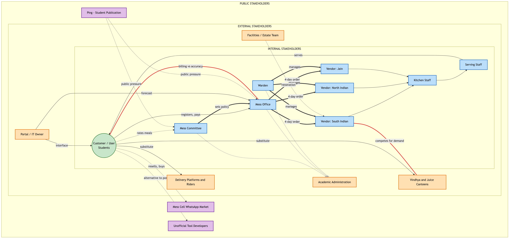
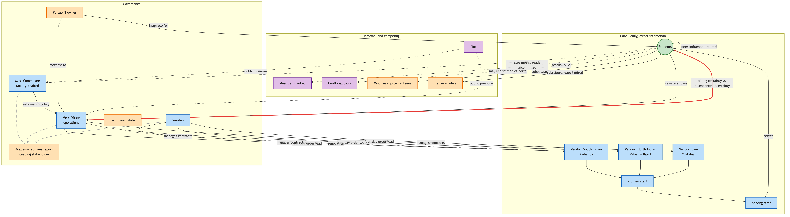
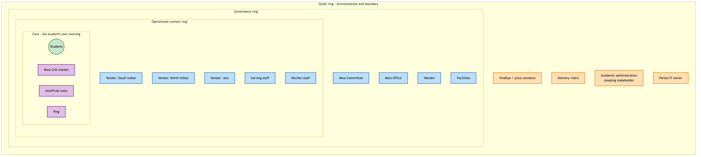

# Use Case

The breakfast mess system at IIIT Hyderabad registers, bills, and serves breakfast to the resident student population across four messes — Kadamba, Palash, Bakul, and Yuktāhār — through a single digital platform. Registration counts, not attendance, drive billing and food procurement. This map identifies every actor, institution, and informal structure that participates in, influences, benefits from, or is affected by this system, and the relationships, dependencies, and conflicts between them.

# Stakeholders

## Primary, Secondary, and Indirect Stakeholders

Twenty-seven candidate actors were identified across seventeen analytical lenses (student/user, social, food production, governance, money, technology, academic, sleep/time-use, substitute systems, campus infrastructure, waste, health, policy, informal systems, absent/sleeping stakeholders, temporal, and intervention). Seventeen are included in the final map. Four were considered and treated as minor rather than included in full (cleaning staff, juice canteens specifically, and campus security/gate staff — real but with no evidence of independent leverage beyond what is already captured through serving staff, Vindhya, and delivery platforms; guest diners — real but marginal in volume). Three were considered and excluded entirely: a campus health/wellbeing office (no evidence connects it to breakfast-skipping), senior-to-junior norm transmission, and a parental financial relationship (mess fees are bundled into hostel fees, not paid per meal).

**Primary stakeholders** — direct, daily interaction with the system:

| Stakeholder | Type |
|---|---|
| Students | Human group — registrant, billed party, consumer |
| Vendor — South Indian (Kadamba) | Commercial |
| Vendor — North Indian (Palash veg-only + Bakul veg/non-veg) | Commercial |
| Vendor — Jain (Yuktāhār) | Commercial |
| Mess serving/counter staff | Human group |
| Kitchen/cooking staff | Human group |

**Secondary stakeholders** — govern, execute, or manage the system without daily direct interaction:

| Stakeholder | Type |
|---|---|
| Mess Committee | Institution — policy |
| Mess Office | Institution — operations |
| Warden | Individual role — vendor management, structural change |
| Student Parliament Mess Secretary, and a Mess Deputy Secretary per mess (Kadamba, Palash, Yuktāhār) | Elected individual roles — student representation on mess matters |

**Indirect stakeholders** — affected by or connected to the system without direct engagement, including latent ("sleeping") actors currently inert but holding potential leverage:

| Stakeholder | Type |
|---|---|
| Academic administration / timetable authority | Institution — latent |
| Facilities/Estate team | Institution — latent |
| Portal/IT system owner | Institution or individual — latent |
| Mess Cell WhatsApp community | Informal group |
| Unofficial mess-tool developers | Individual(s) — latent |
| Ping (student publication) | Institution — latent |
| Vindhya Canteen and juice canteens | Commercial — substitute |
| Delivery platforms and riders | Commercial — substitute |

## Stakeholder Interests, Needs, and Expectations

| Stakeholder | Interest | Need | Expectation |
|---|---|---|---|
| Students | Convenient, affordable, timely food; not paying twice for a missed meal | A functioning registration and billing system, predictable operating hours, food matching their dietary registration | Registering for a meal reliably results in being fed if they attend; being charged regardless of attendance is a known, tolerated rule rather than an agreed one |
| Vendor — South Indian (Kadamba) | Contract renewal, predictable order volume, margin | An accurate registration forecast with enough lead time to procure — currently four days ahead of service (previously two) | The four-day forecast approximates real demand |
| Vendor — North Indian (Palash + Bakul) | Contract renewal, predictable order volume, margin | Same four-day forecast lead time; Palash's kitchen cannot produce non-vegetarian food, a fixed limitation on its role | Demand for the vegetarian line cooked at Palash and transported to Bakul stays predictable |
| Vendor — Jain (Yuktāhār) | Contract renewal, predictable order volume, margin | Same four-day forecast lead time; relationship to the other two vendors (shared or independent) unconfirmed | Same as other vendors |
| Serving and kitchen staff | Manageable preparation and service load, predictable headcounts | Sufficient lead time and an accurate registration count | Leftover food is theirs to consume after student service hours — an informal norm, not a written entitlement |
| Mess Committee | Balancing student satisfaction against operational feasibility | A functioning process for gathering and interpreting student input | The existing student-input process for the menu constitutes sufficient engagement on mess matters generally, including matters — hours, billing — that process was never designed to cover |
| Mess Office | Reduced operational workload — the confirmed, stated motive behind its one policy change on record | An accurate same-day picture of intent, currently unavailable at less than four days' notice | Registration counts are a workable proxy for actual attendance |
| Warden | Stable vendor relationships, orderly mess infrastructure | Clear division of responsibility with the Mess Office | Vendor management and structural authority remain within the Warden's own lane |
| Student Parliament Mess Secretary / per-mess Deputy Secretaries | Representing student interests on mess matters | A working channel into the Mess Committee and Mess Office | Not established — whether this elected seat carries a vote in the institute-level Mess Committee, or only in a separate Parliament-internal mess committee, is unconfirmed |
| Academic administration | Its own domain — class scheduling — run without external interference | No stated need connects it to mess operations | No expectation of any relationship to mess governance; confirmed to hold no formal mess role |
| Facilities/Estate team | Physical infrastructure upkeep | Authorization and budget for mess-facility work (the Kadamba renovation is confirmed to have occurred) | Not established — identity of this actor is itself unconfirmed |
| Portal/IT system owner | System uptime and reliability of the registration interface | Not established | Not established — no source names this actor |
| Mess Cell WhatsApp community | Recovering value from a registration that will go unused | A way to transfer a registration since Skip Meal returns no money | Buyers and sellers can find each other informally and transact on trust |
| Unofficial mess-tool developers | Not established beyond building the tool itself | Not established | Described in the tool's own documentation as built "for students of IIIT Hyderabad" |
| Ping (student publication) | Reporting on mess issues as a matter of student interest | Access to information worth publishing | Not established whether coverage produces any institutional response |
| Vindhya Canteen and juice canteens | Capturing demand when mess breakfast is skipped or unavailable | Steady walk-in customer flow | Not established |
| Delivery platforms and riders | Capturing demand when mess breakfast is skipped or unavailable | Gate access for delivery, currently restricted | Not established |

## Formal and Informal Roles

**Formal roles** attach to every institutional and commercial actor: Students (as registrant), Mess Committee, Mess Office, Warden, the three vendors, serving and kitchen staff, Vindhya Canteen and juice canteens, and delivery platforms all hold a formal, rule-defined position in the system.

**Informal roles** attach to the Mess Cell WhatsApp community, Ping, and the unofficial mess-tool developers — none of these has any official standing in the system, yet each performs a real function (resale market, public-pressure channel, and an alternative registration interface, respectively).

**Roles that are not separate stakeholders.** Several categories that might appear as distinct actors are, on inspection, behavioral states or temporary roles occupied by the single actor Students, not separate stakeholders in their own right: attending regularly, skipping regularly, having an early class on a given day, buying or selling on Mess Cell, and using an unofficial registration tool are all states a single student may move through within the same week. Peer influence between students — a roommate or friend's presence changing whether a given student attends on a given morning — is an internal relationship on the Students node, not a separate "Friends" or "Roommates" stakeholder. Guest diners (relatives, visiting parents, non-student campus affiliates who pay a vendor directly) are the one genuine exception: they hold a materially different formal relationship — no registration or monthly billing cycle — but their volume is too marginal to warrant inclusion as a full stakeholder.

# Create the Map

## Stakeholder Map

**Legend — relationship types**

| Style | Relationship |
|---|---|
| Solid line, plain label | Relation |
| Dotted line | Unclear, informal relationship |
| Thick line | Institutional relationship |
| Solid arrow, labeled | Directed flow of information |
| Red line | Relationship with conflict potential |
| Dotted line ending in an X | Interrupted relationship (no confirmed connection) |

Placement follows the standard four-ring model. **Customer/user:** Students. **Internal stakeholders:** Mess Committee, Mess Office, Warden, the three vendors, and serving and kitchen staff — the mess system's own operating structure. **External stakeholders:** Academic administration, the Facilities/Estate team, the Portal/IT owner, Vindhya and the juice canteens, and delivery platforms — organizations that interact with the system's boundary from outside it. **Public stakeholders:** the Mess Cell WhatsApp community, unofficial tool developers, and Ping — informal, public-facing actors with no institutional standing in the system.

## Relationship Network

This second view lays out the same seventeen stakeholders by functional cluster — core daily operation, governance, and informal/competing — rather than by ring distance, making the full set of information, money, and authority flows easier to trace end to end.

## Proximity to the Student's Lived Experience

This third view clusters the same actors by closeness to a student's actual morning rather than by relationship type. It surfaces a different finding from the two maps above: Academic administration sits at the outermost ring with no adjacent relationship connecting it inward at any layer, while Mess Cell, the unofficial tools, and Ping — none of them part of the formal governance structure — sit at the innermost ring alongside the students themselves.

# Relationships, Dependencies, and Conflicts

## Relationship Matrix

Cells marked *hypothesis* have not been independently confirmed.

| | Students | Mess Committee | Mess Office | Warden | Academic admin. | Vendors | Staff | Mess Cell | Ping |
|---|---|---|---|---|---|---|---|---|---|
| **Students** | — | Feedback (rating system confirmed to exist; whether read is unconfirmed) | Registration, payment | — | Dependent on its schedule | Payment, service | Service | Payment, service | — |
| **Mess Committee** | Authority (menu, feedback) | — | Authority (sets policy) | Hypothesis: overlap | No relationship of any kind | Authority (menu) | — | — | Hypothesis: subject of coverage |
| **Mess Office** | Billing, dependent on for order accuracy | Reports to (hypothesis) | — | Hypothesis: overlap | No relationship of any kind | Authority, dependency (ordering) | Authority | — | Hypothesis: subject of coverage |
| **Warden** | — | Hypothesis | Hypothesis | — | No relationship of any kind | Authority (contracts) | — | — | — |
| **Vendors** | Payment, food/material | Authority over | Authority over, dependency | Contract authority | — | — | Manages | — | — |
| **Mess Cell** | Payment, service, informal influence | — | — | — | — | — | — | — | — |

The empty and no-relationship cells are as significant as the populated ones. Academic administration has no confirmed relationship of any kind to any of the three governance actors — a genuine structural gap, not a modeling omission, and the single most consequential finding in this map.

## Dependencies

Students depend on vendors for food quality and timing; vendors do not depend on any individual student — an asymmetric dependency consistent with a walk-in pricing structure that requires no negotiation. Vendors depend on the Mess Office for a registration forecast fixed four days ahead of service; the Mess Office depends on students to register accurately, but nothing in the billing structure requires accuracy, since a student is charged identically whether or not they attend — the weakest link in this dependency chain is also the one with no incentive attached to it. The Mess Committee depends on the Mess Office to execute policy; the Mess Office's own stated motivation for its one confirmed policy change (reducing workload) did not visibly originate from or require Mess Committee direction, suggesting operational pressure may drive policy from below at least as often as governance drives it from above.

Beyond the Academic administration gap already noted: no source describes a direct relationship between vendors and students — all communication routes through the Mess Office or the portal. No source describes the Portal/IT owner having any direct relationship with the Mess Committee, despite the Committee setting policy this system presumably enforces technically.

## Conflicts

| Conflict | Side A | Side B |
|---|---|---|
| Billing certainty vs. attendance uncertainty | Mess Office and vendors need a stable number to order against, fixed four days ahead | Students face genuinely uncertain day-to-day attendance, with no incentive built into billing to report it accurately |
| Flexibility vs. workload | Students and the Mess Cell market want more cancellation and resale flexibility | The Mess Office's one confirmed policy change tightened rules specifically to reduce staff workload |
| Convenience vs. waste | Students want flexible registration | The Mess Office wants predictable, low-workload ordering |
| Cuisine demand vs. fixed procurement | Registered uptake is markedly lower at every North Indian line (Palash, Bakul) than at the South Indian line (Kadamba) | The four cuisine lines are fixed by vendor contract, not adjusted in response to demand |
| Academic schedule vs. meal schedule | Academic administration owns class timing and holds no stake in mess outcomes | Students bear the actual cost of the 8:30 AM overlap with breakfast hours |

# Findings

Twenty-seven candidate stakeholders were narrowed to seventeen through direct evidence rather than assumption; three lenses that might plausibly have produced a stakeholder — student health, senior-junior norm transmission, and a parental financial relationship — produced none.

The Mess Office is a distinct actor from the Mess Committee, separating "who decides policy" from "who executes it." Every earlier account of this system's governance, including this team's own first drafts, had collapsed the two into one. The Mess Office places food orders on a four-day lead time, administers the registration platform, and issued the one confirmed policy change on record — driven by reducing staff workload, not a student-facing goal.

Academic administration holds the single lever most likely to materially affect the core problem — the overlap between breakfast hours and the 8:30 AM class start — and has no relationship of any kind, formal or informal, to any of the three mess-governance actors. This is the clearest sleeping stakeholder in the map: total authority over the one variable in conflict, zero engagement with the system it conflicts with.

Three real feedback channels exist — an in-app per-meal rating, a public email address, and coverage in Ping, the student publication — and none has a confirmed instance of producing a policy change. Inputs exist; a confirmed output does not.

Registered attendance is markedly lower, relative to capacity, at every mess serving North Indian food than at the South Indian mess, a pattern consistent across three independently operated messes rather than one, making cuisine preference a stronger candidate explanation for the uptake gap than any single mess's individual circumstances.

The Mess Committee's chair — reported in a secondhand, not directly verified source as a faculty member — is a second, more subtle candidate sleeping stakeholder if that report holds: an individual with cross-institutional standing that no student-only channel possesses, and a structurally plausible bridge to Academic administration, with no evidence that bridge has ever been used.

A directly verified addition since this map was first drawn: the Student Parliament maintains an elected Mess Secretary and a Mess Deputy Secretary for each mess (Kadamba, Palash, Yuktāhār), confirmed directly from the Parliament's own published records — not a secondhand source. This is a real, structured channel of student representation that the three diagrams above do not yet depict; it belongs on the Internal ring alongside the Mess Committee, Mess Office, and Warden, and is carried forward into the Power–Interest/Leverage Map (Task 3) in full.

Two structurally hidden actors carry outsized influence without being visible to any single respondent: the Portal/IT system owner, interacted with constantly and named by no one, and the four-day procurement lead time itself — not a person, but a fixed constraint that caps how responsive the entire system can be to any same-day signal, including Skip Meal, regardless of which stakeholder wants to act on it.
