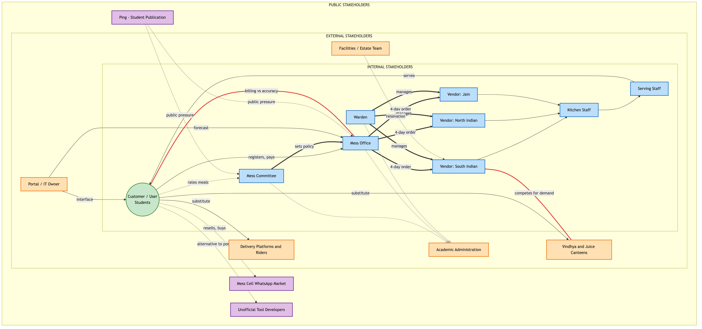
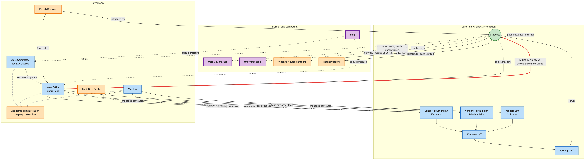
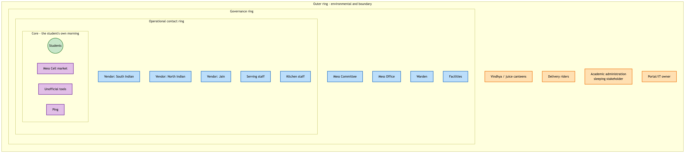

# Use Case

The breakfast mess system at IIIT Hyderabad registers, bills, and serves breakfast to the resident student population across four messes (Kadamba, Palash, Bakul, and Yuktāhār) through a single digital platform. Registration counts, not attendance, drive billing and the quantity each mess operator cooks. Three catering operators run the four messes: two cook on site, and one cooks at an off-site kitchen and transports the food in. This map identifies every actor, institution, and informal structure that participates in, influences, benefits from, or is affected by this system, and the relationships, dependencies, and conflicts between them.

Operations evidence from the three operators, the Yuktāhār registers, and the institution's own scan-level breakfast records for Kadamba for April 2026 overturned several earlier findings about the vendors, the four-day lead time, and who places food orders. A team member who was present at the Kadamba and Yuktāhār visits then gave a first-hand account that confirmed several operator figures and corrected others: who eats Kadamba's extra food, how many project managers Yuktāhār has, and how each operator is organised. Each change is marked as revised where it appears below.

# Stakeholders

## Primary, Secondary, and Indirect Stakeholders

Thirty-two candidate actors were identified across seventeen analytical lenses (student/user, social, food production, governance, money, technology, academic, sleep/time-use, substitute systems, campus infrastructure, waste, health, policy, informal systems, absent/sleeping stakeholders, temporal, and intervention). Seven of these became visible only once the operators' own practice was observed: the operator site management layer, the CDS site team, suppliers, the garbage contractor, event and exam organisers, institute quality-check visitors, and the external food-safety regulator. One more, the Student Parliament's mess seats, came from the Parliament's own published records. Twenty-four are included in the final map.

Five were considered and treated as minor rather than included in full. Cleaning staff and the juice canteens specifically show no independent leverage beyond what is already captured through serving staff and Vindhya. Guest diners (relatives, visiting parents, faculty and staff paying at the counter, and cash meals) are counted by the operators themselves: Yuktāhār's register records between none and twelve unregistered, paid, or faculty/staff diners per breakfast on the legible September days (confirmed from records), and their breakfast volume stays too small for a full stakeholder. Institute quality-check visitors, described by Kadamba's manager as faculty from IIIT who inspect the store and by the operator as a QC inspection held weekly, are treated as a role of the Mess Committee's faculty, a candidate identity that is not confirmed. The external food-safety regulator (FSSAI) certifies the campus but has no part in breakfast attendance. Three were considered and excluded entirely: a campus health/wellbeing office (no evidence connects it to breakfast-skipping; its only link to the messes is food safety), senior-to-junior norm transmission, and a parental financial relationship (mess fees are bundled into hostel fees, not paid per meal).

Revised: campus security was earlier treated as a minor actor that shares in a staff meal made of leftovers, and Kadamba's extra portions were described as 30 to 40 for paying and unregistered diners. The Kadamba operator's own account, heard directly by the team, is different. About 30 extra portions are cooked in advance for 30 to 50 people from outside the student registration, such as night-shift security who do not want to leave to eat, through some form of outside registration whose mechanism is not confirmed; and about half of Kadamba's own staff also eat from the same food (single-sourced, observer-verified). Together they are a substantial, uncounted sink for first-batch surplus (candidate), so they are now included as a stakeholder in their own right: non-student diners fed at Kadamba.

**Primary stakeholders:** direct, daily interaction with the system.

| Stakeholder | Type |
|---|---|
| Students | Human group: registrant, billed party, consumer |
| Operator: Prism, Kadamba (outsourced vendor by tender; South Indian, veg and non-veg, on-site kitchen) | Commercial |
| Operator: Vijayalakshmi Caterers, candidate for Bakul and Palash (North Indian, off-site kitchen) | Commercial |
| Operator: ABC Hospitality Services, Yuktāhār (Satvik vegetarian and Jain, on-site kitchen) | Commercial |
| Operator site management (Kadamba: operations manager, manager, supervisor; Yuktāhār: project managers, in-charge, coordinator, store function) | Human group: decides tomorrow's quantities and today's top-ups |
| Mess serving/counter staff | Human group |
| Kitchen/cooking staff | Human group |

The operators were earlier mapped as three cuisine-labelled vendors. That grouping is revised. Yuktāhār is run by ABC Hospitality Services, cooks on site, and serves a Satvik vegetarian line with a small Jain line; its registers record registrations as regular plus Jain (257 plus 10 on Sunday 6 September), which is confirmed from its own records. It is independent of the other two operators, which settles the earlier open question about its relationship to them. Revised: Kadamba's operator was earlier recorded only as a self-described "Prism team" with its company status unconfirmed. Kadamba is run entirely by Prism, an outsourced third-party vendor that registers as a vendor, wins the contract by tender bid, and runs all of Kadamba's operations (single-sourced, observer-verified). The third operator, Vijayalakshmi Caterers, cooks about 40 minutes away near the airport and brings food in insulated boxes (single-sourced). The institution's own notice states that Bakul and Palash are both served from one approved off-site kitchen until the Felicity Kitchen and Dining Facility opens, expected in December 2026, so Vijayalakshmi Caterers serving Bakul and Palash is a candidate match, not confirmed. The earlier account that Palash cooks vegetarian food and sends it to Bakul is revised: neither hall cooks on site, and Palash is vegetarian because of the hall's designation, not because of a limit on its kitchen.

**Secondary stakeholders:** govern, execute, or manage the system without daily direct interaction.

| Stakeholder | Type |
|---|---|
| Mess Committee | Institution: policy |
| Mess Office (candidate: CDS, Campus Dining Services) | Institution: operations, registration rules |
| CDS site team | Institution: day-to-day liaison with operators |
| Warden | Individual role: vendor management, structural change |
| Student Parliament Mess Secretary, and a Mess Deputy Secretary per mess (Kadamba, Palash, Yuktāhār) | Elected individual roles: student representation on mess matters |

The institution's own posters and the operators name a Campus Dining Services (CDS) body that sits under Campus Facilities Services (CFS), with a faculty CDS Committee, a CDS Student Council, and one admin per mess. Kadamba's operator describes the contract chain as running from CFS to CDS and then to Prism (single-sourced, observer-verified). Four identities are not confirmed and are kept separate in this map: whether CDS is the Mess Office, whether the CDS Committee is the Mess Committee, whether the CDS Student Council is the Student Parliament's mess seat or part of it, and whether the Warden's vendor and structural role actually belongs to CFS. The first is now a stronger candidate than before, because the CDS team supplied the scan-level registration records and the CDS site team is the operators' day-to-day institutional counterpart. A fifth question concerns who leads CDS. The Kadamba operator names Raju as the head of CDS; the CFS Chair earlier named the CDS Chair as Giri. These may be two roles, such as an administrative chair and an operational head, or one of the names may be wrong, and the map keeps them apart.

**Indirect stakeholders:** affected by or connected to the system without direct engagement, including latent ("sleeping") actors currently inert but holding potential leverage.

| Stakeholder | Type |
|---|---|
| Academic administration / timetable authority | Institution: latent |
| Event and exam organisers (clubs, hackathons, other campus food events) | Institutional and informal: latent demand shifters |
| Facilities/Estate team | Institution: latent |
| Portal/IT system owner | Institution or individual: latent |
| Suppliers (local shops and godowns for grocery, vegetable vendors, milk, paneer, oil and flour mills, LPG) | Commercial: upstream supply |
| Garbage contractor | Commercial: waste exit |
| Non-student diners fed at Kadamba (night-shift security and other outside workers; about half of Kadamba's staff) | Human group: surplus absorber |
| Mess Cell WhatsApp community | Informal group |
| Unofficial mess-tool developers | Individual(s): latent |
| Ping (student publication) | Institution: latent |
| Vindhya Canteen and juice canteens | Commercial: substitute |
| Delivery platforms and riders | Commercial: substitute |

## Stakeholder Interests, Needs, and Expectations

| Stakeholder | Interest | Need | Expectation |
|---|---|---|---|
| Students | Convenient, affordable, timely food; not paying twice for a missed meal; keeping menu items they like | A functioning registration and billing system, predictable operating hours, food matching their dietary registration, and entry when they arrive in the last minutes before close | Registering for a meal reliably results in being fed if they attend; being charged regardless of attendance is a known, tolerated rule rather than an agreed one. Registration is automatic and mandatory, including over holidays and when a student is off campus, and the only way out is 5 cancellations per meal type per month, each made at least four days ahead; beyond those there is no way to cancel the charge (confirmed). Registration is therefore a default set days ahead rather than a daily decision: April breakfast registrations sat near 1,070 every day of the week, Sunday included, while turnout ranged from 42.1% on Tuesdays to 27.3% on Sundays (confirmed from records). A student at Kadamba objected in person that dinner sambar had been dropped "while they are taking more money from us" |
| Operator: Prism (Kadamba) | Contract renewal and margin under a tendered per-plate rate; whether payment is per registered or per served plate is unconfirmed | Registration counts split into veg and non-veg, released about four days ahead; dry goods bought a week ahead, most perishables the day before, and some vegetables two to three days ahead; a raw reserve that can be cooked in 10 to 15 minutes; live counts at the counter | Revised: the earlier expectation that the four-day count approximates real demand does not hold for any operator. Kadamba cooks about 70% of registrations in the first batch, planned separately for veg and non-veg, with a gram standard for every dish (four idlis and 100 g of sambar per person), and its supervisor watches the counters and calls top-ups (single-sourced, observer-verified), against an actual April breakfast turnout of 37.1% (confirmed from records). It treats the registration count, whatever it is, as its obligation, because it is paid for it (single-sourced, observer-verified). Its manager says there is no forecasting method: "it was wasted many times". The operator puts waste at about 5 to 10% a day, on an unstated base (single-sourced, observer-verified). On the face of the two figures a first batch of 70% against 37% turnout would leave close to half the first batch uneaten, so the 5 to 10% figure holds only if extra diners, reheating into later service, or smaller top-ups take most of that surplus, or if it is measured on a different base; which of these applies is not known. Lunch biryani is the exception: it is cooked for all registrations, at two pieces of 150 to 200 g each with unlimited rice (single-sourced, observer-verified) |
| Operator: Vijayalakshmi Caterers (candidate: Bakul and Palash) | Contract renewal and margin under a tendered per-plate rate, paid monthly as a lump sum on plates with deductions (single-sourced; payment basis unconfirmed) | Registration counts; its own supply chain (paneer switched from Amul to Heritage to Milky Mist after quality complaints); a transport link from the off-site kitchen that brings top-ups within 30 minutes | Cooks for 70% of registrations, recently raised to 80%, and checks the counter every 30 minutes (single-sourced), while reporting its own turnout as under 70% and lower at weekends. Its manager, a month into the role, wants a say in the menu and more flexibility in dish pairing |
| Operator: ABC Hospitality Services (Yuktāhār) | Contract renewal and margin, with an explicit goal of best food quality, less waste, an optimised workflow, lower operating cost, standardisation, and higher profit, in which cutting waste is a cost lever (single-sourced, observer-verified); keeping prediction in its own hands ("I want to remain close to the data") | Portal registrations read as regular plus Jain plus cash meals; its own Wastage Book for the matching week (the menu repeats in weeks one and three, and two and four); its attendance register grouped by weekday; the month's turnout pattern; and news of holidays, special weeks, events, and exams, which reaches the kitchen only if someone raises it in the planning meeting. During service the first half hour is used as a sample to project the rest of the meal, which drives top-up cooking (single-sourced, observer-verified) | Plans from its own records and believes breakfast turnout is at most about 50%; its own September register shows 17.7% to 40.2%, about 28% on average across the thirteen legible days (confirmed from records) |
| Operator site management | Getting tomorrow's quantities right; staff buy-in to waste tracking | At Yuktāhār, a planning meeting twice a day with the books in front of it, the first for the next day's breakfast and lunch and the second for snacks and dinner; at Kadamba, the supervisor's reading of the counters and the manager's experience | Waste measurement is for improvement, not fault-finding: Yuktāhār's cross-checkers are paid less than the person checked, the project managers made waste weighing blame-free and discussed it daily, and staff who first said "they are catching us" reported by December that waste had fallen (single-sourced, observer-verified) |
| Serving and kitchen staff | Manageable preparation and service load, predictable headcounts | Live counts at the counter, a second counter during the closing surge (Yuktāhār opens two roti counters at peak for its handmade, oil-free rotis, confirmed from observation), reserve raw material, and a working QR scanner (when it fails, staff write ID and name by hand). At Kadamba the chef starts at 5:30 and live items such as dosa are cooked in front of diners from 7:00 (single-sourced, observer-verified) | Revised: the earlier figure of 20 to 30 Kadamba cooking and security staff eating what is left after students is replaced. About half of Kadamba's own staff eat at the mess from the same food (single-sourced, observer-verified). Whether this is a written entitlement or an informal norm is still unconfirmed |
| Non-student diners fed at Kadamba | A meal on shift without leaving campus | Cooked food available alongside or after student service, planned in advance through the extra portions | Food is there without having to leave campus. They are an absorber of first-batch surplus that no count of waste or attendance records (candidate) |
| Mess Committee | Balancing student satisfaction against operational feasibility; menu authority, exercised by choosing from options the operators offer | A functioning process for gathering and interpreting student input | The existing student-input process for the menu constitutes sufficient engagement on mess matters generally, including matters (hours, billing) that process was never designed to cover. No source confirms that operators' item-level waste figures ever reach it |
| Mess Office (candidate: CDS) | Reduced operational workload, the confirmed, stated motive behind its one policy change on record; ownership of the four-day registration rule | Revised: the earlier listed need, a same-day picture of intent it could not obtain, does not hold. The CDS team already holds scan-level records for every registration (32,162 Kadamba breakfast registrations in April, 37.1% availed). What it lacks is a route from those records into registration and billing rules | Registration counts are a workable proxy for actual attendance. Its own records contradict this, and no operator acts on it |
| CDS site team | Keeping day-to-day operations and complaints moving | A direct line to each operator: a WhatsApp group through which complaints and instructions are relayed (single-sourced) | Not established |
| Warden | Stable vendor relationships, orderly mess infrastructure | Clear division of responsibility with the Mess Office | Vendor management and structural authority remain within the Warden's own lane |
| Student Parliament Mess Secretary / per-mess Deputy Secretaries | Representing student interests on mess matters | A working channel into the Mess Committee and Mess Office | Not established: whether this elected seat carries a vote in the institute-level Mess Committee, or only in a separate Parliament-internal mess committee, is unconfirmed |
| Academic administration | Its own domain, class scheduling, run without external interference | No stated need connects it to mess operations | No expectation of any relationship to mess governance; confirmed to hold no formal mess role |
| Event and exam organisers | Running their own events | None connects them to the messes | Not established. Exams and hackathons cut breakfast turnout, and a food event elsewhere on campus means an operator should cook less, but none of this reaches the kitchen through any formal feed (single-sourced, from the Yuktāhār operator) |
| Facilities/Estate team | Physical infrastructure upkeep | Authorization and budget for mess-facility work (the Kadamba renovation is confirmed to have occurred) and equipment repair (Kadamba's toaster and grill are broken with no replacement yet, single-sourced) | Not established: identity of this actor is itself unconfirmed |
| Portal/IT system owner | System uptime and reliability of the registration interface | Working scanners at the counter; the system already delivers registration counts to operators, live scan counts to the counter, and a timestamp for every scan to CDS | Not established: no source names this actor |
| Suppliers | Steady orders and repeat business | Orders at each operator's cadence: at Yuktāhār groceries fortnightly (confirmed from its stock register), bought ahead from many local shops and godowns, vegetables two to three times a week, and milk daily; at Kadamba dry goods such as rice, groundnut, masala, ghee, and podi a week ahead, milk, fruit, meat, eggs, and most vegetables the day before, and some vegetables two to three days ahead (single-sourced, observer-verified) | Operators check and return poor stock. Yuktāhār holds an expected grams-of-waste norm for each raw item, weighs the stones it finds in grain (50 g in 2 kg), and complains to the supplier or changes supplier when the norm is exceeded; its project team also visits the mills that make its oil and other inputs, and it has used rock salt and cold-pressed oil for about six months (single-sourced, observer-verified). Vijayalakshmi Caterers changed paneer brand twice |
| Garbage contractor | Collection business | Daily access to each operator's bins | Not established. At Kadamba all cooked surplus that is not eaten goes to the bin and then to this contractor, and the operator states there is no composting (single-sourced) |
| Mess Cell WhatsApp community | Recovering value from a registration that will go unused | A way to transfer a registration since Skip Meal returns no money | Buyers and sellers can find each other informally and transact on trust. Kadamba's manager holds a related view of no-shows: students register even when away and a friend eats in their place (single-sourced, the manager's belief rather than an observed fact) |
| Unofficial mess-tool developers | Not established beyond building the tool itself | Not established | Described in the tool's own documentation as built "for students of IIIT Hyderabad" |
| Ping (student publication) | Reporting on mess issues as a matter of student interest | Access to information worth publishing | Not established whether coverage produces any institutional response |
| Vindhya Canteen and juice canteens | Capturing demand when mess breakfast is skipped or unavailable | Steady walk-in customer flow | Not established |
| Delivery platforms and riders | Capturing demand when mess breakfast is skipped or unavailable | Gate access for delivery, currently restricted | Not established |

## Formal and Informal Roles

**Formal roles** attach to every institutional and commercial actor: Students (as registrant), Mess Committee, Mess Office, CDS site team, Warden, the three operators, serving and kitchen staff, suppliers, the garbage contractor, Vindhya Canteen and juice canteens, and delivery platforms all hold a formal, rule-defined or contract-defined position in the system.

**Formal roles inside the operators.** Revised: each operator was earlier described as running its own hierarchy. Each runs its own internal organisation, which the institution does not see, and the two observed ones are opposites.

Kadamba sits at the end of a contract chain that runs from CFS to CDS and then to Prism, and inside Prism from an operations manager to a manager, a supervisor, and the service staff (single-sourced, observer-verified). A separate short staff recording, not tied to one mess, adds a director above the operations manager; reading it as Prism's ladder is a candidate. The supervisor is the in-service quantity decider, who watches the counters, tracks how much of each item is left at what time, and tells the kitchen how much more to cook. The kitchen has about ten chefs with separate veg and non-veg cooks; Nazir is the main veg chef, and a head chef joins on biryani days. Up to fifty staff work at the mess in all (single-sourced). Every meal passes a fixed food-safety sequence: cooking temperature is checked, a sample is kept for 72 hours so any illness can be traced, including to outside food, a wrapped display plate of the full menu is set at the entrance (confirmed from observation), serving temperature is measured per item, and a facility team tastes the food together with two people from Prism before corrections are made and service opens (tasting confirmed from observation). Water is tested for TDS daily, and QC inspects weekly (single-sourced, observer-verified). Who the facility team is, whether the CDS site team, CFS, the Facilities/Estate team, or the faculty quality-check visitors, is not confirmed, and the map keeps it separate from each.

Yuktāhār has no hierarchy: everyone does every job, and cross-checking is done by peers (single-sourced, observer-verified). ABC Hospitality Services runs the mess through two project managers, with about three site staff sharing project-management work (single-sourced, observer-verified; revised from an earlier five-person project management team). Ajita is the mess in-charge, keeps the accounts, and keeps the Wastage Register, and colleagues cross-check her records; Bhavani writes and cross-verifies the grocery register (single-sourced, observer-verified; Bhavani's signature is on the photographed fridge cleaning log, confirmed). A coordinator keeps the registrations, the attendance register by weekday, and a wastage board on which the aim is to push the waste share down steadily. The store function pulls, segregates, and cleans raw material for each meal, and no one holds it as a dedicated storekeeper-only role. A tasting pair of one woman and one man checks every breakfast, and there are cutting and cleaning teams alongside it. Sixteen kitchen staff cook, starting breakfast at 5:30 to have it ready by 7:30, and an office digitises the paper books later. A site head has run the mess since the operator took it over and writes in the registers himself every day; whether he is one of the two project managers is not confirmed. Every role is attached to a book: the Wastage Book, the weekday attendance register and wastage board, the grocery issue book, the store ingredient book, the stock register, the vegetable book and indent, the milk, fruit, gas, electricity, and water register, and the fridge temperature and cleaning logs (the books themselves are photographed, confirmed from records). Each book is checked by someone other than its keeper (single-sourced, observer-verified). The store book of what was issued must match the kitchen book of what was cooked, and any mismatch is raised in the daily meeting; on 18 September the grocery book and the stock register agreed on toor dal (confirmed from records).

**Informal roles** attach to the Mess Cell WhatsApp community, Ping, and the unofficial mess-tool developers: none of these has any official standing in the system, yet each performs a real function (resale market, public-pressure channel, and an alternative registration interface, respectively). The operators add several informal structures of their own. Yuktāhār's twice-daily planning meeting is the system's actual forecasting institution, yet no institutional document names it. The same meeting carries Yuktāhār's informal organisation: there is no formal leave policy, so anyone who needs leave raises it there and colleagues agree to absorb the load; one project manager took all staff to his farmhouse for training on what good quality looks like and what responsibility means; and staff describe a family-like culture (single-sourced, observer-verified). This informal layer is what holds the formal books together. The WhatsApp group between the CDS site team and each operator is an informal channel carrying formal business. At Kadamba, the meals for about half the staff and for outside diners, the door reopened for 5 to 10 minutes after service closes (25 students came in after close on one biryani day, single-sourced), and students who come in by the back door after 9:30 and whom, in the operator's words, the mess "can't say no" to (single-sourced, observer-verified) are informal accommodations that absorb surplus and lateness without any rule requiring them.

**Roles that are not separate stakeholders.** Several categories that might appear as distinct actors are, on inspection, behavioral states or temporary roles occupied by the single actor Students, not separate stakeholders in their own right: attending regularly, skipping regularly, having an early class on a given day, buying or selling on Mess Cell, and using an unofficial registration tool are all states a single student may move through within the same week. Peer influence between students, where a roommate or friend's presence changes whether a given student attends on a given morning, is an internal relationship on the Students node, not a separate "Friends" or "Roommates" stakeholder. Guest diners hold a materially different formal relationship (no registration or monthly billing cycle, and a higher spot rate), and the operators count them separately, but their breakfast volume is too small to warrant inclusion as a full stakeholder. Non-student diners at Kadamba differ from guest diners: they are cooked for in advance every day and eat from the same food as students, which is why they are included.

# Create the Map

## Stakeholder Map

**Legend: relationship types**

| Style | Relationship |
|---|---|
| Solid line, plain label | Relation |
| Dotted line | Unclear, informal relationship |
| Thick line | Institutional relationship |
| Solid arrow, labeled | Directed flow of information |
| Red line | Relationship with conflict potential |
| Dotted line ending in an X | Interrupted relationship (no confirmed connection) |

Placement follows the standard four-ring model. **Customer/user:** Students. **Internal stakeholders:** Mess Committee, Mess Office, the CDS site team, Warden, the Student Parliament's mess seats, the three operators with their site management, and serving and kitchen staff: the mess system's own operating structure, including the operator cluster that the earlier map left out. **External stakeholders:** Academic administration, event and exam organisers, the Facilities/Estate team, the Portal/IT owner, suppliers, the garbage contractor, the non-student diners fed at Kadamba (placed next to the operators), Vindhya and the juice canteens, and delivery platforms: organizations and groups that interact with the system's boundary from outside it. **Public stakeholders:** the Mess Cell WhatsApp community, unofficial tool developers, and Ping: informal, public-facing actors with no institutional standing in the system.

## Relationship Network

This second view lays out the stakeholders by functional cluster rather than by ring distance; with the operator evidence, the twenty-four stakeholders fall into five clusters (core daily operation, operator interior, governance, supply and waste, and informal/competing), making the full set of information, money, food, and authority flows easier to trace end to end. The operator interior holds the two opposite organisations: Kadamba's ladder from CFS through CDS to Prism and down to the supervisor, and Yuktāhār's flat, peer-checked ring of books and keepers.

## Proximity to the Student's Lived Experience

This third view clusters the same actors by closeness to a student's actual morning rather than by relationship type. It surfaces a different finding from the two maps above: Academic administration and the event and exam organisers sit at the outermost ring with no adjacent relationship connecting them inward at any layer, while Mess Cell, the unofficial tools, and Ping, none of them part of the formal governance structure, sit at the innermost ring alongside the students themselves. The counter staff and the operator's in-service decider (Kadamba's supervisor, Yuktāhār's coordinator and kitchen team) also sit close to the student: they are the only actors who see the morning crowd as it happens.

# Relationships, Dependencies, and Conflicts

## Relationship Matrix

Cells marked *hypothesis* have not been independently confirmed. Blank cells mean no source describes a relationship.

| | Students | Mess Committee | Mess Office (CDS) | Warden | Academic admin. | Operators | Staff | Mess Cell | Ping |
|---|---|---|---|---|---|---|---|---|---|
| **Students** | n/a | Feedback (rating system confirmed to exist; whether read is unconfirmed) | Registration, payment; automatic registration with 5 cancellations per meal type per month | | Dependent on its schedule | Service at the counter, direct verbal complaint, late entry when the door is reopened or by the back door | Service | Payment, service | |
| **Mess Committee** | Authority (menu, feedback) | n/a | Authority (sets policy) | Hypothesis: overlap | No relationship of any kind | Authority (menu, chosen from operator-offered options); store inspections by faculty and weekly QC (candidate identity) | | | Hypothesis: subject of coverage |
| **Mess Office (CDS)** | Billing, registration rules (four-day lock) | Reports to (hypothesis) | n/a | Hypothesis: overlap | No relationship of any kind | Contract chain from CFS through CDS to Prism (tender); registration counts at four days; complaint relay through the CDS site team's WhatsApp group; monthly payment with deductions (single-sourced); a facility team tastes with Prism before each service (identity candidate); holds scan records not confirmed to be shared back | Indirect, through the operator | | Hypothesis: subject of coverage |
| **Warden** | | Hypothesis | Hypothesis | n/a | No relationship of any kind | Authority (contracts) | | | |
| **Operators** | Food, plate-waste weighing, informal accommodation (late entry by the reopened door and the back door) | Offers menu options; holds item-level waste data with no confirmed route to the Committee | Depends on for registration counts and payment | Under contract authority | Receives exam and event news only by chance | Compete for the same diner ("another mess might be serving something") | Kadamba: through operations manager, manager, and supervisor (Prism chain). Yuktāhār: no hierarchy; peer cross-checking and a shared daily meeting. Vijayalakshmi Caterers: staff, manager, MD (single-sourced) | | |
| **Staff** | Service; about half of Kadamba's staff eat from the same food | | | | | Report to (Kadamba); cross-check one another and taste in pairs (Yuktāhār) | n/a | | |
| **Non-student diners (Kadamba)** | Eat from the same cooked food | | | | | Cooked for in advance, about 30 extra portions; the outside registration mechanism is unconfirmed | Share the same food | | |
| **Suppliers** | | | | | | Supply; impurity norm per item, quality complaints, returns, supplier and brand switching; mill visits (Yuktāhār) | | | |
| **Garbage contractor** | | | | | | Collects bin waste daily (Kadamba); onward route unconfirmed | | | |
| **Mess Cell** | Payment, service, informal influence | | | | | | | n/a | |

The empty and no-relationship cells are as significant as the populated ones. Academic administration has no confirmed relationship of any kind to any of the three governance actors, a genuine structural gap and not a modeling omission, and the single most consequential finding in this map. The operator side shows the same gap from below: the academic and event calendar reaches the kitchen only if someone happens to mention it in a planning meeting. The Mess Office row shows the second gap the operator evidence exposed: the institution and the operators each measure turnout, and nothing connects the two measurements.

## Dependencies

Students depend on operators for food quality and timing; operators do not depend on any individual student, an asymmetric dependency consistent with a walk-in pricing structure that requires no negotiation. Operators depend on the Mess Office for registration counts released four days ahead of service, and on the contract for payment. The earlier reading that operators depend on that count to procure food is revised by the operations evidence. Procurement belongs to each operator, not to the Mess Office, and runs on its own cadence: Yuktāhār buys groceries fortnightly, vegetables two to three times a week, and milk daily (confirmed from its stock and vegetable registers), and Kadamba buys dry goods a week ahead, most perishables the day before, and some vegetables two to three days ahead (single-sourced, observer-verified). What the four-day count actually sets is how much cooked food is prepared, because every operator converts registrations into a cooked quantity (Kadamba and Vijayalakshmi Caterers with a fixed first-batch share, Yuktāhār through its own records, its meeting, and its first-half-hour projection) and cooked food is usable for only three to four hours. The Mess Office depends on students to register accurately, but nothing in the billing structure requires accuracy, since a student is charged identically whether or not they attend and is registered automatically unless one of a capped number of cancellations is used: the weakest link in this dependency chain is also the one with no incentive attached to it. The Mess Committee depends on the Mess Office to execute policy; the Mess Office's own stated motivation for its one confirmed policy change (reducing workload) did not visibly originate from or require Mess Committee direction, suggesting operational pressure may drive policy from below at least as often as governance drives it from above.

Operators depend on suppliers for clean raw stock, on the garbage contractor to remove what is not eaten, and, at the off-site kitchen, on a 40-minute transport leg that sets how fast a top-up can reach the counter. Kitchen staff depend on the QR scanner and the portal for live counts. Operators also depend on one another in an unplanned way: Yuktāhār's site head attributes weaker Wednesday paneer turnout to another mess serving something more attractive the same day, so the messes are substitutes for one another and not only for Vindhya, the juice canteens, and delivery.

A dependency runs the other way at Kadamba. The outside diners and about half of Kadamba's staff eat from the same food that the fixed first batch produces (single-sourced, observer-verified), so they depend on that surplus. Any change that cuts the first batch would take food from them unless it plans their portions explicitly, which makes them a latent opponent of waste reduction that no one has yet consulted (candidate).

The earlier finding that no source describes a direct relationship between vendors and students, with all communication routed through the Mess Office or the portal, is revised. Operators and students meet directly every day at the counter: a student complained to Kadamba's manager in person about the dropped dinner sambar and the manager answered directly, the operators absorb late-comers through a reopened door and a back door they report they cannot refuse, and Yuktāhār weighs student plate waste in its Wastage Book. What still routes through institutional channels is the formal complaint, which runs from a director's email or the CDS team to the operator's manager and on to the kitchen. No source describes the Portal/IT owner having any direct relationship with the Mess Committee, despite the Committee setting policy this system presumably enforces technically.

A contract dependency remains unresolved and matters more than any other cell in this map. Vijayalakshmi Caterers says it won a tender and is paid monthly as a lump sum on plates, with deductions (single-sourced, with the tender figures unclear on the recording). If the plate count is registrations while operators cook for well under all of them, each operator keeps a margin on every no-show and has no financial interest in closing the gap. If the plate count is meals served, the reverse holds. Kadamba's statement that it cooks on registrations because "they are getting paid for it" (single-sourced, observer-verified) points toward payment on registrations, but it does not settle the question. Which of these applies is a candidate question only.

## Influence

Influence in this system splits cleanly by what each actor controls. Operators hold high local influence over how much is cooked, when a batch is topped up, and whether a second counter opens, and they respond within 10 to 30 minutes; at Kadamba the minute-to-minute cook decision sits with the supervisor at the counters rather than with the manager, and at Yuktāhār with the kitchen team reading the first half hour of service. Late-comers are something operators absorb rather than decide on: the operator reports that students entering by the back door after 9:30 cannot be refused. They hold no influence over the registration cut-off, the billing rule, or the service window, and their influence over the menu is contested. The Mess Office holds the registration and billing rules and the only scan-level attendance data, but no confirmed influence over how much any operator cooks. The Mess Committee holds menu authority and final policy say. Academic administration holds the class timetable, the single variable most directly in conflict with breakfast hours, and exercises no influence on the mess system at all. Students hold the input every other actor plans around and no influence over any rule, except informally through Mess Cell and direct complaint at the counter.

## Conflicts

| Conflict | Side A | Side B |
|---|---|---|
| Billing certainty vs. attendance uncertainty | The Mess Office locks registration four days ahead and bills on it; operators turn that count into cooked food at a fixed ratio | Students face genuinely uncertain day-to-day attendance, with no incentive built into billing to report it accurately. Revised: the earlier premise that vendors need the four-day number to buy food is replaced, since perishables are ordered one day ahead and groceries are bought in bulk |
| Flexibility vs. workload | Students and the Mess Cell market want more cancellation and resale flexibility; the rule they face is automatic registration with 5 cancellations per meal type per month, each at least four days ahead, and no way to cancel the charge beyond those (confirmed) | The Mess Office's one confirmed policy change tightened rules specifically to reduce staff workload |
| Convenience vs. waste | Students want flexible registration | The Mess Office wants predictable, low-workload ordering |
| Operator stance on registrations | Kadamba treats the registration count as an obligation it is paid for and cooks against it regardless of who is expected to eat (single-sourced, observer-verified) | Yuktāhār treats waste as a cost it can cut and ties waste reduction to profit (single-sourced, observer-verified). Both work under the same registration-based system, so the difference is one of operator culture (candidate) |
| Waste reduction vs. who eats the surplus | Any cut in Kadamba's first batch would reduce the surplus that becomes waste | 30 to 50 outside diners and about half of Kadamba's staff eat from that same food (single-sourced, observer-verified) and would lose it unless their portions are planned for (candidate) |
| Over-preparation vs. food quality at Kadamba | The fixed first batch and live top-ups keep the counters full | In the team's own judgement from the visit, food at Kadamba is cooked ahead, reheated repeatedly, and moved between vessels, so it degrades fast; students complain about quality. The link from held food to complaints is a candidate mechanism, not an evidenced one |
| Menu ownership vs. waste visibility | Students, the Mess Committee, and the Student Parliament own menu choice and feel the loss of liked items, as when dinner sambar was dropped at Kadamba | Operators see which items go to waste (uttapam, set dosa, and upma at Kadamba, while puri, bonda, vada, and idli move) but hold no formal menu seat, and Yuktāhār's site head says turnout data is not used to set the menu. Kadamba's manager said both that students choose the menu and that the operator selects it, so actual menu authority at Kadamba is unresolved |
| Late arrival vs. service close | 26.5% of Kadamba's April breakfast scans fall between 9:15 and 9:30, building to about nine scans a minute on an average April day by 9:29 (confirmed from records). The operator's own rule of thumb matches that shape: about 100 early, about 100 in the middle, and about 150 in the last 10 minutes (single-sourced, observer-verified) | Operators reopen the door and top up, spending staff time and cooked food that is near the end of its safe life, and students also enter by the back door after 9:30, whom the operator says it cannot refuse; the same last-minute surge drives cooking extra "just in case" |
| Fixed cuisine allocation vs. uneven turnout | Turnout differs by cuisine line and by item, even inside one mess: Kadamba's April breakfast turnout was 48.5% for non-veg registrations and 32.4% for veg | Each hall's cuisine line and kitchen arrangement is fixed by designation and contract, not adjusted in response to demand. Revised: procurement itself is not fixed, since operators buy on their own cadence |
| Operator vs. supplier on quality | Operators need clean, consistent stock | Suppliers deliver grain with stones in it and paneer that draws complaints, which operators answer by weighing against a per-item impurity norm, returning, and switching supplier or brand |
| Low-bid tender vs. quality | The institution selects the lowest or closest bid against a published base rate (single-sourced) | Operators must hold quality and portion sizes within that rate; margin pressure is a candidate, not a confirmed, tension |
| Staff vs. management over waste tracking | Operator management introduced item-level waste recording at Yuktāhār | Staff first read it as surveillance ("they are catching us"); the project managers made it blame-free, discussed it daily, and paired it with cross-checking designed "not to find fault", which resolved the conflict internally by December |
| Operator autonomy vs. centralized prediction | Yuktāhār keeps prediction on paper and in its own meeting, and dropped Zoho ERP because paying lakhs of rupees for prediction made no sense with the data already in its books for a mess of 300 to 350 diners, and because its staff are not digitally inclined and it has too few people to digitise (single-sourced, observer-verified) | Any institution-designed forecasting tool would take that judgment out of the operator's hands |
| Academic schedule vs. meal schedule | Academic administration owns class timing and holds no stake in mess outcomes | Students bear the actual cost of the 8:30 AM overlap with breakfast hours, and operators absorb it as the closing surge |

# Findings

Thirty-two candidate stakeholders were narrowed to twenty-four through direct evidence rather than assumption; three lenses that might plausibly have produced a stakeholder (student health, senior-junior norm transmission, and a parental financial relationship) produced none.

The Mess Office is a distinct actor from the Mess Committee, separating "who decides policy" from "who executes it." Every earlier account of this system's governance, including this team's own first drafts, had collapsed the two into one. The Mess Office owns the four-day registration rule, transmits registration counts to the operators, administers the registration platform, and issued its one confirmed policy change on record, driven by reducing staff workload rather than a student-facing goal. The earlier finding that the Mess Office places food orders on a four-day lead time is revised: the operators buy their own stock on their own cadence, and the Mess Office's four-day count sets how much cooked food they prepare, not what they buy.

The operators are the largest part of the system the earlier map left out, and each runs a different planning regime. Yuktāhār plans at a twice-daily meeting from the Wastage Book for the matching week (its menu repeats in weeks one and three, and in weeks two and four), from its weekday attendance register, the month's turnout pattern, and holidays and events, and from a rule tied to run-out time ("if it runs out at 1:30 we re-cook; if at 2:20 we don't"); the books are confirmed from its registers, and the rule is single-sourced from its site head; during service it then uses the first half hour as a sample to project the rest of the meal (single-sourced, observer-verified). Kadamba cooks about 70% of registrations first, veg and non-veg planned separately against a gram standard for every dish, and its supervisor calls top-ups from a raw reserve by watching the counters (single-sourced, observer-verified); its manager says there is no forecasting method, and the per-dish gram standard is its only standing record. Vijayalakshmi Caterers cooks 70% to 80% of registrations and tops up from the off-site kitchen within 30 minutes (single-sourced). Yuktāhār's matching-week learning with an in-service projection against Kadamba's fixed ratio with reactive top-up is the clearest comparison in the map. Every one of these planning figures sits well above actual breakfast turnout: Kadamba's April breakfast turnout was 37.1% and Yuktāhār's September breakfast averaged about 28% (both confirmed from records), and Yuktāhār's operators believe breakfast turnout is at most about 50%. The operators' conversion factors are a stakeholder attribute in their own right, and they are miscalibrated upward.

The registration-to-attendance gap is measured twice already and reaches no one who sets the rules. The CDS team holds a timestamp for every Kadamba breakfast scan (11,941 of 32,162 registrations availed in April, confirmed from records), and Yuktāhār records registered against eaten by weekday and waste by item, in a system of books each checked by someone other than its keeper. Kadamba also records a gram standard per dish and watches its counters, but keeps no learning record of what was eaten. Neither measurement is confirmed to reach the owner of registration and billing policy, and the two do not meet each other: no source shows CDS sharing scan data with operators, or operators' registers reaching CDS or the Mess Committee.

Academic administration holds the single lever most likely to materially affect the core problem, the overlap between breakfast hours and the 8:30 AM class start, and has no relationship of any kind, formal or informal, to any of the three mess-governance actors. This is the clearest sleeping stakeholder in the map: total authority over the one variable in conflict, zero engagement with the system it conflicts with. The operator evidence extends the gap downward. Exams, hackathons, and campus events cut breakfast turnout, yet they reach the kitchen only if someone raises them in a planning meeting, so the academic and event calendar has no route into operator planning either.

Three real feedback channels exist on the student side (an in-app per-meal rating, a public email address, and coverage in Ping, the student publication) and none has a confirmed instance of producing a policy change. The operator side adds channels the earlier map did not show: complaints that run from a director's email or the CDS team to the operator's manager and on to the kitchen, the WhatsApp group between the CDS site team and each operator, the facility team's tasting with Prism before each service, and complaints students make in person at the counter. It also adds the one working internal feedback loop found anywhere in the system, Yuktāhār's Wastage Book, run-out times, and weekday register feeding the next planning meeting. It took hold only after the project managers made waste measurement blame-free (single-sourced, observer-verified). The biweekly menu rotation that makes that loop possible is a confirmed policy change, and it came through the governance pathway from CDS to the Student Council to the Student Parliament (single-sourced, from the CFS Chair), not through any of the three student feedback channels.

Revised: the earlier finding that registered attendance is markedly lower, relative to capacity, at every North Indian mess, consistent across three independently operated messes and pointing to cuisine as the stronger explanation, no longer stands in that form. Bakul and Palash are served from one off-site kitchen, likely by one operator, so the pattern does not come from three independent messes, and the off-site kitchen is itself a competing explanation. Turnout records show cuisine and item drive attendance inside a single mess too: at Kadamba, non-veg breakfast registrations were availed at 48.5% and veg at 32.4%. Cuisine preference is one factor among several, not the stronger explanation.

The Mess Committee's chair, reported in a secondhand, not directly verified source as a faculty member, is a second, more subtle candidate sleeping stakeholder if that report holds: an individual with cross-institutional standing that no student-only channel possesses, and a structurally plausible bridge to Academic administration, with no evidence that bridge has ever been used. Kadamba's manager describes faculty from IIIT inspecting the store, and the operator describes a weekly QC inspection and a facility team that tastes every meal with Prism. These are the only signs of institutional contact with the operators' kitchen, and whether any of them belongs to the Mess Committee is a candidate only.

The Student Parliament maintains an elected Mess Secretary and a Mess Deputy Secretary for each mess (Kadamba, Palash, Yuktāhār), confirmed directly from the Parliament's own published records. This is a real, structured channel of student representation and sits on the Internal ring alongside the Mess Committee, Mess Office, and Warden.

Surplus food leaves the system through people and a bin, not a compost heap, at least at Kadamba. Revised: the earlier finding that staff eat what is left after students is replaced. At Kadamba about 30 extra portions are cooked in advance for 30 to 50 outside diners, and about half of Kadamba's staff eat from the same food (single-sourced, observer-verified); late-comers are fed through a reopened door and a back door; Yuktāhār turns leftover idli into idli upma or idli poha for lunch and sets surplus milk as curd; and the rest of Kadamba's cooked surplus goes to a dustbin collected by the garbage contractor. Kadamba's operator puts its waste at about 5 to 10% a day on an unstated base (single-sourced, observer-verified), which sits in tension with a 70% first batch against 37% turnout: either these extra diners, reheating into later service, and smaller top-ups absorb most of the surplus, or the percentage is measured on a different base, and the evidence does not yet say which. The earlier assumption that composting absorbs the physical surplus is revised for Kadamba: its manager states there is no composting (single-sourced). The CFS Chair earlier said the collector takes waste to an outside compost facility, and the manager may mean only that nothing is composted on site, so the onward route stays open and the garbage contractor is the single point where all of Kadamba's waste leaves.

Revised: the earlier finding named the four-day procurement lead time as a hidden actor that caps how responsive the whole system can be to any same-day signal. The operations evidence shows kitchens respond within 10 to 30 minutes and buy perishables a day ahead, so that finding no longer holds as stated. Three structurally hidden actors carry outsized influence without being visible to any single respondent. The Portal/IT system owner is interacted with constantly and named by no one. The four-day registration lock is a rule owned by the Mess Office, fixing the student's commitment long before the student knows whether they will eat. The fixed first-batch ratio at Kadamba and at Vijayalakshmi Caterers is a rule of thumb held by the operator (single-sourced at Vijayalakshmi Caterers, observer-verified at Kadamba), and it turns that four-day commitment into cooked food that is usable for only three to four hours.

Several questions remain open after the operator visits. The most consequential is whether operators are paid per registered plate or per served plate, and what the deductions are, since that decides whether any operator gains from no-shows. Which mess Vijayalakshmi Caterers serves still needs confirming. Kadamba's operator names Raju as the head of CDS while the CFS Chair named Giri as the CDS Chair, and whether these are two roles or one misnamed person is open. Kadamba says it cooks on registrations and nothing else, while the earlier finding is that Skip Meal declarations reach the kitchen, so whether Skip Meal changes the count Kadamba cooks from needs a direct answer. At Yuktāhār, whether Ajita is the person the recording calls "Adit Amma", and whether the recorded site head is one of the two project managers, are unconfirmed. Who the facility team that tastes with Prism is, what the outside registration for night security and other outside diners is and who pays for those portions, and what base Kadamba's 5 to 10% waste figure uses are all open. Who actually decides the menu at Kadamba is unresolved, as is whether any operator's item-level waste figures reach the Mess Committee or whether CDS ever shares its scan data back with operators. The onward route of Kadamba's waste, the identity of the faculty quality-check visitors, whether staff meals are a written entitlement or informal, and whether any channel could carry the academic and event calendar to the operators are all unconfirmed. The four terminology identities between CDS, CFS, and the bodies named earlier in this map need a direct answer from CDS leadership, which has not been interviewed.
