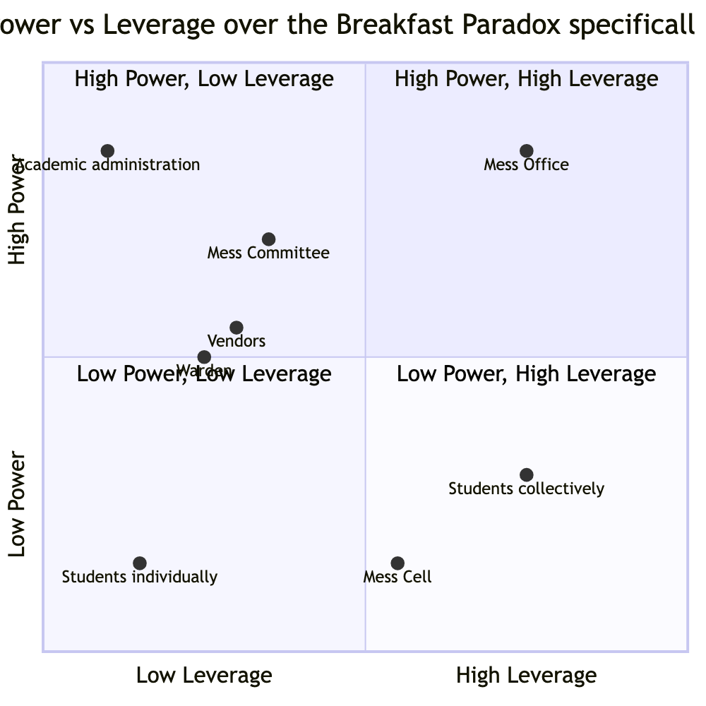
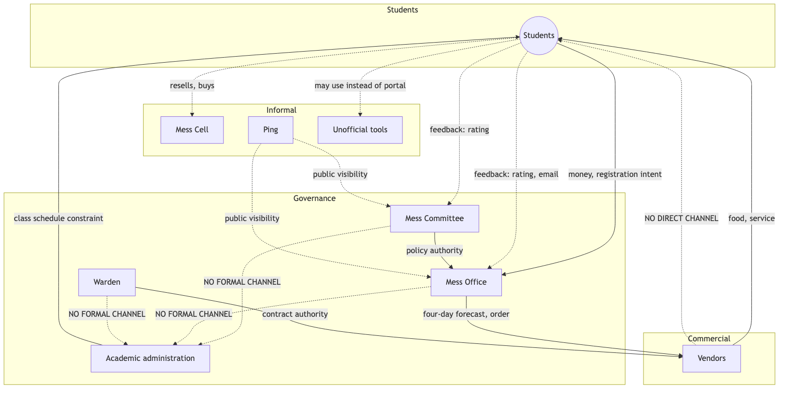

# Executive Summary

Power in this system is not concentrated in one actor and does not move as a single current. It is split across three separate governance bodies whose relationship to one another is only partly established; it is exercised informally by actors with no official standing at all; and its most consequential feature is an absence rather than a presence — the complete lack of any relationship between the one actor who controls the class schedule and the three actors who control everything else about breakfast.

The central finding of this analysis: the actor who bears the full cost of the registration-attendance gap (the student) controls the one input every other actor's planning depends on (registration intent), while bearing no cost for supplying that input inaccurately — a structurally unusual position that is neither straightforwardly powerful nor straightforwardly powerless.

Two findings in this brief were revised on new evidence rather than merely extended: a confirmed student representative structure on mess matters (the Student Parliament's Mess Secretary and per-mess Deputy Secretaries — see the Stakeholder Map for the addition this made there), and a confirmed prior instance of organized student action aimed directly at governance, not only at peer-to-peer transactions. What remains genuinely unresolved — vendor compensation, the exact relationship between a Parliament-internal mess committee and the institute-level Mess Committee, and what that organized action was specifically about — is stated as open, not guessed at, and is listed in full at the end of this document.

Power is treated throughout as issue-specific rather than a single score per actor: a stakeholder may hold high authority over one decision and none over an adjacent one. Every claim below states which domain it applies to and distinguishes formal authority from observed influence.

# Assess Decision-Making Authority

## Formal governance structure

Three separate institutional actors hold mess governance — a split not recognized in this project's own earlier drafts, where "who decides" and "who executes" had been collapsed into one actor:

- **Mess Committee** — a policy body that sets the menu approximately one month ahead of service, with student input. That this body is genuinely separate from the Mess Office is confirmed. That it is chaired by a faculty member traces to a search-engine snippet of a student-publication article that could not be directly verified in full — this specific detail is unconfirmed, though the Committee/Office split itself is not in question. Its authority beyond menu content is unconfirmed.
- **Mess Office** — the operational and administrative arm: places food orders on a four-day lead time, administers the registration platform, and issues operational policy changes. The one confirmed policy action on record — a December 2024 tightening of cancellation rules — was issued by this office alone, with its stated motive being reduced staff workload rather than a student-facing goal.
- **Warden** — holds authority over vendor management and structural changes to the mess. No source describes the Warden taking a specific action; this authority is stated but not observed in any account gathered.

**Academic administration** sets the class schedule, including the 8:30 AM start that overlaps with the breakfast window, with total authority within that domain and zero formal relationship to any of the three mess-governance actors above. This was tested directly: asked whether anyone — student, Committee, or Office — has ever raised the overlap with Academic administration, the answer was that nobody has really tried. This resolves the question in favor of **inattention rather than refusal** — the absence of a relationship reflects that the bridge has never been attempted, not that it was tried and blocked.

**A fifth actor, verified directly from source: the Student Parliament's elected mess-related roles.** IIIT Hyderabad's Student Parliament, elected via Single Transferable Vote at roughly one representative per 50 students, maintains a **Mess Secretary** and a dedicated **Mess Deputy Secretary for each individual mess** — confirmed for Yuktāhār, Kadamba, and Palash, fetched directly from the Parliament's own published records rather than a search snippet. Student representation on mess matters is a dedicated elected role per mess, sitting within the Parliament, rather than a seat appointed by the Mess Committee itself. Parliament representatives also hold a standing meeting format with a **Mess Warden** — a title distinct from, and not yet confirmed identical to, the Warden already named above.

A separately-named "Mess Council," raised earlier as the recipient of a public complaint email, is very likely a naming artifact rather than a real, separate IIIT Hyderabad body: a real Mess Monitoring Council exists at IIT Hyderabad, a different institution with a near-identical name that this Council belongs to, not to IIIT Hyderabad. A domain-restricted search of IIIT Hyderabad's own site found no dedicated "Mess Council" page or reference anywhere.

A sharper, still-unresolved ambiguity replaces it: secondhand sources describe what may be two different things both called "Mess Committee" — a Parliament-internal committee made up of elected representatives that negotiates toward the administration on students' behalf, and, separately, the institute-level, faculty-led policy body described above. Whether these are the same body with mixed membership, or two genuinely separate committees sharing a name, is unresolved and is the sharpest open naming question in the governance structure.

For the majority of specific decisions this system makes — breakfast timing itself, vendor contract terms, portal functionality, waste handling — no source describes who proposes, approves, or can veto a change. This absence, across real interviews, a synthetic pilot exercise, and public-source research, is treated as a finding in itself: these processes may not be visible to anyone outside the governance actors themselves.

## Authority at a glance

| Domain | Proposes | Approves | Confirmed? |
|---|---|---|---|
| Breakfast timing | Unknown — no evidence of anyone ever proposing a change | Unknown | No — precedent unknown |
| Class timing | Academic administration | Academic administration | Confirmed within its own domain, but disconnected from mess governance entirely |
| Registration / cancellation rules | Mess Office | Unclear whether Committee sign-off is required | One case (December 2024) only |
| Menu | Mess Committee, with student input | Mess Committee | Confirmed |
| Vendor contracts | Unknown | Warden (per the Stakeholder Map) | Stated, never observed in action |
| Portal / data governance | Unidentified owner | Unknown | No |
| Mess Cell / informal resale | Students, self-organized | Not applicable — outside formal approval entirely | The market's existence is the only "approval" |
| Waste handling | Unknown | The Facilities/Estate team, at most, as a placeholder | No |

Only two domains — menu, and the one operational policy change on record — have a nameable proposer and approver. For nearly everything else, no source names who proposes, approves, or can block a change. This is recorded as a finding about the limits of what is currently visible, not treated as though it were resolved.

# Identify Formal and Informal Power

Formal power sits with the three governance actors and Academic administration, described above. Four informal actors exercise real influence with no formal standing at all:

- **Roommates and friends** — direct social prompting changes individual attendance decisions in a minor way; both a real respondent and independent synthetic-persona exercises converge on this, though it remains a secondary, not decisive, effect (see the Process Trace for the fuller evidence base — six real student respondents now support this reading).
- **The Mess Cell WhatsApp community** — a self-organized resale market demonstrating real, working peer-to-peer coordination capacity. This capacity has, as far as any evidence shows, mostly been applied to individual transactions rather than a collective approach toward governance — with one significant exception, below.
- **Ping**, the student publication — has published on mess issues at least four times found in this research (a November 2024 piece on a unilateral non-veg cancellation, a December 2024 opinion survey, a January 2025 follow-up, and a 2023 piece on an unrelated water-quality issue at the same institution), creating public visibility for problems that might otherwise stay private. No source identifies this visibility alone producing a policy response.
- **Unofficial registration-management tools** — at least one public, open-source tool lets a student manage registration through an AI agent rather than the official portal, described in its own documentation as built "for students of IIIT Hyderabad." Its existence is confirmed; its adoption and effect on behavior are not.

# Analyse Stakeholder Incentives and Motivations

## Stated interest vs. what the system rewards vs. observed behaviour

| Stakeholder | Stated interest | What the system actually rewards | Observed behaviour | Gap |
|---|---|---|---|---|
| Students | Convenient, affordable, timely food | Nothing rewards registering accurately — billing is identical either way | Register broadly; attendance varies widely | Large |
| Mess Office | Not directly stated by any source | Reduced operational workload — its confirmed, stated motive for the one policy change | Tightened cancellation rules | Small — an unusually clean alignment |
| Mess Committee | Balance student satisfaction against feasibility | Unclear what the Committee itself is rewarded or penalized for | No observed independent action distinct from the Office's | The least-evidenced pairing in this analysis |
| Vendors | Contract renewal, predictable volume | Paid against a four-day forecast regardless of actual attendance (payment mechanism unconfirmed) | Continue producing to the forecast | Cannot be resolved without confirming the payment structure |
| Academic administration | Its own scheduling goals | No incentive of any kind tied to mess outcomes | Total non-engagement | None — this alignment is exactly why the actor is dormant |
| Mess Cell participants | Recoup cost on an unused registration | Direct, immediate financial incentive | An active, functioning market | None — the cleanest incentive-behaviour match in this system |

## Incentive chains

1. Billing tied to registration, not attendance, removes any incentive for a student to register only when genuinely intending to attend — a structural cause, not a personal failing, of the registration-attendance gap. Confirmed.
2. Skip Meal returns nothing to the student, while reselling on Mess Cell returns partial or full value — a student with advance notice has a rational reason to prefer resale over the system's own designed tool for the same situation. Confirmed directly by real interview data (six respondents: zero used Skip Meal for a return of value; four used Mess Cell in some form).
3. Walk-in pricing set 70-90% above the registered rate creates a standing incentive to register even under real uncertainty about attendance, inflating registration counts independent of any subsequent no-show. This is now directly evidenced — all six respondents interviewed register in advance, none day-by-day.
4. The Mess Office's confirmed incentive to reduce its own workload produced a policy — tightened cancellation rules — that reduces student flexibility, plausibly increasing rather than decreasing the pattern it targeted. A candidate case of a fix that fails; not yet confirmed by a governance-side account of its actual effect.
5. Academic administration experiences none of the consequences of the class/mess overlap, so the issue never reaches its agenda by any mechanism evidenced so far, and persists indefinitely with no actor positioned to resolve it unilaterally. Confirmed.

## Bargaining power and dependency

Students depend on vendors for food itself; vendors do not depend on any individual student, a strongly asymmetric relationship consistent with a walk-in pricing structure that requires no negotiation. Vendors depend on the Mess Office for a forecast fixed four days ahead of service; the Mess Office depends on students to register accurately, but nothing in the billing structure requires accuracy — the one dependency in this system where the party with less to lose controls an input the other party cannot substitute. Academic administration depends on nothing in the mess system, and nothing in the mess system depends on it: not an imbalance, but a total absence of mutual dependency. The Mess Cell market and the formal system are similarly independent of one another, though the market may be quietly absorbing some of the formal system's waste problem without either side acknowledging the relationship.

## Historical precedent

**Bakul's creation**, triggered by Kadamba's non-vegetarian capacity reaching its ceiling, resulted in a new mess being established — a confirmed structural response to a limit. Who raised the issue and through what process remain unknown.

**"Let Them Eat Frogs" (November 2024)** — a frog was found in Kadamba's chicken biryani, and the Mess Office responded by unilaterally cancelling non-vegetarian meals at Kadamba without officially communicating the real reason, prompting debate across multiple mail threads. Secondhand, not full-text-verified, but a clean example of unilateral, opaque Mess Office decision-making, preceding the December episode below by about a month.

**The December 2024 cancellation-policy tightening**, triggered by Mess Office workload concerns compounded by a Kadamba renovation, was issued with no evidenced Committee involvement or student consultation beforehand. Organized pushback did occur: Ping ran a student opinion form that returned majority disappointment, and Parliament's mess-related representatives reportedly held two meetings with the Mess Office before the policy took effect, then told Ping they were pushing back. The policy was implemented regardless — a real, partial answer to whether organized student action was effective here, though not yet confirmed to be the same episode independently referenced elsewhere in this project as an "organized email effort."

**"Water Mess" (2023)** — a different domain (drinking-water quality) at the same institution: complaints raised through WhatsApp and email went unaddressed for months despite Parliament requesting water testing, until 38 or more confirmed typhoid cases forced a reactive response. The same complaint-then-ignored-then-crisis-then-reactive-fix shape recurs across two different domains at this institution.

For every other domain examined — breakfast timing specifically, class-timing coordination specifically — no precedent could be found. This is recorded as precedent currently unknown, not assumed to be zero.

# Identify Who Can Influence Decisions and Who Cannot

## Power asymmetries

- **The Mess Office has more power than students over registration and cancellation rules**, because it holds unilateral operational authority and students hold none — rules can be tightened, as in December 2024, without a confirmed consultation step.
- **Vendors have more power than students over food quality and quantity on a given morning**, because vendors control production and students have no direct channel to them at all.
- **Academic administration has more power than every mess-governance actor combined over the one variable — class start time — most likely to resolve the core overlap**, because it holds total, independent authority over its own domain and mess-side actors have no formal channel to it at all.
- **Students have more power than any formal actor over the accuracy of registration data**, because they are the only source of that data and nothing currently requires it to be accurate — every other actor's planning rests on an input its own supplier has no reason to keep honest.

## Consequence and control

**High consequence, low power:** students bear the entire visible cost of this system's central problem — wasted food, lost money, energy crashes — while holding no confirmed authority over any of the domains that produce it: not billing structure, not cancellation rules, not menu weighting by cuisine, not class timing.

**Low consequence, high power:** Academic administration holds total authority over the one variable most likely to resolve the core overlap and experiences none of the consequences of leaving it unresolved — not a moral failing, since nothing in its formal mandate connects it to mess outcomes, but the structural reason the overlap can persist indefinitely.

## Missing voices and missing relationships

| Question | Answer |
|---|---|
| Affected but not represented | Students, on any decision beyond menu content |
| Consulted but cannot decide | Students, on the menu specifically — a named structure exists (Mess Secretary and per-mess Deputy Secretaries, elected through the Student Parliament), but whether this seat carries a vote in the institute-level Mess Committee, or only in the separate Parliament-internal committee, is unconfirmed |
| Decides but does not experience consequences | Academic administration, on class timing |
| Has data but not authority | The Mess Office, plausibly, if registration/attendance data does not reach the Mess Committee |
| Has authority but not data | The Mess Committee, plausibly, over menu decisions made without visibility into which cuisine lines actually get eaten versus registered |
| Implements decisions it did not help design | Vendors, on cancellation-rule changes that directly affect the forecast they must work against |
| Absorbs consequences created upstream | Serving and kitchen staff, who eat unclaimed food themselves |
| No formal escalation channel | Any cross-authority issue — specifically the class/mess overlap — has no established path for either side to raise it with the other |

Beyond the confirmed absence between Academic administration and every mess-governance actor: no source describes a direct relationship between vendors and students, despite vendors controlling exactly what students experience each morning — everything routes through the Mess Office or the portal instead. No source describes a relationship between the Portal/IT owner and the Mess Committee, despite the Committee presumably depending on that system to enforce whatever it decides.

## Coalitions and conflicts

A potential, currently unrealized coalition: students and vendors share an interest in accurate demand signals — students want to avoid double-paying for missed food, and vendors want to avoid over- or under-producing against a forecast. Neither currently has a direct channel to the other; both route through the Mess Office.

Convenience (student interest) against reduced workload (the Mess Office's confirmed incentive) is not a symmetric negotiation — the Office has demonstrated unilateral authority to resolve this conflict in its own favor, and did so in December 2024. Billing certainty (needed by vendors and the Office for forecasting) against attendance uncertainty (a real feature of student life, not a defect) is a structurally misaligned conflict, not a negotiable one — no rule change on either side removes the underlying uncertainty, only shifts who bears its cost.

# Examine Unequal Access to Resources or Opportunities

## Resource control

| Resource | Controls it | Advantage created |
|---|---|---|
| Money (billing) | Mess Office | Sets terms students cannot individually negotiate |
| Food and kitchen infrastructure | Vendors, per cuisine line | Controls what every other actor ultimately needs |
| Registration, attendance, and complaint data | Mess Office (presumed); a Portal/IT owner whose identity is unconfirmed | Holds the only evidence base for whether the paradox is improving or worsening |
| Formal complaint channels (in-app rating, email) | Mess Office, as recipient | One-directional — no confirmed visibility into what happens after submission |
| Informal escalation (Ping, Mess Cell) | Students and Ping, collectively | Creates two tiers of practical access depending on whether a student knows these channels exist |
| The four-day procurement lead time | Mess Office and vendors, structurally rather than by choice | Caps how responsive the entire system can be to same-day information, for every actor equally |
| Institutional legitimacy | The Mess Committee | Not a resource students can acquire individually, only collectively, and only if organized |

Students experience the consequences of every resource in this table and control direct access to none of them — not the terms of billing, not the evidence base that would demonstrate the pattern, not the legitimacy needed to be treated as a counterparty rather than a population to be managed.

## Leverage analysis

Power and leverage are treated as distinct: power is the capacity to influence a decision; leverage is the capacity for a relatively small action to produce a disproportionately large system effect. The Mess Office holds both, having demonstrated authority and a confirmed instance of a small operational change producing a system-wide behavioral effect. Academic administration holds power without leverage over this specific problem. Students, individually, hold neither — but the Mess Cell market demonstrates that students collectively possess real, functioning organizational capacity, and this capacity has also been directed at governance directly at least once. This is better described as **exercised-but-unmeasured leverage** than purely sleeping leverage.

## Sleeping stakeholders

**Academic administration** remains the clearest case: total authority over class timing, zero relationship to any mess-governance actor, and no incentive of any kind pulling it toward engagement.

**The Mess Committee's chair**, if the secondhand report of a faculty chair holds, is a more subtle case — a person with plausible informal, collegial access to other faculty and academic-side actors that no student-only channel possesses, with no evidence this access has ever been used to raise the mess/academic overlap.

**Students, collectively**, occupy a genuinely ambiguous position: the Mess Cell market proves organizing capacity exists at the peer-to-peer level, and an organized effort has also been directed at governance itself at least once. The capacity is not purely unexercised — but what that effort targeted and whether it produced any actual change are both unknown. The open question has narrowed from "has this capacity ever been aimed at governance" to "what happened the one time it was."

# Stakeholder Power-Interest/Leverage Map

Coordinates on this chart are ordinal placements for visual clarity, not measured values — the relative position of each actor across quadrants is the finding, not the specific decimal location. **Mess Committee** — high power over menu, unconfirmed power over anything else. **Mess Office** — the highest-confidence "high power" placement in this system, with a demonstrated instance of exercising authority and changing behavior. **Academic administration** — high power over class timing, essentially zero power or interest specifically over mess outcomes. **Vendors** — moderate power over food quality and quantity within the four-day constraint, low confirmed interest beyond contract terms. **Students** — very high interest, very low formal power: the textbook mismanaged "Keep Informed" quadrant. **Mess Cell and Ping** — low formal power by design, moderate interest, with actual influence running through informal rather than positional channels.

As with the chart above, coordinates are ordinal placements only.

Dotted lines mark informal or unconfirmed channels; "NO FORMAL CHANNEL" marks a confirmed absence of any relationship — most consequentially, between Academic administration and every one of the three mess-governance actors.

# Implications for System Behaviour

The distribution of power described above does not merely coexist with the Breakfast Paradox — it plausibly produces and sustains it. Billing without an attendance incentive removes any structural pressure on the one actor (the student) whose behavior most directly determines the outcome. The one confirmed governance action on record was taken to serve an internal operational goal, not the paradox itself, and may have tightened rather than loosened the underlying pattern. The actor best positioned to resolve the paradox's second major driver — the schedule overlap — remains entirely disconnected from every governance actor who might otherwise raise it, confirmed to reflect inattention rather than a refusal. And the one channel that could plausibly generate collective pressure for change — the students themselves — has been aimed at governance at least once, through an organized effort whose exact subject and outcome remain to be confirmed. The paradox may therefore be sustained less by an absence of channels than by channels that exist but whose effectiveness has never been measured or followed up on.

# Key Findings

1. **Registration without an attendance incentive.** Billing tied to registration count, not attendance, creates no pressure on students to register only when genuinely intending to attend — the most solidly evidenced structure in this system.
2. **Unilateral operational authority in the Mess Office.** The Office issued a real policy change (December 2024) with no evidenced Committee or student involvement beforehand. Whether this generalizes to a standing pattern needs governance-source confirmation.
3. **Total independence of Academic administration from mess governance.** No formal mandate connects the two systems in either direction, confirmed to reflect inattention rather than active refusal.
4. **Asymmetric dependency on registration accuracy.** The party with the least to lose from inaccurate data — students — controls the one input everyone else's forecasting depends on.
5. **Skip Meal as a dominated strategy.** Skip Meal returns nothing to the student; resale returns partial or full value, making resale the rational choice whenever advance notice exists — mechanically plausible given confirmed pricing, and now directly confirmed by real interview data.
6. **Exercised-but-unmeasured collective leverage.** Real self-organizing capacity exists (Mess Cell) and has also been aimed at governance directly at least once, through an organized effort — the December 2024 Ping-survey-and-Parliament-negotiation episode is a strong but unconfirmed candidate match.
7. **A confirmed feedback input with an unconfirmed output.** Three real channels — in-app rating, email, Ping coverage — carry input into the system; none has a confirmed instance of producing a decision.

# Outstanding Data Collection

The following items depend on a mess-committee or mess-vendor source and have not yet been confirmed; **this data will be collected and submitted later**, once that interview round is completed:

- Vendor compensation structure (fixed, per-meal, or per-registration) — determines whether vendors bear any cost of the registration-attendance gap.
- A specific instance of vendor bargaining or contract renegotiation.
- Who actually sees and acts on per-meal ratings once submitted.
- Whether the December 2024 Ping-survey-and-Parliament-negotiation episode is the specific "organized email effort" this project has otherwise only heard about secondhand, and if so, whether "opposition registered, policy implemented anyway" is the complete account of whether it worked. This is the single highest-priority open question in this analysis.
- Whether Committee approval is formally required for a Mess Office operational change, and whether the Parliament-internal mess committee and the institute-level Mess Committee are the same body or two different ones sharing a name.
