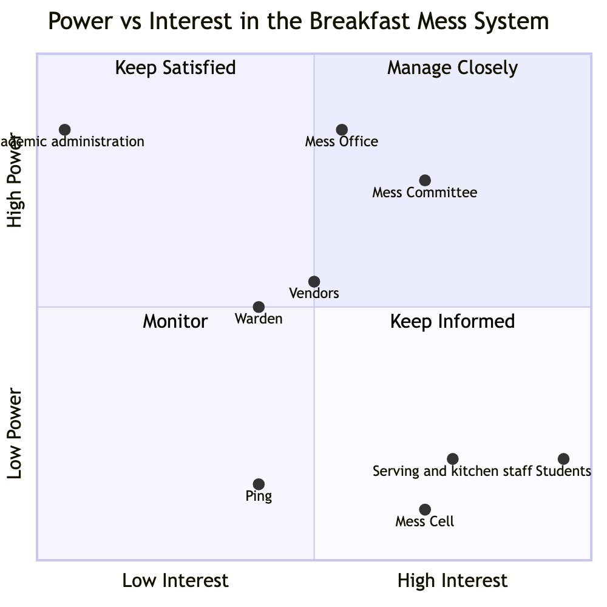
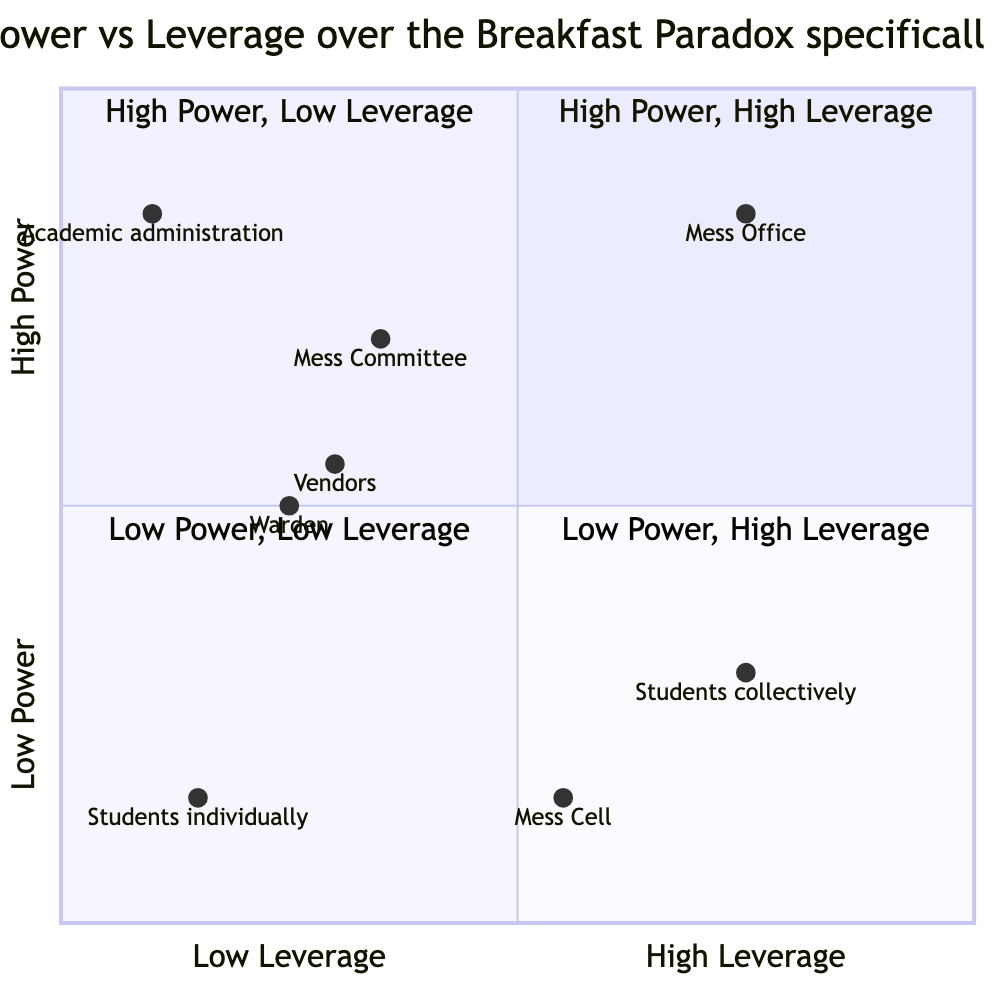
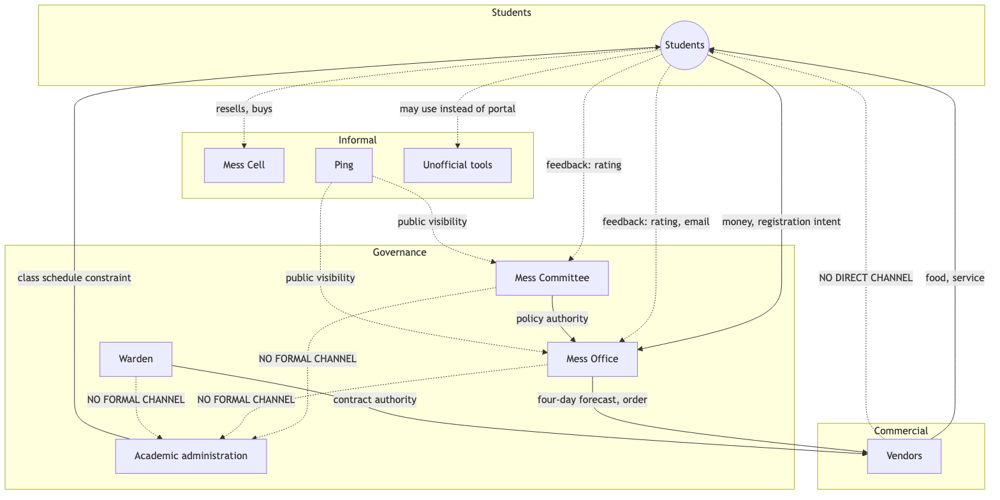

# Executive Summary

Power in this system is not concentrated in one actor and does not move as a single current. It is split across several governance bodies whose relationship to one another is only partly established. It is exercised informally by actors with no official standing at all. Its most consequential features are two absences rather than presences: there is no relationship between the one actor who controls the class schedule and the actors who control everything else about breakfast, and there is no route by which the kitchen's own records of the gap reach anyone who sets the rules that produce it.

The first central finding of this analysis: students control an input that nothing requires to be accurate. Registration is an automatic default rather than a daily decision to eat. At Kadamba in April 2026, 32,162 breakfast registrations produced 11,941 meals eaten, a turnout of 37.1%, and registrations stayed flat at about 1,070 a day on every weekday while turnout ranged from 42.1% on Tuesdays to 27.3% on Sundays (confirmed from the scan records). The mess operators, the only actors who plan food against this input, each correct it privately, in opposite spirits. Yuktāhār distrusts the registration count and replaces it with its own records. Kadamba treats the count as its paid obligation and cooks a fixed 70% of it, then tops up from the counter (single-sourced). An earlier version of this brief said every operator has learned to distrust registration; that was revised, because it held for Yuktāhār only. The institution's own scan records measure the inaccuracy, but nothing routes that measurement into a rule, and the institution never sees either operator's correction.

The second central finding: the mess operator is the data-rich, authority-poor actor in this system. The operator sets the parameter with the largest immediate effect on breakfast waste, which is how much of each registration actually gets cooked, and Yuktāhār in particular keeps the system's only per-item, per-weekday record of registered, eaten and wasted food, in a set of books it reconciles against one another every day (confirmed). Kadamba holds per-dish gram standards and live counter knowledge but no per-item waste record was seen. Neither operator has authority over the registration cut-off, cancellation rules, billing or menu, and neither has a route by which its records reach anyone who does.

Several findings in earlier versions of this brief were revised on the operations evidence gathered in September 2026 from three mess operators and from the institute's own scan records, rather than merely extended. Vendors were previously described as passive actors who produce to a forecast fixed four days ahead; that was revised, because no operator cooks the full registration count for breakfast and the four-day lead time turned out to be the students' registration cut-off, not a procurement lock. A second, first-hand field account of Kadamba and Yuktāhār then added three things: Kadamba's full command chain from the institute down to its service staff, the finding that the two operators take opposite stances toward registration under the same billing basis, and the finding that the institution's routine oversight of the kitchen covers safety and taste but never quantity or waste. The Mess Office was previously presumed to hold the system's evidence base; that was revised, because the evidence sits with the operators and, separately, with the CDS team's scan records. Students were previously described as having no direct channel to vendors; that was revised, because a weak, informal channel runs through menu selection and the counter. Two earlier revisions still stand: a confirmed student representative structure on mess matters (the Student Parliament's Mess Secretary and per-mess Deputy Secretaries, an addition first made in the Stakeholder Map), and a confirmed prior instance of organized student action aimed directly at governance.

What remains unresolved is stated as open, not guessed at, and is listed in full at the end of this document. The most consequential open question is whether operators are paid per registered plate or per served plate, because that decides whether the registration gap costs the operator money or earns it money. The Kadamba operator's remark that it cooks on registrations because "they are getting paid for it" leans toward the per-registered-plate reading but is not contract evidence, so the question stays open.

Power is treated throughout as issue-specific rather than a single score per actor: a stakeholder may hold high authority over one decision and none over an adjacent one. Every claim below states which domain it applies to and distinguishes formal authority from observed influence.

# Assess Decision-Making Authority

## Formal governance structure

Three separate institutional actors hold mess governance, a split not recognized in this project's own earliest drafts, where "who decides" and "who executes" had been collapsed into one actor:

- **Mess Committee**: a policy body that sets the menu approximately one month ahead of service, with student input. That this body is genuinely separate from the Mess Office is confirmed. That it is chaired by a faculty member rests on a single secondhand report and is unconfirmed, though the Committee/Office split itself is not in question. Its authority beyond menu content is unconfirmed.
- **Mess Office**: the operational and administrative arm. It administers the registration platform, which closes about four days before service, and issues operational policy changes. The one confirmed policy action on record, a December 2024 tightening of cancellation rules, was issued by this office alone, with its stated motive being reduced staff workload rather than a student-facing goal. An earlier version of this brief said the Mess Office places the food orders on a four-day lead time. That was revised by the operations evidence: operators buy their own food (confirmed at Yuktāhār, single-sourced at Kadamba), on cycles far shorter than four days, and the four-day figure is the students' registration cut-off.
- **Warden**: holds authority over vendor management and structural changes to the mess. No source describes the Warden taking a specific action; this authority is stated but not observed in any account gathered.

**Academic administration** sets the class schedule, including the 8:30 AM start that overlaps with the breakfast window, with total authority within that domain and zero formal relationship to any of the mess-governance actors above. No student, Committee or Office has ever raised the overlap with Academic administration; in the one direct account on this point, nobody has really tried. This resolves the question in favor of **inattention rather than refusal**: the absence of a relationship reflects that the bridge has never been attempted, not that it was tried and blocked. The same disconnection reaches the kitchen. Exams, events and holidays reach the Yuktāhār kitchen only if someone raises them in the operator's planning meeting, in the operator's words, "we don't come to know until we sit in the meeting" (confirmed). There is no formal calendar feed from the institute to any operator.

**A further actor, verified directly from source: the Student Parliament's elected mess-related roles.** IIIT Hyderabad's Student Parliament, elected via Single Transferable Vote at roughly one representative per 50 students, maintains a **Mess Secretary** and a dedicated **Mess Deputy Secretary for each individual mess**, confirmed for Yuktāhār, Kadamba and Palash from the Parliament's own published records. Student representation on mess matters is a dedicated elected role per mess, sitting within the Parliament, rather than a seat appointed by the Mess Committee itself. Parliament representatives also hold a standing meeting format with a **Mess Warden**, a title distinct from, and not yet confirmed identical to, the Warden named above.

**The CDS team** is the institutional counterpart operators actually name. At the Vijayalakshmi Caterers mess, complaints arrive from the "CDS team" and pass from the operator's manager to the kitchen and on to the operator's managing director; at Kadamba, complaints arrive by email from a director and are relayed by the operator's manager into a WhatsApp group that a site or facility team also reports into (both single-sourced). The April 2026 Kadamba breakfast scan records came from the CDS team (confirmed). Whether "CDS" names the same department this brief calls the Mess Office is unconfirmed, and the two are kept separate here rather than merged. Institutional oversight at Kadamba is routine but narrow. Every meal passes a fixed food-safety sequence: the cooking temperature is checked, a sample is kept for 72 hours so the food can be tested if anyone falls ill, a wrapped display plate is set at the entrance, the serving temperature of each item is measured, and a facility team tastes the food together with two of the operator's staff before corrections are made and service opens. The display plate and the joint tasting are confirmed by observation; the rest is single-sourced. Quality control inspects weekly, including the store, and the TDS of cooking and drinking water is read daily, with any failure triggering a full check (single-sourced). Whether the quality-control visits can penalize or only inspect is unknown, and whether the "facility team" is the CDS site or facility team named in the complaint WhatsApp group is unconfirmed; they are not merged here.

**The Kadamba command chain**, as the operator describes it, runs from CFS to CDS, then to the contractor Prism, and inside Prism from the operations manager to a manager, a supervisor and the service staff (single-sourced). Prism is an outsourced third-party vendor that registers as a vendor, wins the contract by tender bid and runs all of Kadamba's operations. This is the first account that places CFS at the top of the chain and names the contract holder. The head of CDS is named in the team's site account, while an earlier interview names a CDS Chair; the two names differ, and whether they are two roles or one role misnamed is open, so they are not merged. A separate staff account of an operator's internal reporting chain, from staff to supervisor to manager to operations manager to director, matches the lower part of this chain, but which mess it describes is unconfirmed, so reading it as Prism's chain is candidate.

A separately named "Mess Council," raised earlier as the recipient of a public complaint email, is very likely a naming artifact rather than a real, separate IIIT Hyderabad body: a real Mess Monitoring Council exists at IIT Hyderabad, a different institution with a near-identical name, and IIIT Hyderabad's own site carries no "Mess Council" reference anywhere.

A sharper, still-unresolved ambiguity replaces it. Secondhand sources describe what may be two different things both called "Mess Committee": a Parliament-internal committee of elected representatives that negotiates toward the administration on students' behalf, and the institute-level, faculty-led policy body described above. Operators add a third name. The Kadamba and Vijayalakshmi operators both say a "student committee" chooses the menu from options the operator supplies (single-sourced). Whether this student committee is either of the two Mess Committees, or the CDS Committee named elsewhere in this project, is unconfirmed, and the three are not assumed to be one body.

For several specific decisions this system makes, including breakfast timing itself, the registration cut-off, and the terms of the operator contract beyond the tender, no source describes who proposes, approves, or can veto a change. This absence, across every available source, is treated as a finding in itself.

## Operator-side authority

"Vendors" was a single box in earlier versions of this brief. The operators' own accounts show a layered actor whose internal structure decides who holds which power.

- **Contract and price terms** sit with the operator's owners or managing director. The Kadamba manager does not know the plate rate: "our owners are directly dealing with them" (single-sourced). The reporting chain inside an operator runs from staff to supervisor to manager to operations manager to director (single-sourced, mess unconfirmed); at Kadamba, Prism's chain runs from the operations manager through a manager and a supervisor to the service staff (single-sourced).
- **Quantity rules** sit with the operator, and no institutional approval of them is evidenced anywhere. At Kadamba the standing rule is Prism's: a first batch of 70% of registrations, planned separately for veg and non-veg, with a gram standard for every dish (four idlis a person, 100 g of sambar, and separate standards for poha, pulao and the rest), and the remaining raw material kept ready to cook in 10 to 15 minutes. Biryani lunch is the exception, cooked at 100% of registrations at two pieces of 150 to 200 g each with unlimited rice, with a head chef brought in (all single-sourced). The ratio is therefore set per menu item at the operator's discretion, with no institutional rule either way. The Vijayalakshmi operator cooks 70% to 80% and brings more from its off-site kitchen within about 30 minutes (single-sourced).
- **The in-service top-up decision** sits with a different person in each mess. At Kadamba the supervisor is in constant check at the counters and tells the kitchen how much more to cook; staff watch each dish's level against its gram standard, and the chef cooks against registrations and turnout so far (single-sourced). Items such as bonda, puri, vada and idli "float", with diners taking more than the standard. At Yuktāhār, run by ABC Hospitality Services, the same decision is collective: a planning meeting of the whole team, twice a day, discounts portal registrations using the matching week from the menu's two-week cycle in the Wastage Book, the attendance register grouped by weekday, the month's turnout and any holidays or campus events (confirmed), and during service the team uses the first half hour as a sample to project the rest of the meal (single-sourced).
- **Re-cook decisions, portioning, leftover reuse and supplier choice** also sit with the operator. The Yuktāhār Wastage Book is used as a rule, "if it runs out at 1:30 we re-cook; if at 2:20 we don't," and leftover idli, dosa batter and milk are reused, with leftover idli turned into idli upma or idli poha for lunch (confirmed). Yuktāhār holds a norm for the grams of dirt and stones expected in each raw item and complains to or changes the supplier when it is exceeded, and it visits the mills that supply its oil (single-sourced). The Vijayalakshmi mess has switched paneer brands twice after complaints (single-sourced). During the LPG shortage the Kadamba operator cut quantities and bought items from outside on its own initiative (single-sourced). Who holds authority to replace broken equipment is unknown; the Kadamba toaster was broken with no replacement at the time of the visit.
- **Internal structure** is the sharpest contrast between the two operators. Yuktāhār is flat: two project managers, no hierarchy, no storekeeper-only role, and everyone does every job across tasting, cutting and cleaning teams. Records are checked by peers rather than by superiors, and the mess in-charge, who also keeps the accounts, keeps the Wastage Register while a colleague cross-verifies the grocery register (single-sourced; the cross-verifier's signature on a photographed fridge checklist is confirmed). Leave has no formal policy and is shared by agreement in the daily meeting. The site head describes a proposal-and-review practice, "you follow this; if you find any problems come back to me" (confirmed). Kadamba runs the layered chain above, in which the supervisor decides and no staff voice was described.

The operator therefore holds high local authority over the quantity, timing and reuse of food, and none over the rules that shape how many students register.

## Authority at a glance

| Domain | Proposes | Approves | Confirmed? |
|---|---|---|---|
| Breakfast timing | Unknown; no evidence of anyone ever proposing a change | Unknown | No. Service is meant to close at 9:30, but late diners come in through the back door after the front door closes and the operator says it cannot refuse them (single-sourced); 1,100 of 11,941 April breakfast scans, 9.2% or about 37 a day, fall at or after 9:30 (confirmed from scan records) |
| Class timing | Academic administration | Academic administration | Confirmed within its own domain, but disconnected from mess governance entirely |
| Registration cut-off and cancellation rules | Mess Office | Unclear whether Committee sign-off is required | One case (December 2024) only. Registration is mandatory and automatic, applied whether or not the student is on campus; the only exit is five cancellations per meal type per month made at least four days ahead, and beyond that the charge cannot be nullified (confirmed) |
| Menu | Operator supplies options (single-sourced) | A student committee selects (single-sourced, identity unconfirmed); formal approval by the Mess Committee is reported | Selection by students confirmed in outline, the deciding body's identity not |
| Preparation quantity and first-batch ratio | Yuktāhār's daily team meeting; at Kadamba, Prism's standing ratio and gram standards, with the supervisor deciding each top-up during service | Operator; no institutional approval evidenced | Confirmed at Yuktāhār; single-sourced at Kadamba and the Vijayalakshmi mess |
| Leftover reuse and supplier choice | Operator | Operator | Confirmed at Yuktāhār; single-sourced elsewhere |
| Vendor contracts | The institute publishes a tender with project details and cost; operators bid, and Prism holds Kadamba's contract this way (single-sourced) | The closest or lowest bid is selected (single-sourced); the Warden per the Stakeholder Map | Tender route single-sourced; the award authority is not confirmed |
| Complaint routing | CDS team or a director's email, to the operator's manager, to the kitchen | Operator's manager acts locally | Single-sourced |
| Food safety and quality inspection | Per meal, a facility team tastes with two Prism staff after temperature checks and a 72-hour sample; quality control inspects weekly; water TDS is read daily | Corrections are made before service; unknown whether quality control can penalize | Display plate and joint tasting confirmed by observation; the rest single-sourced. No check covers quantity cooked or wasted |
| Portal and scan data | CDS team can export registration-level scan records | Formal owner unconfirmed | Export capability confirmed |
| Mess Cell / informal resale | Students, self-organized | Not applicable; outside formal approval entirely | The market's existence is the only "approval" |
| Waste handling | Operator | Operator; who pays the garbage contractor is unknown | At Kadamba, waste goes to a dustbin collected by a garbage contractor, and the operator does no composting (single-sourced); whether the contractor takes it to an outside compost facility, as the CFS Chair described, is unverified. Yuktāhār's disposal route was not stated |

Several domains now have a nameable proposer and approver: the menu, the one operational policy change on record, and every quantity and reuse decision inside the kitchen. The domains that still have none, breakfast timing and the registration cut-off above all, are the ones that set how many students register in the first place.

# Identify Formal and Informal Power

Formal power sits with the governance actors and Academic administration, described above. Four informal actors exercise real influence with no formal standing at all:

- **Roommates and friends**: direct social prompting changes individual attendance decisions in a minor way, though it remains a secondary, not decisive, effect (six real student respondents support this reading). Friends also eat in place of registrants who do not come; the Kadamba manager describes this as routine (single-sourced), which corroborates from the operator side that informal redistribution of registrations happens and is tolerated.
- **The Mess Cell WhatsApp community**: a self-organized resale market demonstrating real, working peer-to-peer coordination capacity. This capacity has mostly been applied to individual transactions rather than a collective approach toward governance, with one significant exception, below.
- **Ping**, the student publication, has published on mess issues at least four times (a November 2024 piece on a unilateral non-veg cancellation, a December 2024 opinion survey, a January 2025 follow-up, and a 2023 piece on an unrelated water-quality issue at the same institution), creating public visibility for problems that might otherwise stay private. No source identifies this visibility alone producing a policy response.
- **Unofficial registration-management tools**: at least one public, open-source tool lets a student manage registration through an AI agent rather than the official portal, described in its own documentation as built "for students of IIIT Hyderabad." Its existence is confirmed; its adoption and effect on behavior are not.

Late diners hold a small but routine informal power over the operator. Kadamba's breakfast is meant to close at 9:30, yet when the front door closes, students come in through the back door and demand food, and the operator says it cannot refuse them (single-sourced; 25 came after close on one biryani day). The records show this is not occasional: 9.2% of April breakfast scans, about 37 a day, fall at or after 9:30 (confirmed). An earlier version of this brief described the operator reopening the door at its own discretion; that was revised, because the operator describes a grace period no rule grants and it cannot decline.

The mess operator also exercises informal power beyond its formal remit. Kadamba cooks about 30 portions for 30 to 50 people from outside the student registration, such as night-shift security who do not want to leave to eat, and about half of Kadamba's own staff also eat from the same food (single-sourced). An earlier version of this brief put these diners at 20 to 30 staff eating what is left after students; that was revised on the first-hand account. These are accommodations that no rule grants and no rule forbids, and each absorbs part of the gap between registration and turnout without it ever being reported. The people fed this way have no voice in how much is cooked.

# Analyse Stakeholder Incentives and Motivations

## Stated interest vs. what the system rewards vs. observed behaviour

| Stakeholder | Stated interest | What the system actually rewards | Observed behaviour | Gap |
|---|---|---|---|---|
| Students | Convenient, affordable, timely food | Nothing rewards registering accurately; billing is identical either way | Register as a standing booking and attend far less: 37.1% breakfast turnout at Kadamba in April 2026 and about 28% at Yuktāhār in September 2026, against 56% to 89% for Yuktāhār lunch (all confirmed from records) | Large, and breakfast-specific in size |
| Mess Office | Not directly stated by any source | Reduced operational workload, its confirmed, stated motive for the one policy change | Tightened cancellation rules | Small; an unusually clean alignment |
| Mess Committee | Balance student satisfaction against feasibility | Unclear what the Committee itself is rewarded or penalized for | No observed independent action distinct from the Office's | The least-evidenced pairing in this analysis |
| Kadamba operator (Prism) | Meeting the registration as an obligation, "a responsibility and they are getting paid for it" (single-sourced, the operator's stated attitude rather than contract text); contract renewal is assumed rather than stated | A contract won by tender bid (single-sourced); the manager does not know the plate rate, and whether pay follows registered or served plates is unconfirmed | Cook a fixed 70% of registrations, veg and non-veg separately, then top up from the counter on the supervisor's call; 100% on biryani days | Cannot be resolved until the payment basis is confirmed |
| Yuktāhār operator (ABC Hospitality Services) | Best food quality, less waste, an optimised workflow, lower operating cost, standardisation and higher profit, stated as an explicit management goal (single-sourced) | A plate-rate structure assumed to match Kadamba's; waste reduction is a cost lever for the vendor | Discount registration using its own books, re-estimate from the first half hour of service, reuse leftovers, weigh waste daily | Small; the stated goal and the practice match |
| Other operators | More say over the menu (the Vijayalakshmi mess manager, single-sourced) | A tendered plate rate paid monthly as a lump sum on plate count, with deductions (single-sourced, figures unverified) | Cook 70% to 80%, top up within about 30 minutes | Cannot be resolved until the payment basis is confirmed |
| Academic administration | Its own scheduling goals | No incentive of any kind tied to mess outcomes | Total non-engagement | None; this alignment is exactly why the actor is dormant |
| Mess Cell participants | Recoup cost on an unused registration | Direct, immediate financial incentive | An active, functioning market | None; the cleanest incentive-behaviour match in this system |

An earlier version of this table said vendors "continue producing to the forecast." That was revised by the operations evidence: none of the three operators cooks the full registration count for breakfast, and all three watch live counts and top up. Kadamba cooks 100% only for biryani lunch, the one meal where it expects near-full turnout. The two operators with the fullest accounts are assumed to share one billing structure, yet they take opposite stances: Yuktāhār pursues lower cost by learning from its records, while Kadamba applies a fixed ratio as an obligation. The difference tracks management culture rather than the payment rule, which makes operator culture a candidate lever in its own right.

## Incentive chains

1. Billing tied to registration, not attendance, removes any incentive for a student to register only when genuinely intending to attend, a structural cause, not a personal failing, of the registration-attendance gap. Confirmed, and now quantified from records: registrations at Kadamba breakfast stay flat across the week, Sunday included, while turnout falls to 27.3% on Sundays, and veg registrants attend at 32.4% against 48.5% for non-veg registrants.
2. Skip Meal returns nothing to the student, while reselling on Mess Cell returns partial or full value, so a student with advance notice has a rational reason to prefer resale over the system's own designed tool for the same situation. Confirmed directly by real interview data (six respondents: zero used Skip Meal for a return of value; four used Mess Cell in some form).
3. Walk-in pricing set roughly 70% above the registered rate (₹81 against ₹48 for a vegetarian breakfast) creates a standing incentive to register even under real uncertainty about attendance, inflating registration counts independent of any later no-show. All six respondents interviewed register in advance, none day-by-day. Walk-in demand at breakfast is real but small: the Yuktāhār breakfast register records between none and twelve unregistered, paid, faculty and staff diners a day, usually four or fewer, with twelve on the peak day, nine of them paid (confirmed), which fits students choosing to register rather than pay at the door.
4. The Mess Office's confirmed incentive to reduce its own workload produced a policy, tightened cancellation rules, that reduces student flexibility, plausibly increasing rather than decreasing the pattern it targeted. A candidate case of a fix that fails; not yet confirmed by a governance-side account of its actual effect.
5. Academic administration experiences none of the consequences of the class/mess overlap, so the issue never reaches its agenda by any mechanism evidenced so far, and persists with no actor positioned to resolve it unilaterally. Confirmed.
6. The operator's payment basis decides which side of the gap it sits on. If operators are paid per registered plate, the operator is paid for the whole registration but cooks only a fraction of it (70% to 80% at Kadamba and the Vijayalakshmi mess, single-sourced), so the gap is margin for the operator and it has no financial reason to push for accurate registration. If operators are paid per served plate, the operator bears the cost of every portion cooked and not eaten, and has every reason to want accurate registration. No operator has stated a position on the cut-off either way. Kadamba's remark that it cooks on registrations because it is "getting paid for it" leans toward the first reading but does not settle it. Under per-registered-plate billing, both Yuktāhār's profit goal and Kadamba's fixed ratio gain from cooking less than is registered; they differ in whether the saving is pursued through records or through a fixed rule. Both readings remain candidate; this is the single most important unresolved incentive question in this analysis.

## Bargaining power and dependency

Students depend on operators for food itself; operators do not depend on any individual student, a strongly asymmetric relationship consistent with a walk-in pricing structure that requires no negotiation. Operators depend on registration only as a ceiling. Their real planning input is their own history at Yuktāhār, or a fixed ratio at Kadamba and the Vijayalakshmi mess, and neither ratio is calibrated to actual breakfast turnout: a first batch of about 70% of registrations at Kadamba against 37.1% turnout in April implies roughly 1.9 times over-preparation before any top-up (candidate, combining records with a single-sourced ratio). Because the ratio is applied to veg and non-veg separately, the gap differs by stream: 70% of about 757 daily veg registrations against about 245 veg meals eaten is about 2.2 times, and 70% of about 315 non-veg registrations against about 153 eaten is about 1.4 times (candidate). The operator reports only 5% to 10% daily waste, on an unstated base (single-sourced). That figure cannot be squared with this surplus unless most of it is eaten by the outside diners and staff, held and reheated into later service, offset by top-ups smaller than the first batch implies, or measured on a different base; which of these holds is not known, and the tension is left open here. Whichever absorber takes the surplus is an actor with a stake in the ratio staying where it is. An earlier version of this paragraph said vendors depend on the Mess Office for a forecast fixed four days ahead; that was revised, because operators procure on their own cycles (groceries fortnightly, vegetables two to three times a week and milk daily at Yuktāhār, confirmed; at Kadamba dry goods one week ahead, perishables such as milk, fruit, meat, eggs and most vegetables the day before, and some vegetables two to three days ahead, single-sourced) and adjust cooking on the day. The Mess Office depends on students to register accurately, but nothing in the billing structure requires accuracy. Academic administration depends on nothing in the mess system, and nothing in the mess system depends on it: not an imbalance, but a total absence of mutual dependency. The Mess Cell market and the formal system are similarly independent of one another, though the market may be quietly absorbing some of the formal system's waste problem without either side acknowledging the relationship.

Operators show clear bargaining power over their own suppliers: the Vijayalakshmi mess switched paneer brands after complaints, and Yuktāhār holds a per-item norm for impurities in raw stock, complains to or changes the supplier when it is exceeded, visits the mills that make its oil, and has used only rock salt and cold-pressed oil for about six months (all single-sourced). No instance of an operator bargaining with the institution is evidenced. No operator has stated an objection to the four-day cut-off, and none is recorded raising it with a rule owner.

## Historical precedent

**Bakul's creation**, triggered by Kadamba's non-vegetarian capacity reaching its ceiling, resulted in a new mess being established, a confirmed structural response to a limit. Who raised the issue and through what process remain unknown.

**"Let Them Eat Frogs" (November 2024)**: a frog was found in Kadamba's chicken biryani, and the Mess Office responded by unilaterally cancelling non-vegetarian meals at Kadamba without officially communicating the real reason, prompting debate across multiple mail threads. Secondhand and not full-text-verified, but a clean example of unilateral, opaque Mess Office decision-making, preceding the December episode below by about a month.

**The December 2024 cancellation-policy tightening**, triggered by Mess Office workload concerns compounded by a Kadamba renovation, was issued with no evidenced Committee involvement or student consultation beforehand. Organized pushback did occur: Ping ran a student opinion form that returned majority disappointment, and Parliament's mess-related representatives reportedly held two meetings with the Mess Office before the policy took effect, then told Ping they were pushing back. The policy was implemented regardless, a real, partial answer to whether organized student action was effective here, though not yet confirmed to be the same episode referenced elsewhere in this project as an "organized email effort." The current cap of five cancellations per meal type per month, made at least four days ahead, may be the tightened rule's present form; the cap itself is confirmed from the published rule and from students' own experience.

**Non-compulsory registration during shortages and holidays (date unknown)**: during an LPG shortage, and during holidays and fests, registration was made non-compulsory and the cancellation cap raised from five to ten (single-sourced). The standing model returned once the trigger passed. This is the one evidenced case of the registration rules being loosened, and it shows the rule owner can change them quickly when a supply shock or a predictable low-attendance period forces it.

**The Yuktāhār waste-tracking change (August to December of the operator's first year)** is the one evidenced case of an actor in this system deliberately changing its own practice to reduce waste. The operator's management introduced per-item waste recording; staff first resisted, fearing blame ("they are catching us"), and by December staff themselves reported that waste had fallen (confirmed). The project managers deliberately made the weighing blame-free and discussed it every day in the team meeting (single-sourced), and that is the condition under which measurement changed behaviour. The operator also tried and dropped the Zoho ERP system, because "prediction will be based on our data only; I want to remain close to the data" (confirmed), and because paying lakhs of rupees for prediction made no sense when the data already sat in its books and its staff are not digitally inclined (single-sourced). The change stayed inside the kitchen. Nothing shows it reaching any rule owner.

**"Water Mess" (2023)**: a different domain (drinking-water quality) at the same institution. Complaints raised through WhatsApp and email went unaddressed for months despite Parliament requesting water testing, until 38 or more confirmed typhoid cases forced a reactive response. The same complaint-then-ignored-then-crisis-then-reactive-fix shape recurs across two different domains at this institution.

For breakfast timing and class-timing coordination specifically, no precedent could be found. This is recorded as precedent currently unknown, not assumed to be zero.

# Identify Who Can Influence Decisions and Who Cannot

## Power asymmetries

- **The Mess Office has more power than students over registration and cancellation rules**, because it holds unilateral operational authority and students hold none; rules can be tightened, as in December 2024, without a confirmed consultation step.
- **Operators have more power than students over food quality and quantity on a given morning**, because operators decide how much of each registration is cooked, when to re-cook and what to reuse. Students reach operators only through a weak, informal channel: menu selection through a student committee, and complaints at the counter.
- **Operators adjust on the day; students are locked in four days ahead.** The registration cut-off binds students about four days before service, while operators top up within 10 to 30 minutes and, at Kadamba, order perishables one day ahead and dry goods one week ahead (single-sourced). The flexibility asymmetry runs against the party who knows least about the morning. An earlier version of this brief described the four-day lead time as capping every actor's responsiveness equally; that was revised on the operations evidence.
- **Academic administration has more power than every mess-governance actor combined over the one variable, class start time, most likely to resolve the core overlap**, because it holds total, independent authority over its own domain and mess-side actors have no formal channel to it at all.
- **Students have more power than any formal actor over the accuracy of registration data**, because they are the only source of that data and nothing requires it to be accurate. Yuktāhār replaces it with its own records and Kadamba discounts it by a fixed ratio; either way the correction is private, so its inaccuracy shows up in the kitchen and nowhere else.
- **The institution exercises routine oversight power over the kitchen every meal, but only over safety and taste.** Temperature checks, the 72-hour sample, the display plate, the joint tasting, weekly quality control and daily water readings all look at whether food is safe and good; no check anywhere covers how much is cooked or wasted. Formal power is present in the kitchen daily and pointed at a different variable from the one producing the gap.

## Consequence and control

**High consequence, low power:** students bear the most visible cost of this system's central problem (wasted food, lost money, energy crashes) while holding no confirmed authority over any of the domains that produce it: not billing structure, not cancellation rules, not class timing. Registration is mandatory and automatic, applied even when a student is off campus or on holiday, and a student cannot switch off the charge beyond five cancellations a month made four days ahead (confirmed). Skip Meal tells the kitchen not to prepare but does not remove the charge. The standing booking is therefore a default the student cannot opt out of, not a choice. Their influence over menu content is real but runs through a committee whose identity is unconfirmed.

**Consequence absorbed downstream, no power:** operators absorb over-preparation and closing-rush shortages. The Kadamba scan records show one continuously building crowd, with 26.5% of all breakfast scans falling between 9:15 and 9:30, just before close, and the rate still rising at 9:29 (confirmed), and all three operators describe the closing rush as the moment they re-cook or hold extra food in reserve. The Kadamba operator's own rule of thumb, about 150 diners in the last 10 minutes of any meal, corroborates the crest (single-sourced); the records remain the measure, with about 79 scans a day, 19.8% of the total, between 9:20 and 9:29. Whether over-preparation costs the operator money depends on the unconfirmed payment basis. At Kadamba, 30 to 50 outside diners and about half of the operator's own staff eat from the same food (single-sourced), an uncounted absorber of first-batch surplus with no voice in how much is cooked. The garbage contractor removes the rest at Kadamba, where the operator does no composting (single-sourced), and it has no voice in the system. Cooked food is usable for only three to four hours, so cooked surplus cannot be carried to another day, while Yuktāhār reuses what it can as a new dish, curd or batter (confirmed). Within a meal, Kadamba's surplus is not simply discarded: in the team's own observation, food there is cooked ahead, reheated and moved between vessels repeatedly and degrades fast, so diners bear part of the cost of over-preparation as lower quality (candidate chain; no link to skipping is evidenced).

**Low consequence, high power:** Academic administration holds total authority over the one variable most likely to resolve the core overlap and experiences none of the consequences of leaving it unresolved; nothing in its formal mandate connects it to mess outcomes, which is the structural reason the overlap can persist indefinitely.

## Missing voices and missing relationships

| Question | Answer |
|---|---|
| Affected but not represented | Students, on the registration cut-off, cancellation rules and billing |
| Consulted but cannot decide | Students, on cut-off, cancellation and billing: a named structure exists (Mess Secretary and per-mess Deputy Secretaries), but whether it carries a vote on these rules is unconfirmed. Operators, on the menu: they supply options and follow the selection |
| Decides but does not experience consequences | Academic administration, on class timing |
| Oversees the kitchen but not the quantity | The facility team and quality control, whose per-meal tasting and weekly inspection cover safety and taste only |
| Has the best data but no authority | The mess operator, most fully Yuktāhār. Its books record registered, eaten and wasted food per item, per meal and per weekday, with run-out times, re-cook quantities, plate waste and leftovers, alongside grocery issues, stock, vegetables, milk, gas, electricity and water; the store book must match what was cooked, and any mismatch goes to the daily meeting (confirmed). Kadamba holds per-dish gram standards and reports 5% to 10% daily waste on an unstated base (single-sourced); no per-item waste record was seen there. An earlier version of this row said Kadamba records waste by weight; that was revised, because the weights it rested on were withdrawn. This row also revises a still earlier version of this brief, which named the Mess Office here |
| Has authority but no data | The student committee and the Mess Committee on the menu, which decide without the operator's per-item waste record: uttapam, set dosa and upma consistently waste while puri, bonda, vada and idli move at Kadamba (single-sourced), and at Kadamba breakfast in April 2026 non-veg registrants attended at 1.5 times the veg rate (confirmed from records). Also whoever owns the four-day cut-off and the cancellation cap |
| Observes waste but cannot change the menu | The operator. The Yuktāhār site head says his waste and attendance records are not used to set the menu, which others choose (confirmed); the Vijayalakshmi manager asks for more menu input (single-sourced) |
| Holds information the kitchen needs, with no channel | Academic administration and the institute calendar: exams, events and holidays reach the kitchen only if someone mentions them in a planning meeting (confirmed) |
| Implements decisions it did not help design | Operators, on the registration cut-off and cancellation rules that shape the numbers they plan against |
| Absorbs consequences created upstream | The 30 to 50 outside diners, such as night-shift security, and about half of Kadamba's own staff, who eat from the same food (single-sourced); diners, who receive held and reheated food (candidate); the garbage contractor, who removes the rest at Kadamba |
| No formal escalation channel | Any cross-authority issue, specifically the class/mess overlap and the mismatch between the four-day cut-off and one-day perishable ordering |

Beyond the confirmed absence between Academic administration and every mess-governance actor, the relationship between operators and students is thin rather than absent. An earlier version of this brief said students have no direct channel to vendors at all; that was revised. Students reach the operator through menu selection, since operators say they hand a student committee a menu and follow its choice (single-sourced), and at the counter: during the Kadamba visit a student complained directly to the operator that dinner sambar had been dropped "while they are taking more money from us," and the operator pointed back to the students' own menu choice (single-sourced). No channel carries the operator's waste records back to students or to the committee that picks the menu. No source describes a relationship between the portal owner and the Mess Committee either, despite the Committee depending on that system to enforce whatever it decides.

## Coalitions and conflicts

Students and operators may share an interest in a shorter registration cut-off. At Kadamba, registration closes about four days ahead while perishables are ordered the day before and dry goods a week ahead (single-sourced); the perishable tier falls after the cut-off and the dry-goods tier before it, so the four-day lock serves no evidenced procurement need of the operator; students, for whom the four-day lock is the source of most unwanted registrations, stand to gain from a shorter one. No operator has stated a position on the cut-off, and neither side has a channel to the rule owner, so this remains a potential coalition (candidate), not an evidenced one. If operators turn out to be paid per registered plate, their financial interest in accurate registration may be weak; this counter-reading is also candidate.

Convenience (student interest) against reduced workload (the Mess Office's confirmed incentive) is not a symmetric negotiation: the Office has demonstrated unilateral authority to resolve this conflict in its own favor, and did so in December 2024. Billing certainty against attendance uncertainty (a real feature of student life, not a defect) is a structurally misaligned conflict, not a negotiable one; no rule change on either side removes the underlying uncertainty, only shifts who bears its cost.

# Examine Unequal Access to Resources or Opportunities

## Resource control

| Resource | Controls it | Advantage created |
|---|---|---|
| Money (billing) | Mess Office | Sets terms students cannot individually negotiate |
| Food and kitchen infrastructure | Operators, per mess | Controls what every other actor ultimately needs |
| Waste and consumption records | Operators, most fully Yuktāhār's book system (confirmed); Kadamba's gram standards and waste estimate (single-sourced) | The only per-item, per-weekday record of the gap; it never leaves the kitchen, and no route upward is evidenced |
| Food-safety oversight | The facility team with the operator's staff, per meal; quality control, weekly | A daily institutional presence in the kitchen, pointed at safety and taste, not at quantity |
| Registration and scan records | CDS team and the portal side (confirmed by the April 2026 Kadamba export); formal owner unconfirmed | Exportable at the level of single registrations, but no evidence it is reviewed against billing or the cut-off |
| Complaint data | Received by the CDS team or a director and relayed to the operator's manager and a WhatsApp group (single-sourced) | Reaches the operator for local fixes; no confirmed visibility into what happens beyond that |
| Formal complaint channels (in-app rating, email) | Institute side, as recipient | One-directional; no confirmed visibility into what happens after submission |
| Informal escalation (Ping, Mess Cell) | Students and Ping, collectively | Creates two tiers of practical access depending on whether a student knows these channels exist |
| The four-day registration cut-off | Mess Office or portal owner (owner unconfirmed) | Locks students in about four days ahead while operators adjust on the day; this asymmetry is itself a power finding. An earlier version of this table called it a procurement lead time binding every actor equally, which was revised |
| Institutional legitimacy | The Mess Committee | Not a resource students can acquire individually, only collectively, and only if organized |

Students experience the consequences of every resource in this table and control direct access to none of them. The evidence that would demonstrate the pattern does exist, in two disconnected places, the operator's hand-kept records and the CDS team's scan records, and neither reaches the actors who set the rules.

## Information flows: who holds what, and where it stops

Information in this system breaks in four places, and each break sits at the operator.

- **Upward, from kitchen to policy.** Yuktāhār keeps the richest record set in the system, from the Wastage Book and weekday attendance register to the grocery, stock, vegetable and utility books, and every one of them terminates inside the kitchen. No source describes any route from these books to CDS, the Mess Office, any Committee, CFS or billing. The institution's one routine channel into the kitchen, its safety and tasting checks, carries nothing about quantity back out. The operator measures the gap locally and repeatedly and acts on it only inside the kitchen. The CFS Chair's own awareness of low breakfast turnout never reached a registration or billing discussion either (confirmed).
- **Downward, from institute to kitchen.** Exams, events and holidays reach the Yuktāhār kitchen only when someone raises them in the planning meeting (confirmed). There is no formal calendar feed.
- **From student to kitchen.** Whether a Skip Meal declaration changes the number Kadamba cooks from is in conflict between two sources. Earlier project findings say Skip Meal declarations reach the kitchen; the Kadamba operator's stated practice is to cook on registrations only (single-sourced). Skip Meal may adjust the count the operator sees while the operator treats whatever count it sees as the obligation, but this is not established, and the question is left open.
- **Laterally, between operators.** Operators do not share figures. The Vijayalakshmi operator believes Kadamba sees 90% to 95% of registered students (single-sourced, figure unclear in the recording, and possibly about lunch or dinner); the April scan records show 37.1% for Kadamba breakfast (confirmed).
- **Within the holder.** Holding the data is not the same as seeing it at the breakfast level. The Yuktāhār site head believes breakfast turnout is about 50% (confirmed as his stated belief); his own September register shows 17.7% to 40.2%, with a mean of about 28% (confirmed from records). His lunch figure, above 70% on most days, matches the register.

## Leverage analysis

Power and leverage are treated as distinct: power is the capacity to influence a decision; leverage is the capacity for a relatively small action to produce a disproportionately large system effect.

An earlier version of this section said the Mess Office holds both. That was revised. The Mess Office holds power and leverage over student flexibility rules, shown by a small operational change producing a system-wide behavioral effect in December 2024, but that is a different lever from waste. The operator holds high leverage and high local power over waste with no rule-making power at all, and two levels of leverage need to be kept apart. Parameter leverage, the first-batch ratio, the top-up threshold and the batching of each item, is held by the operator; at Kadamba the ratio is a standing Prism rule and the fastest lever, the in-service top-up, is held by the supervisor, while at Yuktāhār both sit with the daily team meeting. This leverage is fast and local and needs no rule change, but tightening it alone makes the gap even less visible upstream, and cutting the first batch would take food from the outside diners and staff who now eat from it. Information-flow leverage, routing the operator's records and the CDS scan records to whoever owns the cut-off, the cancellation rules and billing, is held by nobody at present. The data already exists; the flow does not. The institution's per-meal tasting and weekly quality control already put it in the kitchen every day, a route that currently carries safety and taste only. Operator culture is a further candidate lever: under one billing structure, a management that ties waste to profit built a record system and a blame-free measurement habit, while a management that treats registration as an obligation did not.

Academic administration holds power without leverage over this specific problem. Students, individually, hold neither, but the Mess Cell market demonstrates that students collectively possess real, functioning organizational capacity, and this capacity has also been directed at governance directly at least once. This is better described as **exercised-but-unmeasured leverage** than purely sleeping leverage.

## Sleeping stakeholders

**Academic administration** remains the clearest case: total authority over class timing, zero relationship to any mess-governance actor, and no incentive pulling it toward engagement.

**The Mess Committee's chair**, if the secondhand report of a faculty chair holds, is a more subtle case: a person with plausible informal, collegial access to other faculty and academic-side actors that no student-only channel possesses, with no evidence this access has ever been used to raise the mess/academic overlap.

**The operator's records** are a sleeping resource rather than a sleeping stakeholder. At Yuktāhār they are already kept per day and per item, reconciled book against book with mismatches raised in the daily meeting, and used inside the kitchen, though the books do not always agree with one another, and no one outside the kitchen has asked for them.

**Students, collectively**, occupy a genuinely ambiguous position: the Mess Cell market proves organizing capacity exists at the peer-to-peer level, and an organized effort has also been directed at governance itself at least once. What that effort targeted and whether it produced any actual change are both unknown. The open question has narrowed from "has this capacity ever been aimed at governance" to "what happened the one time it was."

# Stakeholder Power-Interest/Leverage Map

Coordinates on this chart are ordinal placements for visual clarity, not measured values; the relative position of each actor across quadrants is the finding, not the specific location. **Mess Committee**: high power over menu approval, unconfirmed power over anything else. **Mess Office**: the highest-confidence "high power" placement over rules, with a demonstrated instance of exercising authority and changing behavior. **Academic administration**: high power over class timing, essentially zero power or interest specifically over mess outcomes. **Mess operators**: high interest, shown through waste tracking and requests for menu input, high local power over quantity, re-cooking and reuse, and no rule-making power. This revises the earlier placement of vendors at moderate power and low interest. Beneath this shared placement the two operators differ sharply. Yuktāhār (ABC Hospitality Services) is a flat team with the fullest records and an explicit cost-and-waste goal. Kadamba's operator, Prism, holds the contract and runs a layered chain in which the supervisor sets each top-up. **CDS team**: the operationally visible institutional counterpart for complaints and scan data, placement provisional while its relationship to the Mess Office is unconfirmed. **Students**: very high interest, very low formal power, the textbook mismanaged "Keep Informed" quadrant. **Mess Cell and Ping**: low formal power by design, moderate interest, with actual influence running through informal rather than positional channels.

Several stakeholders in the Stakeholder Map are placed here in text rather than on the chart. **Event and exam organisers**: no power over the mess and little interest in it, yet they move breakfast turnout, and their calendar reaches the kitchen only if someone mentions it. **Suppliers**: power over the quality of raw stock only, which operators answer by weighing, returning and switching brands. **The garbage contractor**: no power and no stake beyond collection, and the single point where Kadamba's waste leaves the system. **The Facilities/Estate team**: power over repairs such as the broken Kadamba toaster, with its identity unconfirmed. **The Portal/IT owner**: high latent power over what the platform records and permits, named by no source. **The Student Parliament's mess seats**: high interest, with power unconfirmed beyond one negotiation in December 2024. **The CDS site team** is treated as part of the CDS team. **CFS**: at the top of Kadamba's command chain, high formal power, with no observed action on quantity. **The CDS head**: a high formal position directly above Prism in Kadamba's chain, with no observed action on quantity and the head's identity open between two differing names. **The facility team and quality control**: high power over safety and taste every meal, none exercised over quantity. **Outside diners and Kadamba's own staff who eat at the mess**: no power and no voice, yet they absorb part of the first-batch surplus. **Serving and kitchen staff**: little power over rules, but they carry out every top-up and re-cook the supervisor or the team calls, and at Yuktāhār they hold part of the planning through the daily meeting and peer cross-checking. **Vindhya Canteen, the juice canteens and delivery platforms**: no power inside the mess system and an interest only in the demand it loses, since a student who skips mess breakfast draws on them instead.

As with the chart above, coordinates are ordinal placements only. Operators sit at high leverage over waste with local rather than rule-making power; within Kadamba, that leverage is exercised live by the supervisor. The Mess Office's leverage is over student flexibility rules, not over waste.

Dotted lines mark informal or unconfirmed channels; "NO FORMAL CHANNEL" marks a confirmed absence of any relationship, most consequentially between Academic administration and every mess-governance actor. The same absence runs from the operator's waste and attendance records to every actor that sets registration, cancellation or billing rules, and from the institute calendar to the kitchen. Kadamba's formal chain runs from CFS through CDS and Prism to the supervisor, and the facility team's per-meal channel into the kitchen carries safety and taste only, never quantity.

# Implications for System Behaviour

The distribution of power described above does not merely coexist with the Breakfast Paradox; it plausibly produces and sustains it. Billing without an attendance incentive removes any structural pressure on the one actor (the student) whose behavior most directly determines the outcome. The one confirmed governance action on record was taken to serve an internal operational goal, not the paradox itself, and may have tightened rather than loosened the underlying pattern. The actor best positioned to resolve the paradox's second major driver, the schedule overlap, remains entirely disconnected from every governance actor who might otherwise raise it, confirmed to reflect inattention rather than a refusal.

The most concrete stabilizer found so far sits in the kitchen. Each operator runs its own balancing loop: cook a fraction of registrations, watch the counter, and top up when it runs low. This loop is confirmed at Yuktāhār and single-sourced at Kadamba and the Vijayalakshmi mess. It keeps the counter from running empty and keeps the gap from ever surfacing as a crisis. At Kadamba the surplus it leaves is further absorbed by outside diners and staff who eat from the same food, and by holding and reheating within service, which may explain why the waste the operator reports is small; that explanation is not established. Because its records never travel upward, the rule-setters receive no signal that anything needs changing. The system holds itself in place not because nobody measures the gap but because the one actor who measures it daily cannot change the rules that create it, and no route carries that measurement to those who can.

The one channel that could plausibly generate collective pressure for change, the students themselves, has been aimed at governance at least once, through an organized effort whose exact subject and outcome remain to be confirmed. The paradox may therefore be sustained less by an absence of channels than by channels that exist but whose effectiveness has never been measured or followed up on, alongside one channel, from kitchen records to policy, that does not exist at all.

# Key Findings

1. **Registration without an attendance incentive.** Billing tied to registration count, not attendance, creates no pressure on students to register only when genuinely intending to attend. This is the most solidly evidenced structure in this system, and records now size it: 37.1% breakfast turnout at Kadamba in April 2026, with registrations flat across every weekday.
2. **Unilateral operational authority in the Mess Office.** The Office issued a real policy change (December 2024) with no evidenced Committee or student involvement beforehand. Whether this generalizes to a standing pattern needs governance-source confirmation.
3. **Total independence of Academic administration from mess governance.** No formal mandate connects the two systems in either direction, confirmed to reflect inattention rather than active refusal. The disconnection extends to the kitchen, which learns of exams and holidays only by word of mouth.
4. **An input nothing requires to be accurate.** Students control registration and bear no cost for its inaccuracy. The operators, the only actors who plan against it, correct it privately in opposite ways: Yuktāhār replaces it with its own records, and Kadamba cooks a fixed 70% of it as its obligation. The institution's scan records measure the inaccuracy, but no rule responds to them, and the institution never sees either correction. This revises the earlier finding that every other actor's forecasting depends on registration, and the later one that every operator distrusts registration.
5. **Skip Meal as a dominated strategy.** Skip Meal returns nothing to the student; resale returns partial or full value, making resale the rational choice whenever advance notice exists, confirmed by real interview data.
6. **Exercised-but-unmeasured collective leverage.** Real self-organizing capacity exists (Mess Cell) and has also been aimed at governance directly at least once; the December 2024 Ping-survey-and-Parliament-negotiation episode is a strong but unconfirmed candidate match.
7. **A confirmed feedback input with an unconfirmed output.** Three student-facing channels (in-app rating, email, Ping coverage) carry input into the system, and complaints demonstrably reach the operator's manager; none has a confirmed instance of producing a rule change.
8. **A data-rich, authority-poor operator.** The operator with the richest records, Yuktāhār, measures the gap daily, per item and per weekday, in books it reconciles every day, yet it cannot change the cut-off, cancellation, billing or menu rules that create it, and no route carries its measurement to those who can.
9. **A flexibility asymmetry against the student.** The registration cut-off binds students about four days out, while operators top up within 10 to 30 minutes and, at Kadamba, order perishables a day ahead (single-sourced). The party who knows least about the morning is locked in earliest, and beyond five cancellations a month it cannot release the booking at all (confirmed).
10. **Oversight pointed at the wrong variable.** The institution is present in the Kadamba kitchen every meal through temperature checks, a retained sample, the display plate and joint tasting, and weekly through quality control, but every check covers safety and taste; none covers how much is cooked or wasted.
11. **Two operators, one billing rule, opposite stances.** Yuktāhār, with an explicit profit and waste goal, a flat team and blame-free measurement, learns from its own books; Kadamba, run by Prism through a layered chain, cooks a fixed ratio of registrations because it is paid for them. That the difference follows management culture rather than the payment rule is candidate, and it makes operator culture a candidate lever.

# Outstanding Data Collection

The September 2026 operations interviews with three mess operators, and the Kadamba breakfast scan records, answered most of what this section previously listed, and the team's first-hand field account answered more: Kadamba's operator is Prism, which holds the contract by tender and runs all its operations; the command chain from CFS to the service staff is now known; the cancellation cap is confirmed; and the payment-basis question is narrowed, though not closed, by the Kadamba operator's remark that it is paid for the registration. The mechanism by which kitchens decide quantities is now known for each mess, the registration-to-turnout gap is measured from records, and vendor compensation is partly answered: the Vijayalakshmi operator won a tender and is paid monthly as a lump sum on plate count, with deductions (single-sourced). A specific instance of vendor bargaining is also partly answered: operators bargain with their own suppliers, but no bargaining with the institution is evidenced. The following items remain open and **will be collected and submitted later**:

- Whether operator pay is per registered plate or per served plate, and what the deductions are. This decides whether the gap costs the operator money or earns it money, and it is the single most consequential open item for any later intervention design. The reported plate rate of about ₹80, with bids near ₹60, comes from noisy audio and needs verification against the tender terms.
- Whether the December 2024 Ping-survey-and-Parliament-negotiation episode is the specific "organized email effort" this project has otherwise only heard about secondhand, and if so, whether "opposition registered, policy implemented anyway" is the complete account of whether it worked. This remains the highest-priority open governance question.
- Whether any institutional actor ever receives or asks for an operator's Wastage Book or attendance register, and whether operators know the institution lacks them.
- Who owns the four-day registration cut-off, whether an operator has ever formally asked to shorten it, and why the cancellation cap was set at five.
- The identity of the "student committee" operators say selects the menu, and whether it is the Parliament-internal mess committee, the institute-level Mess Committee or the CDS Committee; together with whether Committee approval is formally required for a Mess Office operational change.
- Whether "CDS" names the same department this brief calls the Mess Office.
- Who actually sees and acts on per-meal ratings once submitted.
- Whether quality-control visits can penalize or deduct, or only inspect, and whether the facility team that tastes each meal with Prism's staff is the CDS site or facility team.
- Whether the CDS head named in the team's site account and the CDS Chair named in an earlier interview are two roles or one person under two names.
- Whether a Skip Meal declaration changes the count Kadamba cooks from, since earlier findings say it reaches the kitchen and the operator says it cooks on registrations only.
- The base of Kadamba's reported 5% to 10% daily waste, and how that figure squares with a 70% first batch against 37% breakfast turnout: whether the surplus is eaten by outside diners and staff, held and reheated, reduced by smaller top-ups, or measured differently.
- Whether meals for the 30 to 50 outside diners and for Kadamba's own staff are a written entitlement or an informal norm.
- Who the Yuktāhār site head is relative to the mess in-charge and the operator's two project managers.
- Which mess the Vijayalakshmi Caterers operator serves.
- Who pays the garbage contractor, whether waste volume carries any cost to the operator or the institution, and whether the contractor composts Kadamba's waste off site.
