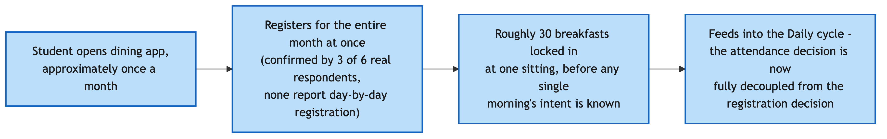
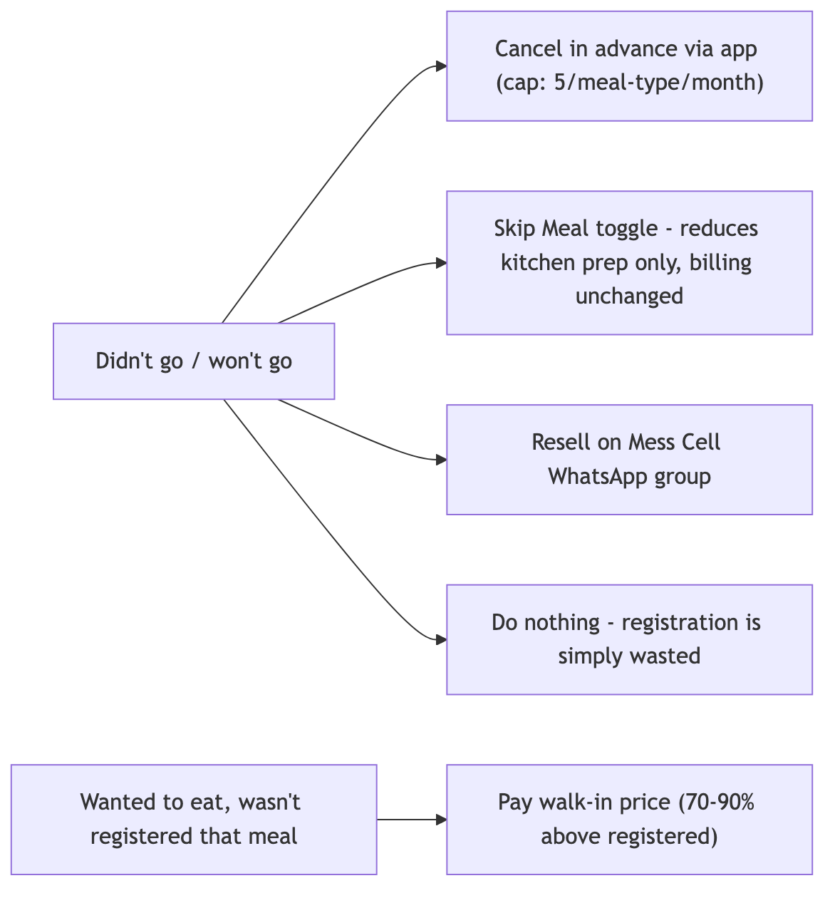

# Overview

The Stakeholder Map says who is involved. This trace says what actually happens, step by step, including the workarounds — how the system actually operates rather than how it is supposed to operate. Confirmed facts describe billing and cancellation at the monthly level, but registration itself also runs on a monthly cadence, sitting on top of a separate daily attendance decision — two different timescales that this trace keeps distinct rather than collapsing into one loop.

This trace covers the student-facing half of the breakfast process, established from six real respondents (five interviewed 2026-09-06, plus one original respondent interviewed 2026-09-03) and the confirmed portal mechanics. It stops at the kitchen door: everything from the point a registration reaches the kitchen onward is not yet visible from any source gathered, and **that data will be collected and submitted later**, once a mess-committee or mess-vendor interview is completed.

# Conduct Interviews and Observations

Six real respondents have been interviewed to date. Direct physical observation of a live breakfast service has not yet taken place — the window for this cycle had already passed before this project began collecting data, and a full observation protocol (7:15 AM setup through post-close) is prepared and ready to run.

| Source | Represents | Reveals | Cannot establish |
|---|---|---|---|
| Original respondent (2026-09-03) | 1 habitual skipper, general system informant | Full system mechanics — registration, billing, QR, Mess Cell, governance — and one person's skip reasons | Whether reasons generalize; anything about mess-side operations |
| Portal screenshots | The registration/billing platform itself | Real prices, capacities, registration counts, the Skip Meal-versus-Cancel distinction, the rating feature, random allocation | Actual attendance — registration is not attendance — and anything about kitchen or staff operations |
| Five student interviews (2026-09-06) | 2 daily eaters, 3 skippers | Real decision sequences, queue and crowding experience, item-specific run-outs, registration habits, Mess Cell use, timing preferences, self-estimated spend on unused meals | The kitchen and vendor side entirely; whether six respondents represent the wider population |
| Power-Interest/Leverage analysis (Task 3) | Governance structure | Formal and informal power, precedent, the Student Parliament's Mess Secretary role | Kitchen and vendor operations; most decision-domain authority |

**System visibility:** everything from a student's own decision through billing is directly visible in this evidence base. Everything from "registration reaches the kitchen" onward — how a preparation quantity is decided, when cooking begins, how portions are estimated per item, what happens to unclaimed food beyond staff eating some of it, and whether any of this data reaches a decision-maker — is not visible from any source gathered so far. This boundary is not filled with assumptions anywhere in this document.

# Trace Decisions and Interactions

Two timescales matter and are kept separate. Registration runs on a **monthly cycle**: three of six respondents specifically describe registering "for a month," not day-by-day and not weekly — a wider decoupling between the registration decision and the morning-of attendance decision than this project's own earlier drafts assumed.



The **daily cycle** is where the actual go/skip decision happens, well evidenced across all six respondents:


## Decision points, supported by evidence only

| Decision | Who | When | Constraint | Options observed |
|---|---|---|---|---|
| Register or not | Student | Monthly, in advance | Popular messes (Kadamba) fill up | All six respondents register in advance; none day-by-day |
| Which mess | Student | At registration | Capacity, competition for popular messes | Kadamba chosen by four of six respondents; Bakul mentioned once |
| Go or skip, that morning | Student | On waking | 8:30 class and attendance policy (named directly by one respondent) | Go; skip; go later — the central real decision point, evidenced across all six |
| Check the app before deciding | Student | Before or instead of deciding | A crowd-check and menu-view feature exists | Checked by one of six respondents; ignored by the rest |
| Wait for or wake friends | Student | On waking | Friend's own wake state | Wakes them and goes regardless if they don't respond (two of six); not a factor at all (three of six); positive but non-determining (one of six) |
| Cancel a registration | Student | Days ahead, planned | A cap of five per meal type per month | Used by most respondents at least occasionally; not used by one respondent specifically because they forget |
| Use Skip Meal | Student | Same day or ahead | Returns no money | Never used by any of the six respondents who addressed it |
| Resell or buy via Mess Cell | Student | When a registration is known to go unused | Informal, no guaranteed buyer | Used, bought and/or sold, by four of six; a passive observer for one; unused for breakfast specifically by another |
| Eat as a walk-in | Student | Same day, unregistered | Price markup | Used for snacks, not breakfast (one); used for breakfast (one); never (three) |

**A hypothesis this data disconfirms.** Earlier drafts of this project treated social company as a meaningful driver of attendance. Six real respondents now tell a more specific, consistently weaker story: peer presence is at most a motivational add-on, never the deciding factor. No respondent describes skipping because a friend didn't go, or attending only because one did.

# Document Formal and Informal Rules

| Rule | Enforced by | Behavioural effect | Rationale known? |
|---|---|---|---|
| Registration required | Mess Office / portal | All six respondents register in advance, monthly | Ties billing to registration |
| Cancellation cap (5 per meal type per month) | Mess Office / portal | Used by most respondents; one respondent explicitly forgets to use it | Limits uncancelled no-shows |
| Skip Meal, no refund | Mess Office / portal | Never used by any respondent addressing it — zero of six | Reduces kitchen preparation, not billing |
| Walk-in markup | Mess Office / vendor | Used sparingly; two respondents avoid it for breakfast specifically | Confirmed pricing incentive |
| Registered vs. random allocation | Portal | One respondent explicitly relies on random allocation rather than active registration — the first real, first-person confirmation of this mechanism actually being used | Mechanism now confirmed in real use, not only as a settings toggle |
| Mess closing at 9:30 | Mess | Four of six respondents explicitly ask for this to be extended | Rationale for the specific cutoff unknown |

**Informal norms** — unwritten, widely shared expectations, not solving a specific problem: registering for the whole month rather than day-by-day, appearing to be the path of least resistance for most respondents rather than a deliberate strategy; going early specifically to avoid queues, one respondent's explicit strategy; checking the app's menu before deciding to attend, one respondent only, not clearly a shared norm.

**Workarounds** — adaptations specifically compensating for a gap in the formal system: Mess Cell resale, used by four of six in some form, compensating for Skip Meal's lack of a refund; eating snacks or a later meal instead, compensating for skipping without an official cost-recovery path; scarcity-driven early registration for Kadamba specifically, compensating for a popular mess filling up — a workaround around capacity, not around billing.

## Formal versus informal divergence

| Where they diverge | Formal design | Actual behaviour |
|---|---|---|
| Registration cadence | Designed to be per-meal or flexible; the portal supports day-by-day | Universally monthly across six respondents — a de facto norm the system permits but did not design toward |
| Skip Meal | Designed to reduce kitchen waste | Functionally unused — zero of six real usage |
| Cancellation | Designed as the correct tool for planned non-attendance | Used inconsistently; at least one respondent doesn't use it simply because they forget, not by considered choice |
| Random allocation | A minor settings toggle in the formal design | For at least one real respondent, this is their actual registration mechanism, not a backup |
| Item availability at close | Designed to run until 9:30 | Staff make informal, unfulfilled promises to restock before close |

# Identify Negotiation and Escalation Mechanisms

No respondent in this round describes a working escalation path. Asked directly whether they or anyone they know tried to get a mess rule or timing changed, every one of the five new respondents said no. One respondent notes the mess does make reactive, immediate fixes to specific problems — a run-out, a technical error — but this is operational firefighting, not a rule-change mechanism, and is explicitly distinguished from what the question asked:

```
STUDENT → ? NO VISIBLE ESCALATION PATH FOR RULE OR TIMING CHANGES
STUDENT → MESS (reactive, same-incident-only fixes) → confirmed, but distinct
```

This absence is not a data gap to apologize for — it is a systems finding, identical in shape to the Power Analysis Brief's central governance finding (feedback inputs exist, outputs don't), now independently corroborated by five more respondents at the student-experience level rather than only the governance-structure level.

# Track Exceptions, Workarounds and Dependencies



## Dependencies

Eating breakfast at the mess depends on: waking with enough time and alertness — the single most commonly cited constraint — together with the desired item still being available at time of arrival (run-outs confirmed by at least three of six respondents, directly or by reputation), no conflicting class-attendance pressure (explicit for one respondent), and the mess still being within its serving window (the 9:30 cutoff is the single most-requested change across respondents). One step upstream, each of these depends on a process this project cannot yet see: item availability depends on a kitchen-side preparation-quantity decision, itself bound by the four-day lead time on which the Mess Office places its order with each vendor (confirmed in the Power Analysis Brief) — nothing in the process traced above lets same-day registration, cancellation, or Skip Meal activity change what is actually cooked, since the order is already fixed four days out. The attendance-policy pressure separately depends on academic administration's own scheduling — confirmed disconnected from mess governance, per the same brief.

# Key Findings

1. The registration-attendance gap is not one mechanism but several, now evidenced distinctly: habitual monthly over-registration, scarcity-driven defensive registration at Kadamba specifically, random allocation, and simple forgetting — different behaviours with different fixes, previously blurred together.
2. Peer influence, previously treated as a meaningful lever, is disconfirmed as a decision-determining factor by six real respondents — it is at most a motivational add-on.
3. The escalation-path absence identified in the Power Analysis Brief is now independently corroborated at the student-experience level.
4. A genuinely new finding: **broken restock promises** — staff say an item will return before close and it doesn't. This is a trust and service-quality finding with no prior documentation anywhere in this project.
5. Two respondents converge independently on a claim that only around 30% of registered students actually attend, and that the mess still struggles to serve even that smaller group well — the paradox may not only be about wasted food from no-shows, but also under-provisioning for the students who do show up. This claim is not sourced or attributed in either transcript and is treated as an unverified respondent impression, not a confirmed figure.

# Outstanding Data Collection

The kitchen and vendor side of this process is entirely unobserved. **This data will be collected and submitted later**, once mess-committee and mess-vendor interviews are completed, and once direct observation of a live service window is conducted. Specifically outstanding:

- What quantity the kitchen actually prepares against — live registrations, a historical average, or another figure — and whether the unverified "~30%" attendance claim is real.
- Whether a Skip Meal toggle set the same morning is subtracted from a preparation number, or has no effect at all.
- Why specific items (idli, puri, bhatura, fruit) run out ahead of others — a forecasting problem or a popularity mismatch.
- What a staff "restock promise" actually means operationally — a genuine intention that fails, or a placating non-commitment.
- What happens to unclaimed food beyond staff eating some of it, already confirmed — whether any of it is measured, discarded, or reused.
- Whether any waste or shortfall data reaches the Mess Office, the Mess Committee, or anyone with authority to adjust future preparation.

A direct observation protocol is prepared and ready to run across the full 7:30-9:30 AM window in 30-minute intervals, recording queue length, arrival rate, and item availability only — no personally identifying information, consistent with this project's own research discipline.
