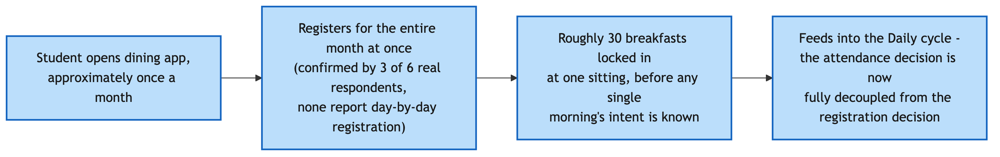
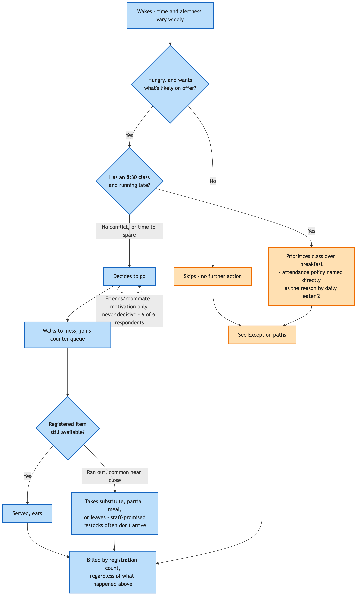
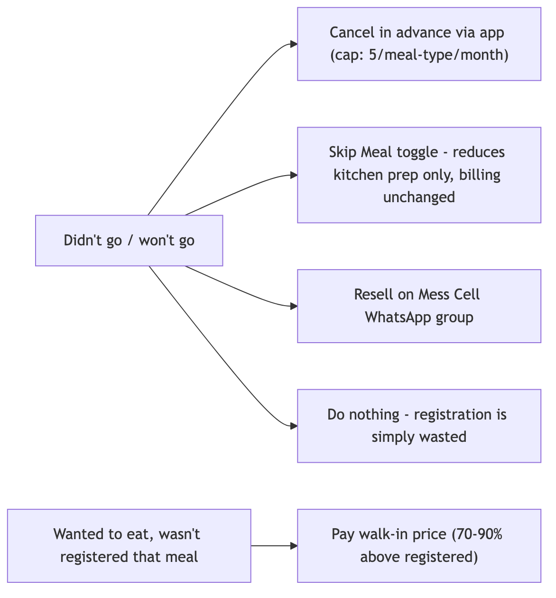

# Overview

The Stakeholder Map says who is involved. This trace says what actually happens, step by step, including the workarounds: how the system actually operates rather than how it is supposed to operate. It follows one breakfast from the student's registration, through the operator's planning and cooking, to the counter, the close, and what happens to the food nobody eats.

Three timescales matter and are kept distinct rather than collapsed into one loop. Registration is locked about four days ahead on a weekly rhythm, and, because every student is registered automatically, it works in practice as a standing month-long default rather than a choice. Cooked quantity is set the day before, in the operator's planning step, as a share of registrations at Kadamba and from the mess's own past records at Yuktāhār. The decision to eat is made on the morning itself, by each student, and the operator responds to it live at the counter; at Yuktāhār the operator also re-forecasts the rest of the meal from its first half hour, so the morning timescale holds an operator forecast as well as a reaction.

An earlier version of this trace covered only the student-facing half and stopped at the kitchen door, because no source then showed how a registration became a cooked quantity. That limit is revised. Interviews with the operators of three messes, the photographed planning and attendance registers of one of them, a month of timestamped breakfast scans from Kadamba, a walkthrough of the Kadamba kitchen, and the team's own first-hand account of both the Kadamba and Yuktāhār visits now make the operator half visible. The two best-evidenced operators run on different logics, so this trace follows each one end to end rather than merging them into one "operator". The parts that remain unseen are narrow and are listed at the end.

# Conduct Interviews and Observations

| Source | Represents | Reveals | Cannot establish |
|---|---|---|---|
| Original respondent (2026-09-03) | 1 habitual skipper, general system informant | Full system mechanics (registration, billing, QR, Mess Cell, governance) and one person's skip reasons | Whether reasons generalize |
| Portal screenshots and the printed CDS Student Handbook | The registration and billing platform and its published rules | Real prices, capacities, registration counts, the Skip Meal versus Cancel distinction, the four-day registration and cancellation deadline, automatic allocation of a vegetarian meal when a student does not register | Actual attendance, since registration is not attendance |
| Five student interviews (2026-09-06) | 2 daily eaters, 3 skippers | Real decision sequences, queue and crowding experience, item-specific run-outs, registration habits, Mess Cell use, timing preferences, self-estimated spend on unused meals | Whether six respondents represent the wider population |
| CFS Chair interview and Kadamba kitchen walkthrough (2026-09-13) | The dining-services side and one kitchen's physical layout | Governance and feedback triage, the entry cut-off and refill window, kitchen equipment, a single person running all inventory on first-in-first-out and first-expiry-first-out discipline | Day-to-day quantity decisions |
| Yuktāhār operator walkthrough with 26 photographed registers (2026-09-26) | The site head of ABC Hospitality Services, the vendor running this vegetarian mess with Jain service, walking through every register the mess keeps | The full planning system: twice-daily planning meeting, the Wastage Book, the weekday attendance register, the grocery issue and stock books, leftover reuse, staff routines | Other messes; how representative one well-documented operator is |
| Kadamba manager interview (September 2026) | The mess manager of Prism, the vendor running Kadamba | Waste handling, exceptions (scanner failure, gas shortage, broken equipment), complaint routing | Figures not also covered by the team's account; the audio is noisy |
| Team field account of the Kadamba and Yuktāhār visits (2026-09-27) | A team member present at both operator conversations, and a Kadamba student | The Kadamba command chain, quantity rule, gram standards, food-safety sequence, extra diners, timing and procurement; the Yuktāhār book system, forecasting steps, organisation and culture; auto-registration from the student side | A verbatim operator transcript; the base of the Kadamba waste figure |
| Third operator, Vijayalakshmi Caterers (September 2026) | Owner, staff and mess manager of a mess cooked off-site | Tender and monthly payment, off-site cooking and transport, quantity rule, 30-minute top-up, reporting chain | Which mess this is by name; exact figures |
| Kadamba breakfast records, April 2026 | 32,162 breakfast registrations and 11,941 timestamped scans from the dining-services team | Actual attendance by day, weekday and veg or non-veg; the full arrival curve minute by minute; when service really ends | Which individuals skip; lunch and dinner; quantities cooked or wasted |
| Power-Interest/Leverage analysis (Task 3) | Governance structure | Formal and informal power, precedent, the Student Parliament's Mess Secretary role | Kitchen operations |

**System visibility.** Everything from a student's own decision through billing, and now everything from "registration reaches the kitchen" through cooking, service and disposal, is visible in this evidence base for two messes. The confidence differs by mess. The Yuktāhār account is confirmed where it rests on the registers and single-sourced where it rests on the operator's explanation, which a team member heard first-hand. The Kadamba quantity rule, gram standards, food-safety sequence and timing were earlier held as a noisy recording whose exact numbers were in doubt; that is revised. A team member heard the same conversation directly, so these are now the operator's single-sourced statements with the figures themselves no longer in doubt, while remaining the operator's own account of its practice. The Vijayalakshmi account remains a noisy-audio single-sourced statement. The Kadamba attendance figures are confirmed from records.

**Observation.** A live breakfast service has not been watched from start to finish. The 11,941 timestamped Kadamba scans answer what that observation was mainly meant to capture, the shape and timing of the crowd, more precisely than a single morning of counting could. Parts of both messes were observed directly: the wrapped display plate at the Kadamba entrance, and the Yuktāhār books themselves. What still needs direct observation is waste disposal after close.

# Trace Decisions and Interactions

Registration is locked about four days ahead. The CDS handbook requires both registration and cancellation at least four days in advance, and the Kadamba manager describes it as "weekly compulsory". Students, however, describe registering "for a month": three of six respondents specifically say so. The two accounts fit together. The portal locks on a four-day, weekly rhythm, and students set a standing booking once and leave it running. A team member's own experience as a Kadamba student adds that registration is automatic and mandatory, including while off campus and over holidays, and that the only exit is five cancellations per meal type per month made at least four days ahead: "we don't have any opportunity to nullify it." The booking is a default, not a choice. The Kadamba breakfast records for April 2026 confirm the result: registrations sit flat at about 1,070 per day on every weekday, Sunday included (range 928 to 1,123), while actual turnout moves from 42.1% on Tuesdays to 27.3% on Sundays. Registration does not track the daily decision to eat.



The **daily cycle** is where the actual go or skip decision happens, well evidenced across all six student respondents and now measured at record level:



## Decision points: students

| Decision | Who | When | Constraint | Options observed |
|---|---|---|---|---|
| Register or not | Student | In advance, at least four days ahead; in practice once for the month | Registration is automatic and mandatory, including over holidays; popular messes (Kadamba) fill up; a student who does not register is allocated a vegetarian meal automatically | All six respondents register in advance; none day-by-day |
| Which mess | Student | At registration | Capacity, competition for popular messes | Kadamba chosen by four of six respondents; Bakul mentioned once |
| Go or skip, that morning | Student | On waking | 8:30 class and attendance policy (named directly by one respondent) | Go; skip; go later. The central real decision point, evidenced across all six and confirmed by records: 37.1% of Kadamba breakfast registrations were used in April 2026, lowest on Sundays (27.3%); at Yuktāhār in September, breakfast turnout ran 17.7% to 40.2%, with Sundays among the lowest |
| Check the app before deciding | Student | Before or instead of deciding | A crowd-check and menu-view feature exists | Checked by one of six respondents; ignored by the rest |
| Wait for or wake friends | Student | On waking | Friend's own wake state | Wakes them and goes regardless if they don't respond (two of six); not a factor at all (three of six); positive but non-determining (one of six) |
| When to arrive | Student | That morning | 9:30 entry cut-off | Skewed late: in April the median Kadamba scan fell between 8:51 and 9:11 depending on weekday, about half of all scans came after 9:00, and 26.5% came in the final quarter hour before 9:30. The Kadamba operator's own rule of thumb is about 100 diners early, about 100 through the middle and about 150 in the last ten minutes: "for any meal the highest flow is in the last 10 minutes" |
| Cancel a registration | Student | At least four days ahead | A cap of five per meal type per month (confirmed) | Used by most respondents at least occasionally; not used by one respondent specifically because they forget |
| Use Skip Meal | Student | Same day or ahead | Returns no money | Never used by any of the six respondents who addressed it |
| Resell or buy via Mess Cell | Student | When a registration is known to go unused | Informal, no guaranteed buyer | Used, bought and/or sold, by four of six; a passive observer for one; unused for breakfast specifically by another |
| Eat as a walk-in | Student | Same day, unregistered | Price markup | Used for snacks, not breakfast (one); used for breakfast (one); never (three). The Yuktāhār register counts Jain, unregistered, paying, faculty and staff diners separately at every meal; at breakfast the non-Jain extras are small, at most about a dozen a day on the legible rows |
| Enter after the close | Student | After 9:30 | The front door closes at 9:30 | At Kadamba, late-comers enter by the back door and demand food, and staff do not refuse them |

**A hypothesis this data disconfirms.** Earlier drafts of this project treated social company as a meaningful driver of attendance. Six real respondents tell a more specific, consistently weaker story: peer presence is at most a motivational add-on, never the deciding factor. No respondent describes skipping because a friend didn't go, or attending only because one did.

## Decision points: operators

The two best-evidenced operators forecast in different ways. Kadamba cooks a fixed share of registrations and tops up reactively, with no learning record beyond its per-dish gram standards. Yuktāhār learns from its own books, looking up the matching past week before service and re-projecting from the first half hour during it. Vijayalakshmi, the third, resembles Kadamba.

**Kadamba (run by Prism)**

| Decision | Who | When | Inputs and constraint | Confidence |
|---|---|---|---|---|
| Set the first batch | Prism kitchen management | The day before, from the weekly menu | About 70% of registrations, planned separately for veg and non-veg; every dish has a per-person gram standard (idli 4 per person from about 120 g of batter, sambar 100 g, poha and pulao their own standards). Biryani lunch is the exception, cooked at 100% | Single-sourced (operator), heard first-hand by the team, so the figures are not in doubt |
| Cook for people outside the registration | Prism kitchen | Same planning step | About 30 extra portions for 30 to 50 outside people, such as night-shift security who do not want to leave to eat; about half of Kadamba's own staff also eat from the same food | Single-sourced (operator) |
| Order raw material | Prism | In three tiers | Dry goods (rice, groundnut, masala, ghee, podi) one week ahead; perishables (milk, fruit, meat, eggs, most vegetables) the day before; some vegetables two to three days ahead | Single-sourced (operator) |
| Hold raw stock ready for a top-up | Kadamba kitchen | Morning | The uncooked remainder can be cooked in 10 to 15 minutes on request from the counter | Single-sourced |
| Watch the counter and call a top-up | The supervisor | Continuously during service | Item levels at each time, registrations and turnout so far; the supervisor tells the kitchen how much more to cook. Items that "float", taken above the gram standard, are bonda, puri, vada and idli | Single-sourced (operator) |
| Serve late-comers | Floor staff | After the 9:30 close | Late-comers come in by the back door after the front door closes, and the mess "can't say no to them"; on one biryani day the door was reopened for 5 to 10 minutes | Back door single-sourced (operator, heard first-hand); the biryani-day reopening single-sourced from noisy audio; breakfast application supported by scans after 9:30 on every April day |
| Dispose of leftovers | Kitchen | After close | Part of the surplus is eaten by the outside diners and the staff; the rest goes to a bin collected by a garbage contractor | Single-sourced |
| Record the outcome | Kadamba kitchen | Daily and weekly | The operator reports about 5 to 10% wastage daily, with no stated base, a figure hard to square with a 70% first batch against 37.1% recorded breakfast turnout (the tension is set out under Key Findings); QC inspects weekly. Whether waste is weighed per item is not established | Single-sourced (operator) |

**Yuktāhār (run by ABC Hospitality Services)**

| Decision | Who | When | Inputs and constraint | Confidence |
|---|---|---|---|---|
| Set tomorrow's breakfast and lunch quantities | Storekeeper, coordinator and kitchen staff in the daily meeting in the first half of the day; a second meeting later in the day sets snacks and dinner | The day before | Portal registrations read as regular + Jain + cash meals; the Wastage Book page for the matching past week, which exists because the menu repeats on a two-week cycle (weeks 1 and 3 identical, weeks 2 and 4 identical), with its run-out times and quantities; the month's turnout pattern; the attendance register grouped by weekday; holidays, special weeks, exams and campus events, but only if someone raises them ("We don't come to know until we sit in the meeting"). No fixed ratio; the site head believes breakfast runs at about 50% | Confirmed (registers); forecasting steps single-sourced (operator) |
| Raise exceptions and discrepancies | Everyone, in the same daily meetings | Twice a day | The day's positives, negatives and discrepancies; impurities found in cleaning; store and cooked-quantity mismatches; leave requests, since there is no formal leave policy and colleagues agree to absorb the load | Single-sourced (operator) |
| Issue raw material per meal | Storekeeper, cross-checked by Bhavani | Written at the planning meeting; issued the evening before or that morning | The per-dish ingredient list in kilograms from the store book; the Grocery Book with breakfast, lunch, snacks and dinner columns and a running balance | Confirmed from the photographed registers |
| Clean and sort issued grain; judge the supplier | Store function | After issue, before the kitchen | Raw materials are bought ahead from many local shops and godowns, so stones and debris are expected. The team holds an expected grams-of-impurity norm per raw item; exceeding it means complaining to the supplier or changing supplier, raised in the daily meeting | Confirmed (practice); norm single-sourced (operator) |
| Cook in one batch or two | Kitchen | 5:30 to 7:30 | Most items in one batch; only items that dry out on the counter, such as poha, in two. The site head argues against general batching because "student fluctuation is very high" | Confirmed |
| Re-project the rest of the meal | Coordinator and kitchen | The first half hour of service | Turnout in the first half hour is used as a sample to project how many will come for the rest of the meal, which drives top-up cooking | Single-sourced (operator); use at breakfast candidate |
| Monitor the counter | Kitchen | Every 30 minutes from about 45 minutes before close (about 8:45 at breakfast) | Food left against expected arrivals; a second roti counter opens at peak (rotis are handmade with no oil) | Checks confirmed; roti counters confirmed, meal not specified |
| Re-cook or not | Kitchen | When an item runs out | Rule stated for lunch: "If it runs out at 1:30 we re-cook; if at 2:20 we don't." The Wastage Book has a run-out time column and a re-cook column. The same cut-off logic at breakfast is a candidate | Rule confirmed; breakfast application candidate |
| Reuse leftovers | Kitchen | After close | Leftover idli becomes idli upma or idli poha for lunch; dosa batter goes back to the fridge; surplus milk is set as curd; paneer is made in-house | Confirmed (operator and registers) |
| Record the outcome | Ajita, cross-checked by peers | After each meal | The Wastage Book (see below), where daily meal wastage is student plate waste in the bins plus leftover food | Confirmed |

**Vijayalakshmi (off-site kitchen).** The first batch is set at 70% of registrations, recently raised to 80%; the counter is checked every 30 minutes, comparing projection, arrivals and food left, with a final inspection around 9:20; food is cooked off-site and some leftovers return to that kitchen while the rest is thrown (single-sourced, noisy audio).

**Menu choice, all messes.** The student committee chooses from an operator-supplied menu and the operator follows it. Operators see per-item waste (at Kadamba uttapam, set dosa and upma waste, while puri, bonda, vada and idli move) and can shift quantities between items, as Kadamba did in cutting ragi idli and increasing plain idli, but cannot change the menu itself; the Vijayalakshmi manager asks for a say (single-sourced).

## Yuktāhār: the book system as a process

Yuktāhār runs on paper books, each photographed by the team and explained by the operator. Every staff member does every job, so "storekeeper" is a function people rotate through rather than a fixed post, and each book is cross-checked by a peer.

| Book | Written by | When | Decision it feeds |
|---|---|---|---|
| Daily Meal Wastage Book: per meal and dish, raw issued, cooked, left over, percentage, run-out time, re-cook quantity, registered (regular + Jain), ate by category, and student bin waste plus leftover as the day's meal wastage | Ajita, mess in-charge and accounts | Every meal | The next matching-week quantity; the re-cook cut-off |
| Attendance register by weekday: registered against ate, with every Sunday together, every Monday together | Coordinator | Every meal | Weekday turnout expectation |
| Wastage board | Coordinator | Daily | A target to push the waste share down |
| Grocery Book: issue per item per meal, day total and running balance; the header carries the day's registrations (18-9-26: breakfast 265+14, lunch 338+15, snacks 7+0, dinner 237+14) | Storekeeper, cross-checked by Bhavani | At the planning meeting for the next day | What the store pulls and cleans |
| Store and ingredient book: per-dish ingredient lists in kilograms | Storekeeper | Before each issue | The issue list |
| Stock register: one page per article, receipts in red | Store | Daily | Purchasing and the physical stock check |
| Vegetable book and vegetable indent: opening, received, used, balance; ordered against received, with remarks such as "3 spoiled" or "only 2 boxes" | Ajita or the cross-checker | Vegetables arrive two to three times a week | Vegetable orders; spoilage |
| Milk, fruit, gas, electricity and water register | Project team | Daily | Curd and paneer planning; machine run times (a Wednesday electricity spike comes from grinding idli batter) |
| Fridge temperature log and cleaning checklist | Hygiene team; M. Bhavani signs | Temperature three times a day; cleaning daily | Hygiene compliance |

The books are held together by one rule: what the store book says was issued must match what the physical book says was cooked, and any mismatch is raised in the daily meeting. The rule held on the one day checked, 18 September, when 4.5 kg of toor dal issued and a 49.45 kg balance appear identically in the Grocery Book and the stock register (confirmed).

## The breakfast day, operator side

The daily cycle diagram above shows the student side. The operator side runs in parallel:

| When | What happens | Confidence |
|---|---|---|
| One week ahead | Kadamba orders dry goods | Single-sourced |
| Four days ahead | Registration and cancellation close | Confirmed |
| Two to three days ahead | Kadamba orders some vegetables; Yuktāhār raises a vegetable indent two to three times a week, and receipts are checked against it with spoilage remarks | Kadamba single-sourced; Yuktāhār indent confirmed |
| Day before | Planning step sets quantities: at Kadamba 70% of veg and non-veg registrations by gram standard plus about 30 portions for outside diners; at Yuktāhār from the matching-week Wastage Book page, the weekday register, the month's pattern and events. Kadamba orders perishables | Kadamba single-sourced; Yuktāhār confirmed |
| Evening before or early morning | Raw material issued from the store and grain cleaned against the impurity norm (Yuktāhār) | Confirmed |
| 5:00 to 5:30 | At Kadamba the chef arrives at 5:30 and cooks batch items such as sambar and upma; Nazir is the main veg chef. Yuktāhār cooking starts at 5:30 for a 7:30 finish. At the off-site Vijayalakshmi kitchen, food is to be ready by 6:30 and travels about 40 minutes in insulated boxes | Single-sourced |
| Before the counter opens | The Kadamba food-safety sequence, in order: cooking temperature checked; a sample kept for 72 hours so the food can be tested if anyone falls ill, including to tell whether the illness came from outside food; a display plate, carefully wrapped, placed at the entrance for every meal so diners see the full menu; serving temperature measured per item; tasting by the facility team with two Prism staff; corrections before service. At Yuktāhār a two-person tasting pair checks every shift | Display plate confirmed (observed); rest of the Kadamba sequence single-sourced; Yuktāhār confirmed |
| 7:00 | Live items (dosa, vada) cooked in front of diners at Kadamba so they are hot | Single-sourced |
| About 7:30 | First student scans | Confirmed |
| 7:30 to 8:00 | Yuktāhār takes the first half hour as its sample to project the rest of the meal. At Kadamba this half hour carried 15.3% of April scans | Kadamba share confirmed; Yuktāhār projection single-sourced |
| 7:30 to 9:00 | A steady, building flow; only a third of scans arrive before 8:30. At Kadamba, surplus from each batch is held and reheated, and food is moved between vessels for display and the counters | Scans confirmed; holding and reheating is the team's own judgement (candidate) |
| About 8:45 | 30-minute counter checks begin at Yuktāhār; top-ups take 10 to 15 minutes on site, up to 30 minutes from the off-site kitchen | Confirmed at Yuktāhār; single-sourced elsewhere |
| 9:15 to 9:30 | 26.5% of all scans, rising to about 9 per minute by 9:29; a run-out this late likely falls past the re-cook cut-off | Scans confirmed; re-cook link candidate |
| 9:30 | Formal entry cut-off; scans continued past 9:30 on every day in April, 9.2% of all scans came after it, and the last scan fell between 9:38 and 10:07. Late-comers enter by the Kadamba back door. The CFS Chair describes refills continuing to 10:00 and lights off after | Scans confirmed; back door and refill window single-sourced |
| After close | Outside diners and staff eat from the remaining food; leftovers reused or binned; waste recorded in the Wastage Book (Yuktāhār) | Confirmed at Yuktāhār; single-sourced at Kadamba |
| Daily and weekly | Kadamba reads TDS on cooking and drinking water daily, a failure triggering a full check, and QC inspects weekly | Single-sourced |
| One week later | The Yuktāhār weekday attendance register sets this day beside the same weekday a week on | Confirmed |
| Two weeks later | Yuktāhār reads this day's Wastage Book page again when the same menu day returns | Confirmed |

The last rows are a finding in their own right, revised here. The earlier version said the best-documented correction in the system acts only on a delay of one to two weeks. Yuktāhār in fact runs two corrections: a slow one, where what was learned about a Thursday's breakfast shapes a later Thursday, and a fast one, where the first half hour of a meal projects the rest of it. The fast one samples the part of the morning least like the close. Applying the Kadamba April curve as an illustration, the first half hour carries about 60 of about 398 daily scans, and projecting that rate flat across the two-hour window gives about 240, some 40% below the real total, because a quarter of diners arrive in the last quarter hour (candidate; Yuktāhār's own arrival curve is not measured).

# Document Formal and Informal Rules

## Rules on the student side

| Rule | Enforced by | Behavioural effect | Rationale known? |
|---|---|---|---|
| Registration required, at least four days ahead, and automatic when a student does nothing, including over holidays | CDS portal | All six respondents register in advance, as a standing booking; record-level registrations are flat across the week | Stated in the handbook: lets the dining service estimate demand |
| Automatic vegetarian allocation for students who do not register | CDS portal | One respondent explicitly relies on automatic allocation rather than active registration. Veg registrations at Kadamba were used at 32.4% in April against 48.5% for non-veg; whether default allocations account for part of that difference is a candidate | Stated in the handbook |
| Cancellation cap (5 per meal type per month), at least four days ahead | CDS portal | Used by most respondents; one respondent explicitly forgets to use it; beyond the cap the charge cannot be avoided | Limits uncancelled no-shows |
| Skip Meal, no refund | CDS portal | Never used by any respondent addressing it, zero of six | Designed to reduce kitchen preparation, not billing; whether it lowers the count Kadamba cooks against is unconfirmed |
| Walk-in markup | CDS and operator | Used sparingly; two respondents avoid it for breakfast specifically | Confirmed pricing incentive |
| Entry closes at 9:30 | Mess | Four of six respondents explicitly ask for this to be extended; at Kadamba late-comers already enter by the back door | Rationale for the specific cut-off unknown |

## Rules on the operator side

| Rule | Formal or informal | Enforced by | Behavioural effect | Confidence |
|---|---|---|---|---|
| Paid monthly as a lump sum on the number of plates, with deductions, under a tender | Formal (contract) | Dining services | Whether "plates" means registered plates or plates served is unknown, and it decides whether the operator gains or loses on every no-show; the rate and the deduction terms are unverified. The Kadamba operator describes the registrations as the obligation it is paid for, while the Yuktāhār vendor treats less waste as lower cost and higher profit | Single-sourced |
| Cook a fixed share of registrations first, top up live | Informal rule of thumb | Kadamba supervisor and kitchen; Vijayalakshmi manager | Every stated ratio (70% at Kadamba, 70 to 80% at Vijayalakshmi) sits well above recorded breakfast turnout (37.1% at Kadamba in April). Kadamba describes cooking on registrations as a responsibility it is paid for, regardless of who eats | Kadamba ratio single-sourced (operator, heard first-hand); turnout confirmed; the gap between them candidate |
| Cook biryani at 100% | Informal | Kadamba | Full preparation when the operator expects near-full turnout; the standard is two pieces of 150 to 200 g with unlimited rice, and when some diners take three, later diners run short (a lunch case) | Single-sourced |
| Portion by per-dish gram standard | Informal but recorded | Kadamba | Standards are set per person, but the fast-moving items (bonda, puri, vada, idli) are the ones taken above standard | Single-sourced |
| Look up the matching-week Wastage Book page and the weekday trend, then re-project from the first half hour | Informal but documented, the operator's own system | Yuktāhār staff in the daily meeting | The only calibrated correction seen in any mess; still, the site head believes breakfast runs at about 50%, while his own register shows about 28% | Lookup confirmed; first-half-hour projection single-sourced |
| Issued must equal cooked | Informal but documented | Peers, through the daily meeting | Store-book and physical-book mismatches surface the same day. The rule covers materials, not diner counts | Rule single-sourced; held on the one record checked |
| Supplier impurity norm | Informal | Yuktāhār store and daily meeting | Impurity above the expected grams per raw item leads to a complaint or a change of supplier | Single-sourced |
| Re-cook only if an item runs out early | Informal | Yuktāhār kitchen | Late run-outs are left unfilled | Confirmed |
| Cook mostly in one batch | Informal | Yuktāhār kitchen | Front-loads cooked volume; cooked food is usable for only 3 to 4 hours, so a cooked surplus cannot be recovered except by reuse | Confirmed |
| Cook about 30 extra for outside people | Informal, planned | Kadamba | 30 to 50 people outside the student registration, such as night-shift security, are fed on top of registrations | Single-sourced (operator) |
| About half the staff eat at the mess | Informal | Kadamba | Absorbs part of the surplus before it is counted as waste | Single-sourced (operator) |
| Kadamba food-safety sequence: cooking temperature, 72-hour sample, wrapped display plate, serving temperature, tasting by the facility team with two Prism staff, corrections; weekly QC; daily TDS on cooking and drinking water | Formal (food safety) | Prism, the facility team and QC | Shows the checking capacity operators already have | Display plate confirmed; rest single-sourced |
| Two-person tasting per shift; fridge temperatures logged three times a day; inventory on first-in-first-out and first-expiry-first-out | Formal (food safety) | Yuktāhār; Kadamba inventory keeper; faculty quality-control visits to the store | Shows the documentation capacity operators already have | Confirmed at Yuktāhār; single-sourced at Kadamba |
| Blame-free waste measurement, peer cross-checking, no hierarchy | Informal norm, deliberately set by management | Yuktāhār | Staff first resisted waste tracking ("they are catching us") when it began in August; the managers made it explicitly blame-free and discussed it daily, and by December staff themselves reported waste had fallen | Resistance and outcome confirmed; blame-free design single-sourced |
| Waste reduction is an explicit cost and profit goal | Informal (management) | Yuktāhār project managers | The stated goal is best quality, less waste, an optimised workflow, lower operating cost, standardisation and higher profit | Single-sourced |
| No formal leave policy | Informal | Yuktāhār daily meeting | Absences are agreed in the meeting and colleagues absorb the load | Single-sourced |
| Menu chosen by the student committee | Formal | Committee | Operators see which items waste and shift quantities between items, but cannot drop an item from the menu, and redirect menu complaints to the committee | Single-sourced |

**Informal norms** on the student side, unwritten and widely shared rather than solving a specific problem: registering for the whole month rather than day-by-day, which appears to be the path of least resistance rather than a deliberate strategy, and which auto-registration makes the default; checking the app's menu before deciding to attend, one respondent only, not clearly a shared norm. One respondent's strategy of going early to avoid queues is a minority behaviour: the records show only a third of Kadamba breakfast scans arrive before 8:30. On the Yuktāhār side, the culture is described as family-like, and one project manager trained all staff at his farmhouse on what good quality looks like and what responsibility to take (single-sourced).

**Workarounds**, adaptations compensating for a gap in the formal system: Mess Cell resale, used by four of six in some form, compensating for Skip Meal's lack of a refund, and seen from the operator side too, where the Kadamba manager describes students registering while away and a friend eating in their place; eating snacks or a later meal instead, compensating for skipping without an official cost-recovery path; scarcity-driven early registration for Kadamba, compensating for a popular mess filling up; entering by the Kadamba back door after the close. On the operator side: a fixed conversion ratio in place of a learned forecast at Kadamba and Vijayalakshmi, raw stock held ready for a quick top-up, holding and reheating the surplus of each batch at Kadamba, leftover reuse into the next meal at Yuktāhār, and extra portions for people outside the registration.

## Formal versus informal divergence

| Where they diverge | Formal design | Actual behaviour |
|---|---|---|
| Registration as a demand signal | Registration lets the dining service "estimate demand accurately and prepare the right quantity" | Registrations are flat across the week while turnout varies by weekday. Kadamba and Vijayalakshmi discount them by a fixed ratio (70%, 70 to 80%); Yuktāhār discounts them through its own past records, with a belief of about 50% that its own register puts at about 28%. None of the fixed ratios is set against actual breakfast turnout |
| Registration cadence | A four-day, weekly lock; the portal supports day-by-day choices | A standing monthly booking across all six respondents, made the default by automatic registration, a de facto norm the system permits but did not design toward |
| Skip Meal | Designed to reduce kitchen preparation | Functionally unused, zero of six real usage. An earlier finding, confirmed in September, holds that Skip Meal declarations reach the kitchen; the Kadamba operator says it cooks on registrations regardless of who wants to eat. Whether a Skip Meal lowers the count the operator sees is an open question between conflicting sources |
| Cancellation | Designed as the correct tool for planned non-attendance | Used inconsistently; at least one respondent doesn't use it simply because they forget |
| Automatic allocation | A fallback for students who do not register | For at least one real respondent, this is their actual registration mechanism, and it applies over holidays too |
| Closing time | Entry closes at 9:30 | Scans continue past 9:30 every day, occasionally to about 10:00; refills run to 10:00; at Kadamba late-comers come in by the back door and are not refused |
| Item availability at close | Designed to run until 9:30 | Late run-outs are not re-cooked, and staff make informal, unfulfilled promises to restock |
| Waste record | No waste record is part of the registration and billing design | Yuktāhār keeps a detailed per-item waste record reconciled across its books, and Kadamba reports a daily waste percentage and keeps per-dish gram standards; no route carries either record to anyone who sets registration or billing rules |

# Identify Negotiation and Escalation Mechanisms

The earlier version of this section said no escalation path was visible. From the student side that still holds for rules and timing: asked whether they or anyone they know tried to get a mess rule or timing changed, every one of the five new respondents said no. The operator interviews revise the picture in one respect. An operational complaint path exists and works, for same-incident fixes and supplier changes. The two operators route it differently: Kadamba through a command chain, Yuktāhār through its daily meeting with no hierarchy.

```
OPERATIONAL COMPLAINTS (exists, works for same-incident fixes)
STUDENT / DIRECTOR EMAIL / CDS SITE TEAM → OPERATOR MANAGER → WHATSAPP GROUP → KITCHEN

KADAMBA COMMAND CHAIN
CFS → CDS (head named as Raju; see note) → PRISM (vendor, won by tender)
    → OPERATIONS MANAGER → MANAGER → SUPERVISOR → SERVICE STAFF

YUKTĀHĀR (no hierarchy)
STAFF ⇄ DAILY MEETING ⇄ TWO PROJECT MANAGERS (ABC HOSPITALITY SERVICES)

UPSTREAM: STORE → SUPPLIER (impurity above the norm → complaint or new supplier;
          paneer brand switched after complaints)

RULE AND TIMING CHANGES (formal route on paper, unused from below)
CDS STUDENT COUNCIL → CDS COMMITTEE (faculty), reached only by high-intensity feedback
STUDENT → ?   no respondent has used or seen this route
OPERATOR → ?  no route for the waste record into registration or billing rules
```

The internal operator chain in the earlier version (staff, supervisor, manager, operations manager, director) came from a clip that was cut off and could not be tied to one mess. It is revised: the Kadamba chain above is the operator's own account, heard first-hand by a team member. One identity in it is unresolved. The team field account names Raju as the CDS head, while the CFS Chair interview named Giri as the CDS Chair. They may hold two different roles or one name may be wrong; the two are not merged here. The "facility team" that tastes Kadamba food with two Prism staff is likewise unidentified, and may or may not be the CDS site team.

A student complaint at Kadamba shows the boundary in action: dinner sambar was dropped "while they are taking more money from us", and the operator's answer was that the committee decides the menu. The complaint reached the operator and stopped there, because the operator holds no menu authority.

Operators sit on the same side of the missing path as students. They have high power over quantities and none over the registration deadline, the 9:30 close, the cancellation cap or billing. At Kadamba, perishables are ordered the day before and dry goods a week ahead, against a registration lock four days out, and the operator has no channel through which to question that cut-off with anyone who sets it. The absence the power and governance analysis identified (feedback inputs exist, outputs don't) is therefore now corroborated from three sides: the governance structure, the student experience and the operators.

# Track Exceptions, Workarounds and Dependencies



## Operator exceptions

- **Scanner failure.** When the QR system fails, Kadamba staff write down ID and name by hand. The April export shows no sign of bulk entry (never more than two scans in the same second), so hand-logged diners may be absent from the records altogether, a candidate undercount.
- **Gas shortage.** During the LPG shortage Kadamba cut quantities a little and bought some items from outside. This is the first operator account of the shortage itself; its cause is still single-sourced.
- **Equipment failure.** The Kadamba bread grill is broken and has not been replaced, which removes an item from service regardless of demand.
- **Events, exams and holidays.** Nothing formal tells the kitchen about them. They reach the Yuktāhār planning meeting only if someone mentions them, and hackathons and exams lower turnout in ways the site head calls unavoidable.
- **Supplier quality.** At Yuktāhār, impurities above the expected grams per raw item are raised in the daily meeting and lead to a complaint or a change of supplier. At the Vijayalakshmi mess, paneer has been switched between three brands after complaints.
- **Biryani days.** Kadamba cooks biryani lunch at 100% of registrations rather than 70%, with a head chef brought in. The ratio therefore follows the operator's expectation of demand for a dish, not a fixed rule, and portion leakage (three pieces instead of two) still produces late run-outs even at full preparation.
- **Off-site transport.** At the off-site Vijayalakshmi kitchen, every top-up carries up to 30 minutes of lag against a fixed close.
- **Late-comers.** At Kadamba, when the front door closes at 9:30, late-comers enter by the back door and demand food, and staff do not refuse them. Last-minute registrations are described as "a pain". The speaker's wording covers both the 9:30 breakfast close and the 9:30 dinner close; scans after 9:30 on every April day support it at breakfast.
- **Records that disagree.** For breakfast on 3 September at Yuktāhār, the Wastage Book records 77 diners (28%) while the attendance register, on a partly obscured row, records 110 (40%). Which one feeds planning is not known. The two-book reconciliation rule covers materials, not diner counts, and these two books have different keepers (Ajita and the coordinator), which may be why the difference stands unreconciled (candidate).

The operator workarounds that sit alongside these (leftover reuse, outside diners and staff eating from the same food, holding and reheating surplus, late-door service, raw stock held for a quick top-up) are absorption mechanisms: each one soaks up part of the gap before it becomes visible, and each is locally beneficial. The outside diners and the half of Kadamba's staff who eat at the mess are real people fed by the surplus, so any change to the first batch has to plan for them explicitly. Holding and reheating is the exception among the absorbers: the team's own judgement is that Kadamba food is cooked ahead, reheated repeatedly and moved between vessels, so it degrades fast. That links over-preparation to food quality as an open chain; whether poorer quality then feeds skipping is not evidenced. Yuktāhār also tried and dropped Zoho ERP for grocery management and rush prediction, for two reasons: paying "lakhs of rupees" for prediction made no sense when the data already sits in its books ("prediction will be based on our data only… I want to remain close to the data"), and staff are not digitally inclined, with too few people to digitise, so the office digitises later.

## Dependencies

Eating breakfast at the mess depends on waking with enough time and alertness, the single most commonly cited constraint; on the desired item still being available at arrival (run-outs confirmed by at least three of six respondents, directly or by reputation); on no conflicting class-attendance pressure (explicit for one respondent); and on the mess still being open (the 9:30 cut-off is the single most-requested change). The attendance-policy pressure depends on academic administration's own scheduling, which the governance analysis confirmed is disconnected from mess governance.

Item availability in turn depends on a chain this trace can now follow. An earlier version of this section said the Mess Office fixes each vendor's order four days out, so that nothing on the day could change what is cooked. That finding is revised by the operations evidence. The four-day lock applies to registration, not to cooking or buying. Groceries at Yuktāhār are bought fortnightly by the stock register, ahead of use, from many local shops and godowns; vegetables arrive two to three times a week and milk daily. Kadamba buys in three tiers: dry goods a week ahead, perishables the day before, some vegetables two to three days ahead. Cooked quantity is set the day before, as a share of registrations at Kadamba and from past records at Yuktāhār, and adjusted live on the day through top-ups and re-cooks. The binding constraint on waste is therefore cooked food prepared ahead of demand, not raw procurement: raw stock left over is issued again from the store, while cooked food is usable for only 3 to 4 hours.

The operator side has its own dependencies: supplier cadence and quality; cooking gas, electricity and water, which Yuktāhār logs daily and Kadamba checks for water quality daily; equipment (the Kadamba roti line, multi-item cooker and tilting curry machine, and the broken grill); one person running all Kadamba inventory, a single point of failure; the matching-week Wastage Book page existing, which depends on the two-week menu rotation; the daily meeting as the only channel for event information and for exceptions at Yuktāhār; transport time from the off-site kitchen; inputs chosen for quality at Yuktāhār (rock salt and cold-pressed oil for about the past six months, with the operator visiting the mills); and staff numbers. Yuktāhār has 16 kitchen staff and two project managers from ABC Hospitality Services, with some site staff sharing project-management work and separate tasting, cutting and cleaning teams, all without a hierarchy. Kadamba has about ten chefs, with Nazir as main veg chef and a head chef for biryani days.

Where uneaten food finally goes is only partly settled. The CFS Chair described production and plate waste going via a garbage collector to an outside compost facility. The Kadamba manager, asked about composting, said there is none: the bin goes to the garbage contractor (single-sourced). The earlier project understanding that composting absorbs the physical surplus is revised accordingly: at Kadamba the surplus is absorbed by outside diners and staff eating it, by holding and reheating into later service, by late-comer top-ups and by the bin, and whether the contractor composts it off site is unverified. Yuktāhār's disposal route after its leftovers are reused is not stated in any source.

# Key Findings

1. The registration-attendance gap is not one mechanism but several: habitual monthly over-registration made the default by automatic registration, scarcity-driven defensive registration at Kadamba, automatic allocation, and simple forgetting. The Kadamba April breakfast records show their combined effect. Registration is an automatic standing booking, a default rather than a choice, flat across the week while turnout varies by weekday; it is not a daily demand signal.
2. Peer influence, previously treated as a meaningful lever, is disconfirmed as a decision-determining factor by six real respondents; it is at most a motivational add-on.
3. This finding is revised. The earlier version described every operator as applying a private ratio (believed 50%, about 70%, 70 to 80%). There are in fact two forecasting logics. Kadamba and Vijayalakshmi cook a fixed ratio of registrations (70%; 70 to 80%) and top up reactively, and Kadamba keeps no learning record beyond per-dish gram standards. Yuktāhār has no fixed ratio: it learns from its own books by matching week and weekday and re-projects from the first half hour of service, though the site head's belief that breakfast runs at about 50% differs from his own register (about 28%). None of the fixed ratios is set against actual breakfast turnout, which is confirmed at 37.1% for Kadamba in April. The gap is measured, locally and repeatedly: Yuktāhār records registered against eaten and waste per item at every meal. What is missing is any route from that measurement into registration or billing rules, and even inside the best-documented mess the fast correction samples the calm start of service rather than the crest at the close.
4. **Broken restock promises**: staff say an item will return before close and it doesn't. This is a trust and service-quality finding first reported by students. The operator side offers a candidate mechanism: a re-cook cut-off that leaves late run-outs unfilled, top-ups that take 10 to 30 minutes against a close only minutes away, equipment failures, and items that float above their gram standard, together with a Kadamba chef's "wait 5 minutes" that matches what students describe hearing.
5. This finding is revised by the new records. Two respondents independently claimed that only around 30% of registered students attend and that the mess still struggles to serve even that smaller group, which earlier drafts read as a possible under-provisioning problem and held as an unverified impression. The attendance half is now confirmed: breakfast attendance is about 28% of registrations at Yuktāhār in September and 37.1% at Kadamba in April, a gap of 63 to 72%. The under-provisioning reading does not hold. Every fixed first-batch ratio operators state sits well above that turnout, and the Yuktāhār Wastage Book records leftovers, so the shortage students experience is not a shortage of total food. It is a timing and item-mix failure concentrated at the close: 26.5% of Kadamba scans arrive in the last quarter hour, the items students report running out (idli, puri, bhatura, fruit) include those the Kadamba operator says float above their gram standard (puri, idli) while the ones it says waste (uttapam, set dosa, upma) are left over, and late run-outs are not re-cooked. Over-preparation and run-outs happen on the same morning.
6. The escalation-path absence identified in the governance analysis is now corroborated from the operator side as well. An operational complaint path exists and works for same-incident fixes, through a command chain at Kadamba and a daily meeting at Yuktāhār; no path for changing rules or timing works for students or for operators.

**A tension the operator's own figures leave open.** Kadamba's stated practice and its stated waste do not yet add up. In April, Kadamba breakfast averaged about 1,072 registrations and 398 scans a day (confirmed). A 70% first batch is about 750 portions against about 400 eaten, a first-batch surplus of about 350 portions a day before any top-up (candidate arithmetic from the operator's ratio and the records). The operator reports about 5 to 10% daily wastage, with no stated base (single-sourced). The two are compatible only if most of the surplus goes somewhere other than the bin: to the 30 to 50 outside diners and half the staff, to food held and reheated into later service, to top-ups smaller than the ratio implies, or to a waste figure measured on a different base, such as all meals or plate waste only. Which of these holds is not known, and this trace does not assume one.

# Outstanding Data Collection

Most of what this section previously listed is now answered: what quantity the kitchen prepares against (a fixed share of registrations at Kadamba and Vijayalakshmi, the matching-week lookup plus a first-half-hour projection at Yuktāhār); the Kadamba 70% first batch and the cancellation limit, now heard first-hand; the Kadamba reporting chain; whether the "~30%" claim is real (confirmed for breakfast attendance); why particular items run out first (a candidate answer: popularity against a fixed ratio, items that float above their gram standard, plus the closing surge); what happens to unclaimed food (outside diners and staff eat it, some is reused or reheated, the rest is binned); and whether waste data reaches a decision-maker (it is recorded by operators, and no route carries it above them). What remains open:

- Whether a Skip Meal lowers the registration count the Kadamba operator cooks against, given the earlier finding that Skip Meal reaches the kitchen and the operator's statement that it cooks on registrations regardless. One direct question to the operator settles it.
- Whether Raju (named as CDS head) and Giri (named as CDS Chair) hold two roles or one name is wrong, and who the "facility team" is that tastes Kadamba food with Prism.
- What the Kadamba 5 to 10% waste figure is a percentage of (per meal or per day, cooked weight or plate waste), whether a waste record exists that could be seen, and how the figure squares with a first-batch surplus of about 350 portions a day.
- Whether the 30 extra portions for outside people sit inside or on top of the 70% first batch, how many staff "half the staff" is, and whether staff meals are a written entitlement or an informal norm.
- Whether Yuktāhār uses its first-half-hour projection at breakfast, and how it scales it given the closing rush; whether the two roti counters open at breakfast or only at lunch and dinner.
- Whether Ajita, named by the team as mess in-charge and keeper of the Wastage Book, is the person the site head's recording called by an honorific; and whether Yuktāhār's groceries are bought fortnightly (stock register) or the week before use from many shops, or both.
- Confirmation that Kadamba's back-door late entry happens at breakfast as well as dinner.
- The contract terms: the plate rate, how deductions work, and whether costs pass through to the operator.
- Where the garbage contractor takes the waste, compost or landfill; where Yuktāhār's residual waste goes; and a direct observation of disposal after close.
- Which mess the Vijayalakshmi operator runs; the off-site kitchen suggests Bakul or Palash, a candidate not yet confirmed by name.
- Lunch and dinner records for Kadamba, and any records for Bakul and Palash.
- Why the Yuktāhār site head believes breakfast runs at about 50% when his own register shows about 28%, and which of his two disagreeing diner records feeds planning.
- How hand-logged diners during scanner failures are reconciled into attendance records and billing.
