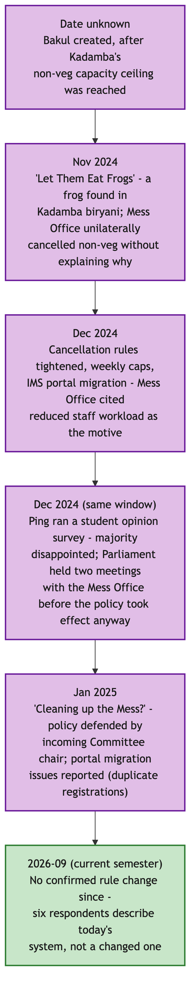
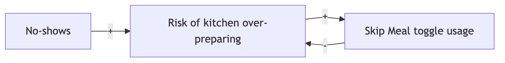

# Overview

This map asks a different question than the Process Trace: not how the process works, but what pattern emerges when it repeats, across people and across time. No numeric trend is invented anywhere below — where only qualitative, respondent-sourced statements exist, they are presented as such, not converted into a chart implying a precision the evidence does not have.

Timescales actually supported by evidence: **within one morning** (well evidenced, six respondents describe it directly), **across a week** — an early-class day against a non-early-class day (evidenced, one respondent states the trade-off explicitly), **across a month** (evidenced indirectly — monthly registration is the universal pattern, and the cancellation cap operates on a monthly cycle), and **across a semester** (evidenced — six respondents each give a semester-level trend statement, the strongest temporal evidence available). No evidence exists at the scale of multiple semesters or years, and none is claimed.

# Collect Historical Versions, Records or Observations

| Respondent | Behaviour | Frequency | Trigger | Time horizon |
|---|---|---|---|---|
| Original respondent (2026-09-03) | Habitual skipper | Most mornings | Intermittent fasting, poor hostel mess quality historically, late sleep | Longstanding habit |
| Daily eater 1 | Near-daily attender | 5-6 of 7 mornings | Habit; late-night work causes the rare skip | More regular this semester than before |
| Daily eater 2 | Most-days attender | Most days | 8:30 class plus late sleep causes skips; class-attendance policy is explicitly prioritized over breakfast | No explicit before/after comparison given |
| Skip-1 | Light eater | Roughly once a week | Appetite-driven, menu-checked | Changed since just before classes started this semester; direction implied, not explicit |
| Skip-2 | Non-eater | Zero this semester | Not hungry that early; eats after 10-10:30 instead | Zero for the entire current semester |
| Skip-3 | Declining attender | Rare, was more regular | Late sleep leading to no hunger | Declining specifically over the last three to six weeks |

The six real respondents do **not** agree on a single direction. One reports attendance increasing this semester; one reports a specific recent decline over three to six weeks; one has been at zero all semester; the rest give no clear directional trend. There is no single "the paradox is worsening" or "improving" claim this dataset supports — six individuals are moving in different directions simultaneously, which is itself the honest system-level finding at this evidence level, not a gap to be resolved by more interviews of the same kind.

No records-based (as opposed to recall-based) historical or observational data exists yet. Direct observation of a live service window has not been conducted; a 30-minute-interval protocol across the full 7:30-9:30 AM window is prepared and ready to run, and **this data will be collected and submitted later**.

# Develop Timelines

## Within-morning pattern, reconciled


What first looked like two competing peak-crowding claims — one respondent naming 8:00-9:00, two others naming 9:00-9:30 — reconciles into one continuously building crowd that crests just before the 9:30 close: the respondent who names the earlier window describes deliberately arriving early specifically to avoid the crowd, meaning they are describing the rising portion of the same curve the later respondents experience at its crest, not a separate, earlier peak. This is the working hypothesis, not a measurement — direct observation or QR-scan timestamps would still confirm the exact shape, but it resolves what first looked like a contradiction into one consistent pattern rather than leaving two claims in unresolved tension.

## Provisional system-level timeline



This timeline is cross-referenced from the Power Analysis Brief's precedent research, kept here only as the timeline view this deliverable specifically asks for. No respondent in the 2026-09-06 round mentions a recent rule change — the six respondents interviewed describe the current system, not a system in the middle of changing.

# Identify Significant Changes and Their Triggers

| Date or period | Change | Trigger |
|---|---|---|
| Date unknown | Bakul created | Kadamba's non-vegetarian capacity ceiling was reached |
| November 2024 | "Let Them Eat Frogs" — Kadamba non-vegetarian meals unilaterally cancelled | A frog found in Kadamba's chicken biryani |
| December 2024 | Cancellation rules tightened, weekly caps, portal migration | Mess Office workload concerns, compounded by a Kadamba renovation |
| December 2024, same window | Ping student opinion survey; two Parliament-Mess Office meetings | Organized pushback against the cancellation-rule tightening |
| January 2025 | "Cleaning up the Mess?" — policy defended by the incoming Committee chair; portal migration issues reported | Continuation of the December 2024 episode |
| 2026-09, current semester | No confirmed rule change | — |

# Examine Feedback Loops and Recurring Patterns

**R1 — "Shifting the Burden" via Mess Cell** (reinforcing — sustains the dysfunction rather than growing it unboundedly). Confirmed on its central mechanism: zero of six respondents who addressed Skip Meal have ever used it, and the respondent who explained why did so in exactly the terms this project's incentive analysis predicted — it doesn't return the money. Four of six respondents have used Mess Cell in some form.


The informal resale market is a symptomatic relief valve that makes the underlying problem — billing that does not track attendance — tolerable enough that nobody is ever forced to fix the fundamental cause. The workaround's success is exactly what lets the root cause persist. Every link in this loop is now directly evidenced except the final "reduces pressure to fix billing" step, which remains a structurally plausible inference, not something any respondent stated directly.

**B1 — Kitchen Waste Control via Skip Meal** (balancing, but incomplete — a Fix That Fails). Skip Meal's zero real usage across six respondents strengthens this finding: this balancing loop may not be closing on the kitchen side in practice at all, not merely failing to address the student side as previously argued.



**B2 — Capacity Redistribution** (weak or broken). One respondent explicitly registers for the whole month specifically because "Kadamba is hard to get and it gets full" — direct, first-person evidence of scarcity-driven demand concentration on the popular mess, rather than organic redistribution to Bakul or Palash.

**A new candidate loop — under-provisioning for real attendees.** Two independent daily-eater respondents converge on a claim that the mess cannot adequately serve even the smaller group who do attend, because preparation may be calibrated to something other than actual peak-clustered demand:

```
Registration inflated by several mechanisms (habitual, scarcity-driven, random
allocation) -> true attendance rate low relative to registration -> preparation
possibly calibrated toward the low true-attendance number, not peak-hour
clustering -> peak-hour run-outs occur even though total food may be "enough"
on average -> attendees who do show up have a poor experience
```

This is presented as a hypothesis with two real, independent, converging respondent statements behind its first half, and an unconfirmed second half — not as a settled loop.

# Identify Unintended Consequences

| Rule or action | Intended function | Observed response | Unintended consequence |
|---|---|---|---|
| Cancellation cap | Limit uncancelled no-shows | Students use cancellation inconsistently; one respondent doesn't use it because they forget | The cap constrains a behaviour that at least some students don't reliably perform for reasons unrelated to the cap itself |
| Walk-in markup | Discourage same-day uncertainty | Monthly advance registration, universal across all six respondents | Registration counts are inflated independent of true attendance intent |
| Skip Meal, no refund | Reduce kitchen waste | Zero real usage across six respondents | The tool may not be reducing kitchen waste in practice at all, since nobody uses it |
| Mess Cell (informal, not a designed rule) | Not applicable | Absorbs unused registrations for some students | May reduce visible pressure to fix the underlying billing model, while genuinely helping the students who use it |

# Key Findings

1. No single population-level trend exists — real respondents move in different directions simultaneously. Any future claim that the paradox is getting worse, or better, needs to specify for whom, not assert it for students generally.
2. What first looked like two competing peak-crowding claims reconciles into one continuously building crowd cresting near the 9:30 close — still recall-based, not measured, so direct observation remains the way to confirm the exact shape.
3. Skip Meal's real usage rate in this sample is zero — the strongest evidence yet for treating it as a non-functioning tool in practice, not only poorly incentivized in theory.
4. A new candidate systemic loop — under-provisioning for actual, not just registered, attendees — is independently corroborated by two respondents and adds a previously missing half to the waste narrative: this is not only about food cooked for no-shows, it may also be about food not cooked for real attendees.

# Outstanding Data Collection

The following require quantitative, records-based data or a mess-committee/mess-vendor source, and **will be collected and submitted later**:

- A realistic minimum of four to eight weeks of daily registration and attendance data per mess — a full semester would be materially better for anything involving exam-period or deadline-clustering effects, which no current evidence speaks to at all.
- Whether the true peak window matches either respondent claim, or is something else entirely — resolvable only by direct observation or QR-scan timestamps.
- Whether the registration-to-attendance gap actually sits near the unverified "~30%" figure two respondents independently cited.
- Whether Skip Meal usage, even if rare in a larger sample, correlates with any measurable reduction in specific-item run-outs.
- Whether attendance actually declines in the specific three-to-six-week window one respondent identified, and whether it correlates with any academic-calendar event.
- When Skip Meal was introduced and why; when the five-cancellation rule was set at exactly five; whether breakfast timing has ever been different from 7:30-9:30 — none of these are addressed by any source gathered so far and are appropriate governance-interview questions, not resolvable from student accounts alone.

Not yet claimed, and not to be treated as established until this data lands: that breakfast attendance is declining or rising across the student population as a whole; that the mess is definitively under-provisioning relative to real demand; that either named window is definitively the peak; that Skip Meal has zero effect on kitchen behaviour rather than simply zero observed student-side usage; and any numeric trend over time for any variable.
