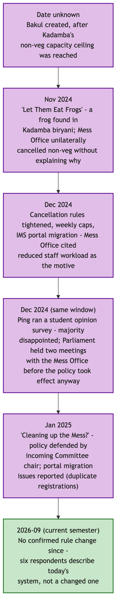

# Overview

This map asks a different question than the Process Trace: not how the process works, but what pattern emerges when it repeats, across people and across time. It now rests on four kinds of evidence. The first is six student respondents describing their own breakfast habits. The second is two sets of records: thirty days of Kadamba breakfast registrations and timestamped scans from April 2026, and twenty days of Yuktāhār breakfast and lunch attendance registers from September 2026, photographed on site together with the rest of Yuktāhār's daily books. The third is interviews with the operators of three messes (Yuktāhār, Kadamba and a mess run by Vijayalakshmi Caterers), who described how they decide quantities and what has changed in their kitchens. The fourth is a first-hand account by a team member who was present for both the Kadamba and the Yuktāhār operator conversations and saw parts of each kitchen's routine. Numbers read off the records are stated as confirmed, and so is practice the team saw on site. Kadamba operator numbers, heard directly by that team member, are the operator's own single-sourced statements about his practice. Vijayalakshmi numbers come from noisy recordings and remain single-sourced. None of the Vijayalakshmi figures, and not Kadamba's waste percentage, whose base is unstated, is used as a headline figure.

Timescales supported by evidence:

- **Within one morning:** measured. Every Kadamba scan in April carries a timestamp, the Kadamba operator's own rule of thumb has the same shape as those records, and both kitchens described their morning routine from the 5:30 start to the close.
- **Across a week:** measured. Kadamba registrations and turnout are recorded for every weekday, and the Yuktāhār register covers nearly three weeks. One student respondent also describes the early-class trade-off directly. Kadamba's weekly quality inspection and one-week dry-goods purchasing run on the same cycle (single-sourced).
- **Across a fortnight:** confirmed. The menu repeats on a two-week cycle (weeks one and three identical, weeks two and four identical), and Yuktāhār's waste records are organised around that cycle.
- **Across a month:** measured for Kadamba breakfast in April. Monthly registration is also the universal student pattern: students are registered automatically and can cancel only five meals per meal type per month (confirmed). Yuktāhār reads the month's turnout pattern when it forecasts (single-sourced).
- **Across a semester:** recall only. Six respondents each give a semester-level trend statement for themselves; no multi-month records exist yet.
- **Across an operator year:** single-sourced for Yuktāhār in outline, with the Wastage Book pages as the records behind it. The current operator took over the previous year, began per-item waste weighing in August on deliberately blame-free terms, and by December heard staff themselves report lower waste. A project manager also took the staff to his farmhouse for training, at an unknown date. The switch to rock salt and cold-pressed oil dates from about six months before the visit. Software was tried and dropped at an unknown date.

No student records exist across multiple semesters, and no trend at that scale is claimed.

# Collect Historical Versions, Records or Observations

## Student respondents

| Respondent | Behaviour | Frequency | Trigger | Time horizon |
|---|---|---|---|---|
| Original respondent (2026-09-03) | Habitual skipper | Most mornings | Intermittent fasting, poor hostel mess quality historically, late sleep | Longstanding habit |
| Daily eater 1 | Near-daily attender | 5-6 of 7 mornings | Habit; late-night work causes the rare skip | More regular this semester than before |
| Daily eater 2 | Most-days attender | Most days | 8:30 class plus late sleep causes skips; class-attendance policy is explicitly prioritized over breakfast | No explicit before/after comparison given |
| Skip-1 | Light eater | Roughly once a week | Appetite-driven, menu-checked | Changed since just before classes started this semester; direction implied, not explicit |
| Skip-2 | Non-eater | Zero this semester | Not hungry that early; eats after 10-10:30 instead | Zero for the entire current semester |
| Skip-3 | Declining attender | Rare, was more regular | Late sleep leading to no hunger | Declining specifically over the last three to six weeks |

The six respondents do **not** agree on a single direction. One reports attendance increasing this semester; one reports a specific recent decline over three to six weeks; one has been at zero all semester; the rest give no clear directional trend. At the level of individuals, six people are moving in different directions at once. The records below show what those individual movements add up to.

## Records and operator sources

| Source | Mess | Period | What it measures | What it cannot show |
|---|---|---|---|---|
| Registration and scan export | Kadamba | Breakfast, 1-30 April 2026 | 32,162 registrations, 11,941 scans with timestamps, split veg and non-veg | Student identity, lunch or dinner, quantities cooked, waste |
| Attendance register (photographed) | Yuktāhār | Breakfast and lunch, 1-20 September 2026 | Registered (regular and Jain) and who actually ate, by category, with a daily percentage, grouped by weekday | Seven of twenty breakfast rows are partly hidden in the photographs; the percentage is legible on thirteen days |
| Wastage Book pages (photographed) | Yuktāhār | Pages dated June 2026 and 3 September 2026 | Per item: raw issued, cooked, left over, percentage wasted, run-out time, re-cook quantity; plate waste plus leftover gives the day's meal wastage. Kept by the mess in-charge, who also keeps the accounts | Only a few pages were photographed; the archive runs back at least to June |
| Grocery Book and stock register (photographed) | Yuktāhār | 18 September 2026 | Per-meal issue list and running stock balance; the two books agree, and a mismatch between them is raised at the daily meeting | A single day |
| Daily registers (photographed) | Yuktāhār | September 2026 | Vegetable book and vegetable indent with spoilage remarks; milk, curd and paneer; fruit; gas cylinders; two electricity meters; water; a fridge temperature log three times a day and a daily cleaning checklist | One to three weeks each; one electricity meter stops after 14 September |
| Operator interview | Yuktāhār | September 2026 visit | Planning routine, cooking rules, history of the operator's changes | Self-reported |
| Operator interview | Kadamba | September 2026 visit | Quantity rule, arrival pattern as the operator sees it, extra diners, procurement tiers, waste disposal, recent changes | Self-reported; the numbers were heard first-hand by a team member present, so the wording is no longer in doubt, but they remain the operator's own claims |
| Team field account (first-hand) | Kadamba and Yuktāhār | September 2026 visits | Command chain, morning timings, the pre-service food-safety sequence, procurement tiers, change history, staff organisation | A team member's synthesis of what was said and shown, not a verbatim operator record |
| Operator interviews | Vijayalakshmi Caterers mess | September 2026 visit | Quantity rule, off-site kitchen, recent changes | Self-reported, noisy audio; the mess name was not stated on tape |

The two record sets come from different messes and different months and cannot be joined. Direct observation of a live service window was not needed to establish the arrival curve, because the Kadamba scans measure it. Pre-service handling at Kadamba was observed: the wrapped display plate at the entrance and the tasting before service (confirmed, observed). The team member judges that Kadamba food is cooked ahead, reheated and moved between vessels repeatedly, which degrades it; that is an observer's assessment, not a measurement (candidate). What happens to leftover food after service has still not been directly observed.

# Develop Timelines

## Daily service timeline: two kitchens

The students' morning and the kitchens' morning are different timelines. The kitchens start two hours before the first student arrives.

| Clock time | Kadamba | Yuktāhār |
|---|---|---|
| 5:30 | Chef arrives and cooks the batch items such as sambar and upma, as a first batch at 70% of registrations, planned separately for veg and non-veg and portioned by a gram standard for each dish (single-sourced) | Breakfast cooking starts, mostly in one batch, poha in two (single-sourced) |
| Before service | Cooking temperature checked, a sample kept for 72 hours, a wrapped display plate set at the entrance, serving temperature taken per item, then tasting by the facility team with two vendor staff and corrections (display plate and tasting confirmed, observed; the rest single-sourced) | Food ready by 7:30 (single-sourced) |
| 7:00 | Live items such as dosa cooked in front of diners so they are hot (single-sourced); about eleven scans a day already come before 7:30 (confirmed) | |
| 7:30 to 8:00 | Service opens; the counter supervisor watches how much of each dish is left | The first half hour of service is used as a sample to project how many will come for the rest of the meal, which drives top-up cooking (single-sourced) |
| During service | Top-ups ordered by the supervisor, ready in ten to fifteen minutes (single-sourced) | Handmade oil-free rotis, with a second roti counter opened at peak (confirmed; the meal is not specified); items re-cooked or not by the run-out-time rule (confirmed) |
| From about 8:45 | Arrivals climb toward the closing crest (confirmed) | Counter checked every thirty minutes from about forty-five minutes before close (single-sourced) |
| 9:30 | Front door closes; late-comers still enter by the back door and are served (single-sourced) | Fridge cleaning (confirmed, records) |
| After service | Outside diners and about half the staff eat from the same food; waste goes to a dustbin collected by a garbage contractor (single-sourced) | Wastage Book entry, including run-out time and re-cook quantity (confirmed, records); leftover idli turned into idli upma or idli poha for lunch, batter returned to the fridge (single-sourced) |
| Same day | Water quality (TDS) read daily for cooking and drinking water (single-sourced) | A planning meeting fixes the next day's breakfast and lunch issue (confirmed) |

## Within-morning pattern: measured


The crowd curve was first drawn from student recall. What looked like two competing peak-crowding claims (one respondent naming 8:00-9:00, two others naming 9:00-9:30) was reconciled into one continuously building crowd that crests just before the 9:30 close, on the reasoning that the respondent naming the earlier window arrives early specifically to avoid the crowd. The Kadamba scan records now confirm that reading, and it is no longer a working hypothesis.

| Arrival slot (Kadamba, April) | Scans per day, average | Share of all scans | Cumulative share |
|---|---|---|---|
| Before 7:30 | 11 | 2.7% | 2.7% |
| 7:30-7:44 | 38 | 9.6% | 12.3% |
| 7:45-7:59 | 23 | 5.7% | 18.0% |
| 8:00-8:14 | 29 | 7.3% | 25.3% |
| 8:15-8:29 | 33 | 8.3% | 33.6% |
| 8:30-8:44 | 33 | 8.2% | 41.9% |
| 8:45-8:59 | 36 | 8.9% | 50.8% |
| 9:00-9:14 | 54 | 13.5% | 64.3% |
| 9:15-9:29 | 105 | 26.5% | 90.8% |
| 9:30 and after | 37 | 9.2% | 100% |

The records add two features the recall version did not have. The curve opens with a burst: the first fifteen minutes after 7:30 carry more diners than any later slot until 9:00. It then runs as a flat plateau from 7:45 to 9:00 before climbing steeply, reaching about nine scans per minute in the final minute before 9:30. And roughly one scan in eleven happens after the nominal 9:30 close, 1,100 scans across the month, most of them before 9:35, with the latest at 10:07. The Kadamba operator says that once the front door closes, late-comers come in by the back door and demand to eat, and the mess cannot refuse them (single-sourced), which matches the records. The effective close is 9:35 to 9:45, not 9:30, and it is set informally at the door. There is no sign of bulk marking in the data: no more than two scans ever share the same second.

The Kadamba operator's own rule of thumb is about 100 diners in the opening phase, about 100 through the middle and about 150 in the last ten minutes, and "for any meal the highest flow is in the last 10 minutes" (single-sourced). That rule has the same shape as the records. The records put the last ten minutes before 9:30 at about 79 scans a day, or about 115 if the minutes just after the close are included, against about 398 a day in total. The rule slightly overstates the final surge and understates the total. The records remain the measurement.

The closing crest is not particular to Kadamba. The Yuktāhār site head says the rush is always at closing time, and his staff monitor the counter every thirty minutes from about forty-five minutes before close (single-sourced). The Vijayalakshmi manager places the breakfast peak at 8:30 to 9:00 and later, arriving in waves (single-sourced; no records exist for that mess).

The two timelines meet badly at one point. Yuktāhār projects the rest of the meal from its first half hour of service. On the measured Kadamba curve, the first half hour of service carries about 15% of the morning's diners and the last half hour about 40% (confirmed for Kadamba). If Yuktāhār's curve has the same shape, a straight projection from the first half hour reads low and pushes top-ups late, toward the crest (candidate; Yuktāhār keeps no arrival timestamps).

## Daily and weekday pattern: measured

The central behaviour-over-time pair for this system is registrations against actual diners, day by day.

| Kadamba breakfast, April 2026 | Registered per day | Ate per day | Share who ate |
|---|---|---|---|
| Whole month | 928 to 1,123 | 270 to 517 | 37.1% (11,941 of 32,162) |
| Monday | 1,095 | 450 | 41.1% |
| Tuesday | 1,065 | 448 | 42.1% |
| Wednesday | 1,064 | 394 | 37.0% |
| Thursday | 1,076 | 425 | 39.5% |
| Friday | 1,066 | 400 | 37.5% |
| Saturday | 1,070 | 373 | 34.8% |
| Sunday | 1,069 | 292 | 27.3% |

Registrations are flat. From 6 April onward they sit between 1,039 and 1,123 every day, Sunday included, while the number who eat swings with the day of the week. The three lowest days of the month were all Sundays (25.3%, 25.4% and 25.5%), the fourth Sunday came in at 32.7%, and Sunday is also the latest-arriving day, with its median scan at 9:08 to 9:15 against 8:36 to 9:03 on most weekdays. Weekdays together run at 39.3% and weekends at 31.1%. Non-vegetarian registrants turn up far more often than vegetarian ones (48.5% against 32.4%). Registration therefore does not follow the daily decision to eat; it is set once and left standing (confirmed).

Kadamba plans its first batch separately for veg and non-veg (single-sourced), but the two turn up at very different rates. If the same 70% applies to both, veg is prepared at about 2.2 times what veg registrants eat and non-veg at about 1.4 times (candidate; the operator did not say whether the ratio differs by type). The operator's worked example of 400 non-veg and 300 veg registrations does not match the April breakfast mix of roughly 750 veg and 320 non-veg a day, and is read as illustrative or a lunch figure (candidate).

The first week of April shows total registrations rising from 928 to about 1,070, almost entirely because non-vegetarian registrations climb from 137 on 1 April to around 300 by 6 April. The cause is unknown, and this is not read as a trend.

The Yuktāhār register shows the same shape at a second mess, and a comparison with lunch on the same days.

| Yuktāhār, 1-20 September 2026 | Share who ate | Registered per day |
|---|---|---|
| Breakfast (thirteen legible days) | 17.7% to 40.2%, averaging about 28% | 228 to 404 |
| Breakfast, Sundays | 18.0% to 24.2% | 228 to 269 |
| Lunch (all twenty days) | 56% to 89%, at least 70% on fifteen days | 161 to 376 |

Breakfast is the structurally worst meal. On the same days in the same mess, about seven in ten lunch registrants eat and fewer than three in ten breakfast registrants do (confirmed). The Yuktāhār register also shows a pattern the Kadamba export cannot: on Sundays, lunch registrations fall (165, 161 and 232 against 237 to 376 on other days), while Sunday breakfast registrations do not (267, 228 and 269). Students adjust their Sunday lunch booking and leave their Sunday breakfast booking in place, then do not come. That breakfast registration behaves as a standing default in a way lunch registration does not is a candidate pattern on three Sundays of evidence.

The two messes differ on Mondays: Monday is among Kadamba's best breakfast days in April and among Yuktāhār's worst in September (22.1% and 17.7%). Different months and different populations could each explain this; it is not resolved.

The kitchens keep a weekly rhythm of their own. Kadamba buys dry goods a week ahead and has a quality inspection every week (single-sourced). Yuktāhār's operator attributes a Wednesday rise in electricity use to grinding idli batter and uses it to set how long machines run. The meter partly supports this: Wednesday 2 September (134.4 units) and Wednesday 9 September (118.4) were high, but Saturday 12 September (136.2) was higher, so the Wednesday pattern is a candidate.

## Aggregate stability despite individual divergence

The aggregate does not move the way individuals do. Each seven-day block of Kadamba's April sits between 35% and 39%, with no drift across the month, and the Sunday trough recurs week after week. Individual respondents are rising, falling or at zero, and the records cannot see individuals because they carry no student identity. Both statements hold together: heterogeneous individual trajectories sum to a stable aggregate with a strong weekly rhythm (confirmed at the aggregate). The three-to-six-week decline one respondent reports cannot be tested against April data from another month with no identities, and April itself shows no within-month decline.

## Planning-horizon timeline: when each decision is fixed

The gap between registered and actual diners is produced partly by when each quantity is fixed relative to the meal.

| When | What is fixed | Where it is described |
|---|---|---|
| About two weeks ahead | The Wastage Book records waste and run-out times for each item on the matching day of the two-week menu cycle, and that page becomes the reference for sizing the same day two weeks later | Yuktāhār, confirmed |
| About two weeks ahead | Groceries are bought fortnightly; vegetables arrive two to three times a week. The operator also describes raw materials as bought the week before from many local shops, which sits in mild tension with the fortnightly register and is not resolved | Yuktāhār, confirmed from the stock register; the weekly description single-sourced |
| About one week ahead | Dry goods such as rice, groundnut, masala, ghee and podi are bought | Kadamba, single-sourced |
| About four days ahead | The last point at which a student can cancel. Students are registered automatically and may cancel five meals per meal type per month, each at least four days ahead; beyond that the charge cannot be removed. The automatic booking, less any early cancellations, becomes the number every kitchen plans from | Published rule and student experience, confirmed |
| Two to three days ahead | Some vegetables are bought | Kadamba, single-sourced |
| One day ahead | A planning meeting fixes the next day's issue from registrations (regular, Jain and cash meals), the matching Wastage Book page, the weekday attendance register, the month's turnout pattern and any holidays or campus events. Raw materials whose debris exceeds a grams-per-item norm lead to a complaint or a change of supplier | Yuktāhār, confirmed for the meeting and books; the monthly inputs and impurity norm single-sourced |
| One day ahead | Perishables (milk, fruit, meat, eggs, most vegetables) are bought | Kadamba, single-sourced |
| Before service | A first batch is cooked at 70% of registrations, veg and non-veg separately, portioned by a gram standard per dish (idli four per person, sambar 100 g), and passed through the food-safety checks and tasting. At the Vijayalakshmi mess the first batch is 80% | Kadamba single-sourced; Vijayalakshmi single-sourced, noisy audio |
| During service | More is made as the counters empty: ten to fifteen minutes at Kadamba on the supervisor's call, about thirty minutes from an off-site kitchen at the Vijayalakshmi mess, and at Yuktāhār by a projection from the first half hour of service plus the run-out-time rule | Kadamba and Vijayalakshmi single-sourced; Yuktāhār run-out rule confirmed, projection single-sourced |
| Three to four hours after cooking | Cooked food is no longer usable. At Kadamba, the team member judges that surplus is held, reheated and moved between vessels until then, and degrades quickly | Kadamba operator single-sourced; the reheating judgement candidate |
| Up to 72 hours after the meal | A sample of each item is kept for testing if anyone falls ill | Kadamba, single-sourced |

Kadamba's biryani lunch is the contrast case: it is cooked at 100% of registrations, with a standard of two pieces of 150 to 200 g each and unlimited rice, and later diners run short when some take three pieces (single-sourced).

The real-time demand signals, the scan and the counter staff's view of how much of each dish is left, arrive after the first batch is already cooked. Yuktāhār alone turns the first half hour into a forecast for the rest of the meal. The student's actual decision to eat or skip is made on the morning itself, against a booking made automatically and removable only through five early cancellations a month. Raw stock bought ahead is largely recoverable. Cooked food is not. The binding time constraint on waste is therefore the fixed ratio at which cooked food is prepared against registrations, not the procurement lead time.

## Provisional system-level timeline



This timeline shows the institutional and governance history drawn from precedent research. No student respondent mentions a recent rule change, and no change to registration or billing rules has been confirmed for the current semester. The operator side, however, has changed repeatedly over 2025 and 2026, and those changes are set out below alongside the governance history.

# Identify Significant Changes and Their Triggers

| Date or period | Change | Trigger |
|---|---|---|
| Date unknown | Bakul created | Kadamba's non-vegetarian capacity ceiling was reached |
| Date unknown | Prism, an outsourced vendor, wins the Kadamba tender and runs all Kadamba operations, reporting through operations manager, manager and supervisor to the service staff, under CDS and CFS (single-sourced) | Tender |
| November 2024 | "Let Them Eat Frogs": Kadamba non-vegetarian meals unilaterally cancelled | A frog found in Kadamba's chicken biryani |
| December 2024 | Cancellation rules tightened, weekly caps, portal migration | Mess Office workload concerns, compounded by a Kadamba renovation |
| December 2024, same window | Ping student opinion survey; two Parliament-Mess Office meetings | Organized pushback against the cancellation-rule tightening |
| January 2025 | "Cleaning up the Mess?": policy defended by the incoming Committee chair; portal migration issues reported | Continuation of the December 2024 episode |
| The previous year (candidate: 2025) | The current operator, ABC Hospitality Services, takes over Yuktāhār and grinds whole spices in-house (single-sourced) | Tender (not stated) |
| August, the same year | Yuktāhār begins per-item waste weighing: issued, cooked, left over, percentage wasted, run-out time, re-cook quantity (confirmed) | Operator initiative, tied to an explicit goal of lower cost and higher profit alongside food quality. Staff first resisted, saying "they are catching us" and fearing blame; the managers made the weighing blame-free and discussed it every day (single-sourced) |
| About December, the same year | Kitchen staff themselves report that wastage has fallen (single-sourced) | About four months of blame-free weighing and daily discussion |
| Date unknown | A project manager takes all staff to his farmhouse for training in what good quality looks like, how to work and what responsibilities to take (single-sourced) | Team building; the operator links it to making the weighing routine work |
| About March 2026 (six months before the visit; candidate date) | Yuktāhār replaces white salt with rock salt and moves to cold-pressed oils; the manager visits the mills (single-sourced). This revises the earlier dating of the change to the takeover itself | The operator's quality policy, adopted despite the higher cost |
| Date unknown | Zoho software tried for grocery planning and rush prediction, then dropped (single-sourced) | Paying "lakhs of rupees" for prediction made no sense when the data already sits in the books, and staff are not digitally inclined (single-sourced); the operator chose to stay close to his own data |
| Date unknown | During an LPG shortage, registration made non-compulsory and the cancellation cap raised from five to ten; the same was reported for holidays and fests (single-sourced). The holiday part is disputed: the team's field account says students stay automatically registered even over holidays, and the Kadamba manager said holidays follow registration as usual | LPG supply shock; holidays and fests disputed |
| Date unknown | Kadamba cuts quantities and buys some items from outside during an LPG shortage (single-sourced); this is the first operator account of the shortage, which had previously rested on one student's statement | LPG shortage |
| Date unknown | The Vijayalakshmi mess raises its first-batch rule from 70% to 80% of registrations (single-sourced) | Not stated |
| 2026 | The Vijayalakshmi mess switches paneer supplier twice, from Amul to Heritage to Milky Mist (single-sourced) | Supply and quality problems |
| About August 2026 | A new manager takes over the Vijayalakshmi mess, about a month in the role at the visit (single-sourced) | Staff turnover |
| August or September 2026 | Kadamba stops serving daily sambar at dinner (single-sourced) | Not stated; a student links it to rising charges, and the operator says the committee sets the menu |
| Date unknown | Kadamba's toaster is broken and not yet replaced (single-sourced) | Equipment damage |
| Since at least June 2026 | Yuktāhār's Wastage Book is kept by the two-week menu cycle, so each day is sized from the matching day two weeks earlier (confirmed) | Menu rotation |
| 2026-09, current semester | No confirmed change to the standing registration or billing rules; several operator-side changes in quantity rules, suppliers, menu items, inputs and staff | None identified |

The earlier reading of this section was that the current system is not in the middle of changing. That reading was revised by the new operations evidence. The standing rules students face have been stable since early 2025, but the kitchens behind them have not. The only documented change to the registration model since early 2025 is temporary: non-compulsory registration and a raised cancellation cap during the LPG shortage, with the standing model returning once the shortage passed. Whether the same relaxation has ever applied over holidays and fests is an open question, because the team's own account is that students stay automatically registered through holidays. Every other recent change sits on the operator side, inside the mess, and none of those has touched how registration works or how students are billed.

# Examine Feedback Loops and Recurring Patterns

**R1: "Shifting the Burden" via Mess Cell** (open chain, held as a candidate reinforcing loop; it would sustain the dysfunction rather than grow it). Confirmed on its central mechanism: zero of six respondents who addressed Skip Meal have ever used it, and the respondent who explained why did so in exactly the terms the incentive analysis predicted: it doesn't return the money. Four of six respondents have used Mess Cell in some form.


The informal resale market is a symptomatic relief valve that makes the underlying problem, billing that does not track attendance, tolerable enough that nobody is ever forced to fix the fundamental cause. Every link in this chain is directly evidenced except the final "reduces pressure to fix billing" step, which remains an inference no respondent stated. Until that closing link is evidenced, R1 is held as an open chain with a loop-shaped hypothesis, not a confirmed loop.

**B1: Kitchen waste control** (balancing; revised). The earlier reading was that because no respondent uses Skip Meal, the kitchen-side balancing loop might not close at all. That reading was revised by the new operations evidence. Kitchen waste is balanced by the operator, not by Skip Meal, and each mess runs its own balancing loop with a different delay.

- **Yuktāhār** runs two balancing channels. The first sizes each item from registrations, the Wastage Book page for the matching day two weeks earlier, the attendance register grouped by weekday and the month's turnout, in a planning meeting held twice a day. Having seen 18.7% breakfast attendance on Sunday 6 September, the site head said the quantity would be cut "not next month, next week" (confirmed). This channel's delay is two weeks, and it acts on surplus as well as shortage. The second channel works within the meal: the first half hour of service is used to project the rest (single-sourced), and items are re-cooked or not by a written run-out-time rule, so that an item that runs out at 1:30 is re-cooked and one that runs out at 2:20 is not (confirmed). This channel's delay is minutes, and it acts upward only.
- **Kadamba** cooks a first batch at 70% of registrations, veg and non-veg separately, portioned by a gram standard for each dish. The supervisor watches the counters and orders top-ups that are ready in ten to fifteen minutes (single-sourced). This loop's delay is minutes. Nothing is recorded that would shrink the next first batch.
- **The Vijayalakshmi mess** cooks for 70%, now 80%, of registrations, checks every thirty minutes and has more delivered from its off-site kitchen within about thirty minutes (single-sourced).

The Kadamba and Vijayalakshmi loops close against shortage only: they add food when the counter runs low and have no route that shrinks the first batch when it proves too large. Yuktāhār's first channel is the only one that also closes against surplus, through the Wastage Book and the weekday register, and it does so with a two-week delay. None of the three is calibrated to actual breakfast turnout: the two fixed ratios sit well above it, and the Yuktāhār site head's own working figure for breakfast is about 50% against the roughly 28% his register records. Skip Meal's zero observed student-side use still stands as a separate fact.

Whether Skip Meal reaches Kadamba's kitchen at all is now an open conflict. The earlier finding was that Skip Meal declarations reach the kitchen for same-week preparation. The Kadamba operator's own account is that the kitchen cooks for the number registered, "because it is a responsibility and they are getting paid for it" (single-sourced). The two fit together only if Skip Meal lowers the registration count the kitchen sees; that is unconfirmed, and the conflict is not resolved here.


**B2: Capacity Redistribution** (weak or broken). One respondent explicitly registers for the whole month specifically because "Kadamba is hard to get and it gets full": direct, first-person evidence of scarcity-driven demand concentration on the popular mess, rather than organic redistribution to Bakul or Palash.

**Same meal, two failures** (open chain; revised). The earlier candidate was that preparation might be calibrated toward the low true-attendance number, leaving real attendees under-served. That reading was revised by the new operations evidence. At the aggregate, preparation runs well above actual breakfast turnout: Kadamba's first batch is 70% of registrations, about 750 portions a day in April, while 37.1% of registrants actually ate, about 398 a day, so the first batch alone is roughly double what is eaten before any top-up is made (the 70% is the operator's single-sourced statement; the doubling is a candidate inference against the confirmed 37.1%). The Yuktāhār site head believes breakfast turnout is about 50%, while his own register averages about 28%. What survives from the earlier candidate is that real attendees do meet run-outs, but these are driven by timing, not volume: a quarter of the morning's diners arrive in the last fifteen minutes at Kadamba, Yuktāhār cooks mostly in one batch, specific items draw longer queues, and the kitchen responds by re-cooking or serving late-comers at the back door.

The Kadamba operator puts waste at about 5% to 10% a day, without saying whether that is per meal or per day, by weight, or plate waste or kitchen leftover (single-sourced). This sits in tension with a first batch about twice what is eaten. Either most of the surplus is absorbed before it is counted, by the 30 to 50 outside diners such as night security, by about half of Kadamba's own staff who eat at the mess, by reheating into later service and by top-ups smaller than the first batch implies, or the percentage is measured on a different base. The tension is recorded, not resolved.

```
Fixed first batch sized to registrations, which are flat all week
  -> total volume well above actual breakfast turnout -> cooked surplus
     -> held, reheated and moved between vessels, degrading quality (candidate)
     -> outside diners and staff eat from it; the rest goes to the bin
Same first batch meets a steep late-arrival crest
  -> item-level run-outs at 9:15-9:30 -> re-cook, back door open after 9:30
     -> late-comers still served, which keeps arriving late workable
```

Over-preparation in total and shortage at the crest both come from fixed-ratio batch cooking against a curve that crests at close. No evidence links run-outs back to how students register, and no evidence links reheated food back to students skipping, so this is an open chain, not a loop.

**Recurring pattern: the weekly rhythm.** Turnout falls every Sunday at both messes with records (Kadamba 25% to 33%, Yuktāhār 18% to 24%) while registrations stay where they were. The system cycles weekly, and registration does not cycle with it (confirmed).

**Recurring pattern: two kitchens, two forecasting philosophies.** Kadamba prepares a fixed ratio of registrations and reacts at the counter, with no record that carries one morning's surplus into the next morning's first batch. Yuktāhār learns from its own books across a two-week cycle and projects within the meal from its first half hour (single-sourced for both descriptions). The two operators face the same automatic registration, yet state opposite stances: Kadamba cooks for registrations because that is what it is paid for, while Yuktāhār names lower cost and higher profit as goals alongside quality (candidate reading of the difference). Both are exposed to the closing crest, Kadamba through top-ups under time pressure and Yuktāhār through a projection window that sees only about 15% of a morning's diners on the measured curve.

**Recurring pattern: operator beliefs drift from operator records.** The earlier comparison of the Kadamba manager's "300 to 400 by 8:30" with the records was revised: that figure came from a noisy recording and is superseded by his rule of about 100, 100 and then 150 in the last ten minutes, which has the records' shape. At Kadamba, the belief about timing is close to the records. The gap between belief and record is in the level of turnout. The Yuktāhār site head's belief that breakfast turnout is at most about 50% sits beside his own register's 18% to 40%. The Vijayalakshmi operator says Kadamba sees 90% to 95% turnout (single-sourced), against 37% in Kadamba's April records. The numbers are confirmed from records; the narrower pattern, that operators misjudge the level of breakfast turnout more than its timing, is a candidate.

# Identify Unintended Consequences

| Rule or action | Intended function | Observed response | Unintended consequence |
|---|---|---|---|
| Cancellation cap | Limit uncancelled no-shows | Students use cancellation inconsistently; one respondent doesn't use it because they forget. Registration is automatic, so the booking is a default rather than a choice (confirmed) | The cap constrains a behaviour that at least some students don't reliably perform for reasons unrelated to the cap itself |
| Walk-in markup | Discourage same-day uncertainty | Monthly advance registration, universal across all six respondents | Registration counts are inflated independent of true attendance intent. Confirmed from records: Kadamba registrations stay flat at about 1,070 a day, Sunday included, while turnout swings between 27% and 42% by weekday, and 62.9% of April breakfast registrations were no-shows |
| Skip Meal, no refund | Reduce kitchen waste | Zero real usage across six respondents | Kitchen waste is managed through the operators' own rules instead, so the student-side tool carries almost none of the load it was designed for. Whether a Skip Meal declaration changes what Kadamba cooks is disputed |
| Cancellation deadline four days ahead | Give the kitchen lead time | Kadamba buys dry goods a week ahead, some vegetables two to three days ahead and perishables the day before (single-sourced); registration becomes a standing booking (confirmed) | The four-day lead protects dry goods that are bought a week ahead anyway, not the perishables bought the day before, and registration loses its value as a daily demand signal |
| First batch fixed at a share of registrations (70% at Kadamba, veg and non-veg separately; 70% then 80% at the Vijayalakshmi mess) | Avoid run-outs | Kadamba breakfast turnout is 27% to 42% by weekday | Cooked breakfast is prepared at roughly double what is eaten (candidate), and cooked surplus is unusable after three to four hours. Surplus that is held and reheated rather than discarded is a candidate route to quality complaints; the link from there to skipping is not evidenced |
| Nominal 9:30 close | Bound the service window | About 9% of scans come after 9:30; late-comers enter by the back door after the front door closes, and the mess cannot refuse them (single-sourced) | The real close drifts to 9:35 to 9:45 and is enforced by nobody, and serving late-comers from top-ups keeps the late crest workable for students |
| Kadamba waste to a dustbin collected by a garbage contractor; outside diners and staff eat from the same food | Hygienic disposal | About 30 extra portions are cooked for 30 to 50 outside diners such as night security, and about half of Kadamba's own staff eat at the mess (single-sourced); the rest leaves in the bin | The cost of over-preparation is absorbed out of sight. These diners are an uncounted absorber of first-batch surplus, so cutting the first batch would take food from them unless they are planned for. Kadamba does not compost, which revises the earlier assumption that composting absorbs the physical surplus: at Kadamba it is absorbed by outside diners, staff meals, late-comer top-ups and the bin. Whether the contractor composts the waste off site is unverified |
| Per-item waste weighing at Yuktāhār | Reduce waste | Staff feared being blamed; the managers made the weighing blame-free and discussed it daily, and staff reported lower waste about four months later (single-sourced) | A positive side effect: kitchen staff took ownership of the numbers. The data, however, never leaves the mess, so it informs cooking but never registration or billing |
| Buying raw materials from many local shops | Keep input cost down | Debris is expected, cleaned out in the store and checked against a grams-per-item norm (single-sourced) | Cleaning labour in the store and supplier changes when the norm is exceeded |
| Menu chosen by students or the committee | Give students a voice | Operators see per-item waste (uttapam, set dosa, upma) but have little say; daily dinner sambar was dropped at Kadamba (single-sourced) | The people who hold per-item waste data and the people who decide the menu are different groups with a weak link between them |

# Key Findings

1. No single trend exists across individuals: respondents move in different directions at once. At the aggregate, Kadamba breakfast turnout was stable at 35% to 39% in every week of April, with a Sunday trough that recurs week after week. Any claim that the paradox is getting worse or better needs multi-month records, not recall.
2. The within-morning crowd is measured, not inferred. It opens with a burst at 7:30, runs flat until 9:00, then climbs steeply: 40% of diners arrive in the last half hour, a quarter in the last fifteen minutes, and about 9% after the nominal close, many of them by the back door. The Kadamba operator's own rule of thumb has the same shape.
3. Skip Meal's observed student-side use is zero, but kitchen waste is balanced anyway, by operator rules with delays ranging from minutes to two weeks. Yuktāhār runs both: a two-week lookup against its own books, which acts on surplus as well as shortage, and a within-meal projection from the first half hour, which acts upward only and sees about 15% of a morning's diners if its curve matches Kadamba's (candidate). Kadamba and the Vijayalakshmi mess act within minutes, against shortage only. None of the rules is calibrated to actual breakfast turnout. This finding was revised by the new operations evidence.
4. The same breakfast fails in two directions at once: too much food in total (candidate, resting on the first-batch ratio, which is the operator's single-sourced statement, set against the confirmed 37.1% turnout), and item-level run-outs at the closing crest. Both come from a fixed first batch meeting a curve that crests at close. Part of the surplus is eaten by 30 to 50 outside diners and about half the Kadamba staff; the operator's figure of 5% to 10% waste has no stated base and is in unresolved tension with a first batch about twice what is eaten. The earlier candidate that preparation is calibrated to the low attendance number, under-serving real diners, was revised by the new operations evidence and does not hold at the aggregate.
5. Registration does not track the daily decision to eat. Kadamba registrations are flat at about 1,070 a day every weekday, Sunday included, while turnout swings from 27% to 42%. Sunday is the lowest and latest-arriving day at both messes with records. Registration is automatic, with five early cancellations per meal type per month as the only way out.
6. Breakfast is the structurally worst meal. At Yuktāhār, about 28% of breakfast registrants eat against 56% to 89% at lunch on the same days, and at Kadamba 62.9% of April breakfast registrations were no-shows. The "about 30%" gap students had cited is a lunch-sized figure; the breakfast gap is 63% to 72%.
7. Apart from the temporary non-compulsory registration during the LPG shortage (whether it has also applied over holidays is disputed), every recent change in this system sits on the operator side, and none of those has touched registration or billing. The one reported reduction in waste (Yuktāhār, August to December, reported by the kitchen staff themselves) came from a paper routine made deliberately blame-free and discussed daily over about four months, alongside team training at a project manager's farmhouse. Software was tried and dropped because it cost more than the data it would add, and staff are not digitally inclined. The switch to rock salt and cold-pressed oil came about six months before the visit, later than the takeover.
8. The two kitchens with the best evidence run opposite forecasting philosophies: a fixed ratio plus reactive top-up at Kadamba, and learning from its own books plus a within-meal projection at Yuktāhār. Both are exposed to the closing crest, one through top-ups under time pressure, the other through a projection window that sees only about a seventh of the morning's diners on the measured curve (candidate transfer to Yuktāhār).

# Outstanding Data Collection

Answered by the new records, operator interviews and the team's first-hand account, and removed from this list: the shape and timing of the breakfast crowd peak (measured for Kadamba); whether the registration-to-attendance gap sits near 30% (it does not for breakfast: about 63% at Kadamba and about 72% at Yuktāhār); how weekly stock and registration numbers turn into per-item quantities (answered for all three messes); whether any records-based time series exists (two now do); the wording of Kadamba's 70% first batch (heard first-hand; still the operator's own claim); the cancellation limit (five per meal type per month, at least four days ahead, confirmed); and whether service after 9:30 is a formal extension (it is informal, by the back door). The earlier Kadamba waste weights in kilograms were withdrawn and are not used.

Still open:

- Multi-month records: Kadamba breakfast from May onward, any lunch and dinner exports, and exports for Yuktāhār, Bakul and Palash, so that semester-level and exam-period patterns can be tested. The Yuktāhār site head expects exams to push attendance down, but no record covers an exam window.
- Records carrying student identity, to test individual trajectories such as the reported three-to-six-week decline.
- The Yuktāhār Wastage Book archive from June 2026 onward, which would give a per-item history of waste and run-out times.
- The base of Kadamba's 5% to 10% waste figure (per meal or per day, by weight, plate waste or kitchen leftover), and how it reconciles with a 70% first batch against 37% turnout.
- Whether a Skip Meal declaration lowers the count Kadamba cooks against, given the operator's statement that the kitchen cooks for registrations.
- Whether the non-compulsory registration relaxation ever applied over holidays and fests, given the account that students stay automatically registered through holidays.
- Whether the CDS head named in the team's Kadamba account and the CDS Chair named in earlier research are the same person or two roles.
- Kadamba's internal staff headcount, to size "about half the staff eat at the mess", and whether outside diners are counted anywhere.
- Whether Yuktāhār keeps any arrival timestamps, so that its first-half-hour projection can be tested against its own closing crest.
- Whether Kadamba breakfast service formally opens at 7:00 or 7:30, given the live counter from 7:00 and about eleven scans a day before 7:30.
- Whether the first-batch ratio differs between veg and non-veg at Kadamba.
- Whether the back-door service after 9:30 is known to or sanctioned by CDS.
- Dates for the Prism tender, the Kadamba LPG shortage response, the non-compulsory registration precedent, the Kadamba dinner-sambar removal, the Vijayalakshmi change from 70% to 80%, each paneer supplier switch, the exact year of the Yuktāhār takeover, the salt and oil switch and the farm training trip.
- The waste target shown on Yuktāhār's wastage board, which was not captured clearly.
- Whether the Wednesday electricity rise at Yuktāhār holds over more weeks.
- Why Kadamba non-vegetarian registrations roughly doubled in the first week of April.
- Whether Yuktāhār's Sunday pattern (lunch registrations fall, breakfast registrations do not) holds across more weeks, and why Monday is a strong breakfast day at Kadamba and a weak one at Yuktāhār.
- Why the Yuktāhār production sheet and attendance register disagree for breakfast on 3 September (77 against 110).
- Whether Skip Meal usage, even if rare in a larger sample, reduces specific-item run-outs.
- When Skip Meal was introduced and why, why the cancellation cap was set at five, and whether breakfast hours have ever differed from 7:30-9:30. These are governance questions for CDS, whose head or Chair has not yet been interviewed, along with the vendor contract terms.

Not yet claimed: that breakfast attendance is declining or rising across the student population over a semester; that any one student's trajectory matches the aggregate; that the Kadamba April profile holds for other months or other messes without records to show it; that Skip Meal has no effect on kitchen behaviour, as opposed to near-zero observed student-side use (now also disputed from the kitchen side at Kadamba); and that reheated food at Kadamba causes students to skip.
