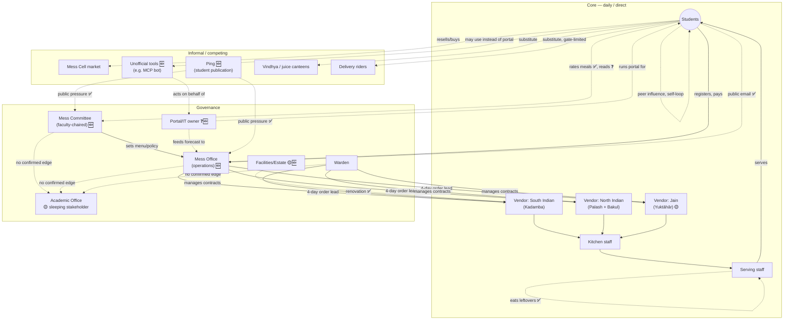
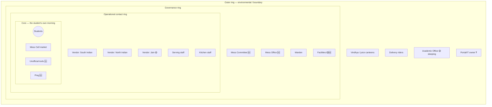

# Phase 1 · Activity 2 — Stakeholder Map (prathyusha draft, v2)

**Status:** 🟡 REVISED 2026-09-05 after a full first-principles stakeholder-universe
discovery pass — see `prathyusha_02b-stakeholder-universe-register.md` for the complete
register, taxonomy, relationship matrix, and reasoning behind every change below. This
file is the compact diagram-first view; that file is the source of truth for detail.

**What changed from v1:** the mess structure is corrected to a cuisine-based model
(Kadamba=South Indian, Bakul=North Indian veg+non-veg, Palash=North Indian veg-only,
Yuktāhār=Jain) rather than the earlier catering/on-site guess; **Mess Committee and
Mess Office are split** into two governance actors (previously collapsed into one);
**Friends/Roommates are removed as separate nodes** — they were an over-expansion,
corrected to a peer-influence edge on the Students node itself; **Ping, unofficial tool
developers, the Portal/IT owner, and a Facilities/Estate placeholder are added** — all
discovered via public-source research, none present in v1.

**Confidence legend:** ✅ confirmed · 🟡 plausible/hypothesis · ❓ open/unknown

---

## Core tier — daily, direct interaction

- **Students** ✅ — registrant + billed party. Internal states (attends/skips/mixed,
  uses Mess Cell, uses an unofficial tool) are behavioral segments, not separate
  stakeholders — see the register §D. **Peer influence between students** (a roommate
  or friend prompting/not-prompting a given morning) is modeled as a self-loop edge on
  this node, not as separate "Friends"/"Roommates" stakeholders (corrected from v1).
- **Vendors** ✅ — three, cuisine-specialized, each doing their own procurement (4-day
  lead time, confirmed) and cooking: **South Indian (Kadamba)**, **North Indian
  (Palash veg-only + Bakul veg/non-veg, one vendor org)**, **Jain (Yuktāhār)** 🟡
  relationship to the other two vendors unconfirmed.
- **Mess serving/counter staff** ✅ — front-line; notably **eat the mess's own leftover
  food themselves** post-service (confirmed) — a real informal waste-absorption
  mechanism.
- **Kitchen/cooking staff** ✅ — per-vendor, distinct role from serving staff.

## Governance tier — sets and executes rules, not daily-present

- **Mess Committee** ✅🆕 — **faculty-chaired** policy body (public source,
  user-confirmed this split is real); sets menu (~1 month ahead) with student input.
  **Previously merged with Mess Office in v1 — now split.**
- **Mess Office** ✅🆕 — separate operational/administrative arm: places food orders
  (4-day lead), runs the portal relationship, sends policy-change emails. Explicit
  stated motive for its one confirmed policy change: reducing *staff* workload, not
  improving student experience.
- **Warden** ✅ — vendor management, structural mess changes. 🟡 Relationship to Mess
  Office specifically is unconfirmed — may overlap.
- **Academic Office / timetable authority** ✅ — confirmed zero formal role in mess
  matters. Still the clearest **sleeping stakeholder**: holds the one lever (8:30 AM
  class start) most likely to matter, zero engagement.
- **Facilities/Estate team** 🟡🆕 — placeholder; the Kadamba renovation is confirmed
  real, but who runs facilities is unconfirmed (your own inference, not direct
  knowledge).
- **Portal/IT system owner** ❓🆕 — maintains `dining.iiit.ac.in` (current portal,
  confirmed); identity completely unknown. Structurally critical, entirely invisible in
  every account gathered so far.

## Informal / competing tier

- **Mess Cell WhatsApp community** ✅ — self-organized resale market for unused
  registrations.
- **Unofficial tool developers** ✅🆕 — a real, public, MIT-licensed tool
  (`NJP6969/IIITH-mess-MCP`) lets students manage registration via an AI agent,
  "built for students of IIIT Hyderabad." 🟡 Whether anyone you know actually uses one
  is unconfirmed — kept at low confidence but included because it changes what "batch
  registration" could even mean.
- **Ping (student publication)** ✅🆕 — has published twice on mess issues (Dec 2024,
  Jan 2025); a real public-pressure/awareness channel, entirely absent from v1.
- **Vindhya canteen / juice canteens** ✅ — competing substitute.
- **Delivery riders (Swiggy/Zomato/Blinkit)** ✅ — competing substitute, gate-restricted.

---

## Relationships and edges worth flagging

- **Academic Office ↔ any governance actor (Committee, Office, or Warden): no edge,
  confirmed three separate ways.** The single most load-bearing finding in this whole
  map — see the register §F/§L for the full relationship matrix.
- **Mess Committee → Students: one-directional**, "sets menu with student input" ✅,
  but whether that input has real weight is still ❓ (Guide 1 Q5, today).
- **Feedback now has two confirmed real channels — a correction, not just an
  addition:** an in-app per-meal rating (✅) and public email (✅, user-confirmed) — the
  earlier "no escalation mechanism exists" finding is **too strong** and is revised:
  inputs exist; whether either ever produces an output is still ❓, now the sharpest
  open question in the whole project (see register §M).
- **Cuisine, not mess age, is the better-evidenced explanation for the uptake gap** —
  every North Indian line (Bakul veg 31%, Bakul non-veg 11%, Palash 36.5%) clusters far
  below the only South Indian line (Kadamba 79%/51%). This **replaces** "Bakul is
  newer" as the leading hypothesis — see register §B for the full numbers.
- **Vendors ↔ Students: no direct edge** — everything routes through Mess Office/the
  portal; no evidence vendors ever hear from students directly, which matters if the
  cuisine hypothesis is real and actionable.

---

## Map (clustered by tier)

---

## Onion diagram (concentric view)

**What the onion view adds:** Academic Office still has to cross every ring to reach
the student, unchanged from v1 — but now **Ping and the unofficial tools sit at the
innermost ring** alongside Mess Cell, despite zero formal standing anywhere in
governance. Three of the four innermost-ring actors are entirely informal — the formal
system (Mess Committee, Mess Office) sits one ring further out than the things
students actually interact with daily to route around it.

---

## Interests, needs, and expectations (explicit — the framework asks for all three, not just interest)

| Stakeholder | Interest (what they want) | Need (what they require to function) | Expectation (what they assume will happen) |
|---|---|---|---|
| Students | Convenient, affordable, timely food | A working registration/billing system, predictable hours | Registering = eventually eating, if they choose to; being charged either way is tolerated, not necessarily agreed with |
| Mess Committee | Balance student satisfaction with feasibility | Reliable registration/demand data | Student input via the existing channels is sufficient engagement |
| Mess Office | Lower operational workload | A stable, predictable registration number well ahead of service | Tighter rules (Dec 2024 policy) reduce their own workload without needing to prove it improves student outcomes |
| Warden | Smooth operations, minimal escalation | Vendor cooperation, few structural complaints | Mess Committee/Office handle day-to-day; they step in only for structural/vendor issues |
| Academic Office | Its own scheduling goals, unrelated to mess | Room/faculty availability data | No expectation of mess-related input at all — mess isn't in their frame of reference |
| Vendors | Contract renewal, predictable volume | The 4-day-ahead registration forecast | The forecast roughly reflects real demand — an expectation the paradox itself may be quietly violating |
| Serving/kitchen staff | Manageable prep/service load | Enough lead time and accurate headcounts | Leftover food is theirs to eat — an informal expectation, not a written rule |
| Mess Cell community | Recoup cost on an unused registration | An active, trusted buyer pool | The group stays under-the-radar enough to keep functioning informally |
| Ping | Publish stories students will read | Access to real information/sources | Publishing awareness is itself a valid form of accountability, even without a formal reply mechanism |

---

## Still open — resolves via P0/P1 interviews (see register §N for the full plan)

- [ ] Cuisine-preference hypothesis — ask directly in Guide 1 today
- [ ] Mess Office ↔ Warden relationship — Role D
- [ ] Whether feedback (rating/email/Ping) has ever produced a real policy change —
      Role D, highest priority
- [ ] Portal/IT owner identity — Role D if accessible, otherwise stays ❓
