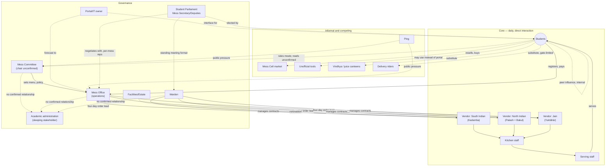
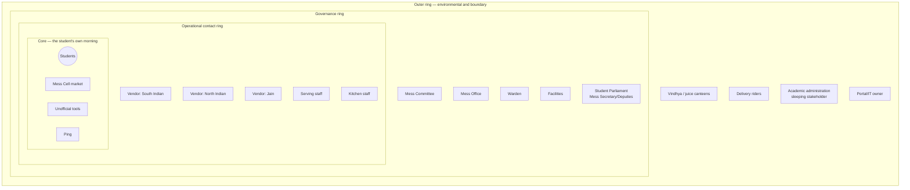

# Overview

This document identifies the actors, institutions, and informal structures that
participate in, influence, benefit from, or are affected by the breakfast mess system
described in the System Context Brief, and maps the relationships, dependencies, and
influence between them. It was built through a first-principles system decomposition
(seventeen analytical lenses — student/user, social, food production, governance, money,
technology, academic, sleep/time-use, substitute systems, campus infrastructure, waste,
health, policy, informal systems, absent/sleeping stakeholders, temporal, and
intervention lenses) rather than starting from an assumed list, then narrowed to a
defensible final set based on evidence.

Sources: the team's primary interview and portal-screenshot research (`research/
primary-research/`), a teammate's independent hypothesis framework (`research/
primary-research/team-contributions/2026-09-05_teammate-constraints-edge-cases-
verticals.md`), and public-source research into IIIT Hyderabad's mess governance
structure, conducted 2026-09-05. Confidence is stated in prose for every claim rather
than assumed; several items remain hypotheses pending the Role A–D interviews still to
be conducted, and are marked as such throughout.

# Stakeholder Register

Twenty-seven candidate actors were identified across all seventeen lenses. Seventeen are
included in the final map below; four were considered and excluded on evidence grounds
(§"Considered and Excluded"); the remainder are folded into the roles/segments of an
included actor rather than treated as separate stakeholders (§"Roles, Not Stakeholders").

## Summary

| Actor | Tier | Type | Formal / Informal | Direct / Indirect / Latent |
|---|---|---|---|---|
| Students | Core | Human group | Formal (as registrant) | Direct |
| Vendor — South Indian (Kadamba) | Core | Commercial | Formal | Direct |
| Vendor — North Indian (Palash veg-only + Bakul veg/non-veg) | Core | Commercial | Formal | Direct |
| Vendor — Jain (Yuktāhār) | Core | Commercial | Formal | Direct |
| Mess serving/counter staff | Core | Human group | Formal | Direct |
| Kitchen/cooking staff | Core | Human group | Formal | Direct |
| Mess Committee | Governance | Institution | Formal | Indirect |
| Mess Office | Governance | Institution | Formal | Indirect |
| Warden | Governance | Individual role | Formal | Indirect |
| Academic administration / timetable authority | Governance | Institution | Formal | Latent |
| Facilities/Estate team | Governance | Institution | Formal | Latent |
| Portal/IT system owner | Governance | Institution or individual | Formal | Latent |
| Student Parliament — Mess Secretary/Deputies | Governance | Elected student body | Formal | Indirect |
| Mess Cell WhatsApp community | Informal | Informal group | Informal | Direct |
| Unofficial mess-tool developers | Informal | Individual(s) | Informal | Latent |
| Ping (student publication) | Informal | Institution | Informal | Latent |
| Vindhya Canteen | Competing | Commercial | Formal | Direct |
| Delivery platforms and riders | Competing | Commercial | Formal | Direct |

## Core tier — daily, direct interaction

**Students.** Role: registrant and billed party across all four messes; consumer of the
meal itself. Formal role is defined by the registration-and-billing relationship with
the Mess Office; informally, a student may also occupy temporary roles as a Mess Cell
buyer or seller, or as a user of an unofficial registration tool, without those being
separate stakeholders — see "Roles, Not Stakeholders" below. Interest: convenient,
affordable, timely food, and not paying twice for a missed meal. Need: a functioning
registration and billing system, predictable operating hours, and food matching their
dietary registration. Expectation: that registering for a meal will, if they choose to
attend, reliably result in being fed; being charged regardless of attendance is
tolerated as a known rule, not necessarily agreed with. Resources controlled: their own
registration choices, money, and time. Information held: their own intent and schedule
for a given morning. Information lacked: real-time queue and kitchen-preparation state,
and whether any feedback they give is ever acted on. Dependencies: on vendors and staff
for food; on the Academic administration for a schedule that does not conflict with
mess hours, a dependency the student cannot influence directly. Peer influence between
students — a roommate or friend's presence changing whether a given student attends on
a given morning — is treated as an internal relationship on this node rather than as a
separate "Friends" or "Roommates" stakeholder, since it describes a relationship between
two instances of the same actor type, not a distinct kind of actor.

**Vendors — South Indian (Kadamba), North Indian (Palash veg-only and Bakul veg/
non-veg, one vendor organization), and Jain (Yuktāhār).** Role: per-mess food
procurement and preparation; each vendor sources its own ingredients and cooks
independently, rather than through centralized institute procurement (confirmed
directly). The North Indian vendor cooks its shared vegetarian line at Palash and
transports it to Bakul, since Palash's kitchen cannot produce non-vegetarian food; Bakul
prepares non-vegetarian food on-site. The Jain vendor's relationship to the other two —
shared or fully independent — is not yet confirmed. Formal role: contracted supplier,
managed by the Warden. Interest: contract renewal, predictable order volume, margin.
Need: an accurate registration forecast delivered with enough lead time to procure
ingredients — currently four days ahead of service (confirmed, previously two days per
an earlier institute policy). Expectation: that the four-day-ahead forecast
approximates real demand — an expectation the registration-without-attendance pattern
this project studies may be quietly violating. Resources controlled: kitchen capacity,
staff, ingredient sourcing. Information held: actual quantities cooked and served, not
currently known to flow anywhere beyond the vendor itself. Dependency: bound by the
four-day procurement window, which caps how responsive any vendor can be to a same-day
signal such as the Skip Meal toggle, regardless of intent.

**Mess serving and counter staff; kitchen and cooking staff.** Role: front-line
execution — preparation, plating, and service. A notable confirmed practice: serving
and cleaning staff eat the mess's own food themselves after student service hours
conclude, an informal but real mechanism absorbing at least some unclaimed food, not a
designed waste policy. Formal role: employed by the relevant vendor. Interest:
manageable preparation and service load, predictable headcounts. Need: sufficient lead
time and an accurate registration count. Expectation: that leftover food is theirs to
consume — an informal norm, not a written entitlement. Information lacked: whether a
Skip Meal toggle set the same morning reaches them in any way that changes preparation,
given that the four-day procurement window likely already dominates the decision by
the time a same-day toggle is set.

## Governance tier — sets and executes rules, not daily present

**Mess Committee.** Role: policy body responsible for menu content, set approximately
one month ahead of service with student input. Chaired by a faculty member (identified
through public-source research on the institute's own student publication, not
independently re-confirmed for the current term). Formal authority: high, over policy.
Interest: balancing student satisfaction against operational feasibility. Need: a
functioning process for gathering and interpreting student input. Expectation: that the
existing student-input process for the menu constitutes sufficient engagement with
students on mess matters generally, including matters — hours, billing structure — the
same process was never designed to cover.

**Mess Office.** Role: day-to-day administration, distinct from the Mess Committee —
places food orders on the four-day lead time described above, operates the registration
platform relationship, and communicates policy changes to students. This distinction
between a policy-setting Mess Committee and an operations-executing Mess Office had not
previously been separated in earlier team documents and is added here based on
public-source research (the institute's student publication reported a December 2024
policy change originating specifically from the Mess Office, motivated explicitly by
reducing staff workload rather than by a student-facing goal). Formal authority:
implementation-level. Interest: reduced operational workload — the confirmed, stated
motive behind the one policy change on record. Dependency: constrained by the same
four-day procurement window it imposes on vendors.

**Warden.** Role: vendor management and any structural change to mess operations.
Formal authority: high, over infrastructure and vendor relationships. The Warden's
relationship to the Mess Office specifically — overlapping responsibility or a
separate lane — is not yet confirmed.

**Academic administration / timetable authority.** Role: sets the class schedule,
including the 8:30 AM start that overlaps with the breakfast window. Formal authority:
total, within its own domain. Confirmed to hold no formal role in mess-related
decisions whatsoever. This is the clearest case of what this analysis terms a sleeping
stakeholder: an actor holding the single lever most likely to materially affect the
core problem — the timing overlap itself — with no engagement, incentive, or channel
connecting it to any mess-governance actor. No relationship of any kind links this
actor to the Mess Committee, the Mess Office, or the Warden in any evidence gathered so
far.

**Facilities/Estate team.** Role: physical mess infrastructure. Included as a
placeholder rather than a confirmed actor: a real renovation of the Kadamba mess has
occurred (confirmed directly), which necessarily implies some facilities-owning entity
authorized and executed it, but that entity's identity has not been established by any
source.

**Portal/IT system owner.** Role: maintains the digital registration platform
(`dining.iiit.ac.in`), the interface every registration decision passes through.
Included because of its structural centrality rather than direct evidence: no
interview, screenshot, or public source has identified who builds or maintains this
system — institute IT, an external vendor, or otherwise.

**Student Parliament — Mess Secretary and per-mess Mess Deputy Secretaries.** ✅
Verified directly from the Parliament's own published roster (added 2026-09-06,
during Activity 3's power analysis — this stakeholder should have surfaced in this
Activity 2 map and is added here directly rather than left only in the Activity 3
document). Role: elected student representation on mess matters, structured as one
Mess Secretary plus a dedicated Deputy Secretary for each individual mess (confirmed
for Yuktāhār, Kadamba, and Palash), elected through the institute's Student Parliament
rather than appointed by the Mess Committee itself. A "North Mess Secretary" role
existed historically, independently corroborating the North/South mess-naming
research from an entirely separate source. Formal authority: elected representative
standing; whether this extends to a vote inside the faculty-chaired institute Mess
Committee, or operates only through a separate Parliament-internal mess committee, is
unresolved — see `prathyusha_03-power-interest-leverage-map.md` for the full
disambiguation. Interest: student-facing advocacy on mess matters. Need: a working
channel to whichever body actually holds decision authority. Dependency: depends on
the Mess Committee/Office to act on anything it raises, exactly like students
generally, but with a formal standing individual students lack.

## Informal and competing tier

**Mess Cell WhatsApp community.** Role: a self-organized, peer-to-peer resale market
in which a student holding a registration they will not use offers it to another
student at a negotiated price below the registered rate, transacted through the same
QR-based access credential the formal system issues. This is an emergent structure, not
a designed one, and — per a teammate's independent analysis (referenced above) — may be
a rational response to the fact that the system's own built-in tool for anticipated
non-attendance, Skip Meal, returns no value to the student at all, while resale returns
partial or full value. A student with advance notice they will not attend has a
structural incentive to prefer resale over Skip Meal every time, which would mean low
Skip Meal usage reflects incentive design rather than low awareness. This is a
testable hypothesis, not yet confirmed directly.

**Unofficial mess-tool developers.** Role: at least one publicly documented,
open-source tool exists that allows a student to manage mess registration,
cancellation, billing, and feedback through an AI agent rather than the official portal
directly, described in its own documentation as "built for students of IIIT
Hyderabad." Its existence is confirmed; how widely it is used, and whether it changes
registration behavior in practice, is not.

**Ping.** Role: the institute's student publication has published at least twice on
mess-related issues (December 2024 and January 2025), functioning as a real, if
indirect, public-awareness and pressure channel — distinct from, and reaching a
different audience than, the direct-email channel students also use to raise mess
concerns.

**Vindhya Canteen and the juice canteens; delivery platforms and their riders.** Role:
competing food sources drawing on the same student population when mess breakfast is
skipped or unavailable. No material change from the System Context Brief's existing
treatment of these actors.

## Roles, Not Stakeholders

Several categories that might initially appear as separate stakeholders are, on
inspection, behavioral states or temporary roles occupied by a single underlying actor
— Students — rather than distinct actors in their own right: attending regularly,
skipping regularly, having an early class on a given day, buying or selling on Mess
Cell, and using an unofficial registration tool are all states a single student may
move through within the same week. Guest diners (relatives, visiting parents, and
non-student campus affiliates who pay a vendor directly) are the one genuine exception:
they occupy a materially different formal relationship to the system — no registration
or monthly billing cycle — and are noted here for completeness, though their volume
appears too marginal to warrant inclusion as a full stakeholder in the final map.

## Considered and Excluded

Cleaning staff, juice canteens specifically, and campus security/gate staff were
considered and are treated as minor rather than excluded outright — real, but with no
evidence of independent systemic leverage on the core problem beyond what is already
captured through serving staff, Vindhya, and the delivery-platform relationship
respectively. A campus health or wellbeing office was explicitly considered and
rejected: no evidence from any source connects it to breakfast-skipping in this
population, and including it without evidence would medicalize the problem on no
basis. Norm transmission between senior and junior students, and any financial
relationship with parents or guardians, were considered as possible mechanisms but are
not stakeholders in themselves — no evidence supports or refutes either as relevant,
and the mess fee is understood to be bundled into hostel fees rather than paid
per-meal by a guardian.

# Relationships, Dependencies, and Influence

## Relationship matrix

The matrix below covers the eleven stakeholders with the most consequential
relationships. Cells marked as hypothesis have not been independently confirmed.

| | Students | Mess Committee | Mess Office | Warden | Academic admin. | Vendors | Staff | Mess Cell | Ping | Vindhya | Portal/IT |
|---|---|---|---|---|---|---|---|---|---|---|---|
| **Students** | — | Feedback (rating system confirmed to exist; whether read is unconfirmed) | Registration, payment | — | Dependent on its schedule | Payment, service | Service | Payment, service | — | Payment, service (substitute) | Interface, dependent on |
| **Mess Committee** | Authority (menu, feedback) | — | Authority (sets policy) | Hypothesis: overlap | No relationship of any kind | Authority (menu) | — | — | Hypothesis: subject of coverage | — | — |
| **Mess Office** | Billing, dependent on for order accuracy | Reports to (hypothesis) | — | Hypothesis: overlap | No relationship of any kind | Authority, dependency (ordering) | Authority | — | Hypothesis: subject of coverage | — | Interface, dependent on |
| **Warden** | — | Hypothesis | Hypothesis | — | No relationship of any kind | Authority (contracts) | — | — | — | — | — |
| **Vendors** | Payment, food/material | Authority over | Authority over, dependency | Contract authority | — | — | Manages | — | — | Competes for demand | — |
| **Mess Cell** | Payment, service, informal influence | — | — | — | — | — | — | — | — | — | — |

The empty and no-relationship cells are as significant as the populated ones. Academic
administration has no confirmed relationship of any kind to any of the three
governance actors — a genuine structural gap, not a modeling omission, and the most
consequential single finding in this map.

## Notable dependencies

Students depend on vendors for food quality and timing; vendors do not depend on any
individual student, an asymmetric dependency consistent with a walk-in pricing
structure that requires no negotiation. Vendors depend on the Mess Office for a
registration forecast fixed four days ahead of service; the Mess Office depends on
students to register accurately, but nothing in the billing structure requires
accuracy, since a student is charged identically whether or not they attend — the
weakest link in this dependency chain is also the one with no incentive attached to it.
The Mess Committee depends on the Mess Office to execute policy; the Mess Office's own
stated motivation for its one confirmed policy change (reducing workload) did not
visibly originate from or require Mess Committee direction, suggesting operational
pressure may drive policy from below at least as often as governance drives it from
above.

## Missing relationships worth naming explicitly

Beyond the Academic administration gap already noted: no source describes a direct
relationship between vendors and students — all communication appears to route through
the Mess Office or the portal, which would matter if the cuisine-related uptake pattern
discussed below is real and actionable, since vendors have no confirmed way to hear
about it directly. Similarly, no source describes the Portal/IT owner having any direct
relationship with the Mess Committee, despite the Committee setting policy that this
system presumably enforces technically.

# Stakeholder Map

## Onion diagram — distance from the student's lived experience

The map above clusters actors by relationship type. The view below clusters the same
actors by proximity to a student's actual morning, which surfaces a different finding:
Academic administration sits at the outermost ring with no adjacent relationship
connecting it inward at any layer, while Mess Cell, the unofficial tools, and Ping —
none of them part of the formal governance structure — sit at the innermost ring
alongside the students themselves.

# Classification Lenses

A single primary/secondary/peripheral classification understates how these actors
differ from one another. Four additional lenses are applied:

**Direct, indirect, or latent.** Direct: students, vendors, serving and kitchen staff,
Mess Cell, Vindhya, delivery platforms. Indirect: Mess Committee, Mess Office, Warden.
Latent — currently inert, activated only under specific conditions: Academic
administration, Facilities, the Portal/IT owner, unofficial tool developers, Ping.

**Formal or informal.** Formal: every institutional and commercial actor. Informal:
Mess Cell, Ping, unofficial tool developers.

**Internal, boundary, or external.** Internal to the system as currently scoped:
students, Mess Committee, Mess Office, vendors, staff, Mess Cell. At the boundary,
easily overlooked: Academic administration, Facilities, the Portal/IT owner,
unofficial tool developers, Ping. External: Vindhya, delivery platforms, guest diners.

**Operational, managerial, governance, or environmental.** Operational: staff, Mess
Office, vendors. Managerial: Warden. Governance: Mess Committee, Academic
administration. Environmental: Vindhya, delivery platforms, Mess Cell, Ping.

# Hidden and Sleeping Stakeholders

**Stakeholders that a conventional stakeholder-identification exercise would likely
have missed:** the Mess Office as an actor distinct from the Mess Committee — every
prior account, including this team's own earlier drafts, quietly merged who decides
policy with who executes it; the unofficial tool developers, invisible unless one
specifically searches a public code-hosting site for a campus-specific integration;
Ping, a category of thing one might think to check once named, but not something any
interview or screenshot pointed toward; and the Portal/IT owner, interacted with
constantly by every student and named by none of them.

**Sleeping stakeholders — real leverage, no current involvement:** Academic
administration remains the clearest case, with no relationship of any kind to any
mess-governance actor. The Mess Committee's faculty chair is a second, more subtle
case: a real individual with cross-institutional standing no student-only channel
possesses, and the most structurally plausible bridge to Academic administration
available — with no evidence that bridge has ever been attempted.

# Open Items

The following require the Role A–D interviews (`research/methodology/
prathyusha_interview-guide-phase1-halfday.md`) still to be conducted, and should
correct rather than append to this document once answered:

- Whether a student's choice of mess is driven by cuisine preference — a pattern
  visible in the registration data (every North Indian mess line runs well below the
  one South Indian line, across three separate messes) that would supersede the
  currently-documented "Bakul is newer" explanation as the primary driver, without
  necessarily ruling it out entirely.
- The exact relationship between the Mess Office and the Warden.
- Whether any of the three confirmed feedback channels — the in-app rating system,
  direct email, or Ping's coverage — has ever produced a concrete policy change; no
  source consulted so far, real or otherwise, could name a specific example in either
  direction.
- The identity of the Portal/IT owner and the Facilities/Estate team.
- Real usage and scale of the unofficial registration tools and the Mess Cell market.
- **Added 2026-09-06:** whether the faculty-chaired institute Mess Committee and the
  Parliament-internal mess committee (staffed by the Mess Secretary/Deputies above)
  are the same body or two distinct ones — see
  `prathyusha_03-power-interest-leverage-map.md` for the full disambiguation, found via
  independent research after this map's initial version was written.
- **Added 2026-09-06:** whether "Mess Council," named by the user as the recipient of
  the public complaint email, is a real distinct body or a naming mix-up with a
  different institution's similarly-named council — evidence currently leans toward
  the latter.
