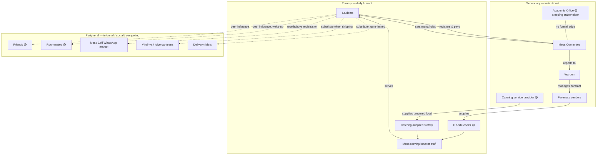
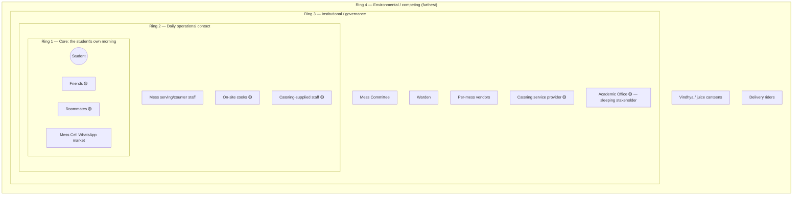

# Phase 1 · Activity 2 — Stakeholder Map (prathyusha draft)

**Status:** DRAFT — built from `01-system-context-brief.md` + `prathyusha_braindump.md`,
**before** today's/tomorrow's interviews (see
`research/methodology/prathyusha_interview-guide-phase1-halfday.md`). Confidence-tagged
per item; go back and overwrite 🟡/❓ items once interview answers land — don't just
append corrections underneath.

**Confidence legend:** ✅ confirmed (already in context brief / screenshots) · 🟡 my
inference, not yet asked directly · ❓ open question, worth raising if it comes up
naturally

---

## Primary tier — daily, direct interaction

- **Students** (attend / skip / mixed) ✅
  - Interest: get fed conveniently and cheaply before class; avoid double-paying for a
    registration plus a walk-in/canteen alternative.
  - Formal role: registrant + billed party. Informal: can resell an unused registration
    via Mess Cell.
- **Mess serving/counter staff** ✅ (named in context brief §6)
  - Interest: manageable service load, predictable headcount.
  - 🟡 No confirmed channel for raising counter-crowding pain points upward — worth a
    question if tomorrow's staff chat allows.
- **Kitchen staff — split by production model** 🟡 *new split, from 2026-09-05
  conversation, not in the original context brief*
  - On-site cook messes — ❓ which messes exactly, ask tomorrow
  - Catering-service-supplied messes — ❓ which messes exactly, ask tomorrow
  - Interest: manageable prep load, cost control (esp. gas/ingredient price
    sensitivity), waste minimization.
- **Catering service provider(s)** 🟡 — new actor category. Formal contractual role;
  interest = margin and contract renewal.

## Secondary tier — institutional, shapes rules, not daily-present

- **Mess Committee** ✅ — decides menu (~1 month ahead, with student input); interest:
  student satisfaction balanced against operational feasibility.
- **Warden** ✅ — vendor management, mess-level structural changes; interest: smooth
  operations, minimal escalations.
- **Per-mess vendors** ✅ (Kadamba's own; Palash/Bakul's shared vendor) — interest:
  contract terms, volume.
- **Academic Office / timetable authority** ✅ has-no-formal-mess-role (context brief §5)
  — 🟡 flagged here as a *sleeping stakeholder*: holds the one lever (8:30 AM class
  start) most likely to resolve the core paradox, but has zero mandate or attention on
  mess matters. Worth testing today: do students think this office would even entertain
  the idea?

## Peripheral tier — informal, social, competing

- **Friends** 🟡 — new from braindump, not previously mapped. Interest: shared social
  routine; peer-influence edge on individual go/skip decisions — confirm today (Guide 1,
  Q5).
- **Roommates** 🟡 — same, plus a possible "wakes you up" logistics role — confirm today
  (Guide 1, Q2/Q5).
- **Mess Cell WhatsApp community** ✅ — informal, self-organized resale market; interest:
  recouping the cost of a registration they know they won't use. This is an *emergent
  structure*, not a designed one — will matter a lot once Phase 2's Iceberg analysis
  runs.
- **Vindhya canteen / juice canteens** ✅ — competing substitute; interest: capturing
  students who skip or miss mess breakfast.
- **Delivery riders** ✅ — competing substitute, gate-restricted/logistics-constrained.

---

## Relationships and edges worth flagging (conflicts / dependencies / absences)

- **Academic Office ↔ Mess Committee: no edge.** Already flagged structurally in the
  context brief (§5) as an organizational gap — 🟡 the *absence* of this relationship is
  itself a finding worth carrying into the Power-Interest map and, later, the Iceberg's
  Structures layer.
- **Mess Committee → Students: one-directional in current data.** Committee "sets menu
  with student input" ✅, but ❓ how much real influence that input has is untested —
  Guide 1 Q5 asks this directly today.
- **Students ↔ Mess Cell community:** peer-to-peer, self-organized, bypasses the
  official billing/cancellation system entirely — a workaround relationship, not a
  designed one.
- **Catering-mess vs. cook-mess split** 🟡 — hypothesized to explain
  capacity/quality/uptake differences (Kadamba vs. Bakul vs. Palash) better than the
  "Bakul is newer" story currently in the context brief. Direct test: tomorrow's staff
  interview, Guide 2 Q1.

---

## Map (clustered by tier)

---

## Onion diagram (concentric view of the same stakeholders)

The tiered map above clusters by *type* of relationship (institutional vs. informal).
This view clusters by *distance from the student's daily lived experience* — the same
actors, a different lens, per the braindump's "multiple maps, not one" instruction.
Mermaid has no literal circle primitive, so nesting is rendered as boxes-within-boxes:
read outer rings as "further from the student's morning," inner rings as "closer to it."

**Why this view earns its place, not just duplicates the tiered map:** it makes one
thing visually obvious that the tiered map doesn't — **Ring 4 (Academic Office) has to
cross three full rings to reach the student**, with no direct edge at any layer. That's
the same "sleeping stakeholder" finding from the Power-Interest map, but the onion view
shows *why* it stays sleeping: there's no adjacent ring connecting it to daily student
experience, only to Ring 3 governance peers who also don't engage it (§ "no formal edge"
in the tiered map above). Meanwhile Ring 1's Mess Cell market sits at the *innermost*
ring despite having zero formal standing anywhere in the tiered map's institutional
column — an informal structure that's closer to the student's actual morning than the
Mess Committee is.

---

## Still open after today

- [ ] Confirm/replace 🟡 friend/roommate influence edges — Guide 1, Q5
- [ ] Confirm/replace 🟡 cook-vs-catering split and which messes fall where — Guide 2, Q1
- [ ] Confirm/replace ❓ "how much real influence" on the Committee → Students edge —
      Guide 1, Q5
