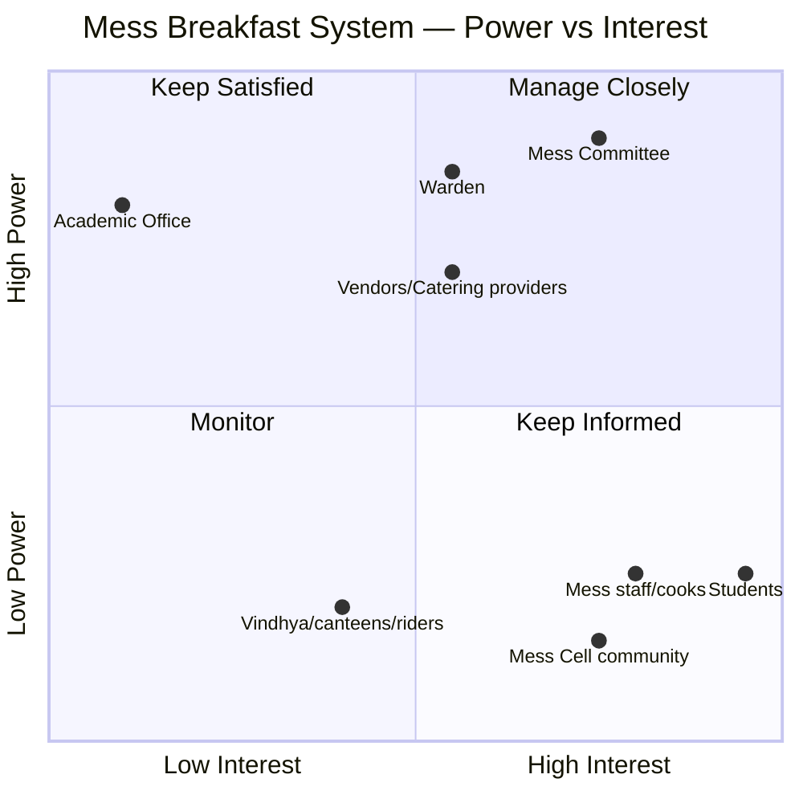

# Phase 1 · Activity 3 — Stakeholder Power–Interest / Leverage Map (prathyusha draft)

**Status:** DRAFT — built from `prathyusha_02-stakeholder-map.md`, before today's/
tomorrow's interviews. Same confidence legend as that file (✅ confirmed · 🟡 inference ·
❓ open question).

## Power Analysis Brief

Power = decision-making authority + resource control. Interest = how much the outcome
affects the actor, or how much attention they actually pay it (these are not always the
same thing — see the Academic Office row).

| Actor | Power | Interest | Quadrant | Confidence |
|---|---|---|---|---|
| Mess Committee | High — sets menu/rules | High | Manage Closely | ✅ |
| Warden | High — vendor mgmt, structural changes | Medium-High | Manage Closely | ✅ |
| Per-mess vendors / catering providers | Medium-High — controls supply volume/quality/cost | Medium | Manage Closely / Keep Satisfied | 🟡 |
| Academic Office / timetable authority | High — controls the one lever (class start time) that could resolve the core paradox | Very Low — no mandate/attention on mess matters | Nominally "Keep Satisfied," functionally disengaged — a **sleeping power** | 🟡 |
| Students | Low — no formal decision authority, "input" only | Very High — bears cost + experience directly | Keep Informed — textbook mismanaged quadrant, same shape as Puzzle 4's Student Parliament case | ✅/🟡 |
| Mess serving/kitchen/cooking staff | Low formal power — execute decisions | High — workload, waste, day-to-day friction | Keep Informed — an underused source of operational truth | 🟡 |
| Mess Cell WhatsApp community | None formal, but high de facto structural influence (absorbs waste/no-show pressure the official system doesn't handle) | High | Monitor formally / arguably deserves Manage Closely once its real scale is known | 🟡 |
| Vindhya / juice canteens, delivery riders | Low power over the mess system itself | Medium — business interest in capturing skippers | Monitor | ✅ |
| Friends / Roommates | Low power at system level | High interest at the individual-decision level, not systemic | Out of formal power-interest scope — relevant to the Process Trace (#4) instead | 🟡 |

## Quadrant chart

## Two strategic findings to carry into Phase 2

1. **Academic Office is a "sleeping power."** It holds the single lever most likely to
   resolve the core paradox — shifting the 8:30 AM class start, or even just the first
   class of the week — but has no interest or mandate that would make it act. This is a
   structural / mental-model finding for the Iceberg analysis later, not just a gap in
   the map.
2. **Mess staff are high-interest, near-zero-formal-power, and their operational
   knowledge (waste volume, real headcounts, cost/workload pressure) doesn't appear to
   reach decision-makers through any formal channel.** Tomorrow's interview (Guide 2) is
   as much a data point for *this* map as it is for the Process Trace.

## Still open after today/tomorrow

- [ ] Confirm real scale/frequency of Mess Cell activity — would move it from "Monitor"
      toward "Manage Closely" if it's larger than assumed
- [ ] Confirm students' own sense of their interest/power (Guide 1, Q5) — currently
      plotted from the context brief's structural facts, not from a student's own framing
- [ ] Confirm vendor vs. catering-provider power split once Guide 2 clarifies which
      messes use which model
