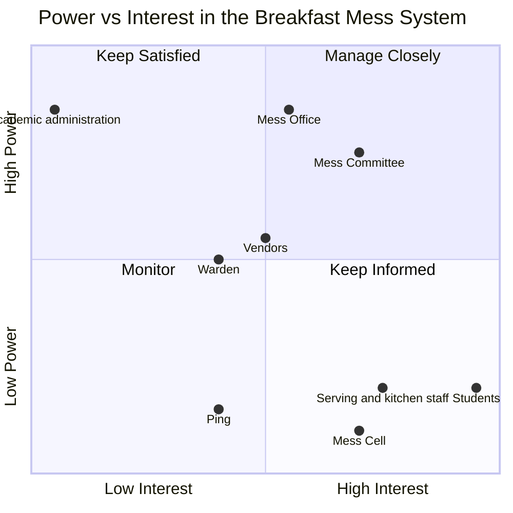
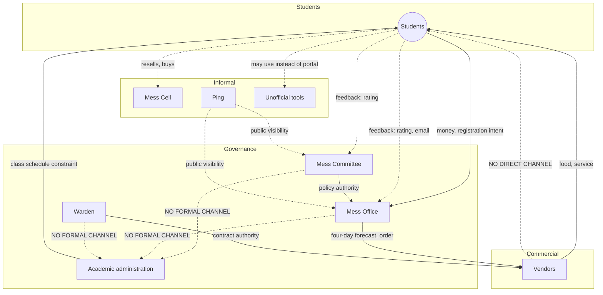

# Executive Summary

Power in this system is not concentrated in one actor and does not move as a single
current. It is split across three separate governance bodies whose relationship to one
another is only partly established; it is exercised informally by actors with no
official standing at all; and its most consequential feature may be an absence rather
than a presence — the complete lack of any relationship between the one actor who
controls the class schedule and the three actors who control everything else about
breakfast. The central finding of this analysis is that the actor who bears the full
cost of the registration-attendance gap (the student) controls the one input every
other actor's planning depends on (registration intent), while bearing no cost for
supplying that input inaccurately — a structurally unusual position that is neither
straightforwardly powerful nor straightforwardly powerless. Ten open questions were
put to the user directly and answered on 2026-09-06 (logged in
`prathyusha_03b-power-analysis-discovery.md` §13); two of the answers revised findings
rather than merely filling gaps — a confirmed student representative on the Mess
Committee, and a confirmed prior instance of organized student action aimed directly
at governance, not just at peer-to-peer transactions — and are reflected throughout
this document. What remains genuinely unresolved (vendor compensation, the exact
relationship between the newly-surfaced "Mess Council" and the Mess Committee, and
above all what that organized action was about and whether it worked) is flagged 🟡/❓
and routed to specific follow-up interview questions rather than guessed at. Two of the
five incentive chains later in this brief (the Skip-Meal-vs-Mess-Cell dominant-strategy
argument, and the "register just in case" walk-in-markup effect) rest on a teammate's
structural hypothesis rather than direct evidence from any respondent — genuinely
plausible given confirmed pricing data, but not yet confirmed, and flagged as such
where they appear.

# What Power Means in This System

Power here is treated as issue-specific rather than a single score per actor. A
stakeholder may hold high authority over one decision and none over an adjacent one —
the Mess Office, for instance, has demonstrated authority over cancellation policy and
no demonstrated relationship to class-timing decisions at all. Every claim below states
which domain it applies to, distinguishes formal authority from actual observed
influence, and is confidence-tagged: ✅ confirmed by direct evidence, 🟡 a plausible
inference not yet independently verified, ❓ genuinely unknown and named as a research
target rather than guessed at.

# Formal Governance Structure

Three separate institutional actors hold mess governance, a split not previously
recognized in earlier project drafts:

- **Mess Committee** — a policy body that sets the menu approximately one month ahead
  of service with student input. That this body is genuinely separate from the Mess
  Office is ✅ user-confirmed. The specific detail that it is **chaired by a faculty
  member** is 🟡, not ✅: it traces to a search-engine snippet summary of a student
  publication article that returned HTTP 403 on every direct-fetch attempt and was
  never actually read in full — this document does not treat that detail with the same
  confidence as the split itself. Its authority beyond menu content — specifically,
  whether it must approve Mess Office operational changes — is unconfirmed.
- **Mess Office** — the operational and administrative arm: places food orders with
  each vendor on a four-day lead time, administers the registration platform, and
  issues operational policy changes. The one confirmed policy action on record (a
  December 2024 tightening of cancellation rules) was issued by this office alone, with
  its stated motive being a reduction in staff workload rather than a student-facing
  goal.
- **Warden** — holds authority over vendor management and structural changes to the
  mess. No source describes the Warden taking a specific action; this authority is
  stated in the System Context Brief but not observed in any account gathered.

**Academic administration** sets the class schedule, including the 8:30 AM start that
overlaps with the breakfast window, with total authority within that domain and zero
formal relationship to any of the three mess-governance actors above — confirmed three
separate ways (no edge to the Committee, the Office, or the Warden in any source
consulted). This was tested directly rather than left as inference: asked whether
anyone — student, Committee, or Office — has ever raised the overlap with Academic
administration, the answer was that nobody has really tried. This resolves the
question in favor of **inattention rather than refusal** — the absence of a
relationship reflects that the bridge has never been attempted, not that it was tried
and blocked. That distinction matters for what kind of intervention would actually be
tested by attempting it.

**A fifth actor, verified directly from source rather than inferred: the Student
Parliament's elected mess-related roles.** IIIT-H's Student Parliament (elected via
Single Transferable Vote, roughly one representative per 50 students) maintains a
**Mess Secretary** and a dedicated **Mess Deputy Secretary for each individual mess**
(confirmed for Yuktāhār, Kadamba, and Palash; a "North Mess Secretary" role existed
historically, independently corroborating the earlier North/South naming research from
a second, separately-fetched source) — fetched directly from the Parliament's own page
(`clubs.iiit.ac.in`), not a search snippet, and the strongest single piece of formal-
governance evidence in this document. This resolves last round's bare "yes, a student
representative exists" into a real, structured finding: student representation on mess
matters is not one undifferentiated seat, it is a dedicated elected role per mess, sitting
within the Parliament rather than appointed by the Mess Committee itself. Parliament
representatives also hold a standing meeting format with a **Mess Warden** (a title
distinct from, and not yet confirmed identical to, the "Warden" already named above).
This stakeholder was absent from the Activity 2 Stakeholder Map and has been added
there directly, not just noted here.

**"Mess Council," raised in the previous round as the recipient of the public
complaint email, is very likely a naming artifact rather than a real, separate IIIT-H
body.** A real "Mess Monitoring Council" does exist — at IIT Hyderabad, a completely
different institution from IIIT Hyderabad (the two are frequently confused due to the
near-identical name). A domain-restricted search of IIIT-H's own site found no
dedicated "Mess Council" page or reference anywhere. This is not treated as a
correction of the earlier answer so much as a naming clarification worth confirming
directly — the balance of evidence favors "Mess Council" being either a mix-up with
the other institution or an informal way of referring to what the evidence above shows
is more precisely called the Mess Committee or the Parliament's mess-related roles.

**A sharper, still-unresolved ambiguity replaces it: there may be two different things
both called "Mess Committee."** Secondhand sources describe (1) a Parliament-internal
committee, made up of elected MPs, that negotiates and pushes back toward the
administration on behalf of students, and separately (2) the institute-level,
faculty-chaired policy body discussed above. Whether these are the same body with
mixed student/faculty membership, or two genuinely separate committees sharing a name,
could not be resolved by this research and is now the sharpest open naming question in
the governance structure — sharper than the Committee/Office split was last round.

For the majority of specific decisions this system makes — breakfast timing itself,
vendor contract terms, portal functionality, waste handling — no source has described
who proposes, approves, or can veto a change. This is treated as a finding, not a gap
in research alone: the absence of any account of these processes, across a real
interview, a synthetic pilot exercise, and public-source research, suggests these
processes may not be visible to anyone outside the governance actors themselves.

# Informal Power Structure

Four informal actors exercise real influence with no formal standing:

- **Roommates and friends** — direct social prompting changes individual attendance
  decisions; both the one real respondent and independent synthetic-persona exercises
  converged on this mechanism, though it remains a single-respondent-strength finding.
- **The Mess Cell WhatsApp community** — a self-organized resale market that
  demonstrates a real, working capacity for peer-to-peer coordination around the
  registration-attendance gap. This capacity has, as far as any evidence shows, only
  ever been applied to individual transactions, never to a collective approach toward
  the governance actors above.
- **Ping**, the student publication — has published on mess issues at least twice,
  creating public visibility for problems that might otherwise stay private. No source
  identifies an instance of this visibility producing a policy response.
- **Unofficial registration-management tools** — at least one public, open-source tool
  lets a student manage registration through an AI agent rather than the official
  portal. Its existence is confirmed; its adoption and effect on behavior are not.

# Decision Rights

## Authority at a Glance

| Domain | Proposes | Approves | Confirmed? |
|---|---|---|---|
| Breakfast timing | ❓ nobody has evidence of ever proposing a change | ❓ | No — precedent unknown |
| Class timing | Academic administration | Academic administration | ✅ within its own domain, but disconnected from mess governance entirely |
| Registration/cancellation rules | Mess Office | ❓ unclear if Committee sign-off is required | 🟡 one case (Dec 2024) only |
| Menu | Mess Committee, with student input | Mess Committee | ✅ |
| Vendor contracts | ❓ | Warden (per Activity 1) | 🟡 stated, never observed in action |
| Portal/data governance | ❓ entirely unidentified owner | ❓ | No |
| Mess Cell / informal resale | Students, self-organized | N/A — outside formal approval entirely | ✅ the market's existence itself is the only "approval" |
| Waste handling | ❓ | ❓ Facilities placeholder only | No |

A full 26-domain version of this matrix, with additional columns (vetoes,
implements, bears risk, precedent), is maintained in
`prathyusha_03b-power-analysis-discovery.md` §3 for anyone who wants the complete
backing detail. The pattern that matters most, visible even in the compact version
above: only two domains (menu, and the one operational policy change on record) have
a nameable proposer and approver. For nearly everything else — breakfast timing,
vendor contracting, portal governance, waste handling — no source names who proposes,
approves, or can block a change. This is recorded as a finding about the limits of
what's currently visible, not treated as though it were resolved.

# Resource Control

| Resource | Controls it | Advantage created |
|---|---|---|
| Money (billing) | Mess Office | Sets terms students cannot individually negotiate |
| Food and kitchen infrastructure | Vendors, per cuisine line | Controls what every other actor ultimately needs |
| Registration, attendance, and complaint data | Mess Office (presumed); a Portal/IT owner whose identity is unconfirmed | Holds the only evidence base for whether the paradox is improving or worsening |
| Formal complaint channels (in-app rating, email) | Mess Office, as recipient | One-directional — no confirmed visibility into what happens after submission |
| Informal escalation (Ping, Mess Cell) | Students and Ping, collectively | Creates two tiers of practical access depending on whether a student knows these channels exist |
| The four-day procurement lead time | Mess Office and vendors, structurally rather than by choice | Caps how responsive the entire system can be to same-day information, for every actor equally — a rare resource constraint that is not unequally distributed |
| Institutional legitimacy | The Mess Committee, via its faculty chair | Not a resource students can acquire individually, only collectively, and only if organized |

Students experience the consequences of every resource in this table and control
direct access to none of them — not the terms of billing, not the evidence base that
would demonstrate the pattern, not the legitimacy needed to be treated as a
counterparty rather than a population to be managed.

# Stakeholder Interests, and Where They Diverge from Incentive and Behaviour

| Stakeholder | Stated interest | What the system actually rewards | Observed behaviour | Gap |
|---|---|---|---|---|
| Students | Convenient, affordable, timely food | Nothing rewards registering accurately — billing is identical either way | Register broadly; attendance varies widely | Large |
| Mess Office | Not directly stated by any source | Reduced operational workload — its confirmed, stated motive for the one policy change | Tightened cancellation rules | Small — an unusually clean alignment |
| Mess Committee | Balance student satisfaction against feasibility | Unclear what the Committee itself is rewarded or penalized for | No observed independent action distinct from the Office's | The least-evidenced pairing in the system |
| Vendors | Contract renewal, predictable volume | Paid against a four-day forecast regardless of actual attendance (payment mechanism itself unconfirmed) | Continue producing to the forecast | Cannot be resolved without confirming payment structure |
| Academic administration | Its own scheduling goals | No incentive of any kind tied to mess outcomes | Total non-engagement | None — this alignment is exactly why the actor is dormant |
| Mess Cell participants | Recoup cost on an unused registration | Direct, immediate financial incentive | An active, functioning market | None — the cleanest incentive-behaviour match anywhere in this system |

# Incentive Chains

1. Billing tied to registration, not attendance, removes any incentive for a student to
   register only when genuinely intending to attend — a structural cause, not a
   personal failing, of the registration-attendance gap. ✅
2. Skip Meal returns nothing to the student, while reselling on Mess Cell returns
   partial or full value — a student with advance notice has a rational reason to
   prefer resale over the system's own designed tool for the same situation. 🟡, a
   sharp hypothesis surfaced independently by a teammate's analysis, not yet confirmed
   directly by any respondent.
3. Walk-in pricing set 70-90% above the registered rate creates a standing incentive to
   register even under real uncertainty about attendance, inflating registration counts
   independent of any subsequent no-show. 🟡
4. The Mess Office's confirmed incentive to reduce its own workload produced a policy
   (tightened cancellation rules) that reduces student flexibility — plausibly
   *increasing*, not decreasing, the very pattern it targeted, since less flexibility
   to correct a registration close to service likely means more uncorrected
   registrations, not fewer. 🟡, a candidate case of a fix that fails.
5. Academic administration experiences none of the consequences of the class/mess
   overlap, so the issue never reaches its agenda by any mechanism evidenced so far,
   and persists indefinitely with no actor positioned to resolve it unilaterally. ✅

# Bargaining Power and Dependency

Students depend on vendors for food itself; vendors do not depend on any individual
student, a strongly asymmetric relationship consistent with a walk-in pricing structure
that requires no negotiation. Vendors depend on the Mess Office for a forecast fixed
four days ahead of service; the Mess Office depends on students to register
accurately, but nothing in the billing structure requires accuracy, making this the
one dependency in the system where the party with less to lose controls an input the
other party cannot substitute. Academic administration depends on nothing in the mess
system, and nothing in the mess system depends on it — not an imbalance but a total
absence of mutual dependency, the strongest form either side of this relationship can
take. The Mess Cell market and the formal system are similarly independent of one
another, though the market may be quietly absorbing some of the formal system's waste
problem without either side acknowledging the relationship.

# Historical Precedent

**Most examples below are not fully traced — several are missing who raised the issue
and who, if anyone, opposed it. This remains the weakest evidence base in this
analysis and is treated as an open finding, not a settled one, even after new research
below added detail.**

Four precedents now exist in the evidence gathered, two from the previous round and
two newly found via independent research.

**Bakul's creation**, triggered by Kadamba's non-veg capacity reaching its ceiling,
resulted in a new mess being established — a real, confirmed structural response to a
limit. Who raised the issue, who decided, and through what process remain unknown; the
outcome is confirmed (Bakul exists and operates) but the mechanism that produced it is
not.

**The December 2024 cancellation-policy tightening**, triggered by Mess Office
workload concerns compounded by a Kadamba renovation, was issued by the Mess Office
with no evidenced Committee involvement, no evidenced student consultation beforehand,
and no confirmed record of whether it remains in force as of this writing. **New
detail, 🟡 search-derived:** organized pushback did occur — Ping ran a student opinion
form that returned majority disappointment, and Parliament's mess-related
representatives reportedly held two meetings with the Mess Office before the policy
took effect, then "assured" Ping they were pushing back. The policy was implemented
regardless, meaning this pushback registered opposition without preventing the change
— a real, partial answer to "was organized student action effective here," though this
is not yet confirmed to be the same "organized email effort" referenced in the
previous round's answers, only a strong candidate match pending direct confirmation.

**"Let Them Eat Frogs" (November 2024)** — a frog was found in Kadamba's chicken
biryani, and the Mess Office responded by **unilaterally cancelling non-veg meals at
Kadamba without officially communicating the real reason**, prompting debate across
multiple mail threads. 🟡 search-derived, not full-text-verified, but this is a
cleaner, more specific example of unilateral, opaque Mess Office decision-making than
the December episode, and it precedes it by about a month — two instances in quick
succession suggest a pattern rather than an isolated event.

**"Water Mess" (2023)** — a different domain (drinking-water quality, not food) but the
same institution: complaints raised through WhatsApp and email went unaddressed for
months despite Parliament requesting water testing, until 38+ confirmed typhoid cases
forced a reactive response. 🟡 search-derived. Not a mess-governance precedent
directly, but a comparative one: the same complaint→ignored→crisis→reactive-fix shape
recurs across two different domains at this institution, which strengthens rather than
merely adds to this document's "feedback exists, output unconfirmed" finding
elsewhere.

For every other domain this analysis examined — breakfast timing, class-timing
coordination specifically — no precedent could be found. This is recorded as
"precedent currently unknown" rather than assumed to be zero; an absence of an example
in the sources gathered so far is not proof that no such example exists.

# Power Asymmetries

**The Mess Office has more power than students over registration and cancellation
rules,** because it holds unilateral operational authority and students hold none —
consequence: rules can be tightened (as in December 2024) without a confirmed
consultation step, regardless of the effect on the underlying paradox.

**Vendors have more power than students over food quality and quantity on a given
morning,** because vendors control production and students have no direct channel to
them at all — consequence: if the cuisine-preference pattern discussed in the
Stakeholder Map is real, vendors have no confirmed way of hearing about it directly
from the population it affects.

**Academic administration has more power than every mess-governance actor combined
over the one variable — class start time — most likely to resolve the core overlap,**
because it holds total, independent authority over its own domain and mess-side actors
have no formal channel to it at all — consequence: this variable can never move through
any mechanism this analysis has identified, regardless of how the mess system itself
changes.

**Students have more power than any formal actor over the accuracy of registration
data,** because they are the only source of that data and nothing currently requires
it to be accurate — consequence: every other actor's planning rests on an input its
own supplier has no reason to keep honest.

# High-Consequence, Low-Power Actors

Students bear the entire visible cost of this system's central problem — wasted food,
lost money, energy crashes — while holding no confirmed authority over any of the
domains that produce it: not billing structure, not cancellation rules, not menu
weighting by cuisine, not class timing. This is the system's clearest case of
consequence and control sitting with different actors entirely.

# Low-Consequence, High-Power Actors

Academic administration holds total authority over the one variable most likely to
resolve the core overlap and experiences none of the consequences of leaving it
unresolved. This is not a moral failing on that actor's part — nothing in its formal
mandate connects it to mess outcomes — but it is the structural reason the overlap can
persist indefinitely without correction from either side.

# Sleeping Stakeholders

**Academic administration** remains the clearest case: total authority over class
timing, zero relationship to any mess-governance actor, and no incentive of any kind
pulling it toward engagement.

**The Mess Committee's faculty chair**, as an individual, is a more subtle case — a
person with plausible informal, collegial access to other faculty and academic-side
actors that no student-only channel possesses. No evidence shows this access ever
being used to raise the mess/academic overlap; it remains a structurally available but
entirely unused bridge.

**Students, collectively**, occupy a genuinely ambiguous position, revised in light of
new information: the Mess Cell market proves organizing capacity exists at the
peer-to-peer level, and it is now confirmed that an organized email effort has also
been directed at governance itself at least once. This means the capacity is not
purely unexercised — but what that effort targeted and whether it produced any actual
change are both unknown. The open question has narrowed from "has this capacity ever
been aimed at governance" to "what happened the one time it was" — a sharper, more
answerable question than the one this analysis started with.

# Coalitions and Conflicts

**A potential, currently unrealized coalition:** students and vendors share an
interest in accurate demand signals — students want to avoid double-paying for missed
food, and vendors want to avoid over- or under-producing against a forecast. Neither
currently has a direct channel to the other; both route through the Mess Office. This
is a coalition of aligned interest with no structure connecting the two parties.

**Conflicts already identified in the Stakeholder Map, restated here in power terms:**
convenience (student interest) against reduced workload (Mess Office's confirmed
incentive) is not a symmetric negotiation — the Office has demonstrated unilateral
authority to resolve this conflict in its own favor, and did so in December 2024.
Billing certainty (needed by vendors and the Office for forecasting) against
attendance uncertainty (a real feature of student life, not a defect) is a structurally
misaligned conflict, not a negotiable one — no rule change on either side removes the
underlying uncertainty, only shifts who bears its cost.

# Missing Voices

| Question | Answer |
|---|---|
| Affected but not represented | Students, on any decision beyond menu content |
| Consulted but cannot decide | Students, on the menu specifically — **revised twice now**: first to "an elected representative exists," then sharpened by direct-source research to a named structure — a Mess Secretary and a per-mess Deputy Secretary, elected through the Student Parliament. This is real representation, not just external consultation. What's still unconfirmed is whether this seat carries a vote in the faculty-chaired institute Mess Committee specifically, or operates only through the separate Parliament-internal committee described above — the two-Mess-Committees ambiguity means "represented" and "can decide" may still not be the same thing here. |
| Decides but does not experience consequences | Academic administration, on class timing |
| Has data but not authority | The Mess Office, plausibly, if registration/attendance data does not reach the Mess Committee |
| Has authority but not data | The Mess Committee, plausibly, over menu decisions made without visibility into which cuisine lines actually get eaten versus registered |
| Implements decisions it did not help design | Vendors, on cancellation-rule changes that directly affect the forecast they must work against |
| Absorbs consequences created upstream | Serving and kitchen staff, who eat unclaimed food themselves — an informal absorption mechanism for a problem created by the billing structure, not by them |
| No formal escalation channel | Any cross-authority issue — specifically the class/mess overlap — has no established path for either side to raise it with the other |

# Missing Relationships

Beyond the confirmed absence between Academic administration and every mess-governance
actor: no source describes a direct relationship between vendors and students, despite
vendors controlling exactly what students experience each morning — everything routes
through the Mess Office or the portal instead. No source describes a relationship
between the Portal/IT owner and the Mess Committee, despite the Committee presumably
depending on that system to enforce whatever it decides.

# Leverage Analysis

Power and leverage are treated as distinct: power is the capacity to influence a
decision; leverage is the capacity for a relatively small action to produce a
disproportionately large system effect. The Mess Office holds both, having
demonstrated authority and a confirmed instance of a small operational change (a
cancellation-rule adjustment) producing a system-wide behavioral effect. Academic
administration holds power without leverage over this specific problem — its authority
is real but structurally disconnected from the paradox itself. Students, individually,
hold neither, but the Mess Cell market demonstrates that students collectively possess
real, functioning organizational capacity, and it is now confirmed that this capacity
has also been directed at governance directly at least once, through an organized
email effort whose specific subject and outcome remain unknown. This is better
described as **exercised-but-unmeasured leverage** than purely sleeping leverage — the
mechanism has been used; whether it worked is now the single most important open
question this analysis has produced.

**Coordinates below are ordinal placements for visual clarity only, not measured
values — no decimal figure here was derived from any calculation, and none should be
read as precise.**

```mermaid
quadrantChart
    title Power vs Leverage over the Breakfast Paradox specifically
    x-axis Low Leverage --> High Leverage
    y-axis Low Power --> High Power
    quadrant-1 High Power, High Leverage
    quadrant-2 High Power, Low Leverage
    quadrant-3 Low Power, Low Leverage
    quadrant-4 Low Power, High Leverage
    Mess Office: [0.75, 0.85]
    Mess Committee: [0.35, 0.7]
    Academic administration: [0.1, 0.85]
    Vendors: [0.3, 0.55]
    Warden: [0.25, 0.5]
    Students, individually: [0.15, 0.15]
    Students, collectively (exercised, unmeasured): [0.75, 0.3]
    Mess Cell: [0.55, 0.15]
```

# Power–Interest Map

The chart below necessarily reduces each actor to a single point; the placements and
their domain-specific caveats immediately beneath it are where the real analysis lives
— several actors would sit in a different quadrant entirely depending on which decision
is being examined. **As with the leverage chart above, coordinates are ordinal
placements only, not measured values.**



- **Mess Committee** — high power over menu, unconfirmed power over anything else;
  placed at moderate-high interest and power as a composite, but its actual power is
  domain-specific in a way this single point cannot show.
- **Mess Office** — the highest-confidence "high power" placement in the system, since
  it has a demonstrated instance of exercising authority and changing behavior.
- **Academic administration** — high power over class timing, essentially zero power
  or interest specifically over mess outcomes; placed at very low interest
  deliberately, since nothing evidences engagement with this problem at all.
- **Vendors** — moderate power over food quality/quantity within the four-day
  constraint, low confirmed interest beyond contract terms.
- **Students** — very high interest, very low formal power; the textbook mismanaged
  "Keep Informed" quadrant, structurally identical to the Student Parliament case in a
  different puzzle from this same course.
- **Mess Cell and Ping** — low formal power by design (neither has official standing),
  moderate interest, placed to reflect that their actual influence runs through
  informal rather than positional channels — a placement this quadrant format cannot
  fully capture, which is why the informal-power section above exists separately.

# Power Flow Network



# Implications for System Behaviour

The distribution of power described above does not merely coexist with the Breakfast
Paradox — it plausibly produces and sustains it. Billing without an attendance
incentive removes any structural pressure on the one actor (the student) whose
behavior most directly determines the outcome. The one confirmed governance action on
record was taken to serve an internal operational goal, not the paradox itself, and
may have tightened rather than loosened the underlying pattern. The actor best
positioned to resolve the paradox's second major driver — the schedule overlap —
remains entirely disconnected from every governance actor who might otherwise raise it,
and this has now been confirmed to reflect inattention rather than a refusal: nobody
has actually tried. And the one channel that could plausibly generate collective
pressure for change — the students themselves, whose organizing capacity is proven
through Mess Cell — has, per direct confirmation, been aimed at governance at least
once, through an organized email effort whose subject and outcome are unknown. The
paradox may therefore be sustained less by an absence of channels than by channels
that exist but whose effectiveness has never been measured or followed up on.

# Evidence Gaps and Interviews Needed

Ten specific open questions were logged in `prathyusha_03b-power-analysis-discovery.md`
§13 and answered directly by the user; a follow-up independent research pass (logged in
`prathyusha_03c-activity3-audit-and-completion-plan.md` Part D) then closed or sharpened
several of them without needing any further interview. Three items remain fully open
and need Guide 2 (vendor compensation, vendor bargaining instances, who sees per-meal
ratings). The governance-side gaps have narrowed: "Mess Council" is now more likely a
naming artifact than a real separate body (pending direct confirmation), and the
student-representation question has a named, verified answer (Parliament's Mess
Secretary and per-mess Deputy Secretaries) rather than a bare "yes." What remains is
sharper than before: whether the faculty-chaired institute Mess Committee and the
Parliament-internal mess committee are the same body or two distinct ones, and — still
the single highest-priority open question in the entire project — **whether the
December 2024 Ping-survey-and-Parliament-negotiation episode is the "organized email
effort" referenced earlier, and if so, whether "opposition registered, policy
implemented anyway" is the full answer to whether it worked.** This last question
determines whether "sleeping leverage" or "exercised leverage" is the more accurate
description of students' collective position, which every quadrant placement for
students in this document currently depends on.

# Key Findings

**Power structure 1 — Registration without an attendance incentive**
Actors: Mess Office (billing), Students (registration)
Mechanism: billing tied to registration count, not attendance
Evidence: ✅ confirmed, System Context Brief
System behaviour created: no pressure on students to register only when genuinely
intending to attend
Confidence: ✅
What still needs validation: nothing — this is the most solidly evidenced structure in
the system

**Power structure 2 — Unilateral operational authority in the Mess Office**
Actors: Mess Office, Students, Vendors
Mechanism: the Office issued a real policy change (December 2024) with no evidenced
Committee or student involvement beforehand
Evidence: ✅ public-source, dated
System behaviour created: rules can tighten in the Office's interest without a
confirmed check
Confidence: 🟡 — the underlying event is confirmed, whether this generalizes to a
standing pattern is not; the user's tentative belief is that Committee approval *is*
required, but this is unconfirmed by a governance source
What still needs validation: independent confirmation from a governance contact
(Guide 3, Q9)

**Power structure 3 — Total independence of Academic administration from mess
governance**
Actors: Academic administration, Mess Committee, Mess Office, Warden
Mechanism: no formal mandate connects the two systems in either direction
Evidence: ✅ confirmed three separate ways
System behaviour created: the schedule/mess overlap has no mechanism through which it
could ever be resolved by either side acting alone
Confidence: ✅ — and now confirmed to reflect inattention rather than an active
refusal: asked directly, the user confirmed nobody has really tried to raise this with
Academic administration
What still needs validation: nothing further — this question is resolved for
practical purposes

**Power structure 4 — Asymmetric dependency on registration accuracy**
Actors: Students, Mess Office, Vendors
Mechanism: the party with the least to lose from inaccurate data (students) controls
the one input everyone else's forecasting depends on
Evidence: ✅ structurally confirmed by the billing mechanism itself
System behaviour created: forecasting inputs are structurally unreliable, independent
of anyone's individual intent to mislead
Confidence: ✅
What still needs validation: nothing structural; the vendor payment mechanism (Q3)
would sharpen, not change, this finding

**Power structure 5 — Skip Meal as a dominated strategy**
Actors: Students, the informal Mess Cell market
Mechanism: Skip Meal returns nothing to the student; resale returns partial or full
value, making resale the rational choice whenever advance notice exists
Evidence: 🟡 a teammate's independent structural analysis, mechanically plausible given
confirmed pricing, not yet confirmed by a direct respondent
System behaviour created: the informal market absorbs exactly the cases the formal
tool was designed for, while the formal tool's usage stays low for reasons that look
like design, not awareness
Confidence: 🟡
What still needs validation: direct confirmation from a student who has faced this
choice explicitly

**Power structure 6 — Exercised-but-unmeasured collective leverage**
Actors: Students (collectively), Mess Committee/Mess Council
Mechanism: real self-organizing capacity exists (the Mess Cell market) and, per direct
confirmation, has also been aimed at governance directly at least once, through an
organized email effort
Evidence: ✅ the market's existence; ✅ the organized email effort's occurrence,
confirmed directly by the user; 🟡 a strong but unconfirmed candidate match found via
independent research — the December 2024 episode where Ping ran a student opinion
form and Parliament's mess-related representatives held two meetings with the Mess
Office before the cancellation policy took effect regardless
System behaviour created: a real lever for change has been used at least once; if the
December 2024 episode is indeed the effort referenced, the result is now partially
known — opposition was registered but did not prevent the policy — a modest but real
answer to "was it effective," rather than a total unknown
Confidence: 🟡 — revised twice now: first from "sleeping, never exercised" to
"exercised, outcome unknown" after the user confirmed the effort occurred, then
sharpened again by independent research into a specific, if unconfirmed, candidate
episode with a partially-known outcome
What still needs validation: direct confirmation of whether the December 2024 episode
is the effort the user meant — still the single highest-priority open question in the
entire project, now answerable with one short confirmation rather than a full
interview

**Power structure 7 — A confirmed feedback input with an unconfirmed output**
Actors: Students, Mess Committee, Mess Office
Mechanism: three real channels (in-app rating, email, Ping coverage) carry input into
the system; none has a confirmed instance of producing a decision
Evidence: ✅ all three channels confirmed to exist
System behaviour created: students may reasonably perceive feedback as futile, which
would itself explain low engagement independent of whether feedback is actually
ignored or simply unrouted
Confidence: 🟡
What still needs validation: who actually receives rating data (Q5), and whether any
policy change has ever been traced to any of the three channels
