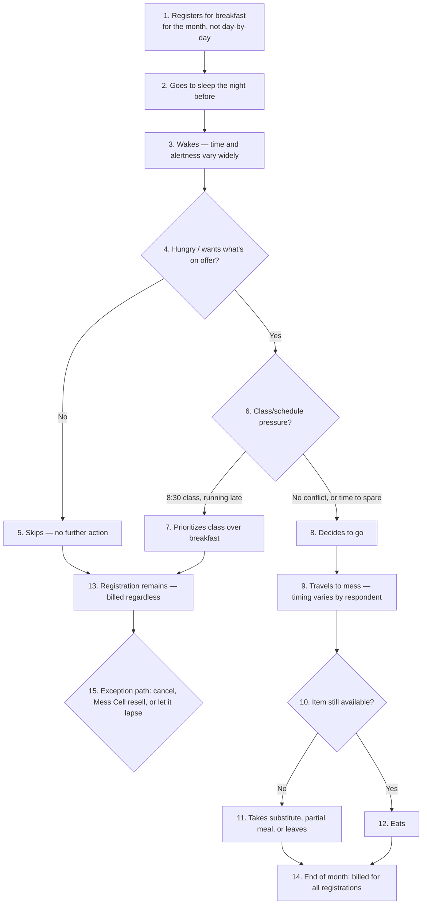
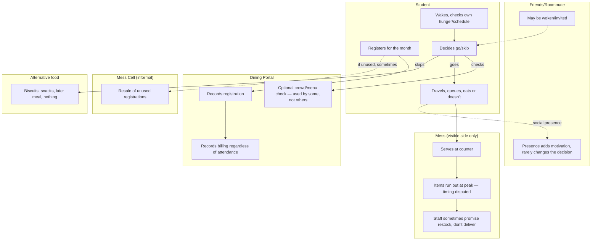

# Status

**Revised 2026-09-06** following five real student interviews (`research/primary-
research/interviews/2026-09-06_five-student-interviews-guide1.md`) — two daily eaters,
three skippers. This supersedes the earlier hypothesis-only draft of this document.
Split explicitly into **4A** (what six real respondents' accounts + existing evidence
support now) and **4B** (a completion plan for the mess/kitchen-side half of the
process, which remains entirely unobserved). Confidence throughout: ✅ confirmed by
direct respondent/document evidence · 🟡 plausible inference or a single respondent's
account, not yet cross-checked · ❓ unknown, named as a research target · ⛔ considered
and not supported. Respondent-level differences are preserved — a claim made by one
respondent is not generalized to "students" as a class.

# Evidence Audit

| Source | Represents | Timeframe | Reveals | Cannot establish | Confidence |
|---|---|---|---|---|---|
| `2026-09-03_student-self-account...md` (original respondent) | 1 habitual skipper, general system informant | Early Sept 2026 | Full system mechanics (registration, billing, QR, Mess Cell, governance), one person's skip reasons | Whether reasons generalize; anything about mess-side operations | ✅ for system facts, 🟡 for "typical" claims |
| Portal screenshots (`screenshots/analysis.md`) | The registration/billing platform itself | Sept 2026 snapshots | Real prices, capacities, registration counts, Skip-vs-Cancel distinction, rating feature, random allocation | Actual attendance (registration ≠ attendance), anything about kitchen/staff | ✅ for what's on-screen |
| `2026-09-06_five-student-interviews-guide1.md` (this round) | 2 daily eaters, 3 skippers — six real respondents total including the original | Current semester, retrospective | Real decision sequences, queue/crowding experience, item-specific run-outs, registration habits, Mess Cell use, timing preferences, self-estimated waste | Kitchen/vendor side entirely; whether these six represent the wider population | ✅ for what each respondent reports of their own experience, 🟡 for cross-respondent generalization |
| Teammate hypothesis framework (`research/primary-research/team-contributions/2026-09-05_teammate-constraints-edge-cases-verticals.md`) | Team reasoning, not a respondent | Sept 2026 | Structural hypotheses (Skip-Meal-vs-Mess-Cell dominant strategy, rush clustering, register-just-in-case) | Nothing directly — it is reasoning, not evidence | 🟡 throughout, by its own framing |
| `prathyusha_03-power-interest-leverage-map.md` + discovery file | Governance structure (secondhand + one directly-fetched source) | Various, through 2026-09-06 | Formal/informal power, precedent, the Student Parliament's Mess Secretary role | Kitchen/vendor operations; most decision-domain authority | ✅ for the Parliament role, 🟡/❓ elsewhere |

# System Visibility Map

| Step | Visibility |
|---|---|
| Student decides to register | ✅ visible — six respondents describe this directly |
| Portal records registration | ✅ visible — screenshots confirm the mechanism |
| Registration reaches kitchen | ❓ **invisible** — no respondent, student or otherwise, has ever seen this handoff; only the 4-day lead time (from Activity 3's governance research) is known, not the mechanism |
| Kitchen decides preparation quantity | ❓ **invisible** — entirely unknown; one respondent (daily eater 2) speculates a "30% actual attendance" statistic exists, but nobody has seen how that translates into a cooking quantity |
| Food gets cooked | ❓ **invisible** — no account of the kitchen process exists anywhere in this project |
| No-show occurs | 🟡 **partially visible** — students can describe their own no-shows; nobody has seen the mess-side record of one |
| Leftover quantity | ❓ **invisible** — no measurement, estimate, or account exists from the mess side; only the informal fact that serving/cleaning staff eat leftovers themselves (from the original respondent) |
| Billing happens | ✅ visible — confirmed mechanism (registration-based, monthly) |
| Feedback reaches decision-maker | ❓ **invisible** — Activity 3 already established this as the sharpest open question in the whole project; nothing in this round's interviews adds visibility here |

**The boundary is stark and consistent with Activity 3's findings:** everything from
the student's own decision through billing is visible; everything from "registration
reaches kitchen" onward is invisible. This is not filled with assumptions anywhere
below — Activity 4B exists specifically to close this gap later.

---

# ACTIVITY 4A — Current-State Process Trace (established now)

## 4A.1 Scope and evidence boundary

This trace covers the student-facing half of the breakfast process only — from the
decision to register through eating, skipping, or working around the system — as
described directly by six real respondents. It stops at the kitchen door, per the
visibility map above. Two timescales matter, kept separate: a **monthly registration
cycle** (corrected from an earlier weekly hypothesis — three of five new respondents
specifically say "for a month," not weekly, an even wider decoupling than first
assumed) and a **daily morning decision cycle** — six real respondents
converge on registering by the month (not day-by-day), which decouples these two
cycles more thoroughly than earlier drafts assumed.

## 4A.2 High-level process (Map 1)



## 4A.3 Student-side swimlane (Map 2)



## 4A.4 Decision points — supported by evidence only

| Decision | Who | When | Info available | Constraint | Options observed | Evidence |
|---|---|---|---|---|---|---|
| Register or not | Student | Monthly, in advance | Knows own general routine, not that morning's specifics | Kadamba scarcity (fills up fast, per skip-3) | Register for the month; register selectively | ✅ all 6 respondents register in advance, none day-by-day |
| Which mess | Student | At registration | Menu/cuisine reputation | Capacity, competition for popular messes | Kadamba (4 of 6 respondents), Bakul mentioned once | 🟡 small sample, consistent with Activity 2/3's cuisine-preference hypothesis |
| Go or skip, that morning | Student | On waking | Own hunger, alertness, schedule | 8:30 class + attendance policy (daily eater 2, explicit) | Go; skip; go later | ✅ this is the central real decision point, well evidenced across all 6 |
| Check app before deciding | Student | Before or instead of deciding | Crowd-check and menu-view features exist | Feature awareness/habit | Checked by 1 of 6 (skip-1, menu-driven); ignored by others | ✅ real split — most respondents don't use a feature that exists |
| Wait for/wake friends | Student | On waking | Own routine | Friend's own wake state | Wakes them, goes regardless if they don't respond (2 of 6); not a factor at all (3 of 6); positive-but-non-determining (1 of 6) | ✅ — see 4A.4a below, a genuine disconfirmation of an earlier hypothesis |
| Cancel a registration | Student | Days ahead, if planned | Knows the 5/month cap | Cap; must be planned in advance | Used by most respondents at least occasionally; not used by one respondent specifically due to forgetting | ✅ |
| Use Skip Meal | Student | Same-day or ahead | Knows it doesn't refund money | None functional | Never used by any of the 6 respondents who addressed it | ✅ strong — 0-for-6 real usage, consistent with the "dominated strategy" hypothesis |
| Resell/buy via Mess Cell | Student | When registration known to go unused | Awareness of the WhatsApp group | Informal, no guaranteed buyer | Used (bought and/or sold) by 4 of 6; passive observer only for 1; unused for breakfast specifically by another | ✅ widespread but uneven |
| Eat as walk-in | Student | Same-day, unregistered | Knows walk-in costs more | Price markup | Used for snacks not breakfast (1); used for breakfast (1); never (3) | ✅ |

### 4A.4a — A hypothesis this round's real data disconfirms

Earlier drafts (built from one respondent, two synthetic personas, and a teammate's
reasoning) treated **social company as a meaningful driver of attendance**. Six real
respondents now on record tell a more specific and consistently weaker story: **peer
presence is, at most, a motivational add-on, never the deciding factor**, across every
respondent who addressed it directly — including two who actively try to wake friends
and go regardless of the outcome, one who says friends provide "positive motivation"
but "if I have to go, I'll go" regardless, and three for whom it isn't a factor at all.
No respondent describes skipping *because* a friend didn't go, or attending *only
because* one did. This is treated as a genuine update, not a minor footnote — a
finding from Activity 2/3 that real data has now sharpened, not merely confirmed.

## 4A.5 Formal rules encountered

| Rule | Enforced by | Encountered when | Behavioural effect (evidenced) | Rationale known? |
|---|---|---|---|---|
| Registration required | Mess Office/portal | Monthly | All 6 respondents register in advance | ✅ ties billing to registration |
| Cancellation cap (5/meal-type/month) | Mess Office/portal | When planning ahead | Used by most respondents; one respondent explicitly forgets to use it | ✅ limits uncancelled no-shows |
| Skip Meal, no refund | Mess Office/portal | Same-day or ahead | Never used by any respondent addressing it — 0-for-6 | ✅ reduces kitchen prep, not billing |
| Walk-in markup | Mess Office/vendor | Same-day, unregistered | Used sparingly; two respondents avoid it for breakfast specifically | ✅ confirmed pricing incentive |
| Registered vs. random allocation | Portal | At registration | One respondent (skip-2) explicitly relies on **random allocation rather than active registration** — the first real, first-person confirmation of this mechanism actually being used, not just existing as a settings toggle | ✅ mechanism now confirmed in real use, not just in a screenshot |
| Mess closing at 9:30 | Mess | End of window | Four of six respondents explicitly ask for this to be extended | ❓ rationale for the specific cutoff unknown |

## 4A.6 Informal norms vs. workarounds — kept distinct

**Informal norms** (unwritten, widely shared expectations, not solving a specific
problem): registering for the whole month rather than day-by-day (✅, universal across
respondents, appears to be the path of least resistance rather than a deliberate
strategy for most); going early specifically to avoid queues (✅, skip-3's explicit
strategy); checking the app's menu before deciding to attend (🟡, one respondent only,
not clearly a norm vs. an individual habit).

**Workarounds** (adaptations specifically compensating for a gap in the formal system):
Mess Cell resale (✅, used by 4 of 6 in some form) — compensates for Skip Meal's lack of
refund; eating snacks/biscuits/a later meal (✅, multiple respondents) — compensates for
skipping without an official "get your money back" path; scarcity-driven early
registration for Kadamba specifically (✅, skip-3) — compensates for a popular mess
filling up, a workaround around capacity rather than around billing.

## 4A.7 Negotiation and escalation

Per the framework's explicit requirement, and consistent with Activity 3's findings:
**no respondent in this round describes a working escalation path.** When asked
directly whether they or anyone they know tried to get a mess rule or timing changed,
every one of the five new respondents said no. One (daily eater 1) notes the mess does
make *reactive, immediate* fixes to specific problems (a run-out, a technical error) —
but this is operational firefighting, not a rule-change mechanism, and is clearly
distinguished from what the question asked. The finding is rendered explicitly:

```
STUDENT → ? NO VISIBLE ESCALATION PATH FOR RULE/TIMING CHANGES
STUDENT → MESS (reactive, same-incident-only fixes) → confirmed, but distinct
```

This absence is itself a systems finding, not a data gap to apologize for — it is
identical in shape to Activity 3's central governance finding (feedback inputs exist,
outputs don't), now independently corroborated by five more respondents.

## 4A.8 Dependencies

Eating breakfast at the mess depends on: waking with enough time and alertness
(✅, the single most commonly cited constraint) **+** the desired item still being
available at time of arrival (✅, run-outs confirmed by at least 3 of 6 respondents,
directly or by reputation) **+** no conflicting class-attendance pressure (✅, explicit
for daily eater 2) **+** the mess still being within its serving window (✅, the
9:30 cutoff is the single most-requested change across respondents). One step
upstream, each of these in turn depends on processes this project cannot yet see: item
availability depends on a kitchen-side preparation-quantity decision (❓), and the
attendance-policy pressure depends on academic administration's own scheduling (✅
confirmed disconnected from mess governance, per Activity 3).

## 4A.9 Formal vs. informal divergence (Map 4)

| Where they diverge | Formal design | Actual behaviour |
|---|---|---|
| Registration cadence | Designed to be per-meal or flexible (portal supports day-by-day) | Universally monthly across 6 respondents — a de facto norm the system permits but didn't design toward |
| Skip Meal | Designed to reduce kitchen waste | Functionally dead — 0-for-6 real usage |
| Cancellation | Designed as the correct tool for planned non-attendance | Used inconsistently; at least one respondent doesn't use it due to simple forgetting, not a considered choice |
| Random allocation | A minor settings toggle in the formal design | For at least one real respondent, this **is** their actual registration mechanism, not a backup |
| Item availability at close | Designed to run until 9:30 | Staff make informal, unfulfilled promises to restock before close (daily eater 1) — a gap between stated and actual service behaviour |

## Key findings — 4A

1. The registration-attendance gap is not one mechanism but several, now evidenced
   distinctly: habitual monthly over-registration, scarcity-driven defensive
   registration (Kadamba specifically), random allocation, and simple forgetting —
   these are different behaviours with different fixes, previously blurred together.
2. Peer influence, previously treated as a meaningful lever, is disconfirmed as a
   decision-determining factor by six real respondents — it is at most a motivational
   add-on.
3. The escalation-path absence from Activity 3 is now independently corroborated at
   the student-experience level, not just the governance-structure level.
4. A genuinely new, real finding: **broken restock promises** — staff say an item
   will return before close and it doesn't (daily eater 1). This is a trust/service-
   quality finding with no prior documentation anywhere in this project.
5. Two respondents converge independently and specifically on a **~30% actual-
   attendance-vs-registration estimate** and a demand/supply mismatch narrative
   *even for the students who do show up* — the paradox is not only about wasted food
   from no-shows, it may also be about **under-provisioning for real attendees**,
   which is a different, and previously unstated, half of the same problem.

---

# ACTIVITY 4B — System-Side Process Completion Plan

## What remains invisible (unknown backend process map)

```
Student registers
  ↓
❓ Where is the registration stored, and who can see aggregate counts before service?
  ↓
❓ When does the mess/vendor actually receive expected numbers — the 4-day lead time
   (Activity 3) is known, but not the mechanism or format
  ↓
❓ Is a Skip Meal toggle actually subtracted from a preparation number, or ignored?
  ↓
❓ How is preparation quantity forecast — against registrations, a historical average,
   or something else? (Daily eater 2's "30%" claim is exactly the kind of number this
   would test, if real data existed)
  ↓
❓ When are ingredients purchased and cooking begun, relative to service start?
  ↓
❓ How are portions estimated per item (why do idli/puri/bhatura/fruit specifically run
   out, per daily eater 1 — is this a forecasting problem or a popularity-mismatch
   problem)?
  ↓
❓ What actually happens when staff "promise" a restock that doesn't arrive — is this
   a genuine intention that fails operationally, or a placating non-commitment?
  ↓
❓ What does QR scanning record, and is it ever reconciled against registration counts?
  ↓
❓ What happens to unclaimed food beyond "staff eat some of it" (already confirmed) —
   is any of it measured, discarded, or reused?
  ↓
❓ Does any of this waste/shortfall data reach the Mess Office, the Mess Committee, or
   anyone with authority to adjust future preparation?
```

Every arrow above is a real research question, not a filled-in assumption.

## Mess staff interview plan

Guide 2 (`research/methodology/prathyusha_interview-guide-phase1-halfday.md`) already
covers this ground; the questions below are the process-tracing-specific subset,
reframed around what 4A's real student data now makes urgent to ask.

| Role | What we need | Why this role | Priority questions | Validates |
|---|---|---|---|---|
| Kadamba serving/counter staff | Why idli/puri/bhatura/fruit specifically run out; what the restock promise actually means operationally | Directly named by daily eater 1 as the source of the broken-promise experience | "Walk me through what happens when an item runs out around 9:15-9:20 — what do you tell students, and what actually happens next?" / "Is there ever a real restock, or is 'we'll bring more' something said in the moment?" | The 4A.9 formal-vs-informal divergence finding |
| Kitchen/prep staff, any mess | How much is cooked relative to registrations; whether Skip Meal changes anything concretely | Only source that can resolve the "30%" claim and the forecast mechanism | "Could you walk me through what happens from the point you receive expected breakfast numbers until service begins?" / "If ten people mark Skip Meal today, does that change what gets cooked, and by when do you need to know?" | Unknown backend nodes 3-6 above |
| Cleaning/closing staff | What happens to food after 9:30 | Only source for the waste-measurement question | "What happens to food that's left when the counter closes?" | Unknown backend node 9 above |

## Governance interview (cross-referenced, not duplicated)

Already fully specified in Guide 3, sharpened by Activity 3's research to prioritize
the Student Parliament's Mess Secretary/Deputy Secretaries as the most reachable
target. Not repeated here — see that guide directly. The one addition this round's
data motivates: ask whichever governance contact is reached **whether the "~30%
attendance" figure two independent students cited is a real, known number or a
folk estimate** — this is now a concrete, checkable claim rather than an abstract
question about feedback mechanisms.

## Direct observation protocol

Not yet conducted (today's live window passed before this project began collecting
data, per earlier sessions). Protocol, ready to run:

| Window | What to record |
|---|---|
| 7:15-7:30 (before opening) | Setup state, any visible prep activity |
| 7:30-8:00 | Queue length, arrival rate, which items are on the counter |
| 8:00-8:30 | Same — this is skip-3's claimed peak |
| 8:30-9:00 | Same — transition window |
| 9:00-9:30 | Same — this is the daily eaters' claimed peak; specifically watch for the item run-out and any restock attempt |
| 9:15-9:30 (close) | Whether a promised restock materializes (directly tests daily eater 1's finding) |
| Post-close | What happens to visibly leftover food |

No personally identifying information to be recorded, per the framework's own
instruction — headcounts and item-availability observations only.

## Master data request (condensed)

| Category | Key fields | Answers | Privacy-safe form |
|---|---|---|---|
| Registration | Date, mess, veg/non-veg/Jain, capacity, registered count, cancellations, Skip Meal count, walk-ins | No-show rate, cancellation/Skip Meal usage rate | Aggregate counts only, no student IDs |
| Attendance | QR scans by mess/meal/timestamp | Whether the "~30%" claim is real, and the true peak window (resolves the 8-9 vs. 9-9:30 disagreement) | Aggregate, timestamped, anonymized |
| Preparation | Planned vs. actual plates, by item if possible, forecast method, planning cutoff | Whether idli/puri/bhatura run out due to under-forecasting or popularity mismatch | Aggregate |
| Waste | Unclaimed portions, disposal vs. staff consumption split | Whether "staff eat leftovers" absorbs most or little of the gap | Aggregate |
| Operational change log | Any registration-rule, pricing, or timing changes with dates | Precedent for Activity 3/5's timeline | Institutional record, no student data involved |

Full field-by-field version (matching the mega-prompt's A-J categories) is not
reproduced here to avoid duplicating Activity 3's already-detailed resource-control
discussion — the fields above are the ones this round's real interviews specifically
motivate.

## What cannot yet be concluded

- Whether idli/puri/bhatura/fruit run out because of under-forecasting, a genuine
  popularity mismatch, or both — cannot be resolved without kitchen-side data.
- Whether the "~30% attendance" figure is real or a shared student folk-belief —
  cannot be resolved without QR-scan/attendance data.
- Whether the true peak window is 8:00-9:00 or 9:00-9:30 — real respondents disagree,
  and only direct observation or attendance timestamps can settle it.
- Whether broken restock promises are a one-off or a systemic pattern — needs a
  direct staff account.
- Whether random allocation (confirmed real for one respondent) is common or rare
  among students who don't actively register — needs a larger sample or portal-side
  data.
