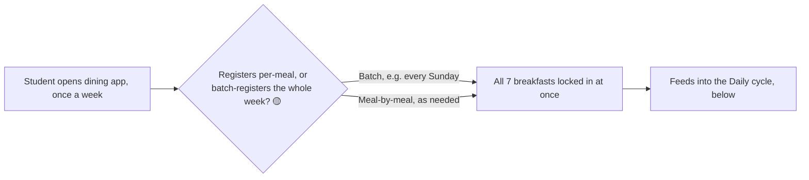
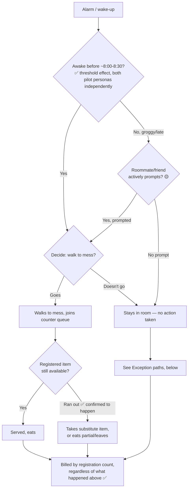
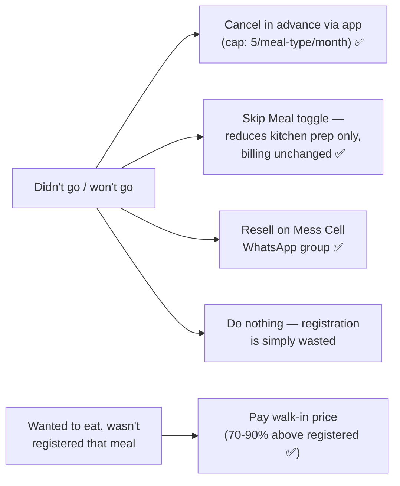

# Phase 1 · Activity 4 — Current-State Process Map / Process Trace (prathyusha draft)

**Status:** 🟡 BEST-EFFORT DRAFT, not yet validated. This is the one Phase 1 deliverable
the framework explicitly wants built from *"interviews and observations"* — and neither
has landed yet from a real person (today's Guide 1 interviews and tomorrow's Guide 2
staff interview are still pending). Everything below is assembled from (a) facts already
✅ confirmed in `01-system-context-brief.md`, and (b) the synthetic pilot's structural
hypotheses (`prathyusha_synthetic-pilot-interviews.md`) — treat the whole diagram as a
scaffold to correct, not a result to cite. Same confidence legend as the other
`prathyusha_0X-*.md` files.

---

## Why a process trace, not just a stakeholder map

The stakeholder map (#2) says *who's involved*. This is supposed to say *what actually
happens, step by step, including the workarounds* — per the framework's own phrasing,
"how the system actually operates rather than how it is supposed to operate." The
gap between those two is exactly where the Breakfast Paradox lives: the *designed*
process is register → attend → eat; the *actual* process, per every account gathered so
far (real and synthetic), has several parallel exit ramps around "attend."

## Two cycles, not one

Confirmed context brief facts describe billing/cancellation at the *monthly* level, but
the synthetic pilot surfaced a plausible *weekly* registration habit sitting on top of
the *daily* attendance decision — three different timescales that the framework's single
word "process" can hide if traced as only one loop.

### A) Weekly cycle — 🟡 hypothesis, unconfirmed by any real respondent yet

If the batch pattern is real and common, it mechanically decouples the registration
decision from the morning-of attendance decision — a student who registers Sunday for
Wednesday isn't "deciding to eat Wednesday," they're deciding once for the whole week,
which would explain a lot of the no-show volume without needing any single bad morning
to be anyone's fault. **This is the single highest-value thing to confirm in a real
interview today** (already added to Guide 1 §3).

### B) Daily cycle — 7:30-9:30 AM window

### C) Exception / workaround paths — branch off D6 (skip) or D3 (forgot to register)

---

## Formal vs. informal rules surfaced by this trace

| Step | Formal rule (as designed) | Informal reality (as it actually runs) |
|---|---|---|
| Registration | Per-meal opt-in via app | 🟡 Possibly batched weekly, decoupling the decision from any single morning |
| No-show | Billed regardless (✅) | A 5/month cancellation cap exists specifically *because* uncancelled no-shows are common enough to need a limit — the rule is a symptom of the pattern, not just a control on it |
| Kitchen over-prep | "Skip Meal" toggle exists to prevent it (✅) | Toggle doesn't touch billing — solves the kitchen's problem, not the student's; 🟡 both synthetic accounts said they forget to use it most mornings anyway (too early to be reliable) |
| Unused registration | No official resale/refund mechanism | Mess Cell WhatsApp group — fully informal, self-organized, price set peer-to-peer with no oversight (✅ exists, 🟡 scale/frequency unconfirmed) |
| Student feedback on rules | Mess Committee "takes student input" on menu (✅) | No confirmed negotiation or escalation mechanism exists in current data beyond an occasional feedback form — **this is a real gap in the trace**, not a modeling omission: nobody interviewed so far (real or synthetic) could describe what happens after they give feedback |

## Negotiation / escalation mechanisms — explicitly flagged as thin

The framework asks this deliverable to identify "negotiation and escalation
mechanisms." Current data has almost none to trace: Warden handles vendor/structural
changes, Mess Committee sets the menu "with student input," and that's the extent of any
confirmed channel. No respondent (real or synthetic) has described what a student
actually does if they disagree with a mess decision, beyond vague memories of a
petition or feedback form that nobody could confirm led anywhere. **This absence is
itself a process-trace finding** — worth carrying into Phase 2's Iceberg Structures
layer as a real gap, not just an unanswered question.

---

## What's confirmed vs. invented in this file, at a glance

- ✅ Fully confirmed by context brief: billing-by-registration, 5/month cancellation cap,
  Skip Meal exists and doesn't affect billing, Mess Cell exists, walk-in markup, items
  running out happens.
- 🟡 Hypothesized, needs a real interview: batch weekly registration, the
  "wake-before-8:30 threshold" effect, the roommate-prompt mechanism, Skip Meal being
  forgotten rather than actively rejected, Mess Cell's real transaction scale.
- ❌ Not yet traceable at all: mess-side process (kitchen prep timing, what staff
  actually do with unclaimed food) — entirely dependent on tomorrow's Guide 2 interview;
  this file only traces the student-facing half of the process.

## Still open — this deliverable moves from 🟡 to ✅ only after:

- [ ] Guide 1 (today) confirms or kills the batch-registration and roommate-prompt
      hypotheses
- [ ] Guide 2 (tomorrow) supplies the entire kitchen/counter-side half of the trace,
      currently missing altogether
- [ ] Any real account of what happens after a student gives mess feedback — the
      negotiation/escalation gap above
