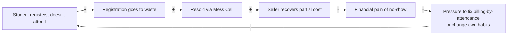
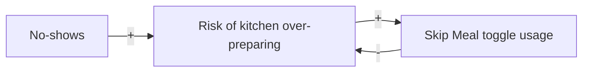

# Phase 1 · Activity 5 — System Timeline / Behaviour-Over-Time Map (prathyusha draft)

**Status:** DRAFT — first-pass skeleton, thin data flagged explicitly. The planned
direct observation (30-min buckets, 7:30-9:30 AM) could not happen today because the
window had already passed by the time this was scoped (2026-09-05 conversation). This
draft substitutes: (a) existing scattered screenshot snapshots, (b) qualitative
recurring-pattern evidence already confirmed in `01-system-context-brief.md`, and (c)
retrospective recall to be gathered via
`research/methodology/prathyusha_interview-guide-phase1-halfday.md` Guide 1, Q4.

Two timescales matter here, and they shouldn't be collapsed into one chart.

---

## A) Within-window pattern (7:30-9:30 AM, half-hour scale) — HYPOTHESIS, unconfirmed

🟡 Nothing below is measured. It's a plausible curve based on general dining/class-start
dynamics, written down specifically so it can be *overwritten*, not just annotated, once
Guide 1 Q4 comes back today.

| Window | Hypothesized crowd level | Reasoning (to be tested) |
|---|---|---|
| 7:30-8:00 | Moderate | Early-class students + habitual early risers |
| 8:00-8:30 | Peak | Closest to the 8:30 class start — highest queue pressure |
| 8:30-9:00 | Dip | Anyone with an 8:30 class has already gone or given up |
| 9:00-9:30 | Small second bump | Late risers with no early class, before close |

**This entire table gets replaced, not appended to,** once today's interviews answer:
*"which half-hour is most crowded/quietest, and what's left over at each?"*

---

## B) Across-time pattern (week scale) — real but sparse data points

| Date | Meal | Type | Detail | Source |
|---|---|---|---|---|
| 2026-09-03 | Breakfast | Individual instance | Respondent's own Kadamba (Veg) registration, charged ₹48, not attended | Screenshot |
| 2026-09-09 | Breakfast | Mess-wide capacity | Kadamba (Veg) 551/700 registered | Screenshot |
| 2026-09-09 | Breakfast | Mess-wide capacity | Bakul (Veg) 108/350 registered | Screenshot |
| 2026-09-09 | Breakfast | Mess-wide capacity | Bakul (Non-Veg) 37/350 registered | Screenshot |
| 2026-09-10 | Lunch | Mess-wide capacity | Kadamba 722/1200 registered | Screenshot |
| 2026-09-10 | Lunch | Mess-wide capacity | Bakul 116/700 registered | Screenshot |

🟡 Three scattered dates across two different meals is **not enough to plot a real trend
line** — resist drawing a smooth graph through these; it would fabricate false
precision that isn't there. What this table *does* support, consistently, on every date
sampled so far: a persistent Kadamba >> Bakul uptake gap, at both breakfast and lunch.
Extend this table with any further screenshots pulled, rather than replacing it.

---

## The actual recurring pattern / unintended consequence — the real finding here

This doesn't need a numeric chart to count as a "Behaviour-Over-Time" finding, and it's
already fully supported by existing data (context brief §4):

1. **Trigger (a structure):** billing is by registration, not attendance.
2. **Recurring pattern:** students register and don't show up, often enough that a
   5-cancellations-per-month cap exists — a cap that only makes sense if uncancelled
   no-shows are common. ✅
3. **The system's own partial fix, and its unintended consequence:** the "Skip Meal"
   toggle exists so kitchens stop over-preparing for known no-shows — but it doesn't
   touch billing, so it solves the kitchen's waste problem without touching the
   student's cost problem. ✅
4. **Emergent adaptation:** the Mess Cell WhatsApp resale market appeared, unofficially,
   as a workaround the system's designers didn't build for. ✅

This reinforcing-loop-shaped structure feeds directly into Phase 2 deliverable 7
(Causal Loop Diagram) — worth carrying forward as-is rather than re-deriving it later.

---

---

## Feedback loops & systems archetypes (added 2026-09-05 — this is what Activity 5's
"examine feedback loops and recurring patterns" / "identify unintended consequences"
methods are actually asking for, distinct from the numeric timeline above)

This section previews structure that becomes formal deliverables #7 (CLD) and #8
(Iceberg) in Phase 2 — included now because Activity 5 explicitly asks for it, and
because everything below is buildable from facts already ✅ confirmed, not from data
still waiting on interviews. Confidence-tagged as elsewhere.

### Quick Iceberg pass

- **Events:** the Sept 3 charged-not-attended instance; items running out near the end
  of service; Kadamba sitting near capacity while Bakul sits far under it.
- **Patterns:** registration consistently exceeds attendance (the cap exists *because*
  of this); Kadamba >> Bakul uptake on every date sampled, at both meals; both synthetic
  pilot personas independently reported a "companion presence" dependency and a
  same "~8:00-8:30 is busiest" guess.
- **Structures:** billing-by-registration; 5/month cancellation cap; Skip Meal
  (kitchen-only fix); the informal Mess Cell market; 🟡 possible batch-weekly
  registration; no confirmed escalation channel (new context-brief finding, §4).
- **Mental models (all 🟡, none directly confirmed yet):** *"I already paid for it, the
  money's gone either way"* (implied by billing-by-registration's lack of behavioral
  pressure); *"giving feedback doesn't really change anything"* (both synthetic personas
  said versions of this — worth testing for real, see Q3 below); *"Kadamba is just the
  trusted default"* (implied by the uptake gap, never directly asked).

### Two causal loops built from confirmed facts

**R1 — "Shifting the Burden" via Mess Cell** *(reinforcing — sustains the dysfunction
rather than growing it unboundedly)*

Textbook **Shifting the Burden**: the informal resale market is a symptomatic relief
valve that makes the underlying problem (billing doesn't track attendance) tolerable
enough that nobody — student, Mess Committee, or Warden — is ever forced to fix the
fundamental cause. The workaround's success is exactly what lets the root cause persist.

**B1 — Kitchen Waste Control** *(balancing, but only for half the problem — a Fix That
Fails)*

This loop genuinely balances — it's why the toggle exists — but it only closes the
kitchen-side variable. Billing (the student-side variable) has no corresponding
balancing loop at all, which is precisely why B1 reads as a **Fix That Fails**: it looks
like the no-show problem was addressed, which may *reduce* the perceived urgency of
fixing the billing model, even though the student's actual cost problem is untouched.

### Systems archetypes, mapped directly onto current data

- **Fixes that Fail** — Skip Meal (above): solves kitchen waste, leaves billing broken,
  possibly reduces pressure to fix the real issue.
- **Shifting the Burden** — Mess Cell resale (above): symptomatic relief substituting
  for structural reform.
- **Limits to Growth** — ✅ already happened once: Kadamba hit a capacity ceiling on
  non-veg demand, and Bakul was created as the workaround (context brief §3). Open
  question: has the limiting factor now *shifted* from kitchen capacity to student
  preference/trust, since Bakul has spare capacity but still isn't chosen?
- **Tragedy of the Commons** — 🟡 hypothesis: the shared counter/kitchen throughput
  during the 8:00-8:30 peak is a commons everyone draws on by timing their arrival
  right before class, degrading queue speed for everyone, with no individual student
  bearing the cost of their own contribution to it. Unconfirmed — needs a staff
  perspective (they'd see the actual congestion effect, students only see their own
  wait).
- **Overoptimization** — billing-by-registration-count optimizes for administrative
  simplicity and kitchen-planning predictability, at the direct expense of matching
  food produced to food eaten and cost to value received — a sub-goal (easy billing)
  working against the whole system's actual goal.
- **Ignoring stakeholders** — the Academic Office (holds the one lever most likely to
  help, zero engagement) and mess staff (day-to-day operational knowledge with no
  confirmed channel upward) — both already flagged in `prathyusha_03-*`, restated here
  under their proper archetype name.
- **Manipulating / gaming the system** — the Mess Cell market itself is a mild gaming
  behavior: extracting value from a system not designed for resale. 🟡 open and
  materially important question: is this mostly *accidental* no-shows recovered after
  the fact, or do some students *deliberately* register broadly intending to resell
  what they don't use? Those are different diagnoses — one is a design flaw producing
  waste, the other is a rational response to a mispriced system — and nothing gathered
  so far (real or synthetic) actually distinguishes them.

### A weak/broken balancing loop worth naming

**B2 — Capacity Redistribution (designed to work, doesn't appear to)**: the natural
balancing response to Kadamba nearing capacity should be organic redistribution to
Bakul/Palash. Observed data shows this isn't happening — Kadamba runs near 79% of
printed capacity while Bakul sits at 31%/11% (veg/non-veg) on the one date sampled.
Instead of the loop self-correcting, capacity was added administratively (Bakul was
built). Worth treating "why doesn't the organic loop work" — awareness, preference, or
the "trusted default" mental model above — as a real open question, not an assumption.

## What today's/tomorrow's interviews will directly fix in this file

- [ ] Guide 1, Q4 (today) → replace §A's hypothesis table with real recalled data
- [ ] Guide 2, Q5 (tomorrow, staff) → add real unclaimed-plate volume as a number, not
      an inference
- [ ] Any additional screenshots pulled → extend §B's table
