# Overview

Phase 1 established who is involved (Stakeholder Map), who holds power (Power-Interest/Leverage Map), what actually happens step by step (Process Trace), and how it repeats over time (System Timeline). This map holds those views side by side as one picture: actors, the process flow, the resources and constraints that shape it, the backstage systems that produce what a student sees, and the points where the system visibly strains — a bottleneck, a tension, or a feedback channel that carries input without a confirmed output.

This map is built from facts confirmed in Tasks 1-5, a Campus Facilities Services (CFS) Chair interview, a Kadamba kitchen equipment walkthrough, four photographed CDS dining-service posters (all 2026-09-13), and — new in this pass — a much wider systems boundary: the agricultural/logistics supply chain feeding each kitchen, the fact that Kadamba, Yuktahar, and Bakul/Palash are three structurally different kitchen-and-supply systems rather than one, institutional financial constraints on vendor contracts, waste management and its (missing) link back to policy, the campus Canine Council as a real informal waste-absorption channel, the academic timetable as a boundary condition with its own defensible logic rather than an obstacle to remove, faculty and early-shift-staff demand as an unmapped consumption stream, and a genuinely new headline finding: **the institution has already built, and already run, a working fix for the registration-attendance gap — it just isn't the standing default.** Every claim below carries its evidence status: **confirmed** (directly stated by a named source), **single-sourced**, **candidate** (a plausible, named mechanism not yet independently verified), or **assumed** (a systems-thinking inference the user explicitly authorized this session in place of requiring new interviews — used freely, but never presented as confirmed fact).

# Map Actors, Processes, Information, Resources and Constraints

**Actors:** Students (registrant, billed party, consumer) and, distinctly, non-student diners (interns — mandatory Food Card; faculty, staff and project staff — recommended Food Card, salary-linked billing instead of a prepaid balance); the parent department **CFS** (Campus Facilities Services) and, under it, **CDS** (Campus Dining Services) with its own internal structure: a CDS Chair (**Giri** — not yet interviewed directly), a CDS Committee (faculty, final decision authority), a CDS Student Council (proposes, first review), and one per-mess admin (also a CDS member) per dining hall; a CFS Head who handles low-intensity feedback directly, without committee escalation; outsourced caterers, procured via open tender; Academic administration (sets the class schedule, holds no formal role in mess governance); the informal Mess Cell resale market; three feedback channels (in-app rating, public email, Ping); and — new this pass — three groups not previously named anywhere in this project's stakeholder work: **faculty and early-shift service/security/ground staff as an unmapped demand stream on the same food pool** (assumed, see the new section below); **the campus Canine Council**, the real student body responsible for feeding and managing IIIT-H's community dogs (assumed mechanism, real body); and **vendors/dealers/suppliers** further upstream of the kitchen, previously treated as invisible inside a single "Vendors/Kitchen" box. **Open structural question, not resolved here:** whether "CDS," "CDS Committee," and "CDS Student Council" are the same bodies Phase 1 named "Mess Office," "Mess Committee," and "Student Parliament," or genuinely different or overlapping groups; and whether Phase 1's "Warden" (vendor management, structural change) is the same remit as CFS itself. Flagged as hypotheses, not asserted.

**Process flow:** registration (monthly, in advance, T-4 days) feeds billing (calculated from registration count, not attendance), locks, and is communicated to the outsourced caterer on that same four-day cadence — this governs **ingredient sourcing** specifically. A separate, later-stage decision — **kitchen prep-quantity** (how much of the sourced stock is actually cooked/portioned for a given service) — is now confirmed to incorporate same-week Skip Meal declarations (confirmed, 2026-09-13): a student's Skip Meal toggle *does* reach the kitchen and *does* adjust that day's prep forecast, distinct from the earlier, still-rigid T-4 sourcing lock. This two-stage model matters: the system has more real same-week correction capacity than a single "everything freezes at T-4" reading would suggest — it just operates one stage later than raw ingredient sourcing. A **weekly stock assessment**, driven by consumption patterns, sits between sourcing and preparation: high-turnout items (paneer, egg, chicken) are tracked at **>90%** turnout, general turnout runs **~70%**, and **breakfast turnout runs roughly 35-45%** (a tentative range — the CFS Chair has separately referenced a further tentative ~45% figure alongside the earlier 35-40% figure; treated as the same underlying phenomenon measured at different points, not a contradiction) — the project's central paradox, now a quantified, interview-confirmed range rather than an inference. The service window runs 7:30-9:30 AM, with a specific, named mechanism behind the crowd-and-cutoff bottleneck: **~80% of students arrive around 9:20 AM**, the mess **stops admitting new entrants at 9:30 AM**, items stay available for refill **until 10:00 AM**, and lights/fans go off after that. The outcome for any given registration is one of: eaten, run out, or no-show.

**Edge cases and exceptions in the process itself:** a student who never registers is **automatically allocated a vegetarian meal** at an assigned dining hall (not a no-show by default — a silent fallback); mess exemptions exist for internships (via IMS, offer letter attached), PhD students (no supporting document required), and long-term medical need (via Arogya plus a declaration of alternative dining arrangements) — **the ₹550/month CDS Infrastructure Fee still applies even to exempted students**, since it funds shared dining infrastructure, not individual meals; in exceptional medical cases, meals can be delivered to a hostel room on request; unregistered ("Spot") dining is deliberately **throttled near the end of the billing session** specifically to protect food availability for students who did register.

**Resources:** the registration and billing platform (CDS Portal — named as `dining.iiit.ac.in` on three of the four posters, but as `mess.iiit.ac.in` at the bottom of the Food Card User Guide poster specifically, a direct, physically-displayed inconsistency on CDS's own signage at Kadamba, not a project data-entry error — see Outstanding Data Collection; IIIT network/VPN only); the personal QR access credential (regenerable if compromised — the old code/Food Card is invalidated the moment a new one is issued); the Food Card system for non-student diners (cashless, QR-billed, issued at CFS in the Himalaya Administrative Block basement for a ₹100 fee, meals registered one day ahead for the discounted rate); four physically distinct dining halls and kitchens (table below); the four-day procurement lead time itself, a resource constraint shared equally by every actor rather than an asset any one of them controls; a fully-equipped on-site kitchen at Kadamba (roti line, a multi-item cooker that keeps veg/non-veg physically separated, a tilting curry/steaming machine, a knife sterilizer, vegetable/rice/lentil prep automation, cold and dry storage run by **one person** on FIFO/FEFO discipline — see the kitchen diagram below); the CDS Infrastructure Fee (₹550/month, all hostel residents) funding construction, kitchen equipment, and long-term infrastructure replacement.

**Constraints:** billing is registration-based, not attendance-based, **except during a confirmed shock-adaptive exception — see the new section below, this is the single most important addition to this document**; cancellation is capped at five per meal type per month (raised to ten during a past LPG/gas-shortage period, confirmed — see below), and both registration and cancellation require **four days' notice** in the standing model; the four-day lead time means no same-day signal can change what is *sourced* (though it can now change what is *prepped*, see above); mess hours and the academic class schedule are set independently, with no formal coordination mechanism between them, **and the 8:30 AM class start has a defensible institutional logic of its own — see below, this project does not treat it as a naive obstacle to remove**; pricing is a **confirmed three-tier structure** (registered-student rate < Food Card rate < unregistered "Spot" rate — see the pricing table below); Kadamba's institute policy target is a **1:3 seats-to-turnout ratio** (420 seats for a stated 1,200 turnout figure — see the capacity note below); the kitchen's entire dry+cold inventory is managed by **one person**, a confirmed single point of failure with no named backup.

**Dining halls (confirmed, from the CDS overview poster, 2026-09-13):**

| Dining Hall | Capacity | Cuisine | Dining Type | Kitchen |
|---|---|---|---|---|
| Kadamba | 1200 | South Indian | Mixed | On-site, automated |
| Bakul | 750 | North Indian | Mixed | Off-site (shared with Palash, temporary) |
| Palash | 450 | North Indian | Vegetarian | Off-site (under construction, temporary) |
| Yuktahar | 350 | Satvik & Jain | Vegetarian | On-site, manual/live |

**Correction to a Phase 1 hypothesis:** Bakul and Palash were previously described as "Bakul = converted warehouse, food partly cooked at Palash and shipped in." The confirmed picture is different: **Palash is currently under construction, with a temporary Palash facility standing in, not cooking on-site at all right now — food is procured from an outside vendor and served both at temporary Palash and at Bakul**, a transitional arrangement until the **Felicity Kitchen & Dining Facility** opens (expected **December 2026**). This is a system genuinely in transition, not a static structure — worth remembering when reading any diagram below as a snapshot, not a permanent architecture.

**Capacity ambiguity, flagged rather than silently resolved:** the poster lists Kadamba's "Capacity" as 1200, while the interview separately states "420 seats, 1,200 turnout, 1:3 ratio maintained." These are likely two different meanings of "capacity" (registration/allocation capacity vs. physical seats) rather than a contradiction, but this is inference, not confirmation — see Outstanding Data Collection. If 420 is the true seated capacity, that alone would produce queuing/wait-time friction during any high-demand service (a lunch-hour biryani rush is the concrete, user-raised example) independent of anything about breakfast itself — **assumed**.

**Meal charges (₹), confirmed three-tier structure, Kadamba/Bakul/Palash rates:**

| Item | Student | Card | Spot (unregistered) |
|---|---|---|---|
| Veg Breakfast | 48 | 55 | 81 |
| Double Egg Breakfast | 66 | 76 | 111 |
| Veg Lunch | 65 | 75 | 111 |
| Veg Dinner | 65 | 75 | 111 |
| Chicken Biryani Lunch | 155 | 178 | 263 |

*Yuktahar and the Faculty/Staff Lounge run partially different tiers — see `prathyusha_braindump_2.md` §11.4 for the full table. The Student/Card rate only applies if the meal was registered in the CDS Portal beforehand; an unregistered meal is charged at Spot rate even for a student or Food Card holder — the same registration-accuracy incentive named as a constraint above, made concrete.*

The diagram above is deliberately still a student-facing process view — the "Vendors / Kitchen" node is one box because that is the right level of detail for tracing what a student's registration turns into. It is not a black box because nothing more is known: the kitchen and supply side is now a real, multi-part system in its own right, confirmed directly rather than inferred from the four-day lead time alone.

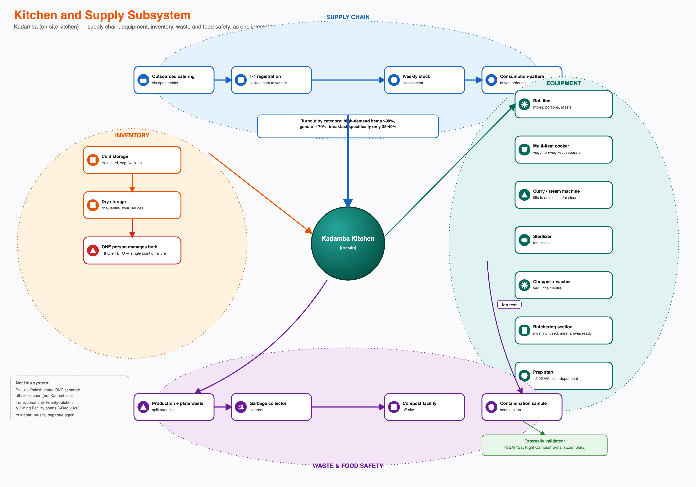

Four sub-systems interact around Kadamba's kitchen specifically, each with its own actors, timing, and failure modes: a **supply chain** (open-tender outsourced catering, the same T-4 registration lock feeding a weekly, consumption-pattern-driven stock assessment); **equipment** (a roti line, a multi-item cooker that keeps veg and non-veg physically separate, a curry/steaming machine redesigned to tilt-drain after the old manual-lift method was flagged as unsafe, a knife sterilizer, and a butchering section that mostly sits unused because meat now arrives pre-butchered); **inventory** (cold storage and dry storage, both run by one person on FIFO/FEFO discipline — a confirmed single point of failure with no named backup); and **waste and food safety** (expanded into its own full subsystem below). This diagram describes Kadamba specifically — Yuktahar, Bakul, and Palash each run structurally different versions of some or all of these four sub-systems, detailed next.

# Extend the System Boundary — Three Kitchens, Not One Supply Chain

The system map has, until this pass, implicitly treated "the mess" as a single supply chain with one set of failure modes. It is not. **Confirmed, this pass:** Kadamba runs a vertically-outsourced, automated kitchen — food is prepared off the live floor (roti line, multi-item cooker, curry/steam machine) and portioned into dabbas before service, not cooked in front of diners. **Confirmed, this pass:** Yuktahar cooks manually and live — rotis, jowar roti, and chapati are made fresh in front of students, and the menu runs separate Jain and pure-vegetarian lines that Kadamba's single automated line does not offer. **Confirmed, this pass:** Palash is currently under construction and is not cooking on-site at all; a temporary Palash facility serves food procured from an outside vendor, and that same externally-procured food is also served at Bakul. This means Kadamba, Yuktahar, and Bakul/Palash are, right now, **three distinct supply-and-preparation systems**, not one — a finding, a turnout number, or a waste figure from one does not describe the others, and treating "the mess" as a single system throughout this document (as earlier passes implicitly did) would misrepresent what's actually four dining halls running on three different operational models.

| Stage | Kadamba | Yuktahar | Palash (current, temporary) / Bakul |
|---|---|---|---|
| Sourcing | Outsourced catering via open tender, on-site automated kitchen | Separate on-site sourcing, manual/live cooking | Under construction (Palash) — no on-site cooking; both messes served from one outside vendor |
| Prep | Machine-driven, pre-plated into dabbas | Live/manual — rotis, jowar roti, chapati made fresh in front of diners; separate Jain + pure-veg lines | Prep happens entirely at the external vendor's kitchen, off IIIT-H premises (assumed mechanism, confirmed outcome) |
| Registration pool | Own | Own | Shared between Palash and Bakul during the construction period (assumed) — turnout/attendance figures for these two are likely not cleanly separable right now |
| Dish handling | Staff-run conveyor belt (centralised quality control, but a student can't choose their own plate — see the plate-trust finding below) | Students wash own plates (more variable, more individually controlled) | Students wash own plates (assumed, consistent with Bakul) |

**Raw-material quality and substitution (assumed mechanism, consistent with confirmed mess-group communication practice):** when a delivered ingredient batch is substandard or a vegetable doesn't arrive, the kitchen cannot simply halt service — the most plausible workflow is a same-day substitution from whatever's in storage (this is also the operational logic behind cross-meal ingredient reuse, e.g. leftover dal repurposed into the next meal's sambar base — resource-efficient, not evidence of poor quality), with a notification posted to the student-facing mess WhatsApp group naming the swap after the fact. This means the posted menu rotation — already flagged elsewhere in this document as carrying a demand-concentration risk (R3) — is routinely overridden by supply-side reality, which is itself a tension worth naming: a transparency policy competing with an unannounceable substitution reality.

**Institutional financial constraints (assumed, but tightly consistent with confirmed billing mechanics):** a fixed per-student mess-fee structure very likely caps what any vendor contract can pay for ingredients — accepting a lower-quality item or a narrower variety on the menu is a plausible, rational response to a hard budget ceiling, not negligence. A caterer running Kadamba's automated kitchen at scale has a different cost structure from Yuktahar's live-cooking labour model — lower per-meal labour cost, higher upfront equipment cost — meaning Kadamba's economics likely favour high, predictable volume, which decoupled billing conveniently guarantees regardless of actual attendance. This is a new, structurally important point: **RC1 (billing decoupled from attendance, established in Task 7) may not be an oversight only on the institution's governance side — it may also be quietly convenient for the vendor's revenue predictability**, a real stakeholder interest in leaving it exactly as it is that the project's earlier "unowned gap" framing did not consider. A specialist head chef for a high-demand item (biryani) being available only on certain days is consistent with either a cost constraint (specialist labour is expensive to staff daily) or a capacity constraint (equipment/prep-time can't scale to daily volume without displacing other menu items) — genuinely unconfirmed which, but either way it is a structural, not a negligent, explanation for why biryani specifically runs short.

**Why high-demand items run out before everyone registered is served (assumed, directly answers a question raised this session):** the most likely explanation is not a deliberate under-cook policy — it is a portioning methodology built on an *average* consumption assumption, applied uniformly across items with very different demand skew. Average-based portioning works fine for routine items; it fails exactly on the days it matters most, because a high-demand item (biryani) draws more than the average assumes precisely because it's high-demand. This is Loop S1 below.

# Waste, Environment and the Canine Subsystem

**Confirmed:** Kadamba's waste is split into production-waste and plate-waste streams, sent to an external compost facility, with contamination samples sent to a lab under the FSSAI "Eat Right Campus" 5-star Exemplary programme. **Confirmed, this pass (user-stated directly):** no waste *volume* figure exists anywhere in this project, and there is no formal policy connecting waste back to procurement or registration decisions — the categorical tracking above is a disposal and food-safety mechanism, not a demand-planning feedback channel.

**Why this matters systemically:** composting is a disposal solution, not a feedback solution. It successfully removes waste as a health/regulatory problem while doing nothing to make waste smaller, and a well-functioning disposal channel can actively suppress the pressure that would otherwise force a demand-planning fix — the institution never has to look at a visible, uncomposted pile of food to know something is wrong, because the pile is quietly and competently removed every day. **This is the same Shifting-the-Burden shape already identified for R1 (registration/resale), operating on the supply side instead of the demand side** — see Loop R6 below.

**The Canine Council subsystem (assumed mechanism, built on a real, well-known campus body):** IIIT-H has a real student body responsible for feeding and managing the campus's community dogs. Non-veg scraps and bones from Kadamba's kitchen (which does cook non-veg, keeping it physically separate per the equipment walkthrough) are a plausible informal disposal outlet — directly, via staff setting scraps aside, or indirectly, via waste awaiting compost pickup being accessible to dogs beforehand. This is not evidenced by any interview, but treating it as absent would be the less realistic assumption for a residential Indian campus with a managed stray-dog population. Plausible second-order effects, all assumed: a larger, better-fed dog population congregating specifically around mess exit/waste-collection points; health effects on the dogs themselves from an unbalanced human-food diet; and — genuinely novel to this project — dogs congregating near mess entrances in the early morning could make some students, particularly those uneasy around dogs, less inclined to walk to the mess at exactly the hour breakfast is served, a candidate contributor to breakfast-*specific* (not lunch/dinner-specific) avoidance that nothing in the prior evidence base considers. Speculative, and would need direct observation to confirm — but a legitimate systems hypothesis, not idle colour.

**Physical infrastructure by mess, concrete:** Bakul is independently described (this session) as untidy, with insects/spiders near food — a facilities-quality signal that has nothing to do with registration, billing, or academic timing and everything to do with why a student might specifically avoid this mess regardless of what's on the menu; combined with its current externally-procured food (less kitchen control), Bakul is structurally the mess most exposed to a compounded quality problem right now. Kadamba's staff-run conveyor-belt dishwashing centralises cleaning quality control but means a student cannot choose their own plate, and — since the same physical plates rotate across breakfast/lunch/dinner — some students report a **plate-trust issue that is about perceived hygiene, not measured hygiene**: Kadamba independently holds a strong external FSSAI rating, yet still loses some demand to a subjective trust deficit. Yuktahar's live cooking plausibly reads as fresher/higher-trust to some students than Kadamba's pre-plated model, but self-washing shifts cleaning-quality variance onto individual diligence, cutting the other way.

**Environmental and animal-welfare framing, named honestly rather than omitted:** organic waste decomposition produces methane and odour even when composted reasonably well; a food system generating a large, uncounted daily surplus has a real, currently unmeasured environmental cost this project's frame has not previously acknowledged. Animal welfare (dog health/population effects) is a genuine, if minor, unintended consequence of an otherwise purely human-facing registration/billing/procurement problem — illustrating how far a structural cause's effects radiate once the system boundary is drawn wider than "students and the mess."

# Trace the Service Delivery Timeline (Frontstage, Backstage and Support Processes)

The same system, cut a third way: not by actor or by category, but by what a student can and cannot see, laid out across the actual timeline of one registration-to-plate cycle. This is a service blueprint — physical evidence, frontstage student actions, the line of visibility, backstage mess/vendor actions, and the support processes underneath, mapped against five time stages from monthly registration through the morning's service window to the feedback channels that follow it.

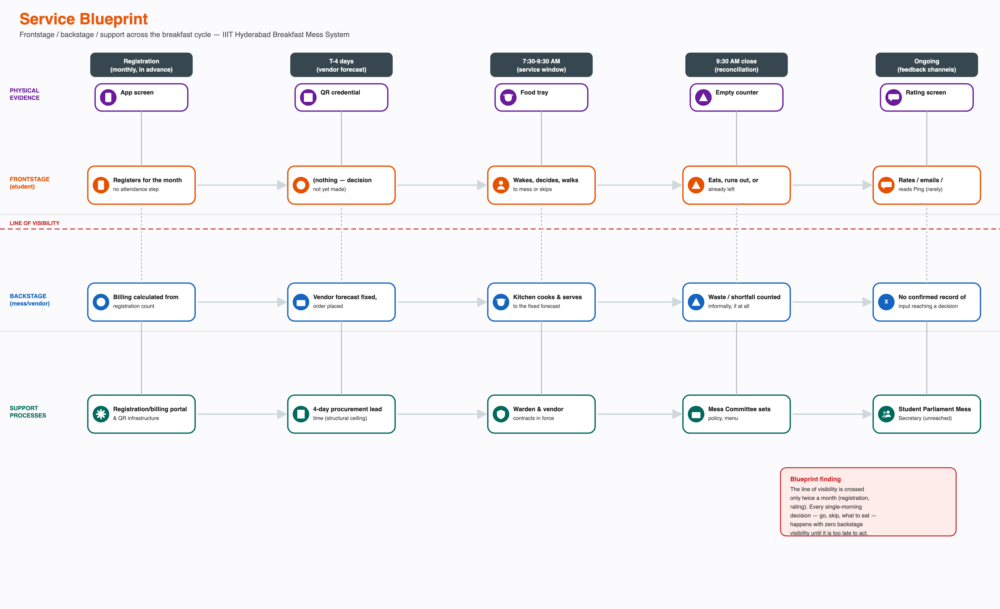

The line of visibility is crossed only twice in the entire monthly cycle: once at registration, once (rarely) at rating. Every decision that actually determines the outcome — whether to go, what to eat, whether to wait for a friend — happens entirely within the frontstage lane, with nothing crossing back from backstage to inform it in real time. The T-4 sourcing lock and registration-based billing, named separately elsewhere in this document, are the specific structural reason the blueprint has no real-time crossings — though same-week Skip Meal data crossing into prep-quantity (confirmed this pass) is a genuine, if partial, exception to "nothing crosses back," worth noting on any future redraw of this blueprint.

# Identify Conflicts and Dependencies

**Dependencies:** students depend on vendors for food itself; vendors do not depend on any individual student. The outsourced caterer depends on CDS for a forecast fixed four days ahead for sourcing (though not for same-week prep-quantity, per the two-stage model above); CDS depends on students to register accurately, but nothing in the standing billing structure requires that accuracy. This is the one dependency in the system where the party with less to lose controls an input the other party cannot substitute. Kadamba's entire kitchen inventory depends on **one person's** availability to maintain FIFO/FEFO discipline; no backup was named. The whole system's food-safety assurance depends on a lab-testing process that only activates *after* contamination is already suspected, not as a continuous check. **New this pass, assumed:** the system may also depend on unregistered faculty and early-shift-staff consumption staying small and stable — if either group eats at Kadamba in any volume, they are a second, currently invisible demand stream competing for the same prepared-quantity pool, uncounted in either the T-4 sourcing number or the same-week prep forecast.

**Conflicts:** billing certainty (needed by CDS and vendors to forecast) against attendance uncertainty (a real feature of student life, not a defect); flexibility (students and the Mess Cell market want more of it) against workload (CDS's confirmed motive for its one earlier policy change, which reduced flexibility); the 8:30 AM class start against the 7:30-9:30 AM breakfast window — **now understood as a conflict between two systems each optimizing their own defensible objective, not a design flaw on either side, see the new section below**; menu predictability against menu-driven no-shows (see B3/R3); an unconfirmed cost-passthrough risk (fixed-price vs. ingredient-cost-volatile catering contract); and, new this pass: **procurement certainty against demand-matching accuracy at the institutional level** — the shock-adaptive precedent below shows the institution can run an attendance-based model, but only accepts the resulting demand unpredictability as a rare exception, not a standing trade-off, because the vendor's lead-time contract cannot absorb it as a daily condition.

# Represent Formal and Informal Structures

**Formal structure, confirmed directly 2026-09-13 (CFS Chair interview):** CDS sits under CFS (Campus Facilities Services). Inside CDS: a CDS Chair (**Giri**, not yet interviewed), a CDS Committee (faculty, final decision authority), a CDS Student Council (drafts proposals, first review), and one per-mess admin per dining hall. Feedback is triaged by intensity: **low-intensity** feedback is handled directly by the **CFS Head**; **high-intensity** feedback escalates through the CDS Student Council to the CDS Committee.

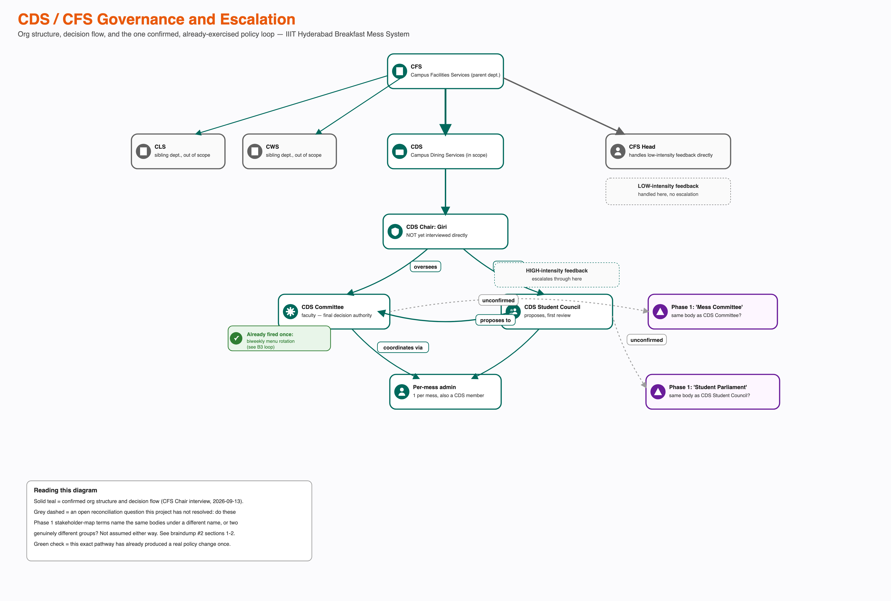

**This diagram deliberately does not merge the two vocabularies.** Whether "CDS Committee" is the same body Phase 1 called "Mess Committee," and whether "CDS Student Council" is the same body as (or a mess-facing subgroup of) the "Student Parliament," is an open question, flagged visually rather than assumed either way.

**Confirmed, already-exercised precedent:** a standing complaint (a single fixed menu for the semester) went through CDS Student Council → CDS Committee and came out as a **biweekly menu rotation**. This is the first fully confirmed, closed feedback loop in the whole project — see loop B3 below.

**Informal structure:** the Mess Cell WhatsApp resale market; Ping, the student publication; at least one unofficial registration-management tool operating outside the official portal.

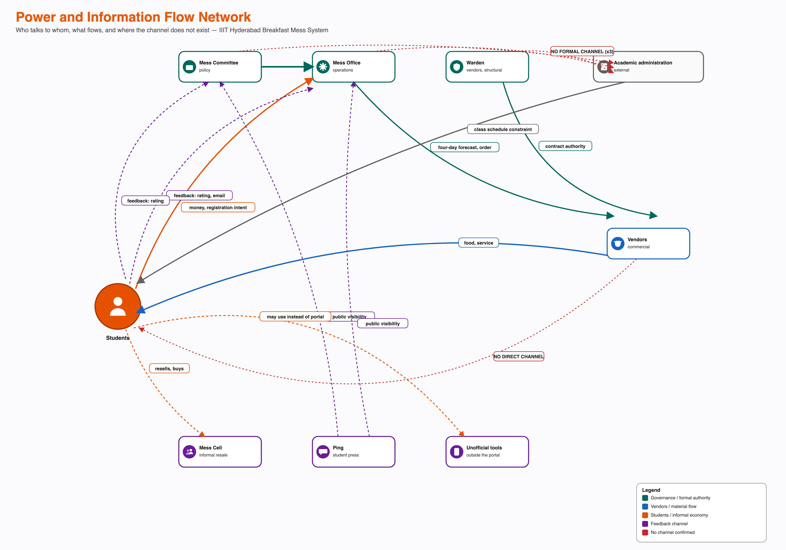

The formal and informal structures do not meet cleanly at one point. Academic administration has no formal or informal relationship to any of the three governance actors — a confirmed absence, not a gap in this research. The Mess Cell market operates entirely outside the formal registration and billing system.

# The Academic Timetable as a Boundary Condition, and Other Invisible Demand Streams

This project has, until now, treated the 8:30 AM class start as an external fact without asking why it exists. **Assumed, grounded in how Indian technical-institute timetabling actually works, not from a direct interview:** the 8:30 AM slot is very unlikely to be arbitrary, and three plausible institutional objectives explain it without needing a "students should just eat faster" story — **cognitive-freshness sequencing** (core theory/lecture courses front-loaded into the morning band, labs and electives pushed to afternoon, a conventional day shape across Indian engineering/CS institutes); **faculty-side scheduling economy** (an early lecture block lets a faculty member teach once and keep the rest of the day for research/admin/a second campus — the timetable may be solving for faculty utilization, with student breakfast an unmodeled externality of that optimization, not its target); and **facility/room contention** (shared lecture halls across programs may only fit every required contact hour into a 5-day week with an early anchor slot, especially if evening classes are avoided for hostel/safety/extracurricular reasons). **This document deliberately does not recommend moving the class time.** Doing so would treat the academic system as if it exists to serve mess convenience, when it is very likely solving a harder, higher-stakes constraint of its own. The correct systems move is to treat the academic timetable as a **fixed external boundary condition** the mess system should design around, not a lever to pull.

**Faculty access — an unmapped demand-uncertainty source (assumed, flagged as a real gap):** there is no evidence anywhere in this project's research that faculty breakfast access at Kadamba has ever been defined, let alone registered. If informal or ad hoc faculty access exists at student prices or via a separate billing arrangement not counted in the T-4 sourcing number, this is a second, previously unmodeled demand stream sitting on top of the registration-attendance gap already documented for students, competing for the same prepared-quantity pool without appearing in either stage's input data. **Recommended validation question for a future interview round:** "Do faculty or staff routinely eat breakfast at Kadamba, and if so, is that consumption reflected in what's ordered or prepared?"

**Other early-shift staff (assumed, high plausibility):** ground, security, and housekeeping staff frequently start shifts at 6:30-7:00 AM, often commuting from outside campus without easy access to home-cooked breakfast beforehand. If such staff have any mess access — a defined allocation or an informal arrangement — this is a plausible, unmeasured legitimate demand source, structurally similar to but distinct from the already-confirmed fact that mess staff eat leftovers: leftovers absorb already-prepared surplus, while early-shift staff eating *during* service would compete with students for the same freshly-prepared stock, a different and more consequential dynamic if it happens. Worth naming explicitly: staff who enable the whole campus to function before 7 AM may have the least visibility in any of this project's stakeholder maps to date.

**Student-club/Mess-Cell perspective, tied to Task 3's power analysis:** the Mess Cell WhatsApp group is a genuine, self-organized coordination mechanism — proof students can organize collectively around mess issues, with a real historical precedent (an "organized student email effort" achieving a change, per earlier project research). But this collective capacity is currently spent entirely on individual-level workaround coordination (reselling slots), not on advocating for the registration-policy gap itself — the student-side mirror of the Shifting-the-Burden pattern already identified for R1: a well-functioning individual coping mechanism may be quietly absorbing the exact pressure that could otherwise push collective action toward a structural fix. Genuinely unconfirmed: whether the Mess Cell has ever formally raised the registration/billing model with the Mess Committee or CDS/CFS — not assumed either way.

# The Shock-Adaptive Precedent — When the System Already Solved This

This is the single most important addition to the system map this pass. **Confirmed, direct user statement this session:** during a period of LPG/gas shortage in India, the mess reduced to serving only one item for the same cost. Separately, and more consequentially: **during holidays and long weekends (e.g. Felicity fest, when a large share of students leave campus), the mess has made registration non-compulsory** — students could simply walk in and scan a QR, or register one to two days ahead at any mess, with no auto-billing penalty for non-use. During the same gas-shortage period, the cancellation cap was also **raised from five to ten per month** as a workload/cost-relief measure.

**What this proves:** the institution already possesses, and has already successfully operated, a completely different demand-matching model — attendance-tracked, walk-in-based billing — that solves the exact registration-attendance gap this whole project is diagnosing. This reframes Task 7's root cause from "the institution has never solved this" to **"the institution has solved this before, under exactly the kind of demand uncertainty breakfast has every single day, and chooses not to run it as the default."** That is a sharper, more actionable diagnosis than "nobody owns this," and it does not contradict Task 7's fragmented-decision-rights finding — it sharpens it: the fix is not unknown, it exists, has precedent, and works, but the institution is not currently willing to trade away vendor-side procurement certainty to run it as a standing policy.

**Why it isn't the standing default (assumed, but structurally coherent):** a walk-in/QR-at-point-of-service model, generalized to every day, would remove the T-4 vendor lock's lead-time guarantee entirely. The institution likely accepts a known, quantified attendance gap under the compulsory model (forecastable in aggregate) in exchange for procurement certainty, rather than accept fully unpredictable day-of demand under an always-on walk-in model, which the vendor's lead-time contract cannot support. The exception works specifically *because* it's rare and short — the vendor can absorb one-off uncertainty it couldn't absorb as a daily standing condition.

# Highlight Bottlenecks, Tensions and Feedback Loops

**Bottlenecks:**

- The T-4 sourcing lock. Nothing lets a same-day signal change what is *sourced* — though same-week Skip Meal data can now change what is *prepped* (confirmed this pass, see below).
- The 9:30 AM close, precisely mechanised: ~80% of students arrive around 9:20 AM, entry stops at 9:30 AM, refill continues to 10:00 AM.
- The complete absence of a formal channel between Academic administration and the CDS/CFS governance structure — though this document now treats the academic side of that gap as defensible on its own terms, not merely a failure to coordinate.
- **One person** manages Kadamba's entire cold- and dry-storage inventory. No backup was named.
- **New this pass:** no waste-volume measurement exists anywhere, so waste cannot function as a forcing signal for policy change even in principle — it isn't that the signal is ignored, it's that the signal was never built.

**Tensions:** registering broadly against system-level waste; the Mess Cell resale market outcompeting Skip Meal for the identical situation; menu predictability against menu-driven no-shows (B3/R3); and, new this pass, **procurement certainty against demand-matching accuracy** (the shock-adaptive precedent proves both are achievable, just not simultaneously as standing policy) and **a one-size-fits-all registration model against legitimate cultural/dietary variation** (see the social/cultural section below — not all of the attendance gap is dysfunction).

**Feedback loops (student-input channels):** three real channels — in-app rating, public email, and Ping coverage — carry student input into the system, historically with no confirmed instance of producing a policy change on their own. The escalation pathway (Student Council → Committee) is a separate, and in one case (B3) successful, channel.

## The Full Loop Set

Twelve loops (plus one open chain) are now tracked across this project, each drawn with polarity (+ moves with its cause, − moves against it); a loop is reinforcing (R) with an even number of − links, balancing (B) with an odd number.

| Loop | Type | Status | Domain |
|---|---|---|---|
| R1 | Reinforcing | **Confirmed** | Registration/resale |
| B1 | Balancing | **Confirmed mechanism, near-zero uptake** | Skip Meal |
| B2 | Balancing | Broken at one link | Capacity redistribution |
| R2 | Reinforcing | Candidate (1st link confirmed) | Energy crash |
| B3 | Balancing | **Confirmed, closed** | Menu rotation governance |
| R3 | Reinforcing | Candidate (1st link confirmed) | Menu transparency backfire |
| B4 | Balancing | **Confirmed, condition-triggered** | Shock-adaptive registration relaxation |
| R4 | Reinforcing | Plausible, mostly evidenced | Known-but-unowned governance gap |
| B5 | Balancing (silo) / reinforcing (system) | Plausible | Silo success masking systemic gap |
| R5 | Reinforcing | Assumed | Vendor margin/quality trade-off |
| R6 | Reinforcing | Assumed | Waste invisibility |
| B6 | Balancing (reinforcing effect) | Assumed | Facilities-friction underinvestment |
| R7 | Reinforcing | Candidate, closing link assumed | Late-night eating / breakfast skipping |
| (chain) | — | Open, not closed | Canine concentration near mess entrances |

**R1 — registering broadly, recovering via resale (reinforcing, confirmed).**

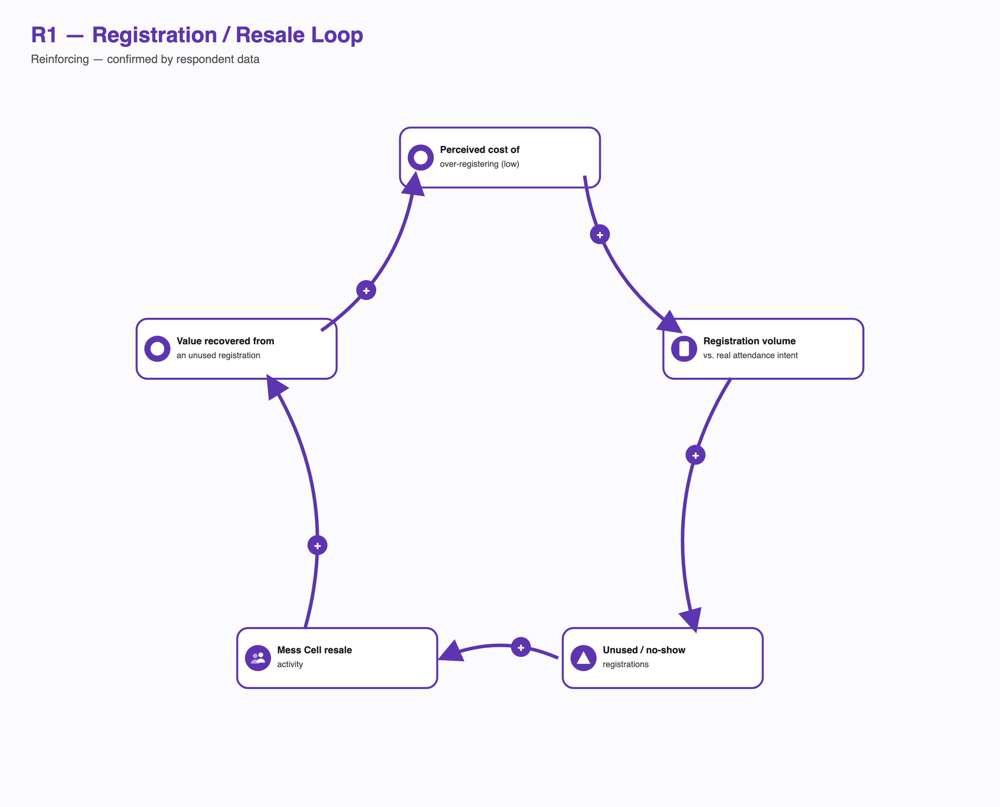

A textbook Shifting the Burden structure: the Mess Cell resale market is a symptomatic solution that relieves the financial pain of a no-show without anyone needing to fix the fundamental problem (billing decoupled from attendance). Because the symptomatic fix works well enough, the pressure that would otherwise force the fundamental fix never builds.

**B1 — Skip Meal (balancing, mechanism now confirmed functioning — updated this session).**

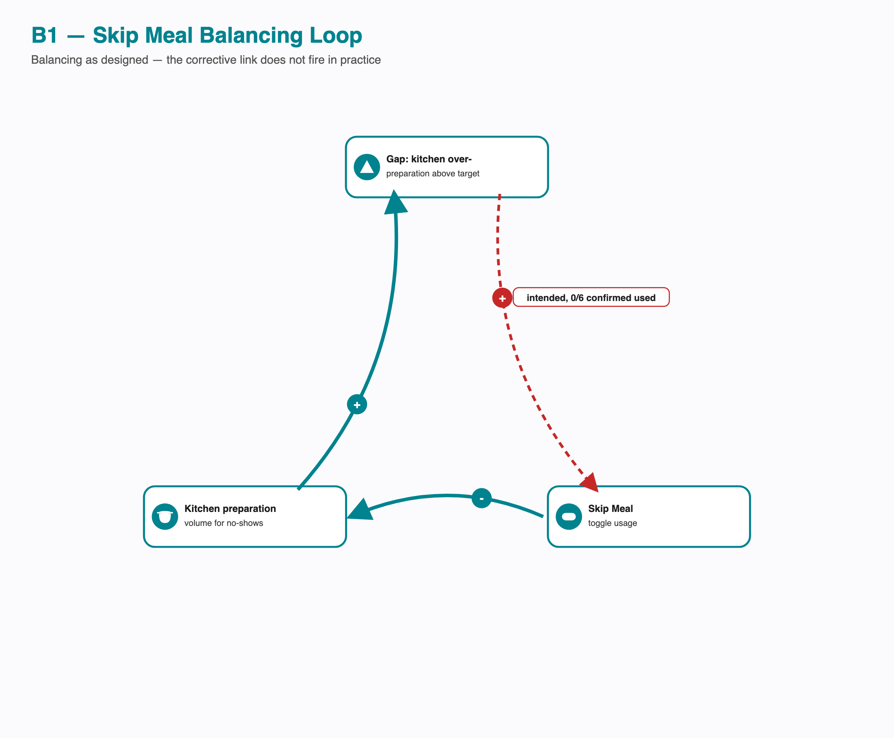

Confirmed this session: Skip Meal declarations do reach the kitchen and are used to adjust same-week prep-quantity. This is a real, if partial, correction, distinct from the T-4 sourcing lock. What remains genuinely broken is uptake at the first link — historically, close to zero of the students interviewed for this project report ever using it. The precise finding is sharper than "the loop is broken": **the mechanism works when used; almost nobody uses it.** That reframes the open question from "does this mechanism function" (yes) to "why is uptake so low" — worth a dedicated validation question.

**B2 — capacity redistribution toward under-used messes (balancing, intended — broken at one link).**

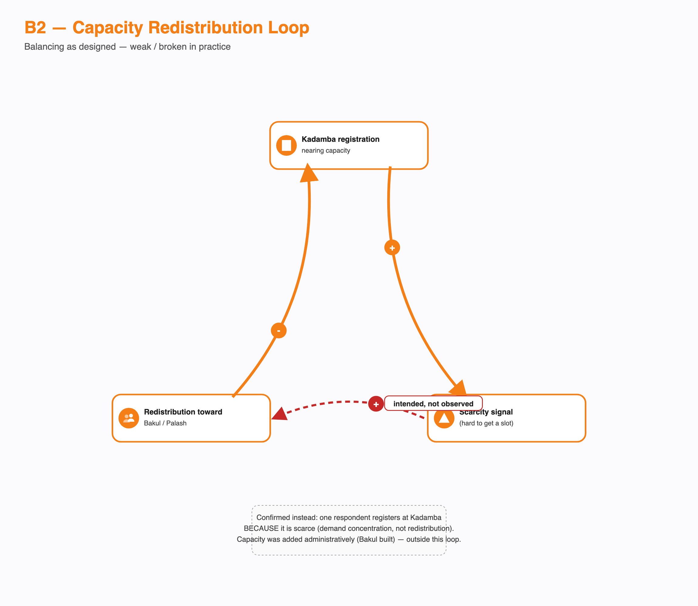

The confirmed evidence shows the opposite micro-behaviour at the one link that matters — a respondent registers at Kadamba *because* it is scarce, not in spite of it. Demand concentrates instead of redistributing.

**R2 — the original "energy crash" cycle (candidate, reinforcing — not yet confirmed beyond its first link).**

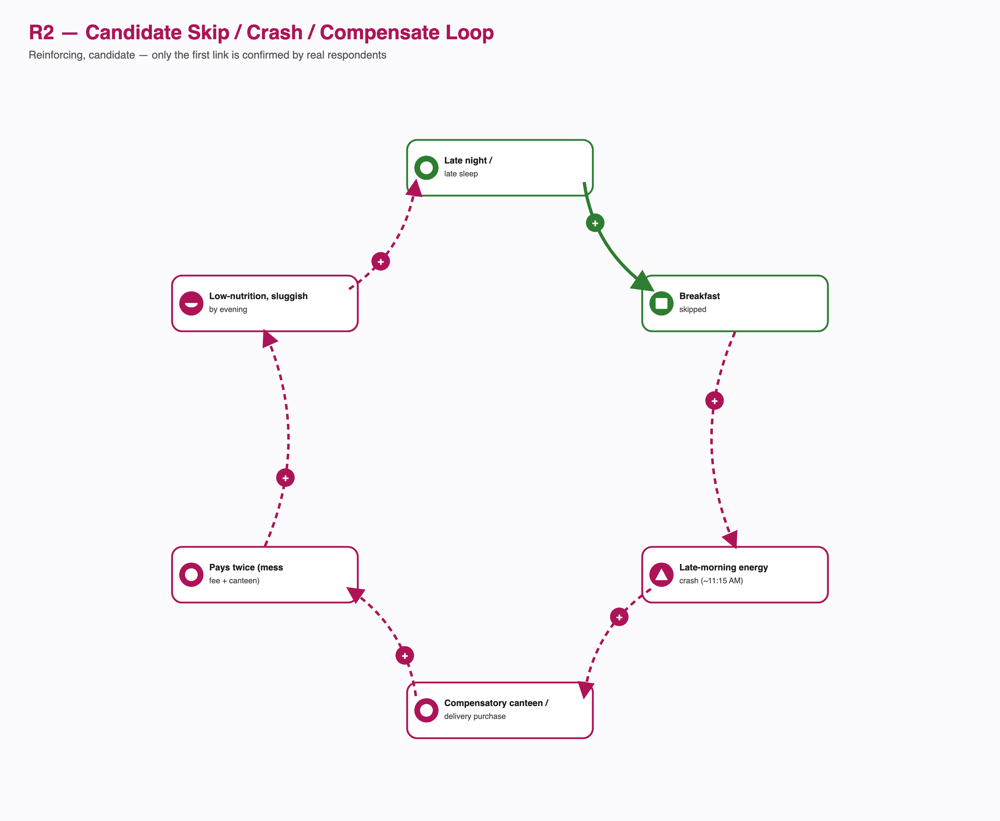

Only the first link (late nights drive skipping) is directly confirmed across real respondents.

**B3 — the menu-rotation governance response (balancing, CONFIRMED, closed).**

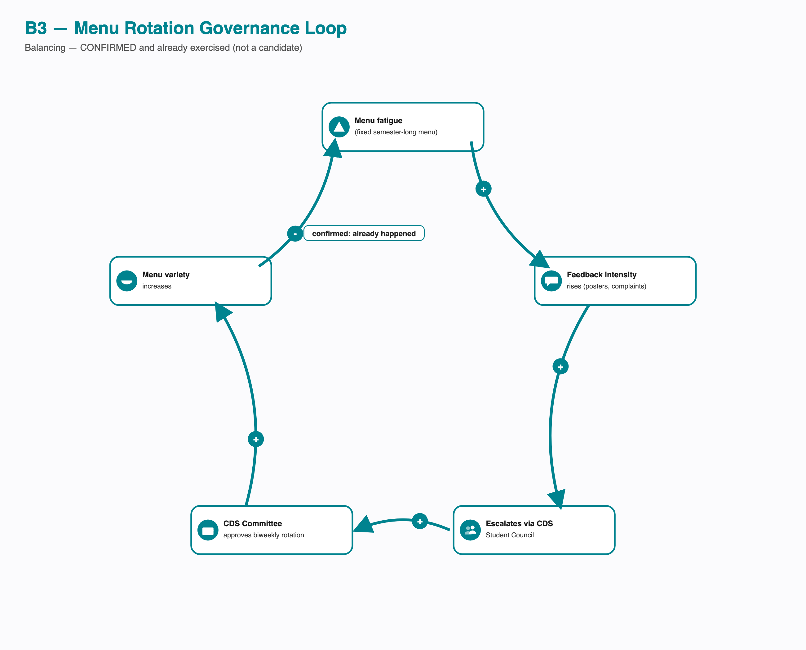

Every link confirmed directly by the CFS Chair interview. The strongest evidence in the project that the governance structure *can* respond to a named pain point.

**R3 — the same fix's self-identified second-order risk (candidate, reinforcing — only the first link confirmed).**

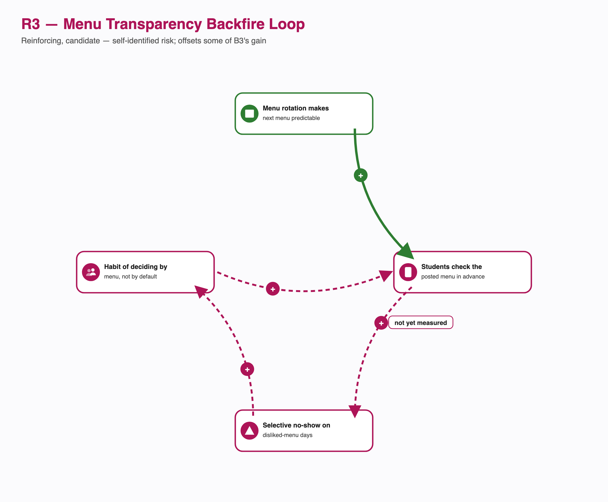

The CFS Chair raised this risk unprompted. Not yet confirmed by any student-side data.

**B4 — Shock-Adaptive Registration Relaxation (balancing, condition-triggered, confirmed this session — the headline new loop).**

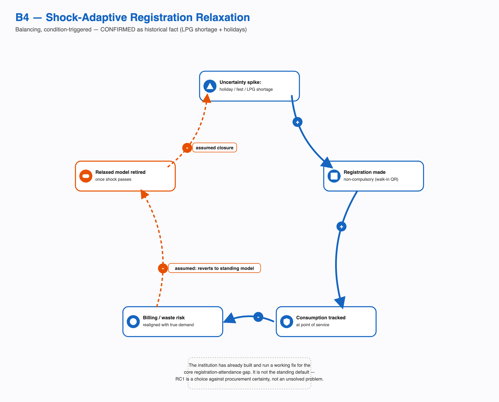

VARIABLES: expected-attendance uncertainty spike (holiday/fest/shortage) → registration made non-compulsory (walk-in QR, no auto-billing penalty for non-use) → actual consumption tracked at point of service instead of pre-committed → billing/waste risk realigned with true demand → reduced institutional appetite to keep the compulsory model suspended once the acute uncertainty period ends (closes back toward the normal, standing state). CONFIDENCE: confirmed mechanism (the trigger and the relaxation itself); assumed closure interpretation (why the system reverts rather than keeping the relaxed model — see the shock-adaptive section above for the procurement-certainty trade-off explanation). This loop is the strongest single finding of this entire expansion pass — see the Key Findings section.

**R4 — Known-But-Unowned-Gap Reinforcement (reinforcing, now mostly evidenced rather than purely candidate).**

VARIABLES: CFS Chair's awareness of the turnout gap → no assigned decision-right to act on it, because registration/billing policy ownership is fragmented (Task 7, RC3) → the gap never reaches any specific actor's agenda → it becomes normalized as "how the system has always worked" → reduced perceived urgency to raise it again next cycle (closing back to awareness, at progressively lower urgency). CONFIDENCE: the first two links are essentially confirmed (awareness exists; fragmentation confirmed; no-action confirmed this session — see the Systemic Problem Analysis, "Outstanding Data Collection"); the "normalization reduces future urgency" closing link is a reasonable systems-thinking inference, not directly evidenced.

**B5 — Silo Success Masking Systemic Gap (a local balancing success producing a system-level reinforcing effect — counter-intuitive, worth naming explicitly).**

VARIABLES: menu complaints → Mess Committee acts (B3, confirmed closed) → menu satisfaction improves → CDS/CFS's overall "is the mess system working?" assessment improves, because the most visibly complained-about channel shows continuous improvement → less institutional appetite to audit other parts of the system, like registration/billing, that generate no comparable complaint volume. MECHANISM: ghost registration doesn't cost the registering student any visible, in-the-moment discomfort the way a bad meal does — it costs them money quietly, on a monthly bill — so it never generates the complaint volume that would trigger the same escalation pathway that fixed the menu. Silence isn't the same as absence of a problem, but it can look that way from the governance side. CONFIDENCE: plausible, a systems-thinking inference that plausibly underlies R4.

**R5 — Vendor Margin/Quality Trade-off (reinforcing, assumed, the supply-side mirror of R1).**

VARIABLES: fixed or thin per-meal contract margin → vendor substitutes cheaper ingredients or reduces variety to protect margin → student-perceived quality drops → attendance drops further for that meal category → registered-but-unused meals rise, but billing is unaffected because it's registration-based → the vendor's revenue is protected regardless of falling attendance (closing back to no market pressure to fix quality, since decoupled billing insulates vendor revenue from attendance too, not just the student's incentive to attend accurately). This is a genuinely new structural insight: decoupled billing has a symmetrical effect on both sides of the transaction.

**R6 — Waste Invisibility (reinforcing, assumed, the supply-side mirror of R1 in the waste domain).**

VARIABLES: ghost registration → food waste generated → waste efficiently composted/disposed → no visible cost or regulatory pressure accrues → no forcing function to revisit registration/billing policy → ghost registration continues unchallenged (closing back to more waste next cycle). Structurally identical in shape to R1: resale absorbs the demand-side symptom, composting absorbs the supply-side symptom, and between them almost nothing about ghost registration ever becomes visible enough to force a structural conversation.

**B6 — Facilities-Friction Underinvestment (reinforcing at the system level despite being framed as a balancing mechanism at the investment-decision level; assumed).**

VARIABLES: poor physical conditions at a given mess (untidiness, insects, weak water pressure) → students who have a choice avoid that mess or meal → lower recorded attendance there → attendance data used to justify facilities investment priority → the low-attendance mess receives lower investment priority → conditions stay poor or worsen (closing back to more avoidance). Explains why a facilities gap, once open, tends to persist: the very attendance data that should trigger a facilities fix is degraded by the facilities problem itself.

**R7 — Late-Night Eating / Breakfast Skipping (candidate reinforcing loop, closing link assumed).**

VARIABLES: late-night academic workload → late-night eating or outside ordering → suppressed morning hunger → skipped breakfast → [candidate closing link: lower daytime energy → more reliance on late-night catch-up work]. The first three links are consistent with existing evidence (late sleep and social-pull-to-lunch are already self-reported skip reasons); the closing link is a standard physiological/behavioural inference, not campus-specific evidence. **Exam-period breakfast-skipping is a separate, distinct pattern** — a rational, bounded, temporary trade-off (skip to gain study time), better modeled as a seasonal amplitude modifier on the existing gap than as part of this loop.

**Open chain — Canine Concentration (not a closed loop, held as a chain pending validation).** Food waste availability near a mess → dogs congregate there → congregation sustained by continued scrap access → some students routing around that entrance/path at low-light early-morning hours → marginally lower early-morning foot traffic near that mess specifically. Whether this closes back into more waste is unclear — held as an open chain, not asserted as a loop.

# Social, Cultural and Health Dimensions

**Menu philosophy as an independent causal candidate (assumed):** breakfast menus that skew nutrient-first (dals, boiled/steamed items, sprouts, plain poha/upma rotations) over taste-first optimize for a different objective than the one that drives voluntary attendance at a meal nobody is forced to eat. This is a genuinely new causal candidate, distinct from billing-decoupling: it says the *content* of breakfast, not just the incentive structure around it, depresses attendance — and independently explains part of why breakfast turnout sits so far below lunch/dinner turnout even under identical registration rules, since lunch/dinner more often carry higher-indulgence items (biryani, non-veg curries). Both explanations can be true simultaneously.

**Health/immunity framing (careful, non-causal):** a Hand-Foot-Mouth Disease (HFMD) outbreak reportedly spread across both hostels recently; cause unconfirmed. This document does **not** claim skipped breakfast caused that outbreak — HFMD is contact/fecal-oral-spread, not primarily a nutrition-linked disease, and asserting a direct link would be scientifically indefensible. What is worth naming honestly: this system combines a chronic, irregular-nutrition condition (the breakfast gap) with unusually dense shared common-space contact (mess halls, washrooms, playgrounds, study rooms) — a structural vulnerability that makes an outbreak, once introduced by any cause, more consequential. Frame this as a **systemic risk-amplifier**, never as a cause.

**Mental-model inventory (assumed unless otherwise noted):**

| Factor | Direction | Status |
|---|---|---|
| "Early bird"/morning-discipline identity (joggers, disciplined eaters) | Toward attendance | Assumed |
| "Breakfast is the most important meal" belief | Toward | Assumed |
| "I'm already healthy, I don't need it" belief | Away | Assumed, plausible mirror of the confirmed intermittent-fasting finding |
| Intermittent fasting / two-meals-a-day as deliberate choice | Away, but an informed choice, not a failure | Confirmed (one respondent) |
| Thinness-reinforcement belief (skipping as a path to staying thin) | Away | Assumed — a sensitive but real behavioural-health pattern; named factually as a wellbeing risk factor, not normalized as just another demand-side data point |
| Social anxiety around visibly eating egg/non-veg in a veg-leaning shared space | Away from mess attendance specifically | Assumed, structurally coherent — a visible, shared dining hall is exactly where dietary-identity self-consciousness would suppress attendance more than the underlying dietary choice itself |
| General shyness/social-avoidance of a crowded communal space | Away | Assumed |
| Cultural/regional norm of not eating a formal breakfast | Away, and explicitly not a system failure | See below |

**Cultural reframing, stated plainly:** breakfast as a mandatory first meal is itself a specific cultural convention, not a universal default. IIIT-H draws students from across India's regional, linguistic, religious, and family-culture diversity; for some, skipping or minimizing breakfast in favour of a brunch-style combined meal is not a deviation — it is their norm from home. Dietary-practice diversity (Jain, vegetarian, non-vegetarian, Iftar-period observance) means "the" breakfast experience is not one experience — Yuktahar's Jain/pure-veg lines exist precisely because a single menu cannot serve this diversity. **A materially meaningful share of "low breakfast turnout" is legitimate cultural and individual variation, not a fixable inefficiency.** This does not shrink the structural findings already established in Task 7 (billing decoupling and fragmented decision rights are still real and still explain a meaningful share of the gap) — it means any future intervention's expected impact should never be framed as "close the gap to near-zero."

**Cross-mess perception effects:** Bakul's untidiness is a direct, visceral deterrent independent of registration mechanics; Kadamba's plate-reuse trust issue shows a system can be objectively compliant (strong FSSAI rating) while still losing demand to a subjective trust deficit; the VC canteen functions as an unofficial pressure-release valve during recognized quality dips (e.g. Iftar period), structurally similar in role to the Mess Cell resale channel — it absorbs dissatisfaction that would otherwise have to surface as a complaint or a policy problem, quietly protecting the formal system from having to respond.

# Key Findings

1. **The institution has already built and run a working fix for the core paradox — it just isn't the standing default.** The shock-adaptive precedent (loop B4: non-compulsory, walk-in, attendance-tracked billing during holidays and the LPG shortage) proves attendance-based billing is operationally achievable at IIIT-H. The standing model's decoupled billing (Task 7's RC1) is therefore a *choice under a specific trade-off* (procurement lead-time certainty vs. demand-matching accuracy), not a technical impossibility or a simple oversight. This is the single most important reframing this pass produces.
2. Kadamba, Yuktahar, and Bakul/Palash are three structurally different kitchen-and-supply systems, not one — automated/outsourced, manual/live, and temporarily external-vendor-sourced respectively. Any finding about turnout, waste, or quality needs to specify which system it describes.
3. Decoupled billing (RC1) plausibly protects vendor revenue predictability as much as it reflects institutional inattention — a real, previously unconsidered stakeholder interest in leaving the standing model exactly as it is (loop R5).
4. Waste management and the informal resale market are the *same archetype* twice: both are well-functioning symptomatic fixes (R1, R6) that quietly remove the visible cost that would otherwise force a demand-planning or billing fix. Neither is measured at the volume/scale level, so neither can function as a forcing signal even in principle.
5. Skip Meal is not simply "broken" — its mechanism now confirmed to function (adjusting same-week prep-quantity), but uptake among students is reported at near-zero. The precise problem is adoption, not design.
6. The academic timetable (8:30 AM classes) has a defensible institutional logic of its own (faculty scheduling economy, room contention, cognitive-freshness sequencing) and should be treated as a fixed boundary condition to design around, not a lever to recommend changing — a materially different posture than earlier framings of "the schedule clash."
7. At least two invisible demand streams — faculty breakfast access and early-shift staff consumption — may be competing for the same prepared-quantity pool without appearing in any registration or forecasting number, on top of the already-documented student registration-attendance gap.
8. A meaningful share of "low breakfast turnout" is legitimate cultural, religious, or individual variation (regional norms, intermittent fasting, dietary practice diversity), not dysfunction — no future intervention should be framed as closing the gap to near-zero.
9. Breakfast's menu philosophy (nutrient-first over taste-first) is an independent causal candidate for low turnout, separate from and additive to the billing-incentive explanation — both can be, and likely are, simultaneously true.
10. The system's effects extend well beyond students and the mess: waste generates a real if unmeasured environmental footprint, plausibly feeds a campus dog population via the Canine Council with its own animal-welfare and (candidate) foot-traffic effects, and a chronic irregular-nutrition condition combined with dense shared common spaces is a structural risk-amplifier for events like the recently reported HFMD outbreak — named as a plausible systemic vulnerability, never as an established cause.
11. Of fourteen traced loops/chains, only two (R1, B3) were previously confirmed and closed; this pass adds one more fully confirmed, condition-triggered loop (B4, the shock-adaptive precedent) and substantially reframes a fourth (B1, now confirmed-but-low-uptake rather than simply broken) — the system is considerably more responsive, in more places, than earlier passes found, but that responsiveness is concentrated in governance-side and exceptional-condition mechanisms, not in the standing day-to-day registration/billing model.

# Outstanding Data Collection

**Narrowed further this pass, direct from the user (2026-09-13):** the CFS Chair's awareness of the turnout gap (a further tentative ~45% figure, alongside 35-40%) has been confirmed to have never reached a registration or billing policy discussion — this was previously the single highest-priority open question and is now resolved (see the Systemic Problem Analysis). Skip Meal's mechanism has also been confirmed functioning for same-week prep-quantity adjustment.

**Still pending institutional approval:** a mess-committee/vendor-side interview and a direct interview with **Giri**, the CDS Chair.

**New, this pass, in priority order:**

- Why Skip Meal uptake is reported near-zero despite the mechanism now being confirmed to work — this is now the sharpest open question about B1, replacing the earlier "does it even function" question.
- Whether faculty and early-shift staff have any defined or informal mess access, and whether that consumption is reflected in sourcing or prep-quantity forecasting.
- Whether the Canine Council's scrap-feeding mechanism is real at Kadamba specifically, and whether dog congregation near mess entrances measurably affects early-morning foot traffic — both currently assumed, neither observed directly.
- Whether the standing (non-shock) model could adopt any part of the shock-adaptive precedent (e.g. a smaller cancellation-cap increase, or a partial walk-in option) without fully sacrificing vendor lead-time certainty — a genuine open design question, not answered here since this document stops at diagnosis.
- Direct confirmation of Kadamba's "420 seats vs. 1,200 capacity" figures.
- Whether the open-tender catering contract is fixed-price or cost-passthrough.
- Which CDS Portal domain is actually live (`dining.iiit.ac.in` vs. `mess.iiit.ac.in`).
- A single added interview question for R3 (menu visibility → attendance decision) and R2/R7 (what a respondent does in the hours after skipping breakfast, and whether late-night eating patterns are self-reported as a factor) — answerable with the existing respondents, no new interview round needed.
- Direct observation of a live breakfast service window is still not done.
