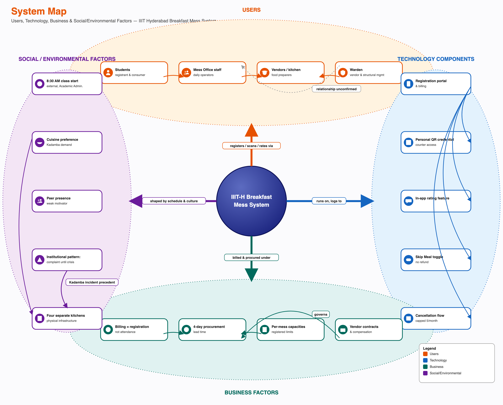

# Overview

Phase 1 established who is involved (Stakeholder Map), who holds power (Power-Interest/Leverage Map), what actually happens step by step (Process Trace), and how it repeats over time (System Timeline). This map holds those views side by side as one picture: actors, the process flow, the resources and constraints that shape it, the backstage systems that produce what a student sees, and the points where the system visibly strains — a bottleneck, a tension, or a feedback channel that carries input without a confirmed output.

This map is built from facts confirmed in Tasks 1-5 plus one new primary source folded in directly: a Campus Facilities Services (CFS) Chair interview, a Kadamba kitchen equipment walkthrough, and four photographed CDS dining-service posters (all 2026-09-13). That source is the project's first real governance- and kitchen-side account — until now, everything behind the student-facing portal was a confirmed four-day lead time and nothing else. It replaces several placeholder "pending institutional interview" statements with real structure, real numbers, and — for the first time in this project — one fully closed, already-exercised feedback loop, not just a candidate one. Every claim below is marked by its actual evidence status (confirmed / single-sourced / candidate); nothing from the new source is asserted more strongly than the source itself supports.

# Map Actors, Processes, Information, Resources and Constraints

**Actors:** Students (registrant, billed party, consumer) and, distinctly, non-student diners (interns — mandatory Food Card; faculty, staff and project staff — recommended Food Card, salary-linked billing instead of a prepaid balance); the parent department **CFS** (Campus Facilities Services) and, under it, **CDS** (Campus Dining Services — the operations department this project's earlier "Mess Office" language was almost certainly approximating, though the exact correspondence is itself unconfirmed, see below) with its own internal structure: a CDS Chair (**Giri** — not yet interviewed directly), a CDS Committee (faculty, final decision authority), a CDS Student Council (proposes, first review), and one per-mess admin (also a CDS member) per dining hall; a CFS Head who handles low-intensity feedback directly, without committee escalation; outsourced caterers, procured via open tender (kitchens were institute-run before; catering is now outsourced); Academic administration (sets the class schedule, holds no formal role in mess governance); the informal Mess Cell resale market; three feedback channels (in-app rating, public email, Ping). **Open structural question, not resolved here:** whether "CDS," "CDS Committee," and "CDS Student Council" are the same bodies Phase 1 named "Mess Office," "Mess Committee," and "Student Parliament" under different names, or genuinely different or overlapping groups — see the governance diagram below and Outstanding Data Collection. A third, not-yet-asked version of the same question: Phase 1's "Warden" was named as owning vendor management and structural change — the same remit "Campus **Facilities** Services" (CFS) describes for itself here, and CFS's Infrastructure Fee explicitly funds "dining hall construction and renovation, kitchen infrastructure... long-term replacement of infrastructure." That is a real structural overlap, not proof of identity — flagged as a hypothesis worth a direct question, not asserted.

**Process flow:** registration (monthly, in advance, T-4 days) feeds billing (calculated from registration count, not attendance), locks, and is communicated to the outsourced caterer on that same four-day cadence. A **weekly stock assessment**, driven by consumption patterns, sits between registration and preparation: high-turnout items (paneer, egg, chicken) are tracked at **>90%** turnout, general turnout runs **~70%**, and **breakfast turnout is only 35-40%** — the project's central paradox, now a quantified, interview-confirmed number rather than an inference. The service window runs 7:30-9:30 AM, with a specific, named mechanism behind the crowd-and-cutoff bottleneck: **~80% of students arrive around 9:20 AM**, the mess **stops admitting new entrants at 9:30 AM**, items stay available for refill **until 10:00 AM**, and lights/fans go off after that. The outcome for any given registration is one of: eaten, run out, or no-show.

**Edge cases and exceptions in the process itself:** a student who never registers is **automatically allocated a vegetarian meal** at an assigned dining hall (not a no-show by default — a silent fallback); mess exemptions exist for internships (via IMS, offer letter attached), PhD students (no supporting document required), and long-term medical need (via Arogya plus a declaration of alternative dining arrangements) — **the ₹550/month CDS Infrastructure Fee still applies even to exempted students**, since it funds shared dining infrastructure, not individual meals; in exceptional medical cases, meals can be delivered to a hostel room on request; unregistered ("Spot") dining is deliberately **throttled near the end of the billing session** specifically to protect food availability for students who did register.

**Resources:** the registration and billing platform (CDS Portal, `dining.iiit.ac.in`, IIIT network/VPN only); the personal QR access credential (regenerable if compromised — the old code/Food Card is invalidated the moment a new one is issued); the Food Card system for non-student diners (cashless, QR-billed, issued at CFS in the Himalaya Administrative Block basement for a ₹100 fee, meals registered one day ahead for the discounted rate); four physically distinct dining halls and kitchens (table below); the four-day procurement lead time itself, a resource constraint shared equally by every actor rather than an asset any one of them controls; a fully-equipped on-site kitchen at Kadamba (roti line, a multi-item cooker that keeps veg/non-veg physically separated, a tilting curry/steaming machine, a knife sterilizer, vegetable/rice/lentil prep automation, cold and dry storage run by **one person** on FIFO/FEFO discipline — see the kitchen diagram below); the CDS Infrastructure Fee (₹550/month, all hostel residents) funding construction, kitchen equipment, and long-term infrastructure replacement.

**Constraints:** billing is registration-based, not attendance-based; cancellation is capped at five per meal type per month, and both registration and cancellation require **four days' notice**; the four-day lead time means no same-day signal — a cancellation, a Skip Meal toggle, a sudden rush — can change what is actually cooked; mess hours and the academic class schedule are set independently, with no formal coordination mechanism between them; pricing is a **confirmed three-tier structure** (registered-student rate < Food Card rate < unregistered "Spot" rate — see the pricing table below), a real financial incentive for accurate registration that only holds if the breakfast-specific 35-40% turnout gap doesn't undermine it; Kadamba's institute policy target is a **1:3 seats-to-turnout ratio** (420 seats for a stated 1,200 turnout figure — see the capacity note below); the kitchen's entire dry+cold inventory is managed by **one person**, a confirmed single point of failure with no named backup.

**Dining halls (confirmed, from the CDS overview poster, 2026-09-13):**

| Dining Hall | Capacity | Cuisine | Dining Type | Kitchen |
|---|---|---|---|---|
| Kadamba | 1200 | South Indian | Mixed | On-site |
| Bakul | 750 | North Indian | Mixed | Off-site |
| Palash | 450 | North Indian | Vegetarian | Off-site |
| Yuktahar | 350 | Satvik & Jain | Vegetarian | On-site |

**Correction to a Phase 1 hypothesis:** Bakul and Palash were previously described as "Bakul = converted warehouse, food partly cooked at Palash and shipped in." The confirmed picture is different: **both Bakul and Palash currently run off one shared off-site kitchen** (not Palash cooking specifically for Bakul), a transitional arrangement until the **Felicity Kitchen & Dining Facility** opens (expected **December 2026**). This is a system genuinely in transition, not a static structure — worth remembering when reading any diagram below as a snapshot, not a permanent architecture.

**Capacity ambiguity, flagged rather than silently resolved:** the poster lists Kadamba's "Capacity" as 1200, while the interview separately states "420 seats, 1,200 turnout, 1:3 ratio maintained." These are likely two different meanings of "capacity" (registration/allocation capacity vs. physical seats) rather than a contradiction, but this is inference, not confirmation — see Outstanding Data Collection.

**Meal charges (₹), confirmed three-tier structure, Kadamba/Bakul/Palash rates:**

| Item | Student | Card | Spot (unregistered) |
|---|---|---|---|
| Veg Breakfast | 48 | 55 | 81 |
| Double Egg Breakfast | 66 | 76 | 111 |
| Veg Lunch | 65 | 75 | 111 |
| Veg Dinner | 65 | 75 | 111 |
| Chicken Biryani Lunch | 155 | 178 | 263 |

*Yuktahar and the Faculty/Staff Lounge run partially different tiers — see `prathyusha_braindump_2.md` §11.4 for the full table. The Student/Card rate only applies if the meal was registered in the CDS Portal beforehand; an unregistered meal is charged at Spot rate even for a student or Food Card holder — the same registration-accuracy incentive named as a constraint above, made concrete.*

The diagram above is deliberately still a student-facing process view — the "Vendors / Kitchen" node is one box because that is the right level of detail for tracing what a student's registration turns into. It is not a black box because nothing more is known: the kitchen and supply side is now a real, multi-part system in its own right, confirmed directly rather than inferred from the four-day lead time alone.

Four sub-systems interact around a single kitchen, each with its own actors, timing, and failure modes: a **supply chain** (open-tender outsourced catering, the same T-4 registration lock feeding a weekly, consumption-pattern-driven stock assessment); **equipment** (a roti line, a multi-item cooker that keeps veg and non-veg physically separate, a curry/steaming machine redesigned to tilt-drain after the old manual-lift method was flagged as unsafe, a knife sterilizer, and a butchering section that mostly sits unused because meat now arrives pre-butchered); **inventory** (cold storage and dry storage, both run by one person on FIFO/FEFO discipline — a confirmed single point of failure with no named backup); and **waste and food safety** (production waste and plate waste to an external compost facility; suspected-contamination samples to a lab, which is the internal process behind the externally-audited FSSAI "Eat Right Campus" 5-star Exemplary certification IIIT-H holds through March 2028). None of these four sub-systems were visible to this project before 2026-09-13; all four now interact with, and constrain, the student-facing process above — the weekly stock assessment is the direct mechanism by which the 35-40% breakfast turnout figure is supposed to (but is not yet confirmed to) shape how much food actually gets made.

The registration/billing platform, personal QR credential, in-app rating feature, Skip Meal toggle and cancellation flow are the system's technology layer; the billing model, the confirmed three-tier pricing, procurement lead time, per-mess capacities and outsourced-tender vendor contracts are its business layer; the class schedule, cuisine-preference culture, peer presence and the four physically separate kitchens (three cuisines, two kitchen locations, one in transition) are the social/environmental layer the technology and business layers sit inside but do not control. Grouped this way:

Two things this grouping makes visible that the process-flow view above does not: first, every technology component in this system is a **student-facing** one — there is no equivalent digital tool on the vendor/CDS side visible to this research (the kitchen's own systems, above, run on manual walkthroughs and one person's FIFO/FEFO discipline, not software), so the system's only real-time *digital* data comes from one side of the transaction. Second, the social/environmental layer contains the two factors with the least formal connection to anything else in the system — the class schedule and the cuisine-preference culture — yet both visibly shape registration and attendance behaviour more than any single business rule does. (The category map above shows the high-level factors identified in Phase 1; the exact figures behind "billing" and "business factors" — the three pricing tiers, the ₹30,500 semester advance, the ₹550/month infrastructure fee — are given in full in the tables further up, not re-drawn into the diagram itself.)

# Trace the Service Delivery Timeline (Frontstage, Backstage and Support Processes)

The same system, cut a third way: not by actor or by category, but by what a student can and cannot see, laid out across the actual timeline of one registration-to-plate cycle. This is a service blueprint — physical evidence, frontstage student actions, the line of visibility, backstage mess/vendor actions, and the support processes underneath, mapped against five time stages from monthly registration through the morning's service window to the feedback channels that follow it.

The line of visibility is crossed only twice in the entire monthly cycle: once at registration, once (rarely) at rating. Every decision that actually determines the outcome — whether to go, what to eat, whether to wait for a friend — happens entirely within the frontstage lane, with nothing crossing back from backstage to inform it in real time, and nothing crossing forward from that decision to backstage in time to change what gets cooked. The four-day procurement lead time and the billing-by-registration rule, named separately elsewhere in this document, are visible here as the specific structural reason the blueprint has no real-time crossings in either direction.

# Identify Conflicts and Dependencies

**Dependencies:** students depend on vendors for food itself; vendors do not depend on any individual student. The outsourced caterer depends on CDS for a forecast fixed four days ahead; CDS depends on students to register accurately, but nothing in the billing structure requires that accuracy. This is the one dependency in the system where the party with less to lose controls an input the other party cannot substitute. Kadamba's entire kitchen inventory — cold and dry storage alike — depends on **one person's** availability to maintain FIFO/FEFO discipline; no backup was named. The whole system's food-safety assurance (the FSSAI 5-star certification) depends on a lab-testing process that only activates *after* contamination is already suspected, not as a continuous check.

**Conflicts:** billing certainty (needed by CDS and vendors to forecast) against attendance uncertainty (a real feature of student life, not a defect); flexibility (students and the Mess Cell market want more of it) against workload (CDS's confirmed motive for its one earlier policy change, which reduced flexibility); the 8:30 AM class start against the 7:30-9:30 AM breakfast window, a conflict neither side is positioned to resolve alone since Academic administration and mess governance share no formal channel; **menu predictability against menu-driven no-shows** — the biweekly rotation fixed a real complaint (boredom) but, by the interviewee's own account, may let students decide in advance not to come on a disliked-menu day, partially offsetting the fix it was meant to be (see the B3/R3 loop pair below); and a new, unconfirmed **cost-passthrough risk**: whether the open-tender catering contract is fixed-price or lets ingredient-cost volatility (e.g. LPG prices) reach the menu, which determines whether an earlier project hypothesis about cost-driven menu shrinkage is still mechanically active under the current outsourced model.

# Represent Formal and Informal Structures

**Formal structure, as understood at Phase 1:** three separate governance actors (Mess Committee, Mess Office, Warden), each with a defined but partially-overlapping authority, sitting alongside Academic administration, which is formally external to mess governance entirely.

**Formal structure, confirmed directly 2026-09-13 (CFS Chair interview):** CDS sits under CFS (Campus Facilities Services), a parent department with other, out-of-scope sibling departments (CLS, CWS). Inside CDS: a CDS Chair (**Giri**, not yet interviewed), a CDS Committee (faculty, final decision authority on operational/equipment changes), a CDS Student Council (drafts proposals, first review before they reach the Committee), and one per-mess admin per dining hall (also a CDS member, coordinating caterers/students/faculty for that specific mess). Feedback is triaged by intensity at entry: **low-intensity** feedback is handled directly by the **CFS Head**, no committee involvement; **high-intensity** feedback escalates through the CDS Student Council to the CDS Committee.

**This diagram deliberately does not merge the two vocabularies.** Whether "CDS Committee" is the same body Phase 1 called "Mess Committee," and whether "CDS Student Council" is the same body as (or a mess-facing subgroup of) the "Student Parliament" already named in the Power-Interest/Leverage Map, is an open question — flagged visually (dashed grey, "unconfirmed") rather than assumed either way. Getting this wrong in either direction would misrepresent this project's own power analysis: either double-counting one governance body as two, or missing that two *different* bodies both claim a stake in the same decisions.

**Confirmed, already-exercised precedent:** this escalation pathway is not theoretical — it has already produced a real policy change. A standing complaint (a single fixed menu for the entire semester) went through CDS Student Council → CDS Committee and came out the other side as a **biweekly menu rotation** (weeks 1&3 share a menu, weeks 2&4 share another; the menu also now changes monthly and seasonally). This is the first fully confirmed, closed feedback loop in the whole project — see loop B3 below — and it directly complicates the otherwise-consistent "feedback goes in, nothing confirmed comes out" finding from Phase 1: for at least this one governance pathway, on at least this one occasion, something did come out.

**Informal structure:** the Mess Cell WhatsApp resale market, which recovers value from an unused registration that the formal Skip Meal tool does not; Ping, the student publication, which creates public visibility for mess issues without any confirmed authority to act on them; at least one unofficial registration-management tool operating outside the official portal.

The formal and informal structures do not meet cleanly at one point. Academic administration has no formal or informal relationship to any of the three governance actors — a confirmed absence, not a gap in this research. The Mess Cell market operates entirely outside the formal registration and billing system, transacted through the same access credential the formal system issues.

# Highlight Bottlenecks, Tensions and Feedback Loops

**Bottlenecks:**

- The four-day procurement lead time. Nothing in the system lets a same-day signal change what is cooked, regardless of which actor wants to act on it.
- The 9:30 AM close, now precisely mechanised: ~80% of students arrive around 9:20 AM, entry stops at 9:30 AM, refill continues to 10:00 AM. A ten-minute arrival spike against a hard entry cutoff is the exact shape of the crowding this project set out to explain.
- The complete absence of a formal channel between Academic administration and the CDS/CFS governance structure. The one variable most likely to resolve the core schedule overlap sits with an actor no governance body can formally reach.
- **One person** manages Kadamba's entire cold- and dry-storage inventory (FIFO/FEFO). No backup was named — a single point of failure sitting underneath every downstream turnout and freshness number in this document.

**Tensions:**

- Registering broadly (individually rational, given walk-in/Spot pricing and scarcity at popular messes) against system-level waste (the aggregate effect of that same behaviour).
- The Mess Cell resale market outcompeting Skip Meal for the identical situation — advance knowledge of non-attendance — because it returns value and Skip Meal does not.
- **Menu predictability against menu-driven no-shows** (new, 2026-09-13): the biweekly rotation fixed a real, named pain point (menu fatigue) but, by the interviewee's own account, may let students decide in advance not to attend on a disliked-menu day — a fix whose second-order effect works partly against its own first-order goal. See loops B3/R3 below.

**Feedback loops (student-input channels):** three real channels — in-app rating, public email, and Ping coverage — carry student input into the system. Historically, this project found none of them with a confirmed instance of producing a policy change. That finding now needs a caveat, not a reversal: the biweekly menu rotation shows the *escalation* pathway (Student Council → Committee) can and does produce output — but that pathway sits alongside, not inside, the three channels above, and this project has not confirmed any single instance where an in-app rating, an email, or a Ping story specifically was the trigger for that or any other change.

**Feedback loops (causal loop diagrams):** the six loops below trace *why* the system keeps producing the same outcomes, not just that it does. Each is drawn as a closed cycle with a polarity sign (+ = moves the same direction as its cause, − = moves the opposite direction) on every link — a loop is reinforcing (R) if it contains an even number of − links, balancing (B) if odd. Four (R1, B1, B2, R2) come from Phase 1/Task 6's original student-side evidence; two (B3, R3) are new this pass, from the governance/menu-policy evidence below.

**R1 — registering broadly, recovering via resale (reinforcing, confirmed).** Because registering costs nothing extra and unused registrations can be resold, the perceived cost of over-registering stays low — which sustains the same registration behaviour that produces the next round of unused registrations.

This is a textbook Shifting the Burden structure (Senge): the Mess Cell resale market is a *symptomatic* solution — it relieves the financial pain of a no-show without anyone needing to fix the *fundamental* problem (billing decoupled from attendance). Precisely because the symptomatic fix works well enough, the pressure that would otherwise force the fundamental fix never builds.

**B1 — Skip Meal was designed to balance kitchen preparation against no-shows (balancing, intended — but the corrective link does not fire).**

The loop as designed is a standard balancing structure: a gap between actual over-preparation and the zero-waste target should drive Skip Meal usage, which should reduce preparation, which should close the gap. The dashed red link is where it breaks — zero of six respondents who addressed Skip Meal have ever used it. The gap persists not because the mechanism is poorly designed in principle, but because the first link in the loop never actually engages.

**B2 — capacity should redistribute toward under-used messes as Kadamba nears capacity (balancing, intended — again broken at one link).**

Same pattern as B1: the loop is structurally sound (scarcity should push demand toward Bakul/Palash), but the confirmed evidence shows the opposite micro-behaviour at the one link that matters — a respondent registers at Kadamba *because* it is scarce, not in spite of it. Demand concentrates instead of redistributing. The institution's actual response (building Bakul) added capacity from outside the loop rather than closing it.

**R2 — the original "energy crash" cycle (candidate, reinforcing — not yet confirmed beyond its first link).** The project's own starting brief frames breakfast-skipping as feeding a same-day energy crash that drives compensatory canteen spending and, eventually, more late nights — a second reinforcing loop layered on top of R1.

Only the first link (late nights drive skipping) is directly confirmed, repeatedly, across real respondents. Nothing in the six real interviews to date confirms or denies the energy-crash, compensatory-purchase, or sluggishness links — no interview question has asked what a respondent does *after* skipping. This loop is kept in the map because it is the paradox's own original framing and a plausible mechanism, not because it is evidenced; see Outstanding Data Collection.

**B3 — the menu-rotation governance response (balancing, CONFIRMED — the first loop in this project that is not a candidate and does not break).** Every other loop above is either a candidate or breaks at one link. This one is neither: it is a real, closed mechanism that has already fired once.

Menu fatigue (a fixed semester-long menu) raised feedback intensity; intensity crossed the threshold for escalation via the CDS Student Council; the CDS Committee approved a biweekly rotation; menu variety increased; variety reduces fatigue, closing the loop. Every link is confirmed directly by the CFS Chair interview, not inferred. This is the strongest evidence in the whole project that the governance structure *can* respond to a named pain point — a materially different finding from Phase 1's "three channels exist, none with a confirmed record of producing a policy change," which was true of the in-app rating/email/Ping channels specifically, not of this escalation pathway.

**R3 — the same fix's self-identified second-order risk (candidate, reinforcing — only the first link confirmed).** The interviewee raised this risk unprompted, which is why it is included even though it is not yet measured.

Menu rotation makes next week's menu predictable (confirmed — it is the direct, intended consequence of B3). Whether that predictability then leads students to check the posted menu before deciding, selectively skip on disliked-menu days, and turn that into a standing decision habit is not yet confirmed by any interview — it is the natural next question raised by the fix itself, not evidenced independently. If real, it would offset some of B3's intended attendance gain without undoing the fatigue reduction that motivated it in the first place — two effects of the same policy pulling in different directions, which is a more accurate systems picture than treating the rotation as a simple, fully-resolved win.

# Key Findings

1. The system's process flow and its governance structure are only loosely coupled: CDS controls billing and ordering, but the actor with the single most relevant lever over the core problem — Academic administration, over class timing — sits entirely outside that structure, and the escalation pathway that *does* work (feedback → CDS Student Council → CDS Committee) has never been used to raise the schedule-overlap question at all — only menu fatigue.
2. Every no-show exit path (cancel, Skip Meal, resale, or simply waste) is a workaround for the same missing formal mechanism: nothing in the system lets a same-day change in intent affect what gets billed or cooked.
3. The resale market's success is itself evidence of a formal gap: students built a working alternative to Skip Meal because Skip Meal does not do what a student in that situation actually needs.
4. Of six traced loops, exactly two now close as designed — and they point in opposite directions about how responsive this system actually is. R1 (registration/resale) is a reinforcing loop nobody designed on purpose. B3 (menu rotation) is a balancing loop the governance structure designed and exercised on purpose, and it worked. The other three designed mechanisms (B1's Skip Meal, B2's redistribution) break at the exact link that would require a student to act against their own short-term interest; B3 didn't need a student to act against their interest at all — it required the *institution* to act, once, through a pathway that turned out to function. That is the more precise, less pessimistic finding this new data supports: the system isn't uniformly unresponsive, it is unresponsive specifically at the mechanisms that ask individual students to absorb a cost, and responsive at the one mechanism that asked the institution to.
5. Every *technology* component identified in this system (portal, QR credential, rating, Skip Meal, cancellation) is student-facing; none gives CDS or vendors real-time digital visibility into anything happening at the student's decision point. But the kitchen side is not instrumentation-free — it runs on a real, if fully manual and single-person-dependent, inventory and stock-assessment process. The gap is *digital* real-time visibility, not visibility altogether.
6. The service blueprint makes a related finding visible on a timeline instead of a category map: the line of visibility is crossed only twice a month, and every morning's actual go/skip decision happens in a lane the backstage side never sees until billing, which by then can no longer be changed.
7. The kitchen is not one system but at least four interacting ones — supply chain, equipment, inventory, waste/food-safety — each with its own actors and its own failure mode. The most consequential of those failure modes (one person, no backup, running FIFO/FEFO across all cold and dry storage) has nothing to do with students, registration, or billing at all; it is a pure operations risk sitting underneath every number in this document about freshness or turnout.
8. Bakul and Palash's off-site-kitchen arrangement, previously an open, half-guessed hypothesis, is confirmed — and is explicitly temporary (until the Felicity Kitchen & Dining Facility opens, ~December 2026). Any finding in this project about Bakul/Palash's kitchen structure has a known expiry date; this map should be re-checked against reality once that facility opens.
9. The three-tier pricing structure (Student < Card < Spot) is a real, quantified financial incentive for accurate registration — but it is layered on top of, not a fix for, the breakfast-specific 35-40% turnout gap. The incentive exists and the gap persists simultaneously; this project has not found evidence the price gap is large enough, at breakfast specifically, to change the underlying late-night-driven skip decision — R2's one confirmed link (late nights drive skipping) is about sleep, not price.

# Outstanding Data Collection

**Narrowed, not closed, by the 2026-09-13 CFS Chair interview:** how a preparation quantity is decided and whether waste/shortfall data reaches a decision-maker is now understood one level up (weekly, consumption-pattern-driven stock assessment; T-4 registration communicated to the vendor) — but this was the **CFS Chair**, one level above CDS. The **CDS Chair, Giri, has not been interviewed directly**, and a mess-committee/vendor-side interview at that level is still pending institutional approval. Specifically still unconfirmed: whether preparation quantity is truly calibrated to the low breakfast-specific attendance figure or to a peak-hour assumption (the original Task 7 candidate-loop question, now with much better surrounding context but not itself resolved).

**New, from this pass, in priority order:**

- Whether "CDS"/"CDS Committee"/"CDS Student Council" are the same bodies Phase 1 named "Mess Office"/"Mess Committee"/"Student Parliament," or genuinely different or overlapping groups — plus a third, newly-noticed candidate overlap: "Warden" (Phase 1, vendor/structural remit) vs. CFS itself (Campus *Facilities* Services, which funds infrastructure directly). All three affect the Stakeholder Map and Power-Interest/Leverage Map, not just this document, and should be resolved before Phase 2 sign-off.
- Direct confirmation of Kadamba's "420 seats vs. 1,200 capacity" figures with CFS/CDS or Giri, before both numbers are cited as consistent facts in the same deliverable.
- Whether the open-tender catering contract is fixed-price or cost-passthrough — determines whether the earlier LPG-price → menu-shrinkage hypothesis is still mechanically active under the outsourced model.
- A single added interview question for R3: what happens to a student's attendance decision once they know the coming week's menu — does knowing change whether they register or show up? Answerable with the existing six respondents; no new interview round needed.
- The R2 candidate loop (energy crash → compensatory purchase → sluggishness → more late nights) still needs the same single added question this document has asked for since the prior pass: what a respondent actually does in the hours after skipping breakfast.
- Direct observation of a live breakfast service window is still not done; the CFS Chair interview gives an aggregate mechanism and number (35-40% turnout, 9:20/9:30/10:00 timing) but not a real time-series — both are worth having.
