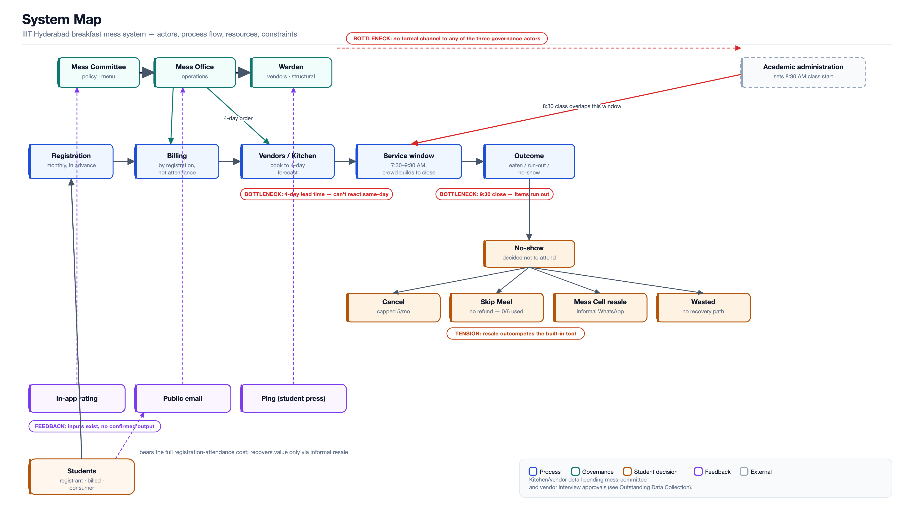

# Overview

Phase 1 established who is involved (Stakeholder Map), who holds power (Power-Interest/Leverage Map), what actually happens step by step (Process Trace), and how it repeats over time (System Timeline). This map holds all four still images side by side, as one picture: actors, the process flow, the resources and constraints that shape it, and the points where the system visibly strains — a bottleneck, a tension, or a feedback channel that carries input without a confirmed output.

Everything below is built from facts already confirmed in Tasks 1-5. No new claim is introduced here; this map is a synthesis, not a new data-collection round.

# Map Actors, Processes, Information, Resources and Constraints

**Actors:** Students (registrant, billed party, consumer); three governance bodies — Mess Committee (policy), Mess Office (operations), Warden (vendors and structural change); per-mess vendors and kitchen staff; Academic administration (sets the class schedule, holds no formal role in mess governance); the informal Mess Cell resale market; three feedback channels (in-app rating, public email, Ping).

**Process flow:** registration (monthly, in advance) feeds billing (calculated from registration count, not attendance), which feeds a four-day forecast to vendors, who cook against that fixed figure. The service window runs 7:30-9:30 AM, with the crowd building continuously toward the close. The outcome for any given registration is one of: eaten, run out, or no-show.

**Resources:** the registration and billing platform; four physically distinct mess facilities and kitchens; the personal QR access credential; the four-day procurement lead time itself, which functions as a resource constraint shared equally by every actor rather than an asset any one of them controls.

**Constraints:** billing is registration-based, not attendance-based; cancellation is capped at five per meal type per month; the four-day lead time means no same-day signal — a cancellation, a Skip Meal toggle, a sudden rush — can change what is actually cooked; mess hours and the academic class schedule are set independently, with no formal coordination mechanism between them.

# Identify Conflicts and Dependencies

**Dependencies:** students depend on vendors for food itself; vendors do not depend on any individual student. Vendors depend on the Mess Office for a forecast fixed four days ahead; the Mess Office depends on students to register accurately, but nothing in the billing structure requires that accuracy. This is the one dependency in the system where the party with less to lose controls an input the other party cannot substitute.

**Conflicts:** billing certainty (needed by the Mess Office and vendors to forecast) against attendance uncertainty (a real feature of student life, not a defect); flexibility (students and the Mess Cell market want more of it) against workload (the Mess Office's confirmed motive for its one policy change, which reduced flexibility); the 8:30 AM class start against the 7:30-9:30 AM breakfast window, a conflict neither side is positioned to resolve alone since Academic administration and mess governance share no formal channel.

# Represent Formal and Informal Structures

**Formal structure:** three separate governance actors (Mess Committee, Mess Office, Warden), each with a defined but partially-overlapping authority, sitting alongside Academic administration, which is formally external to mess governance entirely.

**Informal structure:** the Mess Cell WhatsApp resale market, which recovers value from an unused registration that the formal Skip Meal tool does not; Ping, the student publication, which creates public visibility for mess issues without any confirmed authority to act on them; at least one unofficial registration-management tool operating outside the official portal.

The formal and informal structures do not meet cleanly at one point. Academic administration has no formal or informal relationship to any of the three governance actors — a confirmed absence, not a gap in this research. The Mess Cell market operates entirely outside the formal registration and billing system, transacted through the same access credential the formal system issues.

# Highlight Bottlenecks, Tensions and Feedback Loops

**Bottlenecks:**
- The four-day procurement lead time. Nothing in the system lets a same-day signal change what is cooked, regardless of which actor wants to act on it.
- The 9:30 AM close. Item run-outs are confirmed by respondent accounts, concentrated in the period just before close.
- The complete absence of a formal channel between Academic administration and the three mess-governance actors. The one variable most likely to resolve the core schedule overlap sits with an actor no governance body can formally reach.

**Tensions:**
- Registering broadly (individually rational, given walk-in pricing and scarcity at popular messes) against system-level waste (the aggregate effect of that same behaviour).
- The Mess Cell resale market outcompeting Skip Meal for the identical situation — advance knowledge of non-attendance — because it returns value and Skip Meal does not.

**Feedback loops:** three real channels — in-app rating, public email, and Ping coverage — carry student input into the system. None has a confirmed instance of producing a policy change. Inputs exist; a confirmed output does not.

# Key Findings

1. The system's process flow and its governance structure are only loosely coupled: the Mess Office controls billing and ordering, but the actor with the single most relevant lever over the core problem — Academic administration, over class timing — sits entirely outside that structure.
2. Every no-show exit path (cancel, Skip Meal, resale, or simply waste) is a workaround for the same missing formal mechanism: nothing in the system lets a same-day change in intent affect what gets billed or cooked.
3. The resale market's success is itself evidence of a formal gap: students built a working alternative to Skip Meal because Skip Meal does not do what a student in that situation actually needs.

# Outstanding Data Collection

The kitchen and vendor half of this map is drawn from the confirmed four-day lead-time constraint and vendor role only; the internal detail of how a preparation quantity is actually decided, and how (if at all) waste or shortfall data reaches a decision-maker, requires a mess-committee or mess-vendor interview. That interview round is pending institutional approval and **will be collected and submitted later**, consistent with the same outstanding item already logged against Tasks 3-5.
