# Overview

This map lays out who is involved in the breakfast mess system, how registration turns into food on a plate, what resources and rules shape that process, and where the system visibly strains. It draws on a Campus Facilities Services Chair interview, a walkthrough of the Kadamba kitchen, four dining service posters, student interviews, interviews with the three catering operators who run Yuktāhār, Kadamba and Bakul (Vijayalakshmi Caterers), the Yuktāhār operator's own registers photographed page by page, a team member's first-hand account of both the Kadamba and Yuktāhār kitchen visits, and the institution's scan records for every Kadamba breakfast in April 2026. Every claim is marked confirmed, single-sourced, candidate, or assumed, the same way as the rest of this project's work. Confirmed means a named source stated it directly on clear audio, it is read straight off a record (a register, a form, the scan data), or the team saw it on site. Single-sourced means one account only. For Bakul that account is a team member's synthesis of the recordings of its manager and staff, written by someone who understood the conversation, which replaces an earlier machine-translated reading of the same noisy audio; its numbers are the operator's own claims, and no Bakul records of any kind exist. For Kadamba, the operator's figures in this version were heard directly by a team member, so the numbers themselves are not in doubt, but they remain the operator's own description of its practice. Candidate means a reasonable but unverified mechanism. Assumed means a systems thinking judgment offered honestly rather than as fact.

Two findings shape how everything else here should be read. The first: the institution has already run a version of this system where billing tracks who actually shows up instead of who registered, and it worked. The second: the gap between registration and turnout is not invisible. It is measured twice, in the institution's own scan records and in the operators' own registers, and it is acted on inside the kitchen every day. What is missing is any route that carries that measurement to whoever sets the registration and billing rules. The map previously drew the kitchen as a box receiving a four day old number. One kitchen, Yuktāhār, is in fact the most data rich actor in the system and one of the least powerful. Kadamba's kitchen holds per-dish gram standards and live knowledge of the counter, but no record that carries one meal's outcome into the next. Bakul's manager adjusts his first batch week by week from past attendance, and whether any of that history is written down is not known (single-sourced), so at Bakul the measurement may live in one person's head (candidate).

# Actors, Process, Resources and Constraints

Students are the registrant, the billed party, and the one eating. Separately, interns need a mandatory Food Card, and faculty and staff can get one too, billed against salary rather than a prepaid balance. Campus Facilities Services sits above Campus Dining Services, which has its own structure underneath it: a CDS Chair (named as Giri in the CFS Chair interview, not yet interviewed for this project), a CDS Committee made up of faculty with final say, a CDS Student Council that proposes changes and does first review, and one admin per dining hall. The team's field account names a different person, Raju, as CDS head. Whether these are two roles, such as an administrative chair and an operational head, or whether one name is wrong is an open question; the two are not merged here. A CFS Head handles low intensity feedback directly, without needing committee involvement. Catering is outsourced through open tender to separate operators, one per hall or pair of halls, each with its own staff, planning method and records. Academic administration sets the class schedule and has no formal role in mess governance at all. Students also run an informal resale market through a WhatsApp group known as Mess Cell.

Several actors sit on the boundary of the system, exchanging material or information with it without being run by it: the operators' suppliers of groceries, vegetables, milk and paneer; the garbage contractor who collects Kadamba's food waste; and the institution's site team, which relays complaints into the operator's own WhatsApp group. Faculty and early shift ground, security, and housekeeping staff are a second demand stream on the same food. An earlier version of this map called them invisible in every number the system tracks; that has been revised. Yuktāhār's attendance register has a faculty and staff column, and it records between zero and two such diners at a breakfast (confirmed). At Kadamba, an earlier version of this map put this demand at 20 to 30 cooking and security staff eating leftovers after students. The team's first-hand account revises it upward and splits it in two. The kitchen cooks about 30 extra portions for 30 to 50 people from outside the student registration, such as night-shift security staff who do not want to leave their posts to eat, and about half of Kadamba's own staff also eat at the mess (both single-sourced). All of them eat from the same food as students. They are at once a planned extra demand and an uncounted sink for first-batch surplus (candidate); if the sink reading holds, they absorb surplus rather than compete for food students need. The Canine Council, a real student body that feeds the campus's community dogs, may take some scraps informally; this remains assumed, with no evidence for it.

One thing worth flagging honestly rather than guessing at: whether "CDS," "CDS Committee," and "CDS Student Council" are the same bodies that earlier phases of this project called "Mess Office," "Mess Committee," and "Student Parliament," or whether they're genuinely different, is not resolved. The operators themselves refer to the institution's side as the "CDS team." Same for whether "Warden," named earlier as the owner of vendor management, is actually the same role as CFS. Both are flagged as open questions, not settled either way.

## The Operator Layer

Three operators convert registrations into cooked food in three different ways. Each reads the closed registration count from the portal ahead of service. Kadamba discounts it by a fixed breakfast ratio that is not calibrated to measured breakfast turnout. Yuktāhār sets quantities item by item from its own records, although its breakfast reference point, about 50 percent, sits above its own measured 28 percent. Bakul sits between the two: its manager varies the share by item and adjusts it week by week from past attendance by his own judgement, but never below a floor he keeps against shortage (single-sourced). An earlier version of this map grouped Bakul's kitchen with Kadamba's as a second fixed, uncalibrated ratio; that reading rested on a noisy recording that gave only the ratio, and it is revised here.

Yuktāhār is run by ABC Hospitality Services and serves vegetarian and Jain food only. Its site head leads a documented planning system (confirmed from the operator on clear audio and from its records). A planning meeting sits twice a day: the first half fixes tomorrow's breakfast and lunch, the second fixes snacks and dinner, and the storekeeper, coordinator and kitchen staff attend. Everyone raises the day's positives, negatives and discrepancies there. Before service, the meeting reads its inputs: portal registrations, counted as regular plus Jain plus cash meals; the Wastage Book entry for the matching day of the menu cycle, which works because the menu repeats every two weeks, so a week three Thursday is planned from the week one Thursday; an attendance register grouped by weekday; the month's turnout pattern; and holidays, special weeks, exams and campus events, but only when someone raises them (confirmed for the records, single-sourced for the month pattern). The site head put it plainly: "We don't come to know... until we sit in the meeting." During service, the first half hour is used as a sample to project how many will come for the rest of the meal, and that projection drives top-up cooking (single-sourced). The Wastage Book records, per item, raw issued, cooked quantity, left over, percentage wasted, the time the item ran out, any re-cook and what was left of it; the day's meal wastage is the student plate waste in the bins plus the leftover food. It works as a rule: an item that runs out at 1:30 is re-cooked, one that runs out at 2:20 is not. The meeting's output is a per meal issue list in the Grocery Book, and the Grocery Book and the stock register agree with each other on the day checked. An earlier version of this map gave Yuktāhār a five person project management team; the team's account revises that to two project managers from ABC Hospitality Services, with about three site staff sharing project-management work. The kitchen runs 16 staff with no hierarchy: everyone does every job, every record is cross-checked by a peer, and separate tasting, cutting and cleaning teams work alongside the store and the coordinator. The vendor's stated goal is explicit: best food quality, less waste, an optimised workflow, lower operating cost, standardisation and higher profit (single-sourced). Waste reduction is a cost lever for this vendor, not only a quality one. It tried the Zoho ERP to streamline groceries and predict the rush, and dropped it for two reasons: paying lakhs of rupees for prediction made no sense when the data already sat in its own books ("I want to remain close to the data"), and its staff are not digitally inclined, with too few staff to digitise, so office staff digitise records later (single-sourced). Paper records are a design choice here, not a gap. Waste tracking began in August of the previous year; staff resisted at first ("they are catching us"), the managers made the measurement deliberately blame-free and discussed it daily, and by December the staff themselves reported that waste had fallen.

Kadamba's operator is Prism, an outsourced vendor that won the contract by tender, registered as a vendor and runs all operations at Kadamba (single-sourced). An earlier version of this map recorded only a floor team calling itself the "Prism team," with the firm unconfirmed; the team's first-hand account revises that. The floor and mess manager remains the interviewee. Prism cooks a first batch for about 70 percent of registrations, planned separately for vegetarian and non vegetarian (for example 400 non vegetarian and 300 vegetarian registrations planned as two batches), and keeps the remaining raw material ready (single-sourced, heard first-hand by a team member). Every dish has a per-person gram standard: four idlis from about 120 grams of batter, about 100 grams of sambar, and separate standards for poha, pulao and the rest. Some items "float," with diners taking more than the standard: bonda, puri, vada and idli. That is why gram standards alone under-predict demand for exactly the items that run out. During service a supervisor watches how much of each item is left at what time and tells the chef how many more portions to cook, weighing registrations against turnout so far, and the kitchen cooks more within 10 to 15 minutes (single-sourced). The team's own illustration of that judgement: if a 50 percent batch is gone in the first 45 minutes, a quarter of the diners have eaten half the food, and the rest is cooked against the observed flow. The manager says the kitchen has no forecasting method: "We don't have that idea... it was wasted many times." The operator's stance on quantity is stated in its own words: the kitchen cooks on registrations, and "it doesn't care if people don't want to eat because it is a responsibility and they are getting paid for it" (single-sourced). About ten chefs work split between vegetarian and non vegetarian lines, with Nazir as the main vegetarian chef and a head chef brought in for biryani days. The chef arrives at 5:30 to cook batch items such as sambar and upma.

Bakul (Vijayalakshmi Caterers) is run by an operator that won the hall by tender (single-sourced, noisy audio) and cooks nothing on site. Its food is cooked at the Hafizpet kitchen, about 8 km from the hall, and driven in (single-sourced). The Bakul manager does not cook for every registration. For 100 registrations the first batch is about 70 to 80, and the share depends on the item; he sets it from past attendance, reviewed week by week, and his own illustration is that a Monday that usually sees about 70 percent is cooked at about 80 percent (single-sourced), an example that may not describe breakfast, since it sits above his own breakfast estimate below. His operating rule is stated plainly: "there should not be a shortage of food, even if some wastage occurs." Even at weekends, when breakfast turnout is very low, he keeps food for about 70 percent of registrations (single-sourced). During service he checks the food left against registrations and the demand still expected about every 30 minutes, and phones the Hafizpet kitchen with an approximate quantity when more is needed; the kitchen cooks it and sends it (single-sourced). He estimates that at most about 60 percent of registered students come to breakfast; no Bakul records exist to check that figure. Three earlier readings of the same recordings are revised here. The kitchen was placed about 40 minutes away near the airport; it is at Hafizpet, a drive of about 20 minutes early in the morning and about 40 minutes later in the day. The ratio was read as 70 percent recently raised to 80; it is a share that varies by item and day, and the earlier reading of a rule change is withdrawn. Extra food was said to arrive about 30 minutes after it is asked for; the lead time is not stated, the drive alone takes 20 to 40 minutes before any cooking, and the 30 minutes may have been the check interval, so that figure is flagged rather than relied on. The hall, a candidate in earlier versions, is now named by its own manager. Whether Palash is served by the same operator from the same kitchen stays a candidate.

| Hall | Operator | How the first batch is sized | Measured breakfast turnout | Confidence |
|---|---|---|---|---|
| Yuktāhār | ABC Hospitality Services | Registrations read against the matching-day Wastage Book entry, the weekday register and the month's pattern, then re-projected from the first half hour of service; the site head believes turnout is about 50 percent | About 28 percent, September 2026 (range 17.7 to 40.2 percent) | Planning method and turnout confirmed; in-service projection single-sourced |
| Kadamba | Prism, tender-contracted vendor | About 70 percent of registrations, vegetarian and non vegetarian planned separately, topped up in 10 to 15 minutes on the supervisor's call | 37.1 percent, April 2026 (vegetarian 32.4, non vegetarian 48.5) | Turnout confirmed; ratio single-sourced, heard first-hand |
| Bakul (Palash candidate) | Vijayalakshmi Caterers, cooked at the Hafizpet kitchen | 70 to 80 percent of registrations, varying by item, adjusted weekly from past attendance by the manager's judgement, and never below about 70 percent even on low weekends; topped up by phone from the Hafizpet kitchen, lead time not stated | No records; the manager estimates at most about 60 percent | Single-sourced; no Bakul records |

At Kadamba a first batch of 70 percent of registrations would be roughly 1.9 times the breakfasts actually eaten, before any top-up, and about 2.6 times on a Sunday. The 70 percent was heard directly by a team member; the arithmetic stays candidate because it applies an operator's stated rule to a month in which the batches were not recorded. The operator puts Kadamba's wastage at about 5 to 10 percent daily, without saying whether that is per meal or per day, or by what measure (single-sourced). An earlier version of this map carried kilogram figures from the noisy audio; those are withdrawn. The two numbers are in tension. A first batch of roughly 1.9 times the breakfasts eaten would leave far more than 5 to 10 percent unless most of the surplus is eaten by the outside diners and staff, held and reheated into later service, or offset by top-ups smaller than the first batch implies, or unless the figure is measured on another base, such as all meals or plate waste only. The evidence does not yet say which, and none is assumed here.

The same kitchen shows that the ratio is set per meal rather than as one house rule for every meal. Biryani lunch is cooked at 100 percent of registrations, two pieces of 150 to 200 grams each with unlimited rice; when some diners take three pieces, later diners run short, and a head chef comes in for the day (single-sourced; lunch, not breakfast). The meal priced highest on the menu, and the one that drew 25 students after close, is cooked for everyone registered. Breakfast is cooked for 70 percent. Yuktāhār's site head believes breakfast turnout is about 50 percent while his own register records an average of about 28 percent (confirmed). Even the operator with the most complete records misremembers its own breakfast figure, though its item level planning runs off the records rather than off that belief. Bakul's manager puts breakfast turnout at most about 60 percent, with no record behind it. If Bakul resembles the two halls with records, where breakfast turnout runs at 28 to 37 percent, that figure is an upper bound rather than the norm (candidate), and on the manager's own numbers the first batch and the weekend floor already sit above the highest turnout he expects (candidate).

## Registration, Procurement and Service

Registration is an automatic default with a narrow exit. Students are registered for every meal whether or not they are on campus, holidays included, and the only way out is five cancellations per meal type per month, each made at least four days ahead; beyond those, in the team member's words as a student, "we don't have any opportunity to nullify it" (confirmed from the poster and student experience). A student who never registers at all is still assigned a vegetarian meal somewhere, one more instance of the same default. Kadamba's operator describes breakfast registration as made in weekly blocks (single-sourced); whether the operators' weekly description and the students' automatic, monthly one describe the same mechanism from two sides is not confirmed. Billing runs monthly off how many meals a student is registered for rather than how many were eaten. An earlier version of this map said registration happens monthly and that the four day lock feeds the vendor's ordering, so nothing about a specific morning could change what gets bought. That finding has been revised by the operators' own accounts. The four day lock applies to registration, not to procurement. Procurement runs on its own cadences. At Yuktāhār vegetables arrive two to three times a week and milk daily (confirmed); groceries are bought fortnightly by the stock register (confirmed) but the week before use, from many local shops and godowns, by the operator's account (single-sourced), and the two are not yet reconciled. At Kadamba procurement runs in three tiers: dry goods such as rice, groundnut, masala, ghee and podi one week ahead; perishables such as milk, fruit, meat, eggs and most vegetables the day before; and some vegetables two to three days ahead (single-sourced). How much gets cooked is decided by the operator, at Yuktāhār the day before at its planning meeting. Kadamba's team challenged the four day cut-off directly (single-sourced). It is longer than any perishable lead time the kitchens described. Only dry goods are committed before the four day close, and they are the inputs least sensitive to how many turn up, since uncooked rice or ghee carries over to the next week (candidate). The constraint that actually binds waste is the cooked first batch, sized as a ratio of registrations. Raw stock that isn't cooked is largely recoverable; cooked food keeps only three to four hours, and a batch already cooked can be topped up but never shrunk. At Bakul the first batch leaves the Hafizpet kitchen before any sign of the morning's turnout, and a top-up can only add food, slowly (single-sourced). At Kadamba, by the team's own judgement, what is left of a batch is held, reheated and moved between vessels for display and service rather than discarded at once (candidate), so part of the cost of a surplus shows up as poorer food rather than as waste.

Registration behaves as a standing booking rather than a daily decision, and the automatic default explains why from the student's side. Kadamba's breakfast registrations held flat at about 1,070 a day on every day of the week in April 2026, Sunday included (928 to 1,123), while turnout varied by weekday from 42.1 percent on Tuesdays to 27.3 percent on Sundays (confirmed from scan records). Across the month, 32,162 breakfasts were registered and 11,941 eaten: a turnout of 37.1 percent and 20,221 billed breakfasts that nobody ate. At Yuktāhār, breakfast turnout in September ran between 17.7 and 40.2 percent, with Sundays among the lowest, while lunch on the same days ran between 56 and 89 percent (confirmed from the operator's register). In the one hall with records for both meals, then, the gap is specific to breakfast. The CFS Chair's figure of 35 to 40 percent breakfast turnout is now confirmed by records for Kadamba in April; Yuktāhār runs lower. An earlier working estimate of a registration to attendance gap of about 30 percent has been revised: that figure matches Yuktāhār's lunch, while the breakfast gap is about 63 percent at Kadamba and about 72 percent at Yuktāhār.

The CFS Chair described a weekly stock check driven by consumption trends, with high turnover items like paneer, egg, and chicken above ninety percent turnout and general items around seventy percent. That is the institution's view of the mechanism, and the general figure matches lunch rather than breakfast. The operators' actual planning, described above, is where registration turns into quantity. The institution's account, since confirmed by a second source, also holds that same week Skip Meal declarations reach the kitchen and change how much of the ordered stock gets cooked. The toggle tells the kitchen not to prepare but does not remove the charge. None of the three operators named Skip Meal among the inputs to its planning; they all plan from the portal count, and Kadamba's operator says flatly that it cooks on registrations (single-sourced). These two findings conflict, and the conflict is left open here. One possible reconciliation is that a Skip Meal declaration lowers the registration count before the operator reads it, while the operator treats whatever count it receives as the obligation (candidate). One direct question to the kitchen would settle it.

The published service window runs from 7:30 to 9:30 in the morning. An earlier version of this map, working from the CFS Chair's account, put about eighty percent of students arriving around 9:20. Kadamba's April breakfast scan records replace that with a measured curve for that hall. Scanning picks up at about 7:28 after a small early trickle, half of the morning's breakfasts have been scanned by about 9:00, 13.5 percent of all scans fall between 9:00 and 9:15, and 26.5 percent fall between 9:15 and 9:30, with the rate climbing steadily to about nine scans a minute at 9:29 (confirmed). About 9 percent of scans land after 9:30; service actually closes between 9:35 and 9:45, and the latest scan in the month was at 10:07. This is one continuously building crowd that crests just before close, not a single spike. Two operators independently describe the rush as coming at closing time. An earlier version of this map said all three did; the Bakul manager instead places his main rush at about 8:00 to 8:30, with about 10 to 15 people arriving in the last 10 minutes (single-sourced; no Bakul records), which also revises an earlier noisy reading of a Bakul peak at 8:30 to 9:00. The closing crest is recorded at Kadamba and described at Yuktāhār, and arrival curves may differ by hall (candidate). Kadamba's operator gives it as a rule of thumb: about 100 diners in the opening phase, about 100 through the middle and about 150 in the last 10 minutes, since "for any meal the highest flow is in the last 10 minutes" (single-sourced). The records remain the measurement. They show the same shape at a smaller size: 19.8 percent of April's scans, about 79 a day, fall in the last ten minutes before 9:30, against about 43 percent in the operator's example (confirmed from scan records). The loudest minutes loom largest in the kitchen's memory (candidate).

Exemptions exist for internships, PhD students, and long term medical need, though the monthly infrastructure fee still applies to exempted students since it funds shared infrastructure rather than individual meals. Walking in without registering is deliberately made harder near the end of a billing cycle, specifically to protect food for people who did register. Kadamba's kitchen, on the other side, prepares extra portions: about 30 for the 30 to 50 outside diners described above, by the team's first-hand account, and 30 to 40 for paying and unregistered diners by the noisier interview audio (both single-sourced). These may be one allocation described twice; that is not confirmed. At Yuktāhār, unregistered, paying and faculty or staff diners together number between zero and twelve at a breakfast (confirmed).

The registration platform is named as dining.iiit.ac.in on three of the four posters checked, but as mess.iiit.ac.in on the bottom of a fourth. That's a real inconsistency on the institution's own signage, not a mistake made while writing this document. The personal QR code used for access can be regenerated if compromised, and the old one is invalidated the moment a new one is issued. When the scanner fails, Kadamba's staff write the student's ID and name by hand (single-sourced). There are four physically separate dining halls, detailed below. Kadamba's on site kitchen runs a roti line, a machine that cooks multiple items while keeping vegetarian and non vegetarian food physically apart, a tilting steaming unit, and cold and dry storage on a first in first out basis. Its toaster and grill are broken (single-sourced). An earlier version of this map said one person runs that storage with nobody as backup. That claim has been downgraded to single-sourced and unverified: when Kadamba's manager said "no backup," it referred to the kitchen not being allowed to hold excess stock, since quality control visits from the institution check the store. Kadamba also keeps the per-dish gram standards, a 72 hour food sample from every meal and a daily water quality (TDS) reading (single-sourced). Yuktāhār, by contrast, has a store function but no storekeeper-only role: any staff member can do any job, and every record is cross-checked by a peer. Its resources include daily logs of milk, gas, electricity and water, which let it see, for example, that Wednesday's electricity spike comes from grinding idli batter (confirmed from records and the operator).

**Dining halls, from the CDS overview poster, with the operator added:**

| Dining Hall | Capacity | Cuisine | Dining Type | Kitchen | Operator |
|---|---|---|---|---|---|
| Kadamba | 1200 | South Indian | Mixed | On site, automated | Prism, outsourced vendor won by tender |
| Bakul | 750 | North Indian | Mixed | Off site, the Hafizpet kitchen, about 8 km away; shared with Palash for now | Vijayalakshmi Caterers (single-sourced) |
| Palash | 450 | North Indian | Vegetarian | Off site, hall under construction | Served from the same off-site kitchen as Bakul (candidate); operator not confirmed |
| Yuktāhār | 350 | Satvik and Jain | Vegetarian | On site, manual | ABC Hospitality Services |

Bakul and Palash were earlier thought to be one converted warehouse with food shipped in from the other. That turned out to be wrong. Palash is currently under construction and isn't cooking on site at all right now. Both it and Bakul are served from one outside kitchen until a new shared kitchen, expected around December 2026, opens. Bakul's own manager confirms that its food is cooked at the Hafizpet kitchen, about 8 km away, and driven in, about 20 minutes early in the morning and about 40 minutes later in the day (single-sourced); an earlier version of this map placed that kitchen about 40 minutes away near the airport, which is revised. The transport link is a physical delay built into every top-up Bakul receives, and into Palash's too if, as is candidate, Palash is fed from the same kitchen. Worth remembering this is a system mid transition, not a fixed structure. Yuktāhār's breakfast registrations ran between 228 and 404 a day in September (confirmed).

There's also an unresolved gap between two numbers for Kadamba's capacity. The poster lists 1200. A separate interview mentions 420 seats against a stated 1,200 turnout, with a 1 to 3 ratio maintained on purpose. The April records support reading these as two different things: registrations ran at about 1,070 a day, close to 1,200, while breakfasts actually eaten averaged about 398 a day, close to 420. That strengthens the candidate reading of 1,200 as registration capacity and 420 as seats, without confirming it.

**Meal prices in rupees, the confirmed three tier structure:**

| Item | Student rate | Card rate | Walk-in rate |
|---|---|---|---|
| Veg Breakfast | 48 | 55 | 81 |
| Double Egg Breakfast | 66 | 76 | 111 |
| Veg Lunch | 65 | 75 | 111 |
| Veg Dinner | 65 | 75 | 111 |
| Chicken Biryani Lunch | 155 | 178 | 263 |

The student rate only applies if the meal was registered in advance. Anyone who shows up unregistered, even a student, pays the walk-in rate instead, which is seventy to ninety percent higher. That's a real financial nudge toward registering, and it exists alongside, not instead of, the low breakfast turnout this whole project is trying to explain.

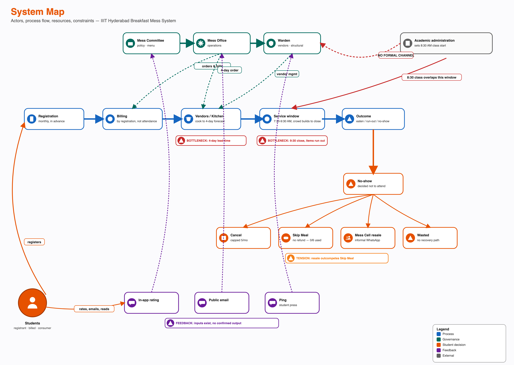

That diagram draws the operators and their kitchens as one box. The operator layer described above is what sits inside it: three planning rules, three sets of records, and a live top-up during every service. The diagram does not yet show the operator layer and its two contrasting on-site subsystems, the outside diners and staff who eat Kadamba's surplus, the off-site supply and transport link to Bakul, the waste exit through the garbage contractor, or the absent link from the operators' records to the rule owner; the text of this map is the current account where the two differ. Kadamba's kitchen equipment and supply are shown next.

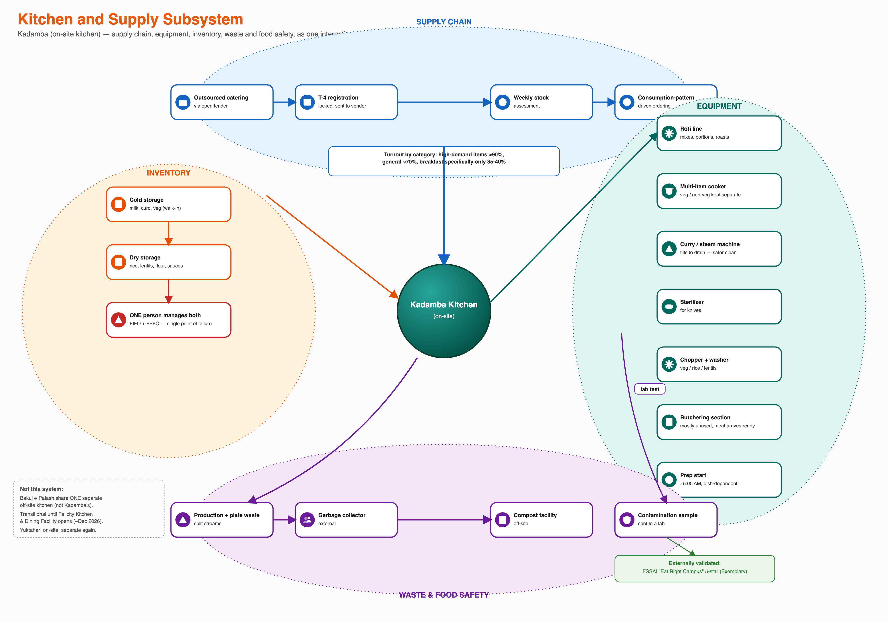

Four things interact around Kadamba's kitchen specifically: the supply chain feeding it, the equipment used to prepare food, the inventory management, and waste and food safety. The supply chain runs on three tiers at once, dry goods a week ahead, some vegetables two to three days ahead and perishables the day before, rather than on a single four day order. The diagram does not yet show those tiers, the food-safety checkpoints, or the surplus held and reheated back into service. Yuktāhār and Bakul's off-site kitchen run structurally different versions of all of this, covered next.

# Three Kitchens, Not One

Kadamba cooks its batch items such as sambar and upma backstage from 5:30 using machines and portions them by gram standard, while live items such as dosa are cooked in front of diners from 7:00 so they are served hot (single-sourced). Every meal passes a food-safety sequence before service, set out under Conflicts and Dependencies. By the team's own judgement, Kadamba's main quality problem is that food is cooked ahead, reheated repeatedly and moved between vessels for display and service, so it degrades fast (candidate: the team's assessment, not the operator's). Yuktāhār cooks manually from 5:30 for a 7:30 finish, mostly in one batch with poha in two. Rotis are handmade without oil, diners add their own ghee, and a second roti counter opens at the peak (confirmed). It runs separate Jain and pure vegetarian lines that Kadamba doesn't offer. Bakul cooks nothing on site, and Palash, candidate, is fed from the same off-site kitchen. Bakul's breakfast runs on a supply chain the two on-site kitchens do not have (single-sourced throughout). Labour-heavy items such as aloo paratha are started at the Hafizpet kitchen from about 3 AM, aiming to reach Bakul around 7 AM. Food travels about 8 km in insulated boxes that hold it at about 60 to 72 °C, and at the mess the boxes sit in a hot-water setup to keep that temperature. The chain protects heat, not texture: hot parathas give off steam inside the closed box and soften, so they arrive hot but less pleasant to eat. Some breakfast food is therefore held for hours between cooking and eating. The food kept back for late arrivals is the food held longest, so late diners are likely to get the softest paratha (candidate), and whether other items lose quality the same way is untested. These are three separate systems with three separate planning rules: a documented feedback method at Yuktāhār, a fixed ratio and live top-up at Kadamba, and at Bakul a weekly judgement bounded by a shortage floor, with a transport delay on every top-up. A finding drawn from one, whether about turnout, waste, or quality, shouldn't be assumed to apply to the others.

```text
BAKUL BREAKFAST: THE OFF-SITE SUPPLY AND DECISION LOOP
(the Bakul manager's account, single-sourced; candidate where marked; no Bakul records)

 Registrations (automatic default)        Weekly review of past attendance
            │                              (manager's judgement; record unknown)
            └──────────────┬───────────────────────┘
                           ▼
          First batch = 70-80% of registrations, varying by item
          floor about 70%, even on low weekends ("no shortage, even if waste")
                           │  prep from about 3 AM (labour-heavy items)
                           ▼
   Hafizpet kitchen ──(about 8 km; about 20 min early, about 40 min later)──► Bakul, about 7 AM
                           │  insulated boxes, 60-72 °C, hot-water holding
                           ▼                     (heat kept; paratha softens)
          Service: rush about 8:00-8:30, then 10-15 people in the last 10 min
                           │
          about every 30 min: food left vs registrations vs expected demand
                  │                                        │
         short? phone the Hafizpet kitchen        keep food for about 50 at 9:20
         (cook + 20-40 min drive;                 (candidate: held because a late
          lead time not stated)                    top-up cannot arrive in time)
                  └──────────────────┬─────────────────────┘
                                     ▼
            Surplus: some back to the kitchen, the rest thrown (noisy audio)
```

Kitchens adapt to supply problems in ways that are now partly documented. Yuktāhār's store cleans and sorts issued grains, weighs the stones and sticks removed, and reports them back to the supplier (confirmed). It holds an expected grams-of-waste norm for each raw item; an item over the norm is raised at the daily meeting and leads to a complaint or a change of supplier (single-sourced). That is a balancing correction at Yuktāhār on the supply side; its correcting step, the complaint or supplier change, rests on the operator's account, and no supplier change has been observed. The operator also visits the mills to see how oil and other inputs are made, and has used only rock salt and cold-pressed oils for about the past six months (single-sourced). Bakul's operator switched paneer brands after complaints (single-sourced, noisy audio). During the cooking gas shortage, Kadamba cut quantities and bought some food from outside (single-sourced). Leftover reuse is confirmed at Yuktāhār: leftover breakfast idli becomes idli upma or idli poha for lunch, so reuse crosses meals, dosa batter goes back into the fridge, surplus milk is set as curd overnight, and paneer is made in house from milk. Bakul's operator returns some leftovers to its kitchen for reuse and throws the rest away (single-sourced, noisy audio). Whether kitchens also announce ingredient swaps in a student facing WhatsApp group remains assumed.

How operators are paid is now partly known. Bakul's operator won its hall by tender and is paid monthly, as a lump sum based on the number of plates, with deductions (single-sourced, noisy audio). An earlier version of this map assumed a fixed per student fee. Whether "plates" means plates registered or plates actually served decides who bears the cost of a no show. Bakul's operator describes the monthly payment as based on the number of plates served (single-sourced). That is one word in an account whose wording was normalized when it was written up, and it sits in tension with Kadamba's remark below: the two contracts may differ, "served" may be the account's word for billed plates, or Kadamba's remark may describe its duty rather than its payment formula. The tension is left open, the answer is not carried to any other operator, and the plate basis remains unconfirmed for every operator. If Bakul is paid on plates served, its operator bears the cost of cooking above turnout and accepts it, which would mean it judges a shortage costlier than waste (candidate). If plates are counted from registrations, billing decoupled from attendance protects the operator's revenue regardless of turnout, and a first batch sized well above turnout is partly paid for by students who never came; that reading stays assumed until the plate basis is known. Kadamba's operator said it cooks on registrations because "they are getting paid for it," a hint that its payment tracks registration (candidate), not a contract term. Kadamba's automated setup likely has lower labor costs and higher upfront equipment costs than Yuktāhār's manual model, which would make its economics favor steady, predictable volume; this also stays assumed.

An earlier version of this map explained popular items running out as the result of portions set from one average consumption number applied the same way across every item. That hypothesis has been revised. Operators plan per item: Yuktāhār from each item's matching-day record and run-out time, Kadamba by grams per item, and Kadamba has cut ragi idli and increased plain idli from what it saw being eaten (single-sourced). Items run out because the first batch is sized as a ratio of registrations and then, at Kadamba, meets a crowd that crests in the last fifteen minutes, faster than a top-up taking 10 to 15 minutes can follow; a top-up to Bakul from its off-site kitchen takes longer, by a margin not yet measured. On Thursday 3 September, with 28 percent of registered students eating breakfast by the production sheet, Yuktāhār still re-cooked semia upma at 9:00 (confirmed from records). Shortage and surplus happen on the same morning: this is the only point in the system where they coexist.

## Two Operator Subsystems Side by Side

Kadamba and Yuktāhār are two on-site kitchens on the same campus, under the same registration and billing rules, reading the same kind of portal count. They convert it into food through two different subsystems, which makes them the cleanest natural comparison in this project. Bakul (Vijayalakshmi Caterers) is kept as a third column. An earlier version of this map filled that column from a noisy recording and read it as a copy of Kadamba's fixed ratio; the fuller account of the same recordings shows a third regime between the two, and the column is revised accordingly.

| | Kadamba (Prism) | Yuktāhār (ABC Hospitality Services) | Bakul (Vijayalakshmi Caterers) |
|---|---|---|---|
| Vendor and contract | Outsourced vendor won by tender, runs all operations | Outsourced vendor; project managers set goals | Won by tender; paid monthly per plate, with deductions; the basis is given as plates served, in open tension with Kadamba's remark |
| Structure | Layered chain: operations manager, manager, supervisor, service staff | Flat: no hierarchy, everyone does every job, peer cross-checking | Manager at the mess, the kitchen off site, a managing director above |
| First batch | 70 percent of registrations, vegetarian and non vegetarian separately | Matching-week Wastage Book lookup, weekday register, month pattern, holidays and events | 70 to 80 percent of registrations, varying by item, adjusted weekly from past attendance by the manager's judgement; never below about 70 percent, even on low weekends |
| Portion standard | Grams per dish per person | Kilograms per dish in the store's ingredient book | Not stated |
| In-service signal | Supervisor watches what is left of each item against the time | First-half-hour projection, checks every 30 minutes near close, a second counter | Food left, registrations and expected demand checked about every 30 minutes; top-up phoned to the Hafizpet kitchen, cooked and driven 20 to 40 minutes, lead time not stated; food kept for about 50 at 9:20 |
| Record carried forward | None beyond the gram standards | Wastage Book, read again two weeks later | The manager's weekly review of past attendance; whether any of it is written down is not known |
| Waste figure | About 5 to 10 percent daily, base unstated | Weighed per dish and meal, blame-free, shown on a wastage board | Not stated; no waste record seen |
| Stance on quantity | Cooks to registrations as an obligation it is paid for | Waste reduction as a cost and profit lever | "There should not be a shortage of food, even if some wastage occurs": shortage is the failure to avoid, waste the accepted cost |
| Surplus | Outside diners and staff; held and reheated (candidate); the bin | Idli into lunch dishes, batter back to the fridge, milk to curd | Some returned to the kitchen, the rest thrown away |
| Confidence | Single-sourced, heard first-hand | Records confirmed; method single-sourced | Single-sourced, from a team member's account of the recordings; no Bakul records |

The contrast is in the learning, not the data. Both kitchens know on the day how many are eating. Only Yuktāhār writes the outcome down in a form that returns to the next decision about the same meal, and only Yuktāhār treats a smaller leftover as money saved. Bakul adds a third case. Its manager does correct the first batch against surplus, week by week, but by his own judgement with no known record, and only down to a floor he holds against shortage (single-sourced). The goal he states runs the other way from Yuktāhār's: shortage is the failure to avoid, and waste is the price accepted for avoiding it. Yuktāhār's in-service projection has its own limit: a sample from the first half hour underestimates a crowd that crests at the close, where about a quarter of Kadamba's diners arrive in the last 15 minutes (confirmed from Kadamba's records; whether Yuktāhār's arrivals crest the same way is candidate, since its arrival records are not held).

## The Yuktāhār Book System

Yuktāhār runs on paper books that feed each other. Every one was photographed (confirmed); how they connect is the operator's account (single-sourced). The day's registrations are written into the header of the Grocery Book. The Wastage Book entry for the matching week, the weekday attendance register and the month's pattern are read at the planning meeting, which turns them into a per-dish list in kilograms from the store's ingredient book. That list becomes the issue in the Grocery Book, which the stock register balances against receipts and which drives purchasing. The vegetable book tracks opening stock, receipts, use and balance and feeds the vegetable indent, with remarks such as "3 spoiled" or "only 2 boxes." Milk, fruit, gas, electricity and water have their own register, and each fridge has a temperature log read three times a day and a cleaning checklist. After each meal the outcome goes into the Wastage Book, whose daily figures go onto a wastage board, where the coordinator's target is to keep pushing the waste share down, by the operator's account from about a third. The same Wastage Book page is read again when the menu day comes round two weeks later.

Two rules hold the books together. The store book, what was issued, must match the physical book, what was cooked, and any mismatch is raised at the daily meeting (single-sourced; the two agreed on the day checked). That is an internal reconciliation check; its correcting step rests on the operator's account. And every book is kept by one person and cross-checked by another: Ajita, the mess in-charge, keeps the accounts and the Wastage Book, and Bhavani cross-verifies and writes the grocery register (single-sourced; Bhavani's signature is on a photographed fridge checklist). The books reconcile materials, not diners: the Wastage Book and the attendance register have different keepers, and on 3 September they record 77 and 110 breakfasts (confirmed).

# Waste, Environment, and the Dogs

An earlier version of this map stated as confirmed that Kadamba's kitchen and plate waste is routed to an outside compost facility. That finding has been revised. Kadamba's own operator describes its waste going into a dustbin collected by a garbage contractor, with no composting (single-sourced, but a simple and repeated statement). The institution's account of composting and the operator's account are not reconciled, and the operator's is the more recent, first hand one. Yuktāhār's disposal route was not stated. Anything suspected of contamination is still sent for lab testing, and Kadamba still holds a five star Eat Right Campus rating.

A second earlier finding, that no one tracks how much waste there is and nothing connects waste to ordering decisions, has also been revised. Waste is measured. Yuktāhār weighs it per item and per meal, counting student plate waste in the bins plus leftover food as the meal's wastage, and uses the record to set the next matching day's issue quantity (confirmed from records and clear audio). Kadamba's operator quotes about 5 to 10 percent daily wastage, with no stated base and no record seen (single-sourced), a figure that sits in open tension with a 70 percent first batch against 37 percent turnout, as set out under the Operator Layer. What does not exist is any route from those measurements to the registration rules, the billing rules or the menu owner, and nothing suggests the institution knows the operators hold this data. Waste feeds the kitchen's next decision and stops there.

Surplus is absorbed before anyone who sets rules sees it, through several routes at once: reuse into the next meal at Yuktāhār; at Kadamba, the 30 to 50 outside diners and about half the staff who eat from the same food, and surplus held and reheated into later service (candidate); the walk-in buffer of extra portions; late arrivals served after the nominal close, through the reopened front door or the back door; and finally the bin and the garbage contractor. The outside diners and staff are the most concrete case of why no fix should work by removing an absorber: an intervention that simply cut Kadamba's first batch would take food from them unless it planned for them explicitly. A contractor's bin is even less visible than a compost stream. That is the same shape as the informal resale market covered later in this document, just on the supply side instead of the demand side: a locally sensible mechanism that quietly removes the evidence of the gap. Each of these routes does real good for real people, which is why the problem persists without anyone having to ignore it.

The Canine Council, a real student group, feeds and manages the campus's community dogs; whether any Kadamba scraps reach them is assumed only, and nothing in the operator interviews supports it.

Bakul has been separately described as untidy, with insects near food, which has nothing to do with registration or billing and everything to do with why someone might avoid that particular mess regardless of the menu. Kadamba's plates are washed on a staff run conveyor belt, which keeps cleaning consistent but means a student can't choose their own plate, and since the same physical plates get used across all three meals, some students report not trusting them even though Kadamba's official food safety rating is strong. That's a trust problem, not a hygiene problem, and it's worth naming as its own thing.

Food sent to a general garbage stream rather than composted carries a larger environmental cost, in landfill and methane, than the earlier composting account implied. At Kadamba alone, 20,221 breakfasts registered in April were never eaten, and the kitchen cooks for a share of those every morning. The resulting cost has never been measured by anyone.

# The Service Timeline

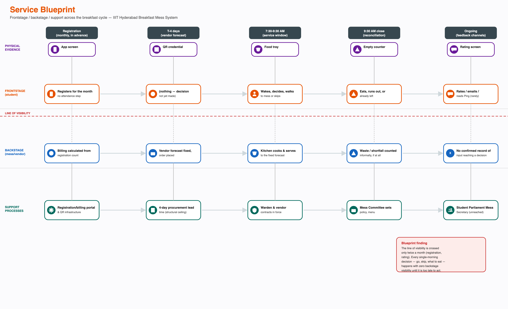

An earlier reading of this blueprint said nothing behind the scenes feeds back into service in real time, and gave the four day ordering lock as the reason. That reading has been revised. Behind the scenes reacts to the counter continuously within a meal. At Kadamba the supervisor watches how much of each item is left at what time, alongside the scan count, and tells the chef how much more to cook, while the counter asks diners to wait five minutes (single-sourced). Yuktāhār projects the rest of the meal from its first half hour, checks every 30 minutes from about 45 minutes before close, and opens a second counter during surges (confirmed for the checks and counter, single-sourced for the projection). Bakul's manager checks the food left against registrations and the demand still expected about every 30 minutes and phones the Hafizpet kitchen for more (single-sourced). Kadamba reopens its front door for five to ten minutes for late arrivals; on one biryani day 25 students came after close (single-sourced). Once the front door closes at 9:30, late diners come in through the back door and demand food, and the mess cannot refuse them (confirmed, from a team member's own experience as a diner and the operator's account).

That live response runs in one direction only: upward. It adds food, counters and minutes, but it can never take back a batch already cooked. What does not cross the line of visibility is the signal across meals. Nothing tells the student, or whoever sets the registration rules, what was left over. One behind-the-scenes artefact does cross the line every meal: a wrapped display plate at the entrance showing the full menu (confirmed). It carries the menu, never quantity or leftovers. For the student, the line is otherwise crossed only rarely, when a cancellation or a Skip Meal is entered on the portal or someone leaves a rating, and every decision that matters to them, whether to go, what to eat, whether to wait for a friend, happens on the visible side with nothing from behind the scenes feeding back into it. The blueprint as drawn does not yet show the live top-up lane, the first-half-hour projection, the display plate, the back door, or the Wastage Book lane that carries each meal's record forward two weeks.

# Conflicts and Dependencies

Students depend on the operator for food, but the operator doesn't depend on any one student. An earlier version of this map said the vendor depends on CDS for a forecast fixed four days out. That has been revised: operators receive no forecast. They receive a registration count that students are placed into by default, which the operators know to be inflated, and each converts it privately into a first batch. CDS depends on students registering accurately, but nothing in the billing system actually requires that accuracy, which makes this the one relationship in the whole system where the side with less to lose controls an input the other side can't replace. The operator depends on the institution for the menu, the registration rules and the calendar of exams and events, and gets the calendar only informally. Bakul depends on something the on-site kitchens do not: the road from the Hafizpet kitchen, which fixes when the first batch can arrive and how fast any top-up can follow (single-sourced). The institution, in turn, depends on the operator for the only item level record of what is eaten and wasted, without any channel for receiving it.

Billing certainty, which CDS and the operator both need to plan around, sits in real tension with attendance uncertainty, which is just a normal feature of student life. Flexibility, which students and the resale market want more of, sits in tension with the Mess Office's own workload, its stated reason for its one confirmed policy tightening. The 8:30 class start colliding with the breakfast window is really two systems each solving their own problem without talking to each other, not a design flaw on either side specifically. The operator evidence adds several tensions the map did not previously name. Registration closes four days out while perishables are ordered one day out, and Kadamba's team challenged the cut-off (single-sourced). The operator controls quantity but not the rules or the menu it cooks to. Yuktāhār's site head believes one turnout figure while his own register shows another (confirmed). Staff monitoring sits against staff trust: Yuktāhār's waste tracking was first read by staff as surveillance and won their support only once framed as "not to find fault" (confirmed). The walk-in buffer sits against the institution's rule of protecting food for registered diners, and reopening the front door, or admitting diners at the back, sits against a hard 9:30 close (single-sourced for the buffer and reopening, confirmed for the back door). The first-hand account of both kitchens adds more. A 70 percent first batch against 37 percent turnout sits against a quoted 5 to 10 percent waste figure (single-sourced figures, unresolved). Per-dish gram standards sit against the floating items diners take more of (single-sourced). Kadamba cooks biryani lunch for everyone registered and breakfast for 70 percent (single-sourced). The two on-site operators work under the same billing basis with opposite stances, one cooking to registrations as an obligation it is paid for, the other treating waste as lost profit (single-sourced). The Bakul evidence adds four more. Bakul's operator states a third stance, shortage against waste as an explicit goal, with no shortage ranked first even when some food is wasted (single-sourced). Its reserve sits against late demand: the manager keeps food for about 50 people at 9:20 while describing about 10 to 15 arrivals in the last 10 minutes (both single-sourced), and the difference reads as insurance against a shortage a late top-up could not fix in time (candidate). Menu formation pulls three ways, between nutrition, traditional pairing with regional familiarity, and what is actually eaten, as the manager describes it; the students' side has not been heard (set out under Formal and Informal Structure). And off-site holding sets temperature against texture: the chain keeps food at 60 to 72 °C, but steam softens paratha in the box (single-sourced for paratha; other items untested). Bakul's reported payment on plates served against Kadamba's remark about being paid on registrations is a further tension, left open. Holding and reheating surplus avoids discarding it but costs food quality (candidate). The safety sequence commits the first batch before service, against any responsiveness to that morning's turnout (candidate). And cutting Kadamba's surplus sits against feeding the outside diners and staff who eat it (candidate).

## Food-Safety Checkpoints

Food safety assurance is more routine than an earlier version of this map stated. That version said lab testing kicks in only once contamination is suspected. Daily operator checks run first, and at Kadamba they run as a fixed sequence of checkpoints before every meal. The kitchen checks the cooking temperature. It keeps a sample for 72 hours, so the food can be tested if anyone falls ill, including to tell whether an illness came from food eaten elsewhere. It places a carefully wrapped display plate at the entrance so diners see the full menu before they enter. It measures the serving temperature of each item. The facility team tastes the food with two Prism staff, and the kitchen makes corrections before service opens. The display plate and the tasting are confirmed by the team's own observation; the rest of the sequence is single-sourced. Around it, a quality control inspection comes weekly and the water used for cooking and drinking is tested for dissolved solids daily, with any failure triggering a full check (single-sourced). Faculty quality control visitors also check the store; whether they are the weekly inspection is not known. Who the facility team is, and whether it is the institution's site team, is also open. Yuktāhār has a tasting team alongside its cutting and cleaning teams and logs fridge temperatures three times a day, all within 1.4 to 3.5 °C in September (confirmed). Lab testing is the escalation step on top of those checks.

All of this oversight covers safety and taste, never quantity. It also has a structural consequence. The first batch has to be cooked, sampled, displayed and tasted before service opens at 7:30, from cooking that starts at 5:30, so its size is committed before a single diner arrives (candidate). The checkpoints reinforce the first batch as the binding constraint: nothing observed during service can shrink it.

# Formal and Informal Structure

CDS sits under CFS. Inside CDS there's a Chair, a Committee of faculty with final authority, a Student Council that drafts and reviews proposals first, and one admin per dining hall. Who heads CDS is itself open: the CFS Chair interview named Giri as CDS Chair, and the team's field account names Raju as CDS head. Low intensity feedback goes straight to the CFS Head. High intensity feedback escalates through the Student Council to the Committee. Below CDS sits a contract relation the governance diagram does not draw: CDS tenders each hall to an outsourced vendor, and the vendor runs the kitchen.

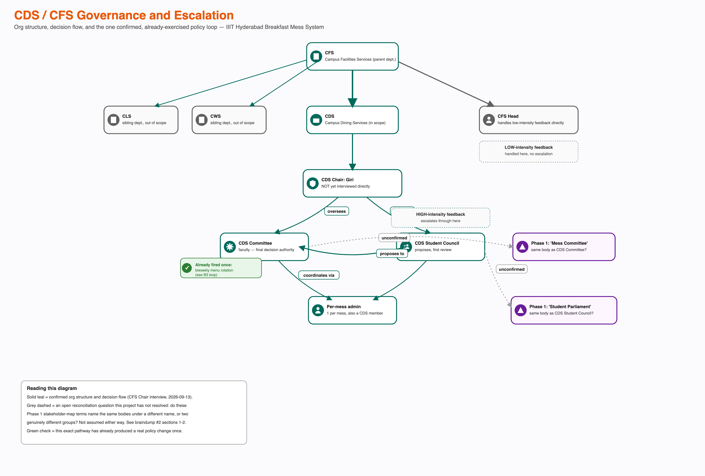

Whether "CDS Committee" is the same body as the "Mess Committee" named earlier in this project, and whether "CDS Student Council" overlaps with "Student Parliament," is left open in that diagram rather than assumed.

Each operator runs a structure of its own, and the two on-site operators sit at opposite ends. Kadamba's is a layered chain: CFS, then CDS, then Prism, then an operations manager, a manager, a supervisor and the service staff, with the supervisor constantly checking the counters and telling the kitchen how much to cook (single-sourced, heard first-hand). An earlier version of this map gave an operator chain running up to a director from a clip that was cut off and could not be tied to one mess; that version is revised, and Kadamba's own account replaces it. A facility team tastes Kadamba's food with two Prism staff before service; its identity is not known. Complaints reach operators through their own routes: at Kadamba, an email to the director passes to the manager and into a WhatsApp group that the institution's site team also reports into; at Bakul, from the CDS team to the manager, the kitchen and the managing director (both single-sourced; Bakul's route from noisy audio).

Yuktāhār has no hierarchy, in the site head's words, and everyone does every job (confirmed). Ajita is the mess in-charge, keeps the accounts and keeps the Wastage Book, and her records are cross-checked by other staff; Bhavani cross-verifies and writes the grocery register (single-sourced). An earlier version of this map named the Wastage Book's keeper from the recording as "Adit Amma"; the team's account names Ajita. Since *amma* is a Telugu honorific the two may be the same person, but that is not confirmed and they are not merged here. Records are cross-checked "not to find fault" (confirmed). The informal structure is what makes the books work. There is no formal leave policy: anyone who needs leave raises it at the daily meeting and colleagues agree to absorb the load. One project manager took all the staff to his farmhouse for training on what good quality looks like and what responsibilities to take, and staff describe a family-like culture (single-sourced). Waste measurement was introduced blame-free and only then accepted.

This escalation path has actually produced a real result before. A long standing complaint about having one fixed menu for the whole semester went through the Student Council to the Committee and came out the other side as a menu that now rotates every two weeks. That's the clearest working feedback loop found anywhere in this project. The operators confirm the cycle from their side: weeks one and three share a menu, as do weeks two and four, and Yuktāhār's production records are headed that way (confirmed). The rotation is also what makes Yuktāhār's matching-day waste lookup possible, a governance loop enabling a kitchen loop. The menu is chosen by students and the committee (single-sourced); operators see which items are wasted every time they appear, uttapam, set dosa and upma at Kadamba, while puri, bonda, vada and idli are eaten, and have no route to the menu owner for that knowledge. Kadamba dropped dinner sambar and a student complained that it had been removed while charges rose; the Bakul manager asked the interviewers for menu input (both single-sourced).

The Bakul manager's account makes this a tension about how a menu is formed, not only about who holds the data (single-sourced throughout, his view only). In his account students select the menu combinations, and his objection is to pairings rather than to dishes: kachori, he says, belongs with chole, and Raj Kachori is listed with chana where he would serve aloo curry. He describes students as reasoning from a balanced diet, protein, carbohydrate and individual preference, and himself as reasoning from traditional and regional combinations, taste and what people actually eat, drawing on about 20 years with North Indian food; he believes North and South Indian eating patterns differ. He mentioned a target of about 30 to 40 grams of protein a meal, without saying who set it or how it is computed. He also sees consumption by item that the menu owner does not: pav bhaji brings more students to breakfast, and quantities of muesli and Chocos such as 1 to 2 or 3 to 4 kilograms "go easily". Whether Bakul's residents share his view of pairings is untested, and which menu decisions students control and which he can override is not known. The menu owner is therefore missing two kinds of knowledge the operator holds, what is eaten and what goes together, and neither has a route to it (candidate).

```text
MENU FORMATION TENSION (the Bakul manager's account; the students' side not yet heard)

 Nutrition (protein about 30-40 g a meal) + item preference   ← students and committee choose
 Traditional pairing + regional familiarity + taste            ← the manager's experience
 Consumption by item (pav bhaji, muesli, Chocos go)            ← seen by the operator, unrouted
                                       ▼
                         MENU (pairings, not just items)
```

Outside the formal structure, Mess Cell operates as an informal resale market, Ping is the student publication that covers mess issues without any confirmed authority to act on them, and at least one unofficial tool exists for managing registrations outside the official portal. Yuktāhār's books are a different kind of institution: formal inside the kitchen, with keepers, cross-checkers and a reconciliation rule, but invisible to the formal governance of the mess. They hold the most detailed demand and waste data anywhere in this system, kept by the actor with the least authority over the rules that produce the demand.

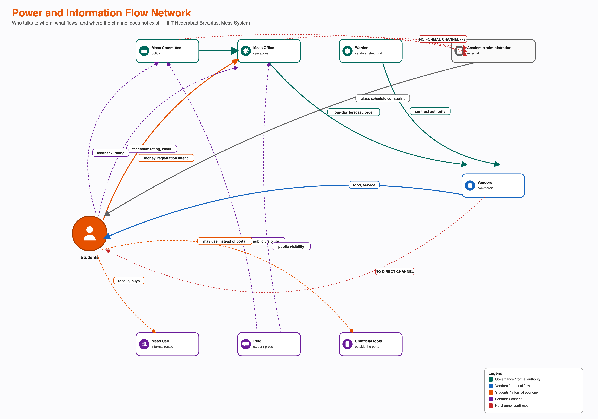

That network does not yet include the operator as a node, Prism, or the facility team. Placed on it, the operator would hold more information than any other actor and authority only over quantities. Academic administration has no formal or informal relationship to any part of mess governance. That's a confirmed absence, not a gap in the research. Mess Cell operates entirely outside the formal system it's compensating for.

# The Class Schedule, and Who Else Needs Breakfast

This project has, until now, treated 8:30 classes as just an obstacle. That's probably not fair to the academic side. It's a reasonable guess that the timing reflects something like putting harder lecture courses in the morning when students are freshest, letting a faculty member teach once and keep the rest of the day free, or simply fitting every program's required hours into a five day week using shared lecture halls. This document isn't recommending that class time move. Doing that would treat the academic system as though its only job is to make breakfast easier, when it's very likely solving a real problem of its own. The right way to treat the 8:30 start is as a fixed condition the mess system has to work around, not a lever anyone should expect to pull. The exam and event calendar is a different matter: it reaches the kitchen only if someone raises it in the operator's planning meeting, which is an absent information flow rather than a scheduling conflict.

Faculty and staff demand is smaller and better counted than earlier assumed. Yuktāhār's register counts faculty and staff diners separately, at zero to two per breakfast (confirmed). At Kadamba the number is larger than earlier assumed: 30 to 50 outside people, such as night-shift security, plus about half of Kadamba's own staff eat from the same food as students (single-sourced), which makes them part of how surplus is absorbed. Whether that meal is a written entitlement or an informal norm, and whether it is counted or billed, is not known. Whether ground and housekeeping staff who start before seven eat at any mess in real volume outside those counts is still unconfirmed.

Mess Cell is proof students can organize around a shared problem when they want to, there's even a past case of an organized student email effort producing a change. Right now though, that organizing energy goes entirely into helping each other resell registrations, not into pushing for a fix to registration or billing itself. Kadamba's manager independently describes students who register "even if you are in the village" while a friend eats in their place (single-sourced), a second actor's account of registrations moving informally. Whether Mess Cell has ever formally raised the billing model with the Committee or CDS isn't confirmed either way.

# The System Already Solved This Once

During a shortage of cooking gas, the mess cut down to serving one item at the same price, and the cancellation limit was doubled from five to ten a month. Separately, and more importantly, during holidays and long weekends like Felicity, when a lot of students leave campus, registration stopped being required altogether. Students could walk in and scan a QR code, or register just a day or two ahead at any of the four messes instead of being tied to one specific mess four days out. If someone didn't register and didn't show up, they simply weren't charged.

What this shows is that the institution already has, and has already run, a completely different way of matching food to demand, one that solves the exact gap this whole project is about. That changes the story from "nobody has figured this out" to "this has already been figured out, more than once, and isn't being kept." It doesn't undercut the finding that responsibility for this is scattered across different offices, it actually sharpens it.

An earlier version of this map explained why it doesn't stay on as protecting the vendor's four day lead time: a vendor could absorb an occasional surprise but not daily unpredictability. The operator evidence weakens that explanation. The kitchens already absorb daily unpredictability. They cook a fraction of registrations, watch the counter and top up, in 10 to 15 minutes on site and after a lead time not yet stated from Bakul's off-site kitchen, and Kadamba orders its perishables one day ahead, not four (single-sourced). The four day lock is longer than any perishable lead time the kitchens described, and Kadamba's team said so; only dry goods, bought a week ahead, are committed earlier, and they keep (candidate). The more likely remaining reason is commercial rather than operational: if operators are paid on registered plates, a walk-in model moves the cost of a no show from the student to the operator (candidate, pending the plate basis). Bakul's reported payment on plates served would, if it holds, mean that operator already carries that cost, but the report is one word, in tension with Kadamba's remark, and is not carried to the other operators (candidate). The exception works partly because it is rare and short, and partly because the kitchen's live top-up was already doing most of the work (candidate).

# Bottlenecks, Tensions, and What Actually Closes the Loop

An earlier version of this map named the four day ordering lock as the clearest bottleneck. That has been revised. The bottleneck is the cooked first batch, sized as a ratio of a registration count that is itself a standing booking, which can be topped up but never shrunk, together with the lag of every top-up against a crowd that, at Kadamba, crests in the last fifteen minutes. At Bakul the same bottleneck has a longer arm: the first batch leaves the Hafizpet kitchen before any turnout signal exists, and every top-up needs a phone call, cooking and a drive of 20 to 40 minutes, with the lead time not stated (single-sourced). Late in the window only food already held can meet late arrivals, which is the candidate reason the manager keeps food for about 50 people at 9:20. At Kadamba the pre-service safety sequence fixes that batch before 7:30, and what is left of it is held and reheated rather than written off (candidate), so the constraint costs quality as well as food. At Kadamba the 9:30 close is a nominal, precisely timed cutoff against a crowd that peaks right before it, and in practice it runs to between 9:35 and 9:45. There's no formal channel connecting Academic administration to mess governance at all, and no formal channel carrying the exam and event calendar to the operators. Waste is measured by at least one operator in fine detail, and it is not a signal for anything outside that kitchen. Not because it is ignored, but because there is no route for it to travel.

The clearest tensions are registering broadly against the system wide waste that produces, the resale market outcompeting the tool actually designed for this situation, menu predictability against the selective skipping it can enable, procurement certainty against matching food to real demand, a single registration model against a genuinely diverse set of dietary and cultural needs, and the operator holding the data against the institution holding the authority. Bakul adds an operator's own goal to the list: avoiding a shortage first, at the accepted cost of waste (single-sourced). A shortage is visible and routes a complaint up to the managing director, while a surplus is silent, so that floor reads as the kitchen-level form of a system that reacts only to what is loud (candidate). Off-site holding adds the quality of held food against both waste and shortage: any hedge that holds more food for longer trades them against texture (candidate).

Eighteen mechanisms were tested for whether they actually close into loops, not just whether they sound like one: the eleven from earlier analysis, L1 to L10 plus L3b, and seven added from the operator evidence, L11 to L17. The numbering is shared with the causal loop and feedback analysis. Three close with every link evidenced, all balancing: L4, L11 and L12. Five are candidate loops whose closing link is assumed: L1, L3b, L9, L15 and L17. Six are open chains: L2, L5, L6, L7, L13 and L14. L3 is contraindicated, L8 unresolved and L16 absent. L10 is a static condition. The first-hand account of both kitchens adds members to existing mechanisms rather than new ones: the extra diners join L9's absorbers, Yuktāhār's first-half-hour projection joins L12, and a surplus-to-reheat chain at Kadamba is described after L13 without a number of its own. The Bakul account adds no new loop either: its weekly adjustment is a candidate second instance of L11, bounded by a floor, and its transport delay sits inside L12.

L1, Speculative Registration and Resale: registering broadly feeds the resale market, and the resale market probably makes registering broadly feel safer, since there's a way to recover value from a slot you don't use. The closing link remains assumed, so it is a candidate reinforcing loop. The flat registration records now explain flat registration without needing it: an automatic booking that can only be exited four days ahead, five times a month, cannot track the morning's decision, whatever the motive behind it.

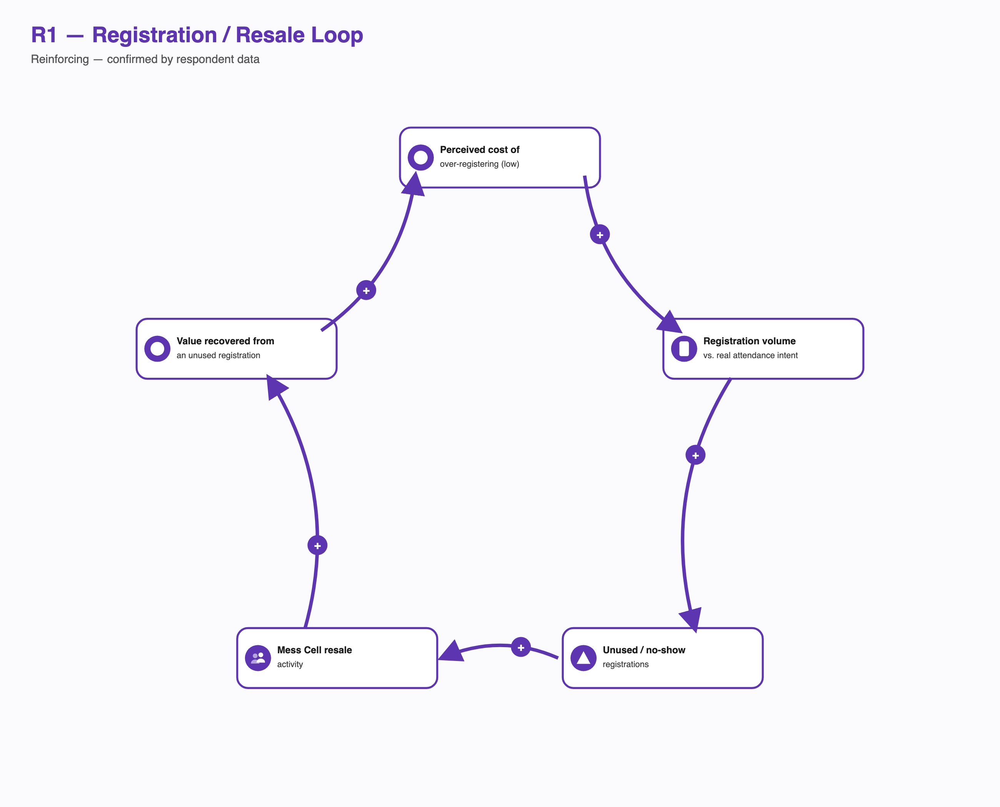

L2, Skip Meal: designed to stop the kitchen over preparing for a known no show. It's real and it functions on the institution's account, but almost nobody uses it, since it gives the student nothing back and does not remove the charge. None of the three operators named it as an input to planning, and Kadamba's operator says it cooks on registrations; whether a declaration lowers the count before the kitchen reads it is the open conflict set out earlier. A chain that does not close.

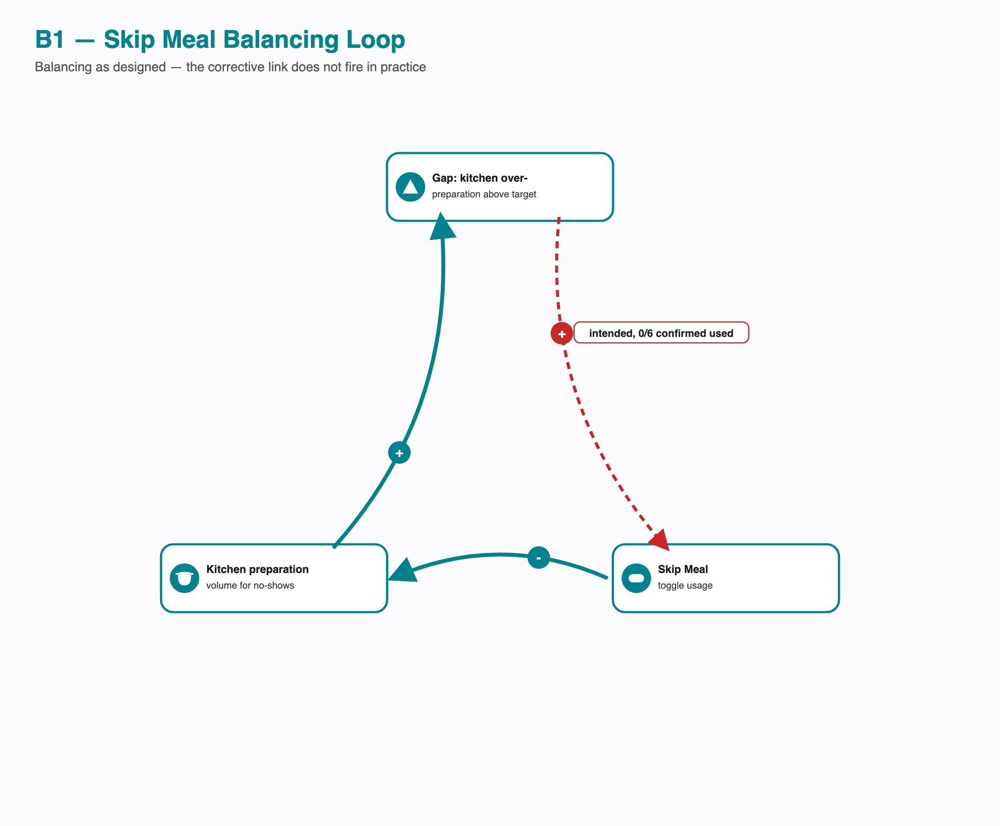

L3, Capacity Redistribution: the idea that scarcity at Kadamba would push people toward Bakul or Palash instead turns out to be the opposite of what actually happens. People lock down Kadamba harder when it's scarce, not less. Contraindicated as a balancing loop. L3b is the reinforcing version of the same story: scarcity at Kadamba drives defensive month-long registration, which keeps the slot scarce on the platform. The records fit its first links, about 1,070 registrations a day with 62.9 percent unused, but the link back to Kadamba's reputation is assumed, so it stays a candidate.

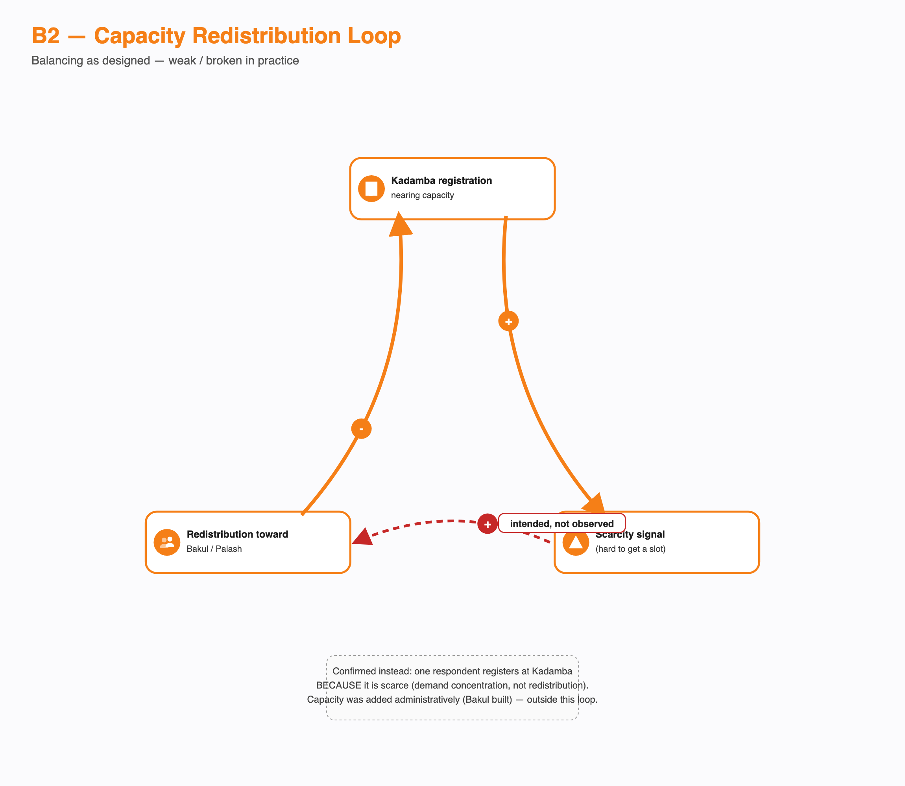

L7, Late Night to Skip to Crash: a late night, low sleep pattern driving next day skipping is well supported by what students actually said. Whether that skip then causes a later energy crash and a second round of late night behavior is not something anyone's actually checked yet. The arrival curve fits the first half: students who do come arrive as late as the window allows.

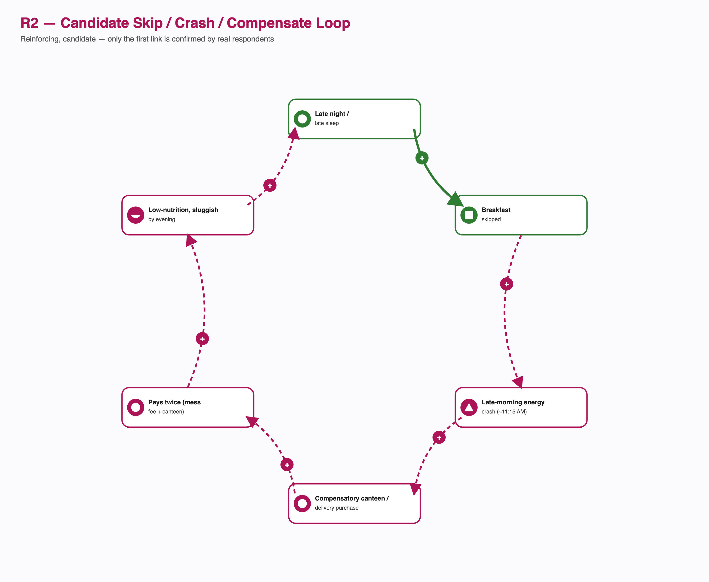

L4, Menu Rotation Governance: the cleanest governance loop in this project. Every link, from complaint to committee to an actual rotation, is confirmed directly by the person who ran it, and the operators' production records confirm the two week cycle from the kitchen side.

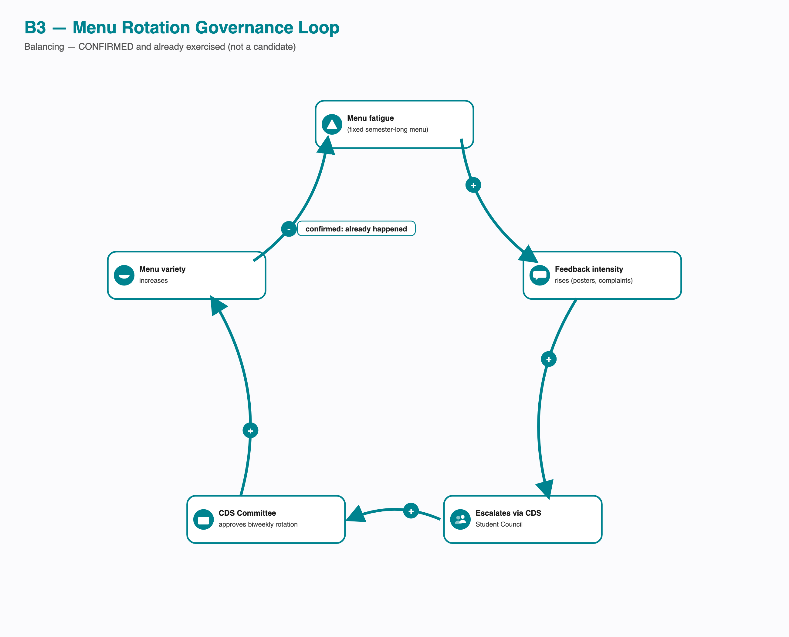

L5, Menu Transparency: the same fix created a side effect its own architect flagged unprompted. Once the menu is known ahead of time, some students may plan around it and skip on days they already know they'll dislike. Turnout does vary by item: Kadamba's non vegetarian breakfasts ran at 48.5 percent against 32.4 percent vegetarian (confirmed), and Yuktāhār's site head says queues are longer on aloo paratha and dosa days (confirmed). The skipping link itself remains a chain rather than a closed loop.

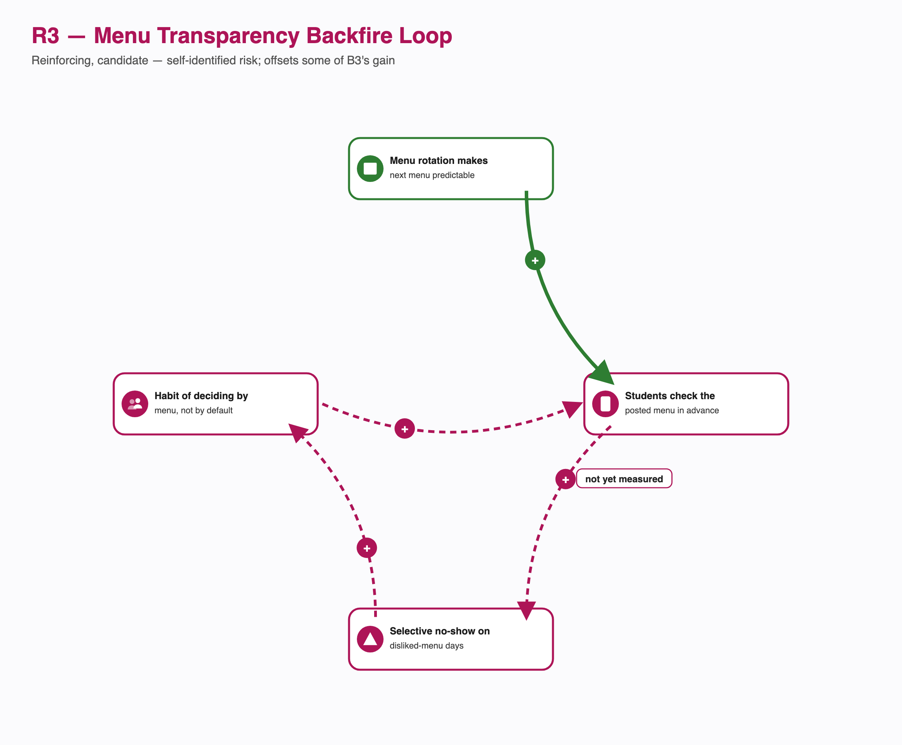

L6, Shock-Adaptive Registration Relaxation: the clearest proof the whole system can actually work differently. During the shortage and holiday exceptions described earlier, registration eased up, billing followed real attendance, and the operators absorbed some uncertainty in exchange for it, before everything reverted once the trigger passed. An earlier version of this map drew it as a balancing loop that limits itself through the vendor's loss of a four day planning horizon. That has been revised: the kitchens plan one day ahead, every link of the self-limiting reading was assumed, and the reversion is better read as a switch tied to the calendar. It is an open chain.

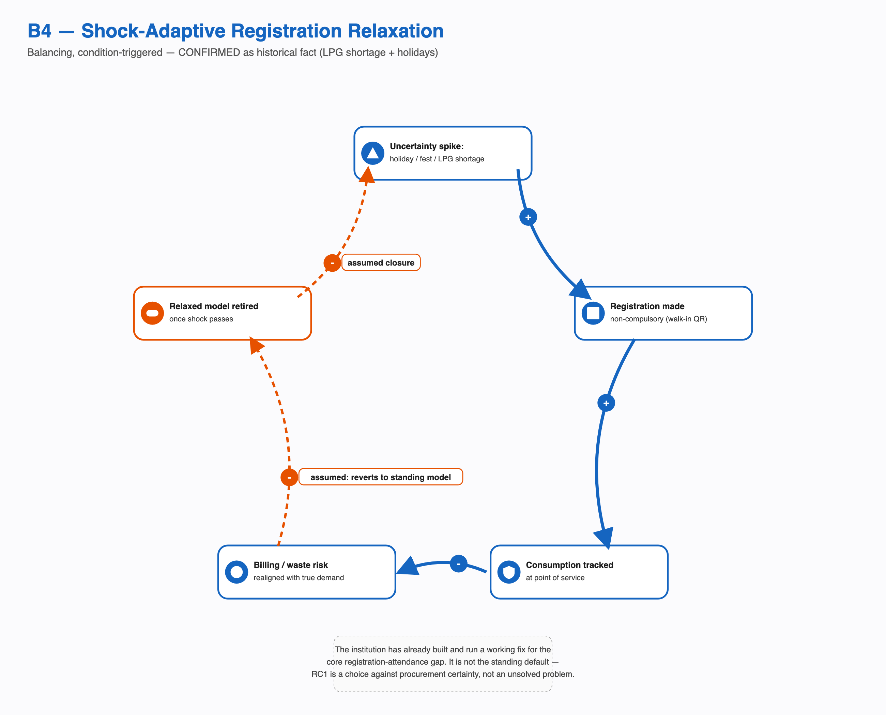

L11, Operator Waste-Learning, is a balancing loop that closes, confirmed at Yuktāhār only. Cooking more than is eaten on a given day raises that day's recorded leftover and moves its run-out time later; at the planning meeting two weeks later, when the same menu day recurs, the record, read together with the weekday register and the month's turnout pattern, lowers the issue quantity; a lower issue reduces the leftover. The wastage board keeps the target in view. Every link is confirmed from the operator's records and clear audio, and the staff's own report that waste fell between August and December is the outcome it predicts. Its delay is one to two weeks: the matching menu day recurs every two weeks, and the weekday register is applied the following week. It depends on L4: without the two week rotation there would be no matching day to look up. It has two limits. It corrects quantity only, never registration. And its reference point may be set wrong, since the site head's belief of 50 percent breakfast turnout sits well above his own recorded 28 percent. At Kadamba the loop is absent: a waste figure of 5 to 10 percent is quoted, with no base and no record seen, its manager says there is no forecasting method, and nothing carries a meal's outcome back to the 70 percent rule beyond the per-dish gram standards (single-sourced). At Bakul there is a candidate second instance. The manager reviews past attendance week by week and adjusts the first batch by item, which would close the loop against surplus, but by his own judgement with no record known, and only down to a floor of about 70 percent of registrations that he keeps even on low weekends (single-sourced). Below that floor the loop does not act. An earlier version of this map said the loop was unknown off site, and earlier project readings treated Bakul's kitchen as a fixed ratio with no learning; both are revised. L11 stays confirmed at Yuktāhār only, since no Bakul record exists to evidence its links.

L12, Counter Monitoring and Top-Up, is a balancing loop that closes within a single meal, confirmed at Yuktāhār and single-sourced at the other two operators. Food on the counter falls below the arriving crowd; a check or a request triggers a top-up; cooked food rises. At Kadamba the check is the supervisor's reading of what is left of each item against the time; at Yuktāhār it is anticipatory as well, since the first half hour is used to project the rest of the meal (single-sourced). That projection has a candidate blind spot: a sample from the opening half hour will underestimate a crowd that crests at the close, as Kadamba's does. Its delay is 10 to 15 minutes on site at Kadamba. At Bakul it is a phone call, cooking at the Hafizpet kitchen and a drive of 20 to 40 minutes, and the total is not stated (single-sourced); an earlier version of this map gave about 30 minutes from a noisy recording, which may have been the check interval and is not relied on. That longer delay has a candidate consequence: late in the window a top-up cannot arrive before close, so the only hedge against late arrivals is food already held, and the manager's reserve for about 50 at 9:20 is several times the 10 to 15 he says arrive in the last 10 minutes. The reserve is also the food held longest, so the hedge costs texture as well as risking waste (candidate). The loop is asymmetric. It protects against shortage and cannot reduce surplus, because a cooked batch cannot be uncooked and keeps only three to four hours. Surplus is corrected only by the slower L11 where it exists, and not at all where it doesn't. It also shows the kitchen can use same day demand information whenever it has it.

L13, Standing Booking to Fixed-Ratio Over-Preparation, is the core chain of the whole paradox. An automatic booking that can only be exited four days ahead, five times a month, keeps the registered count flat across the week; Kadamba converts that flat count into a first batch at a fixed private ratio, Bakul at a share varied by item and adjusted weekly by judgement but held above a floor, and Yuktāhār through its matching-week record, which calibrates items, all three starting from the registration count; turnout falls on some days and not others; over-preparation is therefore worst on the days turnout is lowest, and the surplus passes into the absorption routes, at Kadamba including the outside diners and staff and, candidate, reheating into later service. Every link is evidenced, by records for the flat count and turnout, by the poster and students' experience for the automatic default, and by the operators for the ratios. At Bakul the first batch and the weekend floor sit above even the highest breakfast turnout the manager expects, so over-preparation there is built in by design (candidate; no Bakul records exist to size it). Nothing runs from that surplus back to the booking or the rule, so it does not close, and that is why the gap persists.

Downstream of L13 at Kadamba sits a further open chain, candidate and unnumbered. Over-preparation leaves surplus in each batch; the surplus is held, reheated and moved between vessels for display and service; the food degrades; and poorer food could plausibly drive more skipping and complaints. The first links rest on the team's own judgement of what it saw rather than on the operator's statement, and the last link, back to skipping, is not evidenced at all. It is a chain, not a loop. If it holds, over-preparation costs quality as well as food.

L14, Closing Rush to Just-in-Case Over-Preparation, is an open chain with a candidate closing link. A crowd cresting in the last fifteen minutes outruns the top-up lag at Kadamba; items run out, queues form, the door is reopened; shortages are loud while surplus is silent; an operator raises its first-batch ratio; surplus grows on low turnout days, and nothing on the surplus side pushes the ratio back down. Every link up to the ratio is evidenced: the crest by records, the run-outs and reopened door by operators. An earlier version of this map rested the closing link on one operator moving from 70 to 80 percent; that reading is withdrawn, since the fuller account shows 70 to 80 percent as a share that varies by item and day, not a change over time. No operator is now known to have raised its ratio, so the closing link has no direct evidence and the chain is not drawn as a loop. Bakul's manager does hold the shortage-first stance the chain describes, but as a standing rule with a floor rather than as a drift upward (single-sourced). If it holds, over preparation at breakfast is partly a rational hedge against a delay, not only a misreading of registration.

L15, Soft Close, is a candidate reinforcing loop: reopening Kadamba's door for late arrivals, and admitting those who come to the back door after 9:30 because the mess cannot refuse them, may teach students that the close is soft, which would keep the crest late. Only the late admission is evidenced (single-sourced for both the reopening and the back door, with scans at or after 9:30 on every April day confirmed from records). L16, Operator Waste to Menu Choice, is absent: operators see which items waste, the committee chooses the menu, and no link joins them. L17, Kitchen Competence Shifts the Burden, is a candidate: the operators' discount, top-ups and reuse clear each morning's consequences locally (evidenced), which plausibly stops any signal accumulating upstream (assumed). The two on-site operators clear the gap with opposite motives, Kadamba out of an obligation to registrations it is paid for and Yuktāhār to cut cost and raise profit (single-sourced), and Bakul's operator clears it with a third motive, never to run short even at the cost of waste (single-sourced), which makes operator culture a candidate leverage point in its own right.

Several other candidates were checked and don't hold up as loops once actually tested. L8, the idea that falling attendance would pressure the vendor on quality, was earlier called flatly untrue on the grounds that vendor payment doesn't depend on attendance at all. That wording has been revised to match the evidence: operators are paid per plate, and if plates are counted from registrations the link is absent; if from plates served, it could close. It stays unknown until the contract's plate basis is known; Kadamba's remark that it is "getting paid for it" hints at registration but is not a contract term (candidate), while Bakul's operator describes its payment as based on plates served (single-sourced, one word in a normalized account). The two point in different directions, neither is a contract term, and L8 stays unresolved. L9, Waste Absorption, earlier called waste disposal effectiveness, holds that disposal quietly removes any pressure to fix what's upstream of it, closing back into more waste next cycle. Its members have been revised, since Kadamba does not compost: the absorbing routes are reuse, the outside diners and operator staff who eat from the same food (earlier given as 20 to 30 staff meals, now revised upward), surplus held and reheated into later service (candidate), the walk-in buffer and late service, with the garbage contractor's bin as the exit. It remains a candidate reinforcing loop, with its closing link assumed. L10, the Measured-But-Unrouted Gap, earlier called known but unowned, looks less like a spiral getting worse over time and more like a stable, stuck situation, and the operator evidence refines what it is. An earlier reading framed it as no one seeing the gap. The gap is seen, locally and repeatedly: in the institution's scan records, in Yuktāhār's attendance register with its own percentage column, in the operators' waste books, and in the Bakul manager's weekly review, where no record is known (single-sourced). Those who see it have authority only over quantities; the actor with authority over the rules does not appear to know the operators hold it. The missing link, from operator records and scan data to the registration and billing rule owner, is absent, not weak. A second inbound link is absent too: from the institute's exam and event calendar to the operators' planning meeting.

# Culture, Health, and What Isn't a Problem

Breakfast menus lean toward nutrient focused items like dal, sprouts, and plain rotations rather than the kind of food people actively crave, and that's a plausible, separate reason turnout is lower than lunch or dinner, on top of the billing incentive already covered. Breakfast turnout running far below lunch on the same days, under the same registration rules and the same operator, is now confirmed at Yuktāhār. Both explanations can be true at once. Bakul's manager offers an operator's version of the same two: students may not like the taste or the menu, or may not wake up or want to come (single-sourced, his view). The second agrees with what interviewed students say most often, late sleep. The first is his hypothesis; the six student interviews do not support food quality as a primary reason, and none of those students is known to live at Bakul. His example that pav bhaji brings more students to breakfast fits the item-level variation seen elsewhere, but it remains his observation, untested with Bakul's residents.

A recent outbreak of hand, foot, and mouth disease reportedly spread across both hostels, cause unconfirmed. This isn't being claimed as something skipped breakfast caused, that disease spreads through contact, not through nutrition. What's fair to say is that a chronic pattern of irregular eating combined with a lot of shared common spaces, mess halls, washrooms, playgrounds, is the kind of condition that makes an outbreak worse once it starts, whatever actually started it.

Some students have genuine reasons for not eating breakfast that have nothing to do with any of the above: intermittent fasting as a deliberate choice, a belief that they're already healthy enough not to need it, family or regional habits that never included a formal breakfast at all, dietary or religious practice, or simple discomfort eating certain foods, like egg, somewhere visible and shared. None of that is dysfunction, and a meaningful share of what looks like low turnout is really just how a genuinely diverse group of people eats. That doesn't undercut the billing and governance findings elsewhere in this document, but it does mean no future fix should be judged by whether it gets turnout close to one hundred percent. The measure that matters is whether what is cooked tracks what is eaten.

# What Stands Out Most

The institution has already built and run a working fix for the core problem. It just isn't the standing default, and the reason now looks less like the kitchens needing four days' notice, since they don't, and more like who pays for a no show. The registration to turnout gap is not hidden: it is measured by the institution's scans and by the operators' own registers, and acted on inside the kitchen every day, but no route carries it to the people who set the rules. Yuktāhār's kitchen is the most data rich actor in the system and one of the least powerful. Yuktāhār, Kadamba, and Bakul (Vijayalakshmi Caterers), fed from the Hafizpet kitchen, run three different planning rules, from a documented balancing loop built on paper books, through a weekly judgement held above a shortage floor with a transport delay, to a fixed ratio, so findings from one shouldn't be assumed to apply everywhere, and the two on-site kitchens, under identical rules, are the clearest comparison the project has. Breakfast is the problem meal; at Yuktāhār, lunch mostly works. At Kadamba arrivals crest in the last fifteen minutes, and Yuktāhār's site head describes the same, which is why shortage and waste happen on the same morning; Bakul's manager places his rush earlier, so arrival curves need reading hall by hall. Reuse, the outside diners and staff who eat Kadamba's surplus, the bin and the resale market all do the same job in different places: they absorb a cost quietly enough that nobody's ever forced to fix what's actually causing it, and each does real good while doing it. By its operator's account, Kadamba's waste goes to a garbage contractor, not to compost. The class schedule almost certainly has its own good reasons and shouldn't be treated as something to just change. And a real share of what looks like a paradox is simply legitimate variation in how people eat, not something to solve away.

# What's Still Missing

The operators have now been interviewed, and the kitchen's planning mechanism, the crowd curve and the scope of the CFS Chair's breakfast figure are answered by their accounts and by records. What remains open:

- The contract's plate basis: whether operators are paid on registered plates or plates served. This decides who bears the cost of a no show, whether L8 could close, and whether any permanent version of the walk-in model is commercially possible. Bakul's operator now reports plates served and Kadamba's remark points to registrations; the contract wording, per operator, would settle both.
- Composting versus the bin: the institution's account and Kadamba's operator disagree, and Yuktāhār's disposal route was not stated. Direct observation of waste disposal has not been done.
- Whether Palash is served by the same operator and kitchen as Bakul. Bakul's own manager has now named the hall, the operator and the Hafizpet kitchen, which answers the question for Bakul.
- At Bakul: whether anything in the weekly adjustment is written down; the actual lead time of a top-up from the Hafizpet kitchen, and what happens when a top-up is still not enough; whether the reserve for about 50 at 9:20 comes from data or judgement, and how much is left at close; why Bakul's own residents skip breakfast; and which menu decisions students control and which the manager can override.
- Whether Skip Meal declarations reach the kitchen: the institution's account, since confirmed by a second source, says they do; no operator named it, and Kadamba's operator says it cooks on registrations. Whether a declaration lowers the count before the kitchen reads it would reconcile the two.
- Whether any operator has ever changed a standing ratio, which tests L14's closing link. The earlier reading that Bakul's operator raised its ratio from 70 to 80 percent is withdrawn.
- Whether the roughly 9 percent of Kadamba scans after 9:30 are door reopenings, back-door entrants or a later actual close, and whether back-door entrants are scanned at all.
- Scan records for lunch and dinner, and for Bakul, Palash and Yuktāhār, to extend the breakfast specific finding beyond two halls; Yuktāhār arrival times would also show whether its first-half-hour projection misses the closing crest.
- The base of Kadamba's 5 to 10 percent waste figure, how it squares with a 70 percent first batch against 37 percent turnout, and whether any waste record can be seen.
- Whether the 30 or so extra portions for outside diners and the 30 to 40 portion walk-in buffer are one allocation, and whether the outside diners' and staff's meals are an entitlement, counted or billed.
- Direct observation of whether Kadamba holds and reheats surplus, which the reheat chain after L13 rests on.
- Which Yuktāhār record drives planning where two disagree: on 3 September the production sheet shows 77 breakfasts eaten and the attendance register 110.
- Whether Yuktāhār buys groceries fortnightly, as the stock register implies, or the week before use, as the operator describes.
- Whether registration is made in weekly blocks, as Kadamba's operator describes it, or monthly and automatically, as students experience it, or both seen from two sides.
- Whether Ajita, named as the Wastage Book's keeper, is the person the recording called by an honorific.
- Who the facility team is that tastes Kadamba's food with Prism, and whether the faculty quality control visits are the weekly inspection.
- Whether one person runs Kadamba's inventory, or whether that reading came from a misheard "no backup."
- The exact meaning of Kadamba's two capacity numbers, which the records now point toward without settling, and which of the two portal addresses is correct.
- Who heads CDS, since two names are on record (Giri as Chair, Raju as head), and a conversation with that person and with the mess committee directly, still pending.
