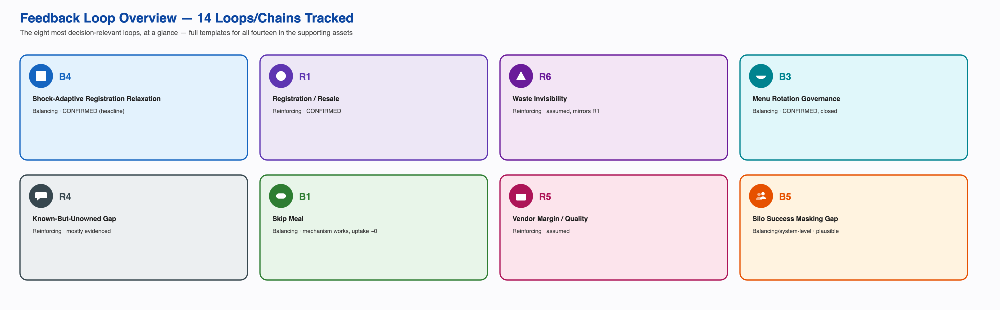
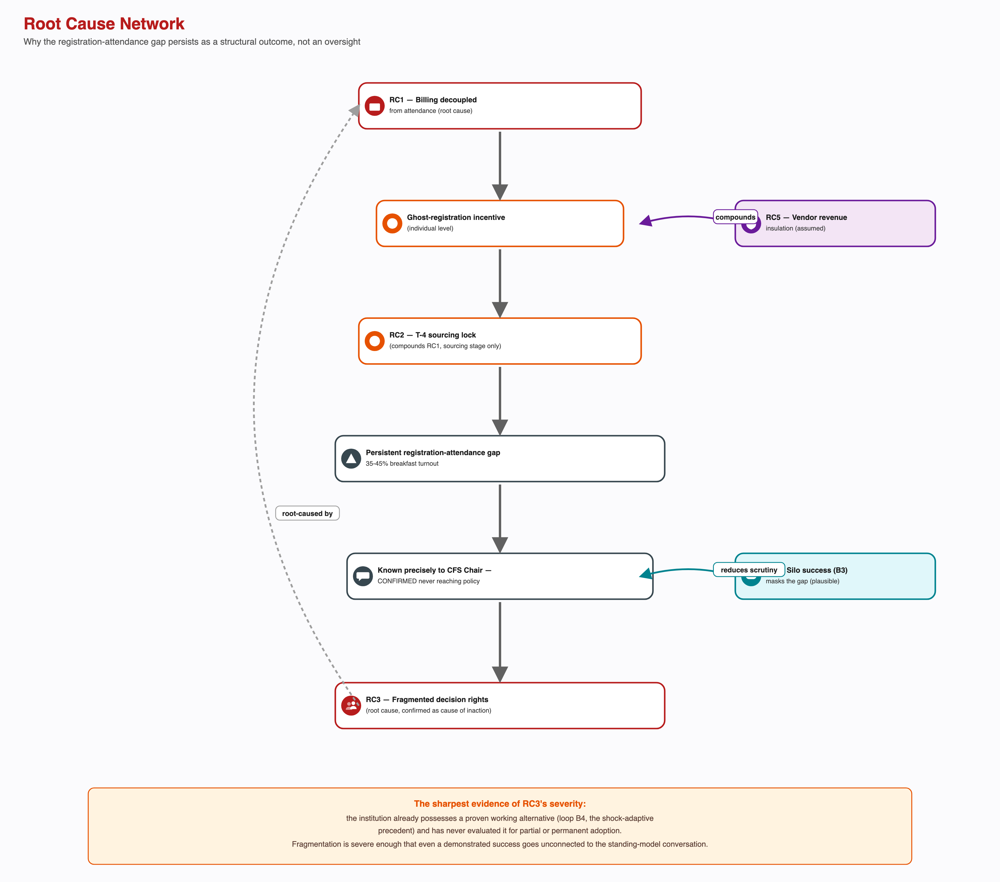

# Overview

Task 6 mapped the system's actors, flows, and causal loops. This analysis moves one level down: from what the system looks like to why it keeps producing the same outcome — a persistent gap between students registering for breakfast and students eating it — even though almost every actor in the system, including the institution itself, is behaving in a locally coherent way. It distinguishes what was directly observed from what repeats, from the rules and incentives that make it repeat, from the beliefs that make those rules go unquestioned, then names the feedback loops, the unintended consequences, and the structural root causes underneath.

The single finding that changes the shape of this diagnosis: **the institution has already built, and already run, a working fix for the core paradox.** During LPG-shortage and holiday conditions, registration became non-compulsory and billing tracked actual walk-in attendance instead of pre-committed intent, with the cancellation cap simultaneously raised from five to ten per month. This is not a hypothetical intervention — it is a real, previously deployed mechanism. The paradox is not that nobody knows how to fix this; it is that the fix stays exceptional rather than becoming the standing default, for a structurally coherent reason — vendor procurement lead-time certainty — that this analysis takes seriously rather than dismissing as inattention alone.

This analysis also sets an honest ceiling on its own scope: a meaningful share of "low breakfast turnout" is not dysfunction at all. It is legitimate cultural, religious, and individual variation that a one-size-fits-all registration model was never built to distinguish from the paradox it is trying to explain.

Every claim below is written as **confirmed** (directly stated by a named source or observed directly), **single-sourced** (one respondent or one account, not independently cross-checked), **candidate** (a plausible, named mechanism not yet independently verified), or **assumed** (a systems-thinking inference explicitly authorized this session to widen the map honestly, used freely but never carrying the weight of a confirmed claim). Nothing below is asserted more strongly than its own evidence status supports, and the fictional Rohan/Adit scenario from the original problem brief is not used anywhere here as evidence — only as the framing device that motivated the question.

# Distinguish Events, Patterns, Structures and Mental Models

**Events** — specific, individually confirmed occurrences:

- A student registered for and was charged a Kadamba breakfast (~₹48) and did not attend — a repeated personal pattern, not a one-off, **single-sourced**.
- The CFS Chair states sourcing locks four days before serving (T-4) for vendor procurement, while same-week Skip Meal declarations are used separately to adjust the kitchen's prep-quantity forecast — **confirmed**, a two-stage pipeline, not one rigid freeze.
- The CFS Chair gives category-level turnout figures: high-demand items above 90%, general items around 70%, breakfast specifically 35-45% (a tentative range spanning two figures given at different points) — **confirmed**.
- Six respondents each describe specific mornings when items ran out — idli, puri, bhatura, fruit — concentrated near the 9:30 close, and on one sampled date Kadamba ran at 51-79% of registered capacity against Bakul's 11-31% on the same date — **confirmed**, the strongest direct evidence in this project that the gap is real, quantifiable, and varies sharply by mess.
- A November 2024 unilateral non-veg cancellation at Kadamba (referred to by respondents as "Let Them Eat Frogs") and a December 2024 tightening of the cancellation cap are both named, dated events — **single-sourced**, not independently cross-confirmed by an institutional source in this project's evidence.
- The CFS Chair's awareness of the turnout gap has never reached a registration or billing policy discussion — **confirmed** directly.
- During the LPG shortage and past holidays, registration was made non-compulsory (walk-in QR, no billing penalty for non-attendance) and the cancellation cap was raised from five to ten per month — **confirmed**.
- A public mess poster shows two different domains for the same registration portal — **confirmed**.
- Kadamba runs an automated, pre-plated kitchen; Yuktahar cooks manually and live, with separate Jain and pure-vegetarian lines; Palash is under construction and, together with Bakul, is currently served from one external vendor — **confirmed**.

**Patterns** — the same shape recurring across people or across time:

- Registration consistently exceeds attendance, concentrated specifically in breakfast, at a scale large enough that a formal cancellation cap exists to manage it — **confirmed** at the category level, **single-sourced** at the individual level.
- The mechanism behind Skip Meal now reaches the kitchen and adjusts same-week prep-quantity, but real usage of it across respondents who addressed it is close to zero — the tool works; almost nobody uses it, a sharper and different finding than "the tool is broken."
- All respondents register monthly, not day by day — a universal pattern, not an individual habit.
- **No single population-level attendance trend exists** — real respondents move in different directions over the same semester; any future claim that the paradox is worsening or improving needs to specify for whom, not assert it generally.
- A recurring institutional shape, **single-sourced**: a complaint is raised, goes unaddressed, and is only reactively resolved after a further incident — the December 2024 cancellation episode, and a separate, unrelated water-quality episode at the same institution in 2023, both fit this shape.
- The institution has already run a full attendance-based billing model during shocks, and retires it once the trigger passes — **confirmed**, the headline pattern of this analysis.

**Structures** — the rules, incentives, information flows, timing, and power distributions producing the patterns above:

- Billing tied to registration count, not attendance — the single structure behind the largest share of symptoms in this project.
- A two-stage pipeline: sourcing locked four days out (rigid), prep-quantity flexed same-week via Skip Meal data (responsive) — **confirmed**, refined this pass.
- A proven, previously deployed attendance-based billing model, reserved for shock and holiday conditions only.
- Three structurally distinct kitchen-and-supply systems (Kadamba automated, Yuktahar manual, Bakul/Palash temporarily external) running under one "mess" label.
- Decision rights split four ways — menu (Mess Committee), execution (kitchen/vendor), academic scheduling (formally outside mess governance), and billing/registration policy — with no single actor owning the registration-attendance outcome end to end.
- Waste tracked categorically (compost, food-safety sampling) but never by volume, with no link back to registration or procurement policy.
- The academic timetable's 8:30 AM start has its own defensible institutional logic (faculty-scheduling economy, room contention, cognitive-freshness sequencing), **assumed** — not a naive scheduling oversight to be corrected by this analysis.

**Mental models** — the beliefs underneath the structures, none directly stated by name except where noted, but consistent with everything observed:

- **Students:** a registration, once made, costs nothing extra to leave unused, since the bill is identical either way — inferred from repeated behaviour, not a direct quote.
- **The institution, confirmed this pass:** aggregate registration is treated as an adequate demand proxy for procurement, as a standing policy — the practice continues even though the same office can name the exact size of the gap, and even though the institution has already run and retired a working alternative. This is the most strongly evidenced mental model in the whole analysis.
- **The institution, assumed:** procurement certainty is worth more than demand-matching accuracy, as a permanent default rather than a case-by-case judgment — inferred from the fact that the shock-adaptive model is retired immediately once its trigger passes, rather than evaluated for partial or permanent adoption.
- **CFS/Mess Committee:** more menu transparency is straightforwardly good — a belief the CFS Chair is visibly revising, having self-identified a risk that posting the menu in advance may concentrate attendance on "good" days.

# Identify Reinforcing and Balancing Feedback Loops

Fourteen loops and chains are tracked in total across this project; the eight most decision-relevant are shown below. Full templates for all fourteen are in the supporting assets.

**B4 — Shock-Adaptive Registration Relaxation (balancing, condition-triggered, confirmed) — the headline loop.**

During a supply shock or a holiday, registration is made non-compulsory and billing tracks actual walk-in consumption instead of pre-committed intent, realigning waste and cost with true demand. The institution reverts to the standing model once the trigger passes, most plausibly because a walk-in model generalized to every day would remove the vendor's lead-time guarantee entirely — a real trade-off, not merely inertia. This single loop is the strongest evidence in the project that the paradox is solvable with a mechanism the institution has already built, tested, and shelved.

**R1 — Registration/Resale (reinforcing, confirmed).**

A textbook Shifting the Burden structure: the Mess Cell resale market recovers value from an unused registration, comfortably enough that nobody is ever forced to fix billing itself. The workaround's success is exactly what lets the root cause persist.

**R6 — Waste Invisibility (reinforcing, assumed) — the same archetype, on the supply side.** Ghost registration generates waste; the waste is composted and food-safety-sampled competently enough that it never becomes a visible cost pressuring a policy change. Waste management and the resale market are the same Shifting-the-Burden shape appearing twice in one system.

**B1 — Skip Meal (balancing, mechanism confirmed, uptake near-zero).** The tool now demonstrably changes what the kitchen prepares same-week. The problem is no longer "does this work" — it is "why does almost nobody use it."

**B3 — Menu Rotation Governance (balancing, confirmed, closed).**

Menu fatigue raised feedback intensity; intensity escalated through the CDS Student Council; the Committee approved a biweekly rotation; variety increased; fatigue reduced. Every link confirmed directly — proof the institution can and does run closed feedback loops in general.

**R4 — Known-But-Unowned Gap (reinforcing, mostly evidenced).** The CFS Chair's awareness of the gap, combined with confirmed fragmented ownership and confirmed inaction, normalizes the gap as "how the system has always worked," reducing the urgency of raising it again.

**R5 — Vendor Margin/Quality Trade-off (reinforcing, assumed).** Decoupled billing plausibly protects vendor revenue from attendance too, not just the student's incentive to register accurately — removing market pressure on the vendor to protect quality as attendance falls.

**B5 — Silo Success Masking Systemic Gap (plausible).** The menu-governance loop's own visible success may reduce institutional appetite to audit the quieter, unquantified-by-complaint registration/billing gap — silence read as absence of a problem.

**A rejected candidate, tested and not promoted:** an under-provisioning chain (T-4 lock → shortage at peak times → students turned away) is directly evidenced up to the shortage itself, but no respondent ties a past shortage to a subsequent registration change — without that closing link, it is a real causal chain, not a loop, and is used as a chain in the unintended-consequences table below rather than diagrammed as one.

# Analyse Unintended Consequences

| Rule or action | Intended function | Observed response | Unintended consequence |
|---|---|---|---|
| Billing tied to registration, not attendance | Administrative simplicity, predictable vendor revenue | Some students register out of habit regardless of intent to attend | A known, quantified procurement-planning distortion (35-45% breakfast turnout) that has never reached policy discussion |
| Cancellation cap | Limit uncancelled no-shows / reduce admin workload | Used inconsistently; non-attendance beyond the cap has no formal outlet | Real non-attendance signal is pushed into the informationally invisible Mess Cell resale channel |
| Skip Meal | Reduce kitchen over-preparation | Mechanism now confirmed functioning; real usage near-zero across respondents who addressed it | A well-designed tool whose benefit is not being realized, for reasons not yet diagnosed |
| December 2024 cancellation tightening | Reduce Mess Office workload | Reduced student flexibility to correct a registration close to service | Single-sourced, but plausibly increases rather than decreases the pattern of uncancelled no-shows it targeted |
| Composting/food-safety sampling | Regulatory compliance, waste disposal | Waste tracked categorically, never by volume | A well-functioning disposal channel that removes the one visible signal that might otherwise force a demand-planning conversation |
| Shock-adaptive registration relaxation | Cope with a short-term demand-uncertainty spike | Works as intended, then is retired once the trigger passes | A demonstrably working alternative sits inside the institution's own operating history without ever being evaluated for permanent or partial adoption |
| Mess Cell (emergent, not a designed rule) | Not applicable | Absorbs unused registrations for the students who use it | Genuinely helps its users while quietly reducing the pressure that would otherwise force a fix to the billing model |

# Identify Structural Causes and Systemic Tensions

**Root cause 1 — billing is decoupled from attendance (standing model only).** The single structure behind the largest share of symptoms in this project: no-shows, the cancellation cap's existence, Skip Meal's limited traction, and the resale market's success all trace back to the same fact — cost is incurred at registration, not at consumption. The institution's own shock-adaptive precedent shows this is a choice, not a technical necessity: it has already run the alternative and it worked.

**Root cause 2 — decision rights are fragmented across menu, kitchen execution, academic scheduling, and billing policy, with no actor owning the outcome end to end — confirmed this pass as the reason the known gap has never reached policy discussion**, not merely a plausible explanation. This also explains why a proven working alternative (the shock-adaptive model) has never been evaluated for standing adoption: the fragmentation is severe enough that even a demonstrated success inside the institution's own history goes unconnected to the conversation that could generalize it.

**An intermediate mechanism, not an independent root cause: the T-4 sourcing lock.** Real and structural, but narrower than it first appears — it caps ingredient-sourcing responsiveness specifically, not same-week prep-quantity, which already flexes via Skip Meal. Removing it alone would not touch the incentive (root cause 1) that inflates registration numbers in the first place.

**Tension — individual rationality against system-level cost.** Registering broadly, keeping a slot at a scarce mess, and reselling rather than cancelling are each rational responses to the incentives an individual student actually faces. The aggregate of many individually rational choices is exactly the waste, the queue crowding, and the run-outs this project set out to explain. No actor is behaving irrationally; the system's own structure produces the paradox from ordinary, sensible individual behaviour.

**Tension — procurement certainty against demand-matching accuracy, at the institutional level.** The sharpest tension in this analysis, because both sides have been directly, historically demonstrated as achievable — the shock-adaptive precedent proves demand-matched billing works, while the standing model shows the institution is not currently willing to trade away vendor lead-time certainty to run it permanently.

**Tension — a one-size-fits-all registration model against legitimate cultural and dietary variation, assumed.** A materially meaningful share of "low turnout" is a diverse student population eating according to regional, religious, or personal practice the registration model was never built to distinguish from the paradox.

**Tension — administrative simplicity against demand-matching, at the operational level.** Billing-by-registration and the sourcing lock both optimize for administrative and kitchen-planning simplicity; that same optimization is what prevents the system from ever matching food produced to food actually eaten.

# Map the Root Cause Network

The network above reads top to bottom: decoupled billing produces the ghost-registration incentive, compounded by the sourcing lock, producing a persistent gap that the CFS Chair can name precisely — a gap confirmed never to reach registration-policy design, because of fragmented decision rights sitting structurally above both. Two side factors compound this from different angles: a plausible vendor interest in leaving the standing model exactly as it is (protected revenue, assumed), and the menu-governance loop's own visible success plausibly reducing scrutiny elsewhere (plausible). The sharpest evidence of how severe the fragmentation is: the institution already possesses a proven working alternative and has never evaluated it for adoption.

# Structural Power and Consequence Asymmetries

Students bear the full financial and time cost of the registration-billing mismatch while controlling none of the levers that produce it. The CFS office holds the most precise diagnostic information in the system — the exact turnout split by category — while Task 3's power analysis found its authority over registration and billing *policy* specifically to be unconfirmed, meaning the office with the clearest picture of the problem may not be the office empowered to redesign the rule causing it. Students individually control the one input (registration intent) that most determines the accuracy of the whole downstream pipeline, while bearing no cost for inaccuracy beyond their own bill. A newly identified asymmetry this pass: a vendor with a plausible financial interest in decoupled billing is, structurally, the least visible stakeholder in every governance conversation about fixing it. Faculty and early-shift staff, if they consume mess food in any volume, are the least visible demand stream of all — absent from every registration, sourcing, and forecasting number in the system.

# Workarounds as System Signals

The Mess Cell resale market functions as a release valve: genuinely useful to the students who use it, and exactly what removes the pressure that would otherwise force a fix to the underlying billing structure. Composting functions the same way one level downstream — a well-functioning disposal channel that never becomes a visible cost. Both are real, individually beneficial adaptations that collectively let the core structural cause go unaddressed.

# System Archetypes

**Shifting the Burden, two independent instances.** Instance one: the Mess Cell resale market symptomatically relieves ghost registration without anyone needing to fix billing itself. Instance two, structurally identical: composting symptomatically disposes of the resulting waste without anyone needing to measure or reduce it. A system with this many well-functioning absorption mechanisms may be structurally resistant to ever generating the pressure a fundamental fix would require, regardless of how reasonable each individual coping mechanism is.

**Fixes That Fail, single-sourced, not promoted to a confirmed finding.** The reported December 2024 cancellation-cap tightening — a workload-relief measure — plausibly increased rather than decreased the pattern of uncancelled no-shows it targeted. This rests on one account, not independently corroborated by an institutional source, and is named as a candidate rather than asserted as established.

# Systemic Problem Diagnosis

**Short:** Breakfast attendance is low partly because billing, procurement timing, and governance authority don't connect registration accuracy to any consequence — and partly because a meaningful share of "low attendance" is legitimate variation, not a problem at all. The institution has already proven it can fix the first part; it has chosen not to run that fix as the default, because doing so would cost it something real that this analysis takes seriously rather than dismissing.

**Detailed:** The Breakfast Paradox is not "students skip breakfast," and it is not "nobody has figured out how to fix registration." Billing decoupled from attendance, a two-stage sourcing/prep pipeline, and decision rights split across menu, kitchen execution, academic timetabling, and billing policy together produce a persistent, quantifiable registration-attendance gap that the institution's own CFS office can name precisely — and that same institution has already built and run a working alternative during shocks and holidays. The paradox is that this proven fix stays exceptional rather than becoming standard, most plausibly because it trades away a procurement certainty the vendor relationship depends on, and because fragmented decision rights mean no actor has ever had to weigh that trade-off explicitly against the now-confirmed, quantified cost of leaving it as is. No actor in this system currently holds both the authority and the incentive to fix the mismatch end to end. This is a system reproducing its own outcome through several interacting, individually reasonable mechanisms, with a solution already sitting inside its own operating history.

# Key Findings

1. The institution has already built and run a working fix for the core paradox — the shock-adaptive precedent — reframing the standing model's decoupled billing from an unsolved problem to a deliberate, unexamined trade-off against procurement certainty.
2. The registration-attendance gap is known precisely by the CFS office and confirmed to have never reached registration or billing policy discussion — fragmented decision rights are the confirmed, not merely plausible, reason.
3. Skip Meal's mechanism now demonstrably works; adoption among students does not. The open question is adoption, not design.
4. Kadamba, Yuktahar, and Bakul/Palash are three structurally different kitchen-and-supply systems under one label; sampled attendance varies sharply between them (51-79% vs. 11-31% on one date).
5. Decoupled billing plausibly protects vendor revenue from attendance too, not only the student's incentive to register accurately — a newly identified, symmetrical stakeholder interest in the standing model.
6. Waste management and the informal resale market are the same Shifting-the-Burden archetype, twice — both well-functioning absorption mechanisms quietly remove the visible cost that would otherwise force structural change.
7. A meaningful share of low breakfast turnout is legitimate cultural, religious, or individual variation, not dysfunction — no future intervention should be framed as closing the gap to near-zero.
8. No actor in the system currently holds both the authority and the incentive to fix the core mismatch end to end — the closest candidate, Academic administration, holds authority over the one lever most likely to help and no formal connection pulling it toward using it.

# Outstanding Data Collection

Why Skip Meal uptake is near-zero despite the mechanism now confirmed to work is the single highest-priority open question, followed by whether the vendor's contract terms would allow a partial or permanent version of the shock-adaptive model — the most consequential question for any future intervention, though answering it is out of scope for this diagnosis-only document. Also open: whether faculty or early-shift staff consume mess food in any volume not reflected in sourcing or prep-quantity forecasting; the exact scope of the CFS Chair's turnout figures (all four messes or Kadamba only, and over what window); independent confirmation of the November 2024 and December 2024 cancellation-policy events beyond a single account; and direct observation of a live breakfast service window, still not conducted. The mental-model layer above is inference from confirmed structures and consistent behaviour, not from any respondent naming their own assumptions directly — stated as inference, not fact, throughout. Both items are pending the same institutional approval already logged against Tasks 3-6.
