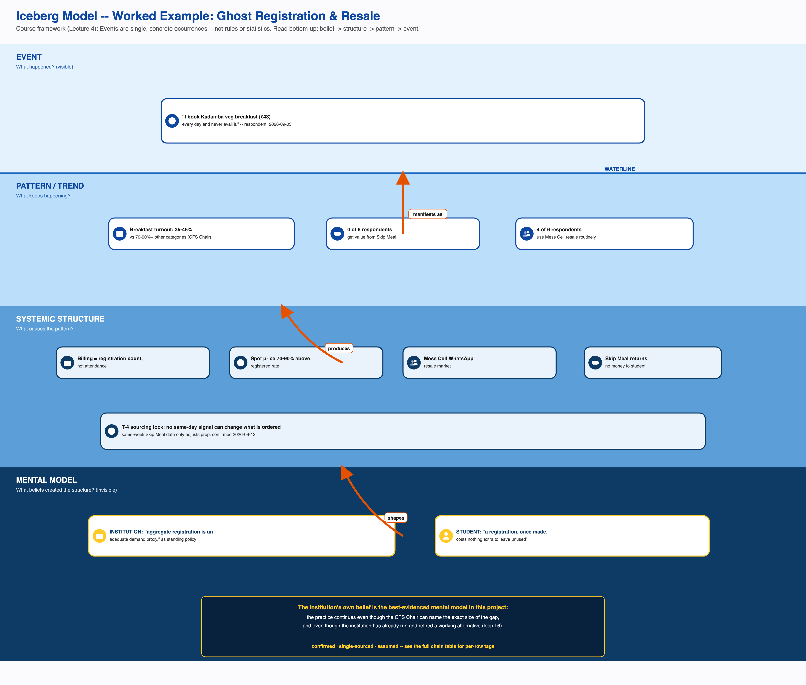

# Overview

Task 6 mapped the system's actors, flows, and causal loops. This analysis moves one level down, using the Iceberg Model exactly as this course teaches it (Lecture 4): an **Event** is a single, concrete thing that happened — not a rule, not a statistic, not a design fact. A **Pattern** is the trend across many such events. A **Structure** is the rule, incentive, or design that produces the pattern. A **Mental Model** is the belief that keeps the structure in place. Read bottom-up: a belief shapes a structure, a structure produces a pattern, a pattern manifests as an event. An earlier pass through this analysis mislabeled standing facts about the system's design — "registration locks four days before serving," "the CFS Chair gave turnout percentages" — as Events. Those are Structures and Patterns respectively. This version corrects that and rebuilds every layer from real, dated, individually-confirmed occurrences.

Every claim below carries one of four tags: **confirmed** (directly stated by a named source, or independently corroborated), **single-sourced** (one respondent or one account, not cross-checked), **candidate** (a plausible, named mechanism not yet independently verified), **assumed** (a systems-thinking inference, used freely but never carrying the weight of a confirmed claim). Every feedback mechanism was tested for actual closure — a chain only counts as a loop if its last variable causally returns to affect its first — and several mechanisms previously called loops are corrected here to open chains, or in one case a disconfirmed mechanism, because they do not close. The fictional Rohan/Adit scenario from the original problem brief is not used anywhere as evidence.

The single finding that most changes the shape of this diagnosis: **the institution has already built, deployed, and successfully run a working alternative to its own standing registration-billing model.** During an LPG/cooking-gas shortage in India and during holidays and long weekends such as Felicity fest, registration became non-compulsory — students could walk in and scan a QR at the point of service, or register just one to two days ahead at any of the four messes rather than being locked to one — and a student who neither registered nor showed up was simply never billed. The cancellation cap was simultaneously doubled from five to ten per month. This is a real, historical operating fact, not a hypothesis, and it is the centerpiece of the whole diagnosis (Section 10 gives it in full, exhaustive detail, exactly as the evidence describes it, leaving nothing to assumption that is actually specified in the sources).

---

# 1. The Iceberg Model — Events, Patterns, Structures, Mental Models

Six separate causal chains are built below, each traced from a real Mental Model down through a Structure and a Pattern to a concrete, dated Event that a real person actually experienced. Several Structures and Mental Models recur across chains — this is noted explicitly rather than treated as six unrelated icebergs. The full evidence table for every row (source citations, exact quotes, confidence tags) lives in `assets/task7/01_iceberg_matrix.md`; this section carries the narrated version.

## 1.1 Chain 1 — Ghost Registration & Resale (the core paradox)

The institution's mental model — *aggregate registration is an adequate stand-in for real demand, and administrative simplicity at scale is worth more than per-meal accuracy* — is what keeps billing wired to registration counts rather than attendance. This is the strongest-evidenced mental model in the entire project: the practice continues even though the office holding the data can name the exact size of the gap, and even though the institution has already run and retired a working alternative (Chain 4). That structure removes any cost to a student for registering broadly and skipping, so students form the mirror-image belief — *a registration, once made, costs nothing extra to leave unused.* Together these produce the standing **pattern** of registration volumes far exceeding attendance, concentrated specifically at breakfast (35–45% turnout against ~70% general and >90% for high-demand items), with virtually no one using the tool designed to correct it. That pattern is what a single respondent's own recurring **event** is one instance of: *"Kadamba veg breakfast costs around ₹48 and I book it every day and never avail it"* (2026-09-03 interview, single-sourced but a direct, dated, first-person account, corroborated by an identical price on the CDS poster). Two more concrete events sit alongside it: Daily eater-1 reports cancelling "probably around five times" and never using Skip Meal *"because it doesn't return the money"*; Skip-3 reports registering for the full month at Kadamba specifically *"because it's hard to get and gets full,"* reselling only rarely because slots resell *"at a nice price."*

## 1.2 Chain 2 — Peak-Hour Run-Outs (kitchen/supply-chain)

The kitchen's operating mental model — *portioning to an average consumption assumption applies fairly across every item* — is embedded in a structure built around a four-day (T-4) sourcing lock, a weekly consumption-pattern-driven stock assessment, and a single person managing all cold and dry inventory on FIFO/FEFO with no named backup. None of these mechanisms can see, let alone react to, the sharp demand spike that forms in the last ten minutes of the two-hour service window. That structure produces the standing **pattern** of specific high-turnover items running out before service closes, concentrated in the same narrow window every day. Two respondents each independently report living through this as a specific, dated **event**: Daily eater-1 — *"most of the time" at Kadamba around 9:20, idli, puri, and bhatura are already finished, fruits are taken and not replenished, and staff have promised — but not delivered — restocks before the 9:30 close.* Daily eater-2 — *"the food supply becomes very low around 9:00 to 9:30"* and the mess *"may not be able to arrange more food quickly enough."* A third, quantified event anchors the pattern at the system level: on one specific sampled date, Kadamba's actual attendance ran 51–79% of its registered count while Bakul's ran 11–31% on the same date — confirmed, the strongest direct quantitative evidence in the project that the gap is real and varies sharply by mess.

## 1.3 Chain 3 — Complaint-Ignored-Until-Crisis (governance/feedback)

The Mess Office's operating mental model — *operational decisions are ours to make unilaterally; consultation is optional overhead, especially under workload pressure* — is what a governance structure with no confirmed committee-sign-off requirement for operational changes allows to persist unchecked. That structure produces a recurring institutional **pattern**: a complaint is raised, goes unaddressed through ordinary channels, and is only resolved reactively once a further incident forces the issue. Two dated, named events fit this shape directly: **November 2024**, "Let Them Eat Frogs" — a frog was found in Kadamba's chicken biryani, and the Mess Office unilaterally cancelled all non-veg meals at Kadamba without officially communicating the real reason, prompting debate across multiple mail threads (single-sourced, not institutionally cross-confirmed). **December 2024** — the cancellation cap was tightened, triggered by workload concerns compounded by a Kadamba renovation, with no evidenced Committee involvement beforehand; Ping ran a student opinion survey returning majority disappointment, and Student Parliament representatives held two meetings with the Office before the policy took effect regardless (single-sourced). A third, sharper instance of the identical shape sits in a different domain at the same institution: in **2023**, drinking-water-quality complaints went unaddressed for months, despite Parliament requesting water testing, until 38 or more confirmed typhoid cases forced a reactive response ("Water Mess," confirmed as a dated crisis — included as the clearest instance of the pattern's shape, not as breakfast evidence itself).

## 1.4 Chain 4 — The Shelved Fix (the shock-adaptive exception)

The institution's mental model here is sharper than "nobody has solved this" — it is *procurement certainty is worth more than demand-matching accuracy as a permanent default, even though both have been directly demonstrated as achievable.* That belief is what keeps an already-built, already-working structure — walk-in, attendance-tracked billing with a raised cancellation cap — quarantined to rare, explicitly triggered conditions instead of promoted to the standing system. The **pattern** this produces is that every time the institution has actually run demand-matched billing, it has worked and then been deliberately retired the moment the trigger passed, never evaluated for partial or permanent adoption. Two dated, confirmed **events** are the concrete instances: during an LPG/gas-shortage period, the mess reduced to serving one item for the same cost and the cancellation cap was raised from five to ten per month; during holidays and long weekends (Felicity fest named directly, when a large share of students leave campus), registration was made non-compulsory. Section 10 gives every mechanical detail of both events in full.

## 1.5 Chain 5 — Menu Rotation Win, and Its Shadow (a working counter-example)

Here the mental model runs the *opposite* direction from Chain 3 — a genuine counter-example. CDS's belief that *menu variety is worth actively soliciting a policy change for* is what let a real escalation structure (Student Council → Parliament → Committee) actually fire, changing a standing rule. But underneath that same fix sits a second, subtler mental model — *more menu transparency is straightforwardly good* — one the CFS Chair is now visibly revising, having unprompted named a predictability risk: because the menu is now knowable in advance, students can decide in advance not to attend on disliked-menu days. Both threads trace to the same single, dated **event**: CDS convinced the CDS Student Council, which convinced the Student Parliament, to replace a standing single-semester menu with a biweekly rotation — a specific governance decision that actually happened, with every link confirmed directly by the CFS Chair.

## 1.6 Chain 6 — The Invisible Mess (student social/cultural)

A student's mental model — *sleep is worth more than a registered breakfast the moment the two conflict, and a meal I'm not physically cued to notice isn't a meal I'm likely to walk to* — is reinforced by a structure in which breakfast is a low-companionship meal (friends pull attendance toward lunch, not breakfast) inside a hostel layout that doesn't put the mess in a student's line of sight the way lunch does. That produces the standing **pattern** that late sleep dominates the skip decision, with companionship acting only as a secondary, non-decisive pull — directly tested and disconfirmed as a primary driver across five of six respondents who addressed it. Two respondents' own **events** illustrate opposite sides of the same pattern: the self-account respondent describes practicing intermittent fasting as a deliberate choice, having stopped cooking their own breakfast years ago, and *"not usually seeing"* the mess even though it is in the same hostel; Daily eater-1 states a friend's absence *"wouldn't really matter"* to their own attendance, while Skip-3 states the opposite — friends are a real, if non-decisive, pull.

## Cross-cutting reuse

**Billing tied to registration, not attendance** recurs in Chains 1, 2, and 4 — the single structure with the widest reach in the whole system. **Fragmented decision rights** recurs in Chains 3 and 4 — in one it explains why unilateral action goes unchecked, in the other why a proven fix has never been generalized. **"Procurement/administrative simplicity over demand-matching accuracy"** is held by the same institutional actor (CDS/CFS) applied at two different points in the pipeline: sourcing (Chain 2) and billing policy (Chain 4). The **Mess Cell resale market** is directly the coping mechanism for Chain 1 and also the channel through which Chain 6's socially-driven skips get absorbed without ever surfacing as a complaint.

---

# 2. Feedback Loops, Chains, and Disconfirmed Mechanisms

Ten candidate mechanisms were tested for closure. Only five actually close into loops; the other five are honestly presented as open chains, a disconfirmed mechanism, or an absent/missing loop — presenting a chain as a loop implies a self-sustaining cycle that keeps reproducing itself without new inputs, which several of these do not do.

## 2.1 Closed loops

**L1 — Registration/Resale Safety Net (Reinforcing, closes).** Speculative registration → unused registration volume → Mess Cell resale activity → reduced net cost of speculating → back to speculative registration. Three of four links confirmed directly by quotes (*"I have both bought and sold registrations"* — Daily eater-1; *"registrations... can sometimes be available at a nice price"* — Skip-3); the closing link (lower net cost → more speculative registration) is assumed, since the strongest direct evidence about *why* students register broadly points instead to capacity-hoarding at Kadamba specifically (L3b below), not cost-insurance in general. What would falsify it: resale users shown to register no more speculatively than non-users.

**L4 — Menu Rotation Governance Response (Balancing, closes) — the reference case.** Menu fatigue → feedback intensity → escalation via CDS Student Council → CDS Committee approval → menu variety → reduced fatigue. Every link traces to a direct, named account from the CFS Chair, with zero assumed links — the only loop in this entire analysis of which that is true. This is the reference case that makes every broken loop elsewhere diagnostically interesting: the failure elsewhere is not "governance can't respond," it is that this specific channel doesn't generate the kind of signal that triggers this exact pathway (see Root Cause 3, Section 4).

**L6 — Shock-Adaptive Registration Relaxation (Balancing, closes) — the headline loop.** Full mechanical detail in Section 10. Uncertainty spike (shortage/holiday) → registration relaxed to walk-in/short-notice → billing tracks real consumption → procurement uncertainty rises for the vendor → institutional confidence in running the model permanently falls → reverts to the standing model. The trigger and the mechanism are confirmed; the *self-limiting* reading of why it reverts is assumed — an equally live, simpler alternative is that it is not a loop at all but an exogenous on/off switch (the model reverts purely because the holiday ends, with zero causal contribution from procurement anxiety). This is flagged as a genuinely unresolved ambiguity, not smoothed over.

**L3b — Kadamba Demand Concentration (Reinforcing, candidate, weak closing link).** Kadamba's reputation → registration scarcity → defensive registration-locking behavior (confirmed directly: *"I register for breakfast for the whole month because Kadamba is hard to get and it gets full"* — Skip-3) → back to reputation. The closing link is the weakest in this set: the only direct testimony about Kadamba's crowding describes it as a negative experience ("very crowded... not guaranteed I'll get all the things I want" — Daily eater-1), not a status signal, so this loop's *existence*, not just its strength, should be read as a low-confidence candidate. This replaces an earlier "capacity redistribution" loop that the evidence actively disconfirms (see 2.2).

**L9 — Waste-Disposal Effectiveness Suppresses Demand-Planning Pressure (Reinforcing, closes on assumed links).** Ghost registration → waste generated → competently composted and food-safety-sampled (confirmed, FSSAI 5-star) → no visible cost accrues → no pressure to revisit policy → ghost registration continues. The disposal mechanism is confirmed; the causal claim that disposal specifically (rather than the pressure simply not existing) is what suppresses the fix is assumed, with essentially zero observed instances of the closing link ever actually firing in any of this project's documented institutional responses.

## 2.2 Chains, a disconfirmed mechanism, and an absent loop — explicitly not loops

**L2 — Skip Meal.** Non-attendance intent → Skip Meal declaration → same-week kitchen prep-quantity adjustment (confirmed this session — the mechanism works). But nothing evidenced or even plausible returns the causal arrow from reduced over-preparation back to a student's non-attendance intent. **This is a chain, not a loop** — the precise, corrected finding is "the mechanism works; almost nobody uses it; and even if everyone used it, nothing shows it would reinforce or balance itself over time."

**L5 — Menu Transparency → Selective Non-Attendance.** Menu rotation → predictability → selective skipping on disliked-menu days (single-sourced to the CFS Chair's own self-identified risk, not confirmed by any student). No plausible closing story returns this to menu policy — its real systemic role is as an *input* to L1 (it likely raises speculative registration on specific days), not a loop of its own.

**L7 — Late-Night Workload → Skip → Energy Crash → Compensatory Purchase.** Only the first link is confirmed, repeatedly, across real respondents (*"I prefer sleep over breakfast"* — Daily eater-1; near-identical statements from Daily eater-2 and Skip-3, all citing 3–4 AM sleep times). Nothing connects a skip to a later energy crash or a compensatory purchase — no interview has ever asked what a respondent does in the hours after skipping. The rest of this chain, as originally framed, was carried over from the fictional problem brief and is not treated as evidence about IIIT-H.

**L8 — Vendor Quality Market-Discipline: an absent loop.** The link a normal quality-correction loop would need — falling attendance reducing vendor revenue — is **confirmed severed**, not merely weak: billing is tied to registration count, not attendance, so vendor revenue does not respond to quality-driven attendance drops at all. This is not an operating reinforcing spiral; it is a **missing balancing mechanism** — a Meadows leverage-point-8 finding (the strength of a corrective feedback loop is zero, because the loop's key link doesn't exist).

**L3 — Capacity Redistribution (Kadamba → Bakul/Palash): disconfirmed.** The evidence shows the opposite of the intended mechanism — scarcity at Kadamba produces *hoarding*, not diversion (Skip-3's direct quote above). This is not "a loop broken at one link"; it is a loop that was never real, because the one link that would make it operate is actively contradicted by direct testimony.

**L10 — "Known-But-Unowned Gap": a confirmed static state, not a loop.** The CFS Chair's awareness of the gap, confirmed to have never reached policy discussion, combined with confirmed fragmented decision rights, describes a persistent equilibrium of inaction — not a documented escalating cycle. Nothing in any source shows the gap getting *worse* cycle over cycle; presenting this honestly as a stable fact pattern, not a self-worsening feedback loop, is itself a more precise finding.

---

# 3. System Archetypes

All eleven standard archetypes were tested against this system's actual variables, not assumed absent or forced to fit. Five are retained, two are genuine partial candidates, four are rejected with a specific structural reason each.

| Archetype | Verdict | Why |
|---|---|---|
| Shifting the Burden | **Retained, 2 instances** | Resale (L1, confirmed) and waste/composting (L9, structurally confirmed); the "shifting to an intervenor" variant does not apply — there is no external helper role, students help each other. |
| Limits to Growth/Success | **Retained** | Kadamba's reinforcing popularity (well-liked, "hard to get and gets full") hit a real capacity ceiling — Bakul's creation, a confirmed historical response — and is still actively rationed today (a 1:3 seats-to-turnout ratio, walk-in dining throttled near session end). A genuinely new finding this pass. |
| Success to the Successful | **Retained (demand side) / candidate (investment side)** | Kadamba's scarcity directly drives more hoarding-registration toward itself (Skip-3's own quote) — confirmed, one of the best-evidenced fits in this whole re-test. Institutional investment favoring Kadamba is plausible but weaker: Kadamba's renovation is explicitly stated as **not** turnout-driven. |
| Rule Beating | **Retained** | Multiple respondents register broadly/defensively purely to guard scarce access at Kadamba, satisfying the registration rule's letter (register to eat) while defeating its stated intent (signal true demand) — directly quoted, not inferred. |
| Seeking the Wrong Goal | **Retained — the single best-evidenced fit in this re-test** | The stated real goal ("estimate demand accurately... minimize wastage") has been displaced by an easy-to-measure proxy (registration count) that the system actually optimizes. The divergence is confirmed and quantified (35–45% breakfast turnout), and confirmed known to leadership without ever triggering a policy response. |
| Fixes That Fail | **Partial/candidate** | The December 2024 cancellation-cap tightening plausibly increases, not decreases, the uncancelled no-shows it targeted — structurally coherent, but single-sourced with no before/after data. |
| Growth and Underinvestment | **Partial/candidate** | Bakul/Palash's facilities lag (temporary, off-site, since before this project began) is real, but the archetype's precondition — growing demand outpacing investment — is missing: Bakul/Palash's registration has been persistently low since inception, best explained by an exogenous cuisine preference, not a growth-then-suppression dynamic. |
| Tragedy of the Commons | **Rejected** | Access is already quota-gated (registration, QR, a capped and further-throttled walk-in allotment); the direction of this paradox is under-use relative to registration, the opposite of commons overuse. |
| Escalation | **Rejected** | No two actors ratchet competitive responses against each other; every candidate resolves to a single one-off adjustment or a one-directional pull. |
| Accidental Adversaries | **Rejected** | Every candidate fails on a required element — either one actor's internal trade-off (not two distinct parties), or no evidenced harm looping back from one side to the other. |
| Drifting Goals | **Rejected** | No explicit, quantified goal was ever set and then revised downward; the stated demand-accuracy goal is unchanged on the current poster despite the known gap. |

---

# 4. Structural Root Causes

Each candidate was run through four tests: is it genuinely structural, not a symptom or behavior; does it explain multiple independent patterns; would the pattern persist if it were removed; is it evidenced.

**Root Cause 1 — Billing is decoupled from attendance.** Explains the incentive to over-register, why Skip Meal has no adoption despite working, why a cancellation cap is needed at all, why the Mess Cell market exists, and why a vendor might have a quiet interest in the standing model. Unusually for a root-cause claim, **the counterfactual has actually been run**: the shock-adaptive exception (Section 10) is a real, confirmed instance of attendance-based billing operating at IIIT-H, and it visibly closed the gap it replaced. **Confirmed.**

**Root Cause 2 — Decision rights over the registration-attendance outcome are fragmented across four domains** (menu, kitchen execution/procurement, academic scheduling, billing policy), with no actor holding both the authority and the incentive to fix it end-to-end. Explains why the CFS Chair can name the exact gap and yet it has **never reached a registration or billing policy discussion** (confirmed directly); why the proven shock-adaptive fix has never been evaluated for standing adoption even though it demonstrably works; and why the 8:30 AM class-time collision persists despite being named in nearly every skip-reason interview, since Academic administration has zero formal or informal channel to any mess-governance actor. **Confirmed.**

**Root Cause 3 — Institutional attention is triggered by complaint intensity, not by data severity** (a synthesis not previously named this precisely in this project). The confirmed CDS/CFS escalation design routes high-intensity feedback to committee action and low-intensity feedback to direct, uncommitteed handling — a rule about what counts as worth escalating, calibrated to how loudly a problem is *felt*, not to its aggregate cost. This is distinct from Root Cause 2: RC2 is about who has authority; RC3 is about what gets an actor's attention in the first place, independent of who holds that authority. It explains the sharpest paradox in this project's own evidence: menu fatigue — individually, repeatedly, viscerally felt — generated enough intensity to travel the full escalation pathway and produce a real policy change (L4); the registration-billing gap — quiet, once-a-month, diffuse — never has, despite being larger in aggregate cost and already quantified by the one office positioned to know it. **Confirmed** for the escalation-design mechanism and its two contrasting outcomes; **candidate** for "this is why" as a general causal law, since it is a synthesis across confirmed facts, not a single quoted mechanism.

**A compounding, lower-confidence candidate:** the vendor's own economic interest in the standing model — registration-based billing guarantees the vendor predictable revenue regardless of true attendance, giving it a plausible, independent interest in *not* seeing the shock-adaptive alternative generalized. **Assumed**, not counted among the three primary root causes because it compounds RC1's persistence rather than independently generating the original gap.

**Intermediate mechanisms — real and structural, but downstream, not independently root:** the T-4 sourcing lock (downstream of the vendor's need for lead-time certainty, itself downstream of RC1's institutional preference); average-based portioning applied uniformly across items with very different demand skew (downstream of RC1's aggregate-only demand signal, compounded by RC3's lack of pressure to build a finer one); the cancellation cap in either direction (a throttle on symptom volume, not the underlying cost structure); the three-tier pricing gap (an amplifier of RC1, with no independent incentive-shaping power under attendance-based billing).

**Reading the network:** RC1 and RC2 are co-primary, not sequential — RC1 generates the incentive problem, RC2 is why nobody with both the knowledge and the authority ever revisits it, even once a working counterfactual exists inside the institution's own history. RC3 sits between them: it is why RC2's fragmentation is never overcome by an unusually well-informed individual actor (the CFS Chair) simply escalating on their own initiative — the escalation design itself only listens for complaint intensity, so a known-but-quiet cost has no route upward regardless of who could, in principle, act on it.

---

# 5. Unintended Consequences

| Rule/action | Intended function | Observed response | Unintended consequence |
|---|---|---|---|
| Billing tied to registration | Stable, forecastable demand number; administrative simplicity | Students register out of habit regardless of intent; breakfast turnout confirmed 35–45% | The incentive to over-register the rule itself cannot see or price; a share of "ghost registrations" may even be mechanical, not behavioral — a non-registrant is auto-allocated a vegetarian meal by default (**candidate**, untested distinction) |
| Cancellation cap (5/month, T-4 notice) | Bound Mess Office workload; forecast stability | Students who exhaust the cap or whose intent changes inside T-4 have no formal recourse | Traffic the formal channel can't absorb is displaced into silent no-shows or the uncapped Mess Cell market |
| December 2024 cap tightening | Reduce Mess Office workload | No evidenced Committee consultation; Ping/Parliament pushback recorded but overridden | **Candidate:** plausibly increases, not decreases, the uncancelled no-shows it targeted — the same rationale ("reduce burden") was later used to justify moving the cap in the *opposite* direction during the LPG shortage, with neither adjustment evaluated against its effect on no-show behavior |
| Skip Meal | Let a student flag non-attendance so the kitchen can reduce prep | Mechanism confirmed working; real usage at or near zero (*"it doesn't return the money"* — Daily eater-1) | A tool built to fix an information problem sits unused because the actual blocking problem is a motivation problem — it fixes the wrong layer |
| Menu rotation/transparency | Fix menu-fatigue complaints via a biweekly rotation | Implemented, complaints reduced; the CFS Chair unprompted named a new risk | Because the menu is now knowable in advance, students can decide in advance not to attend on disliked-menu days — the fix that solved fatigue-driven skipping plausibly created predictability-enabled skipping |
| LPG-shortage/holiday exception | Cope with a short-term demand-uncertainty spike | Worked as intended; retired once the trigger passed | The exception's own success is evidence a working alternative exists and has never been evaluated for standing adoption — its framing as an "emergency measure" means its success generates no pressure to institutionalize it |
| Waste/composting practice | Regulatory compliance, sanitary disposal | Functions well — FSSAI 5-star certified | Waste tracked categorically, never by volume, with no link back to procurement; at least three separate mechanisms (resale, staff self-consumption of leftovers, composting) absorb the consequences of over-registration before any of them can register as a cost worth fixing |
| Outsourced vendor contracting | Cost efficiency, hygiene modernization | Kadamba runs a vertically outsourced automated kitchen; Bakul/Palash temporarily share one external vendor | Registration-based billing conveniently guarantees vendor revenue regardless of true attendance — a newly surfaced, symmetrical stakeholder interest in the standing model (**assumed**, a direct implication of confirmed billing mechanics plus confirmed outsourcing, not stated by any source) |

---

# 6. Systemic Tensions

Each tension persists given the current structure — not resolvable by asking one side to simply behave differently, since each side's behavior is the rational response to the structure it operates inside.

**T1 — Individual rationality vs. system-level cost.** Registering broadly and reselling rather than eating is individually sensible under RC1; the sum of many such sensible choices is exactly the waste and crowding this project set out to explain. No one behaves irrationally.

**T2 — Procurement certainty vs. demand-matching accuracy.** Both sides of this trade-off have actually been operated by the same institution — the standing model and the shock-adaptive model each demonstrably work on their own terms — the sharpest, most concrete tension in this whole diagnosis, because it rests on direct historical proof rather than a stated concern.

**T3 — Administrative/operational simplicity vs. demand-matching granularity.** One registration rule and one average-based portioning method applied across four structurally different kitchens and sharply varying per-item demand skew.

**T4 — Transparency/predictability vs. gaming/selective non-attendance.** The menu-rotation fix (L4) has a self-identified downside baked into its own design, not yet measured.

**T5 — A one-size-fits-all registration model vs. legitimate cultural/dietary/individual variation.** A confirmed intermittent-fasting respondent and confirmed Jain/Satvik dietary lines both show that some non-attendance is a considered choice, not an error — folded by the system's own metrics into the same "paradox" figure regardless.

**T6 — Governance responsiveness to loud complaints vs. quiet aggregate costs** — the direct expression of Root Cause 3: the same escalation design produces two opposite, directly observed outcomes (L4 succeeded; the billing gap never escalated).

**T7 — Vendor revenue interest vs. system-level demand-matching efficiency.** Registration-based billing happens to protect vendor revenue from attendance variance, not only student incentive — assumed, a direct logical implication of two confirmed facts, not stated by any source.

**T8 — Academic timetable autonomy vs. the mess system's need for coordinated timing.** Zero formal or informal relationship exists between Academic administration and any mess-governance actor, confirmed independently across two project phases; when asked whether anyone has raised the 8:30 AM overlap, *"the answer was that nobody has really tried."*

---

# 7. Structural Power and Consequence Asymmetries

**High-consequence / low-control:** Students absorb the full visible cost of the registration-attendance gap (self-estimated ₹500–₹1,500+ per semester) while controlling none of the levers that produce it. Kitchen/mess staff physically absorb the demand-forecasting error every service, with no seat on any governance body. The vendor bears the operational consequence of an average-based portioning methodology it did not design.

**Low-consequence / high-control:** Academic administration holds total, unilateral authority over the 8:30 AM class start and experiences none of the overlap's consequences — Task 3's own analysis calls this the clearest "sleeping stakeholder" in the system, though the timetable likely serves a defensible logic of its own (faculty scheduling, room contention). The Mess Office issued both the December 2024 tightening and the November 2024 unilateral cancellation with no confirmed accountability step.

**High-information / low-authority:** The CFS Chair can name the exact turnout split by category — the most precise diagnostic information anywhere in this system — yet this awareness is confirmed to have never reached policy discussion, and the office's authority over registration/billing *policy specifically* is itself unconfirmed. The Mess Cell collectively carries a real-time signal of actual non-attendance intent richer than the registration system's own T-4 snapshot, with zero formal authority.

**High-authority / low-information:** The CDS Committee sets the menu with no confirmed visibility into which items actually get eaten versus registered. The Warden holds nominal authority over vendor management and structural change with no confirmed relationship to day-to-day operating data. The CDS Chair (Giri) has never been interviewed in this project — every account of CDS decision-making comes secondhand.

**High-flexibility / low-accountability:** The Mess Cell resale market operates with full pricing flexibility and zero institutional oversight or audit trail. Students individually can register, cancel, resell, or simply not show up at identical billing cost. Kitchen staff exercise real discretionary substitution and leftover-consumption practices with no formal tracking.

**High-dependence / low-bargaining-power:** Students depend on vendors for food itself; vendors do not depend on any individual student, and Spot pricing runs 70–90% above the registered rate with no negotiation required from the vendor's side. Faculty and early-shift ground/security/housekeeping staff have no confirmed defined mess access, billing arrangement, or registration allocation at all — the least visible group touching the system. Even a student with an approved medical/internship exemption still pays the ₹550/month Infrastructure Fee, since it is levied on residency, not consumption.

---

# 8. Workarounds as System Signals

Every workaround below shares the same Shifting-the-Burden shape, appearing at three different layers of the same system: the **demand layer** (resale absorbing the pain of ghost registration), the **supply layer** (composting and staff leftover-consumption absorbing overproduction), and the **experience layer** (alternative venues and informal accommodations absorbing the mismatch between one fixed mess design and a genuinely diverse set of schedules, diets, and cultures).

**The Mess Cell WhatsApp resale market** compensates for RC1 and Skip Meal's zero payoff; it works reliably enough that the pressure that would otherwise force a billing redesign never accumulates, and it creates a real blind spot — a resold slot likely still registers as "consumed" against the original registrant, further degrading the one dataset that could motivate reform.

**Skip Meal, displaced by resale.** The system signal is that students have collectively substituted an informal tool (resale, which returns money) for the formal one (Skip Meal, which does not) — a designed supply-side fix sitting nearly idle because it was never built to reward the individual user.

**Alternative venues** (the VC canteen, juice canteens, delivery apps) let students route around a fixed 7:30–9:30 AM window that doesn't match sleep schedules, class timing, or observant-fasting timing (Iftar). Because billing is registration-based, eating elsewhere does not reduce the mess bill already incurred — a real-world instance of "paying twice."

**Informal food-substitution notification** (a same-day swap posted to a mess WhatsApp group after the fact) patches the credibility gap a static, advance-committed menu creates when supply reality changes — quietly, without ever being counted or fed back into sourcing decisions.

**Informal accommodation for dietary/cultural/religious needs** outside the formal system (beyond the real, confirmed Jain/Satvik lines) lets students whose needs the menu doesn't cover simply not attend, without any process recognizing this as legitimate rather than as more "paradox."

**Staff leftover consumption** is the demand-side mirror of composting — a competent, well-functioning absorption channel that removes surplus from view before it can register as a measurable cost, compounding composting's own already-unmeasured waste figures.

**An unofficial registration-management tool** exists (confirmed, built "for students of IIIT Hyderabad"), letting a student manage registration through an automated agent rather than the official portal — its adoption and systemic footprint are unconfirmed, but its existence alone confirms some portal friction the formal system doesn't see.

The aggregate effect of all seven: almost every signal — financial, volumetric, cultural — that could force RC1 or RC2 onto anyone's agenda is quietly absorbed before it accumulates. This mirrors, at the workaround level, exactly what Section 7 found at the power level: the actors who could act are structurally insulated from the information that would tell them to.

---

# 9. Systemic Problem Diagnosis

**Short.** The Breakfast Paradox at IIIT Hyderabad is not a technology gap or an unsolved design problem: the institution has already built, deployed, and successfully run an alternative registration-and-billing model — during LPG-gas shortages and holiday/fest periods such as Felicity, registration became non-compulsory and a student who neither registered nor showed up was simply never billed, with the cancellation cap doubled from 5 to 10 per month. This confirmed precedent reframes the standing model's core defect from "an unsolved problem" into a deliberate policy choice, made in exchange for the outsourced vendor's four-day procurement lead-time guarantee. The paradox persists because a proven fix is kept exceptional rather than becoming the default, and no actor in the fragmented governance structure has ever been forced to weigh that trade-off explicitly.

**Detailed.** The central diagnostic claim of this analysis is not that the mess system has failed to find a way to match billing to actual attendance — it is that it has already found one, used it successfully, under exactly the kind of demand uncertainty breakfast produces every single day, and chosen not to keep it running. Under two named triggering conditions — an LPG/cooking-gas shortage in India, and holiday/long-weekend periods such as Felicity fest when a large share of students leave campus — the institution suspended its standing rule that a student must pre-register up to four days ahead and is billed regardless of attendance. In its place, students could walk in unannounced and scan a QR at the point of service, or register with only one to two days' notice at any of the four messes rather than being locked to one, and in either case incurred no bill at all if they neither registered nor attended. This is a historical operating fact, not a proposal. It rules out "the institution doesn't know how to decouple billing from registration" and "attendance-based billing is technically impossible under an outsourced, fixed-lead-time vendor contract" — both have already been demonstrated false. What remains is a genuine, structurally coherent trade-off: the standing model gives the vendor a fixed, four-day-ahead number to source against; the walk-in model, generalized beyond a rare exception, would remove that guarantee entirely, forcing the vendor to source against fully unpredictable day-of demand as a permanent condition. This judgment has, per this project's own evidence, never been evaluated as an explicit trade-off, because decision rights over registration/billing policy, menu, kitchen execution, and academic scheduling are split across disconnected actors, none of whom owns the outcome end to end — and because the institution's own attention-escalation design only responds to loud, individually-felt complaints (as it did for menu fatigue), never to a quiet, aggregate, already-quantified cost. The paradox, restated with this precedent as its centerpiece: a demonstrably working alternative sits inside the institution's own recent operating history, unexamined for partial or permanent adoption, while the standing model it displaced only during emergencies continues to generate the very registration-attendance gap this project set out to explain.

---

# 10. The Shock-Adaptive Precedent — Full Mechanical Detail

This section leaves nothing to assumption that is actually specified in the evidence, and marks explicitly what is not.

**Two distinct triggering conditions, not one.** **Trigger A** — an LPG/cooking-gas shortage in India. During this period the mess reduced to serving only one item for the same cost (a menu-simplification, supply-side response, mechanically separate from the registration/billing change) and the cancellation cap was raised from 5 to 10 per month. The user directly described this shortage as war-related; that characterization is confirmed by direct user statement in this project's working sessions, though it does not appear in any of the project's own written interview or braindump files — a documentation gap now closed in `MASTER_CONTEXT.md`. No exact start or end date for the shortage is recorded anywhere. **Trigger B** — holidays and long weekends, specifically including fest periods such as Felicity, when a large share of students leave campus. This is the trigger directly responsible for the registration/billing change described below; the sources treat Felicity as one named example of a "holiday/long-weekend" category, not a unique one-off.

**What changed about registration, precisely.** Registration became **non-compulsory**, via two concrete, named pathways replacing the standing single mandatory path: **(1)** a student could walk in unannounced and scan a QR code at the point of service — no advance registration needed at all; **(2)** a student could instead register with only **one to two days'** notice (down from the standing model's four-day lock) **at any of the four messes**, not locked to their normally assigned one — a genuine cross-mess flexibility the standing model does not otherwise offer. Registration was not removed as an option; it stopped being a *precondition* for eating.

**What changed about billing — the critical mechanism.** Under the standing model, billing is calculated from registration count regardless of attendance. Under the shock-adaptive model, billing was tied strictly to actual consumption at the point of service: a student who did not register under this model, and who then also did not show up, was simply **not billed at all**. No default charge, no assumed slot, nothing to cancel — billing existed only where consumption existed. This is the exact inversion of the standing model's logic.

**The parallel cancellation-cap change.** Raised from 5 to 10 per month, explicitly as a workload/cost-relief measure — a separate lever from the non-compulsory pathway, not a restatement of it: the walk-in pathway removed the *need* to cancel at all, while the cap raise gave students still using standard registration more room to formally back out without penalty.

**Duration and reversion.** The arrangement is condition-triggered, not standing — confirmed to revert reliably once the triggering condition passes. **Exact start dates, end dates, and duration of any specific instance are not specified anywhere in the evidence** — an explicit, acknowledged gap, not an invented estimate.

**Why it reverted rather than becoming the standing model — the full reasoning, marked as inference, not institutional testimony.** (1) The standing model's vendor relationship depends on a fixed, four-day lead time for sourcing. (2) Even though any single registered student may not show, the *aggregate* registration count is still a stable, four-day-forecastable number the vendor can plan against. (3) The walk-in model breaks that forecasting basis by design — attendance becomes a same-day or 1–2-day signal instead of a T-4 one. (4) This is tolerable specifically because the relaxed model is rare and short — a vendor can absorb an occasional deviation without restructuring how far ahead it commits. (5) Generalizing it permanently would remove the T-4 lead-time guarantee entirely, not just relax it occasionally. (6) The institution, under this reasoning, trades demand-matching accuracy for procurement certainty as its default. (7) This reframes the whole diagnosis from "the institution has never solved this" to "the institution has solved this before... and chooses not to run it as the default" — a real, structurally coherent trade-off, not inattention. **What would falsify this specific explanation:** evidence that the vendor contract could in fact absorb permanent day-of demand variability without a lead-time guarantee — which would mean the standing model persists for a different, unidentified reason instead (simple inertia, or the unowned-gap dynamic alone). **The single most consequential open question this entire analysis produces:** whether the vendor's actual contract terms would allow a partial or permanent version of this model. It is not answered anywhere in this project's evidence, and this diagnosis-only document does not attempt to resolve it.

---

# 11. Key Findings

1. **A proven fix already exists inside the institution's own history.** During LPG shortages and holidays/fests, attendance-based, walk-in billing ran successfully. Every future intervention proposal can point to a real precedent instead of an untested idea.
2. **Billing decoupled from attendance is the largest structural root cause — and it is optional, not inherent.** The counterfactual has actually been run.
3. **The non-compulsory-registration mechanism is specific and dual-pathed:** walk-in QR at point of service, or short-notice (1–2 day) registration at any mess — a concrete, replicable design, not a vague "looser rules" story.
4. **The reversion is real and repeatable; the reason for it is inferred, not confirmed.** The vendor's actual contract terms still need to be checked before assuming the trade-off is truly binding.
5. **The institution can and does pull more than one demand-matching lever at once under stress** (the cap raise alongside the registration relaxation) — an argument for a phased adoption path, not an all-or-nothing redesign.
6. **The core trade-off — procurement certainty vs. demand-matching accuracy — has been directly, historically demonstrated as achievable on both sides, just never simultaneously as standing policy.**
7. **Fragmented governance is why a demonstrated success has never been evaluated for adoption** — a distinct and arguably more serious finding than the billing mechanism alone.
8. **Institutional attention triggers on complaint intensity, not data severity** (Root Cause 3) — the same escalation design that fixed menu fatigue has never engaged with the larger, quieter, already-quantified registration-billing gap.
9. **Five archetypes beyond Shifting the Burden fit this system with real evidence:** Limits to Growth/Success, Success to the Successful, Rule Beating, and Seeking the Wrong Goal — the last of these is the single best-evidenced archetype fit in the whole project.
10. **Not all of the registration-attendance gap is dysfunction.** A meaningful share reflects legitimate cultural, religious, and individual variation; this diagnosis addresses the structural share of the gap, not the whole of it.

---

# 12. Conclusion

The Breakfast Paradox is often framed, implicitly, as a problem the institution has never managed to solve. The shock-adaptive precedent overturns that framing directly: not as a suggestion that a fix might exist somewhere, but as a confirmed, detailed, previously-run operating model — walk-in QR billing, short-notice mess-agnostic registration, zero billing for non-attendance, and a doubled cancellation cap — that the institution itself deployed successfully under real supply-side and calendar-driven stress, then deliberately let lapse once the stress passed. The paradox is not that the institution cannot align billing with attendance; it is that it can, has, and chooses not to as standing policy, most plausibly to preserve the vendor's procurement lead-time certainty — a real trade-off, apparently never explicitly weighed against the now-quantified cost of leaving the standing model as is. That failure to weigh the trade-off, rather than the absence of a technical solution, is what fragmented governance and complaint-intensity-triggered attention actually explain: a proven fix sits inside the institution's own recent operating history, and no actor currently holds both the authority and the incentive to ask whether it should be run more than rarely. Until the one fact that would settle it — the vendor's actual tolerance for permanent day-of demand variability — is checked rather than assumed, the Breakfast Paradox will keep reproducing itself not for lack of a known answer, but because the known answer has never been put back on the table.

---

## Appendix — Evidence Tag Legend

**confirmed** — directly stated by a named source, independently corroborated, or true by mechanical necessity given confirmed facts. **single-sourced** — one respondent or account, not cross-checked. **candidate** — a plausible, named mechanism, not yet independently verified. **assumed** — a systems-thinking inference, used freely, never carrying the weight of a confirmed claim.

## Supporting Assets

- `assets/task7/01_iceberg_matrix.md` — full evidence table for all six chains.
- `assets/task7/02_causal_loop_diagram.md` — full loop/chain templates, per-link evidence and falsification tests.
- `assets/task7/09_system_archetypes.md` — full archetype fit-testing for all eleven.
- `assets/task7/04_root_cause_network.md`, `05_systemic_tensions.md` — full root-cause and tension write-ups.
- `assets/task7/03_unintended_consequences.md`, `06_feedback_gaps.md`, `07_evidence_traceability.md`, `08_validation_gaps.md`, `10_quantitative_analysis.md`, `11_mental_models_evidence.md` — supporting detail.
- `assets/task7/12_power_asymmetries_workarounds.md` — full structural power/asymmetry mapping and all seven workarounds.
- `assets/task7/13_shock_adaptive_exhaustive.md` — the shock-adaptive precedent's full mechanical detail, source-by-source, plus the systemic diagnosis and key findings in their originally-authored form.
