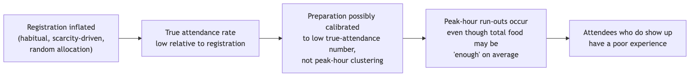

# Overview

This analysis moves from the symptoms documented in Phase 1 to the structures and mechanisms producing them. It distinguishes what was directly observed from what repeats, from the rules and incentives that make it repeat, from the beliefs that make those rules go unquestioned — then names the feedback loops and structural root causes underneath. Every layer below is built from facts and findings already confirmed across Tasks 1-5; nothing here is a new claim.

# Distinguish Events, Patterns, Structures and Mental Models

**Events** — specific, dated, or individually-confirmed occurrences:
- A student registered for and was charged a Kadamba breakfast on 2026-09-03 and did not attend.
- Six real respondents each describe specific mornings items ran out — idli, puri, bhatura, fruit — concentrated near the 9:30 close.
- Kadamba ran at 51-79% of registered capacity on the one date sampled; Bakul ran at 11-31% on the same date.
- The December 2024 cancellation-policy tightening; the November 2024 "Let Them Eat Frogs" unilateral non-veg cancellation at Kadamba.

**Patterns** — the same shape recurring across people or across time:
- Registration consistently exceeds attendance, on a scale large enough that a five-cancellation-per-month cap exists specifically to manage it.
- Kadamba's uptake exceeds Bakul's and Palash's on every date and every meal sampled.
- Zero of six respondents who addressed Skip Meal have ever used it for its intended purpose.
- All six respondents register monthly, not day-by-day — a universal pattern, not an individual habit.
- No single population-level attendance trend exists: real respondents move in different directions simultaneously over the same semester.
- A recurring institutional shape: a complaint is raised, goes unaddressed, and is only reactively resolved after a further incident (the December 2024 episode; a separate, unrelated 2023 water-quality episode at the same institution).

**Structures** — the rules, incentives, information flows, and power distributions producing the patterns above:
- Billing tied to registration count, not attendance.
- The four-day procurement lead time, fixed regardless of same-day signals.
- Skip Meal, designed to reduce kitchen waste, with no effect on billing.
- Three separate governance bodies (Mess Committee, Mess Office, Warden) with only partially confirmed relationships to one another.
- Zero formal channel between Academic administration and any of the three governance bodies.
- Three feedback channels (rating, email, Ping) with no confirmed record of ever producing a policy change.

**Mental models** — the assumptions underneath the structures, none directly stated by name in any interview but consistent with everything observed:
- A registration, once made, is worth keeping regardless of actual attendance plans — since cost is identical either way, and popular messes fill up.
- Feedback does not change outcomes — implied directly by every respondent's own account of never having seen, or known of, a rule change resulting from student input.
- Kadamba is the trusted, safe default — implied by the uptake gap, and by respondents who register there specifically because "it's hard to get."
- The Mess Office's own operating assumption, evidenced by its one confirmed policy action: operational simplicity is the goal, and student flexibility is a variable to trade against it, not a constraint to protect.
- Academic administration's implicit assumption, never tested until this project asked directly: class scheduling is a closed domain with no connection to mess operations — an assumption of inattention, not a considered position, since nobody has ever actually raised the overlap with them.

# Identify Reinforcing and Balancing Feedback Loops

**R1 — Shifting the Burden, via Mess Cell** (reinforcing). The informal resale market recovers value from an unused registration that Skip Meal does not. This symptomatic relief is comfortable enough that nobody — student, Mess Committee, or Mess Office — is ever forced to fix billing itself. The workaround's success is exactly what lets the root cause persist.

**B1 — Kitchen Waste Control, via Skip Meal** (balancing, but incomplete). Skip Meal exists to stop the kitchen over-preparing for a known no-show. Its real usage rate across every respondent who addressed it is zero, which means this loop may not be closing in practice at all — not only failing to address the student's side of the problem, as earlier analysis argued, but potentially failing on its own kitchen-side terms too.

**B2 — Capacity Redistribution** (weak or broken). The natural balancing response to Kadamba nearing capacity would be organic redistribution toward Bakul or Palash. Confirmed registration data shows this is not happening — one respondent registers at Kadamba specifically because it is scarce, direct evidence of demand concentration rather than redistribution. Capacity was instead added administratively: Bakul was built.

**A candidate structure — under-provisioning for real attendees.** Two independent respondents converge on a claim that the mess struggles to serve even the smaller group who do attend:

The first half of this chain — inflated registration, low true attendance relative to it — is directly evidenced. The second half — that preparation is calibrated to the low true-attendance figure rather than to peak-hour clustering — is a plausible mechanism, not yet confirmed by any kitchen-side source. It is presented here as a candidate structure, not a settled loop.

# Analyse Unintended Consequences

| Rule or action | Intended function | Observed response | Unintended consequence |
|---|---|---|---|
| Cancellation cap | Limit uncancelled no-shows | Used inconsistently; at least one respondent does not use it because they forget | Constrains a behaviour some students do not reliably perform for reasons the cap does not address |
| Walk-in markup | Discourage same-day uncertainty | Universal monthly advance registration | Registration counts are inflated independent of actual attendance intent |
| Skip Meal, no refund | Reduce kitchen waste | Zero real usage across every respondent who addressed it | The tool may not be reducing kitchen waste in practice at all |
| December 2024 cancellation tightening | Reduce Mess Office workload | Reduced student flexibility to correct a registration close to service | Plausibly increases, not decreases, the pattern of uncancelled no-shows it targeted |
| Mess Cell (emergent, not a designed rule) | Not applicable | Absorbs unused registrations for the students who use it | Reduces the visible pressure to fix the billing model, while genuinely helping those who use it |

# Identify Structural Causes and Systemic Tensions

**Structural cause 1 — billing is decoupled from attendance.** This is the single root structure behind the largest share of symptoms in this project: no-shows, the cancellation cap, Skip Meal's design and its irrelevance, and the Mess Cell market's existence. Every one of these traces back to the same fact: cost is incurred at registration, not at consumption.

**Structural cause 2 — the four-day procurement lead time is a fixed, structural ceiling on responsiveness.** It caps how fast the entire system can react to any same-day signal, for every actor equally, regardless of goodwill or intent. This is not a policy choice any single actor is making badly; it is a constraint no actor currently has a mechanism to relax.

**Structural cause 3 — governance is fragmented across four disconnected actors** (Mess Committee, Mess Office, Warden, and, functionally, Academic administration), with no single actor holding both the authority and the incentive to address the registration-attendance gap end to end. The Mess Office can change operational rules but has no stated interest in the paradox itself; the Mess Committee sets the menu but has no confirmed visibility into what is actually eaten; Academic administration holds the one lever most likely to resolve the schedule overlap and has no formal connection to any of the other three.

**Systemic tension — individual rationality against system-level cost.** Registering broadly, keeping a slot at a scarce mess, and reselling rather than cancelling are each rational responses to the incentives an individual student actually faces. The aggregate of many individually rational choices is exactly the waste, the queue crowding, and the run-outs the project set out to explain. No single actor is behaving irrationally; the system's own structure produces the paradox from ordinary, sensible individual behaviour.

**Systemic tension — administrative simplicity against demand-matching.** Billing-by-registration and the four-day lead time both optimize for administrative and kitchen-planning simplicity. That same optimization is what prevents the system from ever matching food produced to food actually eaten.

# Key Findings

1. The registration-attendance gap is not caused by any one broken rule but by one structural decision — billing decoupled from attendance — that produces or interacts with nearly every other symptom in this project, from the cancellation cap's existence to Skip Meal's irrelevance to the Mess Cell market's success.
2. Two of the system's own designed fixes are each a Fix That Fails in a different way: Skip Meal addresses only the kitchen's side of a two-sided problem, and may not even be doing that in practice, given zero confirmed usage; the December 2024 cancellation tightening addressed the Mess Office's workload at the plausible cost of worsening the pattern it targeted.
3. No actor in this system currently holds both the authority and the incentive to fix the core mismatch end to end — the closest candidate, Academic administration, has the authority over the one lever most likely to help and zero incentive or formal connection pulling it toward using it.
4. The Mess Cell resale market functions as a release valve (Shifting the Burden): it is successful and genuinely useful to students, which is exactly what removes the pressure that would otherwise force a fix to the underlying billing structure.

# Outstanding Data Collection

The mental-model layer above is inferred from confirmed structures and consistent respondent behaviour, not from any respondent naming their own assumptions directly — this is stated as inference, not fact. The under-provisioning candidate structure's second half (whether kitchen preparation is actually calibrated away from peak-hour demand) requires a mess-committee or mess-vendor source to confirm or reject. Both items are pending the same institutional approval already logged against Tasks 3-5, and **will be collected and submitted later**.
