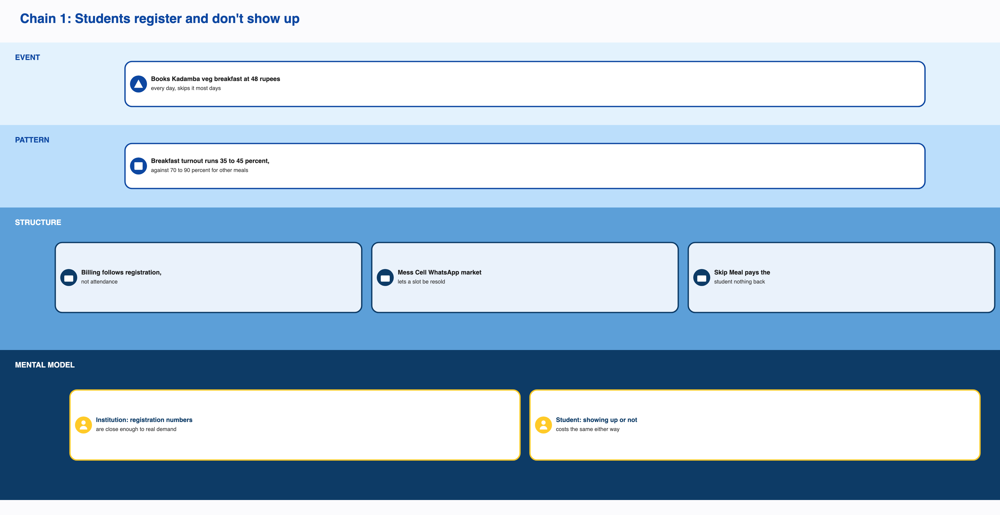
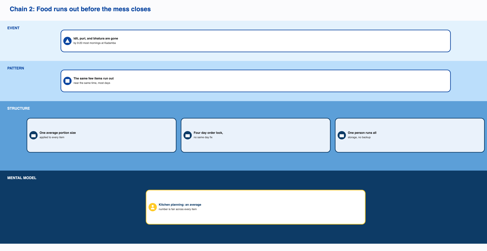
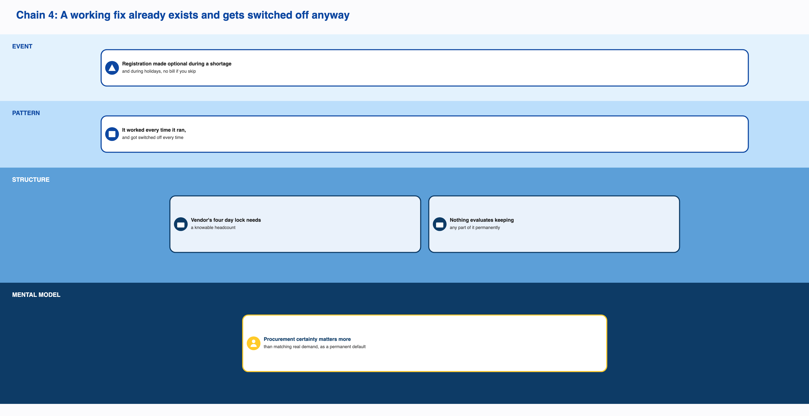
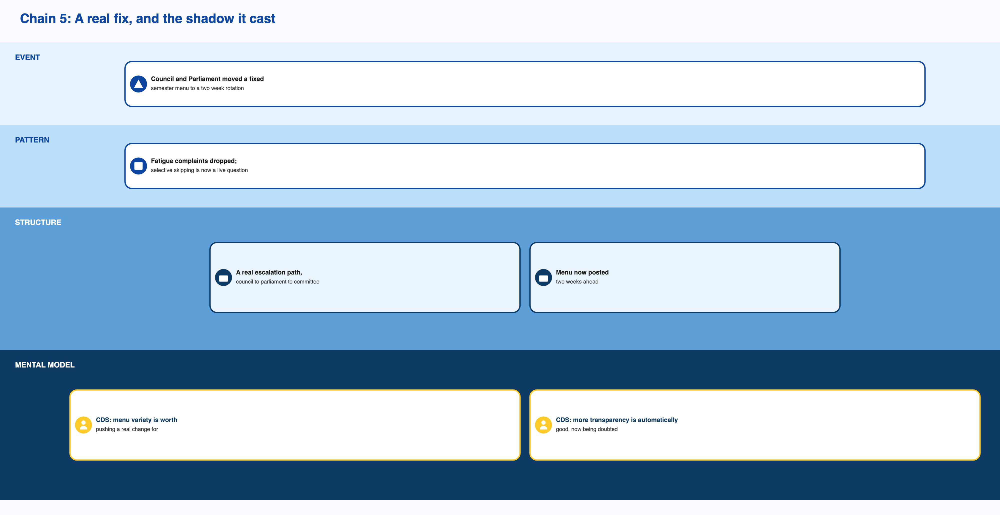
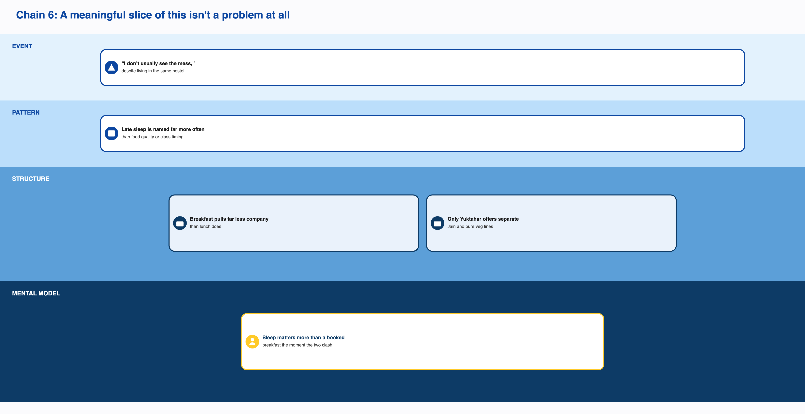

# Overview

Students register for breakfast at IIIT Hyderabad in large numbers, and most of those registrations are never eaten. At Kadamba in April 2026 there were 32,162 breakfast registrations and 11,941 scans at the counter: 37.1 percent turnout and a 62.9 percent no-show rate. At Yuktāhār, on the thirteen days in September 2026 where the register is legible, breakfast turnout ran between 17.7 and 40.2 percent, about 28 percent on average, while lunch in the same hall ran between 56 and 89 percent. Both figures are confirmed from the halls' own records. Where lunch is recorded as well, the gap is specific to breakfast.

This document looks at why, layer by layer: an event is one thing that actually happened, a pattern is what keeps happening across many events, a structure is the rule or design that produces the pattern, and a mental model is the belief that keeps that structure standing. Read from the bottom up: a belief shapes a rule, the rule produces a habit, the habit shows up as a specific incident you can point to.

Claims below are marked confirmed, single-sourced, candidate, or assumed. Confirmed means it was read directly off a record (the Kadamba scan export, the photographed Yuktāhār registers), seen on site by a team member (the wrapped display plate at the Kadamba entrance, the Yuktāhār books, the two roti counters), stated clearly by a named source, or independently backed up. Single-sourced means one account only. What the Kadamba operator told a team member who heard it directly is single-sourced but observer-verified: the numbers are no longer in doubt, though they remain the operator's own account of its practice. What the off-site operator said, and the few Kadamba details not covered by what a team member heard directly, rest on noisy, mostly Telugu audio and are marked single-sourced from noisy audio. An earlier version of this document treated every Kadamba operator statement as noisy audio; that has been revised. Candidate means it's a reasonable read of the facts but not yet checked. Assumed means it's a systems thinking judgment, offered honestly, not proof.

Two findings carry this analysis. The first is that the institution has already run a version of breakfast where billing tracks who actually shows up. During a gas shortage and during holidays when students leave campus, registration stopped being compulsory. Students could just walk in and scan a QR code, or register a day or two ahead at any mess instead of being locked into one four days out. If you didn't register and didn't show up, you weren't charged. That model gets switched back off once the shortage or the holiday ends, and nobody appears to have gone back and asked whether any part of it should stay. On ordinary days every student is registered automatically, and the four day lock the exception relaxes is a registration rule: the kitchens themselves set quantities the day before and buy most perishables one day ahead.

The second is that the gap is already measured, twice, and reaches no one who can change the rules. The central dining system logs every breakfast scan against every registration. The Yuktāhār operator, ABC Hospitality Services, records per meal and per item how many registered, how many ate, what was cooked, what was left and when each item ran out. The two kitchens then plan in opposite ways. Prism, the tendered vendor that runs all of Kadamba, cooks a first batch at a fixed 70 percent of registrations (single-sourced, observer-verified) against 37 percent recorded turnout, and the off-site kitchen works the same way at 70 to 80 percent (single-sourced from noisy audio). Yuktāhār has no fixed ratio: it learns from its own books and re-projects from the first half hour of service, yet its site head still carries a breakfast figure of up to 50 percent against about 28 percent in his own register. An earlier version of this document said every kitchen converted registrations by a private ratio; that has been revised. Under both philosophies the breakfast gap is about the same size. The kitchen is rich in data and poor in authority; the offices that own registration and billing hold the authority but not the data.

# 1. Events, Patterns, Structures and Mental Models

Seven areas of this system were traced from event up to belief. Each one gets its own events, patterns, structures, and mental models, listed out rather than folded into one paragraph, because the point of doing this properly is seeing how many different beliefs and rules are actually stacked underneath one visible symptom.

## Chain 1: Students register and don't show up

**Events**

- A student who was interviewed said they book Kadamba veg breakfast for forty eight rupees every day and skip it most days.
- The same student cancels roughly five times a month and has never once used Skip Meal, because in their own words it doesn't give any money back.
- Another student registers for the entire month at Kadamba specifically, because in their words it's hard to get and fills up, and resells on the Mess Cell WhatsApp group only rarely, when a slot happens to go for a good price.
- A third student buys and sells registrations on Mess Cell for lunch and dinner but says they've never done it for breakfast.
- On Sunday 6 September 2026, 267 students were registered for breakfast at Yuktāhār and 50 ate: 18.7 percent. Confirmed.
- On Sunday 5 April 2026, 1,077 students were registered for breakfast at Kadamba and 273 scanned in: 25.3 percent. Only 20.5 percent of the vegetarian registrations that morning were used. Confirmed.

An earlier version of this chain listed, as an event, that on one date Kadamba "served" 51 to 79 percent of its registrations and Bakul 11 to 31 percent. That finding has been revised. Those figures came from one registration portal snapshot and measure registrations as a share of platform capacity, not attendance. The same snapshot shows 116 registered at Yuktāhār on a morning when Yuktāhār's own register shows 276, so it was not a final count either. No attendance records for Bakul or Palash have been seen.

**Patterns**

- Registration beats attendance every day, and it's far worse for breakfast than for lunch. Kadamba breakfast turnout was 37.1 percent across April 2026 (32.4 percent for vegetarian registrations, 48.5 percent for non vegetarian). Yuktāhār breakfast averaged about 28 percent in September, below the 35 to 45 percent band the CFS Chair gave. Yuktāhār lunch in the same weeks ran 56 to 89 percent, with fifteen of twenty days at or above 70 percent, and its Sunday paneer dinner reaches 92 percent by the site head's account. All of this is confirmed from records except the dinner figure, which is the operator's own. Records exist only for Kadamba and Yuktāhār.
- Registrations are flat across the week while turnout moves by weekday. Kadamba carried about 1,070 breakfast registrations every day in April, Sunday included, while turnout ranged from 42.1 percent on Tuesdays to 27.3 percent on Sundays. Confirmed. Registration is an automatic default, not a daily decision to eat, and flat registrations are what a default looks like in the records.
- Nobody interviewed has ever gotten anything out of Skip Meal.
- Four of the six students interviewed use Mess Cell regularly.

**Structures**

- Billing is calculated off how many people registered, not who ate.
- Every student is registered automatically, whether or not they are on campus, holidays included. The only exit is five cancellations per meal type per month, each made at least four days ahead; beyond those there is no way to remove the charge. Confirmed from the dining poster and a team member's own experience as a registrant. An earlier version of this chain described registration as closing in weekly blocks; that has been revised. Weekly blocks are the operators' description, and whether the student-side cycle is weekly or monthly is not confirmed.
- Kitchens set quantities the day before and order most perishables one day ahead. An earlier version of this chain said orders to the vendor lock four days ahead; that has been revised by the operations evidence. The four day close is on registration, not on the kitchen.
- Walking in without registering costs roughly 70 percent more than the registered price (₹81 against ₹48 for a vegetarian breakfast). Walk in numbers stay small: walk in, paid and staff diners at Yuktāhār breakfast ran between zero and twelve a morning in September. Confirmed.
- Mess Cell, an informal WhatsApp group, lets someone sell a slot they know they won't use.
- Skip Meal tells the kitchen someone won't show but pays that student nothing. The sources conflict on whether it changes what is cooked. By the institution's account it reaches the kitchen. The Kadamba operator says it cooks on registrations regardless, "because it is a responsibility and they are getting paid for it" (single-sourced, observer-verified). Skip Meal may lower the count the operator sees while the operator treats whatever count it sees as the obligation, or it may not reach the Kadamba kitchen at all. This is an open question.

**Mental models**

- The mess office treats total registration numbers as a good enough stand in for real demand, and keeps billing that way even though a working alternative has already been run. This is the strongest belief in the whole analysis, because it survives contact with evidence that contradicts it.
- Students believe the booking is not theirs to manage: "We don't have any opportunity to nullify it." Confirmed from a team member's own experience as a registrant. Once registered, showing up or not costs them the same either way.
- For at least one student, reselling gets you something back and Skip Meal doesn't, so there's no reason to bother with Skip Meal.
- For another, a slot at a popular mess needs to be grabbed early because it will disappear otherwise.
- The Kadamba manager believes a friend eats in the place of an absent registrant (single-sourced from noisy audio). The scan export carries no student ID, so this cannot be checked in the records. An earlier version of this chain also listed as his belief that students register while away ("even if you are in the village"); that has been revised, since registration while away is the rule itself, not a belief.
- At Kadamba, the registration count is the obligation the operator is paid to meet: it cooks to registrations "because it is a responsibility and they are getting paid for it" (single-sourced, observer-verified). Its 70 percent first batch is practice, not a reading of turnout. An earlier version of this chain said the operator cared about turnout as a cooking cost; that has been revised for Kadamba. At Yuktāhār the opposite stance holds: waste is a cost and a profit lever (single-sourced, observer-verified). Neither operator has a route to the registration rule itself. Each operator is paid monthly as a lump sum on plates, with deductions (single-sourced from noisy audio); whether a plate means a registration or a scan is not known. The Kadamba remark hints that payment follows registrations. Candidate, not a contract term.

**Root cause.** Billing tracks registration, not attendance, on a booking the student never actively makes. This one rule explains the student side of this chain, and students describe it the same way from their side: no opportunity to nullify it. The counterfactual has actually happened: the CFS Chair describes the no show problem easing when billing followed attendance during the shortage and holiday periods. No attendance records from those periods have been seen, so the size of that effect is still unmeasured. The same breakfast gap appears under two opposite kitchen philosophies, 37 percent at Kadamba and about 28 percent at Yuktāhār, which places the cause upstream of the kitchen.

## Chain 2: Food runs out before the mess closes

**Events**

- One student said that most mornings around 9:20, idli, puri, and bhatura are already gone at Kadamba, fruit isn't restocked, and staff say more is coming before the 9:30 close but it usually doesn't arrive.
- Another student described supply getting very low between 9:00 and 9:30, and said the mess can't restock quickly enough on those mornings.
- On Thursday 3 September 2026, Yuktāhār re-cooked one extra kilogram of semiya upma at 9:00. Its production sheet for that morning records 77 of 278 registered students eating (28 percent); its attendance register records 110 (40 percent). Both are confirmed records, and they disagree with each other. Either way, the kitchen ran short of one item on a morning when most registrations went unused.
- On Friday 3 April 2026, Kadamba's last breakfast scan was at 10:07, more than twenty minutes after the counter would normally close. Confirmed.
- A student described Kadamba as very crowded after roughly 9:15, to the point where getting everything you wanted wasn't guaranteed.

**Patterns**

- The same handful of items run out near the same time most days.
- Crowding builds steadily toward the close rather than hitting two separate peaks. At Kadamba in April, 26.5 percent of all breakfast scans fell between 9:15 and 9:30 and another 13.5 percent between 9:00 and 9:15; the rate climbs to about nine scans a minute at 9:29. There is a smaller burst of 9.6 percent when the doors open at 7:30. Confirmed from records, and every operator interviewed described the rush as coming at closing time. The Kadamba operator's own rule of thumb is about 100 diners in the opening phase, about 100 through the middle and about 150 in the last ten minutes (single-sourced, observer-verified). It matches the shape of the records, though the records put the last ten minutes before the close nearer 80 a day, with about 35 more in the ten minutes after it (confirmed).
- The crest is latest on Sundays: 45.9 percent of Kadamba's Sunday scans came after 9:15, against about 32 percent on Tuesdays and Wednesdays. Confirmed. Since there are no classes on Sunday, the late crest is at least partly a sleep pattern rather than a class timing one. Candidate.
- Late-comers enter by the back door after the front door closes at 9:30, and the mess does not refuse them: "mess can't say no to them" (single-sourced, observer-verified). Every April day has scans at or after 9:30, 9.2 percent of all breakfast scans, about 37 a day (confirmed).
- The same morning produces a run out at the counter and surplus in the pot. The first batch is sized above turnout, and the items students want most still run short in the last fifteen minutes. Candidate, built from the operators' accounts and the production sheets.

**Structures**

- The two main halls set their first batch differently. Kadamba cooks for 70 percent of registrations, planned separately for vegetarian and non vegetarian registrations (single-sourced, observer-verified); the off-site operator says it cooked for 70 percent and now cooks for 80 (single-sourced from noisy audio). Yuktāhār has no fixed ratio: it estimates each meal from the matching week in its books, the month's turnout and known events. Recorded breakfast turnout is 37 percent at Kadamba and about 28 percent at Yuktāhār.
- Top up during service is real and fast, but it only moves upward and it lags. At Kadamba the supervisor checks the counters constantly, staff judge what is left of each item against its gram standard and the time, and the supervisor tells the kitchen how many more portions to cook (single-sourced, observer-verified); raw material is kept ready and more can be cooked in ten to fifteen minutes (single-sourced from noisy audio). The off-site kitchen sends more within about thirty minutes (single-sourced from noisy audio). Yuktāhār checks every thirty minutes from about forty five minutes before close and opens a second roti counter at peak (confirmed), and it uses the first half hour of service as a sample to project how many will come for the rest (single-sourced, observer-verified). That projection is the one forward-looking correction in the system, and it samples the calm opening: the first half hour carried about 15 percent of Kadamba's April scans, against 26.5 percent in the last fifteen minutes (confirmed).
- Before the first diner arrives, a food-safety sequence runs at Kadamba: cooking temperature is checked, a sample is kept for seventy two hours, a wrapped display plate of every item is set at the entrance, serving temperature is measured per item, and the facility team tastes the food with two Prism staff before corrections and service. The display plate and the tasting are confirmed (observed); the rest is single-sourced, observer-verified. The chef arrives at 5:30 and cooks batch items ahead; live items like dosa are made in front of diners from 7:00. The first batch therefore has to exist, cooked and checked, before any turnout signal. Candidate reading.
- Cooked food is usable for only three to four hours, and a cooked batch cannot shrink (single-sourced from noisy audio).
- Yuktāhār mostly cooks in one batch; only items that dry out, like poha, are cooked twice. Confirmed.
- Portions are set per item, not from one flat average. Every Kadamba dish has a gram standard, such as about 120 grams of batter for four idlis and about 100 grams of sambar per person (single-sourced, observer-verified), and Kadamba has cut ragi idli and increased plain idli (single-sourced from noisy audio). The items diners take beyond the standard, bonda, puri, vada and idli, are the same items students report running out first (candidate). Yuktāhār records each item's quantity, leftover and run out time. An earlier version of this chain said one average consumption number was applied to every item and that a weekly stock check could not catch a same day swing; that has been revised by the operations evidence.
- The posted window is 7:30 to 9:30. At Kadamba the effective close is between 9:35 and 9:45 on most days (confirmed from records), and on one biryani day the door was reopened for five to ten minutes for late comers (single-sourced from noisy audio).
- Kadamba buys in three tiers: dry goods such as rice, groundnut, masala and ghee a week ahead, perishables such as milk, fruit, meat, eggs and most vegetables the day before, and some vegetables two to three days ahead (single-sourced, observer-verified). Its "no backup" remark applies to perishable and cooked stock (candidate). An earlier version of this chain said stock could not be held in excess without that scope; that has been revised.

**Mental models**

- The Yuktāhār site head carries a breakfast turnout figure of "about 50 percent", told on another occasion as "at most 50 percent". His own September register shows 18 to 40 percent, about 28 on average. Confirmed. Read as an average, the figure is twenty two points too high; read as a ceiling, it is still ten points above the register's best legible day. The operator with the best records in the system carries a headline figure above them.
- The Kadamba kitchen has no forecasting beyond a fixed ratio and gram standards: "We don't have that idea... it was wasted many times." Single-sourced from noisy audio.
- The off-site operator believes Kadamba gets 90 to 95 percent turnout. Single-sourced from noisy audio, and contradicted for breakfast by Kadamba's own records.
- "Student fluctuation is very high", so the Yuktāhār kitchen cooks once rather than in stages. Confirmed.
- Low Sundays and exam weeks are accepted as out of anyone's hands: "This cannot be helped." Confirmed.
- The Kadamba operator knows the highest flow comes in the last ten minutes: "For any meal the highest flow is in the last 10 minutes." Single-sourced, observer-verified. The operator's belief about the crest is roughly right.

An earlier version of this chain listed the belief that "promising a restock counts as good enough even when it doesn't happen." That has been revised. Top up is a real mechanism that operators run; the students' reports of more food never arriving fit a top up that arrives after the crest, not an empty promise.

**Root cause.** The kitchen can react to a same day spike, but only upward, and with a lag of ten to thirty minutes against a crest that arrives at about nine scans a minute in the last fifteen minutes. At Kadamba the first batch is set by a fixed ratio that sits above real turnout, and it must be cooked and checked before service. Yuktāhār's first-half-hour projection is the one forward correction, and it samples the morning before the crest. So the same morning produces a shortage at the counter and a surplus in the pot. An earlier version said the ordering method had no way to see or react to a same day spike; that has been revised.

## Chain 3: Complaints get ignored until something forces a response

**Events**

- In November 2024, a frog turned up in Kadamba's chicken biryani. Non vegetarian meals at Kadamba were pulled without an official explanation of why.
- In December 2024, the cancellation cap was tightened. This came after a renovation at Kadamba added to the Mess Office's workload. There's no record of the committee signing off first. A student survey run by Ping showed most respondents unhappy about it, and Student Parliament representatives met with the Mess Office twice before the change went ahead anyway.
- Back in 2023, complaints about drinking water quality went unanswered for months, even after Parliament asked for testing, until more than thirty eight confirmed cases of typhoid forced the institution to respond.
- In August 2025, when Yuktāhār began weighing its waste, staff feared they would be blamed for mistakes ("they are catching us"). Confirmed. By December the staff themselves reported that waste had fallen.
- In September 2026, a student at Kadamba complained that sambar had been dropped from dinner: "Till last month they served sambar daily, now removed completely... but they are taking more money from us." The operator's answer was that students or the committee decide the menu. Single-sourced.

**Patterns**

- A complaint sits without action until a bigger incident makes it impossible to ignore.
- When the Mess Office wants a change made quickly, it tends to act on its own rather than go through a consultation process.
- Complaints reach the operator, and the operator points back to whoever owns the rule.

**Structures**

- There's no confirmed rule requiring committee approval before an operational change goes into effect.
- Menu decisions, kitchen execution, the academic calendar, and billing policy each sit with a different owner, and none of them overlaps with any other. The concrete case: operators see which items are consistently wasted (uttapam, set dosa and upma at Kadamba) and which move (puri, bonda, vada, idli), but they do not choose the menu. The off-site operator's manager asked for more say ("it's good if you increase the flexibility"). Single-sourced.
- Oversight of Kadamba runs down a layered chain: CFS, then CDS, then Prism, then Prism's operations manager, manager and supervisor, then the service staff (single-sourced, observer-verified). It covers safety and taste closely: a daily tasting by the facility team with two Prism staff, a weekly quality inspection, and a daily dissolved-solids reading on cooking and drinking water. No check in that chain asks how much was cooked against how many ate. The operator's account names the head of CDS differently from the CDS Chair named in the earlier interview; whether these are two roles or one person named two ways is an open question. Who the facility team is, the CDS site team or another body, is also not known.
- Complaints travel to the kitchen, not to the rule owner. At Kadamba they go from a director's email to the manager and into the operator's WhatsApp group, which the site team on the central dining side also reports into; at the off-site operator they go from the central dining team to the manager, the kitchen and the managing director. Single-sourced.
- Three student feedback channels exist (an in app rating, email, and Ping's reporting), and none of them has a confirmed case of producing a change to registration, billing or hours on its own.
- Change does happen where the person measuring also holds the lever. At Yuktāhār the managers made waste measurement blame-free and discussed it daily, and it worked. The organisation is flat: two project managers, no hierarchy, everyone does every job, and records are cross-checked by peers; the mess in-charge keeps the Wastage Book and a colleague cross-verifies the grocery register (single-sourced, observer-verified; the books confirmed). Kadamba cut ragi idli and increased plain idli on what it saw at the counter (single-sourced from noisy audio).

**Mental models**

- It's reasonable to infer the Mess Office sees these decisions as theirs alone to make, with consultation as optional, especially when they're under time pressure.
- The Mess Office's own stated reason for the December tightening was reducing its own workload, regardless of what that cost students in flexibility.
- At Yuktāhār, waste is treated as something to learn from, not something to punish, and the staff treat each other as family (single-sourced, observer-verified).

**Root cause.** Nobody owns the whole picture (menu, kitchen, academic calendar, and billing sit apart from each other), and at the level of registration, billing and menu the system only reacts once something is loud enough to force it to. Oversight follows the same logic: it is intensive on safety and taste, where failure is loud, and absent on quantity, where surplus is quiet. Inside the kitchen, quiet numbers already work, because there the person measuring also decides.

## Chain 4: A working fix already exists and gets switched off anyway

**Events**

- During a gas shortage, the mess cut down to serving one item at the same price, and the cancellation cap was doubled from five to ten a month. On the kitchen side, Kadamba's team says it cut quantities and bought some items from outside (single-sourced).
- During holidays and long weekends, Felicity being the named example, when a large share of students leave campus, registration stopped being required. Students could walk in and scan a QR code when they arrived, or register just one to two days ahead at any of the four messes instead of being tied to one specific mess four days out. Anyone who didn't register and didn't show up simply wasn't billed.

**Patterns**

- Every time this ran, it worked by the CFS Chair's account. And every time, it got switched back off once the shortage or the holiday ended.
- There's no sign it was ever evaluated afterward for keeping any part of it as a permanent option.

**Structures**

- The kitchen's own planning horizon is one day for anything perishable. Quantities are fixed in a meeting the day before (confirmed at Yuktāhār); at Kadamba perishables are bought the day before, some vegetables two to three days ahead and dry goods a week ahead (single-sourced, observer-verified). Kadamba cooks a fixed share of registrations and tops up live, while Yuktāhār estimates from its books; both top up during service. Kadamba cooks about 30 extra portions for 30 to 50 people outside the student registration, such as night-shift security (single-sourced, observer-verified). An earlier noisy-audio figure of 30 to 40 extra portions for walk in and paying diners may describe the same allocation; that is not confirmed.
- Nothing in the system currently exists to evaluate whether a temporary fix should become a standing one.
- The cancellation cap is a number the institution has already shown it's willing to move.

**Mental models**

- Someone in the registration and billing administration values an automatic, pre-committed count more than matching food to real demand, as a permanent default rather than something weighed case by case. Candidate. It is not the kitchen's planning need: the operators plan a day ahead. Administrative workload, the reason given for the December 2024 cap tightening, is the likeliest source. Kadamba's stance that the registration is the responsibility it is paid for is a kitchen-side reason the relaxed model might be resisted (candidate).
- Attendance based billing appears to be treated as acceptable only as an emergency measure, not as a real option on ordinary days.

**Root cause.** This is a live counterexample to chain one's root cause. The gap between registration and attendance is not something the institution has failed to solve. It's something the institution already solved once, twice actually, and chose not to keep. An earlier version of this analysis named the vendor's four day lead time as the most likely reason. That has been revised: the kitchens plan one day ahead, so the four day close is not something the kitchen needs. Several candidate reasons remain, none checked. The per plate payment may count registrations rather than scans, which would make a walk in model cost the operator revenue; the Kadamba operator's remark that it is paid for the registrations points weakly this way, and is not a contract term. Running registration and billing as an automatic default is less administrative work. Or the relaxed model may simply revert with the calendar, with nobody deciding anything. The open question is what the per plate payment counts, and who needs the four day close.

## Chain 5: A real fix, and a shadow it cast

**Events**

- CDS convinced the Student Council, and the Student Council convinced Student Parliament, to move off a single semester long menu and onto one that rotates every two weeks.
- The CFS Chair raised, without being asked, a concern that once the menu is known in advance, students can decide ahead of time not to show up on days they don't like what's coming.
- On Thursday 3 September 2026, Yuktāhār planned breakfast on a production sheet headed "Thu wk 1&3": the Thursday of weeks one and three shares one menu and one sheet. Confirmed.

**Patterns**

- Complaints about menu fatigue dropped once the rotation started, according to the CFS Chair.
- Turnout moves with the item, at least in part. Non vegetarian registrations at Kadamba were used at 48.5 percent against 32.4 percent for vegetarian (confirmed); biryani days reach about 700 registrations and some items are consistently wasted while others run out (single-sourced). Whether students are actually skipping known bad menu days hasn't been checked against student side data yet.
- Where the kitchen expects full turnout, it drops its discount. Kadamba cooks biryani lunch at 100 percent of registrations, two pieces of 150 to 200 grams each with unlimited rice, and a head chef comes in; when some diners take a third piece, later diners run short (single-sourced, observer-verified; lunch, not breakfast). The 70 percent ratio is a judgement about expected demand, not a fixed rule.

**Structures**

- A real path exists from student complaint to policy change: Student Council, then Parliament, then the Committee approving it. This time it actually worked.
- Feedback gets sorted by how loud it is. Low intensity goes straight to the CFS Head, high intensity escalates.
- The menu is now posted two weeks at a time and also changes monthly and seasonally. The two week cycle makes weeks one and three identical and weeks two and four identical. Confirmed from the Yuktāhār production sheets.
- Yuktāhār plans each meal from the matching day in its Wastage Book: a week three Thursday is planned from what happened on the week one Thursday. Confirmed. The rotation is what makes that lookup possible.

**Mental models**

- CDS believes menu variety is worth pushing a real policy change for, and this time acted on that belief.
- CDS also believed, until recently, that more transparency about the menu is automatically a good thing. That belief is now being questioned by the same office that held it.

**Root cause.** This chain shows the opposite of chain three: proof that the system can respond when a problem is loud enough. The new risk it created (people skipping on menu days they already know they'll dislike) comes from the same structure that made the fix possible in the first place. Visibility that helps with fatigue also helps with avoidance. The rotation also had a benefit nobody designed for: it gave the kitchen a repeating unit to calibrate against. A menu change that breaks the two week cycle would break the operator's own calibration.

## Chain 6: A meaningful slice of this isn't a problem at all

**Events**

- One student said they practice intermittent fasting on purpose, stopped cooking breakfast for themselves years ago, and doesn't usually even see the mess, despite living in the same hostel.
- Another said a friend's absence wouldn't really change whether they go.
- A third said friends are a reason to go, but not the deciding one. If everyone else skipped, they'd still go if they had to.

**Patterns**

- Late sleep is the reason given most often for skipping, well ahead of class timing or food quality. The records bear this out at pattern level: Sunday is the lowest turnout day in both halls (27.3 percent at Kadamba, 17.9 to 24.1 percent on Yuktāhār's three legible Sundays) and has the latest arrivals. Confirmed. The Yuktāhār site head adds that hackathons mean students sleep late and exams push numbers down (confirmed).
- Legitimate variation has a rough ceiling. Kadamba's daily turnout in April ranged between about 25 and 48 percent and never came near lunch levels, so weekday and weekend variation alone cannot explain a 63 percent no-show rate. Confirmed from records; the reading is a candidate.
- Friends matter to some students and not at all to others, and nobody who was asked directly named it as the deciding factor.

**Structures**

- Breakfast pulls in far less company than lunch does. Friends gather more around lunch.
- Nothing about the mess sits in a student's daily path the way, say, a lecture hall does. It's easy to just not notice it.
- Only one of the four messes, Yuktāhār, offers a separate Jain and pure vegetarian line, and it counts Jain registrations separately every day: about eight to fifteen per breakfast in September. Confirmed. Nowhere else makes that distinction.
- The system registers everyone by default, including students who are away or fasting, so a legitimate absence is counted as a no-show. Confirmed.

**Mental models**

- For at least one student, sleep matters more than a booked breakfast the moment the two clash.
- A meal you've stopped cooking or stopped noticing eventually stops feeling like something you're missing.
- The system itself assumes breakfast is something everyone should default into: every student is registered automatically, and anyone who does nothing is allocated a vegetarian meal.

**Root cause.** This slice sits outside the billing and governance story entirely. Some of what looks like the paradox is just how a genuinely diverse group of students actually eats, and treating all of it as dysfunction would be a mistake. It is also not large enough to explain the whole gap.

## Chain 7: The kitchen cooks to a guess, then absorbs the difference

**Events**

- On Sunday 6 September 2026, 267 were registered for breakfast at Yuktāhār and 50 ate. Pointing to that row, the site head said the kitchen would adjust using it "not even next month, next week". Confirmed.
- On 3 September 2026, Yuktāhār re-cooked semiya upma at 9:00 on a morning its two records put at 28 and 40 percent turnout. Confirmed.
- Shown his own register, the Yuktāhār site head described breakfast turnout as "about 50 percent". Confirmed.
- The off-site operator raised its first batch from 70 percent of registrations to 80 percent. Single-sourced from noisy audio; the date is not known.
- On one biryani day at Kadamba, 25 students arrived after close and the door was reopened for them. Single-sourced from noisy audio; whether this was breakfast or lunch is not clear.

**Patterns**

- The fixed ratio sits well above recorded turnout. Kadamba's first batch of 70 percent against 37 percent actual is roughly 1.9 times what is eaten, before any top up (the ratio single-sourced, observer-verified). Yuktāhār plans without a ratio, and its site head's headline figure of up to 50 percent still sits against 28 percent recorded.
- Surplus leaves the kitchen through several routes, none counted as institutional waste. Yuktāhār reuses it: leftover idli becomes idli upma or idli poha for lunch, dosa batter goes back into the fridge, surplus milk is set as curd overnight (confirmed). At Kadamba, 30 to 50 people outside the student registration, such as night-shift security, eat from the same food, about 30 extra portions, and so do about half of Kadamba's own staff (single-sourced, observer-verified). Whether those outside diners appear in any record the institution sees is not known; the operator mentions some registration for them. The rest goes to the bin. An earlier version of this chain counted twenty to thirty Kadamba cooking and security staff eating after the students; that has been revised.
- At Kadamba, food is cooked ahead, reheated repeatedly and moved between vessels for display and service, and the team's observer judged that this degrades it fast. Candidate: surplus from each batch is held and reheated rather than discarded, so over-preparation shows up as lower quality as well as waste.
- Waste is measured every day, inside the kitchen. Yuktāhār weighs student plate waste and kitchen waste per meal and records percentage waste per item, and the coordinator keeps the daily figure on a wastage board with a target of pushing it down (confirmed). Kadamba reports about 5 to 10 percent daily wastage, with no stated base (single-sourced, observer-verified); how it is measured is not known. An earlier version of this chain cited Kadamba waste weights; those have been withdrawn.
- The operator's own figures leave a tension open. In April, Kadamba breakfast averaged about 1,072 registrations and 398 scans a day (confirmed). A 70 percent first batch is about 750 portions, a surplus of about 350 portions a day before any top up (candidate arithmetic). A daily waste of 5 to 10 percent is compatible with that only if most of the surplus goes somewhere other than the bin: to the outside diners and staff, to food held and reheated into later service, to top ups smaller than the ratio implies, or to a waste figure measured on a different base, such as all meals or plate waste only. Which of these holds is not known, and this analysis does not assume one.

**Structures**

- A twice daily planning meeting at Yuktāhār fixes the next day's quantities from its own books: portal registrations read as regular plus Jain plus cash meals, the Wastage Book entry for the matching day in the menu cycle, the attendance register grouped by weekday, the month's turnout pattern, and events, exams and holidays, but only if someone raises them. "We don't come to know... until we sit in the meeting." Confirmed. There is no formal feed of the academic calendar to the kitchen. During service the first half hour is used to project the rest (single-sourced, observer-verified).
- The Wastage Book is used as a rule: "If it runs out at 1:30 we re-cook; if at 2:20 we don't." Confirmed. Yuktāhār estimates turnout for every meal and calibrates item quantities against its matching week. An earlier version of this chain said the turnout percentage was recorded but did not drive planning; that has been revised. The site head's headline breakfast figure still sits above his register, so the lookup calibrates item quantities better than it corrects the headline belief (candidate).
- Yuktāhār runs a full book system: the Wastage Book, the weekday attendance register, the wastage board, the grocery issue book, a store and ingredient book, a stock register, a vegetable book with its indent, a milk, fruit, gas, electricity and water register, and fridge temperature and cleaning logs (confirmed, records). A two-book rule holds: what the store issued must match what the kitchen cooked, and a mismatch is raised in the daily meeting (single-sourced, observer-verified). The same meeting reports excess stones or dirt in raw materials against a per-item norm, and exceeding it means a complaint to the supplier or a change of supplier.
- Kadamba sets its first batch at 70 percent of registrations, vegetarian and non vegetarian separately, with a gram standard for every dish, and the supervisor calls top ups from what is left of each item against the time (single-sourced, observer-verified). It keeps no learning record beyond the gram standards.
- Cancellations close four days ahead; most perishables are bought one day ahead; the Kadamba food-safety sequence requires the first batch to be cooked, sampled, displayed and tasted before service; cooked food lasts three to four hours; a cooked batch cannot shrink.
- Kadamba's waste goes into a dustbin collected by the garbage contractor. Kadamba does not compost (single-sourced from noisy audio). Yuktāhār's disposal route was not stated.
- Operator records stay in the kitchen. Nothing routes the Wastage Book or the attendance register to whoever sets registration, billing or menu rules, and nothing routes the central scan records back to the kitchen.

**Mental models**

- Breakfast is "about" or "at most" 50 percent, held by the operator with the best records in the system.
- "Cooking to registrations is the job we are paid to do." At Kadamba the registration count is the obligation: "it doesn't care if people don't want to eat because it is a responsibility and they are getting paid for it" (single-sourced, observer-verified).
- "Waste is money." Yuktāhār's stated goal is the best food quality, less waste, an optimised workflow, lower operating cost, standardisation and higher profit, and it spends part of the margin on rock salt and cold-pressed oil, used for about six months, and on visits to the mills (single-sourced, observer-verified). The same billing basis gives the two operators opposite stances, so operator culture is itself a lever (candidate).
- A friend eats in an absent registrant's place (single-sourced from noisy audio).
- "We don't have that idea": prediction is not something the Kadamba kitchen does beyond its ratio and gram standards (single-sourced from noisy audio).
- "Student fluctuation is very high", so cook once.
- "Prediction will be based on our data only... I want to remain close to the data." Yuktāhār tried the Zoho ERP to streamline groceries and predict rush and dropped it: paying lakhs of rupees for prediction made no sense when the data already sits in its books, and its staff are not digitally inclined (single-sourced, observer-verified). The operator's own staff write the books daily (confirmed), and the mess in-charge keeps the Wastage Book (single-sourced, observer-verified).

**Root cause.** The conversion from booking to plate is irreversible once cooked, and neither kitchen can change the number it starts from. At Kadamba the conversion is a fixed ratio with no learning record, cooked ahead under a safety sequence, and by the team's own judgement held and reheated through service (candidate). At Yuktāhār it is calibrated from the operator's own books, on item quantities, with a fast correction that samples the calm start. The breakfast gap is about as large under both, because the cause sits in the booking, not in the kitchen: calibration reduces waste and run outs, not no-shows. The kitchen is data rich and authority poor: it measures the gap in more detail than anyone else and controls only quantities, never the registration rule that produces the number it starts from.

# 2. Structural Causes: What Keeps Repeating and Why

Across all seven chains, three structural causes keep showing up, and the problem splits into two halves that need to be read separately: students not showing up for what they booked, and kitchens cooking more than is eaten.

**Registration is an automatic standing default.** Every student is registered for breakfast automatically, including over holidays, and the only exit is five cancellations per meal type per month, each at least four days ahead, with no way to remove the charge beyond that. So the booking cannot follow the decision each student actually makes on the morning. An earlier version of this analysis described it as a weekly block booking; that has been revised, since weekly blocks are the operators' description and the student-side cycle is not confirmed. The records show the default's signature directly: Kadamba carried about 1,070 breakfast registrations every day in April, Sunday included, while turnout moved from 42.1 percent on Tuesdays to 27.3 percent on Sundays. This is also what makes the problem breakfast's. Lunch runs under the same booking and mostly works, 56 to 89 percent at Yuktāhār, because the lunch decision is steadier than the breakfast one.

**Billing fires at the booking, not at consumption.** This single rule explains the rest of the student half: the incentive to book broadly, why Skip Meal goes unused, why a cancellation cap is even needed, and why Mess Cell exists. Booked breakfasts are used 37 percent of the time at Kadamba and about 28 percent at Yuktāhār. It has actually been tested: when billing followed real attendance during the shortage and during holidays, the no show problem eased by the CFS Chair's account. It does not by itself explain why kitchens cook above turnout.

**The gap is measured but unrouted.** Menu, kitchen quantities, the academic calendar, registration and billing each sit with a different person or office. The gap is not invisible: the central dining system holds a timestamped scan against every registration, and the Yuktāhār operator holds per meal, per item turnout and waste in its own books. Neither record reaches whoever sets registration, billing or menu rules, and the institution shows no sign of knowing the operator holds this data. Oversight of the kitchen checks safety and taste every day and never quantity. An earlier version of this analysis said the CFS Chair could state the exact size of the gap and it still never reached a conversation. That has been revised: the gap is measured in far more detail than any one person's figure, in two places, and it still reaches no rule owner. This is also why a fix that has already worked, twice, has never been evaluated for making it permanent.

An earlier version of this analysis counted a third cause differently: that the system acts on loudness rather than cost. That has been revised. The records show the standing booking directly, so it takes its place among the causes, and loudness is now read as one of two conditions that keep all three causes unaddressed. **Action follows loudness at the institution level; inside the kitchen, quiet numbers already work.** Menu fatigue was loud and got fixed. The much bigger, already measured registration gap is quiet, and it has never gone anywhere. Inside Yuktāhār's kitchen the opposite holds: its own waste records cut its waste between August and December, with no complaint involved, because the person measuring is also the person deciding and the measuring was made blame-free. Quiet numbers fail only where the lever sits somewhere else. The second condition is the absorption layer: resale and informal transfer of bookings, the operator's own discount and live top-up, leftover reuse, outside diners and operator staff eating from the same food, holding and reheating (candidate), the walk-in buffer and late-door and back-door service, outside venues, informal dietary workarounds, and finally the bin. Each takes up a consequence of the gap before it becomes a signal anyone who sets rules has to answer.

Underneath the kitchen half sits an intermediate mechanism worth naming on its own: **the uncalibrated conversion ratio.** Kadamba and the off-site kitchen turn registrations into a first batch at a fixed ratio (70 percent at Kadamba, observer-verified; 70 to 80 percent off site, from noisy audio) that sits well above Kadamba's recorded turnout, has no learning record behind it, and can be corrected only upward once cooked. Yuktāhār runs the alternative: a calibrated lookup from its own books, whose headline turnout belief still sits above its records and whose in-service projection samples the morning before the crest. An earlier version of this analysis described every kitchen, Yuktāhār included, as using a private ratio; that has been revised. The mechanism is downstream of the standing booking and of the measurement not being routed, so it is not counted as a root cause. It is the most directly actionable structure in the evidence, because it sits inside authority the operator already has, and one operator already runs the alternative.

Each operator is paid monthly as a lump sum on plates, with deductions (single-sourced from noisy audio). Whether a plate means a registration or a scan is unknown, so it is not known whether turnout ever reaches the operator's revenue. The Kadamba operator's remark that it is paid for the registrations hints at the first (candidate, not a contract term), and Kadamba treats the registration count as its obligation. Yuktāhār, under what is presumably the same billing basis, treats waste as a cost to cut for profit.

# 3. Reinforcing and Balancing Feedback Loops

Eighteen possible feedback mechanisms were checked, numbered L1 to L17 plus L3b, the same numbering used in the causal loop and feedback analysis. A loop only counts if the last step actually feeds back into the first one and that last step is evidenced. Three close, all balancing. Five would close only through an assumed last step and are held as candidates. The rest are real mechanisms that stop partway, and calling them loops when they don't close would be misleading.

An earlier version of this section counted six closed loops, three reinforcing and three balancing. That has been revised. Two of the three reinforcing loops closed only through an assumed step, and the third, the waste routine at Yuktāhār, is the slow start of the matching day calibration loop (L11) rather than a loop of its own.

**Balancing loops that close**

- L4, menu fatigue and rotation. Menu fatigue drove feedback, feedback escalated through the Student Council, the Committee approved a rotation, and variety went up, which lowers fatigue again. Every step of this one is confirmed directly by the CFS Chair, and the operators' records confirm the two week cycle. It's the cleanest governance loop in the whole system.
- L11, matching day calibration at Yuktāhār. The Wastage Book entry for the matching day in the menu cycle (leftovers, run out time), together with the month's turnout pattern and known events, sets the next cycle's quantity and turnout estimate, which produces a new leftover to record. Confirmed from the records and the site head. Its slow start is its own history: when weighing began in August 2025 staff feared blame, the managers made it blame-free and discussed it daily, by December the staff themselves reported that waste had fallen, and the book was still being filled in daily in September 2026. It calibrates item quantities and a turnout estimate; the site head's headline breakfast figure stays above the register, so the headline belief is not what drives planning (candidate). An earlier version of this loop said the turnout figure was not fed back; that has been revised. The loop is absent at Kadamba, which keeps gram standards but no learning record linked to its ratio (single-sourced, observer-verified), and unknown off site.
- L12, in meal top up. The counter runs low, the supervisor or floor checks what is left against the time, more is cooked, and the counter is restored. Confirmed at Yuktāhār (checks every thirty minutes from forty five minutes before close; two roti counters open at peak, observed, though whether at breakfast is not known); single-sourced, observer-verified at Kadamba, where the supervisor calls quantities against gram standards, with a ten to fifteen minute cook time from noisy audio; single-sourced from noisy audio at the off-site kitchen (thirty minutes). Yuktāhār adds a forward-looking arm, projecting the rest of service from the first half hour (single-sourced, observer-verified). Its weakness is that it only moves upward, lags a crest arriving at about nine scans a minute, and projects from an opening that carries about 15 percent of arrivals.

**Candidate loops whose last step is assumed**

- L1, loose registration and resale. Registering loosely feeds Mess Cell resale, resale takes the sting out of an unused registration, and that softer cost probably makes people comfortable registering loosely again. Most of this chain is confirmed by direct quotes, and the Kadamba manager describes the same substitution from the kitchen side. The final step is assumed. The automatic default now explains flat registration without it.
- L3b, Kadamba scarcity. Kadamba's popularity drives people to lock down a registration there defensively, which keeps it scarce on the registration platform, which should in theory reinforce its popularity further. The middle is confirmed by a direct quote. The records add something sharper: Kadamba carries about 1,070 breakfast registrations a day against a listed capacity of 1,200, and only 37 percent of them are used. At breakfast the scarcity is on the registration platform, not in the seats. The last step stays weak; the only first hand description of a crowded Kadamba is negative.
- L9, surplus absorbed out of sight. Surplus cooked food leaves the kitchen through reuse (idli into idli upma or idli poha for lunch, batter back into the fridge, milk into curd), the 30 to 50 outside diners and about half of Kadamba's staff, holding and reheating into later service (candidate), the walk-in buffer, back-door and late service, and the bin, and so never becomes pressure on whoever sets registration rules. An earlier version of this analysis called composting the confirmed absorber. That has been revised: Kadamba's operator does not compost, and its waste goes to a dustbin collected by the garbage contractor (single-sourced). Where the contractor takes it, and Yuktāhār's disposal route, are not known, and the earlier account of an outside compost facility is not reconciled with the operator's. The closing step, that absorption is what keeps the pressure away from the rule owner, is assumed.
- L15, late door tolerance. Late-comers come in by the back door after the 9:30 close and the mess "can't say no to them" (single-sourced, observer-verified), 9.2 percent of April breakfast scans, about 37 a day, fall at or after 9:30 (confirmed), and on one biryani day the door was reopened for five to ten minutes (single-sourced from noisy audio). This may teach students that arriving late is fine, which would keep the crest late. The first link is now well evidenced; the closing link is assumed.
- L17, kitchen competence shifting the burden. The operators' discount, top ups and reuse clear each morning's consequences locally, which plausibly stops any signal accumulating upstream. The first step is observed; the second is assumed.

**Things that look like loops but aren't**

- L13, standing booking to over preparation. An automatic default booking keeps the registered count flat, Kadamba cooks a fixed share of it, and over preparation is worst on the days turnout is lowest. Every link is evidenced, and nothing runs from the surplus back to the booking. This is the core chain of the paradox, and its failure to close is why the gap persists.
- L14, raising the ratio after a run out. Run outs at the crest lead an operator to raise its first batch ratio (the off-site kitchen went from 70 to 80 percent), which means more surplus on slow days, absorbed by outside diners, staff and the bin and unseen upstream. Only the first two links are evidenced. A candidate fix that fails, not a confirmed loop.
- Surplus to reheated food at Kadamba, not numbered in the loop scheme. Over preparation leads to food held and reheated through service, which the team's observer judged degrades quality, which may in turn lead to more skipping and complaints. The first link rests on the operator's ratio and the observer's judgement (candidate); the closing link to skipping is not evidenced. An open chain.
- L6, shortage and holiday exception. Uncertainty rises, registration relaxes, billing follows real attendance, and the relaxed model reverts once the shock passes. The trigger and the mechanism are confirmed. An earlier version of this analysis counted it as a loop that closed on paper, through the vendor losing its four day planning horizon. That has been revised: the kitchen plans one day ahead, so no evidenced step feeds the relaxed model back into its own reversal. It is an on and off switch tied to the calendar, an open chain.
- L2, Skip Meal. By the institution's account it reaches the kitchen; by the Kadamba operator's account the kitchen cooks on registrations regardless. That conflict is open. Either way, nothing brings Skip Meal back around to change whether a student uses it in the first place. It's a one way mechanism, not a loop, and almost nobody uses it anyway.
- L5, knowing the menu ahead of time, might lead some students to skip on days they don't like, according to the CFS Chair's own concern. There's no evidence this loops back into anything. It's a side effect of chain five's fix, not a cycle of its own.
- L7, late nights to skipping. Late sleep driving a skipped breakfast is confirmed; what follows the skip has never been asked, so the rest of the chain is untested.
- L8, the idea that falling attendance would pressure a vendor to fix quality, doesn't hold up on the evidence available. The operator's payment basis is unknown, and there is no evidence that turnout reaches operator revenue, so the link that would make this a loop is missing. The two operators' opposite stances under what is presumably one billing basis suggest management culture, not revenue, sets the response to waste (candidate). Unresolved until the plate basis is known.
- L16, operator waste to menu choice, is absent. Operators see which items waste; the committee chooses the menu; no link joins them.
- L3, an earlier idea that a crowded Kadamba would push people toward Bakul or Palash instead, turns out to be the opposite of what actually happens. People lock down Kadamba harder when it's scarce, not less.
- L10, the idea that a known but ignored problem gets progressively more invisible over time, sounds right, but nothing in the evidence actually shows it getting worse cycle over cycle. The gap is measured and unrouted: a stable, stuck situation, not a spiral.

# 4. System Archetypes

Eleven standard system archetypes were checked against this system honestly, not just the obvious one.

Five hold up well. A quick fix substituting for a real one shows up twice: Mess Cell resale stands in for fixing billing, and reuse, outside diners and operator staff eating from the same food, holding and reheating (candidate) and the bin stand in for calibrating the first batch, and both let the underlying problem sit unaddressed. At Kadamba the substitute may carry its own side effect: food held and reheated through service loses quality, which the team's observer judged to be Kadamba's main quality problem (candidate). An earlier version named composting as the second substitute; that has been revised, since waste is in fact weighed and reduced inside the Yuktāhār kitchen and Kadamba does not compost. Kadamba's popularity hitting a capacity limit, with the institution relying on halls like Bakul as a workaround, is a genuine growth hitting a ceiling story; a candidate addition to the ceiling is the off-site kitchen that appears to serve Bakul and Palash, whose top up takes about thirty minutes to arrive (single-sourced). Kadamba's scarcity pulling in more defensive registration while Bakul stays under filled is a real case of success feeding further success. Registering broadly just to guard access, while technically following the rule, defeats the rule's actual purpose of signalling real demand, and the records now show it directly: a Kadamba breakfast slot that is hard to get is used 37 percent of the time. And the sharpest fit of all: the system optimizes for registration count because it's easy to measure, while the institution's own stated goal, printed on the main CDS dining poster, is to provide nutritious, hygienic, affordable meals while minimizing food wastage through advance meal planning. Advance registration overstates breakfast turnout about 2.7 times at Kadamba and about 3.5 times at Yuktāhār. Those two things have clearly and measurably diverged.

Two more are real possibilities without quite enough evidence yet. A fix that fails shows up three times as a candidate. The December cap tightening plausibly made no shows worse instead of better, but that rests on one account with no before and after numbers to check it against. Raising the first batch ratio after run outs, as the off-site kitchen did when it went from 70 to 80 percent, solves the crest shortage and feeds surplus on every slow morning; only the first two links are evidenced. Kadamba's 70 percent first batch plus top up avoids run outs but feeds food held and reheated through service, which degrades quality by the team's judgement; only the first links are evidenced. Bakul and Palash's facilities have lagged for years, but there's no sign their low turnout was ever actually growing, so this doesn't fully match the pattern it would need to.

Four don't fit, and it's worth saying why rather than leaving them out silently. Access to meals is already limited by registration and a priced walk in allowance, so this isn't an unmanaged shared resource being overused. No two parties are shown escalating against each other in either direction. And no explicit target was ever set and then quietly lowered, so this isn't a case of standards eroding. Every accidental adversary candidate either turns out to be one office's own internal trade off, or has no real harm looping back the other way.

# 5. Unintended Consequences

Billing based on registration was meant to give the kitchen a stable number to plan around. What it actually produced was students registering out of habit with no real cost to skipping, and a system that can't tell a genuine no show from someone who was automatically defaulted into a meal they never chose.

Automatic registration was meant to give a stable count. It made the count flat, about the same every day of the week, and so the count carries nothing about the weekday pattern in who actually eats. The kitchen has to rebuild that pattern from its own registers, and at Kadamba it does not. An earlier version of this consequence named weekly block registration; that has been revised.

The cancellation cap was meant to keep the Mess Office's workload manageable. At five per meal type per month, each four days ahead, it leaves students who go over the limit, or who decide within four days, with no legitimate way to correct a registration and no route to remove the charge. Students put it as having no opportunity to nullify it. That likely pushes more of that traffic into silent no shows or into Mess Cell instead.

Skip Meal was meant to let the kitchen prepare less for a known no show. It reaches the kitchen by the institution's account, while the Kadamba operator says it cooks on registrations regardless; that conflict is open. It gives the student using it nothing, so almost nobody bothers.

The fixed first batch ratio was meant to stop kitchens cooking for every registration. It does cook below registrations, but at breakfast it still over prepares, because Kadamba's 70 percent (single-sourced, observer-verified, planned separately for vegetarian and non vegetarian) and the off-site kitchen's 70 to 80 percent sit near Yuktāhār's recorded lunch turnout, not a breakfast turnout of 28 to 37 percent. Surplus that is not binned is held and reheated through service, which the team's observer judged degrades Kadamba's food (candidate). Only Kadamba and the off-site kitchen use a fixed ratio.

The menu rotation was meant to fix boredom, and it did. It also, by the CFS Chair's own admission, created a new way for students to plan around a menu they already know they'll dislike. And it gave kitchens something nobody asked for: a repeating two week unit that Yuktāhār uses to calibrate every meal against the matching day.

The gas shortage and holiday exception was meant to get through a short term supply problem. It also proved, by accident, that the entire standing model can be replaced with something that tracks real attendance, and that fact has apparently never been picked back up and looked at seriously since.

Letting late comers in by the back door is a courtesy the mess feels it cannot refuse. It may also keep the crest late by making late arrival safe. Candidate.

Waste does show up as a number, in the operator's own books, per item and per meal at Yuktāhār. Food safety practices keep the mess clean and compliant: at Kadamba, a checked cooking temperature, a sample kept for seventy two hours, a wrapped display plate at the entrance, a measured serving temperature and a tasting before every meal, a weekly quality inspection and a daily water reading (display plate and tasting confirmed, the rest single-sourced, observer-verified); at Yuktāhār, fridge temperatures logged three times a day (confirmed). An earlier version of this section said composting and food safety meant waste never showed up as a number anyone had to explain; that has been revised. The unintended consequence is narrower: the number stays in the kitchen. The safety sequence has a second one. Because the whole first batch must be cooked, sampled, displayed and tasted before 7:30, it locks the first batch in before any turnout signal and encourages cooking ahead (candidate).

Measuring waste threatened staff with blame. When Yuktāhār began weighing, staff feared they were being caught out; the managers made the measurement blame-free and discussed it daily, and it worked. Any new measurement risks the same reaction, and Yuktāhār shows it can be avoided.

Outsourcing the kitchen to a vendor was meant to save money and modernize hygiene. Prism won Kadamba by tender and runs all its operations; ABC Hospitality Services runs Yuktāhār. Outsourcing put the most detailed turnout and waste records in the hands of the party with the least say over registration, billing and menu. It also produced opposite stances on waste: Kadamba treats the registration count as the obligation it is paid for, Yuktāhār treats waste as lost profit. Whether outsourcing also detaches the vendor's revenue from turnout depends on what the per plate payment counts, which is not known.

# 6. Systemic Tensions

A student registering broadly and reselling what they don't use is individually smart. Add up everyone doing the same thing and you get exactly the waste and crowding this whole analysis is about. Nobody here is behaving badly.

Registration administration wants an automatic, pre-committed count. The kitchen plans one day ahead for anything perishable, buys most perishables a day ahead and has three to four hours of cooked life to work with. An earlier version of this tension set the vendor's need for a number days in advance against real attendance; that has been revised, since the kitchen's own horizon is one day. Both the standing system and the shock exception have actually been run by this same institution, which is the clearest proof that the tension between a fixed count and real demand is real.

Cooking once is simpler and keeps quality even. Cooking in stages would follow demand. Yuktāhār chose cooking once because "student fluctuation is very high". The cost falls on items best eaten straight off the pan: the off-site operator's manager says aloo paratha is cooked one to two hours before service (single-sourced).

A food-safety sequence of sampling, display and tasting before service keeps food safe and checked. The same sequence, with cooking ahead, leaves food held and reheated through a two hour service, which degrades it (candidate). Safety and freshness pull against each other at the first batch.

At Kadamba, cooking to registrations is framed as duty, and the duty is what generates the surplus. The operator does right by its obligation and over prepares in the same act.

At Yuktāhār, waste reduction is an explicit profit lever, and the operator spends part of it on rock salt, cold-pressed oil and visits to the mills. There, profit and quality point the same way, which is worth noting because the usual assumption is that they pull apart.

Staying close to the data on paper keeps the operator's planning honest and owned by the people doing it. Yuktāhār tried an ERP and dropped it, judging the cost too high for data it already holds and its staff not digitally inclined. It also keeps that data out of sight of everyone who sets the rules.

Feeding 30 to 50 outside people, such as night-shift security, and about half of Kadamba's staff from the same food is a welfare benefit, and it absorbs a share of every morning's surplus that is never counted as waste. Any cut to the first-batch surplus takes food from them unless they are planned for explicitly. An earlier version of this tension counted twenty to thirty staff; that has been revised.

The Kadamba operator's figures leave a tension that this analysis does not resolve. A 70 percent first batch against 37 percent recorded turnout implies a surplus of about 350 portions a day before any top up; the operator reports 5 to 10 percent daily wastage, with no stated base. Outside diners and staff, food held and reheated, smaller top ups, or a different measurement base could each close part of the gap. Which of them does is not known.

Letting late comers in by the back door is kind to them. It also adds to the closing crest the kitchen already struggles to meet.

Treating all four messes and every menu item the same way is simpler to administer. It also ignores that demand for different items, at different messes, at different times, varies a lot more than one flat rule accounts for.

Telling students the menu ahead of time fixes boredom and creates a new way to selectively skip. Both are true of the same policy at the same time.

A registration system built for one kind of student doesn't leave much room for someone who fasts on purpose, follows a different cultural pattern around meals, or simply eats differently for religious reasons. Right now, all of that gets folded into the same headline number as everyone else's ordinary no show.

The escalation process responds well to a problem that's loud, and not at all to one that's quiet, however large it actually is in total cost. The same process, two completely different results.

Nobody has ever asked the academic side to move the 8:30 class start, and nobody on that side has any reason to think about mess timing when it isn't their problem to solve. Whoever set that schedule almost certainly had good reasons of their own, room availability and faculty scheduling being the obvious ones, and this document isn't suggesting that timetable should change. The collision is real but should not be over read: the late crest is at its latest on Sundays, when there are no classes, so the 8:30 start is unlikely to be what drives it (candidate).

# 7. Power Asymmetries

Students carry essentially all of the visible cost here: the money spent on meals never eaten, the crowding, the frustration of running out. They control almost none of the rules that produce it, and they are registered by default with no way to nullify the charge.

The operator is the data rich, authority poor actor. Kadamba sets its own first batch ratio, and Yuktāhār holds per item, per day turnout and waste records, but neither has any part in the registration rules that generate the number it starts from, and neither has a say over the menu. Inside the operators, power is split differently. At Kadamba the person who decides quantities in service is the supervisor, several levels below the vendor and further still from CDS; at Yuktāhār the people who measure and the people who decide are one small peer group. The central dining side holds a timestamped scan for every registration, and nothing shows anyone analysing it. An earlier version of this section said the CFS Chair held the single most precise piece of information in the system; that has been revised, since the scan records and the operator's registers are far more precise than any one person's figure. Students collectively, through Mess Cell, hold a real time read on who's actually coming that counts formally nowhere.

The academic side holds total control over the one schedule collision that shows up in nearly every interview, and faces none of its consequences. When asked whether anyone had ever raised the 8:30 overlap with them directly, the honest answer was that nobody really had. At Yuktāhār the academic calendar reaches the kitchen only by word of mouth in the planning meeting (confirmed).

The Committee sets the menu without a clear view of what's actually eaten versus registered. The operators know which items are wasted and which run out, and have no formal route to say so; the dropped dinner sambar reached students as a cut with no explanation, read as paying more for less. The Warden, at least on paper, holds authority over vendor contracts and structural change, without any confirmed link to the day to day numbers that would tell them anything's wrong. The facility team that tastes Kadamba's food and the weekly quality inspection hold authority over safety and taste, and none over quantity. The CDS Chair, whose office sits directly above the vendor in the kitchen chain, has never actually been interviewed for any part of this research. The Kadamba operator describes a chain running from CFS through CDS to Prism, and names the head of CDS differently from the CDS Chair named in the earlier interview; whether these are two roles or one is open.

Mess Cell runs with complete flexibility and zero oversight. So does a student's own registration behavior: register, cancel, resell, or just not show, all at the exact same cost. Faculty and staff do appear in the records: Yuktāhār counts faculty and staff diners separately, zero to two per breakfast in September (confirmed). At Kadamba, 30 to 50 outside people and about half of the operator's own staff eat from the same food (single-sourced, observer-verified). Whether they are counted in any record the institution sees is not known; the operator mentions some registration for the outside diners. An earlier version of this section said twenty to thirty Kadamba staff were not counted anywhere; that has been revised.

# 8. Workarounds: What Students and Operators Have Built Around the System

Every workaround here does the same basic thing: it quietly absorbs a cost that would otherwise force someone to fix the actual problem.

Mess Cell absorbs the financial pain of over registering, well enough that the pressure to fix billing never really builds. It also creates a blind spot, since a resold meal probably still shows up in the system as eaten by whoever originally registered for it, which makes the real gap even harder to see. The Kadamba manager describes the same substitution from the counter (single-sourced). The scan export carries no student ID, so the records cannot show it either way.

Skip Meal is the tool that was actually built to solve this, and students have mostly replaced it with Mess Cell instead, because Mess Cell pays and Skip Meal doesn't. With no way to nullify the charge, resale is the only way a student recovers any value from a registration they cannot use.

Eating somewhere else, the VC canteen, a juice stall, a delivery app, gets around a fixed window that doesn't line up with everyone's schedule or their fasting calendar. Because the mess bill is already locked in through registration, doing this usually means paying twice.

When something runs out and gets swapped for something else, staff post about it after the fact in a WhatsApp group rather than through any official channel, which quietly keeps trust intact without ever being tracked anywhere official.

Students whose dietary or cultural needs the formal menu doesn't cover mostly just don't show up, rather than going through any accommodation process, since the one that exists wasn't built for this.

Operators have built their own layer. Kadamba converts registrations into a first batch by a fixed ratio and tops up on the supervisor's call; Yuktāhār plans from its own books. Yuktāhār turns leftover idli into idli upma or idli poha for lunch, puts dosa batter back in the fridge and sets surplus milk as curd (confirmed). It opens two roti counters at peak (confirmed), holds raw materials to an expected impurity norm per item and complains to or changes a supplier that exceeds it, and covers absences by colleagues agreeing in the daily meeting to share the load, in place of a formal leave policy (single-sourced, observer-verified). Kadamba lets late comers in by the back door (single-sourced, observer-verified), cooks about 30 extra portions for outside diners (single-sourced, observer-verified), holds and reheats cooked food through service (candidate), writes down ID and name by hand when the QR scanner fails, and during the gas shortage bought some items from outside (single-sourced from noisy audio). Events and exams reach the Yuktāhār kitchen only when someone mentions them in the planning meeting (confirmed).

Surplus that survives reuse is absorbed by the outside diners and about half of Kadamba's staff eating from the same food, by holding and reheating into later service (candidate), by the walk-in buffer and late-door and back-door service, and then by the bin. An earlier version of this section said composting absorbed it downstream, and counted twenty to thirty staff eating after the students; both have been revised. Kadamba does not compost; its waste goes to a dustbin collected by the garbage contractor. Every route here soaks up the same over preparation before it becomes a number anyone outside the kitchen has to explain.

# 9. Synthesis

The short version: breakfast registrations at Kadamba are used 37 percent of the time and at Yuktāhār about 28 percent, against lunch turnout of 56 to 89 percent. Attendance is low partly because every student is registered for breakfast automatically, on a default that cannot follow the morning, partly because nothing about registering costs anything extra if you don't show up and nothing removes the charge if you don't, partly because the gap is measured in two places and owned by no one, and partly because a real share of the gap is just how a genuinely diverse group of students actually eats. On the kitchen side, Kadamba turns a flat default booking into a first batch at a fixed ratio set above real turnout, while Yuktāhār plans from its own books; both top up only upward and too late for the crest, and absorb what is left through reuse, outside diners and operator staff, holding and reheating, the walk-in buffer, late service and the bin. The institution has already proven it can fix the student side. It just hasn't kept that fix running.

The longer version: this isn't a case of the mess system failing to find a way to charge people for what they actually eat. It found one, ran it successfully more than once, and chose not to keep it. That rules out the idea that the institution doesn't know how. The kitchens do not need the four day close either: they plan one day ahead. What holds the standing model in place is not known. It may be that the per plate payment counts registrations, so a walk in model would cost the operator revenue; it may be the administrative convenience of an automatic default; it may be that the relaxed model simply reverts with the calendar. Whichever it is, the trade off has never been weighed on purpose against the cost of leaving things as they are, because no single actor holds both the data and the authority to make that call, and because the system only pays attention to problems that are loud, not ones that are large and quiet.

A handful of things stand out most from all of this. The fix already exists and has already worked, more than once. An automatic standing booking with billing tied to it explains the student half of the problem, and both are optional, not unavoidable, since the alternative has already been tested. The kitchen half comes from an uncalibrated conversion ratio at Kadamba and the off-site kitchen and a late, one way top up, inside authority the operator already holds. The two halls amount to a natural comparison: two opposite kitchen philosophies, a fixed ratio with no learning record and a book-based learning system with blame-free measurement, sit under the same booking rule and produce about the same breakfast gap. Kitchen calibration and blame-free measurement reduce waste and run outs; they do not move turnout, which is set upstream. The gap is measured in detail by the central scan records and by the operator's own books, and neither record reaches a rule owner. Change already happens where the person measuring also decides, which is how Yuktāhār cut its own waste. The system reacts to loud complaints and ignores quiet, larger ones, which is the same reason menu fatigue got solved and the bigger billing problem never has. And a meaningful share of what looks like the paradox isn't a problem to fix at all, just how people actually live and eat, though weekday variation alone cannot account for a 63 percent no-show rate.

Three questions decide what happens next. What does the per plate payment count, registrations or scans? Why does Kadamba have to guess its conversion ratio when the data to calibrate it is already being recorded, and one operator already calibrates? And where does Kadamba's surplus actually go, given a reported 5 to 10 percent daily waste against a 70 percent first batch at 37 percent turnout? Several conflicts between sources also stay open until someone asks directly: whether Skip Meal changes what Kadamba cooks, whether the head of CDS named by the operator and the CDS Chair named by the institution are two people or one, whether the Yuktāhār site head's 50 percent is an average or a ceiling, and whether the outside diners at Kadamba appear in any record. Until someone asks, this will likely keep repeating itself, not because nobody knows the answer, but because the records that hold the answer never reach the people who set the rules.
