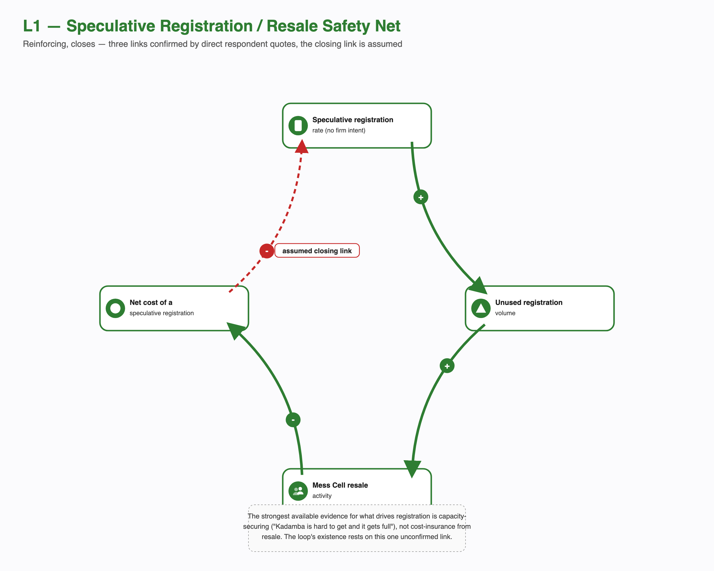
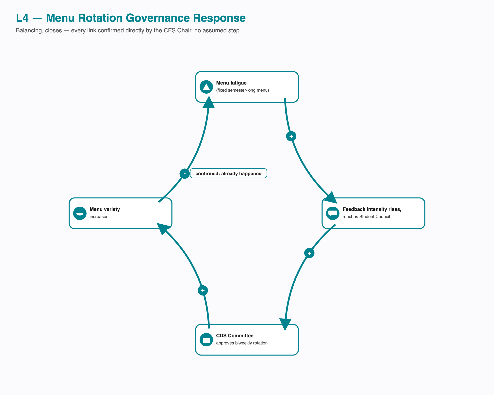
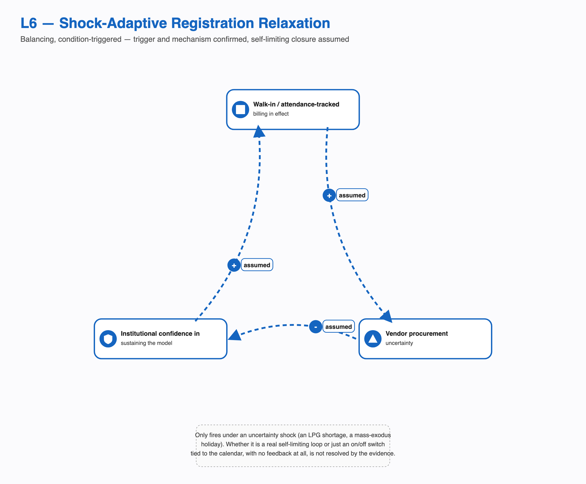
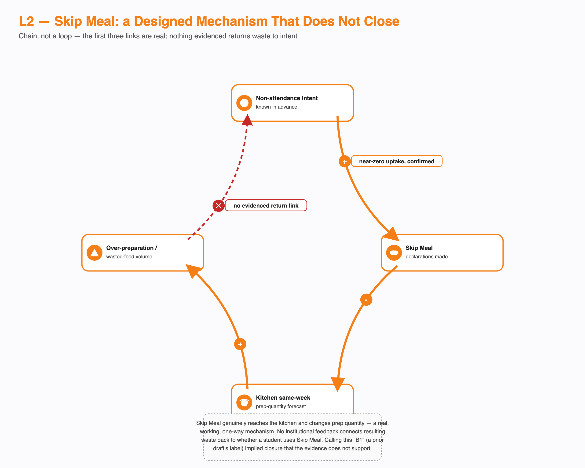

# Overview

A causal loop only exists if the last variable in a chain actually causes the first one. This document tests every candidate feedback mechanism in the Breakfast Paradox against that one rule, using the same real interview transcripts, CFS Chair account, and poster data as the rest of this project. A loop that closes with an even number of negative links is reinforcing: it amplifies whatever starts it. A loop that closes with an odd number of negative links is balancing: it pushes back toward a steady state. A chain that never closes is neither, no matter how naturally it seems to describe a cycle, so it is presented here as a chain, not dressed up as a loop.

The systemic problem analysis in this project names the structures and root causes producing this system's behaviour. This document shows the dynamic mechanisms those structures actually create, and just as importantly, the ones they were designed to create but don't. Eleven candidate mechanisms were tested. Three are given a full closure derivation here, with every link traced to its source: L1, L4, and L6. Two more appear in the summary table with a closing status, but their derivation rests on links this document does not independently re-derive to the same standard, so they are presented as candidates rather than confirmed closures: L9 and L3b. Three are real, evidenced chains that stop short of closing: L2, L5, and L7. Two describe a mechanism that is disconfirmed or structurally absent: L3 and L8. One is a static condition rather than a spiral: L10. Claims below carry the same tags used throughout this project: confirmed, single-sourced, candidate, assumed, disconfirmed.

# The Loop Status Dashboard

| ID | Name | Status | Domain |
|---|---|---|---|
| L1 | Speculative Registration / Resale Safety Net | Reinforcing, closes only if the assumed link holds; the project's best evidence on registration motive points elsewhere | Registration and billing |
| L2 | Skip Meal Mechanism | Chain, confirmed, does not close | Kitchen forecasting |
| L3 | Capacity Redistribution (Kadamba to Bakul/Palash) | Strongly contraindicated by direct testimony, corroborated by the registration pattern | Capacity and demand |
| L3b | Kadamba Demand Lock-in | Reinforcing, candidate, closure not independently re-derived here | Capacity and demand |
| L4 | Menu Rotation Governance Response | Balancing, closes, fully confirmed | Governance |
| L5 | Menu Transparency Effect | Chain, feeds into L1, does not close on its own | Menu and attendance |
| L6 | Shock-Adaptive Registration Relaxation | Balancing if the self-limiting mechanism is real; every link in that mechanism is assumed | Registration precedent |
| L7 | Late-Night Workload to Skip to Crash | Chain, only the first link confirmed | Individual behaviour |
| L8 | Vendor Quality Market Discipline | Absent, the corrective link is severed by design | Vendor economics |
| L9 | Waste Disposal Effectiveness | Reinforcing, candidate, closure not independently re-derived here | Waste and procurement |
| L10 | Known-But-Unowned Gap | Static state, not a reinforcing spiral | Governance |

Three of eleven candidate mechanisms close with every link fully derived here: L1, L4, and L6. Two more, L9 and L3b, carry a closing status in this table but rest on a closing link this document treats as candidate rather than independently re-derived. Three are real, evidenced chains that stop short of closing: L2, L5, and L7. Two describe a disconfirmed or structurally absent mechanism rather than a working one: L3 and L8. One, L10, is a static condition. That split is itself a finding. This system is not short on mechanisms; the specific mechanism it lacks is the one that would connect the registration-attendance gap to anyone positioned to act on it.

# The Loops That Close

## L1: Speculative Registration / Resale Safety Net

A student registers without firm intent to attend, which mechanically produces an unused registration when they don't show. One respondent's own account is the clearest single instance of this: *"Kadamba veg breakfast costs around ₹48 and I book it every day and never avail it."* An unused registration is exactly the supply that feeds the Mess Cell WhatsApp resale market, confirmed directly by a second respondent: *"Yes, I have both bought and sold registrations."* A liquid resale market recovers some of that lost money, lowering the real cost of having over-registered in the first place.

The first three links are confirmed. The fourth, the one that would close the loop, that a lower net cost causes more speculative registration, is not stated by any respondent. It is assumed, and it is the weakest link in the diagram. It is weaker than a plain unconfirmed guess, because the strongest direct evidence this project has about what actually drives registration points somewhere else entirely, toward securing a scarce slot rather than insuring against a wasted one: *"I do register for breakfast for the whole month because Kadamba is hard to get and it gets full."* This loop is diagrammed as closing because the logic is standard economics, not because a respondent confirmed it. A reader should weigh it accordingly: real behaviour and real financial recovery are confirmed; the specific claim that recovery causes more speculative registration is the project's weakest assumed link, sitting against its own strongest counter-evidence.

## L4: Menu Rotation Governance Response

This is the one loop in the entire system where every link traces to a single, direct, named account with no assumed step. A single fixed menu for the whole semester produced sustained menu fatigue. That fatigue generated feedback intense enough to reach the CDS Student Council, which escalated it to the Student Parliament, which the CDS Committee then approved as a biweekly rotation. Menu variety went up, and by the CFS Chair's own account, fatigue-driven complaints went down.

This loop matters beyond menu policy. It demonstrates that the escalation structure in this system can close a feedback loop end to end when a complaint is loud enough. That capability is what makes the gaps elsewhere diagnostically meaningful: the registration-attendance gap does not stay open because this system is incapable of responding to feedback. It stays open because that specific problem never generates the kind of loud, immediate signal this pathway is built to answer. The distinction matters: L4 proves the mechanism exists somewhere in this system, not that it has ever been applied to the registration-attendance gap itself, since menu governance and registration governance are two different processes with two different owners.

## L6: Shock-Adaptive Registration Relaxation

During an LPG shortage, and separately during holidays and long weekends when a large share of students leave campus, this institution made registration non-compulsory. Students could walk in and scan a QR code, or register a day or two ahead at any mess, and were billed only for what they actually consumed. Both the trigger and the walk-in mechanism are confirmed.

What is not confirmed is whether this is a true closing loop or simply an on-and-off switch tied to the calendar. The self-limiting story, that relaxed billing raises vendor procurement uncertainty, which lowers institutional confidence in keeping the model running, which pushes it back toward the standing default, is a coherent systems explanation. But every link in that explanation is assumed, not just the closing one. A simpler reading fits the same evidence equally well: the model reverts purely because the holiday ends, with no feedback dynamic involved at all, no different in kind from a thermostat's schedule rather than its thermostat feedback. This project cannot currently tell those two explanations apart. What is not in question, under either reading, is the headline fact: an attendance-tracked alternative to the standing model has already been built and already worked, more than once, at this institution.

# Candidate Loops Not Independently Re-Derived Here

These two mechanisms carry a closing, reinforcing status in the dashboard above, but this document has not tested their links against primary sources with the same rigor applied to L1, L4, and L6. They are presented honestly as candidates rather than confirmed closures.

## L9: Waste Disposal Effectiveness

Unused registrations plausibly generate waste volume, though the magnitude of that link is unmeasured, and it may partly overlap with under-cooking relative to registered count rather than converting cleanly into plate waste. That waste is confirmed to be handled competently: Kadamba's production and plate waste both go to an outside compost facility, backed by an externally audited five-star food-safety certification. Competent, invisible disposal plausibly removes any cost signal that would otherwise create institutional pressure to fix the registration-attendance gap upstream, and lower pressure plausibly permits more unused registration to continue unchecked, which would close the loop.

The two links that would actually close this loop, that effective disposal suppresses visible pressure, and that suppressed pressure permits more unused registration, are both assumed. Neither has ever been observed to fire in any of this project's documented institutional responses: the confirmed menu-rotation fix, the single-sourced cancellation-cap tightening, and the shock-adaptive relaxation were each driven by something else, workload, complaint intensity, or an external shortage, not by waste-visibility pressure. This is presented as a candidate reinforcing mechanism, not a demonstrated one.

## L3b: Kadamba Demand Lock-in

Kadamba's reputation as the preferred mess plausibly drives registration scarcity there, and scarcity is confirmed to drive registration-locking behaviour, directly stated by a respondent who registers for the full month specifically because Kadamba is hard to get and fills up. The link that would close this into a reinforcing loop, that locking behaviour itself then reinforces Kadamba's reputation, is the weakest link in this entire analysis. The only direct testimony available about what a crowded Kadamba actually feels like describes it as a negative experience, not a status signal, which cuts against rather than supports a self-reinforcing reputation effect. This candidate is retained because a preference-driven concentration dynamic is a plausible explanation for why Kadamba stays saturated while Bakul stays under-registered, but its existence as a genuine loop, not just its strength, should be treated as unconfirmed.

# The Chains That Don't Close, and Why That Matters

Calling something a loop when it isn't implies a self-sustaining cycle the evidence doesn't support. These three are real, evidenced mechanisms. None of them closes.

## L2: Skip Meal: a Designed Mechanism That Does Not Close

Skip Meal was built to solve exactly this problem: a student who knows in advance they won't attend can tell the kitchen, which adjusts its same-week prep quantity down. That second link is confirmed. The first link, whether students with genuine non-attendance intent actually use the feature, is also confirmed, and it is close to zero. Four of six respondents who addressed it directly said they had never used it. One explained why plainly: *"I never use Skip Meal because it doesn't return the money."*

Nothing in the evidence connects the resulting over-preparation or waste back to whether a student decides to use Skip Meal the next time. No waste-visibility nudge, no usage prompt, no institutional signal of any kind closes that gap. This is an adoption failure sitting on top of a mechanism that works exactly as designed on the kitchen's end. An earlier pass of this analysis labeled this a broken balancing loop, which implies a self-correcting dynamic that would eventually pull usage back up. Nothing in the evidence shows that dynamic exists.

## L5: Menu Transparency Effect

The same biweekly rotation that closed L4 created a side effect the CFS Chair raised without being asked: once the menu is posted two weeks ahead, a student can decide in advance not to come on a day they already know they'll dislike. The first link, that the rotation makes the menu predictable, is true by definition. The second, that predictability changes attendance, is single-sourced to that one account and has never been tested against any student's actual behaviour.

This does not close back into menu fatigue or menu policy. If it has an effect at all, it flows forward into more unused registrations on specific days, feeding L1 rather than forming a loop of its own. It is the clearest example in this system of a fix creating a smaller problem downstream of itself.

## L7: Late-Night Workload to Skip to Crash

Staying up late is the best-evidenced single cause of skipping breakfast in this entire project, confirmed independently and repeatedly: *"I've stayed up late because of assignments or classes, or if I sleep around 3:00 or 4:00 a.m. or later, I don't tend to wake up. I prefer sleep over breakfast."* Nearly identical accounts appear across multiple other respondents.

What happens after a skipped breakfast, whether it produces a mid-morning energy crash, a compensatory purchase, or any change to that night's sleep pattern, has never been asked of anyone in this project's evidence base. The rest of this chain is an untested hypothesis carried over from the course's own fictional puzzle brief, not a finding. One confirmed link and three unconfirmed ones is still a real, worthwhile finding about why students skip breakfast. A loop needs more than that, and this chain does not have it.

# What Isn't There: Disconfirmed and Absent Mechanisms

A missing or disconfirmed loop is as much a finding as a working one, and each of these three changes how the rest of the diagnosis should be read.

**L3, Capacity Redistribution, is strongly contraindicated, not merely weak.** The plausible-sounding story, that scarcity at Kadamba pushes students toward Bakul or Palash, runs directly against the evidence. Scarcity does the opposite: it makes students lock down Kadamba harder, not diversify away from it, directly stated by a respondent who registers the whole month "because Kadamba is hard to get and it gets full." Bakul's persistently low registration is better explained by a standing preference gap than by any redistribution dynamic that responds to Kadamba's own crowding. This rests on one direct quote corroborated by the aggregate registration pattern, single-sourced testimony rather than a structural fact, which is why it is described here as strongly contraindicated rather than disconfirmed outright.

**L8, Vendor Quality Market Discipline, is structurally absent.** The link that would normally let falling attendance pressure a vendor to fix quality, attendance affecting vendor revenue, is confirmed severed by design: billing is monthly and tied to registration count, not attendance. Unlike L3, this rests on a structural, by-design fact rather than testimony, so it earns the stronger word. The same registration-billing rule that drives L1 also disables the vendor's own market incentive to protect quality as attendance falls.

**L10, the Known-But-Unowned Gap, is a static condition, not a worsening spiral.** The CFS Chair can state the size of the registration-attendance gap by category, and that awareness has never reached a registration or billing policy conversation. That much is a real, confirmed, stable fact. What it does not show is a cycle that gets worse with each passing month: nothing in this project's evidence tracks the gap's visibility to decision-makers over time, so there is no basis for calling it a reinforcing loop rather than a persistent, unmoving condition.

# Cross-Loop Synthesis

Three structural facts explain a good share of what does and doesn't close across these mechanisms, though not all of them equally, and they are worth stating once rather than separately for each loop.

Billing tracks registration, not attendance. This single rule is what allows L1's low-cost speculation to run, what L8's severed link removes on the vendor's side, and the exact thing L6 demonstrates the institution can suspend on a temporary basis. It also underlies L3b and L9's candidate mechanisms. It reaches roughly half of the eleven mechanisms examined here directly.

Decision rights over menu, kitchen execution, academic scheduling, and billing sit with four different actors, and no one holds all four. That fragmentation is why L4 can close, since menu has a real owner and a real escalation path, while L10 cannot move past a static state, since the registration-attendance gap has no equivalent owner or channel at all. The presence of one and the absence of the other are two readings of the same structural fact.

These two structural facts do not explain everything. L2 fails to close for a narrower reason, Skip Meal's incentive design pays the student nothing, not because ownership is fragmented. L5 fails to close because no channel exists to notice silent, predictable skipping at all, a missing-instrument problem rather than a fragmented-ownership one. L7 fails to close because nobody has ever asked what happens after a student skips, a data gap distinct from the other two. No source anywhere in this project measures waste volume, tracks attendance by mess over time, or states the vendor's actual contract terms; L9's magnitude, L8's motive, and L3b's true driver all run into that same evidentiary ceiling.

# What This Means for the Reframe

This document shows which parts of the reframe's "stable equilibrium" claim rest on a genuinely closed feedback mechanism, and which rest on other evidence entirely. L4 demonstrates a real capability: this system's escalation structure can close a loop end to end when a complaint is loud enough. It says nothing directly about the registration-attendance gap itself, since menu governance and registration governance sit with different owners; using L4 as proof the institution could close the registration loop is an analogy across two different problems, not a demonstrated instance of the same mechanism firing twice. L1 and L6 are each consistent with a stable-equilibrium reading, and each carries real, named uncertainty in its own closing link, uncertainty this document has not resolved and states plainly rather than smoothing over.

The steadier support for describing this system as a stable equilibrium sits elsewhere: in the absorption mechanisms that quietly take up every consequence of the gap before it becomes visible, and in the confirmed fact that this system's attention triggers on how loud a complaint is rather than how large its cost is. Neither of those arguments needs L1 or L6 to be a genuinely closed loop to hold. What this document adds to that broader case is narrower and more mechanical: a demonstrated capability to close feedback loops exists in this system (L4), a demonstrated precedent for solving the core problem exists (L6, regardless of whether its reversion is a loop or a switch), and two designed corrective mechanisms exist but don't connect back to the behaviour they were built to correct (L2, L8). Read together, that supports organizational inertia around a known, previously-solved problem at least as strongly as it supports an actively self-reinforcing spiral, and the two readings are not the same claim.
