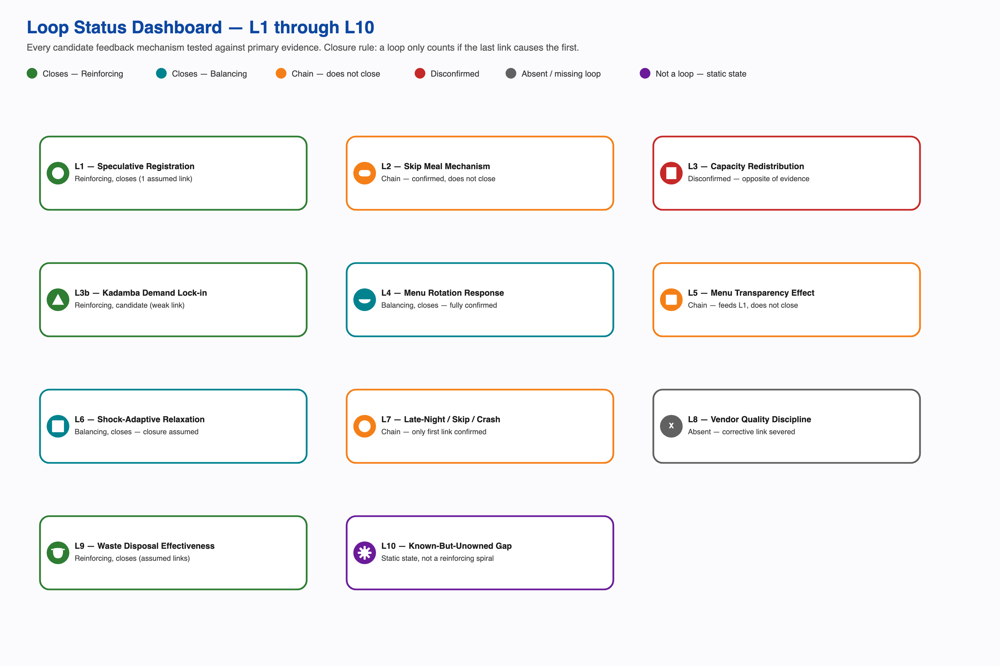
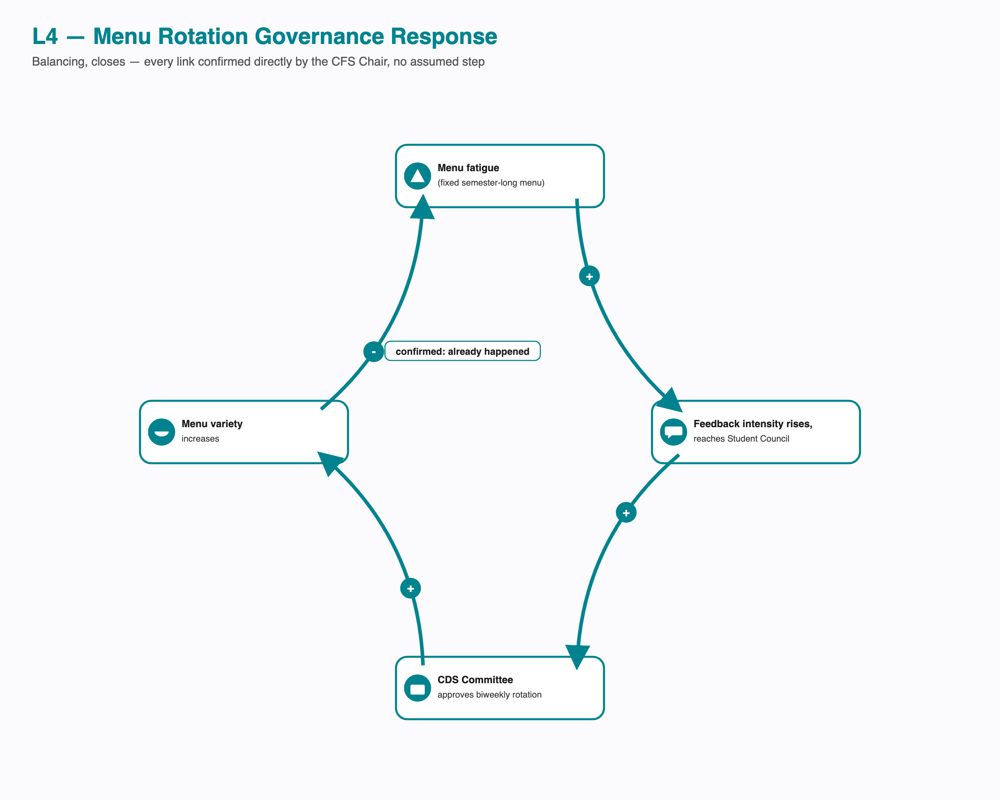
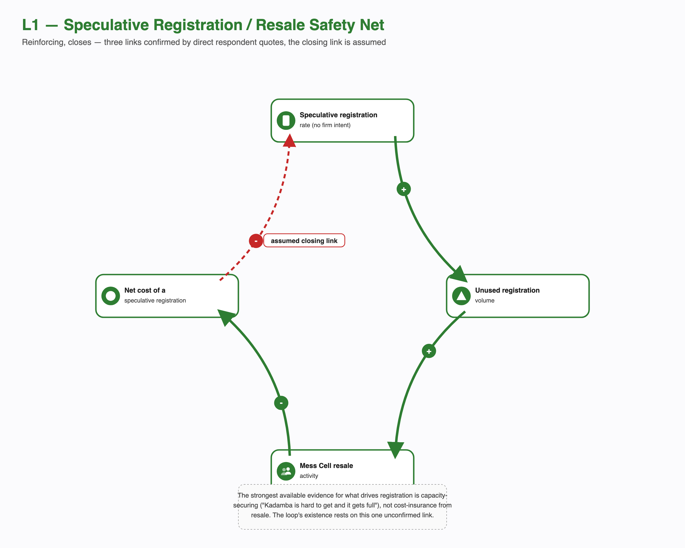
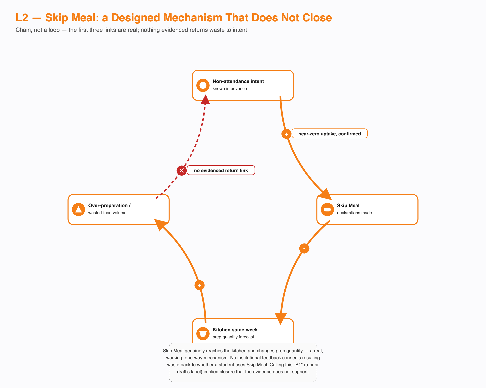
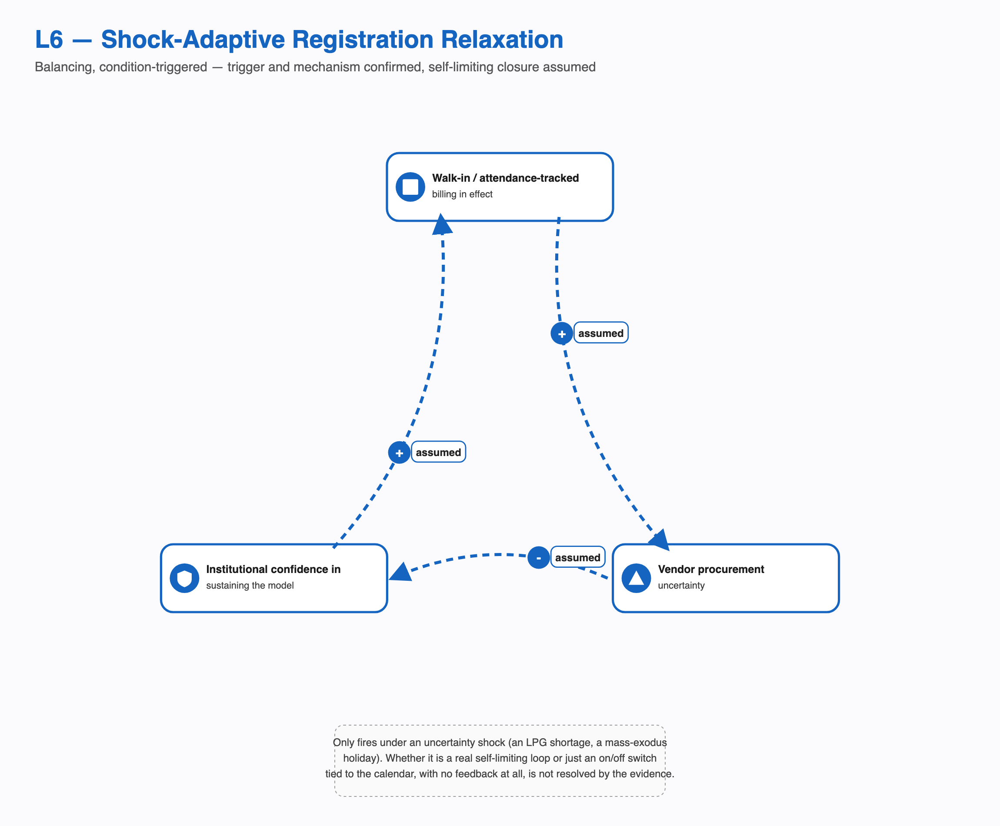

# Overview

A causal loop only exists if the last variable in a chain actually causes the first one. This document tests every candidate feedback mechanism in the Breakfast Paradox against that one rule. The evidence base is the student interviews, the CFS Chair's account, the CDS poster data, interviews with the operators of three messes, the team's own first-hand account of the Kadamba and Yuktāhār visits, the Yuktāhār operator's photographed registers, and the CDS scan export for every Kadamba breakfast registration in April 2026. Kadamba is run by Prism, an outside vendor that wins the contract by tender and runs all Kadamba operations. Yuktāhār, a vegetarian mess with Jain service alongside, is run by ABC Hospitality Services. The third mess is run by Vijayalakshmi Caterers from an off-site kitchen. A loop that closes with an even number of negative links is reinforcing: it amplifies whatever starts it. A loop that closes with an odd number of negative links is balancing: it pushes back toward a steady state. A chain that never closes is neither, no matter how naturally it seems to describe a cycle, so it is presented here as a chain, not dressed up as a loop. Delays are marked with `||` wherever the timing of a link is known.

The systemic problem analysis in this project names the structures and root causes producing this system's behaviour. This document shows the dynamic mechanisms those structures actually create, and just as importantly, the ones they were designed to create but don't. The first version of this analysis was built with no operator-side evidence, so it treated the kitchen as a black box and located every mechanism on the student side or the governance side. The operations evidence opens that box, and the best-evidenced feedback in the system turns out to live inside it. This revision tests eighteen mechanisms, numbered L1 to L17 plus L3b, a reinforcing variant of the capacity story in L3. Three close with every link evidenced, all of them balancing: L4 at the governance level and two kitchen-side loops, L11 and L12. Five are candidate loops whose closing link is assumed, so each is drawn with a dashed closing link rather than counted as a loop: L1, L3b, L9, L15 and L17. Six are real, evidenced chains that stop short of closing, led by the core chain of the whole paradox, L13, which converts an automatic booking into a cooked surplus, and including L6, the shock-adaptive relaxation, which an earlier version counted as a balancing loop. Three describe a mechanism that is disconfirmed, absent, or unresolved: L3, L8 and L16. One is a static condition rather than a spiral: L10. Two mechanisms surfaced by the team's account are placed inside existing ones rather than numbered separately: Yuktāhār's projection from the first half hour of service is a second form of L12, and Kadamba's holding and reheating of surplus is an open branch of L13. Claims below carry the same tags used throughout this project: confirmed, single-sourced, candidate, assumed, disconfirmed. Figures read directly off a register or the scan export are confirmed, and so is anything the team saw on site, such as the display plate, the tasting before service and the books themselves. Statements by the Yuktāhār operator, recorded in clear English, are confirmed as his account of his own practice. Statements by the Kadamba operator that a team member heard first-hand are single-sourced: the figure itself is not in doubt, but it remains the operator's claim about his own practice. Statements by the Vijayalakshmi operator come from noisy recordings and are single-sourced.

# The Loop Status Dashboard

| ID | Name | Status | Domain | Delay |
|---|---|---|---|---|
| L1 | Speculative Registration / Resale Safety Net | Reinforcing, candidate; closing link assumed; automatic registration (L13) now explains flat registration without it | Registration and billing | Automatic default, weekly or monthly cycle unconfirmed; cancellation at least 4 days ahead |
| L2 | Skip Meal Mechanism | Chain, does not close; kitchen link unresolved, since Kadamba says it cooks on registrations only while an earlier finding says Skip Meal declarations reach the kitchen | Kitchen forecasting | Cancellation at least 4 days ahead; plan the day before |
| L3 | Capacity Redistribution (Kadamba to Bakul/Palash) | Strongly contraindicated by direct testimony, corroborated by the registration pattern | Capacity and demand | None identified |
| L3b | Kadamba Demand Lock-in | Reinforcing, candidate; first links now compete with automatic registration as an explanation, closing link unchanged | Capacity and demand | Automatic registration cycle |
| L4 | Menu Rotation Governance Response | Balancing, closes, confirmed | Governance | Semester to policy cycle |
| L5 | Menu Transparency Effect | Chain, does not close; item-dependence of turnout now corroborated | Menu and attendance | Menu posted two weeks ahead |
| L6 | Shock-Adaptive Registration Relaxation | Chain, condition-triggered switch; revised from a balancing loop, since every link of the self-limiting reading is assumed and the kitchens plan cooked quantity one day ahead | Registration precedent | Holiday or shock duration |
| L7 | Late-Night Workload to Skip to Crash | Chain, first link confirmed and now matched by the weekday pattern | Individual behaviour | Overnight |
| L8 | Vendor Quality Market Discipline | Unresolved; depends on whether the vendor is paid per registered or per served plate; Kadamba says it cooks to the count because it is paid for it | Vendor economics | Monthly payment |
| L9 | Waste Absorption | Reinforcing, candidate; revised, surplus goes to reuse, outside diners, staff meals, food held into later service, back-door late-comers and the bin, not compost | Waste and absorption | Cooked food usable 3 to 4 hours |
| L10 | Measured-But-Unrouted Gap | Static state, not a reinforcing spiral; revised from "known but unowned" | Governance | No route, so no delay to measure |
| L11 | Operator Waste-Learning (Yuktāhār) | Balancing, closes, confirmed at one mess; absent at Kadamba, which keeps gram standards but no turnout-learning record | Kitchen conversion | Tomorrow's plan; 1 to 2 week lookup |
| L12 | Counter Monitoring and Top-Up | Balancing, closes, confirmed; corrects upward only; supervisor-called against gram standards at Kadamba, projected from the first half hour at Yuktāhār | Kitchen conversion | 10 to 15 minutes on-site against a crest in the last 10 minutes; about 30 minutes off-site |
| L13 | Standing Booking to Fixed-Ratio Over-Preparation | Chain, does not close; the core chain of the paradox; registration is an automatic default; surplus carried forward at a quality cost (open branch) | Registration to kitchen | Cancellation lead at least 4 days; plan the day before; cooking from 5:30 |
| L14 | Closing Rush to Just-in-Case Over-Preparation | Chain with a candidate reinforcing closure (ratchet) | Kitchen conversion | 10 to 15 minute top-up against a crest in the last 10 to 15 minutes |
| L15 | Soft Close | Reinforcing, candidate; only the first link is evidenced | Arrival behaviour | Unknown |
| L16 | Operator Waste to Menu Choice | Absent; operators hold the waste data, the committee holds the menu | Menu and kitchen | No route |
| L17 | Kitchen Competence Shifts the Burden | Candidate; symptomatic side confirmed, pressure-reduction link assumed | Structure | Daily correction, no upstream accumulation |

Three of eighteen mechanisms close with every link evidenced: L4, L11 and L12. Five carry a candidate closure whose closing link is assumed: L1, L3b, L9, L15 and L17. Six are evidenced chains that stop short of closing: L13, L14, L2, L5, L6 and L7. Three describe a disconfirmed, absent or unresolved mechanism: L3, L8 and L16. One, L10, is a static condition. That split is itself a finding. This system is not short on mechanisms, and it is not short on measurement either. The gap is measured and acted on every day inside the kitchen, by loops that work. What the system lacks is any route from those measurements to whoever sets the registration rule, so every working loop corrects the kitchen's conversion of registrations into food and none of them touches the booking.

# Reinforcing and Balancing Feedback Loops

## L11: Operator Waste-Learning (Yuktāhār)

At Yuktāhār, cooked quantity above what is eaten raises the leftover and the run-out time recorded in the Wastage Book. That record is read at a planning meeting held twice a day, the first half of the day for the next breakfast and lunch and the second half for snacks and dinner. The meeting looks up the matching past day: the menu repeats with weeks one and three identical and weeks two and four identical, so a week-three Thursday is planned from the week-one Thursday. It also reads the month's turnout pattern, any holidays, special weeks or campus events, and the registrations, counted as regular plus Jain plus cash meals. The meeting's output is the next day's issue list in the Grocery Book: a larger recorded leftover lowers the next issue, and a lower issue lowers the cooked quantity above what is eaten. One negative link makes this loop balancing, and every link is evidenced. The Wastage Book is confirmed from photographed pages that record, per item, raw quantity issued, cooked quantity, left over, percentage wasted, run-out time, re-cook quantity, registered and actual diners, and plate and kitchen waste. Its use as a planning input alongside portal registrations and an attendance register grouped by weekday is confirmed by the site head. The issue list is confirmed from the Grocery Book, whose header for 18 September reads breakfast 265 plus 14. The closing link has a stated rule form, confirmed from the site head: *"If it runs out at 1:30 we re-cook; if at 2:20 we don't."* He pointed to the Sunday 6 September breakfast row, 18.7% attendance, as a figure to be used "not even next month, next week."

The loop has an explicit goal, which is what a balancing loop steers toward. The coordinator watches a wastage board of daily wastage figures and works to push the waste share down steadily, and the operator states the aim of the whole operation as best food quality, less waste, an optimised workflow, lower operating cost, standardisation and higher profit, single-sourced. Waste reduction is a cost lever for this vendor, not only a quality one, and that is why the loop is run at all.

The loop carries two delays. The plan is fixed the day before service (`||` T-1), and the learning lag is one to two weeks, since the matching menu day recurs every two weeks and the weekday register is applied the following week. A third, slower delay sits behind the loop's existence. Waste weighing began in August of the previous year and staff first feared being blamed for mistakes (*"they are catching us"*). The managers deliberately made the weighing blame-free and discussed it at the daily meeting, and by December the staff themselves reported that waste had fallen. That outcome is confirmed only as the operator's self-report; no before-and-after figures were seen. One production sheet shows the loop's output on a single day: on Thursday 3 September, 278 were registered for breakfast and 77 ate, semia upma was made from 2 kg raw with a 1 kg re-cook at 9:00, and none of the upma was left over. The attendance register for the same day records 110, so the two records disagree on that morning.

The measurement link of this loop is only as honest as the recording culture behind it, and three conditions hold that culture up. They are preconditions of the loop, not part of it, and none of them is drawn as a loop of its own. The first is the blame-free weighing described above. The second is peer cross-checking: the mess has no hierarchy and everyone does every job, the mess in-charge who keeps the accounts also keeps the Wastage Register, and other staff cross-check her records and the grocery register, all single-sourced. The third is a two-book rule: the store book, which records what was issued, must match the physical book, which records what was cooked, and a mismatch is raised at the daily meeting, single-sourced. The rule holds on record for 18 September, when 4.5 kg of toor dal was issued and a balance of 49.45 kg stood in both the Grocery Book and the stock register, confirmed. All of this runs on paper. The operator tried a commercial ERP system to predict rush and streamline groceries and dropped it, judging the cost unjustified when the data already sits in the books and noting that staff are not digitally inclined, single-sourced.

Four limits apply. The site head believes breakfast turnout is "about 50%" while his own September register shows 17.7% to 40.2%, averaging about 28% on the legible rows, so the loop corrects item by item and weekday by weekday while anchoring on a mistaken overall figure. The loop adjusts quantity only, never registration. It is one operator's account from one visit, with the self-presentation bias that carries. And it exists at one mess of the three observed. Kadamba keeps per-dish gram standards, four idlis per person from about 120 g of batter and 100 g of sambar, with standards for poha, pulao and other dishes, single-sourced; that is a portion standard, not a record that learns from turnout, and no such record is described there. The Kadamba operator put it plainly in an earlier recording, *"We don't have that idea… it was wasted many times,"* single-sourced. The two operators work under the same registration arrangement yet hold opposite stances. Yuktāhār treats waste as lost cost to be learned away. Kadamba cooks on registrations regardless of whether people want to eat, *"because it is a responsibility and they are getting paid for it,"* single-sourced. That difference in stance is a candidate explanation for why the loop is present at one hall and absent at the other; no contract term behind either stance has been seen. The same loop being present at one hall and absent at another is itself a finding about where this system's competence sits.

## L12: Counter Monitoring and Top-Up

Within a single meal, food remaining at the counter falls, the periodic check registers a rising risk of running out, the counter asks for a re-cook or top-up, and food at the counter rises again. One negative link makes this loop balancing, and all three operators describe it. At Kadamba, single-sourced, the first batch is cooked and the remaining raw material is held ready to cook in 10 to 15 minutes on request. The supervisor constantly checks the counters and tells the kitchen how much to cook: staff watch how much of each item is left at what time against the per-dish gram standards and ask the chef for a number of portions, combining the registration count with turnout so far. The team's own illustration of that judgement: if a 50% first batch is gone in the first 45 minutes, the rest of the meal is cooked against the observed flow. An earlier recording adds that staff watch live scan counts, single-sourced. At Yuktāhār, confirmed from the site head and the production sheet, staff check every 30 minutes from about 45 minutes before close, open a second counter during surges, and re-cook by the run-out-time rule; the 3 September re-cook at 9:00 is on record. Rotis there are handmade without oil, and two roti counters open at peak, confirmed as observed practice; whether that happens at breakfast is not known. At the Vijayalakshmi mess, single-sourced, staff check every 30 minutes against the projection and extra food arrives from a kitchen about 40 minutes away within 30 minutes. That off-site kitchen is a candidate match for the one serving Bakul and Palash.

Yuktāhār runs a second, forward-looking form of the same loop, single-sourced. The first half hour of service is used as a sample to project how many will come for the rest of the meal, and that projection drives top-up cooking: a larger gap between projected remaining demand and food prepared raises top-up cooking, and more top-up closes the gap. One negative link makes this form balancing too, and every link is described by the operator; its use at breakfast is candidate. Its weakness is the sample itself, which is the part of the morning least like the close. On the Kadamba April curve, confirmed, 15.3% of scans fall between 7:30 and 8:00. A flat projection of that rate across a two-hour service gives about 240 of the roughly 398 daily scans, about 40% short, because 26.5% of scans arrive between 9:15 and 9:30 (candidate arithmetic; Yuktāhār's own arrival curve is unmeasured).

The delays are what shape this loop's behaviour: a 30-minute check interval, then 10 to 15 minutes on-site (`||`) or about 30 minutes off-site (`||`) before the correction lands. Set against the crest, the on-site delay is decisive. The Kadamba operator's rule of thumb is about 100 diners in the opening phase, about 100 through the middle and about 150 in the last 10 minutes, *"for any meal the highest flow is in the last 10 minutes,"* single-sourced. The records are the measurement: about 79 scans a day between 9:20 and 9:29 and about 37 a day at or after 9:30, confirmed. A top-up requested when the final surge becomes visible lands at or after the 9:30 close (`||` 10 to 15 minutes against a 10 to 15 minute crest), so this loop structurally cannot track the crest. It can only be pre-empted by a buffer cooked in advance, which is L14's hedge. The operator's rule also puts about 43% of diners in the last 10 minutes, while the records put about 20% in 9:20 to 9:29; the operator perceives the crest as larger than measured, a candidate input to the just-in-case hedge in L14.

The loop is also asymmetric. It corrects only upward. Cooked food cannot be un-cooked and is usable for three to four hours, so surplus inside the meal has no downward correction in quantity. At Kadamba it is carried forward instead: held, reheated and moved between vessels, at a cost to quality, the open branch of L13. This loop protects against shortage and cannot reduce surplus; surplus is handled only by the slower L11 where it exists, and otherwise not at all. The loop also shows that kitchens already act on same-day demand information when they have it, since the Kadamba top-up runs on what the supervisor sees at the counter.

## L4: Menu Rotation Governance Response

This is the governance-level loop in the system where every link traces to a single, direct, named account with no assumed step. A single fixed menu for the whole semester produced sustained menu fatigue. That fatigue generated feedback intense enough to reach the CDS Student Council, which escalated it to the Student Parliament, which the CDS Committee then approved as a biweekly rotation. Menu variety went up, and by the CFS Chair's own account, fatigue-driven complaints went down. The rotation structure is now also confirmed in the operator's records, which plan against a two-week cycle with weeks one and three identical and weeks two and four identical. All three operators say the menu is chosen by students or the committee, not by them. A live test of whether this loop fires again is under way at Kadamba: dinner sambar was dropped, and a student complained it was removed *"while they are taking more money from us."* That complaint is single-sourced and has not, so far, reversed the change. Kadamba also sets a wrapped display plate of every meal at the entrance, confirmed as observed; it is a same-moment menu signal, distinct from the two-week posting, and since it is seen at the door it cannot inform a decision to skip.

This loop matters beyond menu policy. It demonstrates that the escalation structure in this system can close a feedback loop end to end when a complaint is loud enough. That capability is what makes the gaps elsewhere diagnostically meaningful: the registration-attendance gap does not stay open because this system is incapable of responding to feedback. It stays open because that specific problem never generates the kind of loud, immediate signal this pathway is built to answer. L4 proves the mechanism exists somewhere in this system, not that it has ever been applied to the registration-attendance gap itself, since menu governance and registration governance are two different processes with two different owners.

# Candidate Loops

Each of these would close into a loop if its last link held, but that closing link is assumed. They are presented as candidates, drawn with a dashed closing link, not counted as loops.

## L1: Speculative Registration / Resale Safety Net

A student registers without firm intent to attend, which mechanically produces an unused registration when they don't show. One respondent's own account is the clearest single instance of this: *"Kadamba veg breakfast costs around ₹48 and I book it every day and never avail it."* An unused registration is exactly the supply that feeds the Mess Cell WhatsApp resale market, confirmed directly by a second respondent: *"Yes, I have both bought and sold registrations."* The Kadamba operator describes the same transfer from the kitchen's side, single-sourced: students register "even if you are in the village" and a friend eats in their place. Under automatic registration that is exactly what happens: the default keeps running while the student is away, and a friend eats against it. A liquid resale market recovers some of that lost money, lowering the real cost of having over-registered in the first place.

The first three links are confirmed. The fourth, the one that would close the loop, that a lower net cost causes more speculative registration, is not stated by any respondent. It is assumed, and it is the weakest link in the diagram. The strongest direct student evidence about what drives registration points toward securing a scarce slot rather than insuring against a wasted one: *"I do register for breakfast for the whole month because Kadamba is hard to get and it gets full."* Registration itself now turns out to need no motive at all. It is mandatory and automatic: students are registered whether or not they are on campus, holidays included, the only exit is up to five cancellations per meal type per month, each made at least four days ahead, and beyond those there is no way to nullify the charge, confirmed from the CDS poster and the students' own experience. Kadamba breakfast registrations in April 2026 sat flat at about 1,070 every day of the week, Sunday included, which is what automatic, mandatory registration with a narrow four-day opt-out produces regardless of anyone's intent (L13). Respondents still speak of "booking" and "registering for the whole month"; under an automatic default that booking may be passive, and whether students experience it as a choice is untested. An earlier version of this analysis led with L1 as the main registration-side loop; the operations evidence revised that, and the student-side account of automatic registration demotes it further. L1 is a behaviour that operates on top of the default, not a driver of registration.

## L9: Waste Absorption

An earlier version of this analysis stated that Kadamba's production and plate waste both go to an outside compost facility. The operations evidence revises that: the Kadamba operator's own account, single-sourced, is that waste goes to a dustbin and the garbage contractor takes it away, with no composting. The two accounts have not been reconciled with the institution. Surplus is absorbed through five routes before what remains reaches the bin, a list revised here from an earlier one that understated who eats from the same food. Leftovers are reused: at Yuktāhār, confirmed, leftover idli becomes idli upma or idli poha for lunch, dosa batter goes back into the fridge and surplus milk is set as curd; at the Vijayalakshmi mess, single-sourced, some leftovers go back to the kitchen and "the rest is thrown away." Kadamba cooks about 30 extra portions for people outside the student registration, roughly 30 to 50 people such as night-shift security who do not want to leave to eat, single-sourced; an earlier recording gave 30 to 40 extra portions for paying or unregistered diners, and whether these are one allocation is unconfirmed, as is whether they sit inside or on top of the 70% first batch. About half of Kadamba's own staff also eat at the mess, single-sourced; this replaces an earlier figure of 20 to 30 cooking and security staff, since security are outside diners, not Kadamba staff. Food not eaten in the first round is held and reheated into later service, the team's own judgement and a candidate route (L13). Late-comers who enter by the back door after the 9:30 close take a further share, single-sourced (L15). What remains goes to the bin. Yuktāhār's final disposal route was not stated. The kitchen's food-safety competence, set out under L8, is part of this absorption layer.

The size of that absorption is where the evidence is in tension. The Kadamba operator puts daily wastage at about 5 to 10%, without stating whether that is per meal or per day, or by weight of cooked food, single-sourced. April averaged about 1,072 registered and 398 eaten a day, confirmed; a 70% first batch is about 750 portions, a first-batch surplus of about 350 before any top-up (candidate arithmetic). By line, veg averaged 757 registered and 245 eaten, so a 70% batch of about 530 is about 2.2 times what was eaten; non-veg averaged 315 registered and 153 eaten, so a batch of about 220 is about 1.4 times. A 5 to 10% waste figure fits that only if most of the surplus is absorbed by outside diners, staff and food held into later service, if the first batch is smaller in practice than the ratio implies, or if the figure is measured on a different base. The evidence does not say which, and this analysis does not assume one.

The earlier version also rested on waste never becoming visible. That premise is revised too. Waste is visible to operators, in kilograms, per item, at Yuktāhār, and Kadamba states a waste percentage. What stays invisible is the route from that record to anyone who sets registration or billing rules. The two links that would close this loop, that absorbed surplus suppresses visible pressure and that suppressed pressure permits more unused registration, remain assumed. Neither has been observed to fire in any documented institutional response: the menu-rotation fix, the single-sourced cancellation-cap tightening, and the shock-adaptive relaxation were each driven by workload, complaint intensity, or an external shortage, not by waste-visibility pressure. The better-grounded version of this idea is L17, which rests on observed kitchen correction rather than on disposal.

## L17: Kitchen Competence Shifts the Burden

This candidate joins the confirmed kitchen loops to the unrouted gap. The symptomatic correction, operators discounting registrations and topping up live (L11, L12), relieves the visible consequences of the gap every morning: queues are cleared, shortages are re-cooked, and surplus is reused, fed to outside diners and staff, held into later service, or binned. Because each morning's consequence is handled locally, no signal accumulates upstream, which plausibly reduces pressure for the fundamental correction, a registration that tracks the daily decision to eat. The side effect is that operator competence keeps the problem invisible to the rule owner. Two further facts make the burden shift partly beneficial to the people inside it. The surplus has beneficiaries: night security and about half of Kadamba's staff eat from the same food, so a correction that cut first-batch surplus would take their meals unless it planned for them. And an operator who treats the registration count as an obligation it is paid to meet has no motive to raise a signal upstream. The symptomatic side is confirmed. The pressure-reduction link is assumed, but it is better grounded than L9's version because the correction routes are observed rather than inferred. This is the clearest statement in the analysis of why the system is stable rather than broken.

## L3b: Kadamba Demand Lock-in

Kadamba's reputation as the preferred mess plausibly drives registration scarcity there, and scarcity is confirmed to drive registration-locking behaviour, directly stated by a respondent who registers for the full month specifically because Kadamba is hard to get and fills up. The April records are consistent with these first links: about 1,070 registrations a day, 62.9% of them unused, with veg breakfasts the least used at 32.4% turnout. That is the pattern slot-locking predicts, registering to hold a scarce place and then not coming. It is also the pattern automatic registration predicts, since a student allocated to Kadamba by default is registered every day whether or not they use it, so the aggregate records support this candidate less than an earlier version stated. The respondent's quote remains one student's motive. The Vijayalakshmi operator's claim that Kadamba gets 90 to 95% turnout is contradicted for breakfast by those records, an example of operators holding mistaken beliefs about other halls. The link that would close this into a reinforcing loop, that locking behaviour itself reinforces Kadamba's reputation, remains the weakest link in this analysis. The only direct testimony about what a crowded Kadamba feels like describes it as a negative experience, not a status signal. This candidate is retained because a preference-driven concentration dynamic is a plausible explanation for why Kadamba stays saturated while Bakul stays under-registered, but its existence as a genuine loop should be treated as unconfirmed.

## L15: Soft Close

At Kadamba, single-sourced, when the front door closes at 9:30 people come in through the back door and demand food, and the mess cannot refuse them; the operator calls last-minute arrivals "a pain." The operator's wording covers the 9:30 dinner close as well as breakfast, so back-door entry at breakfast is candidate, supported by the records: 9.2% of April breakfast scans came after 9:30 and the latest at 10:07, confirmed. An earlier recording adds that the door is reopened for five to ten minutes on some days and that on one biryani day 25 students came after close, single-sourced. If students learn that the close is soft, they arrive later, which builds the late crest and produces more late-comers at close. With no negative link in the cycle, this would be reinforcing. Only the first link is evidenced. The learning links are assumed, and no student has been asked whether back-door service changes when they leave for breakfast.

# Causal Chains That Do Not Close

Calling something a loop when it isn't implies a self-sustaining cycle the evidence doesn't support. These six are real, evidenced mechanisms. None of them closes, and for the first two that is the diagnostic point.

## L13: Standing Booking to Fixed-Ratio Over-Preparation

This is the core chain of the Breakfast Paradox. An earlier version described registration as taken in weekly blocks; the students' account revises that. Registration is mandatory and automatic, running whether or not the student is on campus. The only exit is up to five cancellations per meal type per month, each made at least four days ahead, and beyond those the charge cannot be nullified, confirmed. The Kadamba operator describes the same arrangement as "weekly compulsory," and his team has challenged the cut-off, single-sourced; whether the cycle is weekly or monthly is unconfirmed. Either way, registration is a standing booking the student never had to make, decoupled from the daily decision to eat. The registered count therefore stays flat across the week: Kadamba breakfast in April 2026 ran between 928 and 1,123 a day, averaging about 1,070 on every weekday, confirmed. Turnout did not stay flat. It ranged from 42.1% on Tuesdays and 41.1% on Mondays down to 34.8% on Saturdays and 27.3% on Sundays, and across the month 62.9% of registered breakfasts went unused, confirmed. At Yuktāhār in September, breakfast turnout ran from 17.7% to 40.2% with Sundays among the lowest days, while lunch under the same booking system ran 56% to 89%, confirmed.

The kitchen converts that flat count into a first batch by one of two logics. Kadamba cooks 70% of registrations, with veg and non-veg planned separately, single-sourced. The Vijayalakshmi mess cooked for 70% and now cooks for 80%, single-sourced. Both are fixed ratios with a reactive top-up. Yuktāhār uses no fixed ratio: it plans from its registers and Wastage Book (L11) while believing turnout is about half, confirmed. Built on the Kadamba ratio, the candidate arithmetic is a first batch roughly 1.9 times what April turnout needed, about 2.6 times on Sundays and about 1.7 times on Tuesdays. By line it is about 2.2 times for veg and about 1.4 times for non-veg, so over-preparation concentrates on the veg line, the most registered and least used. A fixed ratio applied to a flat count means over-preparation is worst on exactly the days and the line where turnout is lowest. The ratio is set per meal type rather than from any turnout record: Kadamba's biryani lunch is cooked at 100% of registrations, two pieces of 150 to 200 g each with unlimited rice, and when some diners take three pieces later diners run short, single-sourced. Even full preparation runs short when portions drift. At breakfast the operator names bonda, puri, vada and idli as items that "float", with diners taking more than the gram standard, single-sourced; whether they run out is not recorded. The surplus then passes into the absorption routes in L9, where its size is in tension with Kadamba's stated 5 to 10% waste.

Four delays separate the decision from the meal. A student who wants out must cancel at least four days ahead (`||` T-4), which is the delay that decouples the daily decision to eat from the bill. The quantity decision is made the day before (`||` T-1), against procurement tiers set further back: at Kadamba dry goods are bought a week ahead, some vegetables two to three days ahead and perishables such as milk, fruit, meat, eggs and most vegetables the day before, single-sourced. The Kadamba chef arrives at 5:30 and batch-cooks sambar and upma, and live items such as dosa are cooked in front of diners from 7:00; Yuktāhār cooks from 5:30 and is ready by 7:30, single-sourced. The first batch is therefore fixed about three and a half to four hours before the crest, and it must be cooked, temperature-checked, sampled and tasted before service begins (L8), before any turnout signal exists. No link runs from the surplus back to registration behaviour or to the registration rule. Operators control quantities, not rules or menus, and nothing routes their registers to the rule owner. At Kadamba the operator treats the count as the obligation, cooking on registrations *"because it is a responsibility and they are getting paid for it,"* single-sourced, so no link runs from surplus back to the ratio either (L8). The chain does not close, and that is the structural reason the gap persists: the only loops that act on it, L11 and L12, act on the kitchen's conversion and never on the booking. The same booking structure produces lunch turnout of 56% to 89%, which is why the problem is breakfast rather than meals in general.

The surplus has one further consequence at Kadamba, an open branch of this chain. In the team's own judgement, candidate, Kadamba's main quality problem is that food is cooked ahead, reheated again and again and transferred between vessels for display and service, so it degrades fast. First-batch surplus raises the food held into later service, which raises reheating and vessel transfers, which lowers food quality. The display plate at the entrance is one of those transfers, confirmed as observed. If lower quality led to more skipping and complaints, lower turnout would raise the surplus relative to what is eaten, and the branch would close with four negative links into a reinforcing loop. That closing link is not evidenced, so it is drawn dashed and the branch is treated as an open chain. It sharpens what L12 says about surplus: the surplus has no downward correction in quantity, and it is carried forward at a quality cost. It is also a candidate part of the answer to the waste tension in L9, since held and reheated food is not binned.

## L14: Closing Rush to Just-in-Case Over-Preparation

Arrivals crest at close. In the April records, 26.5% of all Kadamba breakfast scans fell between 9:15 and 9:30 and 13.5% between 9:00 and 9:15; the rate climbed to about nine scans a minute at 9:29, about 79 scans a day fell between 9:20 and 9:29, service closed around 9:35 to 9:45, and the latest scan came at 10:07, all confirmed. The Yuktāhār site head says the rush is always at closing time, with longer queues on aloo paratha and dosa days, confirmed. The Kadamba operator's rule of thumb puts about 150 diners in the last 10 minutes, single-sourced, and the Vijayalakshmi mess reports waves of 30 to 35 every ten minutes, single-sourced; both are consistent with the records in shape, and the records remain the measurement. Demand in the last ten to fifteen minutes outruns what top-up can deliver in time (`||` 10 to 15 minutes on-site, about 30 off-site), so the same morning can produce shortage and surplus together. On the shortage side, Yuktāhār re-cooked at 9:00 on 3 September, confirmed; Kadamba late-comers come in by the back door after close, single-sourced; and diners take more than the gram standard of bonda, puri, vada and idli, single-sourced, a candidate cause of run-outs on those items whatever the turnout. On the surplus side, the Vijayalakshmi mess raised its ratio from 70% to 80% for a reason not stated and keeps a buffer at its 9:20 to 9:30 inspection, single-sourced, and Kadamba holds raw material ready for a 10 to 15 minute cook, single-sourced. An earlier version counted Kadamba's extra portions as part of this hedge; that is revised, since they are cooked to feed outside diners such as night security, a planned commitment rather than a buffer against the crest (L9).

A candidate reinforcing closure sits on this chain. Shortages are loud, visible as queues, complaints and back-door arrivals. Surplus is silent, absorbed by outside diners, staff, reuse, reheating and the bin. If an operator raises its ratio after run-outs and never lowers it after surplus, the ratio ratchets upward. The upward move from 70% to 80% is observed at one operator; the absence of any downward move is inferred from silence. The Kadamba operator's perceived crest, about 43% of diners in the last 10 minutes against about 20% in 9:20 to 9:29 on the records, is a candidate reason a hedge would be set high. This closure is a candidate: it is treated as a chain with a dashed closing link, not as a loop. The chain still matters without it: it shows that part of the over-preparation is a rational hedge against a delay at close, not only a misreading of registration.

## L2: Skip Meal: a Designed Mechanism That Does Not Close

Skip Meal was built to solve exactly this problem: a student who knows in advance they won't attend can tell the kitchen, which adjusts its prep quantity down. The first link, whether students with genuine non-attendance intent actually use the feature, is confirmed, and it is close to zero. Four of six respondents who addressed it directly said they had never used it. One explained why plainly: *"I never use Skip Meal because it doesn't return the money."* The team's account is consistent: Skip Meal tells the kitchen not to prepare but does not remove the charge, and students say they have no way to nullify it.

The kitchen link was earlier recorded as confirmed, on a finding that Skip Meal declarations reach the kitchen for same-week preparation. The operations evidence puts that in open conflict. All three operators plan from the portal registration count the day before, and none named Skip Meal as a planning input. The Kadamba operator goes further: the mess cooks *"based only on the number of registrations"* and *"doesn't care if people don't want to eat,"* single-sourced. The two findings are stated side by side here and not merged. They are compatible only if a Skip Meal declaration lowers the count the operator sees while the operator treats whatever count it sees as the obligation, which has not been checked. Until one direct question settles it, the kitchen link is unresolved. Even if it holds, the declaration arrives after the four-day cancellation lead and before the day-before plan. Nothing in the evidence connects the resulting over-preparation or waste back to whether a student decides to use Skip Meal the next time. An earlier pass labeled this a broken balancing loop, which implies a self-correcting dynamic that would eventually pull usage back up. Nothing in the evidence shows that dynamic exists.

## L5: Menu Transparency Effect

The same biweekly rotation that closed L4 created a side effect the CFS Chair raised without being asked: once the menu is posted two weeks ahead, a student can decide in advance not to come on a day they already know they'll dislike. The first link, that the rotation makes the menu predictable, is true by definition. The second, that turnout depends on the item, is now corroborated. The Yuktāhār site head says turnout "can go down or up depending on the item," with longer queues on aloo paratha and dosa days and 92% for Sunday-night paneer, confirmed. The Vijayalakshmi mess reports 85 to 90% on non-veg days, single-sourced. The Kadamba records show non-veg breakfasts at 48.5% turnout against 32.4% for veg, confirmed. The records are not uniform: Yuktāhār's aloo paratha breakfast on 3 September drew 28% or 40% depending on which register is read. Whether advance knowledge of the menu causes students to skip, rather than same-morning preference, remains untested.

This does not close back into menu fatigue or menu policy. If it has an effect at all, it flows forward into more unused registrations on specific days, feeding L13 rather than forming a loop of its own.

## L6: Shock-Adaptive Registration Relaxation

During an LPG shortage, and separately during some holidays and long weekends when a large share of students leave campus, this institution made registration non-compulsory. Students could walk in and scan a QR code, or register a day or two ahead at any mess, and were billed only for what they actually consumed. Both the trigger and the walk-in mechanism are confirmed. The Kadamba operator describes the kitchen's side of the LPG shock, single-sourced: quantities were cut back a little and some items were bought from outside. The relaxation was episodic. Students say they are otherwise auto-registered through ordinary holidays, confirmed from their own experience, so the switch is not thrown even for every holiday, and which holidays were relaxed is unconfirmed.

An earlier version of this analysis counted this as a balancing loop that limits itself: relaxed billing raises the vendor's procurement uncertainty, which lowers institutional confidence in keeping the model, which pushes it back toward the standing default. That has been revised. Every link in that story was assumed, and the operations evidence weakens its first step. The kitchens set cooked quantities the day before and buy perishables one day ahead; dry goods are bought a week ahead and some vegetables two to three days ahead, but dry goods keep, so a walk-in model does not take away a planning horizon the kitchen relies on for cooked quantity. The simpler reading fits the evidence better: the model reverts because the shortage or the holiday ends, an on-and-off switch tied to the calendar with no evidenced feedback. It is treated here as an open chain. The candidate reasons the switch is never left on sit outside the kitchen: whether the per plate payment counts registrations, and the administrative convenience of an automatic default. What is not in question, under either reading, is the headline fact: an attendance-tracked alternative to the standing model has already been built and already worked, more than once, at this institution. Yuktāhār's June Wastage Book pages add a candidate supporting observation. On two Saturday breakfasts with 37 and 34 registered, the pages record 33 and 31 diners, written as 89% and 91%, but those totals include unregistered and paying diners; registered students alone numbered 22 and 21, about 60%, confirmed. The regime that applied in June is not known. When registration was small, registered turnout at breakfast was roughly double September's average of about 28%, which is consistent with registration sitting closer to intent, though still well below lunch.

## L7: Late-Night Workload to Skip to Crash

Staying up late is the best-evidenced single cause of skipping breakfast in this entire project, confirmed independently and repeatedly: *"I've stayed up late because of assignments or classes, or if I sleep around 3:00 or 4:00 a.m. or later, I don't tend to wake up. I prefer sleep over breakfast."* The records now show the matching pattern. Sunday breakfast is the lowest weekday at Kadamba, 27.3%, and among the lowest days at Yuktāhār, 17.9% to 24.1% on its three legible Sundays, and the Kadamba median scan falls between 8:51 and 9:11 with the crest at close, consistent with late waking, all confirmed. The Yuktāhār site head names hackathons and exams as reasons numbers fall: *"This cannot be helped."* The export carries no student identifier, so this is a population pattern, not individual-level proof.

What happens after a skipped breakfast, whether it produces a mid-morning energy crash, a compensatory purchase, or any change to that night's sleep pattern, has never been asked of anyone in this project's evidence base. The rest of this chain is an untested hypothesis, not a finding. Late waking is also a candidate contributor to the closing crest in L14.

# Absent and Disconfirmed Mechanisms

A missing or disconfirmed loop is as much a finding as a working one, and each of these changes how the rest of the diagnosis should be read.

**L3, Capacity Redistribution, is strongly contraindicated, not merely weak.** The plausible-sounding story, that scarcity at Kadamba pushes students toward Bakul or Palash, runs directly against the evidence. Scarcity does the opposite: it makes students lock down Kadamba harder, not diversify away from it, directly stated by a respondent who registers the whole month "because Kadamba is hard to get and it gets full." Bakul's persistently low registration is better explained by a standing preference gap than by any redistribution dynamic. This rests on one direct quote corroborated by the aggregate registration pattern, which is why it is described as strongly contraindicated rather than disconfirmed outright. Bakul and Palash still have no attendance records.

**L8, Vendor Quality Market Discipline, is unresolved.** An earlier version of this analysis called the corrective link, attendance affecting vendor revenue, confirmed severed by design, on the grounds that billing is monthly and tied to registration. The operations evidence revises that. Student billing does track registration, and that remains confirmed. The vendor's payment is a different link: the Vijayalakshmi operator says the mess is paid monthly as a lump sum on the number of plates, with deductions, single-sourced, and whether "plates" means registered or served plates is not known. The Kadamba operator's statement that the mess cooks on registrations because *"they are getting paid for it"* is a candidate hint that payment follows registration, not a confirmation. If vendors are paid per registered plate, falling attendance never touches vendor revenue and a fixed first-batch ratio makes part of the gap vendor margin, a candidate vendor-interest link. If they are paid per served plate, the vendor has a direct stake in turnout and this loop could close. Yuktāhār shows a third route: under the same arrangement, a vendor that ties waste reduction to profit gains from cutting waste whatever the plate basis, so the vendor-side feedback this loop looks for may run through cost rather than revenue, candidate. Kadamba wins its contract by tender, so renewal is a possible discipline channel, but nothing in the evidence shows it being used. Operators also respond to item-level signals already: Kadamba cut back ragi idli and increased white idli, and the Vijayalakshmi mess switched paneer suppliers twice after complaints, both single-sourced. Yuktāhār holds an expected norm for grams of stones and debris per raw item, and exceeding it means a complaint to the supplier or a change of supplier; the operator also visits the mills that supply its oil, single-sourced. Whether either practice has changed outcomes is not evidenced.

Quality control before service is a working balancing structure at Kadamba, but on taste and safety, not quantity. Each meal's food has its cooking temperature checked, a sample kept for 72 hours, a wrapped display plate set at the entrance, its serving temperature measured per item, and a tasting by the facility team with two Prism staff, followed by corrections before service; the display plate and the tasting are confirmed as observed, the rest single-sourced. Quality control inspects weekly, and the TDS of cooking and drinking water is read daily, with any failure triggering a full check, single-sourced. Nothing in this sequence tests first-batch size, and it requires the first batch to be cooked and checked before any turnout signal exists. Complaints and instructions run through a formal chain: CFS, then CDS, then Prism, then an operations manager, a manager, a supervisor and the service staff, single-sourced, alongside the director email to manager to operator WhatsApp group route at the Vijayalakshmi mess. Two different people are on record as the head of CDS, and which is correct, or whether they hold two different roles, is an open question.

**L16, Operator Waste to Menu Choice, is absent.** Operators see which items waste. At Kadamba, uttapam, set dosa and upma consistently waste while puri, bonda, vada and idli move, single-sourced, and the operator's account that bonda, puri, vada and idli float above the gram standard is consistent with that split. The operator also holds per-dish gram standards, more item-level data that never reaches the menu owner. All three operators say students or the committee decide the menu, and the Vijayalakshmi manager is asking for menu input. No link carries item-level waste to the menu owner. The sambar case shows the channel running the other way, from a student complaint about a removed item. This loop is severed by the allocation of decision rights: operators hold the data, the committee holds the choice. It is the counterpart of L4, which closes because complaints are loud and have a route, while waste is silent and has none.

**L10, the Measured-But-Unrouted Gap, is a static condition, not a worsening spiral.** An earlier version described this gap as known but unowned, and elsewhere stated that no channel exists to notice silent, predictable skipping at all. The operations evidence revises both. The gap is measured in at least three places: the CDS scan export, which shows a 62.9% no-show rate for Kadamba breakfast in April; Yuktāhār's attendance register, which computes a percentage per day and groups days by weekday, showing roughly 72% of registered breakfasts unused on the legible September rows; and the operators' books. Yuktāhār keeps a full set, confirmed as records: the Wastage Book, the weekday attendance register, a wastage board of daily figures, a grocery issue book, a store and ingredient book, a stock register, a vegetable book with its indent, a register for milk, fruit, gas, electricity and water, and fridge temperature and cleaning logs. The CFS Chair's figure of 35 to 40% breakfast turnout is now confirmed for Kadamba at 37.1%. Predictable skipping is noticed and acted on locally, in the quantity of food, through L11 and L12. It is never acted on in the registration rule. The failure is a missing route, not a missing instrument, and the instrument is hard to route even where it exists: Yuktāhār's records are on paper, digitised later by office staff, after it dropped a commercial ERP system, single-sourced. The formal chain from CFS through CDS to Prism runs downward to the vendor; whether any operator data runs back up it is unknown. Operators are the data-rich, authority-poor actor in this system: they control quantities, not rules or menus, and even information they need reaches them informally, as the Yuktāhār site head says of events and exams: *"We don't come to know... until we sit in the meeting."* The condition stays static because the kitchen loops absorb each morning's consequence locally. Nothing in the evidence tracks the gap's visibility to decision-makers over time, so there is no basis for calling it a reinforcing loop.

# Unintended Consequences

Several of the mechanisms above are side effects of fixes or rules introduced for other reasons. Two of them run in a helpful direction.

| Rule or action | Intended effect | Unintended consequence | Status |
|---|---|---|---|
| Biweekly menu rotation (L4) | End menu fatigue | Students can plan to skip disliked days (L5) | Item-dependence of turnout corroborated; advance-skipping untested |
| Biweekly menu rotation (L4) | End menu fatigue | Makes the matching-day Wastage Book lookup possible (L11) | Confirmed |
| Automatic registration with an exit only by cancellation at least four days ahead | Procurement certainty | Registration becomes a default that runs even while students are away, decoupled from the daily decision (L13) and feeding resale (L1); perishables are ordered the day before anyway, so the lock buys little certainty | Rule confirmed; procurement tiers at Kadamba (dry goods a week ahead, some vegetables two to three days, perishables the day before) single-sourced; daily milk and vegetables two or three times a week confirmed at Yuktāhār |
| Back-door entry after the 9:30 close | Serve late-comers | May teach students the close is soft (L15) | Practice single-sourced; consequence candidate |
| Raising the first-batch ratio from 70% to 80% | Avoid run-outs at close | More cooked surplus on every low-turnout day (L14) | Single-sourced, reason not stated |
| Fixed 70% first batch with reactive top-up (Kadamba) | Avoid shortage | Surplus held, reheated and moved between vessels, degrading quality (L13 branch) | Candidate, the team's own judgement |
| Food-safety sequence before service | Safety and taste | Fixes the first batch hours before any turnout signal; display and service add vessel transfers | Sequence single-sourced; display plate and tasting confirmed; consequence candidate |
| Cooking about 30 extra portions for outside diners, with staff eating from the same food | Feed night security and staff | Creates beneficiaries of surplus, so calibrating the first batch has losers (L9, L17) | Single-sourced; consequence candidate |
| Waste tracking at Yuktāhār | Reduce waste | Staff resistance ("they are catching us") that turned into staff ownership by December, once weighing was made blame-free and discussed daily | Single-sourced, operator self-report |
| Trying and dropping a paid ERP system | Avoid cost, stay close to own data | Learning stays on paper and is hard to route beyond the kitchen (L10) | Single-sourced |
| Skip Meal with no refund | Let students signal absence | Near-zero use, so the kitchen gets no signal (L2) | Confirmed |

# Structural Causes and Systemic Tensions

The same three structural causes named in the systemic problem analysis explain a good share of what does and doesn't close across these mechanisms, and one intermediate mechanism explains the kitchen half.

Registration is an automatic, mandatory default, a standing booking the student never has to make, with an exit only by up to five cancellations per meal type per month, each at least four days ahead, and no way to nullify the charge beyond those. An earlier version called it a standing weekly booking; the students' account revises that. It cannot follow the morning decision to eat. This is what keeps the registered count flat in L13 whatever the motive behind each booking, and it is why the problem is breakfast's: lunch runs under the same booking and mostly works.

Student billing fires at the booking, not at consumption. This rule is what allows L1's low-cost speculation to run, and it is the exact thing L6 demonstrates the institution can suspend on a temporary basis. It also underlies the candidates L3b and L9. Whether the vendor's payment follows the same rule is unknown (L8), so the rule's reach on the vendor side is an open question rather than a confirmed fact.

The gap is measured but unrouted. Decision rights over menu, kitchen quantities, academic scheduling, registration and billing sit with different actors, and no one holds more than one or two. Operators hold the demand data and the quantity decision but not the rules or the menu. The events and exam calendar has no formal owner or feed to the kitchen. That fragmentation is why L4 can close, since menu has a real owner and a real escalation path, while L10 and L16 cannot, since neither the registration-attendance gap nor item-level waste has a route to an owner.

Underneath the kitchen half, the kitchens convert registrations into a cooked first batch by two different logics, and every kitchen can correct only upward within a meal. Kadamba and the Vijayalakshmi mess apply a fixed, uncalibrated ratio with reactive top-up and no turnout-learning record; Kadamba's gram standards fix portions, not quantities. Yuktāhār uses no fixed ratio: it calibrates from its own books (L11) and projects from the first half hour of service (L12), but anchors on a mistaken belief that breakfast turnout is about half and samples the calm start of service. An earlier version described every kitchen as using a private, uncalibrated ratio; Yuktāhār's evidence revises that. This is the kitchen-layer fact the first version lacked. It is downstream of the three causes rather than one of them, and it sits inside authority the operator already holds. It is why L13 produces surplus on low-turnout days, why L12 cannot remove it, and why L14's hedge can ratchet.

Delays set the timing of all of this. A student who wants out must cancel at least four days ahead. Kadamba buys dry goods a week ahead, some vegetables two to three days ahead and perishables the day before, single-sourced, and quantities are fixed the day before. Cooking starts at 5:30, with Yuktāhār ready by 7:30 and Kadamba's live items from 7:00, so the first batch is cooked three and a half to four hours before the crest. Yuktāhār's in-service sample covers roughly 7:30 to 8:00. Top-up takes 10 to 15 minutes on-site or about 30 minutes off-site, against an operator-stated 150 diners in the last 10 minutes and about 79 scans a day in 9:20 to 9:29 on the records. Cooked food lasts three to four hours. The Yuktāhār learning loop runs on a one-to-two-week lag, and its culture change took about four months. The binding delay is between the cooked first batch and the late crest, not the four-day cancellation lead: raw surplus is largely recoverable, since Yuktāhār buys groceries fortnightly, vegetables two or three times a week and milk daily, confirmed, and Kadamba's perishables arrive the day before, while cooked surplus is not.

These structural facts do not explain everything. L2 fails to close for a narrower reason: Skip Meal's incentive design pays the student nothing, and whether it reaches the kitchen is itself in conflict. L5 fails to close because turnout by item is noticed only in the kitchen and never reaches registration. L7 fails to close because nobody has ever asked what happens after a student skips. The evidentiary ceiling now sits in three places: the vendor's plate basis, which decides L8; the absence of records for Bakul, Palash and for Kadamba lunch and dinner; and the base of Kadamba's stated 5 to 10% daily waste and how it squares with a 70% first batch against 37% turnout.

The same structures produce eight systemic tensions, in three groups. Between timing and certainty: procurement certainty from the four-day cancellation lead pulls against perishables ordered the day before, and the operators themselves challenged the cut-off; avoiding shortage at close pulls against avoiding waste after it (L14). Between quality and batch cooking: the Vijayalakshmi manager says aloo paratha tastes best straight away yet it is cooked one to two hours ahead; the Yuktāhār site head argues against cooking in batches because "student fluctuation is very high," while cooked food lasts only three to four hours; and at Kadamba, in the team's judgement, food cooked ahead is held, reheated and transferred until it degrades (L13). Between who holds what: operators hold the data while others hold the authority (L10, L16); cutting waste pulls against feeding the outside diners and staff who eat from the surplus (L9, L17); and the same registration arrangement leads one operator to cook to the count as a paid obligation and another to learn waste away as lost profit (L11).

# What This Means for the Reframe

This document shows which parts of the reframe's "stable equilibrium" claim rest on a genuinely closed feedback mechanism, and which rest on other evidence. Two kinds of closed loop are now demonstrated. L4 shows that the governance structure can close a loop end to end when a complaint is loud enough. L11 and L12 show that the kitchen closes loops every day, one within the meal and one across weeks. Neither kind touches registration. Menu governance and registration governance sit with different owners, and the kitchen loops act on the conversion of registrations into food, never on the booking. L1 and L6 are each consistent with a stable-equilibrium reading, but neither closes on the evidence: L1's closing link is assumed and L6 is a calendar switch.

The steadier support for describing this system as a stable equilibrium sits in two places. The first is the absorption layer, revised here: every consequence of the gap is taken up by resale and informal transfer, by the operator's own discount and live top-up, by reuse in the next meal at Yuktāhār, by about 30 portions cooked for 30 to 50 outside diners such as night security, by about half of Kadamba's own staff eating from the same food, by food held and reheated into later service, candidate, by back-door service to late-comers, by outside venues, and finally by the bin, which at Kadamba goes to a garbage contractor, not to compost. The second is the asymmetry of attention. Shortages are loud and trigger fast correction: a re-cook, a second counter, food served at the back door. Surplus is silent: it is reused, eaten, reheated or binned, it can ratchet the ratio upward (L14), and item-level waste never reaches the menu owner (L16). The kitchen's competence at absorbing the gap is the plausible reason no signal ever accumulates upstream (L17). The two forecasting logics add a further point, candidate: under the same booking rule, operator culture sets how much of the gap becomes surplus, which is why L11 and Yuktāhār's projection are evidence that the kitchen can learn, but only locally. A demonstrated precedent for solving the core problem exists (L6, an open chain that shows the alternative works, not a loop that explains its reversal), and two designed corrective mechanisms exist but don't connect back to the behaviour they were built to correct (L2, and L8 if vendors are paid per registered plate). Read together, this supports organizational inertia around a problem that is measured, locally managed and previously solved, at least as strongly as it supports an actively self-reinforcing spiral.

# What Remains Untested

Several links in this analysis can be settled with a single question or a single record.

- Whether the vendor is paid per registered or per served plate, which decides L8 and whether the fixed ratio turns part of the gap into vendor margin; the Kadamba operator's "paid for it" is a hint, not an answer.
- Whether a Skip Meal declaration lowers the count Kadamba cooks against, given the operator says it cooks on registrations only while an earlier finding says declarations reach the kitchen, which tests L2's kitchen link.
- Why the Vijayalakshmi mess moved from 70% to 80%, and whether any operator has ever lowered its ratio after surplus, which tests the L14 ratchet; and whether the Kadamba operator's perceived crest, larger than the recorded one, sets its hedge.
- The base of Kadamba's stated 5 to 10% daily waste, per meal or per day and by what measure, whether any record of it exists, and how it squares with a 70% first batch against 37% turnout.
- Whether Kadamba's roughly 30 outside portions sit inside or on top of the 70% first batch, whether they are the same as the 30 to 40 extra portions in the earlier recording, how many people "half the staff" is, and whether staff meals are an entitlement or an informal norm.
- Whether held surplus at Kadamba is reheated into later service, and whether reheated food drives complaints or skipping, which tests the closure of L13's quality branch.
- Whether Yuktāhār uses its first-half-hour projection at breakfast, and whether it adjusts for the closing crest.
- Whether Yuktāhār's breakfast issue quantities fall over successive matching weeks against its weekday register, which would give L11 a measured outcome, and which of its two 3 September records is right.
- What registration regime applied during Yuktāhār's June breakfasts, which decides whether they are a natural comparison for L13, and which holidays were relaxed given that students are otherwise auto-registered through holidays (L6).
- Whether the registration cycle is weekly, as the operator describes it, or monthly, as students experience it.
- Who heads CDS: two different people are on record for the role, and it is not known whether one name is wrong or they hold two different roles.
- Whether back-door entry happens at breakfast, and whether it shifts student arrival later over time (L15).
- Which halls the off-site Vijayalakshmi kitchen serves, which decides whether the 30-minute top-up delay applies to Bakul and Palash.
- Where Yuktāhār's unreused surplus finally goes.
- What happens after a skipped breakfast (L7), and whether advance knowledge of the menu causes skipping (L5).
