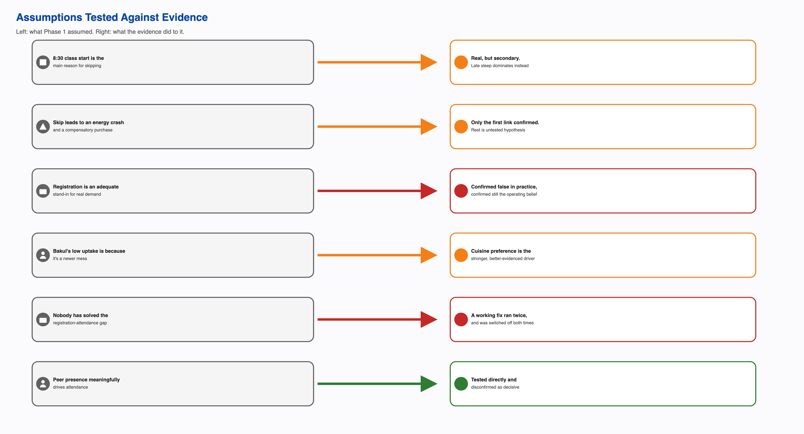

# Overview

The Reframed Systemic Problem Statement and the Design Opportunity Statement state conclusions: what the problem actually is, and where the leverage sits. This document is the evidence underneath those conclusions. It exists so that any claim in either document can be checked against a real source rather than taken on trust. It is supporting evidence for Activity 8's "validate the reframing with evidence" requirement specifically, an appendix to the Reframed Problem Statement and the Design Opportunity Statement rather than a sixth, separate deliverable.

Three things live here. First, the assumptions this project carried from Phase 1 and the original problem framing, and what happened to each once it met real evidence, confirmed, revised, or overturned. Second, a register of the actual stakeholder testimony behind the reframe, organized by who said it, with the real quote attached. Third, the eight systemic tensions named in Task 7, each traced back to the specific evidence that makes it a tension rather than a guess.

The same tagging convention used throughout this project applies here without exception. Confirmed means a named source stated it directly, or two independent sources agree. Single sourced means one account only, not cross-checked. Candidate means a plausible, named mechanism not yet verified. Assumed means a systems-thinking inference, offered honestly as inference and never given the weight of a confirmed claim. Nothing below is presented as testimony unless a real respondent actually said it.

# 1. Assumptions Carried From Phase 1, Tested Against Evidence

The project did not start from a blank page. It started from a set of assumptions built into the original problem framing and Phase 1's early research. Each one has since been tested. Some held up. Some didn't. The Bakul row below cites the team's own self-account respondent, a team member's detailed first-person account of the mess system that this project uses as primary respondent data alongside the six student interviews.

| Assumption | Where it came from | What the evidence found | Status |
|---|---|---|---|
| The 8:30 AM class start is the main reason students skip breakfast | The original problem framing's system-boundary description | Across the six interviewed students, late sleep and staying up for assignments are named far more often as the direct skip reason than class timing. Only one respondent connects skipping to an 8:30 class at all, and that class falls on their schedule only twice a week | Revised. Real, but a secondary factor, not the dominant one |
| A skipped breakfast leads to a mid-morning energy crash and a second, compensatory purchase later in the day | The original puzzle brief's fictional framing device | Only the first link, late night leading to skipping, is confirmed by real respondents. No interview in this project's evidence base has ever asked what a respondent does in the hours after skipping, so the crash-and-compensate chain has never been confirmed or denied | Narrowed. The first link stands on real evidence; the rest stays an open, untested hypothesis, not a finding |
| Registration is a reasonably accurate stand-in for who will actually eat | The mess system's own operating assumption, carried into the original question of why registration doesn't reflect real attendance | The CFS Chair interview gives category-level turnout directly: breakfast runs 35 to 45 percent, general items around 70 percent, high-turnout items over 90 percent. The CFS Chair gave both a 35-40 percent figure and a separate, more tentative ~45 percent figure in the same conversation; whether these describe the same measurement or two different ones is not resolved anywhere in this project's research, so the range is stated honestly rather than collapsed to one number | Confirmed false as a practical matter, and confirmed still the assumption billing policy operates on regardless. This is the reframe's central finding |
| Bakul's low registration uptake is explained by it being a newer mess | An early hypothesis offered directly by the team's own self-account respondent | The attendance gap holds consistently across three independently operated dining halls that share only one variable: cuisine. Newness remains a real contributing factor, but the pattern tracks cuisine more strongly | Revised. Cuisine preference is the better-evidenced explanation; mess age is secondary |
| Nobody has solved the registration-attendance gap | Implicit in the original problem framing's open question | During an LPG shortage, and separately during holidays such as the Felicity festival, the institution ran walk-in, attendance-tracked billing with no charge for a meal not eaten. It worked both times it ran | Overturned. A working fix exists and has already been demonstrated twice. The real open question is why it isn't kept running |
| The academic administration has some awareness of, or connection to, the mess-hours overlap | An implicit framing choice in treating the class schedule as part of this system's boundary | The self-account interview states directly that the academic office has no say in mess timings or hostel matters at all. Phase 1's power research reconfirmed this independently, three separate ways | Confirmed. Not a weak link, a confirmed absence of any relationship |
| Peer presence or companionship is a meaningful driver of whether a student attends breakfast | An open question written into the interview guide specifically to test it | Tested directly across the interview set. Four of six respondents who addressed it say a friend's absence would not change their own attendance. One names friends as a positive but explicitly not deciding factor | Tested and disconfirmed as a decision-determining driver. At most a weak, secondary pull for some students |

# 2. Stakeholder Testimony Register

Every quote below is reproduced as it appears in the project's own interview records. Where a claim comes from an interview that used paraphrase rather than a direct quote in its own transcription, that is stated plainly rather than dressed up as a quotation.

## Students who attend most mornings

A near-daily attender, asked what makes them skip on the mornings they do:

> "Maybe if I've stayed up late because of assignments or classes, or if I sleep around 3:00 or 4:00 a.m. or later, I don't tend to wake up. I prefer sleep over breakfast."

The same respondent, asked about Skip Meal:

> "I never use Skip Meal because it doesn't return the money. It just lets them know that the meal can be skipped, whereas they are already preparing food for only some percentage of the registered students."

And on what happens most mornings around 9:20 at Kadamba:

> "Most of the time when I'm at Kadamba around 9:20, the main items are already finished. Things like idli, puri, and bhatura often run out... Many times, items have run out, and the staff has promised to bring them back before the mess closes at 9:30, but they don't tend to return the items that have run out."

A second near-daily attender, on the same crowding pattern, in their own words (single sourced, but describing a specific, recurring experience):

> "The biggest issue is the mismatch between demand and food availability around 9:00 to 9:30... Even though only around 30% of registered students may actually show up, the mess sometimes still struggles to arrange enough food for the students who do come."

## Students who skip regularly

A respondent who has not eaten at the mess for the entire semester, on whether cost registers as a loss:

> "I think around ₹1,500 goes to waste on my breakfast."

The same respondent, on Skip Meal:

> "I haven't ever used Skip Meal. I think it just shows them that we're skipping the meal, but I don't think I've ever used that feature."

And on whether students have real input into mess decisions:

> "I don't think students have real input in mess decisions because we have so many issues, and they have never really been addressed."

A respondent registering for the whole month at Kadamba specifically, explaining why:

> "I try to catch the registrations. I register for breakfast for the whole month because Kadamba is hard to get and it gets full."

The same respondent, on whether friends affect their attendance:

> "Not really. My friends are a positive factor in deciding to go, but if I have to go, I'll go."

## Governance and operations

The CFS Chair interview did not produce quotation-marked speech in the same way the student interviews did; it is recorded here as confirmed fact rather than direct quotation, consistent with how the source material itself is structured. Confirmed facts from that interview: meal registrations lock four days ahead of service, and that same four-day figure is what gets communicated to the vendor. Weekly stock assessment is driven by consumption pattern, with high-turnout items such as paneer, egg, and chicken running above 90 percent turnout, general items around 70 percent, and breakfast specifically in the 35 to 45 percent range, attributed mainly to class timings. Feedback is triaged by intensity: high-intensity feedback brings in a CDS committee member directly; low-intensity feedback is handled by the CFS Head without escalation.

The CFS Chair also raised, unprompted, a concern about the menu now being posted two weeks in advance: knowing the menu ahead of time lets a student decide in advance not to come on a day they dislike what's being served. This is a self-identified risk from the same person who helped drive the rotation policy through, not an outside critique.

## The confirmed absence of a stakeholder's voice

Not every stakeholder in this system has been heard from, and that absence is itself evidence. The academic administration, which sets the 8:30 AM class start colliding with the 7:30 to 9:30 breakfast window, has never been interviewed for this project, and the self-account respondent confirms directly that the academic office has no say in mess timings or hostel matters at all. Faculty and early-shift staff who might eat breakfast before 7:30 do not appear in any interview, any stakeholder map, or any registration data this project has access to. The CDS Chair, the single most senior authority in the entire dining chain, has also never been interviewed; every account of CDS decision-making in this project comes from one level below, the CFS Chair.

# 3. Tensions, Evidenced

Each tension named in the Systemic Problem Analysis is restated here with its direct supporting evidence, so it reads as a finding rather than an assertion.

**Individual rationality against aggregate cost.** A respondent registering the full month at Kadamba "because it's hard to get and it gets full" is behaving sensibly for themselves. Multiplied across the student population, that same behavior produces the registration-attendance gap this project studies. Confirmed, repeated independently across respondents with very different attendance patterns: a near-daily eater, a zero-attendance-this-semester respondent, and a declining-attendance respondent all describe the same underlying logic.

**Procurement certainty against demand-matching accuracy.** Both sides of this trade-off have actually been operated by the same institution. The standing model gives the vendor a number it can plan four days out. The LPG-shortage and holiday exception gave real attendance-matched billing instead, and it worked. The institution has chosen certainty every time the exceptional trigger passed. Confirmed; this is the single clearest piece of evidence in the whole project that a real trade-off, not an oversight, is at work.

**Administrative simplicity against real variation.** One registration rule and one average-based portioning method are applied across four structurally different kitchens. The confirmed, repeated pattern of specific items, idli, puri, bhatura, running out at nearly the same time most mornings is the direct cost of that uniformity.

**Transparency against gameability.** The CFS Chair's own unprompted concern: publishing the menu two weeks ahead fixed the menu-fatigue complaint and, by the same office's own account, opened a new way for students to plan around a menu they already know they'll dislike. Single sourced to the person who both drove the fix and flagged its side effect.

**Loud complaints against quiet costs.** The same escalation design produced two opposite outcomes. Menu fatigue, a loud and frequent complaint, went through the CDS Student Council to the Committee and produced a real policy change. The much larger registration-billing gap, already quantified by the CFS Chair, has never entered that same pathway. Confirmed by the office's own account of how feedback is triaged, by intensity, not by measured cost.

**A uniform model against legitimate difference.** The self-account respondent describes practicing intermittent fasting as a deliberate choice and not usually seeing the mess even while living in the same hostel. Only one of the four dining halls, Yuktahar, offers a separate Jain or pure-vegetarian line. Confirmed for this one respondent's account and for the dietary-line gap; the aggregate share of the total gap this explains is not quantified anywhere in this project's evidence.

**Two systems colliding with nobody between them.** The 8:30 class start and the 7:30 to 9:30 breakfast window are set by separate authorities with zero confirmed relationship between them, independently reconfirmed three separate ways across this project's research.

# 4. What Remains Unvalidated

Naming what isn't confirmed is as much a part of this register as naming what is.

Whether the vendor's actual contract terms could absorb any standing or partial version of the attendance-tracked model has never been asked directly, of the vendor or of anyone who holds the contract. This is the single most consequential open question behind the whole reframe.

The CDS Chair, the most senior authority in the dining chain, has never been interviewed. Every account of CDS decision-making in this register comes from the CFS Chair, one level below.

Why Skip Meal sits at near-zero usage despite its mechanism being confirmed to reach kitchen forecasting is not resolved. An awareness gap, a trust gap, and a portal-friction problem would each point to a different fix, and this project's current evidence cannot tell them apart.

Whether knowing the posted menu in advance actually changes a student's decision to attend, the CFS Chair's own self-identified risk, has not been tested against any student-side data. No student interview in this project has been asked the question directly.

The December 2024 cancellation-cap tightening is recorded from a single account, not independently confirmed by an institutional record. It is treated throughout this project's work at that lower confidence tier, not as settled fact.

One respondent in the six-student interview set is recorded under a label, "daily eater, second respondent," that a cross-check against an independent transcription of the same source material suggests may not correspond to a distinct person. This is a genuine gap in the source data, flagged rather than silently resolved, since neither available guess can be verified from the source alone.
