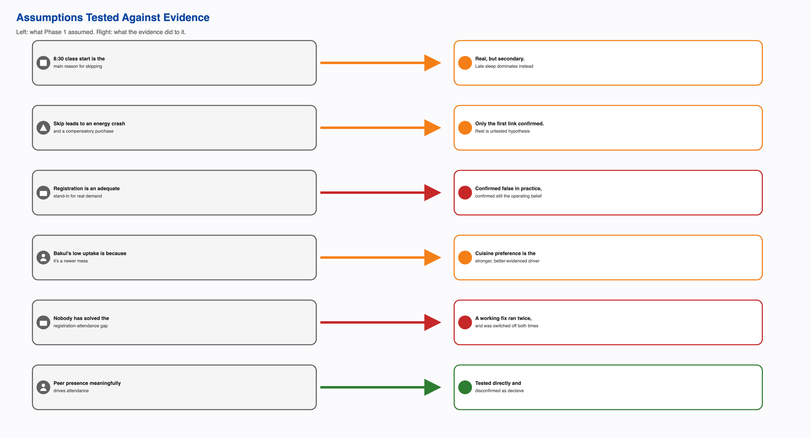

# Overview

The Reframed Systemic Problem Statement and the Design Opportunity Statement state conclusions: what the problem actually is, and where the leverage sits. This document is the evidence underneath those conclusions. It exists so that any claim in either document can be checked against a real source rather than taken on trust. It is supporting evidence for Activity 8's "validate the reframing with evidence" requirement specifically, an appendix to the Reframed Problem Statement and the Design Opportunity Statement rather than a sixth, separate deliverable.

Five things live here. First, the bodies of evidence this register draws on, with what each can and cannot show. Second, the assumptions this project carried from Phase 1 and the original problem framing, and what happened to each once it met real evidence: confirmed, revised, or overturned. Third, a register of the actual stakeholder testimony behind the reframe, organized by who said it, now including the catering operators who run the kitchens. Fourth, the systemic tensions, each traced back to the specific evidence that makes it a tension rather than a guess. Fifth, what still is not validated.

The register was first built on six student interviews, one team member's self-account and one conversation with the CFS Chair. It has since been revised against two new kinds of evidence: attendance records (a scan-level export of every Kadamba breakfast registration for April 2026, and photographed registers from the Yuktāhār kitchen for September 2026) and field interviews with the operators of three messes. It has been revised a second time against a team member's first-hand account of the Kadamba and Yuktāhār visits, given by a team observer who heard the operators directly and saw their books and service; where that account and the machine translation of the Telugu recordings differ, the account is taken. Where either kind of evidence overturned an earlier entry, the entry has been rewritten and marked as revised rather than left standing beside a correction.

The same tagging convention used throughout this project applies here without exception. Confirmed means a named source stated it directly and clearly, two independent sources agree, or the fact is read directly off a record; record-based facts are marked "confirmed by records", and what the team saw on site, such as the Kadamba display plate, the Yuktāhār books or its two roti counters, is marked "confirmed (observed)". Single sourced means one account only, not cross-checked. Kadamba operator statements reported in the team's first-hand account are marked "single sourced, observer-verified": the figure itself is no longer in doubt, but it remains the operator's own account of its practice. Vijayalakshmi Caterers statements, and any Kadamba detail that the first-hand account does not cover, rest on the Telugu recordings, available only as machine translation, so those quotes below are translated gist rather than verbatim speech. Candidate means a plausible, named mechanism not yet verified. Assumed means a systems-thinking inference, offered honestly as inference and never given the weight of a confirmed claim. Nothing below is presented as testimony unless a real respondent actually said it.

# 1. Sources Behind This Register

| Source | Collected | Kind | Confidence | Limits |
|---|---|---|---|---|
| Six student interviews and one team member's self-account | September 2026 | Interviews | Single sourced per respondent | One respondent's label may not correspond to a distinct person |
| CFS Chair interview | September 2026 | Interview, recorded as paraphrase notes | Single sourced | No verbatim quotation |
| CDS team export, Kadamba breakfast, 1 to 30 April 2026 | Received September 2026 | Records: 32,162 registration rows with scan timestamps | Confirmed by records | No student ID, no lunch or dinner, no quantities, no waste |
| Yuktāhār kitchen books: weekday attendance register, Wastage Book, wastage board, Grocery (issue) Book, store and ingredient book, stock register, vegetable book and indent, milk, fruit, gas, electricity and water register, fridge temperature and cleaning sheets | Photographed 26 September 2026 | Records | Confirmed by records, row by row | Some breakfast rows hidden in the photographs; two books disagree on one day, although the kitchen's own rule that the store book must match the cooking record, with any mismatch raised at the daily meeting, exists to catch exactly that |
| Yuktāhār site head (ABC Hospitality Services) walkthrough of every register | 26 September 2026 | Operator interview in English | Confirmed where stated clearly | One visit; self-presentation; his belief about breakfast turnout does not match his own register |
| Kadamba floor manager of Prism, the tender-contracted vendor that runs all Kadamba operations | September 2026 | Operator interview in Telugu, machine translated | Single sourced; numbers covered by the team's first-hand account are observer-verified; the kilogram waste figures heard in translation are withdrawn | Self-presentation; details not covered by the first-hand account remain translated gist |
| Team member's first-hand account of the Kadamba and Yuktāhār visits | Given 27 September 2026 | Observer account of what operators said and showed, and of the team member's own experience as a registered student | Confirmed (observed) for what was seen on site; single sourced, observer-verified, for operator statements | One visit per mess; a synthesis of what operators said, not a verbatim transcript; operator self-presentation still applies; the observer's quality judgements are the team's own |
| Vijayalakshmi Caterers owner and mess manager | September 2026 | Operator interview in Telugu, machine translated | Single sourced | Which mess this operator runs was not stated on the recording |

Two limits apply to everything record-based below. The records cover breakfast at Kadamba for one month and breakfast and lunch at Yuktāhār for twenty days; there are no records at all for Bakul or Palash, and none for lunch or dinner at Kadamba. And the Kadamba export counts scans, not people, so it cannot show which individuals skip repeatedly.

# 2. Challenge Initial Assumptions: Assumptions Carried From Phase 1, Tested Against Evidence

The project did not start from a blank page. It started from a set of assumptions built into the original problem framing and Phase 1's early research. Each one has since been tested, most of them twice: once against the student and CFS Chair interviews, and again against the attendance records, the operator interviews and the team's first-hand account of the operator visits. Some held up. Some didn't. The Bakul row below cites the team's own self-account respondent, a team member's detailed first-person account of the mess system that this project uses as primary respondent data alongside the six student interviews.

| Assumption | Where it came from | What the evidence found | Status |
|---|---|---|---|
| The 8:30 AM class start is the main reason students skip breakfast | The original problem framing's system-boundary description | Across the six interviewed students, late sleep and staying up for assignments are named far more often as the direct skip reason than class timing. Only one respondent connects skipping to an 8:30 class at all, and that class falls on their schedule only twice a week. The records now point the same way: Kadamba's breakfast turnout is lowest on Sunday (27.3 percent), when no class is running, and highest on Tuesday and Monday (42.1 and 41.1 percent); Yuktāhār's Sundays sit at 18 to 24 percent, among its lowest days. The CFS Chair attributed low breakfast turnout mainly to class timings; the weekday records contradict that attribution. The Yuktāhār site head names late nights instead: hackathons keep students up, and "this cannot be helped" | Revised. Real, but a secondary factor. The weekday pattern is confirmed by records; the reading that a class day pulls students to breakfast more than it keeps them away is a candidate |
| A skipped breakfast leads to a mid-morning energy crash and a second, compensatory purchase later in the day | The original puzzle brief's fictional framing device | Only the first link, late night leading to skipping, is confirmed by real respondents. No interview in this project's evidence base has ever asked what a respondent does in the hours after skipping, so the crash-and-compensate chain has never been confirmed or denied | Narrowed. The first link stands on real evidence; the rest stays an open, untested hypothesis, not a finding |
| Registration is a reasonably accurate stand-in for who will actually eat | The mess system's own operating assumption, carried into the original question of why registration doesn't reflect real attendance | The records settle it. At Kadamba in April 2026, 32,162 breakfast registrations produced 11,941 meals eaten: 37.1 percent turnout, 62.9 percent no-shows (veg 32.4 percent, non-veg 48.5 percent). At Yuktāhār, 1 to 20 September, breakfast turnout ran 17.7 to 40.2 percent on the thirteen legible days, about 28 percent on average. Lunch at Yuktāhār on the same days ran 56 to 89 percent, at or above 70 percent on fifteen of twenty days, so the failure is specific to breakfast. Kadamba registrations sit flat at about 1,070 a day on every weekday, Sunday included, while turnout moves between 27 and 42 percent: registration is a standing booking, not a daily decision to eat. The student side now explains the flat line. Registration is mandatory and automatic, students are registered whether or not they are on campus, and the only exit is five cancellations per meal type per month made at least four days ahead, with no way to nullify the charge beyond that (confirmed by the CDS poster and a student's own experience). A flat daily count is what an automatic default produces. The CFS Chair's figure of 35 to 40 percent matches Kadamba in April; no record reaches the more tentative 45 percent on average | Confirmed false by records at two halls, and confirmed still the assumption billing operates on. This is the reframe's central finding. Revised from an interview-only range to record figures |
| The registration-attendance gap is about 30 percent | Earlier project wording, read off a student's remark that "only around 30% of registered students may actually show up" | The student was right about turnout; the project's reading of it as a 30 percent gap was the error. The breakfast gap is about 63 percent at Kadamba and about 72 percent at Yuktāhār. A gap near 30 percent fits lunch | Revised by the operations evidence. Superseded |
| Bakul's low registration uptake is explained by it being a newer mess | An early hypothesis offered directly by the team's own self-account respondent | This row previously concluded that the attendance gap holds across three independently operated dining halls sharing only one variable, cuisine. That conclusion has been revised. The cuisine comparison rested on registration fill from a single snapshot, not on attendance, and that snapshot conflicts with Yuktāhār's own register. Bakul and Palash are not independently operated: both are served from one shared off-site kitchen until the Felicity kitchen opens. There are no attendance records for Bakul or Palash at all. The only record-level difference by food type sits inside one mess: Kadamba non-veg registrations turn out at 48.5 percent against 32.4 percent for veg | Revised, then left open. Cuisine is a candidate influence on booking only; attendance by hall is known for Kadamba and Yuktāhār alone. Mess age remains a possible factor, untested |
| Four dining halls means four kitchens | Phase 1's mess structure | Bakul and Palash share one off-site kitchen, confirmed by the institution's own posters and the CFS Chair. The operator of a third mess, Vijayalakshmi Caterers, describes cooking about 40 minutes away near the airport and trucking food in insulated boxes, with extra food arriving within about 30 minutes of a request; this matches the Bakul and Palash arrangement, but the operator never named the mess on the recording | Revised. Three kitchens serve four halls. The match between Vijayalakshmi Caterers and Bakul and Palash is a candidate |
| The kitchen cooks to the registration count, or to a four-day-old order, and the difference is wasted | Phase 1's process trace | No operator cooks the full registration count at breakfast. Each converts registrations into a first cooked batch by its own private rule and tops up during service. Yuktāhār holds a planning meeting twice a day that sets tomorrow's quantities from portal registrations (regular, Jain and cash meals), the Wastage Book entry for the matching past day (the menu repeats every two weeks, so a third-week Thursday looks up the first-week Thursday), the month's turnout, any holidays or campus events, and its attendance register grouped by weekday; during service it treats the first half hour as a sample to project the rest of the meal. Kadamba cooks a first batch of 70 percent of registrations, planned separately for the veg and non-veg lines, with a gram standard for every dish (idli at four per person, sambar at 100 grams). Vijayalakshmi Caterers describes the same 70 percent, since moved to 80. Kadamba keeps raw material ready to cook more in 10 to 15 minutes. Breakfast cooking starts at 5:30 at both Kadamba and Yuktāhār; Kadamba cooks live items such as dosa in front of diners from 7:00. Quantities are set the day before service, not four days before. The contrast case is Kadamba's biryani lunch, cooked at 100 percent of registrations | Revised by the operations evidence. The Yuktāhār mechanism is confirmed by the site head and his records; its in-service projection and the Kadamba ratio, gram standards and biryani practice are single sourced, observer-verified; the Vijayalakshmi ratios remain translated gist. Every breakfast ratio sits well above recorded breakfast turnout |
| Nobody measures the gap; feedback reaches the system only in aggregate | Phase 2's root-cause reasoning | The gap is measured, twice. The CDS team holds a scan-level record of every Kadamba breakfast. Yuktāhār keeps a daily attendance register with a written percentage column and a Wastage Book recording, per item, raw issued, cooked, left over, percentage wasted and the time each item ran out. Neither measurement is routed to anyone who sets registration or billing rules. The measurer's own belief does not track the measurement either: the Yuktāhār site head puts breakfast at "about 50%", while his register averages about 28 percent | Revised by the operations evidence. Measured, locally and repeatedly; routed nowhere that sets rules |
| The breakfast crowd builds to a peak before close | A student account and the CFS Chair's description of a 9:20 arrival spike, previously unobserved | 11,941 timestamped scans show one continuously building crowd. 26.5 percent of all Kadamba breakfast scans fall between 9:15 and 9:30, and 13.5 percent between 9:00 and 9:15; the arrival rate is still rising at 9:29. There is no sign of bulk marking. About 9 percent of scans fall after 9:30, service actually closes between 9:35 and 9:45, and the latest scan in the month was at 10:07. The crest is latest on Sundays, when 45.9 percent of scans came after 9:15 against about 32 percent on Tuesdays and Wednesdays; nearly 60 percent of all scans fall at or after 8:45. The last ten minutes before 9:30 alone hold 19.8 percent of all scans, about 79 a day. All three operators say the rush comes at closing time. The Kadamba operator's rule of thumb is about 100 diners early, about 100 through the middle and about 150 in the last ten minutes (single sourced, observer-verified): it agrees with the records on the shape, but puts more into the final ten minutes than the scans show, possibly because it folds in arrivals after the close (candidate). Kadamba reopens the door for late-comers for 5 to 10 minutes after the 9:30 close (single sourced, translated gist), and when the front door shuts, late-comers come in through the back door and demand food, which the mess says it cannot refuse (single sourced, observer-verified) | Confirmed by records; the scan record, not the operator's rule of thumb, is the measurement. The reading that the late crest is at least partly a sleep pattern rather than a class one is a candidate |
| Surplus food is composted | The CFS Chair's account of waste management and the institution's five-star food-safety rating | The Kadamba manager says waste goes to a dustbin collected by the garbage contractor and that Kadamba does not compost (single sourced, translated gist). Yuktāhār reuses leftovers: leftover idli becomes idli upma or idli poha for lunch, dosa batter goes back to the fridge, surplus milk is set as curd overnight; its disposal route for what remains was not stated. Vijayalakshmi Caterers sends some leftovers back to its kitchen for reuse and throws the rest away (single sourced). This row previously said Kadamba's operator staff eat from what is left after students; that is revised. Kadamba cooks about 30 extra portions for 30 to 50 people outside the student registration, such as night-shift security, and about half of Kadamba's own staff eat from the same food (single sourced, observer-verified). The team observer also judges that Kadamba food is cooked ahead, reheated repeatedly and moved between vessels, so part of the surplus is held into later service rather than discarded (the team's own judgement; candidate) | Revised by the operations evidence. Contradicted for Kadamba; unknown at Yuktāhār. What absorbs the physical surplus is reuse, outside diners and operator staff, holding and reheating into later service at Kadamba (candidate, at a cost to quality), late-door and back-door service, with the bin as the exit; resale, the operators' own discount and live top-up, outside venues and informal dietary workarounds absorb the other consequences of the gap. The institutional composting account and the operator account are not reconciled |
| Skip Meal declarations reach the kitchen's forecasting | An earlier project finding, confirmed in a working session, and the portal's own Skip Meal toggle, which is designed to tell the kitchen not to prepare | The two sides now disagree. The portal design and the earlier finding say a declaration reaches the kitchen. The Kadamba operator says it cooks on registrations regardless of who wants to eat, "because it is a responsibility and they are getting paid for it" (single sourced, observer-verified). None of the three operators named Skip Meal as a planning input. One reading reconciles them: a Skip Meal may lower the count the operator sees, while the operator treats whatever count it sees as the obligation (candidate) | Conflicting sources, open. Neither side is taken as fact; one direct question to the Kadamba operator settles it |
| Events, exams and holidays reach the kitchen's plan | An implicit Phase 1 assumption about how the kitchen knows demand will drop | Only informally. The Yuktāhār site head: "We don't come to know... until we sit in the meeting." There is no formal feed from the institute. Once the kitchen hears of a holiday, special week or campus event, it does fold it into the turnout estimate (single sourced, observer-verified) | Revised. Confirmed informal |
| Nobody has solved the registration-attendance gap | Implicit in the original problem framing's open question | During an LPG shortage, and separately during holidays such as the Felicity festival, the institution ran walk-in, attendance-tracked billing with no charge for a meal not eaten. It worked both times it ran. The Kadamba operator remembers the shortage from the kitchen side as cutting quantities and buying some items from outside; this corroborates the shock period but not the billing change, which still rests on the institutional account. Operators have also cut waste inside their own kitchens: Yuktāhār began tracking waste one August, staff first objected that "they are catching us", the managers deliberately made the weighing blame-free and discussed it every day, and by December staff themselves reported that waste had fallen. None of these fixes touched the booking rule | Overturned. A working fix exists and has already been demonstrated twice. The real open question is why it isn't kept running. Local waste reductions exist inside kitchens and never reach the registration rule |
| The academic administration has some awareness of, or connection to, the mess-hours overlap | An implicit framing choice in treating the class schedule as part of this system's boundary | The self-account interview states directly that the academic office has no say in mess timings or hostel matters at all. Phase 1's power research reconfirmed this independently, three separate ways | Confirmed. Not a weak link, a confirmed absence of any relationship |
| Peer presence or companionship is a meaningful driver of whether a student attends breakfast | An open question written into the interview guide specifically to test it | Tested directly across the interview set. Four of six respondents who addressed it say a friend's absence would not change their own attendance. One names friends as a positive but explicitly not deciding factor. The Kadamba manager describes a different peer mechanism on the booking side: students keep their registration while away "even if you are in the village" and a friend eats in their place (single sourced) | Tested and disconfirmed as a decision-determining driver of attendance; at most a weak, secondary pull for some students. Informal transfer of a booking to a friend is a candidate booking-side mechanism |
| Registration happens monthly | Phase 1 context and the earlier System Map | Students describe booking for the whole month, and a student's own experience is that registration is automatic and mandatory, with five cancellations per meal type per month made at least four days ahead as the only exit (confirmed by the CDS poster and that experience). The Kadamba operator describes breakfast registration as "weekly compulsory", in blocks closing about four days ahead; billing runs monthly | Revised. Registration is an automatic, mandatory default with a narrow exit (confirmed). Whether it runs in the operators' weekly blocks or the students' monthly booking is unconfirmed. Either way it is a default rather than a choice |
| Items run out because portions are set from one average consumption number | The earlier System Map | Operators plan per item: Yuktāhār from each item's matching-day record and run-out time, Kadamba by a gram standard for every dish (single sourced, observer-verified), and Kadamba cut ragi idli and increased plain idli from what it saw eaten (single sourced). Kadamba names bonda, puri, vada and idli as items that "float": diners take more than the standard (single sourced, observer-verified). At lunch the same happens with biryani, where some diners take three pieces instead of two and later diners run short. On Thursday 3 September Yuktāhār re-cooked semiya upma at 9:00 on a morning its two records put at 28 and 40 percent turnout (confirmed by records) | Revised. Run-outs come from a first batch sized as a ratio of registrations meeting a late crest that outruns a 10 to 30 minute top-up (candidate); a second, independent route is floating items, where portions taken above the gram standard deplete a batch sized per person (candidate). Shortage and surplus occur on the same morning |
| Nothing behind the scenes can react to a same-day spike | The earlier Service Blueprint reading | Yuktāhār checks every 30 minutes from about 45 minutes before close, uses the first half hour of service as a sample to project how many will come for the rest (single sourced, observer-verified), and opens a second roti counter at peak (confirmed, observed). At Kadamba, this row previously said the kitchen watches live scan counts; that is revised. A supervisor constantly checks the counters and tells the kitchen how much more to cook, judging from what is left of each item at what time against registrations and turnout so far, and the kitchen can cook more in 10 to 15 minutes (single sourced, observer-verified). The off-site kitchen sends more in about 30 minutes (single sourced). None of this can shrink a cooked batch, and nothing carries the leftover forward to the student or the rule owner | Revised. Top-up is continuous but upward only; the absent signal is the one across meals. A first-half-hour projection is itself exposed to the closing crest, since about a quarter of Kadamba's scans fall in the last fifteen minutes (candidate) |
| The walk-in model is switched off because the vendor needs four days' certainty | Phase 2's systemic analysis | The kitchens set quantities the day before. Kadamba buys dry goods such as rice, groundnut, masala and ghee a week ahead, perishables such as milk, meat, eggs and most vegetables the day before, and some vegetables two or three days ahead (single sourced, observer-verified), so only dry goods, which keep, are committed before the four-day registration close (candidate). The Kadamba team challenged the four-day cut-off (single sourced). The remaining candidate reasons sit outside the kitchen: whether the per plate payment counts registrations, the administrative convenience of weekly blocks, or a simple reversion with the calendar | Revised. Reason unknown; the self-limiting loop reading of the exception (L6) is revised to an open chain |
| Vendor revenue is severed from attendance by design | Phase 2's causal loop analysis (L8) | The Vijayalakshmi Caterers operator describes being paid monthly as a lump sum on plates, with deductions (single sourced, translated gist). Prism wins the Kadamba contract by tender (single sourced, observer-verified), and the Kadamba operator says it cooks on registrations because "they are getting paid for it", a hint that its pay follows registrations (candidate). Under the same billing rule the two observed operators take opposite stances: Kadamba treats the registration count as a paid obligation, while Yuktāhār's management states an explicit goal of less waste, lower operating cost and higher profit (single sourced, observer-verified). Whether a plate is counted at booking or at serving is still not known | Revised to unresolved. L8 could close only if plates are counted as served; the Kadamba hint leans toward counting at registration but does not settle it |
| Food safety depends on lab testing once contamination is suspected | The earlier System Map | Daily operator checks come first. At Yuktāhār, a tasting team works every shift and fridge temperatures are logged three times a day, all within 1.4 to 3.5 °C in September (confirmed); an earlier reading of tasting pairs is revised. At Kadamba, every meal passes a fixed sequence: cooking temperature checked, a sample kept 72 hours so that any illness can be traced to the mess or to outside food, a wrapped display plate set at the entrance so diners see the full menu, serving temperature measured per item, and tasting by a facility team with two Prism staff, followed by corrections before service (display plate and tasting confirmed, observed; the rest single sourced, observer-verified). Quality control inspects weekly, and TDS is read daily for cooking and drinking water. All of this oversight covers safety and taste; none of it covers quantity or waste | Revised. Lab testing is the escalation step |
| Kadamba's inventory is run by one person with no backup | A kitchen walkthrough note | The "no backup" remark referred to the kitchen not being allowed to hold excess stock, since the weekly quality-control inspection checks the store; given the procurement tiers, the limit most likely applies to perishable and cooked stock rather than dry goods (candidate) | Downgraded to single sourced and unverified |
| The kitchen is a black box, and the only closed feedback loop is menu governance | Phase 2's causal loop analysis | Eighteen mechanisms (L1 to L17 plus L3b) were retested. Three close with every link evidenced, all balancing: menu rotation (L4), Yuktāhār's matching-day Wastage Book calibration (L11, confirmed at Yuktāhār only) and counter top-up (L12). Five are candidate loops with an assumed closing link: resale (L1), Kadamba lock-in (L3b), waste absorption (L9), soft close (L15) and kitchen competence shifting the burden (L17). Six are open chains: Skip Meal (L2), menu transparency (L5), the shock exception (L6), late nights (L7), standing booking to over-preparation (L13) and the closing rush to just-in-case over-preparation (L14). Capacity redistribution (L3) is contraindicated, vendor quality discipline (L8) unresolved, operator waste to menu choice (L16) absent, and the measured-but-unrouted gap (L10) static. The field account adds two mechanisms not yet numbered. At Kadamba, surplus from the first batch is held and reheated into later service, which the team observer judges degrades quality; whether that drives more skipping is not evidenced, so it is an open chain, not a loop. And the two observed kitchens forecast by opposite philosophies: Kadamba by a fixed ratio with reactive top-up and no learning record beyond its gram standards, Yuktāhār by matching-week learning from its own books plus an in-service projection. Yuktāhār also holds an impurity norm for each raw item and challenges or changes a supplier who exceeds it, a small balancing mechanism on the supply side (single sourced, observer-verified) | Revised. The kitchen closes two balancing loops daily; both act on the conversion ratio and neither touches the booking |
| Over-preparation is only a misreading of registration | Implicit in the earlier diagnosis | The off-site operator raised its first batch from 70 to 80 percent for a reason not stated (single sourced). This row previously said Kadamba prepares 30 to 40 extra portions for walk-in and paying diners; that is revised. Kadamba cooks about 30 extra portions for 30 to 50 people outside the student registration, such as night-shift security, and about half its own staff eat from the same food (single sourced, observer-verified); the earlier translated figure of 30 to 40 walk-in portions may describe the same allocation (unconfirmed). The ratio is set per dish and meal rather than from any turnout record: Kadamba cooks biryani lunch at 100 percent of registrations, two pieces of 150 to 200 grams each with unlimited rice, with a head chef brought in on biryani days (single sourced, observer-verified). Shortages at close are loud; surplus is silent | Candidate. Part of the over-preparation is a deliberate allocation for diners outside the registration, and part is a hedge against the top-up lag at close (L14); the upward ratchet rests on one observed move |
| Three root causes: billing on registration, fragmented decision rights, and attention to loudness | Phase 2's systemic analysis | The records show a standing booking flat across the week, the student side shows that booking is an automatic default rather than a choice, and the operators show the gap is measured but unrouted | Revised. The three structural causes are registration as an automatic standing default (not a choice; an earlier reading of a standing weekly booking is revised, and whether the operators' weekly blocks exist is unconfirmed), billing at the booking, and a gap that is measured but unrouted across split decision rights. Attention to loudness and the absorption layer are the two conditions that keep them unaddressed. The uncalibrated conversion ratio, a fixed first-batch ratio at Kadamba and off site against Yuktāhār's book-based lookup that still anchors on a belief above its records, is an intermediate mechanism beneath the kitchen half |

# 3. Compare Stakeholder Perspectives: Stakeholder Testimony Register

Every quote below is reproduced as it appears in the project's own interview records. Where a claim comes from an interview that used paraphrase rather than a direct quote in its own transcription, that is stated plainly rather than dressed up as a quotation. Operator quotes from the Kadamba and Vijayalakshmi Caterers recordings are translations from Telugu and are marked as translated gist. Operator statements taken from the team's first-hand account are the observer's report of what the operator said, marked as reported speech rather than verbatim quotation.

## Students who attend most mornings

A near-daily attender, asked what makes them skip on the mornings they do:

> "Maybe if I've stayed up late because of assignments or classes, or if I sleep around 3:00 or 4:00 a.m. or later, I don't tend to wake up. I prefer sleep over breakfast."

The same respondent, asked about Skip Meal:

> "I never use Skip Meal because it doesn't return the money. It just lets them know that the meal can be skipped, whereas they are already preparing food for only some percentage of the registered students."

The second half of that answer is now confirmed from the kitchen side: all three operators prepare a first batch well below the registration count.

And on what happens most mornings around 9:20 at Kadamba:

> "Most of the time when I'm at Kadamba around 9:20, the main items are already finished. Things like idli, puri, and bhatura often run out... Many times, items have run out, and the staff has promised to bring them back before the mess closes at 9:30, but they don't tend to return the items that have run out."

The timing is confirmed by records: 9:15 to 9:30 is the busiest quarter hour of the Kadamba breakfast. The manager's account of the top-up differs from this student's: he says a supervisor watches the counters and more can be cooked in 10 to 15 minutes on request. He names idli and puri among the items that "float", where diners take more than the gram standard, which would empty a per-person batch faster than headcount alone predicts (candidate). The two perspectives are recorded side by side here, not reconciled; the promised top-up that does not arrive and the top-up the operator says is always available have not been observed directly.

A second near-daily attender, on the same crowding pattern, in their own words:

> "The biggest issue is the mismatch between demand and food availability around 9:00 to 9:30... Even though only around 30% of registered students may actually show up, the mess sometimes still struggles to arrange enough food for the students who do come."

This was single sourced when first recorded. The turnout figure is now confirmed by records (37.1 percent at Kadamba, about 28 percent at Yuktāhār), and the shortage half is corroborated by the late crest and by the Kadamba practice of reopening the door after close.

## Students who skip regularly

A respondent who has not eaten at the mess for the entire semester, on whether cost registers as a loss:

> "I think around ₹1,500 goes to waste on my breakfast."

The same respondent, on Skip Meal:

> "I haven't ever used Skip Meal. I think it just shows them that we're skipping the meal, but I don't think I've ever used that feature."

And on whether students have real input into mess decisions:

> "I don't think students have real input in mess decisions because we have so many issues, and they have never really been addressed."

A respondent registering for the whole month at Kadamba specifically, explaining why:

> "I try to catch the registrations. I register for breakfast for the whole month because Kadamba is hard to get and it gets full."

The records are consistent with this: Kadamba breakfast registrations hold at about 1,070 a day on every day of the week. That flat figure is a candidate explanation for the unresolved conflict between Kadamba's 420 seats and its 1,200 capacity: 1,200 may behave as a registration cap rather than a seat count.

The same respondent, on whether friends affect their attendance:

> "Not really. My friends are a positive factor in deciding to go, but if I have to go, I'll go."

A Kadamba student, recorded during the operator interview, on dinner sambar being dropped (translated gist):

> "Till last month they served sambar daily, now removed completely... but they are taking more money from us."

The operator answered that the menu is decided by the students and the committee. This is the first recorded case of a student menu complaint meeting the split between who cooks and who decides the menu.

A team member, speaking as a registered student in the first-hand field account, on whether registration is a choice:

> "Even if you want to eat breakfast or not, it is automatically registered. We don't have any opportunity to nullify it... Whether we eat or not, it will get registered even if we don't register."

This confirms the standing booking from the student's own side: beyond five cancellations a month, made four days ahead, there is no exit.

## Catering operators

The Yuktāhār site head, of ABC Hospitality Services, walked the team through every register the kitchen keeps. His interview was in English and is quoted as spoken.

On how the kitchen learns about events and holidays:

> "We don't come to know... until we sit in the meeting."

On how the Wastage Book's run-out time is used:

> "If it runs out at 1:30 we will re-cook; if it runs out at 2:20 we won't."

On why he does not cook everything in batches:

> "Student fluctuation is very high."

On trying and dropping forecasting software:

> "Prediction will be based on our data only... I want to remain close to the data."

The team's account adds the reasoning behind that choice as the operator gave it: the kitchen tried Zoho ERP to streamline groceries and predict the rush, judged that spending lakhs of rupees on prediction made no sense when the data already sits in its books, and found its kitchen staff are not digitally inclined, with too few staff to digitise; office staff type records up later (single sourced, observer-verified). The same account reports the management's stated goal as the best food quality with less waste, a streamlined workflow, lower operating cost and higher profit, and a coordinator who reads a daily wastage board and aims to push the waste share steadily down. During service, the first half hour is treated as a sample to project turnout for the rest of the meal.

Yuktāhār runs without a hierarchy: everyone does every job, and records are cross-checked by peers rather than by a supervisor. The mess in-charge also keeps the accounts and the Wastage Book; a colleague cross-verifies the grocery register. There is no formal leave policy: anyone who needs leave raises it at the daily meeting and colleagues agree to absorb the load. The vendor's project management team is two project managers, with site staff sharing the work; an earlier reading of the site head's recording as a five-person team is revised. One project manager took all staff to his farmhouse for training on what good quality looks like, and staff describe a family-like culture. The kitchen works in tasting, cutting and cleaning teams alongside the store function (all single sourced, observer-verified). Breakfast is cooked from 5:30 and ready by 7:30, mostly in one batch with poha in two, and rotis are made by hand without oil (single sourced, observer-verified).

On breakfast turnout, he said it runs at about 50 percent of registrations. His own September register averages about 28 percent. Reading a Sunday row aloud (267 registered, 50 ate, 18.7 percent), he said the kitchen would adjust using it "not even next month, next week".

On how staff received waste tracking, recounting their words: at first, "they are catching us"; by December, "actually wastage has reduced". The team's account adds that the managers deliberately made the weighing blame-free and discussed it every day until staff stopped fearing it.

The Kadamba floor manager, of Prism, the vendor that wins the Kadamba contract by tender and runs all its operations (translated gist from the recording; the 70 percent line is now single sourced, observer-verified):

> "If 100 register we prepare for 70 first... if you don't come, 30 portions are wasted."

> "We don't have that idea... some came and we did it, but they didn't come. It was wasted many times."

The team observer reports the rest of what he said. The first batch is planned separately for veg and non-veg, and every dish has a gram standard. Kadamba cooks on registrations regardless of who wants to eat, because it is a responsibility and they are getting paid for it. For any meal the heaviest flow is in the last ten minutes, and last-minute registrations are a pain. When the front door closes at 9:30, people come in through the back door and demand food, and the mess cannot refuse them. Waste runs at about 5 to 10 percent a day, with no base stated. About 30 extra portions are cooked for 30 to 50 people outside the registration, such as night-shift security, and about half of Kadamba's staff eat at the mess. A main vegetarian chef runs the kitchen, arriving at 5:30 to batch-cook items such as sambar and upma, while live items such as dosa are cooked in front of diners from 7:00 (all single sourced, observer-verified).

From the recording (translated gist): on late-comers after 9:30, "We open the door again for 5 to 10 minutes." On disposal: waste goes to the dustbin for the garbage contractor, with no composting. On no-shows, he said students keep their registration "even if you are in the village" and a friend eats in their place. His team also questioned why registration closes four days ahead when perishables are ordered the day before.

The Vijayalakshmi Caterers owner and mess manager (translated gist, single sourced):

> "We used to cook for 70%; now 80%... if more than 70% come, the extra comes from the kitchen within 30 minutes."

> "Many people are not coming for breakfast."

The same operator switched paneer suppliers twice after complaints, from Amul to Heritage to Milky Mist. Yuktāhār shows the same supply-side reflex in a standing form: it holds an expected impurity norm for each raw item, complains to or changes a supplier that exceeds it, has used only rock salt and cold-pressed oil for about six months, and visits the mills that make its oil (single sourced, observer-verified). The mess manager, asking for a say in the menu: "It's good if you increase the flexibility." The same operator appears to say that Kadamba's turnout runs at 90 to 95 percent (the figure is unclear in translation); Kadamba's breakfast records show 37 percent.

The team's account gives the Kadamba chain of command: CFS, then CDS, then Prism, then an operations manager, a manager, a supervisor and the service staff (single sourced, observer-verified). A short, cut-off clip from an operator's staff gives a similar chain ending in a director; it was not tied to one mess on the recording and is attributed to the off-site operator (candidate).

## Governance

The CFS Chair interview did not produce quotation-marked speech in the same way the student interviews did; it is recorded here as fact from that interview rather than direct quotation, consistent with how the source material itself is structured. Several of its facts can now be checked against records and operators.

Meal registrations lock four days ahead of service. This is now confirmed by two sources, since the Kadamba operator describes the same weekly, four-day close. That lock applies to registration, not to procurement: operators read the count from the portal and set quantities the day before service, and buy on their own cycles, which at Yuktāhār means groceries every fortnight, vegetables two or three times a week and milk daily (confirmed), and at Kadamba means dry goods a week ahead, perishables the day before and some vegetables two or three days ahead (single sourced, observer-verified). The CFS Chair describes weekly stock assessment driven by consumption pattern; the operators describe fortnightly to daily procurement by item class.

The CFS Chair gave turnout by category: high-turnout items such as paneer, egg and chicken above 90 percent, general items around 70 percent, breakfast 35 to 45 percent, attributed mainly to class timings. The breakfast figure is confirmed by records for Kadamba at 37.1 percent; Yuktāhār runs lower. The 70 percent general figure matches Yuktāhār's lunch register. The Yuktāhār site head independently reports 92 percent for a Sunday paneer dinner. The attribution to class timings is contradicted by the weekday records.

Feedback is triaged by intensity: high-intensity feedback brings in a CDS committee member directly; low-intensity feedback is handled by the CFS Head without escalation. The operators describe their own complaint routes beneath this: at Kadamba, a director's email goes to the manager and into a WhatsApp group that the CDS-side site team also reports into; at Vijayalakshmi Caterers, the CDS team goes to the manager, then the kitchen, then the managing director (both single sourced). Above the Kadamba floor, the team's account places CDS between the CFS and Prism, and names a CDS head; the CFS Chair interview named the CDS Chair by a different name. Whether these are two roles or one of the names is wrong is open, and neither person has been interviewed. Kadamba's food is also overseen by a facility team, whose affiliation is not stated, that tastes each meal with two Prism staff before service and a quality-control inspection each week (tasting confirmed, observed; the rest single sourced, observer-verified). Neither complaint route nor this oversight carries turnout or waste figures upward: the inspections check safety and taste, not quantity.

The CFS Chair also raised, unprompted, a concern about the menu now being posted two weeks in advance: knowing the menu ahead of time lets a student decide in advance not to come on a day they dislike what's being served. This is a self-identified risk from the same person who helped drive the rotation policy through, not an outside critique. The two-week cycle itself is confirmed by Yuktāhār's records: Wastage Book pages are headed by week pair ("Sat 1 and 3", "Thu week 1 and 3"), because the same cycle is what lets the kitchen look up the matching past day.

## Voices still absent

Fewer stakeholders are missing than when this register was first written. The operators of three messes, the records one of them keeps, and a team observer's first-hand account of two of those kitchens are now in the evidence. Faculty and staff also appear: the Yuktāhār register counts faculty and staff diners in their own column, zero to two a day at breakfast and zero to three at lunch, alongside small counts of unregistered and paying diners, and Kadamba's scans begin before its 7:30 opening, a candidate trace of staff or early service. This revises the earlier statement that faculty and early-shift staff appear in no registration data.

The absences that remain are still evidence. The academic administration, which sets the 8:30 AM class start colliding with the 7:30 to 9:30 breakfast window, has never been interviewed, and the self-account respondent confirms directly that the academic office has no say in mess timings or hostel matters at all. The CDS Chair has never been interviewed, and the CDS head named in the team's Kadamba account has not been either; every account of CDS decision-making in this project comes from outside CDS, from the CFS Chair or from the operator. Nobody who holds or wrote the catering contract has been asked about its terms, and Prism's management above the Kadamba floor has not been heard from. The facility team and the quality-control inspectors, who check every Kadamba meal and the store each week, have not been interviewed. The 30 to 50 outside diners, such as night-shift security, and the operator staff who eat from the same food are known only through the operator. The garbage contractor and the suppliers have not been heard from. Bakul and Palash diners are absent from every record. Whether the CDS team that produced the April export is the same body Phase 1 called the Mess Office remains unconfirmed.

# 4. Identify Contradictions and Tensions: Tensions, Evidenced

Each tension named in the Systemic Problem Analysis is restated here with its direct supporting evidence, so it reads as a finding rather than an assertion. Two were revised by the operations evidence, and seven new tensions were added from it. The team's first-hand account of the operator visits then revised several of these and added three more.

**Individual rationality against aggregate cost.** A respondent registering the full month at Kadamba "because it's hard to get and it gets full" is behaving sensibly for themselves. Multiplied across the student population, that same behavior produces the registration-attendance gap this project studies. Confirmed, repeated independently across respondents with very different attendance patterns: a near-daily eater, a zero-attendance-this-semester respondent, and a declining-attendance respondent all describe the same underlying logic. The records show the aggregate: about 1,070 Kadamba breakfast registrations every day of the week, against 27.3 percent turnout on Sundays. The Kadamba manager describes the same booking-while-away pattern from the kitchen side (single sourced). Individual choice is also narrower than this tension first assumed: registration is automatic and mandatory, so much of the booking is a default no student actively chose (confirmed).

**Registration certainty against demand-matching accuracy.** Both sides of this trade-off have actually been operated by the same institution. This tension previously described the standing model as giving the vendor a number it can plan procurement against four days out; that was revised by the operations evidence. The standing model gives each operator a registration count fixed four days ahead, from which it sets cooked quantities the day before and buys raw food on its own cycle. The binding constraint is the cooked first batch, which keeps for only three to four hours (single sourced), not raw procurement, most of which is recoverable. The LPG-shortage and holiday exception gave real attendance-matched billing instead, and it worked. The institution has chosen certainty every time the exceptional trigger passed. Confirmed; this is the single clearest piece of evidence in the whole project that a real trade-off, not an oversight, is at work. The Kadamba team itself questions the four-day close, since its perishables are ordered one day ahead (single sourced).

**One registration rule against three private conversion rules.** This tension previously read as one average-based portioning method applied across four structurally different kitchens. It has been revised: there is no shared portioning method, and there are three kitchens, not four. The registration and billing rule is uniform across halls. The conversion from registrations to cooked food is private to each operator and calibrated to nothing the institution sees: Yuktāhār plans from its matching-week Wastage Book and weekday register (confirmed) and re-projects turnout from the first half hour of service (single sourced, observer-verified); Kadamba cooks 70 percent of registrations first, planned separately for veg and non-veg (single sourced, observer-verified); Vijayalakshmi Caterers cooks 70 to 80 percent (single sourced, translated gist). Against recorded breakfast turnout of 37.1 percent at Kadamba, a 70 percent first batch is close to twice what is eaten; Yuktāhār's breakfast turnout is lower still, about 28 percent. Because Kadamba plans its lines separately, the gap is uneven: 70 percent against 32.4 percent veg turnout is about 2.2 times what is eaten, and against 48.5 percent non-veg turnout about 1.4 times (candidate arithmetic on the operator's ratio). The two observed kitchens are the project's cleanest natural comparison: a fixed ratio with reactive top-up and no learning record at Kadamba, against book-based learning with an in-service projection at Yuktāhār. Both still fix a first batch before the crest arrives. The run-out of idli, puri and bhatura that this tension once attributed to uniformity is better explained by the late crest meeting a fixed first batch and a top-up that takes time (candidate).

**Shortage and surplus on the same morning.** The late crest, 40 percent of Kadamba breakfast scans between 9:00 and 9:30 (confirmed by records), produces run-outs, re-cooks and a door reopened after close. The same morning's first batch, set well above turnout, produces surplus. All three operators described both top-ups during service and leftover food after it. This is the one symptom in the system where too little and too much occur together, and it is why the students who do come experience scarcity in a system that is overproducing.

**A small reported waste figure against a large planned surplus.** The Kadamba operator puts waste at about 5 to 10 percent a day, with no base stated (single sourced, observer-verified). A 70 percent first batch on about 1,072 daily registrations is about 750 portions, against about 398 breakfasts eaten a day in April (candidate arithmetic on records). The roughly 30 outside-diner portions cover under a tenth of a gap near 350 portions, and how many staff eat at the mess is not known. Several readings would reconcile the two, and the evidence does not choose among them: the extra diners and staff absorb more than stated; surplus is held and reheated into later service, as the team observer judges; top-ups run smaller than the first batch implies; or the percentage is measured on a different base, such as all meals or plate waste only. The tension is recorded unresolved, not settled by assumption.

**Food safety discipline against held food.** Every Kadamba meal passes temperature checks, a retained sample, a display plate and a joint tasting before service (display plate and tasting confirmed, observed). Those checks certify each dish at the start of service. The team observer judges that the food is cooked ahead, reheated repeatedly and moved between vessels, so it degrades after the checks are done (the team's own judgement; candidate). The same sequence, starting at 5:30, also fixes the first batch before any turnout signal exists (candidate). Whether degraded held food feeds back into more skipping is not evidenced; this is an open chain, not a loop.

**Transparency against gameability.** The CFS Chair's own unprompted concern: publishing the menu two weeks ahead fixed the menu-fatigue complaint and, by the same office's own account, opened a new way for students to plan around a menu they already know they'll dislike. Single sourced to the person who both drove the fix and flagged its side effect. The same two-week cycle is what makes Yuktāhār's waste lookup possible, so any change to menu posting also reaches kitchen planning.

**Menu ownership against waste visibility.** Students and the committee choose the menu. Operators see, item by item, what is always wasted: at Kadamba, uttapam, set dosa and upma (single sourced). No route carries that knowledge back to whoever chooses the menu, and the Vijayalakshmi Caterers manager asks outright for more say. The sambar complaint shows the same split from the student side: a loud complaint met the answer that the menu is not the operator's to change.

**Loud complaints against quiet costs.** The same escalation design produced two opposite outcomes. Menu fatigue, a loud and frequent complaint, went through the CDS Student Council to the Committee and produced a real policy change. The much larger registration-billing gap has never entered that same pathway, although it is no longer quantified only from the CFS Chair's memory: the institution holds a scan-level record of it (32,162 rows for one hall in one month) and the operators keep their own daily registers of it. Confirmed by the office's own account of how feedback is triaged, by intensity, not by measured cost. Loudness alone is not sufficient either: the sambar complaint was loud and met a deflection over who owns the menu.

**A data-rich operator without authority over the rule.** The operators hold the most detailed demand data in the system: attendance by weekday, waste by item, the minute each item ran out. They control quantities and nothing upstream of them: not the registration rule, not billing, not the menu. The operators are not equally data-rich. Yuktāhār keeps a full set of books, reconciles the store book against the cooking record daily, and uses them to set the next matching week (confirmed by records and observed). Kadamba sets portions by gram standards and its operator states a daily waste percentage, but no outcome record that feeds the next plan has been seen (candidate). Confirmed for Yuktāhār; single sourced for Vijayalakshmi Caterers.

**Obligation against profit.** The same registration and billing rule produces opposite operator stances. Kadamba treats the registration count as a paid obligation and cooks to it "because it is a responsibility and they are getting paid for it"; Yuktāhār's management treats waste as cost, with an explicit goal of lower operating cost and higher profit (both single sourced, observer-verified). No contract term is claimed here. That management culture itself decides whether waste is anyone's problem inside a kitchen is a candidate reading.

**Belief against the operator's own records.** The Yuktāhār site head believes breakfast runs at about 50 percent; his own register says about 28 percent (confirmed by records). Keeping a record does not by itself correct the belief it would correct. Beliefs about other halls drift the same way: the Vijayalakshmi Caterers operator appears to place Kadamba at 90 to 95 percent (unclear in translation), against 37 percent in Kadamba's breakfast records.

**Two safety margins stacked.** Students over-reserve against scarcity by keeping standing bookings, including while away. Operators over-prepare against the closing rush by cooking a first batch set well above turnout. Each margin is sensible for the party holding it; together they compound. Candidate: each half is evidenced, the interaction between them is inferred.

**Monitoring against trust.** Yuktāhār's waste tracking was first read by staff as surveillance ("they are catching us") and won their support only once records were cross-checked in pairs "not to find fault", after which staff themselves reported waste falling (confirmed as the site head's account). The managers deliberately made the weighing blame-free and discussed it daily, in a kitchen with no hierarchy where peers check each other's records (single sourced, observer-verified). Blame-free design is the evidenced precondition for any new measurement in a kitchen.

**Protecting registered diners against serving everyone who arrives.** The institution makes walk-in access harder near the end of a billing cycle to protect food for registered diners, while Kadamba cooks about 30 extra portions for 30 to 50 people outside the registration, such as night-shift security, feeds about half its own staff from the same food, reopens its door after the 9:30 close, and serves late-comers who come in by the back door because it cannot refuse them (all single sourced, observer-verified). This tension previously cited 30 to 40 portions for walk-in and paying diners, a translated figure that may describe the same allocation. At Yuktāhār, unregistered, paying and faculty or staff diners number zero to twelve a breakfast (confirmed by records). The consequence for any fix is direct: cutting the first-batch surplus also cuts food for these people unless they are planned for explicitly.

**A uniform model against legitimate difference.** The self-account respondent describes practicing intermittent fasting as a deliberate choice and not usually seeing the mess even while living in the same hostel. Only one of the four dining halls, Yuktāhār, offers a separate Jain line, and its register now confirms it by records: registrations are recorded as regular plus Jain (on Sunday 6 September, 257 regular plus 10 Jain), with three to eleven Jain diners at each breakfast. Confirmed for this one respondent's account and for the dietary-line gap; the aggregate share of the total gap this explains is not quantified anywhere in this project's evidence.

**Two systems colliding with nobody between them.** The 8:30 class start and the 7:30 to 9:30 breakfast window are set by separate authorities with zero confirmed relationship between them, independently reconfirmed three separate ways across this project's research. The collision is structural, not the main driver of skipping: turnout is lowest on the day without classes, and the heaviest arrivals fall between 9:15 and 9:30, which suggests many of the students who do eat breakfast are not in an 8:30 class that morning (candidate).

# 5. Validate the Reframing with Evidence: What Remains Unvalidated

Naming what isn't confirmed is as much a part of this register as naming what is. Several items previously listed here have been answered by the records and operator interviews and are no longer open: the scope of the CFS Chair's breakfast figure, the size of the registration-attendance gap, the shape and timing of the breakfast crowd, the absence of any vendor-side account, and how the kitchen turns a registration count into a quantity cooked. The team's first-hand account of the operator visits then settled several more: whether the Kadamba 70 percent ratio, its gram standards and its extra-diner allocation were heard correctly, the terms of the cancellation cap, and who Prism is. It also opened new conflicts. What remains open is below.

Whether the vendor's actual contract terms could absorb any standing or partial version of the attendance-tracked model has never been asked of anyone who holds the contract. This is still the single most consequential open question behind the whole reframe, and it is now sharper. The Vijayalakshmi Caterers operator describes winning a tender and being paid monthly as a lump sum on plates, with deductions (single sourced; the plate rates quoted are unclear in translation). Prism also holds Kadamba by tender, and the Kadamba operator's remark that it cooks on registrations because it is paid for them hints that plates are counted at registration (candidate). The unknown that decides everything is still whether plates are counted as registered or as served. If as registered, operators bear none of the cost of no-shows and an attendance-based model would cut their revenue; if as served, they already carry it. Whether the contract is fixed-price or passes costs through is also still open.

The CDS Chair has never been interviewed. Every account of CDS decision-making in this register comes from outside CDS, from the CFS Chair or from the Kadamba operator. The two name the person at the head of CDS differently: the CFS Chair interview names a CDS Chair, and the Kadamba account names a CDS head by another name. Whether these are two roles, such as an administrative chair and an operational head, or one of the names is wrong is open; one direct question to CDS settles it. Whether the institution knows that operators keep their own turnout and waste records, and whether the CDS scan data has ever been shown to operators or to any rule owner, is unknown.

Why Skip Meal sits at near-zero usage is not resolved. An awareness gap, a trust gap, and a portal-friction problem would each point to a different fix, and this project's current evidence cannot tell them apart. The problem is now compounded by a direct conflict. The portal's Skip Meal toggle is designed to tell the kitchen not to prepare, and an earlier project finding held that declarations reach the kitchen; the Kadamba operator says it cooks on registrations regardless. A Skip Meal may lower the count the operator sees while the operator treats that count as the obligation (candidate), but until the operator is asked directly, whether a declaration changes what Kadamba cooks is open. The answer decides whether a strengthened Skip Meal would reach the Kadamba kitchen at all.

Whether knowing the posted menu in advance actually changes a student's decision to attend, the CFS Chair's own self-identified risk, has not been tested against any student-side data. No student interview in this project has been asked the question directly.

The cancellation cap itself is now confirmed: five cancellations per meal type per month, made at least four days ahead, after which students are registered automatically (confirmed by the CDS poster and a student's own experience). Only the December 2024 tightening date remains single sourced, not independently confirmed by an institutional record, and it is treated at that lower tier. Whether the automatic booking runs in weekly blocks, as the Kadamba operator describes, or by the month, as students describe it, is unconfirmed.

This register previously listed every Kadamba and Vijayalakshmi Caterers number as needing an audio check; that is revised. The Kadamba 70 percent ratio with separate veg and non-veg planning, the per-dish gram standards and the extra-diner figures are now single sourced, observer-verified. The kilogram waste figures heard in translation are withdrawn and not used anywhere; they are replaced by the operator's figure of about 5 to 10 percent a day, whose base, per meal or per day, by weight or by plate, was not stated. Still translated gist and not used as headline figures: Vijayalakshmi Caterers' 70 and 80 percent ratios, the plate rates, the 700 registrations on biryani days, and whether the earlier 30 to 40 walk-in portions and the roughly 30 outside-diner portions are one allocation.

Derived figures on the 70 percent ratio are candidate arithmetic on an observer-verified operator statement: a Kadamba first batch of roughly 1.9 times the breakfasts eaten across April and about 2.6 times on Sundays, and, by line, about 2.2 times veg breakfasts eaten and 1.4 times non-veg. None is a measured waste figure, and each has to be read beside the unresolved tension with the operator's 5 to 10 percent waste figure: how a first batch near 750 portions against about 398 eaten a day leaves so little recorded waste is open, and no reading is assumed.

Whether Yuktāhār's June 2026 Saturday breakfasts ran under the non-compulsory holiday regime is unknown. Those sheets record 37 and 34 registered and write 89 and 91 percent eaten, but the totals include unregistered and paying diners; registered students alone numbered 22 and 21, about 60 percent (confirmed by records). If the regime is confirmed, a smaller, closer-to-intent booking roughly doubled breakfast turnout (candidate).

Which mess Vijayalakshmi Caterers runs was not stated on the recording. It is not Kadamba or Yuktāhār; the match with Bakul and Palash is a candidate.

The record base is narrow. There are no lunch or dinner records for Kadamba, no records for Yuktāhār beyond the photographed September pages, and none for Bakul or Palash. Within Yuktāhār's own pages, two books disagree for Thursday 3 September (77 breakfasts in the production sheet, 110 in the attendance register), and several breakfast rows are hidden in the photographs. The kitchen's daily two-book reconciliation should have raised that mismatch; whether it did is not recorded.

Who keeps Yuktāhār's Wastage Book is settled in role, not fully in name. The team's account names the mess in-charge, who also keeps the accounts; the site head's recording names the cross-checker by a Telugu form of address that very likely refers to the same person. The two are not merged until one direct question confirms it.

Where surplus goes is only partly known. Kadamba does not compost; Yuktāhār's disposal route was not stated; the institutional account of composting has not been reconciled with either. Waste disposal has not been observed directly. The team observer's judgement that Kadamba holds and reheats surplus into later service comes from one visit, not from watching a full service through.

Each mess was visited once, and operators described their own practice; the team's first-hand account is a synthesis of what operators said and showed, not a transcript. The Kadamba operator's account of a 10 to 15 minute top-up and a student's account of promised top-ups that never arrive have not been checked against a live breakfast service. Whether Yuktāhār's first-half-hour projection anticipates the closing crest, or misses it the way a fixed batch does, is untested. Who makes up the facility team that tastes Kadamba's food with Prism staff, and whether its checks ever touch quantity, is unknown.

Kadamba's non-veg breakfast registrations rise from 137 on 1 April to about 300 to 375 on most days from 6 April, with Sundays at 250 to 280 (confirmed by records); the cause is unknown.

One respondent in the six-student interview set is recorded under a label, "daily eater, second respondent," that a cross-check against an independent transcription of the same source material suggests may not correspond to a distinct person. This is a genuine gap in the source data, flagged rather than silently resolved, since neither available guess can be verified from the source alone.
