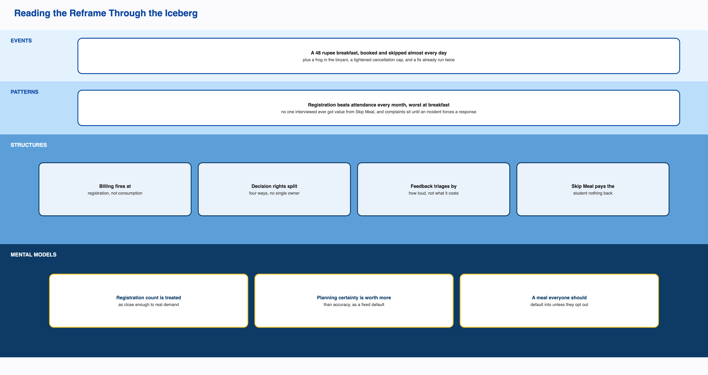

# The Problem, Reframed

> The Breakfast Paradox is a stable equilibrium. The system holds the gap between registration and attendance in place because every actor's behavior inside it is individually reasonable, and every consequence it produces gets absorbed before it can become a signal.
>
> Billing fires at registration rather than at consumption. That single rule removes the cost of inaccuracy from the student and the revenue risk from the vendor at the same time, so neither party closest to the daily decision has a reason to want the number to be accurate. What follows gets quietly absorbed: the resale market takes the student's financial loss, composting and staff meals take the physical surplus, outside venues take the dissatisfaction, and informal workarounds take the cultural mismatch. Each of these is genuinely useful, and none should be removed. Together, they keep the gap from ever generating a signal loud enough to reach a system that only responds to complaint intensity, and whose decision rights are split across four actors, none of whom holds both the knowledge and the authority to act.
>
> This is why the one office that can state the gap's exact size has never had reason to raise it, and why an attendance-tracked model that already worked twice was retired both times without review. No single actor feels this as their own problem. The student feels a charge. The kitchen feels a rush. The office holds a statistic. The vendor feels nothing. The paradox only exists in aggregate, and aggregate is the one thing this system has no way to see.

The original question was operational: students register for breakfast, many don't show up, they get charged anyway, and the food gets cooked regardless, so why doesn't registration match who actually eats. That question is aimed at the wrong layer. The real problem is the one stated above: a stable equilibrium, held in place by a billing rule, a set of split decision rights, and an attention mechanism that only reacts to loud complaints, and protected from correction by absorption mechanisms that are each individually good.

The rest of this document is the case for that statement: the assumptions it overturns, the stakeholder evidence behind it, the tensions that make it hold, and the evidence that validates it. The Design Opportunity Statement is a separate document that builds on this one and turns the diagnosis into where to intervene.

# 1. What the Original Question Got Wrong

The original question rested on five assumptions. Evidence from six interviewed students and a CFS Chair interview tests each one directly.

**Students not showing up is the problem.** This is a symptom, and part of what the turnout number counts as failure isn't even a problem. One respondent practices intermittent fasting on purpose, stopped cooking breakfast years ago, and says they don't usually even notice the mess despite living in the same hostel. Others come from families or regions where a formal breakfast was never the norm. A real share of the gap is just how a diverse group of people eats, and the system has no way to tell that apart from an ordinary no-show. Both look the same in the billing record: a paid slot nobody used.

**Students are being careless or irrational.** They aren't. Registering for a whole month at Kadamba because it fills up fast is a sensible response to scarcity. Reselling on Mess Cell instead of using Skip Meal makes sense when one tool pays you back and the other doesn't. Sleeping in instead of walking to a mess where the popular items are probably already gone makes sense at 9:10 in the morning. Every individual decision here is defensible, which is what makes this a systems problem rather than a behavior problem.

**Nobody has solved this.** The institution has already run attendance-tracked billing twice, during a gas shortage and during holidays like Felicity. Students walked in, scanned a QR code, and were only charged if they actually ate. It worked both times, and both times it was switched off once the trigger passed, with no sign anyone evaluated keeping any part of it. The problem was never that a solution didn't exist.

**The gap persists because nobody knows how big it is.** The CFS Chair can state it from memory. Breakfast turnout runs 35 to 45 percent, general items run around 70 percent, and high-demand items run above 90 percent. That knowledge has never reached a registration or billing policy discussion. The gap is known and measured. It just hasn't traveled upward.

**This is one problem.** It's at least three structural causes, plus one thing that isn't a problem at all. Treating it as a single gap produces a single fix aimed at an average of four different things.

# 2. What Each Stakeholder Actually Experiences

Ask anyone in this system what their problem is, and none of them will describe the Breakfast Paradox. Each person feels a different, smaller piece of it.

| Stakeholder | What they experience | What they don't experience |
|---|---|---|
| Students | Charged for a meal they can't use, with only an informal WhatsApp market to recover the money | The aggregate cost. One student's lost 48 rupees is annoying, not alarming |
| Kitchen and serving staff | Cooking to a number they didn't set, then facing a crowd at 9:20 with the popular items gone | Any channel to report what they see every day |
| The vendor | Nothing. Registration-based billing protects revenue regardless of attendance | Any reason to want this fixed (assumed, pending contract terms) |
| CFS / CDS office | The workload behind the one policy change on record | The gap as something that presses on them daily. It's a number they hold, not a pain they feel |
| CDS Committee | Menu satisfaction, which they already fixed | Visibility into what's actually eaten versus registered |
| Academic administration | Nothing related to the mess. Their timetable solves their own problems | Any consequence of the 8:30 collision, or any channel to mess governance |
| Faculty and early-shift staff | No confirmed mess access and no seat in any stakeholder map | Any presence in the system's own numbers |

This is the center of the reframe. Nobody experiences the Breakfast Paradox as their own problem. The student feels a charge. The kitchen feels a rush. The office holds a statistic. The vendor feels nothing. The paradox only shows up in aggregate, and aggregate is exactly what this system has no way to see, own, or escalate.

# 3. The Tensions Holding This in Place

None of these get fixed by asking one side to behave better. Each side is already behaving sensibly given the structure around it.

**Individual sense against total cost.** Registering broadly and reselling what goes unused works for one student. When everyone does it, it produces the waste and crowding this project set out to explain. No individual is doing anything wrong.

**Planning certainty against matching real demand.** This is the sharpest tension, because the institution has actually run both sides of it. The standing model gives the vendor a number it can plan four days out. The shock-adaptive model matches real attendance and gives up that certainty. Both worked on their own terms. The institution picks certainty every time the exceptional trigger passes.

**One rule against real variation.** One registration rule, one billing model, and one average-based portion size get applied across four dining halls that are really three different kitchen systems with different cuisines, capacities, and demand.

**Transparency against gaming.** Posting the menu two weeks ahead fixed menu fatigue. By the same office's own account, it also gave students a way to plan their skipping. One policy, both effects, at the same time.

**Loud complaints against quiet costs.** The same escalation path that fixed menu fatigue in one pass has never carried the registration-billing gap, even though that gap is bigger and already measured by the office that would need to raise it. Same process, opposite outcomes, depending only on how loud the problem feels.

**One model against real difference.** Intermittent fasting, regional eating habits, religious observance, and personal diet all get folded into the same turnout number as ordinary no-shows, because nothing in the system tells a considered choice apart from a failure.

**Two systems colliding with nobody between them.** The 8:30 class start and the 7:30 to 9:30 breakfast window likely each serve a real purpose on their own side. There is no confirmed relationship, formal or informal, between whoever sets one and whoever sets the other.

# 4. Reading It Through the Iceberg

The original framing stayed at the top two layers of the Iceberg. The real causes sit at the bottom two.

**Events.** A student charged 48 rupees a day for a Kadamba breakfast they mostly skip. Idli, puri, and bhatura gone by 9:20, with staff-promised restocks that don't show up. A frog in the chicken biryani in November 2024. The December 2024 cancellation tightening, pushed through despite a Ping survey and two Parliament meetings. The Felicity walk-in relaxation. The vote that ended the fixed-semester menu.

**Patterns.** Registration beats attendance every month, worst at breakfast. All six interviewed students register monthly, not day by day. None of the six ever got value from Skip Meal. Four of six use Mess Cell. Crowding builds through the morning to a peak right before the 9:30 close. Complaints sit until an incident forces a response, except once, when a loud complaint got fixed cleanly.

**Structures.** Billing fires at registration, not consumption. Sourcing locks four days ahead. Cancellation is capped at five a month. Walk-in pricing runs 70 to 90 percent above the registered rate. Skip Meal tells the kitchen but pays the student nothing. Menu, kitchen, timetable, and billing sit with four separate owners, and none of them owns the whole outcome. Feedback gets triaged by how loud it is, not by what it costs. An informal resale market fills the gap the formal system leaves.

**Mental models.** That a registration count is a good enough stand-in for real demand, a belief the office holding the real numbers still keeps. That a registration already made costs nothing extra to leave unused. That planning certainty is always worth more than demand accuracy, rather than a case-by-case call. That operational policy belongs to the Mess Office alone, with consultation optional under time pressure. That breakfast is a meal everyone should default into, which is why a student who never registers still gets automatically assigned one.

Phase 1 asked a question about events and patterns. Everything that would actually move this system sits in the bottom two rows.

# 5. Why This System Holds Steady Instead of Breaking

This is the part the original framing missed, and it's the most important finding in the project.

A problem usually keeps going because nobody solved it, solving it costs too much, or somebody benefits from it staying broken. None of those is the real story here. This gap holds steady because every consequence it creates gets absorbed by something that works well, before it ever becomes a signal anyone has to answer for.

The Mess Cell resale market absorbs the student's financial loss. Composting absorbs the physical surplus, well enough to earn a five-star food safety rating. Staff eating unclaimed food absorbs another share of the surplus before it's even counted as waste. Outside venues like the VC canteen, juice stalls, and delivery apps absorb the frustration that would otherwise turn into a complaint about mess hours. Informal workarounds absorb the cultural and dietary mismatch that never gets filed as a request, because the exemption process was never built for it.

Every one of these genuinely helps. Students really do recover money. Waste really does get handled responsibly. Staff really do get fed. None of them should be removed.

Together, they mean no financial signal, no volume signal, and no cultural signal ever reaches anyone positioned to act. Waste is never measured by volume, so it can't be escalated even if the system listened for that kind of data, and it doesn't. It listens for complaint intensity. A system with this many working absorption layers rarely builds enough pressure to force a fundamental fix.

That changes the real question, from why hasn't this been fixed, to what in this system would ever make someone fix it. On the evidence, the honest answer is nothing.

# 6. Other Ways to Frame This, and Why They Fall Short

**"How do we get more registered students to actually attend?"** This was the original framing. It treats attendance as the goal, which runs straight into the finding that a real share of non-attendance is legitimate. It also points the fix at the people with the least power and the most defensible behavior.

**"How do we make registration a more accurate signal of intent?"** This assumes better student behavior or stricter rules would fix it. The institution's own proven alternative required no change in student behavior at all. It removed the need for registration to be accurate in the first place.

**"Who should own the registration-attendance gap?"** Closer, but incomplete. Fragmented ownership explains why a known fix was never picked back up. It doesn't explain why the gap never got loud enough to demand an owner in the first place.

**The framing stated at the top of this document** is the one the evidence actually supports: a stable equilibrium, held in place by three structures, and protected by absorption mechanisms that are each genuinely useful on their own.

# 7. Validating the Reframe

Three pieces of evidence support this framing, and one open question limits it.

The claim that a fix is possible isn't a guess. The shock-adaptive model already ran twice at this institution and closed the exact gap in question. That's the strongest kind of evidence available: not "if this were removed, the pattern would probably stop," but "when this was removed, the pattern stopped."

The claim that fragmentation is why the fix wasn't kept is confirmed, not inferred. The CFS Chair holds the exact turnout figures, and that awareness has never reached a registration or billing policy conversation.

The claim that attention responds to intensity rather than cost is shown by the system's own two different outcomes under one escalation design. Menu fatigue, felt daily and sharply, traveled the full path from Student Council to Committee and produced a real policy change. The registration-billing gap, bigger and already measured, has never entered that same process.

The whole shape matches the clearest systems pattern in the project. The system optimizes for what it can easily measure and bill against, which is registration count. Its own stated goal, printed on the main CDS dining poster, is to provide nutritious, hygienic, affordable meals while minimizing food wastage through advance meal planning. The CDS Student Handbook lists reduced food wastage and better meal planning as the direct benefits of registering ahead. The easy metric and the stated goal have clearly diverged. The institution already knows it. Nothing has changed.

One question stays open, named honestly rather than assumed away: whether the vendor's actual contract terms could support any standing version of the attendance-tracked model. Nobody has asked. If the answer is no, this framing still holds, but the fix shifts from adoption to renegotiation.

# 8. What's Still Missing

The single biggest open question is whether the vendor's contract terms could support any standing or partial version of the attendance-tracked model, and if not, exactly which term rules it out. Nobody has asked this directly. It's the difference between calling the current default a considered trade-off and calling it an unexamined one.

Two smaller items carry forward. Skip Meal's usage sits near zero even though it's now confirmed to work for kitchen forecasting. An awareness gap, a trust gap, and a portal-friction problem would each point to a different fix, and this project can't yet tell them apart. And the CDS Chair, who holds the most formal authority in the dining chain, has still never been interviewed. Every account of CDS decision-making here comes from one level up.
