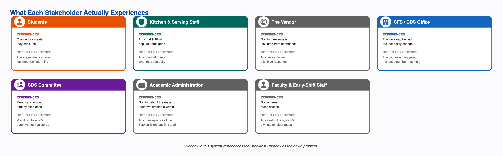
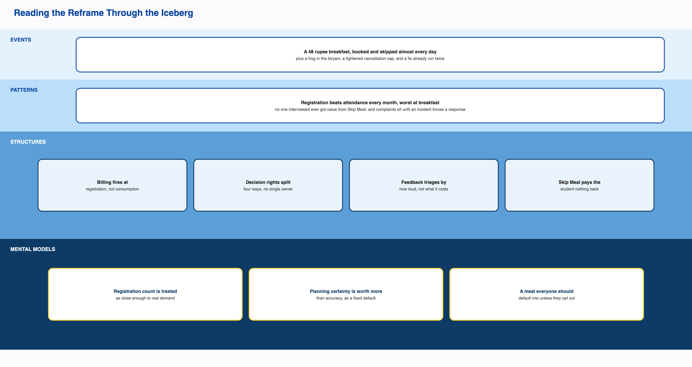

# The Problem, Reframed

> The Breakfast Paradox is a stable equilibrium. The system holds the gap between registration and attendance in place because every actor's behavior inside it is individually reasonable, and every consequence it produces gets absorbed before it can reach anyone who sets the rules.
>
> Three structures hold it. Breakfast is booked by default: every student is registered automatically, including when away from campus and over holidays, and can leave the booking only through five cancellations per meal type per month, each made at least four days ahead. The booking is a default the system assigns, not a decision the student makes, so it cannot follow the decision each student actually makes on the morning itself. Billing fires at that booking rather than at consumption, and beyond the five cancellations there is no way to nullify the charge, which makes the inaccuracy costless to the system and, if operators are paid on booked plates, keeps the operator's revenue safe. And the gap is measured twice, in the CDS scan record and, where the operator keeps them, in the operator's own books, and neither measurement is routed to the people who set registration, billing and menu rules, whose decision rights are split so that none of them holds both the knowledge and the authority to act. Lunch runs under the same booking and billing rules and mostly works: at Yuktāhār in September 2026, 56 to 89 percent of lunch bookings were eaten, against 18 to 40 percent of breakfast bookings on the same days. That difference is what makes this a breakfast problem rather than a billing problem.
>
> What follows gets quietly absorbed. The resale market takes the student's financial loss. The operator's own discount on the booking, live top-ups, leftover reuse, the outside diners and staff who eat from the same food, the walk-in buffer and late-door service take most of the physical surplus, holding and reheating turns some of the rest into lower quality instead of waste, and what cannot be used leaves in the bin. Outside venues take the dissatisfaction, and informal workarounds take the cultural mismatch. Most of these are genuinely useful, and none of the useful ones should be removed. Together, they keep the gap from generating a signal loud enough to reach a system that only responds to complaint intensity.
>
> This is why the actors who can state the gap's exact size, the office and at least one operator, have never had a route to raise it, and why an attendance-tracked model that already worked twice was retired both times without review. No single actor feels this as their whole problem. The student feels a charge. One operator measures the gap every morning and has no one to tell; the other cooks to the registration count as the obligation it is paid for. The office holds a statistic. The paradox is seen in aggregate only by the actors with the least authority over the rules, and never by the actors who could change them.

The original question was operational: students register for breakfast, many don't show up, they get charged anyway, and the food gets cooked regardless, so why doesn't registration match who actually eats. That question is aimed at the wrong layer. The real problem is the one stated above: a stable equilibrium, held in place by a default booking that cannot follow the morning, a billing rule that makes the mismatch costless, and split decision rights with no route from the actors who measure the gap to the actors who set the rules, and protected from correction by absorption mechanisms that are mostly useful on their own. Beneath the kitchen half of the problem sits one intermediate mechanism: each operator converts the booking into a cooked first batch above recorded turnout, Kadamba and the off-site kitchen by a fixed, uncalibrated ratio and Yuktāhār from its own books, and can then top it up but never shrink it. It is downstream of the three structures rather than one of them, and it sits inside authority the operator already holds.

This statement was revised after interviews with three catering operators, Yuktāhār's photographed registers for September 2026, the complete Kadamba breakfast scan record for April 2026, and a team member's first-hand account of both the Kadamba and Yuktāhār visits. The earlier version held that the gap never became a signal, that composting took the physical surplus, that the vendor felt nothing, and that billing alone explained the gap. The operations evidence overturned all four. The first-hand account then revised three further findings: the booking was described as a standing block students choose, and is in fact assigned automatically; the extra diners at Kadamba were described as 20 to 30 staff, and are 30 to 50 outside people plus about half of Kadamba's own staff; and the operators were described as one actor that measures the gap, when the same billing basis has produced two opposite operator stances. The sections below carry the revised findings.

The rest of this document is the case for that statement: the assumptions it overturns, the stakeholder evidence behind it, the tensions that make it hold, and the evidence that validates it. The Design Opportunity Statement is a separate document that builds on this one and turns the diagnosis into where to intervene.

# 1. Challenging Initial Assumptions: What the Original Question Got Wrong

The original question rested on five assumptions. Evidence from six interviewed students, a CFS Chair interview, interviews with three catering operators, a team member's first-hand account of the Kadamba and Yuktāhār visits, Yuktāhār's own attendance, wastage and store books, and the 11,941 timestamped breakfast scans recorded at Kadamba in April 2026 test each one directly.

**Students not showing up is the problem.** This is a symptom, and part of what the turnout number counts as failure isn't even a problem. One respondent practices intermittent fasting on purpose, stopped cooking breakfast years ago, and says they don't usually even notice the mess despite living in the same hostel. Others come from families or regions where a formal breakfast was never the norm. The records show the same variety from the other side: at Kadamba in April, 48.5 percent of non-vegetarian breakfast bookings were eaten against 32.4 percent of vegetarian ones, and Sunday turnout was the lowest of the week at Kadamba and among the lowest at Yuktāhār (confirmed). A real share of the gap is just how a diverse group of people eats, and the system has no way to tell that apart from an ordinary no-show. Both look the same in the billing record: a paid slot nobody used.

**Students are being careless or irrational.** They aren't, and most of them are not choosing a booking at all. Registration is mandatory and automatic: every student is registered whether or not they are on campus, including over holidays, and the only exit is five cancellations per meal type per month, each made at least four days ahead (confirmed, from the CDS poster and a student's own account). In that student's words: "Even if you want to eat breakfast or not, it is automatically registered. We don't have any opportunity to nullify it." This revises the earlier finding that booking breakfast as a standing block is a strategy students choose. The standing booking is the default the system assigns; an exit that narrow and that early cannot follow a decision made on the morning. For students who do register actively, booking broadly remains a sensible response to a mess that fills up fast. Students describe the booking as covering the whole month; the handbook and the Kadamba operator describe weekly blocks. Either way the records show a default rather than a daily choice: Kadamba breakfast bookings sat at about 1,070 a day on every day of the week in April, Sunday included, while turnout moved from 42.1 percent on Tuesdays to 27.3 percent on Sundays (confirmed). Reselling on Mess Cell instead of using Skip Meal makes sense when one tool pays you back and the other doesn't. Deciding at 9:10 whether the walk is worth it makes sense too: that is when the mess is about to reach its most crowded, with 26.5 percent of all April breakfast scans at Kadamba falling between 9:15 and 9:30 (confirmed), and when specific popular items may already have run out even though other food is still left over. Every individual decision here is defensible, which is what makes this a systems problem rather than a behavior problem.

**Nobody has solved this.** The institution has already run attendance-tracked billing twice, during a gas shortage and during holidays like Felicity. Students walked in, scanned a QR code, and were only charged if they actually ate. It worked both times, and both times it was switched off once the trigger passed, with no sign anyone evaluated keeping any part of it. The data that model needs is still collected every day under the standing model: Kadamba recorded 11,941 timestamped breakfast scans in April 2026 (confirmed), with a handwritten fallback when a scanner fails (single-sourced). The problem was never that a solution didn't exist, or that the system couldn't count consumption.

**The gap persists because nobody knows how big it is.** The gap is measured in at least three places, and this finding was revised upward by the operations evidence. The Kadamba scan record shows that of 32,162 breakfast bookings in April 2026, 11,941 were eaten, 37.1 percent, and 62.9 percent went unused (confirmed). Yuktāhār's own register for September 2026 shows breakfast between 17.7 and 40.2 percent, about 28 percent on average, against lunch at 56 to 89 percent on the same days (confirmed). The CFS Chair's recalled figure of 35 to 40 percent for breakfast is now confirmed for Kadamba; the recalled 70 percent for general items matches lunch rather than breakfast. The earlier project figure of a roughly 30 percent gap is revised: that is a lunch-sized gap, and at breakfast the gap is about 63 percent at Kadamba and about 72 percent at Yuktāhār. The three measurements are never reconciled. Yuktāhār's site head believes his breakfast turnout is at most about 50 percent while his own register shows about 28 (confirmed), and the operator of a third mess believes Kadamba fills 90 to 95 percent (single-sourced), which the Kadamba breakfast records contradict. How much an operator measures also differs: Yuktāhār weighs every item in a Wastage Book, while Kadamba keeps per-dish gram standards and puts its own waste at 5 to 10 percent a day on an unstated base (single-sourced), and its per-item outcome record is the CDS scan export, held by CDS rather than by the operator. None of these measurements has ever reached a registration or billing decision. The gap is known and measured. It just hasn't traveled upward.

**This is one problem.** It's at least three structural causes, plus one thing that isn't a problem at all. Treating it as a single gap produces a single fix aimed at an average of four different things.

# 2. Comparing Stakeholder Perspectives: What Each Stakeholder Actually Experiences

Ask anyone in this system what their problem is, and none of them will describe the Breakfast Paradox. Each person feels a different, smaller piece of it.

| Stakeholder | What they experience | What they don't experience |
|---|---|---|
| Students | Registered automatically, including over holidays and when away, with five cancellations per meal type per month, each four days ahead, as the only exit; beyond those, no way to nullify the charge. The unused charge is recoverable only through an informal WhatsApp resale market | The aggregate cost. One student's lost 48 rupees is annoying, not alarming |
| Catering operators: Prism, the tender-contracted vendor that runs all of Kadamba; ABC Hospitality Services at Yuktāhār; Vijayalakshmi Caterers (candidate match for the shared Bakul and Palash off-site kitchen) | At Kadamba, a first batch fixed at 70 percent of registrations, planned separately for vegetarian and non-vegetarian, portioned by per-dish gram standards, then topped up on the supervisor's live call; the registration count is treated as the obligation it is paid to cook to. At Yuktāhār, the gap every morning, item by item, in a book system that learns from each matching week, with a projection from the first half hour of service and waste treated as cost against an explicit profit goal. Each carries the food cost of what it over-cooks | Any route from what it records to the rules that produce the gap, and any say over the registration close, the billing basis or the menu. Complaints flow in, through the CDS-side site team and a WhatsApp group; measurements never flow out |
| Operator kitchen staff | At Kadamba, cooking to a fixed ratio and a supervisor's call inside a layered chain of operations manager, manager, supervisor and service staff, with no way to un-cook a first batch when the morning comes in lower. At Yuktāhār, no hierarchy: staff rotate across tasting, cutting and cleaning teams, cross-check each other's books, weigh waste without blame and share leave load by agreement. At Kadamba the scan records, and at Yuktāhār the site head, place the heaviest crowd of the morning in the last fifteen minutes before close | Any link from their wastage records to the choice of menu items |
| The operator firm and its contract | A tendered rate paid monthly as a lump sum on plates, with deductions (single-sourced). Kadamba's operator describes the registration count as what it is paid for (single-sourced) | Any cost from no-shows, if plates are counted at booking. Whether they are counted at booking or at serving is not yet known |
| Facility team and QC inspection | The food's safety and taste at every meal: cooking temperature, a 72-hour retained sample, a wrapped display plate at the entrance (confirmed), serving temperature per item, and tasting with two Prism staff before corrections, plus weekly QC and daily water TDS checks (single-sourced) | Cooked quantity, waste or turnout. Nothing in the checking sequence asks how much was cooked against how many ate |
| CFS / CDS office | The workload behind the one policy change on record, and a scan-level record of every breakfast eaten | The gap as something that presses on them daily. It's a number they hold, not a pain they feel, and nothing from the operators' registers reaches them |
| CDS Committee | Menu satisfaction, which they already fixed. They choose the menu, by the operators' account (single-sourced) | The per-item waste the operators record. At Kadamba uttapam, set dosa and upma waste most while puri, vada and idli move (single-sourced) |
| Academic administration | Nothing related to the mess. Their timetable solves their own problems | Any consequence of the 8:30 collision, or any channel to mess governance |
| Faculty and staff at Yuktāhār | Counted in small numbers, zero to two faculty or staff at breakfast (confirmed) | Any confirmed seat in a governance forum for early-shift staff |
| Non-student diners at Kadamba | About 30 portions planned on top of registrations for 30 to 50 outside people such as night-shift security, and about half of Kadamba's own staff eating from the same food (single-sourced). Fed reliably | Any count in the registration or scan record, and any seat in governance |
| Garbage contractor | The physical end of Kadamba's surplus, collected from a dustbin (single-sourced) | Any voice or count that reaches the system. Where the waste goes after collection is unknown |

The Kadamba command chain, as the operator describes it, runs from CFS to CDS to Prism, and inside Prism from an operations manager to a manager, a supervisor and service staff (single-sourced). The supervisor watches the counters and tells the kitchen how much more to cook. The facility team's inspection route is the one institutional line that reaches into the kitchen at every meal, and it checks safety and taste, not quantity.

The operators also carry their own reading of the gap. Kadamba's manager explains no-shows as students who book even when they are away in their village while a friend eats in their place (single-sourced). The scan record cannot test this, because it carries no student ID, but it is consistent with the resale and transfer behavior students describe, and automatic registration of students who are off campus, including over holidays, would produce exactly this pattern without anyone gaming it (candidate). Students see the same rule from the other side: "Whether we eat or not, it will get registered even if we don't register."

This is the center of the reframe, and it was revised twice. The earlier version said the vendor felt nothing. The operations evidence showed the operator seeing the gap more completely than anyone. The first-hand account then showed that this holds for one operator, not both. At Yuktāhār the operator sees the gap more completely than anyone, per item and per weekday, and is the one actor with no authority over any rule that produces it. At Kadamba the operator sees live counter flow and gram standards, keeps no outcome record the team has seen, and treats the registration count as the obligation it is paid to cook. The student feels a charge. The kitchen feels a rush. The office holds a statistic. The paradox is visible in aggregate, but only at the bottom of the chain of authority, and nothing carries it up.

# 3. Identifying Contradictions and Tensions: What Holds This in Place

None of these get fixed by asking one side to behave better. Each side is already behaving sensibly given the structure around it.

**Individual sense against total cost.** The booking is the default, and reselling what goes unused is the individual response that works for one student. When everyone does it, the default produces the waste and crowding this project set out to explain. No individual is doing anything wrong.

**Billing certainty against demand accuracy.** This is the sharpest tension, because the institution has actually run both sides of it. The standing model gives the institution a certain revenue base, fixed four days out, and gives the operator one too if plates are counted at booking. The earlier claim that it also gives the kitchen a number it can plan against four days out was revised by the operations evidence. Every operator converts the booking into its own cooked quantity rather than cooking to it. Procurement runs on shorter horizons than the registration close: Yuktāhār buys groceries fortnightly, vegetables two or three times a week and milk daily, and sets the cooked quantity the day before in a planning meeting (confirmed), while Kadamba buys dry goods such as rice, groundnut, masala and ghee a week ahead, most vegetables two or three days ahead, and milk, fruit, meat, eggs and remaining vegetables the day before (single-sourced). Only dry goods are committed before the four-day close, and raw surplus can be carried forward; cooked food lasts three to four hours and cannot. The binding constraint is the cooked first batch, not raw procurement, and the pre-service safety sequence of cooking temperature, retained sample, display plate, serving temperature and tasting fixes that batch before any turnout signal arrives (candidate). The shock-adaptive model matches real attendance and gives up revenue certainty. Both worked on their own terms. The institution picks certainty every time the exceptional trigger passes.

**Operator knowledge against operator authority.** The actor with the most detailed demand data holds control over quantity only. Yuktāhār plans breakfast in a daily meeting from portal bookings, its Wastage Book entry for the matching week of the repeating menu, its attendance register grouped by weekday, the month's turnout pattern and any holidays, special weeks or campus events, then re-projects the rest of service from the first half hour (single-sourced, with the books confirmed). Its store book must match what was cooked, and any mismatch is raised in the meeting; it holds an expected impurity norm for each raw item and challenges or changes a supplier that exceeds it (single-sourced). It tried outside prediction software and dropped it, judging that paying lakhs of rupees made no sense when the data already sits in its books and its staff are not digitally inclined; in its site head's words, prediction should be based on its own data (single-sourced). It cannot touch the registration close, the billing basis or the menu. Events and exams reach its kitchen only if someone happens to raise them in the meeting: "We don't come to know... until we sit in the meeting" (confirmed). Kadamba's team questioned the four-day cut-off against its one-day perishable orders (single-sourced), and Vijayalakshmi Caterers' manager asks for a say in the menu (single-sourced). Nobody asks them.

**One billing basis against two operator stances.** Both operators work under the same registration-based booking and, as far as is known, the same kind of tendered plate payment. Kadamba's operator describes the registration count as a paid obligation it cooks to: the mess "doesn't care if people don't want to eat because it is a responsibility and they are getting paid for it" (single-sourced). Yuktāhār's managers describe waste as cost, with lower operating cost and higher profit as stated goals alongside quality, and have built a book system that learns from each matching week (single-sourced, with the books confirmed). The same rule therefore produces one kitchen that measures and trims and one that cooks to a fixed ratio and records little beyond gram standards. Whether an operator even generates the information that could correct the rules depends on its management culture, not on the rules (candidate). The plate basis, still unknown, decides which stance the contract actually rewards; Kadamba's "paid for it" is a hint toward booked plates, not a contract term.

**The operator's discount against the late crest.** This is the one point where shortage and waste happen on the same morning. Kadamba cooks its first breakfast batch at 70 percent of registrations, planned separately for vegetarian and non-vegetarian (single-sourced), against 37.1 percent actual turnout (confirmed). On April's average day that is about 530 vegetarian portions against about 245 eaten, roughly 2.2 times, and about 220 non-vegetarian portions against about 153, roughly 1.4 times, so a fixed ratio over-cooks vegetarian breakfast most, where turnout (32.4 percent) sits furthest below it (candidate arithmetic). The operator puts its daily waste at 5 to 10 percent, on an unstated base (single-sourced). That figure and a first batch nearly twice turnout cannot both describe the same breakfast unless most of the surplus is eaten by outside diners and staff, held and reheated into later service, or the top-ups are much smaller than the first batch implies. This is left as a tension, not resolved by assumption. Yet late students still meet run-outs of specific items, because the crowd does not thin toward close: it crests there, at about nine scans a minute on an average April day by 9:29 (confirmed). Kadamba's own rule of thumb is about 100 diners early, about 100 through the middle and about 150 in the last 10 minutes (single-sourced), and Yuktāhār's site head says the rush always comes at closing time (single-sourced); the records remain the measurement. The crest also spills past the close: students come in through the back door after 9:30 and the mess cannot refuse them (single-sourced), and 9.2 percent of April scans, about 37 a day, fall at or after 9:30 (confirmed). Yuktāhār does not re-cook an item that runs out late in service, by a rule it applies from its Wastage Book (confirmed). Local adjustment cannot resolve this. Cooking less raises run-outs; cooking more raises waste.

**One rule against real variation.** One registration rule and one billing rule get applied across four dining halls that are really three different kitchen systems: one converting by a fixed ratio, one by learning from its own books and a first-half-hour projection, and one by a ratio it has moved from 70 to 80 percent. Yuktāhār plans from its registers and re-cooks on site by a run-out-time rule, while its site head believes breakfast turnout is at most about 50 percent (confirmed), and its first-half-hour projection samples the quietest part of service and so under-reads the closing crest (candidate). Kadamba cooks 70 percent first and tops up in 10 to 15 minutes, and Vijayalakshmi Caterers now cooks for about 80 percent and brings extra from an off-site kitchen within about 30 minutes (both single-sourced). Kadamba cooks biryani lunch at 100 percent of registrations, two pieces of 150 to 200 grams each with unlimited rice (single-sourced), so its ratio is set by dish and meal, not by any record of turnout (candidate). Turnout itself varies by diet and by weekday within a single hall, while the booking does not.

**Transparency against gaming.** Posting the menu two weeks ahead fixed menu fatigue. By the same office's own account, it also gave students a way to plan their skipping. The same repeating cycle is what lets Yuktāhār look up the matching week in its Wastage Book. One policy, three effects, at the same time.

**Loud complaints against quiet costs.** The same escalation path that fixed menu fatigue in one pass has never carried the registration-billing gap, even though that gap is bigger and already measured, by the office and by at least one operator. Same process, opposite outcomes, depending only on how loud the problem feels. Complaints reach the operator quickly, from the director's email down to the kitchen WhatsApp group, and the facility team inspects safety and taste at every meal; the operator's own measurements have no path in the other direction, and the inspection that already runs daily never asks about quantity (candidate).

**One model against real difference.** Intermittent fasting, regional eating habits, religious observance, and personal diet all get folded into the same turnout number as ordinary no-shows, because nothing in the system tells a considered choice apart from a failure.

**Two systems colliding with nobody between them.** The 8:30 class start and the 7:30 to 9:30 breakfast window likely each serve a real purpose on their own side. There is no confirmed relationship, formal or informal, between whoever sets one and whoever sets the other. The Kadamba scan record shows no surge before 8:30; arrivals run at about 6 to 10 percent per quarter hour from 7:30 until 9:00 and then climb to 13.5 and 26.5 percent in the last two quarters (confirmed). A first class ending shortly before 9:30 would push students into exactly the minutes the kitchen can least serve. That link is a candidate until it is checked against the timetable.

# 4. Reading It Through the Iceberg

The original framing stayed at the top two layers of the Iceberg. The real causes sit at the bottom two.

**Events.** A student charged 48 rupees for a Kadamba breakfast they were registered for and skipped. Idli, puri, and bhatura gone by 9:20, with staff-promised restocks that don't show up. Sunday 6 September 2026 at Yuktāhār: 267 breakfasts booked, 50 eaten (confirmed). A Kadamba biryani day when 25 students arrived after the close and the door was reopened for them (single-sourced). The wrapped display plate set at the Kadamba entrance before a meal on the day of the team's visit (confirmed). Yuktāhār trying outside prediction software and dropping it (single-sourced). Yuktāhār's kitchen staff reporting in December that waste had fallen since weighing began in August (single-sourced). A frog in the chicken biryani in November 2024. The December 2024 cancellation tightening, pushed through despite a Ping survey and two Parliament meetings. The Felicity walk-in relaxation. The vote that ended the fixed-semester menu.

**Patterns.** Breakfast bookings go unused at a far higher rate than lunch bookings: 62.9 percent unused at Kadamba in April and about 72 percent at Yuktāhār in September, against 11 to 44 percent unused at Yuktāhār lunch (confirmed). Bookings stay flat across the week while turnout swings by weekday and sits lowest or near lowest on Sundays (confirmed). Arrivals build steadily, crest in the last fifteen minutes before close and spill past it, with about 37 Kadamba scans a day at or after 9:30 (confirmed). The first cooked batch sits above actual breakfast turnout: Kadamba's 70 percent against weekday turnout of 27 to 42 percent in April, about twice turnout for vegetarian breakfast (candidate arithmetic). The same items waste repeatedly at Kadamba while others sell out (single-sourced). All six interviewed students are on a standing booking, which automatic registration makes the default. None of the six ever got value from Skip Meal. Four of six use Mess Cell. Complaints sit until an incident forces a response, except once, when a loud complaint got fixed cleanly.

**Structures.** Billing fires at booking, not consumption. Registration is automatic; the only exit is five cancellations per meal type per month, each made four days ahead, with no way to nullify the charge. This replaces the earlier findings that the booking was a standing block students chose and that sourcing locks four days ahead, both revised by later evidence. Kadamba converts bookings into a first batch at a fixed 70 percent by gram standard; Yuktāhār by matching-week lookup and a first-half-hour projection. Cooked quantity can rise by top-up but never fall. Walk-in pricing runs 70 to 90 percent above the registered rate. Skip Meal pays the student nothing, and whether it reduces what Kadamba cooks is in conflict. The committee chooses the menu while the operator sees the waste per item. Complaints route down into the operator; nothing routes the operator's measurements up. Oversight inspects safety and taste at every meal, never quantity. Events and exams reach the kitchen only informally. Menu, kitchen, timetable, and billing sit with four separate owners, and none of them owns the whole outcome. Feedback gets triaged by how loud it is, not by what it costs. An informal resale market fills the gap the formal system leaves.

**Mental models.** That a registration count is a good enough stand-in for real demand. This belief sits with the rule setters, including the office that holds the real numbers; neither operator cooks to the full count at breakfast, though they read it in opposite ways. That the operator's job is to cook what is registered, stated by Kadamba's operator in its own words as a paid responsibility (single-sourced), set against Yuktāhār's opposite model that waste is cost to be driven down (single-sourced). That prediction belongs close to the operator's own data (Yuktāhār), or that beyond a fixed ratio with gram standards and the supervisor's live call there is nothing to predict with ("we don't have that idea", Kadamba, on forecasting turnout, single-sourced). That measuring waste means assigning blame, the fear Yuktāhār's managers had to remove before weighing worked. That breakfast turnout is higher than it is, held by the one operator with the best records. That no-shows are students away from campus with a friend eating in their place (Kadamba, single-sourced). That a registration already made costs nothing extra to leave unused. That planning certainty is always worth more than demand accuracy, rather than a case-by-case call. That operational policy belongs to the Mess Office alone, with consultation optional under time pressure. That breakfast is a meal every student should be placed into by default, which is why every student is registered automatically, including those who never asked and those who are away.

Phase 1 asked a question about events and patterns. Everything that would actually move this system sits in the bottom two rows.

# 5. Why This System Holds Steady Instead of Breaking

This is the part the original framing missed, and it's the most important finding in the project.

A problem usually keeps going because nobody solved it, solving it costs too much, or somebody benefits from it staying broken. None of those is the real story here. This gap holds steady because every consequence it creates gets absorbed by something that works, before it ever reaches anyone who sets the rules.

The Mess Cell resale market absorbs the student's financial loss. The largest absorber is the operator's own daily adjustment: each operator converts the booking into its own cooked quantity, watches the counter, and tops up or re-cooks, which turns the gap into a local kitchen routine instead of a problem anyone upstream has to answer for. Leftover reuse absorbs another share at Yuktāhār, where leftover idli becomes idli upma or idli poha for lunch, dosa batter goes back into the fridge and surplus milk is set as curd (confirmed). At Kadamba, about 30 portions are planned for 30 to 50 outside diners such as night-shift security, and about half of Kadamba's own staff eat from the same food (single-sourced); together they are a substantial, uncounted sink for first-batch surplus (candidate). This revises the earlier finding that 20 to 30 cooking and security staff eat what is left after students. The operator does not say whether the outside-diner portions sit inside the first batch or on top of it, or whether staff eat planned portions or what is left, so how much surplus these diners take is unconfirmed. Kadamba also holds 30 to 40 extra portions for walk-in and paying diners, and the door reopened for late students, front or back, absorbs some of the closing crest (both single-sourced); whether the walk-in buffer and the outside-diner portions are one allocation is unconfirmed. Holding and reheating absorbs more at Kadamba: in the team's own judgement, food there is cooked ahead, reheated and moved between vessels repeatedly, and degrades fast (candidate). That converts surplus into lower quality rather than removing it. Whether lower quality then drives more skipping is not evidenced, so this is an open chain, not a loop. Outside venues like the VC canteen, juice stalls, and delivery apps absorb the frustration that would otherwise turn into a complaint about mess hours. Informal workarounds absorb the cultural and dietary mismatch that never gets filed as a request, because the exemption process was never built for it. What none of these can use leaves in the bin.

The earlier version of this statement credited composting with absorbing the physical surplus. That finding is revised. Kadamba's operator says its waste goes to a dustbin collected by a garbage contractor and that there is no composting (single-sourced). The institution's earlier account of waste going on to an outside compost facility is not yet reconciled with this.

Most of these genuinely help. Students really do recover money. Surplus really is put to use where it can be, and outside diners and staff really do get fed. None of those should be removed, and any change to the first batch has to plan their portions explicitly rather than take food from them. Three absorbers are different in kind: the over-cooked first batch, repeated holding and reheating, and the bin protect no one, and only destroy value quietly, the middle one by turning waste into worse food. Reducing them is a legitimate target in a way that removing resale or the meals of outside diners and staff is not.

Together, they mean no financial signal, no volume signal, and no cultural signal ever reaches anyone positioned to act on the rules. The earlier finding that waste is never measured by volume is revised. At least one kitchen weighs student plate waste and kitchen waste in kilograms, item by item, for each menu day it tracks, and records when each item ran out (confirmed). That measurement stays in the operator's books and never enters any rule-setting forum, and the system above the operator listens for complaint intensity, not for records. A system with this many working absorption layers rarely builds enough pressure to force a fundamental fix.

That changes the real question, from why hasn't this been fixed, to what in this system would ever make someone fix it. On the evidence, something already does, locally, inside the kitchen whose culture points at waste. Yuktāhār cut its waste between August and December by weighing it every meal, discussing it daily and making the weighing blame-free on purpose after staff feared being blamed, under managers who treat waste as cost against a profit goal (single-sourced, with the tracking confirmed). Kadamba has one recorded adjustment, cutting back ragi idli in favour of white idli, and no outcome record the team has seen; Vijayalakshmi Caterers moved its cooking ratio from 70 to 80 percent of bookings (both single-sourced). The local correction that exists depends on an operator whose incentives and culture point at waste, and on measurement that nobody fears. Nothing carries those fixes up to the rules that keep regenerating the gap.

# 6. Developing Alternative Problem Framings: Other Ways to Frame This, and Why They Fall Short

**"How do we get more registered students to actually attend?"** This was the original framing. It treats attendance as the goal, which runs straight into the finding that a real share of non-attendance is legitimate. It also points the fix at the people with the least power and the most defensible behavior.

**"How do we make registration a more accurate signal of intent?"** This assumes better student behavior or stricter rules would fix it. Registration cannot express intent when it is assigned automatically, and the institution's own proven alternative required no change in student behavior at all. It removed the need for registration to be accurate in the first place.

**"How do we help kitchens forecast breakfast better?"** This treats the operator as the owner of the problem. The operators already forecast and adapt, and the best-instrumented kitchen still puts its breakfast turnout at up to about 50 percent against the 28 percent its own register shows, still cannot un-cook a first batch, and projects the rest of service from a first half hour that misses the closing crest. Better forecasting of a default booking cannot see a morning decision the booking never records, and it leaves every rule that generates the gap untouched.

**"How do we get every operator to run like Yuktāhār?"** Closer than the forecasting framing, because operator culture decides whether the gap is even measured. It falls short because it leaves automatic registration, billing at booking and the missing upward route untouched, and Yuktāhār itself, the best-run kitchen, still over-estimates its breakfast turnout (at most about 50 percent believed against about 28 percent recorded, confirmed). Culture can reduce the waste, not the gap.

**"Why does breakfast fail when lunch works under the same rules?"** Closer. It isolates what is specific to breakfast: a default booking against a volatile morning decision, a late crest, and a large share of legitimate skipping. On its own it does not explain why a difference this large and this well recorded never reaches anyone who sets the rules.

**"Who should own the registration-attendance gap?"** Closer still, but incomplete. Fragmented ownership explains why a known fix was never picked back up, and the operator evidence shows who owns the gap in practice: the operator owns its consequences without owning any of its causes. It doesn't explain why the gap never got loud enough to demand a formal owner in the first place.

**The framing stated at the top of this document** is the one the evidence actually supports: a stable equilibrium specific to breakfast, held in place by a default booking that cannot follow the morning, billing on that booking, and a missing route from the actors who measure the gap to the actors who set the rules, and protected by absorption mechanisms that are mostly useful on their own.

# 7. Validating the Reframing with Evidence

Seven pieces of evidence support this framing, and one open question limits it.

The claim that a fix is possible isn't a guess. The shock-adaptive model already ran twice at this institution and closed the exact gap in question. That's the strongest kind of evidence available: not "if this were removed, the pattern would probably stop," but "when this was removed, the pattern stopped." The consumption data it needs is already captured every day under the standing model, one scan per breakfast eaten (confirmed); the one operational gap is the handwritten fallback Kadamba uses when a scanner fails (single-sourced).

The claim that the booking is a default rather than a choice is confirmed from three sides: the CDS poster's cancellation rules, a student's own account of automatic registration with no way to nullify the charge, and Kadamba bookings flat at about 1,070 a day on every weekday.

The size of the gap is confirmed from records at two halls, not recalled: 62.9 percent of Kadamba breakfast bookings unused in April 2026 and about 72 percent at Yuktāhār in September 2026.

The claim that this is a breakfast problem, and that billing is not its sole cause, is confirmed by the lunch comparison. Yuktāhār lunch runs 56 to 89 percent under the same booking and billing rules on the same days that breakfast runs 18 to 40 percent.

The claim that the system adapts locally rather than failing outright is confirmed by three operators describing, independently, the same practice of converting the booking into a lower cooked quantity and topping up or re-cooking live: Yuktāhār with its own books, Kadamba and Vijayalakshmi Caterers in their operators' own statements (single-sourced).

The claim that fragmentation is why the fix wasn't kept is confirmed at two independent points. The CFS Chair holds the exact turnout figures, and that awareness has never reached a registration or billing policy conversation. Yuktāhār holds weekday, per-item and per-meal records of the same gap, and those records have never reached any rule owner either. The mismatch between Yuktāhār's believed maximum of 50 percent and its recorded 28 percent shows that nobody is checking these numbers against each other.

The claim that attention responds to intensity rather than cost is shown by the system's own two different outcomes under one escalation design. Menu fatigue, felt daily and sharply, traveled the full path from Student Council to Committee and produced a real policy change. The registration-billing gap, bigger and already measured, has never entered that same process. The operator side supports the same stability: a vendor that describes its registration count as what it is paid for has no stated reason to push the gap upward.

The whole shape matches the clearest systems pattern in the project. The system optimizes for what it can easily measure and bill against, which is registration count. Its own stated goal, printed on the main CDS dining poster, is to provide nutritious, hygienic, affordable meals while minimizing food wastage through advance meal planning. The CDS Student Handbook lists reduced food wastage and better meal planning as the direct benefits of registering ahead. The easy metric and the stated goal have clearly diverged. The institution already knows it. Nothing has changed.

One question stays open, named honestly rather than assumed away, and it has narrowed. The Vijayalakshmi operator describes a tendered rate paid monthly as a lump sum on plates, with deductions (single-sourced). Kadamba's operator describes the registration count as what it is paid for (single-sourced); that is a hint toward booked plates, not a contract term. What is still unknown is whether the plate count is booked or served. That decides who bears the cost of a no-show, whether the operator's revenue depends on the gap, and whether any standing version of the attendance-tracked model would shift risk onto the operator. If the terms rule it out, this framing still holds, but the fix shifts from adoption to renegotiation.

# 8. What's Still Missing

The operator-side interview gap is closed for operations: three operators were interviewed, Yuktāhār walked through every book it keeps, and a team member's first-hand account fixed the cancellation rule and turned the Kadamba first-batch ratio, the extra diners and the Kadamba command chain into clear operator statements (single-sourced). The crowd curve that was previously unobserved is now measured from April's scans.

The single biggest open question is the plate basis of the operator contract: whether operators are paid on booked or served plates, and what the deductions are. It decides whether any standing or partial version of the attendance-tracked model is feasible, and which term would rule it out if not. Nobody has asked this directly. It's the difference between calling the current default a considered trade-off and calling it an unexamined one.

Several conflicts are open and are stated here rather than merged. Kadamba's operator says it cooks on registrations only, while an earlier finding holds that Skip Meal declarations reach the kitchen for preparation; Skip Meal may adjust the registration count the operator sees while the operator treats whatever count it sees as the obligation, and one direct question would settle it. The operator names a CDS head, and earlier research names a CDS Chair by a different name; whether these are two roles or one misattributed name is open. The operators describe registration in weekly blocks while students describe it as monthly, and which is the actual rule is unconfirmed.

Several smaller items carry forward. The base of Kadamba's 5 to 10 percent daily waste figure is unknown: per meal or per day, cooked food or plate waste, and how it squares with a first batch about twice turnout. Whether the roughly 30 outside-diner portions and the 30 to 40 walk-in buffer are one allocation, and whether outside diners are registered anywhere, is unconfirmed; the operator mentioned "some sort of registration done for outside." Whether Kadamba keeps any outcome record beyond its gram standards is unknown. The holding-and-reheating chain rests on the team's own judgement and has not been observed at service level. Whether the roughly 37 Kadamba scans a day at or after 9:30 are the back-door arrivals the operator describes needs one check. Skip Meal's usage sits near zero, and an awareness gap, a trust gap, and a portal-friction problem would each point to a different fix for its low use; this project can't yet tell them apart. Where the garbage contractor takes Kadamba's waste, and whether any of it is composted off site, is unknown, and waste disposal has not been observed directly. Whether Vijayalakshmi Caterers is the shared off-site kitchen for Bakul and Palash is a candidate match, not confirmed. Whether the 9:15 to 9:30 crest lines up with a first class ending needs one check against the timetable. The institution's lunch, dinner and non-Kadamba scan records have not been seen. Whether the "CDS team" the operators report to is the same body earlier called the Mess Office remains an open naming question. And the CDS head or chair, who holds the most formal authority in the dining chain, has still never been interviewed. Every account of CDS decision-making here comes from one level up or from the operator below.
