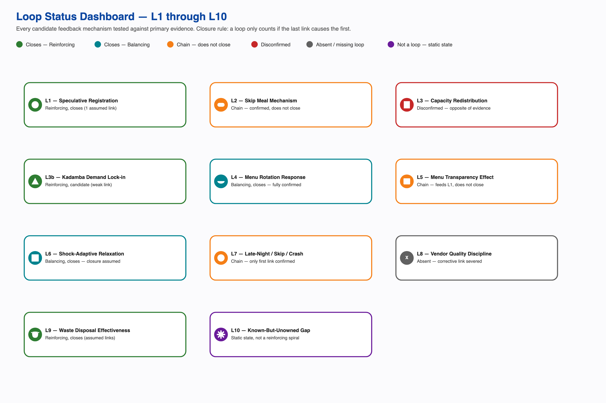
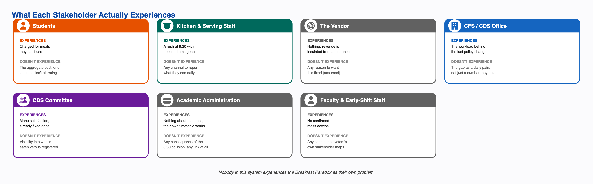

# Introduction

Phase 2 of this project covers three activities: building a System Map of the breakfast mess system, analyzing its causal loops and feedback mechanisms, identifying the systemic patterns and root causes behind the registration-attendance gap, and reframing the original operational question into a systemic problem statement with a matching design opportunity. This report condenses all five Phase 2 deliverables into one shorter document. The full version of each, with every table, every diagram, and every respondent quotation, is filed separately.

The core finding threading through all five documents: the institution has already run a working alternative to the current system, one where billing tracks who actually shows up rather than who registered, twice, successfully, and switched it off both times once the trigger passed. Everything else in this report explains why that fix isn't the standing default, and what would have to change for it to become one.

# 1. System Map

Students are the registrant, the billed party, and the one eating. Campus Facilities Services sits above Campus Dining Services, which runs four dining halls, Kadamba, Bakul, Palash, and Yuktahar, each a structurally different kitchen system with its own cuisine, capacity, and procurement setup. Catering is outsourced through open tender. Academic administration sets the class schedule and has no formal role in mess governance at all.

Registration happens monthly, four days ahead of service, and billing runs off how many people registered rather than who showed up. That four-day lock feeds the vendor's ordering, so nothing about a specific morning can change what gets bought, though same-week Skip Meal declarations can now adjust how much gets cooked. Breakfast turnout runs 35 to 45 percent, well below general items at roughly 70 percent and high-demand items above 90 percent.

Cutting the system by what a student can see versus what happens behind the scenes shows the line between the two is crossed only twice a month, once at registration and occasionally again through a rating. Every real decision, whether to go, what to eat, happens on the visible side with nothing from behind the scenes feeding back into it in real time.

Fourteen candidate feedback mechanisms were checked across this project. The clearest working one is menu governance: a complaint about a fixed semester-long menu reached the Student Council, then the Committee, and came back as a biweekly rotation, the cleanest closed loop found anywhere in this project. The registration-resale mechanism, students registering broadly and reselling what goes unused through an informal WhatsApp market called Mess Cell, plausibly reinforces itself, though the closing link is assumed rather than confirmed. Skip Meal was designed to stop the kitchen over-preparing for a known no-show. It works exactly as designed and almost nobody uses it, since it returns no money.

The single most important finding in the whole map: during an LPG shortage and separately during holidays like Felicity, the institution made registration non-compulsory. Students walked in, scanned a QR code, and were only billed for what they actually ate. It worked both times and was switched off both times once the trigger passed, with no sign anyone evaluated keeping any part of it standing. The most likely reason: a permanent walk-in model would remove the vendor's four-day lead-time guarantee, and the institution appears to value that certainty over demand accuracy as a default, not a case-by-case call.

# 2. Causal Loop and Feedback Analysis

A causal loop only exists if the last variable in a chain actually causes the first one. Eleven candidate mechanisms were tested against that rule using real interview transcripts and the CFS Chair's account. Three close with every link traced to its source. Three are real, evidenced chains that stop short of closing. Two describe a mechanism that is disconfirmed or structurally absent. One is a static condition, not a spiral.

The strongest closed loop is Menu Rotation Governance: every link traces to a single named account with no assumed step, proof this system's escalation structure can close a feedback loop end to end when a complaint is loud enough. The Speculative Registration and Resale loop plausibly reinforces itself too, but its closing link, that a lower net cost causes more registration, is assumed and actually runs against the project's strongest evidence on what drives registration, which points to securing a scarce slot rather than insuring against a wasted one. The Shock-Adaptive Registration Relaxation loop, the mechanism behind the LPG-shortage and holiday precedent, may be a genuine self-limiting loop or may simply be a calendar-triggered switch with no feedback dynamic at all; the evidence cannot currently tell those two apart, though the underlying fact that attendance-tracked billing already worked is not in question either way.

Two designed corrective mechanisms exist but don't connect back to the behavior they were built to fix. Skip Meal reaches the kitchen and works on that end, but nothing closes the loop back to whether a student uses it. Falling attendance was supposed to pressure the vendor on quality, but vendor revenue is tied to registration, not attendance, so that corrective link is severed by design, not just weak. And the known-but-unowned gap, the CFS Chair holding the exact turnout numbers with no channel to a policy conversation, is a stable, stuck condition, not a spiral getting worse over time.

Read together, this analysis supports organizational inertia around a known, previously-solved problem at least as strongly as it supports an actively self-reinforcing spiral. What the system demonstrably has is a capability to close feedback loops (menu governance) and a demonstrated precedent for the core fix (the shock-adaptive model). What it lacks is the one connection that would tie the registration-attendance gap itself to either.

# 3. Systemic Problem Analysis

Reading this system through the Iceberg Model, events at the surface, then patterns, then structures, then mental models, six chains were traced from a visible incident down to the belief holding it in place: ghost registration and resale, peak-hour run-outs, complaints ignored until a crisis forces a response, a working fix that gets shelved anyway, a menu-rotation win with a side effect its own architect flagged, and a real share of the gap that is not dysfunction at all, just legitimate variation in how people eat.

Three root causes recur across all six chains.

**Billing is decoupled from attendance.** This single rule explains the incentive to over-register, why Skip Meal goes unused, why a cancellation cap is even needed, and why an informal resale market exists to do what the formal system's own tool doesn't. It has been tested directly: when billing switched to tracking real attendance during the shortage and the holidays, the gap it explains closed.

**Decision rights are fragmented.** Menu, kitchen execution, the academic calendar, and billing policy each sit with a different owner, and none of them overlaps with any other. This is why the CFS Chair can state the exact size of the attendance gap and it still never reaches a conversation about registration or billing policy, and why a fix that already worked twice has never been evaluated for keeping any part of it.

**The system reacts to loud complaints, not quiet costs.** Menu fatigue was loud and got fixed cleanly through a real escalation path. The much larger, already-measured registration-billing gap is quiet, and has never entered that same process. Same office, same escalation design, two opposite outcomes, determined only by how loud the problem felt.

The sharpest tension underneath all of this: the institution has actually operated both sides of the procurement-certainty-versus-demand-accuracy trade-off, and picks certainty every time the exceptional trigger passes. A second real tension: publishing the menu two weeks ahead fixed fatigue and, by the same office's own account, gave students a way to plan their skipping, one policy producing both effects at once. A third: a single registration model applied uniformly folds intermittent fasting, regional eating habits, and religious observance into the same turnout number as an ordinary no-show, with nothing in the system able to tell the two apart.

# 4. Reframed Systemic Problem Statement

> The Breakfast Paradox is a stable equilibrium. The system holds the gap between registration and attendance in place because every actor's behavior inside it is individually reasonable, and every consequence it produces gets absorbed before it can become a signal.
>
> Billing fires at registration rather than at consumption. That single rule removes the cost of inaccuracy from the student and the revenue risk from the vendor at the same time, so neither party closest to the daily decision has a reason to want the number to be accurate. What follows gets quietly absorbed: the resale market takes the student's financial loss, composting and staff meals take the physical surplus, outside venues take the dissatisfaction, and informal workarounds take the cultural mismatch. Each of these is genuinely useful, and none should be removed. Together, they keep the gap from ever generating a signal loud enough to reach a system that only responds to complaint intensity, and whose decision rights are split across four actors, none of whom holds both the knowledge and the authority to act.
>
> No single actor feels this as their own problem. The student feels a charge. The kitchen feels a rush. The office holds a statistic. The vendor feels nothing. The paradox only exists in aggregate, and aggregate is the one thing this system has no way to see.

Five assumptions behind the original question don't survive contact with the evidence. Non-attendance isn't uniformly a problem, since a real share of it is legitimate dietary and cultural variation. Students aren't behaving carelessly, since every individual registration or resale decision is defensible on its own terms. The fix isn't unknown, since the institution has already run one twice. The gap isn't hidden, since the CFS Chair can state it from memory. And it isn't one problem, since it's at least three structural causes plus one thing that isn't a problem at all.

Nobody in this system experiences the Breakfast Paradox as their own problem. Each actor feels a smaller, different piece of it, and the aggregate, the only version of the problem that is actually large, is exactly what this system has no mechanism to see, own, or escalate. That is the center of the reframe, and it is also why the system holds steady instead of breaking: every consequence the gap produces gets absorbed by something that works well, competently and quietly, before it ever becomes a signal anyone has to answer for.

# 5. Design Opportunity Statement

> The opportunity is to give this system a way to notice its own cost. The Breakfast Paradox persists not because the fix is unknown, it has already been run twice, but because nothing in the system converts the cost of the gap into a signal that reaches anyone with the authority to act on it.

Three intervention points follow directly from the three root causes, at increasing depth.

**On information flow, the cheapest and most under-considered.** The escalation design routes feedback by how loud it is, never by what it costs. Adding a trigger that fires on measured cost, alongside the existing one for complaint volume, would have surfaced the CFS Chair's own turnout figures years ago. It is gated on one precondition: waste is not currently measured by volume at all.

**On decision rights.** No single actor owns the registration-attendance outcome end to end. The opportunity is a named owner accountable for it, not a new committee, since the escalation structures that already exist demonstrably work once something reaches them.

**On the billing rule itself, the deepest and the one that actually closes the gap.** The opportunity is a standing, partial version of the attendance-tracked model the institution has already proven twice, scoped to breakfast specifically, since it has the worst turnout and the least procurement volume at risk in a trial. This is gated on the one open question the whole project keeps returning to: whether the vendor's actual contract terms could absorb it. Nobody has asked directly.

Any intervention must respect what the evidence already rules out. Don't remove an absorption mechanism to manufacture a signal, since each one is genuinely useful and removing it would make real people worse off to create visibility the institution could measure directly instead. Don't treat full turnout as the success metric, since a real share of the gap is legitimate variation, not failure. Don't treat the 8:30 class start as a lever to pull, since it almost certainly solves a real problem of its own. And don't aim the fix at students, who hold the least power and the most defensible behavior in the entire system.

# What Carries Forward

The single most consequential open question across every Phase 2 document is the same one: whether the vendor's actual contract terms could support any standing or partial version of the attendance-tracked model, and if not, exactly which term rules it out. Nobody has asked this directly, and the answer determines whether Phase 3's deepest intervention point is an adoption problem or a renegotiation problem. Smaller open items carry forward too: why Skip Meal sits at near-zero usage despite working on the kitchen's end, whether faculty and early-shift staff have any real, uncounted access to breakfast, and a direct interview with the CDS Chair, the most senior authority in the dining chain, still not conducted.
