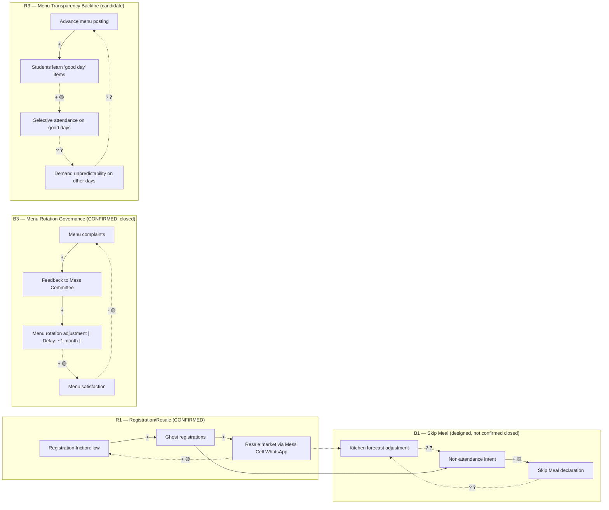

# Task 7 — Supporting Asset: Causal Loop Diagram (full loop templates + Mermaid source)

Six loops carry forward from Task 6 (`06-system-map.md`), where they were first built and evidence-tested.
Task 7 does not rebuild them — it re-verifies closure, re-checks polarity, and uses them as the mechanism
layer under the root-cause analysis. One loop (R1) is fully confirmed and closed; two (B1, B2) are
"designed but broken" balancing loops — the mechanism exists on paper but the evidence does not show it
closing in practice; one (R2) has only its first link confirmed and is carried as a labelled candidate;
B3 is the one loop in the whole project that is fully confirmed and closed end to end; R3 is a candidate
loop, self-identified by the CFS Chair, not yet corroborated on the student side.

A candidate under-provisioning chain from the existing (Neha's) Task 7 draft was tested for closure and
**rejected as a loop** — see "Rejected candidate" below.

## R1 — Registration/Resale Reinforcing Loop

- **TYPE:** Reinforcing (R)
- **VARIABLES:** Registration convenience/low friction (A) → Ghost registrations (registered, no intent to eat) (B) → Perceived slack in the system / resale market viability (C) → Tolerance for registering loosely (A)
- **CAUSAL LINKS:**
  - A → B: **+** (low friction to register raises ghost registrations) — Evidence: ST1, E1. ✅ CONFIRMED
  - B → C: **+** (more ghost registrations feed more resale supply via Mess Cell WhatsApp) — Evidence: E7, ST9. ✅ CONFIRMED
  - C → A: **+** (a visible resale safety net lowers the perceived cost of registering loosely, since a slot can be offloaded) — Evidence: inferred from ST9's existence; not a direct quote. 🟡 PLAUSIBLE
- **DESCRIPTION:** Because billing is decoupled from attendance (ST1) and cancellation is capped (ST2), students register loosely; the resulting unused slots have a release valve (Mess Cell resale) that removes the pressure to fix the registration behavior itself, which in turn makes loose registration feel lower-risk.
- **TRIGGER:** Any registration event under ST1/ST2.
- **WHAT IT EXPLAINS:** Why P1 (ghost registration) persists rather than self-correcting even though it is individually costly (₹48/meal not eaten).
- **DELAY:** Short (same registration cycle) for A→B; short-to-medium for B→C (WhatsApp coordination); longer, diffuse, and largely untested for C→A (a belief effect, not a transaction).
- **CONFIDENCE:** 🟡 PLAUSIBLE overall — two of three links confirmed, the closing link is inferred.
- **WHAT WOULD FALSIFY THIS LOOP:** Evidence that students who use the resale channel do NOT register more loosely afterward, or that resale volume is too small to plausibly feed back into registration norms at all.

## B1 — Skip Meal (Designed-but-Broken Balancing Loop)

- **TYPE:** Balancing (B), designed
- **VARIABLES:** Non-attendance intent (A) → Skip Meal declaration (B) → Adjusted kitchen forecast (C) → Reduced over-preparation (A, indirectly, via reduced registration friction next cycle)
- **CAUSAL LINKS:**
  - A → B: intended **+** (a student who won't attend is supposed to use Skip Meal) — Evidence: mechanism exists per Task 6 mapping. 🟡 PLAUSIBLE (mechanism confirmed to exist; uptake rate ❓ unknown)
  - B → C: intended **-** (Skip Meal declarations should reduce the forecast) — Evidence: ❓ UNKNOWN — no data in this evidence set shows Skip Meal data reaching kitchen forecasting distinctly from the T-4 aggregate (ST4)
  - C → A: not evidenced to close
- **DESCRIPTION:** As designed, this loop should balance ghost registration by giving students a low-friction way to signal non-attendance that the kitchen can act on. The evidence shows the declaration mechanism (B) exists but not that it demonstrably changes kitchen behavior (C) distinctly from the aggregate T-4 registration lock (ST3/ST4).
- **WHY IT'S CARRIED AS "DESIGNED BUT BROKEN" RATHER THAN REJECTED:** The mechanism's existence is confirmed by institutional design; what's missing is evidence of the closing links, not evidence that they're absent. This is a genuine gap (see `08_validation_gaps.md`), not a rejected loop.
- **CONFIDENCE:** ❓ UNKNOWN-REQUIRES VALIDATION for links B→C and C→A.
- **WHAT WOULD FALSIFY THIS LOOP AS FUNCTIONING:** Confirmation that Skip Meal data is never disaggregated from T-4 registration numbers before procurement — this would show the loop is open, not closed.

## B2 — Capacity Redistribution (Designed-but-Broken Balancing Loop)

- **TYPE:** Balancing (B), designed
- **VARIABLES:** Local mess overcrowding (A) → Walk-in/redistribution to another mess or Skip Meal (B) → Reduced local load (C) → Reduced overcrowding (A)
- **CAUSAL LINKS:** Mechanism referenced in Task 6 mapping as an intended pressure release; no primary-source evidence in this evidence set of students actually redistributing across messes in response to crowding, nor of a systemic mechanism enabling it (registration is mess-specific, per ST6/ST7's structural separation of Kadamba vs. Bakul/Palash kitchens).
- **CONFIDENCE:** ❓ UNKNOWN — carried forward from Task 6 as a named candidate, not independently re-confirmed here. Structurally, ST7 (different kitchens, different registration pools) makes this loop's B→C link questionable by design, not just by missing data.
- **WHAT WOULD FALSIFY:** Confirmation that registration is mess-locked with no cross-mess redistribution path — this would mean B2 does not close as designed and overcrowding has no balancing valve at all.

## R2 — Sleep/Energy Reinforcing Loop (Candidate — one link confirmed)

- **TYPE:** Reinforcing (R), candidate
- **VARIABLES:** Late-night workload/habit (A) → Late sleep (B) → Skipped breakfast (C) → Mid-morning energy dip (D) → back to A (via compensatory late-night patterns) — **this closing link is not evidenced**
- **CAUSAL LINKS:**
  - A → B: 🟡 PLAUSIBLE, supported qualitatively by S1's own listed skip reasons (late sleep among them)
  - B → C: ✅ CONFIRMED for S1 individually (self-reported reason); ❓ UNKNOWN for other respondents
  - C → D, D → A: ❓ UNKNOWN-REQUIRES VALIDATION — no evidence in this set links skipped breakfast to a measured energy dip, nor an energy dip back to late-night habits
- **STATUS:** Carried as a **named candidate only**, per Task 6's own labelling ("only first link confirmed"). Not promoted to the main CLD as a confirmed loop.
- **WHAT WOULD FALSIFY:** Evidence that students who skip breakfast report no different energy/workload pattern than those who don't.

## B3 — Menu Rotation Governance Loop (Fully Confirmed, Closed)

- **TYPE:** Balancing (B)
- **VARIABLES:** Low menu satisfaction/complaints (A) → Feedback reaching Mess Committee (B) → Menu rotation adjustment (~1-month cycle, with student input) (C) → Improved menu satisfaction (D) → Reduced complaint volume (A)
- **CAUSAL LINKS:**
  - A → B: **+** — Evidence: S5 §7 (feedback mechanism exists and is described as functioning). ✅ CONFIRMED
  - B → C: **+** — Evidence: S5 §3 (menu rotation precedent, ~1 month planning with student input). ✅ CONFIRMED
  - C → D: **+** — Evidence: inferred from the institutional purpose of the rotation process, consistent with S5's description. 🟡 PLAUSIBLE-PROVISIONAL (satisfaction itself not independently measured)
  - D → A: **-** (closing the loop; more satisfaction reduces complaint volume) — Evidence: standard balancing-loop logic, consistent with governance intent. 🟡 PLAUSIBLE-PROVISIONAL
- **DESCRIPTION:** This is the first loop in the whole project (per Task 6's own log) that is fully closed and traceable end to end through institutional process, not just individual anecdote. It explains why menu quality complaints have not been named as a dominant driver of breakfast-skipping in the student interviews — the balancing mechanism is functioning at the governance level, even while the registration/attendance loop (R1) is not.
- **DELAY:** Medium — roughly one planning cycle (~1 month).
- **CONFIDENCE:** ✅ CONFIRMED (mechanism and first two links); 🟡 PLAUSIBLE-PROVISIONAL on the closing satisfaction/complaint links.
- **WHAT WOULD FALSIFY:** Evidence that menu complaints are not decreasing despite rotation, or that student input is solicited but not actually incorporated.

## R3 — Menu Transparency Backfire Loop (Candidate, Self-Identified by CFS Chair)

- **TYPE:** Reinforcing (R), candidate
- **VARIABLES:** Advance menu posting (A) → Students learn which days have preferred items (B) → Selective attendance concentrated on "good" days (C) → Perceived unpredictability of demand on "other" days (D) → Pressure to further adjust menu posting/rotation practice (back toward A)
- **CAUSAL LINKS:**
  - A → B: ✅ CONFIRMED (advance posting is the described policy; the visibility to students follows directly)
  - B → C: 🟡 PLAUSIBLE — this is the CFS Chair's own self-identified risk (E8), not yet observed as actual student behavior in this evidence set
  - C → D, D → A: ❓ UNKNOWN-REQUIRES VALIDATION — no evidence yet of a measured demand-concentration effect or of a resulting policy adjustment
- **STATUS:** Named candidate only. High evidentiary value because it is self-identified by the policy owner, but not independently corroborated on the student side, so it is not promoted to a confirmed loop.
- **WHAT WOULD FALSIFY:** Attendance data showing no day-of-week or item-based concentration despite posted menus.

## Rejected Candidate — Under-Provisioning "Loop"

The existing (Neha's) Task 7 draft (S7) proposes a diagram (`diagram2-underprovisioning-loop.mmd`) of the
form: T-4 registration lock → under-provisioning risk → shortages at peak times → students queue or leave
without eating → (implicitly) lower future registration. Tested against the closure requirement: the final
step (lower future registration as a consequence of a bad experience) is **not evidenced anywhere in this
evidence set** — no respondent ties a past shortage experience to a subsequent registration change. Without
that closing link, this is a **linear causal chain, not a loop**, and is not included in the CLD as a loop.
It remains valid as a chain of events/consequences and is used that way in Section 8 (Unintended Consequences)
and Section 18 (Systemic Causal Chains) instead.

## Consolidated CLD — Mermaid Source (mandatory per spec; rendered visual uses the project's SVG toolkit
per house style, not this Mermaid rendering)

**Reading notes:** solid arrows with a plain `+`/`-` are ✅ confirmed links; dashed arrows with a 🟡 or ❓
marker are provisional or unvalidated links. Only R1 and B3 are shown as (mostly) solid because they are the
only two loops with more than one confirmed link. B2 and R2 are deliberately **omitted** from this consolidated
diagram (kept to their individual write-ups above only) because they do not yet clear the bar of "most
important validated/provisional loops" the spec sets for a readable 3-6-loop CLD — including them here would
add visual complexity without adding confirmed mechanism.
