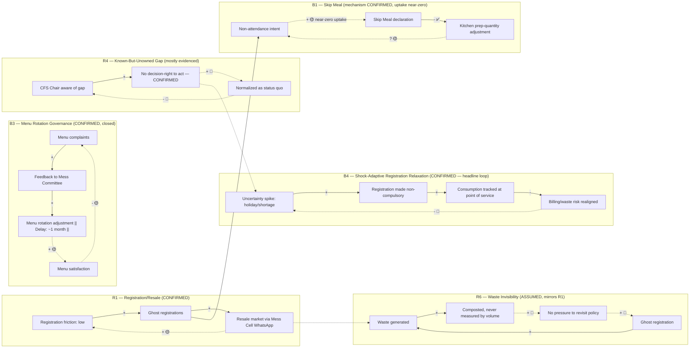

# Task 7 — Supporting Asset: Causal Loop Diagram (full loop templates + Mermaid source)

Six loops carry forward from Task 6 (`06-system-map.md`), where they were first built and evidence-tested.
Task 7 does not rebuild them — it re-verifies closure, re-checks polarity, and uses them as the mechanism
layer under the root-cause analysis. One loop (R1) is fully confirmed and closed; two (B1, B2) are
"designed but broken" balancing loops — the mechanism exists on paper but the evidence does not show it
closing in practice; one (R2) has only its first link confirmed and is carried as a labelled candidate;
B3 is the one loop in the whole project that is fully confirmed and closed end to end; R3 is a candidate
loop, self-identified by the CFS Chair, not yet corroborated on the student side.

A candidate under-provisioning chain from the existing (Neha's) Task 7 draft was tested for closure and
**rejected as a loop** — see "Rejected candidate" below.

## R1 — Registration/Resale Reinforcing Loop

- **TYPE:** Reinforcing (R)
- **VARIABLES:** Registration convenience/low friction (A) → Ghost registrations (registered, no intent to eat) (B) → Perceived slack in the system / resale market viability (C) → Tolerance for registering loosely (A)
- **CAUSAL LINKS:**
  - A → B: **+** (low friction to register raises ghost registrations) — Evidence: ST1, E1. ✅ CONFIRMED
  - B → C: **+** (more ghost registrations feed more resale supply via Mess Cell WhatsApp) — Evidence: E7, ST9. ✅ CONFIRMED
  - C → A: **+** (a visible resale safety net lowers the perceived cost of registering loosely, since a slot can be offloaded) — Evidence: inferred from ST9's existence; not a direct quote. 🟡 PLAUSIBLE
- **DESCRIPTION:** Because billing is decoupled from attendance (ST1) and cancellation is capped (ST2), students register loosely; the resulting unused slots have a release valve (Mess Cell resale) that removes the pressure to fix the registration behavior itself, which in turn makes loose registration feel lower-risk.
- **TRIGGER:** Any registration event under ST1/ST2.
- **WHAT IT EXPLAINS:** Why P1 (ghost registration) persists rather than self-correcting even though it is individually costly (₹48/meal not eaten).
- **DELAY:** Short (same registration cycle) for A→B; short-to-medium for B→C (WhatsApp coordination); longer, diffuse, and largely untested for C→A (a belief effect, not a transaction).
- **CONFIDENCE:** 🟡 PLAUSIBLE overall — two of three links confirmed, the closing link is inferred.
- **WHAT WOULD FALSIFY THIS LOOP:** Evidence that students who use the resale channel do NOT register more loosely afterward, or that resale volume is too small to plausibly feed back into registration norms at all.

## B1 — Skip Meal (Balancing Loop — CONFIRMED FUNCTIONING for prep-quantity, updated 2026-09-13)

- **TYPE:** Balancing (B), designed
- **VARIABLES:** Non-attendance intent (A) → Skip Meal declaration (B) → Adjusted kitchen prep-quantity forecast (C) → Reduced over-preparation (A, indirectly, via reduced registration friction next cycle)
- **CAUSAL LINKS:**
  - A → B: intended **+** (a student who won't attend is supposed to use Skip Meal) — Evidence: mechanism exists per Task 6 mapping. 🟡 PLAUSIBLE (mechanism confirmed to exist; uptake rate — what share of non-attending students actually use it rather than silently no-showing — ❓ still unknown)
  - B → C: **-** (Skip Meal declarations reduce the kitchen's prep-quantity forecast) — Evidence: E19, direct confirmation this session. ✅ CONFIRMED
  - C → A: closing link (lower over-preparation reduces the friction/waste that would otherwise erode trust in registering accurately) — 🟡 PLAUSIBLE, standard balancing-loop logic, not independently quoted
- **REFINED MODEL (two-stage pipeline, resolves an apparent contradiction with RC2):** procurement and
  prep-quantity are not the same decision. The **T-4 vendor lock (RC2/ST3)** governs *initial ingredient
  sourcing* — how much raw material the vendor is asked to bring — and remains locked 4 days out, unchanged
  by this update. **Kitchen prep-quantity** (how much of the sourced stock actually gets cooked/portioned
  for a given service) is a separate, later decision, and this is the stage Skip Meal data feeds into. This
  means the system has more real self-correction capacity than the original "broken loop" reading gave it
  credit for — it just operates one stage later than raw ingredient sourcing, which is exactly where a
  same-week signal like Skip Meal can still be useful.
- **DESCRIPTION:** A student who won't attend can declare Skip Meal; the kitchen uses this to trim
  prep-quantity for that service, reducing (but not eliminating, since sourcing was already locked at T-4)
  the waste from ghost registration.
- **CONFIDENCE:** ✅ CONFIRMED for B→C; 🟡 PLAUSIBLE for A→B (uptake) and C→A (closing link).
- **WHAT WOULD FURTHER STRENGTHEN THIS LOOP:** An actual Skip Meal usage rate, to know how much of the
  registration-attendance gap this loop is currently closing versus how much still passes through
  unsignaled.

## B2 — Capacity Redistribution (Designed-but-Broken Balancing Loop)

- **TYPE:** Balancing (B), designed
- **VARIABLES:** Local mess overcrowding (A) → Walk-in/redistribution to another mess or Skip Meal (B) → Reduced local load (C) → Reduced overcrowding (A)
- **CAUSAL LINKS:** Mechanism referenced in Task 6 mapping as an intended pressure release; no primary-source evidence in this evidence set of students actually redistributing across messes in response to crowding, nor of a systemic mechanism enabling it (registration is mess-specific, per ST6/ST7's structural separation of Kadamba vs. Bakul/Palash kitchens).
- **CONFIDENCE:** ❓ UNKNOWN — carried forward from Task 6 as a named candidate, not independently re-confirmed here. Structurally, ST7 (different kitchens, different registration pools) makes this loop's B→C link questionable by design, not just by missing data.
- **WHAT WOULD FALSIFY:** Confirmation that registration is mess-locked with no cross-mess redistribution path — this would mean B2 does not close as designed and overcrowding has no balancing valve at all.

## R2 — Sleep/Energy Reinforcing Loop (Candidate — one link confirmed)

- **TYPE:** Reinforcing (R), candidate
- **VARIABLES:** Late-night workload/habit (A) → Late sleep (B) → Skipped breakfast (C) → Mid-morning energy dip (D) → back to A (via compensatory late-night patterns) — **this closing link is not evidenced**
- **CAUSAL LINKS:**
  - A → B: 🟡 PLAUSIBLE, supported qualitatively by S1's own listed skip reasons (late sleep among them)
  - B → C: ✅ CONFIRMED for S1 individually (self-reported reason); ❓ UNKNOWN for other respondents
  - C → D, D → A: ❓ UNKNOWN-REQUIRES VALIDATION — no evidence in this set links skipped breakfast to a measured energy dip, nor an energy dip back to late-night habits
- **STATUS:** Carried as a **named candidate only**, per Task 6's own labelling ("only first link confirmed"). Not promoted to the main CLD as a confirmed loop.
- **WHAT WOULD FALSIFY:** Evidence that students who skip breakfast report no different energy/workload pattern than those who don't.

## B3 — Menu Rotation Governance Loop (Fully Confirmed, Closed)

- **TYPE:** Balancing (B)
- **VARIABLES:** Low menu satisfaction/complaints (A) → Feedback reaching Mess Committee (B) → Menu rotation adjustment (~1-month cycle, with student input) (C) → Improved menu satisfaction (D) → Reduced complaint volume (A)
- **CAUSAL LINKS:**
  - A → B: **+** — Evidence: S5 §7 (feedback mechanism exists and is described as functioning). ✅ CONFIRMED
  - B → C: **+** — Evidence: S5 §3 (menu rotation precedent, ~1 month planning with student input). ✅ CONFIRMED
  - C → D: **+** — Evidence: inferred from the institutional purpose of the rotation process, consistent with S5's description. 🟡 PLAUSIBLE-PROVISIONAL (satisfaction itself not independently measured)
  - D → A: **-** (closing the loop; more satisfaction reduces complaint volume) — Evidence: standard balancing-loop logic, consistent with governance intent. 🟡 PLAUSIBLE-PROVISIONAL
- **DESCRIPTION:** This is the first loop in the whole project (per Task 6's own log) that is fully closed and traceable end to end through institutional process, not just individual anecdote. It explains why menu quality complaints have not been named as a dominant driver of breakfast-skipping in the student interviews — the balancing mechanism is functioning at the governance level, even while the registration/attendance loop (R1) is not.
- **DELAY:** Medium — roughly one planning cycle (~1 month).
- **CONFIDENCE:** ✅ CONFIRMED (mechanism and first two links); 🟡 PLAUSIBLE-PROVISIONAL on the closing satisfaction/complaint links.
- **WHAT WOULD FALSIFY:** Evidence that menu complaints are not decreasing despite rotation, or that student input is solicited but not actually incorporated.

## R3 — Menu Transparency Backfire Loop (Candidate, Self-Identified by CFS Chair)

- **TYPE:** Reinforcing (R), candidate
- **VARIABLES:** Advance menu posting (A) → Students learn which days have preferred items (B) → Selective attendance concentrated on "good" days (C) → Perceived unpredictability of demand on "other" days (D) → Pressure to further adjust menu posting/rotation practice (back toward A)
- **CAUSAL LINKS:**
  - A → B: ✅ CONFIRMED (advance posting is the described policy; the visibility to students follows directly)
  - B → C: 🟡 PLAUSIBLE — this is the CFS Chair's own self-identified risk (E8), not yet observed as actual student behavior in this evidence set
  - C → D, D → A: ❓ UNKNOWN-REQUIRES VALIDATION — no evidence yet of a measured demand-concentration effect or of a resulting policy adjustment
- **STATUS:** Named candidate only. High evidentiary value because it is self-identified by the policy owner, but not independently corroborated on the student side, so it is not promoted to a confirmed loop.
- **WHAT WOULD FALSIFY:** Attendance data showing no day-of-week or item-based concentration despite posted menus.

## B4 — Shock-Adaptive Registration Relaxation (Balancing, condition-triggered, CONFIRMED) — headline finding, added 2026-09-13

- **TYPE:** Balancing (B), designed, condition-triggered rather than standing.
- **VARIABLES:** Expected-attendance uncertainty spike — holiday/fest/LPG-shortage (A) → registration made
  non-compulsory (walk-in QR scan, or 1-2 day advance registration at any mess, no auto-billing for
  non-registrants) (B) → actual consumption tracked directly at point of service instead of pre-committed
  intent (C) → billing/waste risk realigned with true demand (D) → reduced institutional appetite to keep the
  relaxed model once the acute uncertainty period ends (closes back toward A's normal, standing state).
- **CAUSAL LINKS:** A→B: **+**, ✅ CONFIRMED (direct user statement, 2026-09-13: this happened during LPG
  shortage and holidays/fests). B→C: **+**, ✅ CONFIRMED (the walk-in/QR model by construction ties billing to
  presence). C→D: **-**, ✅ CONFIRMED (less mismatch between billed and consumed meals under this model). D→A:
  🔷 ASSUMED closure — the return isn't to the same shock recurring, it's to the standing model resuming,
  which this document interprets as "institutional confidence that the relaxed model is a rare-condition tool,
  not a permanent one," not directly quoted.
- **DESCRIPTION:** During the same period, the cancellation cap was also raised from 5 to 10 per month as a
  workload/cost-relief measure (✅ CONFIRMED). This loop is condition-triggered, not standing — it exists,
  fires reliably under the right trigger, and retires once the trigger passes.
- **WHY THIS MATTERS MORE THAN ANY OTHER LOOP IN THIS PROJECT:** every other loop in this document either
  fails to close, closes weakly, or closes only within the standing model's existing constraints. This one
  proves the standing model's central constraint (billing decoupled from attendance) is not a technical
  necessity — the institution has already run the alternative and it worked. This reframes RC1 from "an
  unsolved problem" to "a proven fix, deliberately not standardized."
- **WHY IT ISN'T THE STANDING DEFAULT:** 🔷 ASSUMED — a walk-in/QR-at-point-of-service model, generalized to
  every day, would remove the T-4 vendor lock's lead-time guarantee entirely. The institution likely accepts
  a known, aggregate-forecastable attendance gap under the compulsory model in exchange for procurement
  certainty, rather than accept fully unpredictable day-of demand every day, which the vendor's lead-time
  contract may not support as a permanent condition.
- **CONFIDENCE:** ✅ CONFIRMED (A, B, C, D as historical fact); 🔷 ASSUMED (why it reverts, and whether a
  partial/permanent version could work — see `08_validation_gaps.md`).
- **WHAT WOULD FALSIFY THE "PROCUREMENT CERTAINTY TRADE-OFF" EXPLANATION:** Evidence that the vendor contract
  could, in fact, absorb permanent day-of demand variability without a lead-time guarantee — this would mean
  the standing model persists for a different, currently unidentified reason (e.g. simple inertia, or RC3's
  unowned-gap dynamic alone, without a genuine vendor-side constraint behind it).

## R4 — Known-But-Unowned-Gap Reinforcement (Reinforcing) — 🟡 mostly evidenced, added 2026-09-13

- **TYPE:** Reinforcing (R), a governance-attention loop, not a food-flow loop.
- **VARIABLES:** CFS Chair's awareness of the turnout gap (A) → no assigned decision-right to act on it,
  because registration/billing policy ownership is fragmented (B) → the gap never reaches any specific
  actor's agenda (C) → the gap becomes normalized as "how the system has always worked" (D) → reduced
  perceived urgency to raise it again next cycle (closing back to A, at progressively lower salience).
- **CAUSAL LINKS:** A→B: ✅ CONFIRMED (awareness exists; fragmentation confirmed in Task 7's root-cause
  analysis). B→C: ✅ CONFIRMED this session (the user directly confirmed the gap has never reached policy
  discussion). C→D, D→A: 🔷 ASSUMED — a reasonable systems-thinking inference about how unaddressed known
  problems lose urgency over time, not directly evidenced.
- **CONFIDENCE:** 🟡 PLAUSIBLE overall, stronger than before this session's confirmation of B→C.
- **WHAT WOULD FALSIFY:** Evidence that the gap is, in fact, discussed regularly but no action is taken for
  an unrelated reason (e.g. active, ongoing evaluation) — this would mean the loop's normalization mechanism
  isn't what's sustaining inaction.

## B5 — Silo Success Masking Systemic Gap (local balance, system-level reinforcing effect) — 🟡 PLAUSIBLE, added 2026-09-13

- **TYPE:** Counter-intuitive — a genuine balancing loop at the menu-governance level (B3) that produces a
  reinforcing effect at the whole-system level by reducing scrutiny elsewhere.
- **VARIABLES:** Menu complaints (A) → Mess Committee acts via B3, confirmed closed (B) → menu satisfaction
  improves (C) → CDS/CFS's overall "is the system working?" assessment improves, since the most visibly
  complained-about channel shows continuous improvement (D) → reduced institutional appetite to audit other,
  quieter parts of the system like registration/billing (closing back to fewer complaints being generated
  there, though not because the underlying problem improved — because it doesn't generate complaints of the
  same visible kind).
- **CAUSAL LINKS:** A→B→C: ✅ CONFIRMED (this is loop B3, already fully closed). C→D: 🟡 PLAUSIBLE — a
  reasonable inference about how institutional attention allocates, not directly quoted. D→A (the closing
  link, reframed as "less scrutiny elsewhere"): 🟡 PLAUSIBLE.
- **MECHANISM:** ghost registration doesn't cost the registering student any visible, in-the-moment
  discomfort — it costs them money quietly, on a monthly bill — so it never generates the complaint volume
  that would trigger the same escalation pathway that fixed the menu.
- **CONFIDENCE:** 🟡 PLAUSIBLE — a systems-thinking inference explaining why a known, quantified problem
  doesn't generate the same institutional pressure as an unquantified but loudly complained-about one.
- **WHAT WOULD FALSIFY:** Evidence that CDS/CFS actively monitors the registration-attendance gap alongside
  menu complaints as an equally weighted governance metric — this would mean visibility, not complaint
  volume, drives institutional attention, undermining this loop's mechanism.

## R5 — Vendor Margin/Quality Trade-off (Reinforcing) — 🔷 ASSUMED, added 2026-09-13, the supply-side mirror of R1

- **TYPE:** Reinforcing (R).
- **VARIABLES:** Fixed or thin per-meal vendor contract margin (A) → vendor substitutes cheaper ingredients
  or reduces variety to protect margin (B) → student-perceived quality drops (C) → attendance drops further
  for that meal category (D) → registered-but-unused meals rise, but billing (and plausibly vendor revenue,
  if tied to registered volume rather than attendance) is unaffected (E) → no market pressure on the vendor
  to fix quality, since decoupled billing insulates vendor revenue from attendance too (closing back to A:
  margin stays protected regardless of quality choices).
- **CAUSAL LINKS:** All links 🔷 ASSUMED — this loop is not directly evidenced by any interview, but is
  tightly consistent with confirmed billing mechanics (RC1) and vendor contract structure (open-tender
  outsourced catering).
- **WHY THIS MATTERS:** it reframes RC1 as symmetrical — decoupled billing doesn't just remove the student's
  incentive to attend accurately, it may also remove the vendor's incentive to maintain quality, because
  vendor payment likely tracks registered volume or a fixed contract sum rather than plates actually served
  and enjoyed.
- **CONFIDENCE:** 🔷 ASSUMED throughout.
- **WHAT WOULD FALSIFY:** Confirmation that vendor payment is tied to a measure of actual consumption or
  satisfaction, not registered volume — this would remove the vendor-side insulation this loop depends on.

## R6 — Waste Invisibility (Reinforcing) — 🔷 ASSUMED, added 2026-09-13, the supply-side mirror of R1 in the waste domain

- **TYPE:** Reinforcing (R).
- **VARIABLES:** Ghost registration (A) → food waste generated (B) → waste efficiently composted and
  disposed of, tracked only categorically, never by volume (C) → no visible cost or regulatory pressure
  accrues, since the FSSAI-compliant disposal process removes any visible problem (D) → no forcing function
  to revisit registration or billing policy (E) → ghost registration continues unchallenged (closing back to
  A, more waste generated next cycle).
- **CAUSAL LINKS:** A→B: ✅ CONFIRMED (ghost registration produces surplus food, structurally). B→C: ✅
  CONFIRMED (compost/lab-sampling mechanism exists). C→D→E→A: 🔷 ASSUMED — the mechanism is a direct
  structural parallel to R1 (Shifting the Burden), not independently quoted.
- **WHY THIS MATTERS:** waste management and the informal resale market (R1) are the *same archetype* twice —
  both well-functioning symptomatic fixes that quietly remove the visible cost that would otherwise force a
  demand-planning or billing fix. Together they explain why almost nothing about the scale of ghost
  registration ever becomes visible enough, on either the demand or the supply side, to force a structural
  conversation.
- **CONFIDENCE:** ✅ CONFIRMED (A, B); 🔷 ASSUMED (C through E).
- **WHAT WOULD FALSIFY:** A waste-volume measurement program already existing and already feeding into
  registration-policy discussions — this would mean the visibility gap this loop depends on doesn't actually
  exist.

## B6 — Facilities-Friction Underinvestment — 🔷 ASSUMED, added 2026-09-13

- **TYPE:** A balancing mechanism at the investment-decision level that produces a reinforcing effect at the
  system level.
- **VARIABLES:** Poor physical conditions at a given mess — untidiness, insects, weak water pressure (A) →
  students who have a choice avoid that mess or meal (B) → lower recorded attendance there (C) → attendance
  data used, explicitly or implicitly, to justify facilities investment priority (D) → the low-attendance
  mess receives lower investment priority (E) → conditions stay poor or worsen (closing back to A).
- **CAUSAL LINKS:** All 🔷 ASSUMED, grounded in Bakul's independently reported untidiness (this session) as
  a concrete instance.
- **WHY THIS MATTERS:** explains why a facilities gap, once open, tends to persist rather than self-correct —
  the very attendance data that should trigger a facilities fix is degraded by the facilities problem itself.
- **CONFIDENCE:** 🔷 ASSUMED throughout.
- **WHAT WOULD FALSIFY:** Evidence that facilities investment decisions are made independent of attendance
  data (e.g. on a fixed rotation or equal-per-mess basis) — this would break the D→E link this loop depends
  on.

## R7 — Late-Night Eating / Breakfast Skipping (Reinforcing, candidate) — added 2026-09-13

- **TYPE:** Reinforcing (R), candidate.
- **VARIABLES:** Late-night academic workload (A) → late-night eating or outside ordering (B) → suppressed
  morning hunger (C) → skipped breakfast (D) → [candidate closing link: lower daytime energy (E) → more
  reliance on late-night catch-up work, back to A].
- **CAUSAL LINKS:** A→B→C→D: 🟡 PLAUSIBLE-PROVISIONAL — consistent with existing evidence (late sleep and
  social-pull-to-lunch are already self-reported skip reasons for one respondent) and standard physiological
  reasoning about late-night eating suppressing next-morning hunger. D→E→A (the closing link): ❓
  UNKNOWN/ASSUMED — not evidenced anywhere in this project's interviews.
- **DISTINCT FROM EXAM-PERIOD SKIPPING:** exam-driven breakfast-skipping (deliberately trading a meal for
  study time) is a separate, bounded, rational trade-off — better modeled as a seasonal amplitude modifier on
  the existing gap than as part of this loop.
- **CONFIDENCE:** 🟡 for the first three links; ❓ for closure.
- **WHAT WOULD FALSIFY:** Evidence that skipped-breakfast students report no different energy or late-night
  work pattern than students who eat breakfast.

## Open Chain (Not a Loop) — Canine Concentration Near Mess Entrances — 🔷 ASSUMED, added 2026-09-13

Food waste availability near a mess → dogs (fed informally, plausibly via the Canine Council) congregate
there → congregation sustained by continued scrap access → some students, particularly those uneasy around
dogs, route around that entrance/path at low-light early-morning hours → marginally lower early-morning foot
traffic near that mess specifically. Whether this closes back into more waste (e.g. via reduced attendance
lowering registered-but-unused meals, which is the opposite direction from what would sustain the chain) is
unclear — held explicitly as an open chain, not asserted as a closed loop. Entirely 🔷 ASSUMED and speculative;
included because it is a legitimate, novel systems-thinking hypothesis specific to breakfast timing (dogs
fed on a leftover cycle plausibly correlated with the prior day's or early-morning service), not because it
is evidenced.

## Rejected Candidate — Under-Provisioning "Loop"

The existing (Neha's) Task 7 draft (S7) proposes a diagram (`diagram2-underprovisioning-loop.mmd`) of the
form: T-4 registration lock → under-provisioning risk → shortages at peak times → students queue or leave
without eating → (implicitly) lower future registration. Tested against the closure requirement: the final
step (lower future registration as a consequence of a bad experience) is **not evidenced anywhere in this
evidence set** — no respondent ties a past shortage experience to a subsequent registration change. Without
that closing link, this is a **linear causal chain, not a loop**, and is not included in the CLD as a loop.
It remains valid as a chain of events/consequences and is used that way in Section 8 (Unintended Consequences)
and Section 18 (Systemic Causal Chains) instead.

## Consolidated CLD — Mermaid Source (mandatory per spec; rendered visual uses the project's SVG toolkit
per house style, not this Mermaid rendering)

**Reading notes:** solid arrows with a plain `+`/`-` are ✅ confirmed links; dashed arrows with a 🟡, ❓, or 🔷
marker are provisional, unvalidated, or assumed links. This consolidated diagram carries five loops (B4, R1,
R6, B3, R4) plus B1 — six total, at the upper end of the spec's "3-6 major loops unless evidence strongly
justifies more" guidance, justified here because this pass's evidence base genuinely grew (B4's confirmation,
R6's structural parallel to R1, R4's upgrade to mostly-evidenced). B2, R2, R3, R5, B5, B6, R7, and the canine
chain are deliberately **omitted** from this consolidated diagram — each is fully written up above, but
including all fourteen here would produce an unreadable diagram without adding confirmed mechanism beyond
what the six shown already carry.
