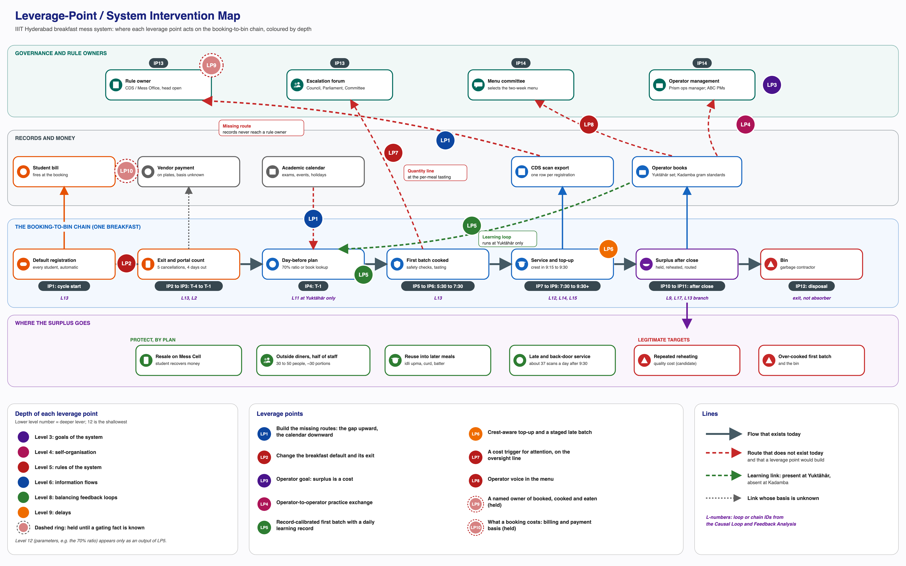

# Overview

Activity 9 identifies where and how the breakfast mess system could be changed. It produces two of the five Phase 3 and 4 deliverables: Deliverable 1, the Leverage-Point / System Intervention Map, and Deliverable 2, the Design Principles. The document follows the activity's four methods in order: identify leverage points; explore changes to rules, roles, incentives, information flows and processes; develop design principles; and identify potential intervention points. Within the first method, the loops are read as system archetypes before the leverage points are ranked, because each archetype has a known way out and a known trap. The map itself comes after the intervention points, because it places every leverage point and every intervention point on one picture of the system.

The starting point is the reframe from Phase 2. The Breakfast Paradox is a stable equilibrium, not a broken system. Three structures hold it in place. Registration is an automatic standing default with a narrow exit: five cancellations per meal type per month, each made at least four days ahead, and no way to nullify the charge beyond those (confirmed). Billing fires at that booking rather than at consumption (confirmed). And the gap is measured but unrouted: the CDS scan record and the operators' own books both measure it, and neither reaches whoever sets registration, billing or menu rules (confirmed). Beneath the kitchen half sits one intermediate mechanism, the conversion of registrations into a cooked first batch: Kadamba cooks a fixed 70 percent of registrations (single-sourced), Bakul (Vijayalakshmi Caterers) cooks 70 to 80 percent by item, set each week from its manager's judgement of past attendance and never below about 70 percent even on low weekends (single-sourced), Yuktāhār plans from its own books, and every kitchen can top up but never shrink a batch once it is cooked. Every consequence is absorbed before it becomes a signal, by resale, top-ups, reuse, the meals of outside diners and staff, late service, holding and reheating, and the bin. Each actor in this picture is responding rationally to the incentives and information it has; the outcome nobody wants is produced by how those responses are connected.

The design opportunity that follows is to give the system a way to notice its own cost: not to start measuring, but to build the missing routes from records that already exist, to the kitchen decision that fixes the first batch and upward to the rules, and to test the beliefs that keep the working goal fixed on the registration count. This document turns that opportunity into twelve leverage points, seven design principles and fourteen intervention points, and places them on one map.

Claims carry the project's confidence vocabulary. Confirmed means read off a record (the Kadamba April 2026 breakfast scan export, the photographed Yuktāhār registers) or seen on site. Single-sourced means one account; the Kadamba operator's figures are first-hand, so the numbers themselves are not in doubt, but they remain the operator's own account of its practice. The Bakul manager's figures come from a team member's synthesis of his interview and are single-sourced in the same way; there are no Bakul records of any kind. An earlier version of this document grouped Bakul's kitchen with Kadamba as a fixed ratio; that is revised throughout. Candidate means an inference that combines sources, including arithmetic on those figures. Assumed means a systems judgment offered without direct evidence. Loop and chain IDs (L1 to L17 and L3b) and their verdicts are those of the Causal Loop and Feedback Analysis. Nothing in this document is a simulation; the effects of each lever are tested in Activity 10.

# Identify Leverage Points

## How Each Leverage Point Is Judged

Each leverage point is placed on the twelve-place leverage scale, counted from the deepest: place 1 is the power to transcend paradigms and place 12 is constants, parameters and numbers. Some presentations number the same scale the other way round, with parameters as level 1, so the category name is what matters, and every label below names it.

The places used are place 2 (mindset or paradigm), place 3 (goals of the system), place 4 (self-organisation), place 5 (rules of the system), place 6 (structure of information flows), place 8 (strength of balancing feedback loops), place 10 (structure of material stocks and flows), place 11 (sizes of buffers) and place 12 (parameters). Three conventions keep the labels honest. Place 5 is used only where a rule itself changes: the default and its exit, who decides, what a booking costs, and the standing rule that keeps another lever in place once it is built. Place 9 (delays) is reserved for flattening the closing crest itself, which no lever here attempts. Places 11 and 12 appear only as settings inside a deeper lever, never as levers on their own: lowering Kadamba's 70 percent ratio by decree would move the cost from surplus into run-outs at the closing crest, and the cancellation cap, raised from five to ten during a gas shortage and now back at five (single-sourced), only changes how many exits the default allows, not the default itself.

For each leverage point the entries below state what it acts on, its place, the kind of lever it is, the evidence and its confidence, who holds the power to pull it, who experiences it and whether it is desirable to them, how feasible it is, and an absorber check. The absorber check asks one question: does the lever work by removing a mechanism that currently protects someone (resale on Mess Cell, reuse of leftovers, the meals of 30 to 50 outside diners and about half of Kadamba's own staff, the walk-in buffer, late and back-door service, outside venues, informal accommodation)? A lever that does is ruled out. The over-cooked first batch, repeated holding and reheating, and the bin protect no one, so reducing them is a legitimate target.

Feasibility is judged for what a student team can actually do. High means the team can prototype or pilot the lever with an actor who has already engaged. Medium means the team can build an evidenced proposal and put it into an existing forum. Low means the team can only propose it, because the lever holder has not been reached or the lever is gated on an unknown fact. A student team proposes, pilots and evidences; it cannot enact an institutional rule.

## LP1: Build the Missing Routes

| Attribute | Entry |
|---|---|
| Acts on | The measured-but-unrouted gap (L10), the absent upward link that would let L13 close, the burden shift that keeps the gap invisible (L17), and the informal calendar channel into the kitchen |
| Place | Place 6 of 12 (structure of information flows) |
| Lever type | Information flow |
| Evidence | Kadamba breakfast in April 2026: 32,162 registrations, 37.1 percent eaten (confirmed). Yuktāhār breakfast in September 2026: 17.7 to 40.2 percent against lunch at 56 to 89 percent (confirmed). The CDS export holds one row per registration with a scan time (confirmed). No route from any record to any rule owner has been found (confirmed as an absence). Exams and events reach the Yuktāhār kitchen only if someone raises them in the planning meeting (confirmed). Yuktāhār's two books disagree on 3 September breakfast, 77 eaten against 110 (confirmed). At Bakul the only measurement is the manager's weekly review of past attendance, and whether any of it is written down is not known (single-sourced) |
| Power | CDS holds the scan data; operators hold their books. The receiver cannot yet be named, because two different people are on record as head of CDS. The academic calendar is held by the academic administration, which has no relationship with mess governance |
| Who experiences it | The CDS staff member who compiles the view each week, and operator staff who fill the sheets it reads from: for both it is new work, desirable only if it is short and can never be used against them. The student sees it only through the bill line described below |
| Feasibility | High for a prototype, which can be built now from the April export and Yuktāhār's photographed registers. Medium for delivery until a receiver is named |
| Absorber check | Removes nothing. It reads the cost from records instead of manufacturing pain |

The change is a standing breakfast view, per hall, per weekday and per line (vegetarian and non-vegetarian), of booked, cooked, eaten and left over, sent to the registration rule owner and back to the operators, with one agreed definition of "ate". In this document that view is called the ledger. The same lever carries the downward route: a weekly note of exams, events and holidays into the day-before planning meeting. Two conditions travel with it. The view must accept paper input, because Yuktāhār keeps its records on paper and digitises later after dropping a commercial ERP system (single-sourced). And it must be explicitly blame-free: no figure it carries can become grounds for deductions against the staff who record it. Every governance lever in this document needs this input, which is why it is the enabling lever.

A student-facing variant is a monthly line on each student's bill showing how many breakfasts were paid for and not eaten. It is information, not exhortation: it states a number and asks nothing. It is conditional on LP2 existing, because a signal with no way to respond to it does nothing except add to the sense that the charge cannot be avoided.

## LP2: Change the Breakfast Default and Its Exit

| Attribute | Entry |
|---|---|
| Acts on | Registration as an automatic standing default, the booking end of L13, and the four-day information delay between a student's decision and the count |
| Place | Place 5 of 12 (rules of the system); the shorter lead also shortens an information delay |
| Lever type | Rule (the default and the exit) |
| Evidence | Registrations flat at about 1,070 a day on every weekday while turnout ranges from 42.1 percent (Tuesday) to 27.3 percent (Sunday) (confirmed). Only dry goods are bought more than four days ahead at Kadamba; perishables are bought the day before and some vegetables two to three days ahead (single-sourced). Yuktāhār takes milk daily and vegetables two or three times a week (confirmed). Lunch runs under the same booking at 56 to 89 percent (confirmed), so a change can be scoped to breakfast. The Kadamba team challenged the four-day cut-off and also calls last-minute registrations a pain (single-sourced) |
| Power | The owner of the registration rule and the portal: the Mess Office or the CDS team, whose relationship is unconfirmed. A student and operator coalition for a shorter lead is the first evidenced shared interest (candidate) |
| Who experiences it | The student deciding the evening before, and the student at 9:25 who either finds food or does not. Desirable if a skip is one step and costs nothing else; it adds a decision the current default spares them. The supervisor reads a lower count |
| Feasibility | Medium. The case can be built from records, the procurement tiers and operator statements; implementation sits with the rule owner |
| Absorber check | Removes nothing. Resale volume may fall because fewer unwanted bookings exist; that is a need disappearing, not an absorber removed |

The lever is what the default is and how a student leaves it, not how many cancellations the cap allows. The candidate changes, from lighter to heavier, are:

- a shorter breakfast cancellation lead, from four days to one or two;
- an evening-before confirm or skip that lowers the count the kitchen reads, while the default stays on;
- opt-in breakfast on the lowest-turnout day, with Sunday as the natural first slice;
- no automatic registration while a student is off campus.

This lever acts on the kitchen at Kadamba only if it lowers the count the operator reads the day before. Kadamba cooks a fixed share of registrations, so a lower count flows straight into a smaller first batch with no kitchen change at all. Whether a Skip Meal declaration already lowers that count is an open conflict: one finding says Skip Meal reaches the kitchen, while the Kadamba operator says it cooks on registrations only. Any version of this lever must therefore be specified as a change to the count the kitchen reads.

One condition protects students. A skip or a cancellation must never cost a student their place at a hall. At Kadamba, a respondent registers for the whole month because the hall is hard to get and fills up (the first links of L3b, reinforcing, candidate); if skipping breakfast put the slot at risk, students would keep every booking to hold their place and the new exit would go unused. If operators are paid on registered plates, a smaller booking also lowers vendor revenue, which shapes how the proposal will be received. The plate basis is unconfirmed for every operator: the Bakul manager says his operator is paid on plates served, while Kadamba's remark points to registrations (both single-sourced). If Bakul's account holds, a smaller booking would not cut its revenue, so its rational position on this lever is likely neutral or favourable (candidate); the Kadamba reading stands as before.

## LP3: Operator Goal: Surplus Is a Cost

| Attribute | Entry |
|---|---|
| Acts on | Operator purpose, the goal inside L11, the vendor route of L8 through cost rather than revenue, and L17 (an operator that treats the count as its obligation has no reason to signal upstream) |
| Place | Two parts at two depths. The operator's purpose, from "cook for every booking" to "feed whoever comes, at least cost", is place 3 of 12 (goals of the system) for the operator subsystem. The numeric waste target is the goal of the L11 balancing loop, place 8 of 12 (strength of balancing feedback loops) |
| Lever type | Goal, carried by information and practice |
| Evidence | Yuktāhār states its goals as quality, less waste, lower operating cost, standardisation and higher profit (single-sourced). Kadamba cooks on registrations "because it is a responsibility and they are getting paid for it" (single-sourced). Bakul's manager states a third purpose as his rule: "There should not be a shortage of food, even if some wastage occurs" (single-sourced); a run-out routes a complaint up to the firm's managing director while a surplus is silent, so the rule reads as the kitchen-level form of a system that reacts to what is loud (candidate). The operators work under the same registration and billing rules and state different purposes; whether the purpose explains the difference in practice is candidate, because the halls also differ in scale, menu, firm and measurement (see the natural comparison below) |
| Power | Prism management above the Kadamba site (the operations manager and above), not yet interviewed; ABC Hospitality Services at Yuktāhār already holds this goal; at Bakul the manager, who sets the batch, and the firm's management above him. The institution holds it indirectly through the contract |
| Who experiences it | The Kadamba supervisor, who would be asked to treat leftover food as a loss rather than as proof of a job done, and the operations manager who sets the target; the Bakul manager, for whom a shortage is the failure to avoid. Desirable to the firm if lower food cost is kept; less desirable to a supervisor or manager for whom a run-out is the only failure anyone notices |
| Feasibility | Low to medium. A student team cannot set a vendor's goals, but it can put a cost figure per line, built from records, and the Yuktāhār case in front of Prism's operations manager |
| Absorber check | Removes nothing by itself; it carries the absorber allowance set out in LP5 |

The change is to make surplus a visible cost inside the operator, with a wastage board, a waste target, and a purpose that the operations manager states and the supervisor applies. The target must be anchored outside the hall's own recent past: to the hall's best recorded performance, to Yuktāhār's recorded rate, or to the institution's stated goal of minimising food wastage. A target set from last month's average drifts downward with performance whenever a bad month is accepted as normal. The target is a learning signal for the kitchen, never grounds for reward or penalty (P7). It never asks a kitchen to trade a shortage for less waste: at Bakul, whose stated goal ranks shortage first, "surplus is a cost" can hold only as surplus cut with no rise in run-outs, which is also the only form that operator is likely to accept (candidate).

The cost argument has limits that must be stated. If operators are paid on registered plates, cutting surplus lowers food cost while revenue holds, which favours the lever. But two responses would turn it against the purpose: the institution may renegotiate the plate rate once lower cost is visible, which removes the operator's gain, and the cheapest way for any operator to cut the cost of surplus is smaller portions or lower quality rather than a better-sized batch. That is why the waste target is always paired with grams served per plate, taste and run-outs (P7). Without this lever, a better input to Kadamba's first batch (LP5) is an input nobody asked for.

## LP4: A Standing Operator Forum That Runs Its Own Trials

| Attribute | Entry |
|---|---|
| Acts on | The lateral information break between operators, the absence of L11 at Kadamba, and the uneven strength of balancing loops across kitchens |
| Place | Place 4 of 12 (self-organisation), specified as a standing forum empowered to run different trials per hall with the ledger as the selection mechanism. The exchange of books alone, without the forum and the selection mechanism, would be place 6 (information flows) |
| Lever type | Role (a convenor) and process (trials), carried by information |
| Evidence | Three operators already run three different planning logics: Yuktāhār plans from a matching-week lookup and a weekday register, Kadamba cooks a fixed 70 percent, and Bakul (Vijayalakshmi Caterers) sets 70 to 80 percent by item from a weekly review of past attendance, never below about 70 percent, and tops up by phoning the Hafizpet kitchen (single-sourced; Yuktāhār's books confirmed). An earlier version described Bakul as a fixed ratio with a 30-minute top-up; that reading is revised. Operators hold local power over quantities and need no rule change to vary them (single-sourced). Yuktāhār's books are photographed and in hand: the Wastage Book with run-out time, the weekday attendance register, the wastage board, the grocery issue book and the two-book reconciliation (confirmed). Waste fell between August and December after weighing was made blame-free (single-sourced, self-report, no before-and-after figures). Kadamba keeps per-dish gram standards but no learning record (single-sourced). The Bakul operator believes Kadamba fills 90 to 95 percent; the records say 37 percent at breakfast (confirmed) |
| Power | The operators themselves. Nobody convenes them today; CDS is the natural convenor and Yuktāhār's two project managers the natural hosts |
| Who experiences it | Yuktāhār's project managers, who give time to host; the Kadamba supervisor, who is asked to try a different way of setting a batch. Desirable if it is peer exchange among cooks; undesirable if it feels like an inspection by a rival firm |
| Feasibility | Medium. No rule change is needed, and the template already exists |
| Absorber check | Removes nothing |

The evidence supports place 4. The variety that self-organisation needs already exists, because each kitchen has worked out its own planning logic; what is missing is a place where the variants meet and a shared record that shows which works better for which hall. The change is a standing forum of operators, convened by CDS and meeting on a fixed cycle, in which each hall chooses and runs its own trial (a record-calibrated veg batch, a staged late batch, a run-out-time re-cook rule) and the ledger shows the result per hall and per line. The forum, not the institution, decides what each hall keeps. What transfers between halls is not only the books but their preconditions: blame-free weighing, a daily discussion, peer cross-checking and a purpose that treats waste as cost (LP3). Kadamba's layered chain, from operations manager to manager to supervisor to service staff, raises the risk that a recorded number becomes a reprimand, a risk Yuktāhār's flat team avoids. Kadamba's gram standards give a trial something concrete to plug into.

## LP5: Record-Calibrated First Batch with a Daily Learning Record

| Attribute | Entry |
|---|---|
| Acts on | The conversion step, the kitchen half of L13, and L11, which closes at Yuktāhār, runs as a candidate instance bounded by a floor at Bakul, and is absent at Kadamba |
| Place | Three parts at different depths. Creating the learning link where it is absent (Kadamba) is a new information link, place 6 of 12 (information flows). Calibrating the strength of the link where it runs (Yuktāhār, and Bakul's informal weekly review) is place 8 of 12 (balancing feedback loops); at Bakul the lever strengthens a calibration that already exists rather than creating one. The outside-diner cover, the float and the raw reserve are buffers and parameters, places 11 and 12. The ratio itself becomes a place 12 output, not the lever |
| Lever type | Information flow into process |
| Evidence | Kadamba cooks 70 percent of registrations, veg and non-veg planned separately, with a gram standard per dish (single-sourced). Biryani lunch is cooked at 100 percent (single-sourced), so the ratio follows the operator's expectation per meal, not a record. April turnout was 32.4 percent veg and 48.5 percent non-veg (confirmed). On those figures a 70 percent batch is about 2.2 times what was eaten on the veg line and about 1.4 times on the non-veg line (candidate arithmetic). Yuktāhār's site head believes breakfast turnout is up to about 50 percent while his register shows about 28 (confirmed). Bakul cooks 70 to 80 percent of registrations, the share varying by item, set each week from the manager's reading of past attendance, and keeps food for about 70 percent even on weekends he calls very low, against a breakfast turnout he puts at most at about 60 percent (single-sourced; no Bakul records). Every kitchen already plans by item in some form, so a calibration that works per item rather than per head is a hypothesis to test, not a finding |
| Power | The operator. At Kadamba it runs through Prism's chain, and the supervisor calls quantities during service, so the rule must be one the supervisor can read and apply live, on paper. At Yuktāhār it sits with the daily meeting. At Bakul it sits with the manager's weekly review |
| Who experiences it | The supervisor setting tomorrow's batch; the storekeeper who issues raw stock against it; staff who fill one page a day; outside diners and staff whose meals become a named line. Desirable to the supervisor only if a run-out is not blamed on the smaller batch |
| Feasibility | High at Yuktāhār, where it means re-anchoring the 50 percent belief to the recorded 28. Medium at Kadamba, where adoption runs through LP3 and LP4. At Bakul the manager already makes the adjustment, but nothing can be checked or sized until item-level cooked and eaten figures or Bakul scans exist |
| Absorber check | Touches absorbers directly. Kadamba cooks about 30 extra portions for 30 to 50 outside diners such as night security, and about half of its staff eat at the mess (single-sourced). The calibrated batch must name and budget their meals, keep the raw reserve for the 10 to 15 minute top-up, and keep the late share |

The change replaces "70 percent of registrations" with gram standard multiplied by expected turnout for that hall, weekday and line from records, plus a named allowance for outside diners and staff, plus a float allowance for the items diners take more of (bonda, puri, vada, idli). It starts with the veg line, where the over-preparation is largest. A one-page daily paper record per line (first batch, top-ups, run-out time, left over, where the surplus went) is read the next day by whoever sets the batch; that record is what creates the balancing loop. It cannot yet be sized: a 70 percent batch against about 398 eaten a day implies a first-batch surplus of about 350 portions (candidate arithmetic), which does not fit Kadamba's stated waste of 5 to 10 percent unless most of it is eaten by outside diners and staff, held and reheated, or never cooked. That conflict is open. If most surplus is reheated rather than binned, the gain is in food quality more than in waste weight.

At Bakul the lever is narrower and starts from what the manager already does. Item-level records of what was cooked and what was eaten would let his weekly adjustment be checked against outcomes, item by item, since his share already varies by item. Two constraints are explicit. The floor of about 70 percent is his operating rule and stays a named constraint until a record shows how often a smaller batch would have run short. And the lever may reduce waste only without raising the chance of a shortage, which applies at every hall. Its success test is therefore that waste falls while run-outs do not rise, not that the ratio falls. With no Bakul records of any kind, no Bakul effect can be sized.

LP5 is a kitchen lever, and in the archetype reading below it is part of the quick fix. It is paired with LP1, so that a more competent kitchen does not deepen the gap's invisibility upstream (L17), and with LP6, so that it does not trade waste for run-outs.

## LP6: Crest-Aware Top-Up and a Staged Late Batch

| Attribute | Entry |
|---|---|
| Acts on | The upward-only top-up (L12), the just-in-case hedge and its candidate ratchet (L14), and the soft close (L15) |
| Place | Two parts. The foresight element, a weekday arrival card that tells the supervisor at 8:00 what share of the day has arrived, is place 6 of 12 (information flows). The staged late batch, which changes when cooked stock is created, is place 10 of 12 (structure of material stocks and flows). Neither flattens the crest itself, so place 9 (delays) is not claimed |
| Lever type | Process, carried by information |
| Evidence | 26.5 percent of April breakfast scans fall between 9:15 and 9:30, rising to about nine a minute at 9:29 (confirmed). 9.2 percent, about 37 a day, fall at or after 9:30, the latest at 10:07 (confirmed). Top-up takes 10 to 15 minutes on site (single-sourced). The Kadamba operator's rule of thumb, about 150 diners in the last 10 minutes, is larger than the records show (single-sourced), a candidate driver of the hedge. Yuktāhār projects the rest of service from the first half hour (single-sourced); only 15.3 percent of Kadamba scans fall between 7:30 and 8:00 (confirmed). The Bakul manager places his main rush at 8:00 to 8:30 with 10 to 15 people in the last ten minutes, and aims to still have food for about 50 people at 9:20 (single-sourced; no Bakul scans). A Bakul top-up needs a phone call to the Hafizpet kitchen, cooking there, and a drive of about 8 km, about 20 minutes early in the morning and about 40 otherwise (single-sourced); the end-to-end lead time has not been measured, and an earlier reading of about 30 minutes is unverified. That the reserve exists because a late top-up cannot land before close is candidate |
| Power | Operators for batching (the supervisor at Kadamba, the manager at Bakul); the Mess Office or CDS for the service window |
| Who experiences it | The supervisor who must decide to start a cook at 9:00 with the hall half full, and the cooks whose work moves later into the morning; the student at 9:25 who finds a fresh batch instead of an empty tray. Desirable to students; to the supervisor it is a new decision at the busiest time |
| Feasibility | High at Kadamba: a weekday arrival card can be built from the April export now. Low at Bakul until its arrivals and top-up lead time are measured |
| Absorber check | Keeps late and back-door service and makes it explicit. Removes nothing. Bakul's reserve for about 50 at 9:20 is a hedge against shortage, not an absorber: it is neither protected nor removed, but sized once lead time and late arrivals are known, and it is also the food held hot longest (candidate) |

The change has three parts:

- a projection that uses a weekday arrival card (by 8:00, a known share of a typical Sunday has arrived) rather than a flat extrapolation;
- a late batch sized and started shortly after 9:00 from that projection, instead of cooking the whole hedge at the start;
- a stated grace period after 9:30 that is always paired with the late batch, since a grace period alone only relabels the shortage.

The records show why the card must be per weekday. The share of a day's Kadamba scans seen by 8:00 ranges from 13.5 percent on Sundays to 22.5 percent on Wednesdays, and the share arriving after 9:15 ranges from about 32 percent on Tuesdays and Wednesdays to about 46 percent on Sundays (confirmed from records; the use of these as conversion factors is candidate). A single conversion factor would under-read Sunday by about a quarter and over-read Wednesday by about a quarter. Any late batch still passes the food-safety checks; whether top-ups are re-tasted is unknown. Smaller, more frequent batches are also a candidate way to cut repeated reheating. Like LP5, this is a kitchen lever and part of the quick fix.

The lever is also per hall, not only per weekday. The arrival card, the 9:00 start and the grace period are built on Kadamba's records and its 10 to 15 minute on-site top-up, and none of them transfers to Bakul. There the described curve peaks earlier, and the late hedge is food already held, because a top-up phoned in late cannot arrive before close (candidate). The Bakul form of this lever is the size of that held reserve and the latest top-up call that can still land, both set from Bakul's own arrivals and a measured lead time, with no rise in the chance of a shortage. A larger reserve or an earlier dispatch also lengthens holding, so each is a trade against texture as well as against waste (candidate).

## LP7: A Cost Trigger for Attention, Carried on the Oversight Line

| Attribute | Entry |
|---|---|
| Acts on | Attention that follows loudness rather than cost (L4 against L10), and the per-meal oversight structure that balances on safety and taste but never on quantity |
| Place | Place 8 of 12 (strength of balancing feedback loops): a monitoring and response device added to the governance loop L4, so that it responds to cost as well as to complaint. The rule that makes the threshold standing is place 5 |
| Lever type | Monitoring device and response trigger, with a change to the facility team's remit |
| Evidence | Menu fatigue was loud and fixed end to end through the Student Council, Parliament and CDS Committee (confirmed, L4). The larger measured gap never entered that pathway (confirmed). Before every Kadamba meal the facility team tastes the food with two Prism staff (confirmed, observed); weekly quality inspection and daily water checks are single-sourced. Nothing in that sequence checks first-batch size (single-sourced). The same condition shows inside a kitchen: at Bakul a run-out routes a complaint from the CDS team through the manager to the kitchen and its managing director (single-sourced), while a surplus is silent, and the operator's rule of no shortage even at some waste is the kitchen-level form of that loudness (candidate) |
| Power | The escalation pathway (Student Council, Parliament, CDS Committee) for the threshold; the facility team for the quantity line, whose parent body is unknown |
| Who experiences it | The facility team member at the tasting, who writes one more line, and the Prism staff beside them, who see quantity being written down. Desirable only if it reads as a shared check, not an audit |
| Feasibility | Medium, and only after LP1 exists to feed it |
| Absorber check | Removes nothing. It must not add delay to the safety sequence |

The change is a standing threshold, such as breakfast cooked-against-eaten beyond a set level for several weeks, that sends the case to the Committee, alongside the existing trigger that fires on complaint volume. The threshold is anchored to an outside reference, not to the hall's own recent average: the institution's stated goal, lunch turnout under the same booking, or Yuktāhār's recorded breakfast rate. A threshold set from the hall's own past would move with the problem it is meant to catch. The threshold carries run-outs beside surplus, so the quiet cost is read next to the loud one and a fall in surplus bought with more run-outs does not pass. The cheapest carrier already reaches the kitchen every meal: one extra line at the tasting, recording first batch per line against registrations against the previous day's eaten. The blame risk is highest here, because an inspector writing down quantity looks like an audit. A threshold breach must trigger a review, never a deduction.

## LP8: Operator Voice in the Menu

| Attribute | Entry |
|---|---|
| Acts on | The absent link from operator waste to menu choice (L16), and attention that follows loudness |
| Place | Place 6 of 12 (information flows): it builds the missing route L16. The standing slot that keeps the route open is place 5 |
| Lever type | Information flow, carried by a role |
| Evidence | At Kadamba, uttapam, set dosa and upma waste most while puri, bonda, vada and idli move (single-sourced). All three operators say students or the committee choose the menu (confirmed at Yuktāhār). The Bakul manager asks for menu input and holds two kinds of knowledge the menu process does not use: which items go, such as pav bhaji, which he says draws more students, and muesli and Chocos, and which pairings he thinks work, for example kachori with chole (single-sourced). That students would eat more of familiar pairings, and that a nutrition-first menu is not the one that gets eaten, are his views, untested with Bakul residents. The escalation route for menu change works (confirmed, L4) |
| Power | The menu committee; whether the "student committee" operators describe is the Mess Committee, a Parliament committee or the CDS Committee is unconfirmed |
| Who experiences it | The operator's manager who attends each menu cycle, and the student members who hear that an item they chose is mostly thrown away; at Bakul, the residents whose preferences the manager's pairing view would have to be checked against. Desirable to operators, who have asked for it; students keep the final choice |
| Feasibility | Medium |
| Absorber check | Removes nothing |

The change is a standing operator slot at each two-week menu cycle, bringing item-level waste, run-outs and the items diners take more of. It is the counterpart of L4: menu complaints reach the menu owner because they are loud, and item waste does not because it is quiet and has no route. L16 stays absent until the route exists and is used; building it does not make it a loop. The Bakul evidence strengthens the case for the slot and sets its guard. What the slot carries is operator input read together with consumption records by item and by pairing, and checked against what residents say they want. It is a voice in the menu, never operator authority over students' choices, and no pairing view enters it as student evidence.

## LP9: A Named Owner of Booked, Cooked and Eaten (Held)

| Attribute | Entry |
|---|---|
| Acts on | Split decision rights, the core of the measured-but-unrouted gap |
| Place | Place 5 of 12 (rules of the system: who decides) |
| Lever type | Role |
| Evidence | Decision rights over the outcome are split at least five ways: registration rules, billing, menu, cooked quantity and the academic calendar each sit with a different actor (confirmed). The Kadamba chain runs from CFS to CDS to Prism (single-sourced) |
| Power | CFS and CDS |
| Who experiences it | Whoever is named, who takes on a standing duty to answer for a figure that today belongs to nobody. Undesirable as extra work unless the role comes with the power to change the rules the figure depends on |
| Feasibility | Low. Held until the identity of the head of CDS is resolved, since two different people are on record for that role and whether they hold two roles is unknown |
| Absorber check | Removes nothing |

The owner would be accountable for the booked, cooked and eaten outcome end to end, and would be the named receiver of LP1 and the decision point for LP7. It is not a new committee. The argument for it is intrinsic responsibility: today the actor who sets the registration and billing rules bears none of the cost those rules produce. Students pay for breakfasts they do not eat, operators cook and dispose of the surplus, and the rule owner sees neither. A named owner is the way to put the consequence where the decision is made. A lighter version already exists inside one operator: Yuktāhār's mess in-charge keeps the Wastage Register and its coordinator keeps the wastage board, while no equivalent role was described at Kadamba.

## LP10: What a Booking Costs: Billing and Payment Basis (Held)

| Attribute | Entry |
|---|---|
| Acts on | Billing at the booking, speculative booking and resale (L1), Skip Meal's failure to close (L2), the shock-adaptive switch (L6) and vendor discipline (L8) |
| Place | Place 5 of 12 (rules of the system: incentives) |
| Lever type | Rule and incentive |
| Evidence | Attendance-tracked billing ran during an LPG shortage and during some holiday and fest periods, and worked (confirmed). Students are otherwise auto-registered through ordinary holidays (confirmed), so the precedent may cover only shock and fest periods. Operators are paid monthly as a lump sum on plates, with deductions (single-sourced, noisy audio). The Bakul manager says the plates counted are plates served (single-sourced; "served" is the normalized wording of one remark). Kadamba's "paid for it" is a hint toward registered plates, not a contract term. The two accounts pull in opposite directions: contracts may differ by operator, "served" may mean billed plates, or Kadamba's remark may be about duty rather than the payment formula. No contract has been seen, so the basis is unconfirmed for every operator |
| Power | The institution's billing owner (Mess Office or CDS) for student billing; the tender and contract holder for vendor payment |
| Who experiences it | The student reading the monthly bill, and the vendor whose revenue may follow consumption instead of bookings. Desirable to students; possibly a revenue loss to the vendor |
| Feasibility | Low. Held until the plate basis is confirmed for each operator from the contract or CDS, because that single fact decides whether operators gain or lose from no-shows and so which way the incentive points. One operator's remark does not release it |
| Absorber check | Check student dependence on resale income before any change; a consumption basis would shrink the resale market by removing the need for it |

This is a rule lever the institution has already run, during a shortage and some fest and holiday periods. It stays on the map as held rather than recommended, because recommending a billing change without the payment terms risks pushing the operator incentive the wrong way. The Bakul report narrows the question without closing it: if bases differ by operator, the incentive may point in different directions at different halls.

## LP11: Surface and Test the Governing Mental Models

| Attribute | Entry |
|---|---|
| Acts on | The beliefs that keep the automatic default, the fixed ratio and the unrouted gap standing: the base of every chain in the Iceberg analysis |
| Place | Place 2 of 12 (mindset or paradigm) |
| Lever type | Mental model, carried by shared data and structured conversation |
| Evidence | Each belief below is on record. The first eight each sit next to a record that does not fit them; the four Bakul beliefs sit next to no record at all, since none exists at Bakul, so for each the table names the record that would test it (confidence per row) |
| Power | Each belief is held by the actor who acts on it; no one can change it for them. Student representatives, the Yuktāhār site head and CDS are the carriers who can make the tested view visible |
| Who experiences it | The site head shown his own register against his headline figure, the supervisor asked to predict the crest before seeing the curve, the Bakul manager asked what record would show his figures, the rule owner asked what data keeps the default, and student representatives. Being shown a belief against a record is uncomfortable; it is desirable only when it is framed as joint inquiry, never as being caught out |
| Feasibility | Medium. The team can build the data for every row now and can run a joint session with any actor who has already engaged |
| Absorber check | Removes nothing |

The beliefs, the record each meets and what would show the belief has shifted:

| Belief and holder | What the record shows | What would show the belief has shifted |
|---|---|---|
| "The registration count is a good-enough stand-in for demand" (registration and billing administration; the practice is confirmed, the belief behind it candidate) | Kadamba breakfast: 37.1 percent of registrations eaten in April; flat registrations against turnout from 27.3 to 42.1 percent by weekday (confirmed) | The rule owner asks for, or cites, booked against eaten in a registration or billing decision |
| "Attendance billing is for emergencies" (candidate) | It ran during the LPG shortage and some fest and holiday periods and worked (confirmed) | Attendance billing is discussed for an ordinary-day slice, such as Sunday breakfast |
| "Cooking to registrations is what we are paid for" (Kadamba; single-sourced) | The same booking, at Yuktāhār, is planned from records against a waste goal (confirmed books) | The first batch is described, and set, in expected eaters rather than as a share of registrations |
| "Breakfast is about 50 percent" (Yuktāhār site head; confirmed) | His own September register shows about 28 percent (confirmed) | The figure he states and the figure the day-before plan uses both match the register |
| "Student fluctuation is very high" and "this cannot be helped" (Yuktāhār; confirmed) | The weekday arrival profile in the Kadamba records is regular enough to project from (confirmed records; its use for projection candidate) | A staged cook is tried and its error is tracked, rather than cooking once |
| About 150 diners in the last ten minutes (Kadamba; single-sourced) | About 79 scans a day between 9:20 and 9:29, about a fifth of the day's diners (confirmed): the shape is right, the size overstated | The supervisor's own prediction of the crest, made before seeing the curve, comes close to it |
| "We don't have any opportunity to nullify it" (students; confirmed) | The exit exists but is narrow: five cancellations, four days ahead | Skip use rises once a skip removes the charge in time (tested only after LP2) |
| "They are catching us" (Yuktāhār staff in August 2025, as reported by the operator; single-sourced) | Dissolved at Yuktāhār once weighing was blame-free (single-sourced) | Recording sheets are filled without prompting, and no recorded figure has led to a reprimand |
| At most about 60 percent of registered students come to breakfast (Bakul manager, his estimate; single-sourced) | No Bakul record exists. The two halls with records show about 37 and 28 percent (confirmed), so 60 may be an upper bound rather than the norm (candidate). The test is a Bakul breakfast scan export | The figure he states and the batch he sets both follow Bakul's own scans |
| Students skip because they may not like the taste or the menu, or may not wake up (Bakul manager, his explanation; single-sourced) | No Bakul resident has been asked. Six interviewed students, none known to live at Bakul, name late sleep most often and food quality rarely (confirmed across interviews). The test is Bakul residents' own reasons | Menu changes aimed at attendance are made only after residents' reasons are on record |
| The problem is the pairings students choose, not the dishes (Bakul manager, his view; single-sourced) | No item or pairing consumption record exists at Bakul, and residents' side is unheard. The test is cooked and eaten by item and pairing, read with residents' preferences | A pairing proposal reaches the menu cycle with consumption figures and resident views beside it |
| "There should not be a shortage of food, even if some wastage occurs" (Bakul manager; single-sourced) | Food is kept for about 70 percent of registrations on weekends he calls very low, above his own highest turnout estimate (single-sourced; the comparison is candidate). No record shows how often a smaller batch would have run short or what a shortage costs the operator. The test is a daily record of run-outs and leftovers | The floor and the 9:20 reserve are set from that record, and the manager can say what a shortage costs |

The method has four parts. The ledger from LP1 is the shared data every conversation starts from, so the question is always what the record shows rather than whose view wins. Joint sessions pair advocacy with inquiry: the team says "here is what the record shows and how we read it", then asks "what leads you to your figure, and what would change it?". The team keeps pointing at the recorded anomalies, the 50 percent against 28, the crest estimate against the curve, the flat count against the weekday swing, rather than arguing in general. The four Bakul beliefs meet no record yet, so there the first step is the record itself, and the conversation opens as a shared question rather than an anomaly. And people who already hold the tested view are placed where others can see them: student representatives in the escalation forum, and the Yuktāhār case, told by its own managers, in the operator forum of LP4. The effort goes to actors who are open to the data, not to winning over the most resistant.

## LP12: Change the Goal the System Actually Seeks

| Attribute | Entry |
|---|---|
| Acts on | The whole system's working goal, which every lower lever is bent to serve |
| Place | Place 3 of 12 (goals of the system), for the whole breakfast system rather than one operator |
| Lever type | Goal, carried by indicators and a carrier |
| Evidence | The institution's stated goal, printed on the CDS poster, is minimising food wastage through advance meal planning (confirmed). The goal the system actually seeks is the registration count and a cooked plate for every booking: students are billed on it, Kadamba cooks on it, and no one is asked about what is eaten (billing on the count confirmed; Kadamba cooking on it single-sourced; reading these together as the working goal is candidate). At kitchen level one operator states the goal it seeks in its own words: at Bakul, no shortage even if some food is wasted (single-sourced). The measure that would show the stated goal is already recorded and read by no one (confirmed) |
| Power | CFS and CDS, which own the stated goal and sit above both the registration rule and the operators |
| Who experiences it | CFS and CDS staff, who would repeat and defend the goal; operators, who would be read against new indicators; students, for whom nothing changes until a lower lever moves |
| Feasibility | Low to medium. The team can show the gap between stated and working goal in the institution's own words and records; adopting the goal sits with CFS and CDS |
| Absorber check | Removes nothing |

The change is to make the system seek the goal it already states. The indicators that reflect that purpose are booked against eaten and cooked against eaten, per hall and per line, read together with the quality measures in P7 and with run-outs. Run-outs belong in the indicator set because the system already seeks a live kitchen-level goal of no shortage, and a stated goal of minimising wastage read without it could be met by running short (candidate). The carrier is the CFS and CDS side, using its own stated goal: the goal gains force when the body that printed it keeps stating it, asks for the indicators that show it, and holds to it when a quiet month makes the old measure feel good enough. This leverage point owns a claim the whole set depends on: the working measure moves from the registration count to cooked against eaten. The other levers make that move possible; LP12 is the lever that makes it.

## Identify System Archetypes

The loops and chains are checked against six recognisable structures. Each has a known way out and a stated confidence; only the first three are read as present, and the rest are carried as risks or ruled out of breakfast scope.

| Archetype | Loops and chains | Evidence | Confidence | Canonical way out | Used by |
|---|---|---|---|---|---|
| Shifting the burden | Quick fix: L11, L12, L9 and L1 (resale). Fundamental fix, absent or withered: the L10 route, the missing upward link of L13, L2, and the reverted switch of L6. Side-effect link: L17 | Top-ups, reuse and the named absorbers clear each morning (confirmed and single-sourced). Mess Cell resale replaces Skip Meal (confirmed). Attendance billing was run and reverted (confirmed). Students: "We don't have any opportunity to nullify it" (confirmed) | Candidate: the quick fix and the withered fundamental capability are evidenced; the link by which kitchen competence removes pressure upstream is assumed | Strengthen the fundamental fix; name the quick fix as a quick fix; use it only to buy time; build the system's own capacity rather than dependence on an intervenor | LP1, LP2, LP12, LP10 (fundamental); LP5, LP6 (quick fix, named as such); P5 |
| Balancing process with delay | L12, L14 | At Kadamba, top-up in 10 to 15 minutes against a crest in the last 10 to 15 minutes (records confirmed; delay single-sourced). At Bakul, the clearest delay instance: a top-up needs a phone call, cooking and a 20 to 40 minute drive from the Hafizpet kitchen, and food for about 50 is held at 9:20 (single-sourced) | The balancing loop L12 is confirmed; its delays are single-sourced; the overshoot, read as the hedge and at Bakul as the held reserve, is candidate | Make the system more responsive, or be patient; do not over-correct on a delayed signal | LP6 |
| Fixes that fail | The December 2024 cap tightening; a ratio raised after run-outs and never lowered (the candidate ratchet on L14; no ratio move is on record, and Bakul supplies only its premise, shortage weighed above waste, as a stated rule); the 70 percent batch leading to reheating and quality loss (the open branch of L13) | The cap tightening and the batch have only their first links evidenced, and the ratchet only its premise; no backfire link is observed | Candidate | Make the fix's implicit target explicit; use the fix only to buy time; keep attention on the long term | LP3 (explicit target), LP5, P2 |
| Eroding goals (drift to low performance) | The goal inside L11; L14; L10 | Stated goal of minimising wastage against the registration-count measure (confirmed); "this cannot be helped" (confirmed); the 50 percent anchor against 28 recorded (confirmed); 5 to 10 percent waste stated as normal (single-sourced). There is no time series of a lowered target | Not established. The systemic problem analysis found no target that was set and then lowered, so the archetype is not found; the conditions that would let a goal drift are present, and it is carried here as a risk (assumed) | Hold the vision; anchor standards outside the system, or to the best recorded performance | LP3, LP7, LP12 |
| Accidental adversaries | Operators and rule owner (L10, L16); students and operator | Operators challenged the four-day cut-off; the Mess Office acted for its own workload; no evidence of mutual antagonism | A risk, not a finding. It becomes live if the ledger reads as an audit | Map the shared structure together; understand each partner's needs before pushing a fix | LP4, LP11, P2 |
| Tragedy of the commons, or success to the successful | L3b (reinforcing, candidate) | "Kadamba is hard to get and it gets full", so a respondent registers for the whole month (one account); Kadamba full while Bakul is under-registered; no records for Bakul or Palash | Checked, low confidence, outside breakfast scope. Automatic registration already explains a full count without either structure, and which one fits depends on whether students choose their mess, which is unknown | Make the collective cost visible (commons); limit the coupling between winners and resources (success) | None; LP2's hall-slot condition guards against the L3b lock-in |

The first archetype decides the order of the whole set. The kitchen levers, LP5 and LP6, are the quick fix of the shifting-the-burden structure: they make each morning work better without touching why too many plates are booked and cooked. The booking, goal and route levers, LP1, LP2, LP11 and LP12, with LP10 once it is released, are the fundamental fix. A quick fix is still worth doing, because students eat the food it saves and it buys time while the slower changes take hold, but it must be named as a quick fix in the ledger and never reported as the solution. If a better kitchen is presented as the answer, the search for the fundamental fix stops, which is the L17 risk. One further pattern sits beside the table: the system seeks the wrong goal, measuring success by the registration count while the institution states a goal of minimising wastage. That is the sharpest fit found in the systemic problem analysis, and LP12 is the lever that answers it.

**Levers already pushed in the wrong direction.** One past change pushed on a real lever in the direction that deepens the pattern. The cancellation cap was tightened in December 2024, for Mess Office workload, which narrowed the exit from the default (single-sourced; its effect on no-shows is candidate). It was a reasonable response to the pressure the Mess Office could see. An earlier version of this section also cited the off-site kitchen raising its first-batch ratio from 70 to 80 percent after run-outs; that reading is withdrawn, because the two figures describe Bakul's variation by item and day, and no change of ratio in either direction is now on record.

## Ranking: Depth and Feasibility

The ranking is a composite of depth and feasibility, stated as the team's judgement. Depth combines the lever's place on the scale with its role in the shifting-the-burden structure: a fundamental-fix lever ranks above a quick-fix lever at the same place. Feasibility is for a student team in the weeks remaining.

| Rank | Leverage point | Place | Role | Depth | Feasibility | Gated on |
|---|---|---|---|---|---|---|
| 1 | LP1: Build the missing routes | 6 | Fundamental (enabling) | High: acts on the unrouted gap and feeds every other lever | High (prototype), medium (delivery) | A named receiver |
| 2 | LP11: Surface and test mental models | 2 | Fundamental | Very high | Medium | The ledger as shared data |
| 3 | LP2: Change the breakfast default and its exit | 5 | Fundamental | High: acts on the automatic default | Medium | Must lower the count the kitchen reads |
| 4 | LP12: Change the goal the system seeks | 3 | Fundamental | Very high | Low to medium | CFS and CDS taking up their own goal |
| 5 | LP3 with LP4: Operator purpose, carried by a trial forum | 3 and 8; 4 | Links both | High | Low to medium | Access to Prism management |
| 6 | LP5 with LP6: Calibrated first batch and crest-aware top-up | 6, 8, 11, 12; 6, 10 | Quick fix | Medium | High at Yuktāhār, medium at Kadamba, low at Bakul until records exist | Size waits on the 5 to 10 percent base; Bakul records and top-up lead time |
| 7 | LP7: Cost trigger on the oversight line | 8 | Fundamental | Medium | Medium, after LP1 | The facility team's parent body |
| 8 | LP8: Operator voice in the menu | 6 | Fundamental | Medium: acts on L16 | Medium | Consumption records and resident views beside operator input |
| Held | LP9: Named outcome owner | 5 | Fundamental | High | Low | Identity of the head of CDS |
| Held | LP10: Billing and payment basis | 5 | Fundamental | High | Low | The plate basis |

The reasoning behind the order, including where it departs from pure depth:

- **LP1 is first** although place 6 is shallower than LP11, LP12 and LP2, because every other lever needs its input and a prototype of it can be built now from records in hand. It is weaker on delivery than on build until someone can be named to receive it.
- **LP11 is second** because it is the deepest lever in the set and the ledger gives it the data it needs. It ranks below LP1 only because it depends on it.
- **LP2 is third** because it is the deepest rule lever not gated on the plate basis. The four-day lead protects only dry goods, which keep; perishables are bought the day before. At Kadamba a lower count flows straight into a smaller first batch.
- **LP12 is fourth** despite being place 3, because its carrier, CFS and CDS, has not yet engaged, and a goal adopted without the ledger and a changed default would have no indicator to read and no exit to act through.
- **LP3 and LP4 are fifth.** They carry the goal change into the operator. Kadamba does not lack information; it has gram standards and a supervisor at the counter. What it lacks is a stated reason and a routine to carry learning forward, and a forum in which to try one.
- **LP5 and LP6 are sixth** despite being the fastest physical levers and partly place 6, because they are the quick fix of the shifting-the-burden structure. They must budget outside diners and staff, cannot be sized until the waste conflict is settled, and at Kadamba land only through LP3 and LP4. At Bakul they strengthen a weekly calibration and a held reserve that already exist, must not raise the chance of a shortage, and cannot be sized without Bakul records; the Bakul evidence changes how they apply there, not where they rank.
- **LP7 and LP8 follow** because both rely on LP1's input and on bodies whose identity is partly unconfirmed. LP7 at place 8 ranks above LP8 at place 6 because it gives the governance loop a response to cost, which LP8 does not.
- **LP9 and LP10 are held, not dropped.** Each waits on one fact that decides whether it points the right way.

# Explore Changes to Rules, Roles, Incentives, Information Flows and Processes

Each subsection states the current state from the evidence, the candidate change, and the leverage point it implements.

## Rules

| Current state | Candidate change | Leverage point |
|---|---|---|
| Every student is registered automatically, including off campus and over holidays; the exit is five cancellations per meal type per month, at least four days ahead, with no way to nullify the charge (confirmed) | A shorter breakfast lead; an evening-before confirm or skip that lowers the kitchen's count; Sunday opt-in; no automatic registration while off campus; no skip ever costs a hall slot | LP2 |
| Attention reaches the Committee only when a complaint is loud (confirmed, L4) | A standing cost threshold beside the complaint trigger, anchored to an outside reference, blame-free by rule | LP7 |
| Billing fires at the booking; vendor payment basis unknown | Billing at consumption for breakfast, as already run during the shortage and fest periods | LP10 (held) |
| Service closes at 9:30, but late diners enter by the back door and cannot be refused (single-sourced); 9.2 percent of scans come after 9:30 (confirmed) | A stated grace period, always paired with a late batch | LP6 |
| No rule protects the people who record waste | Recorded figures cannot be grounds for deductions | Condition on LP1, LP5 and LP7 |

The rule change with the widest reach is also the one with the clearest evidence that it costs the kitchen nothing it relies on: the four-day lead protects dry goods only (single-sourced at Kadamba, consistent with Yuktāhār's daily milk and twice-weekly vegetable purchases).

## Roles

| Current state | Candidate change | Leverage point |
|---|---|---|
| The facility team tastes every Kadamba meal with two Prism staff and checks safety and taste only (confirmed, observed) | One quantity line at the tasting | LP7 |
| Operators hold item waste; the menu committee chooses the menu; the Bakul manager disputes some pairings and has no stated power to change them (single-sourced) | A standing operator slot at each two-week menu cycle, with consumption records and residents' views beside operator input; students keep the choice | LP8 |
| No one owns the booked, cooked and eaten outcome; the rule owner bears none of its cost | A named owner, once the head of CDS is identified | LP9 (held) |
| Nobody convenes operators; each holds mistaken beliefs about the others | A standing operator forum, convened by CDS and hosted by Yuktāhār's project managers, that runs its own trials per hall | LP4 |
| Nobody carries the institution's stated goal into practice | CFS and CDS as the carrier of the goal and its indicators | LP12 |
| Yuktāhār has a Wastage Register keeper and a coordinator watching the wastage board; no such role was described at Kadamba | A data-keeping role inside each operator, in a form the Kadamba supervisor can use | LP4, LP5 |

## Incentives

| Current state | Candidate change | Leverage point |
|---|---|---|
| A student who does not eat pays anyway; Skip Meal returns nothing, so it is almost never used (confirmed); resale is the only way to recover value | A cheaper, later exit that removes the charge, which the existing cancellation already does if made in time | LP2 |
| Kadamba treats the registration count as a paid obligation (single-sourced); Yuktāhār treats waste as cost against a profit goal (single-sourced) | Surplus shown as a cost per line to the operator's management, with a target anchored outside the hall's own past | LP3 |
| Recording waste is read as being caught ("they are catching us") until made blame-free (single-sourced) | Blame-free recording, stated as a rule; all measures diagnostic, none tied to reward or penalty | LP1, LP5, LP7, P7 |
| Shortage is loud and surplus is silent, so any hedge can only ratchet upward (candidate, L14); Bakul states the preference as its rule, no shortage even if some waste (single-sourced) | On site, a crest-aware late batch that removes the reason for the hedge; off site, where a late top-up cannot land, a held reserve sized from measured lead time and arrivals | LP6 |
| Vendor revenue may or may not depend on turnout: Bakul reports payment on plates served, Kadamba's remark points to registrations (both single-sourced; unconfirmed for every operator) | Review of the plate basis, operator by operator | LP10 (held) |

The incentive finding that matters most is conditional. Where operators are paid on registered plates, an operator gains from cutting surplus through lower food cost while its revenue holds, and that route is open now without a payment change. It closes if the institution renegotiates the rate once the saving is visible, and it turns harmful if the saving is taken through smaller portions or lower quality rather than a better-sized batch. Where operators are paid on served plates, the gain is larger but so is the pressure to serve more. Bakul's manager reports the served basis for his operator (single-sourced), which would mean Bakul already bears the cost of every portion cooked and not eaten and accepts it to avoid a shortage (candidate). Each case is guarded by the paired measures in P7.

## Information Flows

| Current state | Candidate change | Leverage point |
|---|---|---|
| Upward: scan records and operator books reach no rule owner (confirmed) | A standing breakfast ledger per hall, weekday and line, on paper-compatible terms | LP1 |
| To students: the bill shows what was charged, not what was eaten | A monthly line of breakfasts paid for and not eaten, only once LP2 gives a way to act on it | LP1 |
| Definition: Yuktāhār's two books record 77 and 110 eaten for the same morning (confirmed) | One agreed definition of "ate" before any threshold | LP1 |
| Downward: the calendar reaches the kitchen by word of mouth (confirmed) | A weekly note of exams, events and holidays into the planning meeting | LP1 |
| Laterally: operators do not share figures | A standing forum with the ledger as the shared record of trials | LP4 |
| Kitchen to menu: absent (L16); at Bakul the manager's item and pairing knowledge has no route (single-sourced) | Item waste and consumption, by item and pairing, into the menu cycle, checked against residents' views | LP8 |
| Within each holder: beliefs sit apart from the records that test them, such as about 50 percent against a recorded 28 (confirmed) | Joint sessions on the ledger, pairing advocacy with inquiry | LP11, LP5 |
| The stated goal is printed but not measured | Booked against eaten and cooked against eaten as the indicators of the stated goal | LP12 |

## Processes

| Current state | Candidate change | Leverage point |
|---|---|---|
| Kadamba sets a first batch at 70 percent of registrations per line, with no learning record (single-sourced) | Gram standard multiplied by expected turnout per hall, weekday and line, plus named allowances | LP5 |
| No daily record at Kadamba | A one-page paper record per line, read the next day | LP5 |
| Yuktāhār projects from the first half hour, the calmest part of service | A weekday arrival card as the conversion factor | LP6 |
| The whole hedge is cooked at the start and held; surplus is held, reheated and moved between vessels at Kadamba (candidate) | A late batch started shortly after 9:00 from the projection; smaller, more frequent batches | LP6 |
| Bakul sets 70 to 80 percent by item each week from the manager's judgement, never below about 70 percent, with no record known (single-sourced) | Item-level cooked and eaten read against the weekly adjustment, with no rise in the chance of a shortage | LP5 |
| Bakul holds food for about 50 at 9:20, because a top-up needs a phone call, cooking and a 20 to 40 minute drive (single-sourced; the reason candidate) | A reserve sized from Bakul's own late arrivals and a measured top-up lead time | LP6 |
| The safety sequence fixes the first batch before any turnout signal | No change to any safety step; first-batch levers act the day before | Condition on LP5 and LP6 |

## The Natural Comparison: What Kadamba and Yuktāhār Can and Cannot Show

Kadamba and Yuktāhār run under the same automatic registration, the same billing at the booking and, as far as is known, the same kind of tendered plate payment, though its basis is unconfirmed for both and Bakul's report of plates served shows it may differ by operator. Yuktāhār plans from a matching-week lookup in its Wastage Book, a weekday attendance register and a daily meeting, re-cooks by a run-out-time rule, reconciles what was issued against what was cooked, and made waste weighing blame-free, all on paper (books confirmed, practice single-sourced). Kadamba cooks a fixed ratio and keeps no learning record. This shows that a learning practice is possible inside the current rules. It does not show what causes the difference, because the two halls differ in at least five other ways:

| Rival explanation | Kadamba | Yuktāhār |
|---|---|---|
| Scale | About 1,070 breakfast registrations a day (confirmed) | About 230 to 400 a day (confirmed) |
| Menu and lines | Veg and non-veg lines | Veg only, with Jain service |
| Operator firm and management layers | Prism, with a chain from operations manager to manager to supervisor to service staff | ABC Hospitality Services, with a flat team and two project managers |
| Month of the records | April 2026 | September 2026 |
| Measurement | CDS scan export | Handwritten registers |

Any one of these could account for part of the difference in practice, and a smaller, veg-only kitchen may simply find a learning routine easier to run. Two claims are therefore candidate, not established: that the difference between the halls sits in goal and culture, and that the kitchen-side levers (LP3 to LP6) need no institutional rule change. Both are consistent with the evidence and neither is proven by it.

The comparison also has an outcome that cuts the other way. The breakfast gap is about as large at both halls, 63 percent unused at Kadamba and about 72 percent at Yuktāhār (confirmed). Different practices reach the same booking outcome. That sets the limit of every kitchen lever: kitchen practice can reduce waste and run-outs, but it does not move the booking. Only LP2, LP10 and the goal and belief levers act there.

Bakul (Vijayalakshmi Caterers) is a third regime under the same registration: weekly judgement from past attendance, 70 to 80 percent by item, bounded below by a floor of about 70 percent (single-sourced). An earlier version of this section treated Kadamba and Yuktāhār as the only two regimes; that is revised. Bakul cannot yet enter the comparison as evidence, because there are no Bakul records of any kind, and it adds rival explanations of its own: an off-site kitchen with a transport delay, and a different payment report. Its manager's estimate of at most about 60 percent turnout cannot show whether a judgement with a floor reaches the same booking outcome as the other two halls.

# Develop Design Principles

## Design Objective: The Future System

The objective is a breakfast system in which registration is an option matched to each student's intent, the kitchen cooks to expected eaters, and the cost of the gap reaches the people who set the rules. The aim is not to eliminate registration, resale or all waste: registration gives the kitchen its planning count, resale helps students recover money, and some surplus is the price of never running out. The aim is to change the conditions that make over-booking and over-cooking the default, so that they become exceptions someone notices.

The principle behind every lever follows from the archetype reading: change the architecture, do not compete at the kitchen layer. A better kitchen working against an unchanged default, an unrouted gap and an unchanged working goal is the quick fix, and it will keep absorbing a cost the rest of the system never sees.

## The Case for the Status Quo

The current system persists because it pays each actor something. A change has to be chosen against those payoffs, not assumed to be welcome.

| Actor | What the current system gives it | Cost of change to it | Cost of not changing |
|---|---|---|---|
| Students | Never having to decide; a guaranteed seat at the hall; resale income on Mess Cell | A decision to make each evening; possible loss of resale income | Paying for breakfasts not eaten (63 percent of Kadamba's April registrations); reheated food; late run-outs |
| Prism (Kadamba operator) | Revenue possibly on registered plates; few run-outs, because the hedge is large; no recording duty | Possible revenue fall if paid on registered plates; a daily record; run-out risk at the crest | Food bought and cooked that no one eats; repeated reheating at a quality cost |
| Bakul operator (Vijayalakshmi Caterers) | No shortage, its stated goal, secured by a floor and a held reserve; a judgement the manager controls (single-sourced) | A check of that judgement against records; any smaller batch that raises the chance of a run-out | Food cooked above turnout and held hot for hours, softening items such as aloo paratha; if paid on plates served, the cost of that surplus (candidate) |
| CDS (registration and data) | Low workload: an automatic default needs no handling | A standing ledger to compile and answer; portal changes | A stated goal it cannot show it meets |
| Staff and outside diners | Food, from the surplus | Their meals must be named and budgeted, and could be squeezed if they are not | Nothing directly; their meal stays a by-product rather than a planned allowance |
| CFS | A predictable budget from a fixed count | A budget that varies with consumption | Money spent on food nobody eats, against its own stated goal |

Two things follow. The payoffs are real, so the levers are designed to keep what matters in each (the seat, the resale market, the absorbers, run-out protection) while changing what drives over-booking and over-cooking. And the actors who gain most from the status quo on workload, CDS and the Mess Office, are the ones whose rules the fundamental fix changes, which is why LP1, LP11 and LP12 come before any rule proposal reaches them.

## Deliverable 2: Design Principles

Seven principles follow from the leverage points, the archetypes and the evidence. Each is a test any intervention concept in Activity 10 must pass.

### P1: Route before you measure, and route on paper

**Statement.** Connect the records that already exist to the decisions that need them before adding any new instrument.

**Rationale.** The gap is measured in the CDS scan export, in Yuktāhār's books and in Kadamba's stated waste share; what fails is the route (LP1, L10, L16). Yuktāhār dropped a commercial ERP system on cost and staff readiness, and digitises its paper books later (single-sourced). Routes therefore start from a book page or a one-page sheet and travel on channels that already exist: the daily meeting, the tasting, the menu cycle (LP1, LP4, LP7, LP8).

**Rules out.** New apps, sensors or forecasting software as a first step; surveys that re-measure what the records already hold; any design that depends on operators adopting a digital system.

### P2: Make measurement blame-free, and judge it over months

**Statement.** No figure an intervention records or routes may become grounds for a deduction against the staff who record it, and results are judged over months, not days.

**Rationale.** Yuktāhār's waste weighing worked only after its managers made it blame-free and discussed it daily; staff first said "they are catching us", and the fall in waste took from August to December (single-sourced). Kadamba's layered chain raises the risk that a number becomes a reprimand (LP4, LP5, LP7). A fix judged over one week invites the fix that fails: a single run-out after a smaller batch would restore the hedge.

**Rules out.** Quantity checks framed as audits; linking recorded waste to deductions; judging a kitchen change on a one-week trial.

### P3: Change the default, the goal and the belief, not the people

**Statement.** Aim at the structure that produces each actor's behaviour: the default on the student side, the goal on the operator and institution side, and the beliefs that keep both in place. Treat every actor as responding rationally to its incentives and information.

**Rationale.** Students are registered by a default they did not choose, with a narrow exit (confirmed), and hold the least power (LP2). Operators state different purposes under the same rules (LP3). The institution states one goal and seeks another (LP12). Operators run the only working balancing loops in the system (L11, L12). The beliefs listed in LP11 each sit next to a record that does not fit them.

**Rules out.** Nudges, reminders and campaigns aimed at students; any mechanism whose logic is "students should register more accurately"; treating operators as the source of the waste; changing the cancellation count while the default stays as it is.

### P4: Act on the first batch the day before, and on the morning only through the top-up

**Statement.** Levers on the first batch act at the day-before plan; same-morning levers act through smaller, later, crest-aware top-ups, or where a late top-up cannot land, through a sized reserve; neither may reduce waste by raising the chance of a shortage; scope stays breakfast, per hall, per weekday, per line and, where records allow, per item.

**Rationale.** At Kadamba cooking starts at 5:30 and the batch passes the safety sequence before service, so it is fixed three and a half to four hours before the crest (single-sourced; the display plate and tasting confirmed). At Bakul it is fixed earlier still: labour-heavy items can be started at the Hafizpet kitchen around 3 AM for arrival around 7 AM, and a top-up needs a phone call, cooking and a 20 to 40 minute drive (single-sourced). At Kadamba a quarter of scans arrive in the last fifteen minutes (confirmed), and the share seen by 8:00 varies from 13.5 to 22.5 percent by weekday (confirmed); the Bakul manager describes a rush at 8:00 to 8:30 instead (single-sourced), so arrival curves differ by hall. Lunch works under the same rules, veg and non-veg turnout diverge (32.4 against 48.5 percent), and every kitchen already plans some items differently from others, so one ratio cannot serve every hall, day, line or item (LP2, LP5, LP6). Students feel a run-out directly, and one operator states "no shortage, even if some wastage" as its rule (single-sourced), so a lever that trades waste for shortage fails students and will not be adopted there (candidate).

**Rules out.** Same-morning signals aimed at the first batch; shortening any safety step for speed; a flat first-half-hour projection; a single ratio for all halls; lowering the ratio as a number without the record behind it; cutting waste by accepting more run-outs; applying a rule derived from one hall's records to another hall before it has its own.

### P5: Feed the absorbers by plan, name them as symptomatic outlets, and target only the over-cooked batch, repeated reheating and the bin

**Statement.** Any concept that shrinks surplus names who currently eats it and budgets their meals. Absorbers are kept as meals for people, but the ledger names them as symptomatic outlets of the gap, never as solutions to it. The over-cooked first batch, repeated holding and reheating, and the bin are the only legitimate targets.

**Rationale.** Thirty to fifty outside diners and about half of Kadamba's own staff eat from the same food (single-sourced); resale returns money to students; reuse turns idli into lunch; the back door serves late-comers. These people are stakeholders in any intervention (LP5, LP6, LP10). But each absorber is also how the cost disappears before it becomes a signal; counting surplus eaten by outside diners as "not wasted" would hide the gap again, which is the shifting-the-burden trap. The bin protects no one, and reheating protects quantity at the cost of what students eat.

**Rules out.** Restricting resale, ending anyone's access to leftovers, closing the back door, or cutting the first batch without an allowance for outside diners and staff; reporting absorbed surplus as a success; any design that makes someone worse off to create visibility the records already give.

### P6: Measure success as cooked against eaten, run-outs and food quality, not turnout

**Statement.** The success measure of every concept is the gap between what is cooked and what is eaten, the run-outs it causes or prevents, the quality of food as eaten, including how long it was held and its texture as well as its temperature and taste, and whether the cost becomes visible to a rule owner. Waste falling while run-outs rise is not success.

**Rationale.** A real share of skipping is legitimate: late nights, fasting, regional habit and religious observance (confirmed across student interviews). Yuktāhār already logs run-out times per item and tracks a daily waste share against a target (confirmed and single-sourced). Where surplus is reheated rather than binned, quality is part of the cost. Holding is a quality cost too: Bakul's food travels in insulated boxes and is held at about 60 to 72 °C, and aloo paratha softens in its own steam (single-sourced), so the temperature is kept while the texture is lost; whether other items lose quality this way is untested. The reserve kept for late diners is the food held longest (candidate). Kadamba's 5 to 10 percent is not a baseline until its base is known (LP1, LP5, LP6, LP7, LP12).

**Rules out.** Turnout targets; attendance drives; headline waste reductions sized before the waste base is known; a quality check that reads temperature alone.

### P7: Measures are diagnostic and plural, never a single target

**Statement.** Every measure an intervention uses is read alongside the others and serves learning, not reward or penalty. Cooked against eaten is always paired with grams served per plate, taste and quality (holding time and texture included), and run-outs.

**Rationale.** People optimise what the system measures and rewards. A kitchen held to cooked against eaten alone can meet it by cutting portions, lowering quality or letting the crest run short; a vendor rewarded on it can meet it through the rate rather than the batch (LP3). Paired measures close those routes, and keeping every measure out of reward and penalty keeps the recording honest (P2). The waste target in LP3 and the threshold in LP7 are loop goals for learning and review under this principle.

**Rules out.** A single headline target; any bonus, deduction or ranking tied to a ledger figure; a waste figure reported without portion, quality and run-out figures beside it.

# Identify Potential Intervention Points

Each intervention point is a place in the booking-to-bin chain, or in the governance around it, where a leverage point can be pulled. They are listed in the order in which a breakfast happens.

| # | Where in the process | When | Loops and causes | What happens today | Leverage point |
|---|---|---|---|---|---|
| IP1 | Default registration on the portal | Start of each cycle | Automatic default; L13 | Every student registered, on campus or not | LP2, LP11 (students) |
| IP2 | The cancellation exit | Four days ahead (T-4) | L13, L2 | Five cancellations per meal type per month; Skip Meal removes no charge | LP2 |
| IP3 | The count the kitchen reads | Evening before (T-1) | L13, L2 | Portal registrations; whether net of Skip Meal is in conflict | LP2 |
| IP4 | The day-before planning meeting, whoever sets Kadamba's 70 percent, or the Bakul manager's weekly review | T-1; weekly at Bakul | Conversion step; L11; operator goal | Matching-week lookup at Yuktāhār; fixed ratio at Kadamba; weekly judgement with a floor at Bakul, no record known; calendar by word of mouth | LP5, LP1, LP3, LP4, LP11 |
| IP5 | First-batch cook and the safety sequence; at Bakul, cooking and dispatch at the Hafizpet kitchen | 5:30 to about 7:30; at Bakul from about 3 AM for about 7 AM arrival | L13; L8 structure | Whole hedge cooked, sampled, displayed and tasted before any signal; at Bakul the batch is fixed when it leaves the kitchen and is held hot in transit and at the hall | LP5, LP7 |
| IP6 | The per-meal tasting and weekly inspection | Every meal; weekly | Oversight on safety and taste only | No quantity check | LP7 |
| IP7 | The first half hour of service | 7:30 to 8:00 | L12 projection form | Flat projection at Yuktāhār; supervisor's judgement at Kadamba | LP6 |
| IP8 | The supervisor's counter check and the late batch decision; at Bakul, the check about every 30 minutes and the phoned top-up | About 9:00 to 9:10; through service at Bakul | L12, L14 | Top-ups called against gram standards, 10 to 15 minutes to land; at Bakul phoned to the Hafizpet kitchen, cooked there and driven 20 to 40 minutes, lead time unmeasured | LP6 |
| IP9 | The closing crest and the back door | 9:15 to 9:30 and after | L14, L15 | At Kadamba a quarter of scans in fifteen minutes and back-door entry that cannot be refused; at Bakul a described tail of 10 to 15 people, covered by food held for about 50 at 9:20 | LP6 |
| IP10 | Surplus after close | After 9:30 | L9, L17, L13 reheating branch | Held, reheated, moved between vessels; outside diners and staff; reuse; at Bakul some back to the Hafizpet kitchen and the rest thrown | LP5 |
| IP11 | The daily record | After service | L11 | Wastage Book at Yuktāhār; none seen at Kadamba | LP5, LP4 |
| IP12 | Disposal | After service | Exit, not absorber | Dustbin to the garbage contractor at Kadamba; Yuktāhār route unstated | LP1 (a bin line on the ledger) |
| IP13 | Records to rule owners and the escalation forum | Monthly, then at each policy cycle | L10, L4 | Export reviewed by no one; attention triggered by loudness; stated goal unmeasured | LP1, LP7, LP9, LP11, LP12 |
| IP14 | The menu cycle and operator management | Every two weeks; standing | L16; operator goal; lateral break | Committee chooses the menu; no operator forum | LP8, LP3, LP4, LP11 |

Monthly student billing and vendor payment sit outside the daily chain and carry LP10, held, and the bill line of LP1.

Bakul's off-site kitchen needs no separate intervention point. The dispatch decision there is the same decision as IP5, the moment the first batch is fixed, and the phoned top-up is IP8 with a longer delay.

## Sunday Breakfast: Where Three Levers Meet

The records point to one slice where the intervention points concentrate. Sunday has the lowest Kadamba turnout, 27.3 percent, while registrations stay at about 1,070 (confirmed). On the veg line a 70 percent batch is about 3.1 times what Sunday diners ate, against about 1.9 times on Tuesdays (candidate arithmetic on confirmed records). Sunday is also where the crest is heaviest: about 46 percent of Sunday scans arrive after 9:15, and only 13.5 percent have arrived by 8:00 (confirmed). Yuktāhār's Sundays sit among its lowest breakfasts, 17.9 to 24.1 percent (confirmed). At a third hall the Bakul manager describes weekend breakfast as very low and still keeps food for about 70 percent of registrations (single-sourced; no Bakul records), which fits the pattern but adds no figure, so the slice stays Kadamba's veg line and nothing derived from Kadamba's records transfers to Bakul. Sunday is therefore where an exit from the default (LP2 at IP1 to IP3), a calibrated veg batch (LP5 at IP4) and a crest-aware late batch (LP6 at IP8 and IP9) would each have their largest effect, and the natural first slice for Activity 10.

# Deliverable 1: Leverage-Point / System Intervention Map

*The breakfast system as one chain, from the automatic default through the day-before plan, the first batch, service and the surplus to the bin, with records and money above it and governance at the top. Each leverage point is a numbered marker coloured by its place on the twelve-place scale, counted from the deepest; LP5 and LP6, whose parts act at different points in the chain, appear once for each part, and LP3 is marked by its deeper part. A dashed ring marks a lever held on a gating fact. Dashed red lines are routes that do not exist today and that a leverage point would build. The dashed green line is the learning link that runs at Yuktāhār and is absent at Kadamba. L-numbers under each step are loop and chain IDs; IP-numbers on the grey tags are the intervention points, with IP13 and IP14 at the governance bodies the dashed routes would reach.*

The map shows the finding in one picture. Every existing solid flow runs along the chain or up into a record, and stops there. Every lever that builds a route, sets a goal, tests a belief or convenes operators (LP1, LP3, LP4, LP7, LP8, LP11, LP12) sits on a route or a body that does not yet do that work; the rule levers (LP2, LP9, LP10) sit on the booking, the bill and the owner that the missing routes would reach. The only working feedback into the day-before plan is the learning link, confirmed at one hall of the three; Bakul's weekly review is a candidate second instance, bounded by its floor, which the drawing does not yet show.

## The Full Map Table

| Intervention point | Leverage point | Place | Loops and causes | Who holds the power | Absorber check |
|---|---|---|---|---|---|
| IP1 Default registration | LP2 Default and exit | 5 | Automatic default; L13 | Registration rule owner (Mess Office or CDS, unconfirmed) | Resale need shrinks; no absorber removed |
| IP1 Default registration | LP11 Students' belief that the charge cannot be avoided | 2 | L13, L2 | Student representatives as carriers | Removes nothing |
| IP2 Cancellation exit (T-4) | LP2 Default and exit | 5 | L13, L2 | Registration rule owner | As IP1 |
| IP3 Count the kitchen reads (T-1) | LP2 Default and exit | 5 | L13, L2 | Rule owner and portal owner | Removes nothing |
| IP4 Day-before plan | LP5 Calibrated first batch | 6 (Kadamba), 8 (Yuktāhār; Bakul, strengthened); 11 and 12 for allowances | L11, L13 | Operator; Prism chain at Kadamba; daily meeting at Yuktāhār; the manager's weekly review at Bakul | Must budget outside diners, staff and the reserve |
| IP4 Day-before plan | LP1 Calendar route | 6 | L7 (exam-week dips); downward break | Academic administration; CDS as relay | Removes nothing |
| IP4 Day-before plan | LP3 Operator purpose and target; LP4 Trial forum | 3 and 8; 4 | L11 absent at Kadamba; L17 | Prism management; operators, CDS as convenor | Removes nothing |
| IP4 Day-before plan | LP11 Operator beliefs (about 50 percent; paid for registrations; fluctuation) | 2 | L11, L13 | Site head and supervisor, in joint sessions | Removes nothing |
| IP5 First batch and safety sequence | LP5 Calibrated first batch | 6, 8 | L13 | Operator | Keeps every safety step and the raw reserve |
| IP6 Tasting and weekly inspection | LP7 Cost trigger | 8 (5 for the standing rule) | L8 structure; L4 against L10 | Facility team (parent body unknown); escalation pathway | Removes nothing; adds no delay to safety |
| IP7 First half hour | LP6 Weekday arrival card | 6 | L12 | Operator | Removes nothing |
| IP8 Counter check and late batch | LP6 Staged late batch | 10 | L12, L14 | Supervisor at Kadamba; team at Yuktāhār; the Bakul manager, by phone to the Hafizpet kitchen | Keeps the top-up reserve; Bakul's held reserve sized, not removed |
| IP9 Closing crest and back door | LP6 Late batch and grace period | 10 | L14, L15 | Operator; Mess Office or CDS for the window | Keeps late and back-door service, made explicit |
| IP10 Surplus after close | LP5 Calibrated first batch | 6, 8 | L9, L17, L13 branch | Operator | Outside diners and staff fed by allocation and named as outlets; reheating targeted |
| IP11 Daily record | LP5; LP4 | 6; 4 | L11 | Operator | Removes nothing |
| IP12 Disposal | LP1 Missing routes | 6 | Exit | Operator; contractor | The bin is a target, not an absorber |
| IP13 Records to rule owners | LP1; LP7; LP9; LP11; LP12 | 6; 8; 5; 2; 3 | L10, L4 | CDS (data), receiver unnamed; escalation pathway; CFS and CDS | Removes nothing |
| IP14 Menu cycle; operator management | LP8; LP3; LP4; LP11 | 6; 3 and 8; 4; 2 | L16; operator goal | Menu committee (identity unconfirmed); Prism management; operators | Removes nothing |
| Monthly billing and payment | LP10 Billing and payment basis (held); LP1 bill line | 5; 6 | L1, L2, L6, L8 | Billing owner; contract holder | Check student reliance on resale income |

## Absorber Check Across the Set

| Absorber | LP1 | LP2 | LP3 and LP4 | LP5 | LP6 | LP7 and LP8 | LP11 and LP12 | LP10 (held) |
|---|---|---|---|---|---|---|---|---|
| Resale on Mess Cell | Untouched | Need shrinks | Untouched | Untouched | Untouched | Untouched | Untouched | Need shrinks |
| Outside diners and half of Kadamba staff | Made visible | Untouched | Untouched | Budgeted by name | Untouched | Untouched | Untouched | Untouched |
| Reuse into later meals | Untouched | Untouched | Spread by trials | Kept | Kept | Untouched | Untouched | Untouched |
| Walk-in buffer and top-up reserve | Untouched | Untouched | Untouched | Kept | Kept | Untouched | Untouched | Untouched |
| Late and back-door service | Counted | Untouched | Untouched | Kept | Made explicit, with a late batch | Untouched | Untouched | Untouched |
| Outside venues and informal accommodation | Untouched | Untouched | Untouched | Untouched | Untouched | Untouched | Untouched | Untouched |
| Repeated reheating (target) | Recorded | Reduced upstream | Reduced | Reduced | Reduced | Untouched | Reduced upstream | Reduced upstream |
| The bin (target) | Recorded | Reduced upstream | Reduced | Reduced | Reduced | Untouched | Reduced upstream | Reduced upstream |

The check produces one finding: only LP5 and LP6 touch an absorber that protects someone, and both are specified to keep it. LP2 and LP10 shrink resale by removing the need for it rather than the market. No lever works by removing an absorber to create a signal. That is not the same as no lever costing anyone anything, which the next check addresses.

## Stakeholder Impact Check

| Stakeholder | Gains | Bears | Levers |
|---|---|---|---|
| Students | A later, cheaper exit; less reheated food; fewer late run-outs; a bill that shows what was eaten | A decision each evening; possible loss of resale income if the need disappears | LP1, LP2, LP5, LP6, LP10, LP11 |
| Kadamba operator (Prism) | Lower food cost; fewer late shortages | Possible revenue loss from a smaller booking if paid on registered plates (unknown); a possible rate renegotiation once savings show; a new daily record | LP2, LP3, LP5, LP6, LP10 |
| Kadamba supervisor and staff | A clearer late-batch rule | More workload: a 9:00 cook decision, a daily sheet, and recording burden with blame risk | LP5, LP6, LP7 |
| Storekeeper | Issues matched to a plan | Issuing against a varying batch rather than a fixed ratio | LP5 |
| Yuktāhār operator | A voice in the menu and a better breakfast anchor | Time spent hosting the forum; having its site head's figure set against his register | LP4, LP5, LP8, LP11 |
| Outside diners and Kadamba staff | Meals fed by allocation rather than by accident | A risk of being squeezed if the allowance is not kept | LP5 |
| Rule owner (CDS or Mess Office) | The gap visible in its own terms | Workload: a standing ledger, a threshold to answer, portal changes, and possibly a named ownership role | LP1, LP2, LP7, LP9, LP12 |
| CFS | Evidence that its stated goal is being met | A less predictable budget if billing follows consumption | LP10, LP12 |
| Facility team | A remit that reaches quantity | Being seen as an auditor | LP7 |
| Bakul operator (Vijayalakshmi Caterers) | A check on the weekly judgement it already makes; a menu voice on items and pairings; if paid on plates served, no revenue loss from a smaller booking, so a likely neutral or favourable position on LP2 (candidate) | A request for records it may not keep; any lever that raises the chance of a shortage, which its stated goal rules out | LP2, LP3, LP5, LP6, LP8, LP11 |

The check shows where the costs sit. The set does make some actors worse off in the short run: vendor revenue may fall, supervisors and recording staff take on work, and CDS takes on a standing ledger. Each actor has a rational reason to prefer the present arrangement, so resistance is expected rather than a sign that any actor is at fault. The Kadamba operator is the actor most likely to lose from LP2 and the most needed for LP5, which is why LP3 and LP4, the levers that give the operator its own reason to cut surplus, come before LP5 at Kadamba, and why the ledger comes before any rule proposal reaches CDS. The same loss need not hold at every hall: if Bakul's report of payment on plates served holds, the Bakul operator loses no revenue from LP2, and its likeliest objection is to anything that raises its shortage risk (candidate, held behind the unconfirmed plate basis).

# Key Findings

- The system does not lack measurement or capability; it lacks routes. The enabling lever is place 6 of 12, information flows: building the missing routes from records that already exist, which a student team can prototype now.
- The loops form a shifting-the-burden structure. The kitchen levers are the quick fix and the booking, goal, belief and route levers are the fundamental fix; the quick fix is worth doing only if it is named as such.
- The deepest levers are the beliefs that keep the registration count standing in for demand (place 2) and the working goal itself (place 3). The institution already states the right goal; the system seeks a different one, and the indicators that would show the stated goal are already recorded.
- The deepest rule lever not gated on an unknown is place 5, changing the breakfast default and its exit, provided no skip ever costs a student a hall slot. The four-day lead protects only dry goods, and at Kadamba a lower count the kitchen reads would shrink the first batch directly.
- Kadamba and Yuktāhār show that a learning practice is possible under the same rules, but differ in scale, menu, firm, month and measurement, so the comparison does not establish why. Both end with a similar breakfast gap, so kitchen practice alone does not move the booking. Bakul adds a third regime, weekly judgement with a shortage floor, that has no records yet and so cannot enter the comparison.
- Every target in the set is anchored outside the hall's own past and read alongside portion, quality (holding time and texture included) and run-out measures, never tied to reward or penalty, and no lever may cut waste by raising the chance of a shortage, the rule one operator already states.
- The set is not free: vendor revenue, supervisor workload, recording burden and CDS workload are real costs, and each actor has a rational reason to keep the present arrangement.
- Sunday breakfast is where the default, the veg-line over-preparation and the crest are all at their worst, and the natural first slice for testing.

# Outstanding Evidence

These open questions would change which leverage points are chosen or how they are specified. Each is stated as open.

| Open question | What it would change |
|---|---|
| Are operators paid on registered or on served plates, and what are the deductions, confirmed operator by operator from the contract or CDS? Bakul's manager reports plates served; Kadamba's remark points to registrations | Whether LP10 leaves hold, and for which operator; how Prism and Bakul receive LP2 and LP3; whether the cost route in LP3 survives |
| Does a Skip Meal declaration or cancellation lower the count Kadamba cooks against? One finding says Skip Meal reaches the kitchen; the Kadamba operator says it cooks on registrations only | Whether LP2 acts on the kitchen as specified; the kitchen link of L2 |
| Do students choose their mess, and can a skip or cancellation affect their place at a hall? | Whether L3b reads as a tragedy of the commons or as success to the successful; the hall-slot condition in LP2 |
| How much of the Kadamba and Yuktāhār difference is due to scale (about 1,070 against about 230 to 400 registrations), veg-only service with Jain meals against two lines, the operator firm and its management layers, the month (April against September), or the measurement (scan export against handwritten registers)? | Whether the natural comparison supports LP3 and LP4 as causal or only as possible |
| What is the base of Kadamba's 5 to 10 percent waste figure, and where does a first batch of about 750 portions against about 398 eaten go? The figures conflict | The size and success measure of LP5; whether its gain is in weight or in quality |
| Who heads CDS? Two different people are on record for the role, and whether they hold two roles is unknown | The receiver of LP1, the owner in LP9, the forum for LP7, the carrier of LP12 |
| Are the roughly 30 outside-diner portions inside or on top of the 70 percent batch, how many staff is "half", and is their meal an entitlement? | The absorber allowance in LP5 |
| How much Kadamba surplus is held and reheated, and does quality loss feed skipping? | Whether the reheating branch of L13 closes; the quality measure in P6 and P7 |
| Who set the four-day lead and the five-cancellation cap, and does anything depend on them? Is the cycle weekly or monthly? | Whether LP2 is a habit change or needs portal and contract work |
| What is the real first batch per line and weekday, and has any operator ever changed a standing ratio, up after run-outs or down after surplus? The earlier reading of a 70 to 80 percent move at Bakul is withdrawn | LP5's effect size; the L14 ratchet |
| Does Yuktāhār use its first-half-hour projection at breakfast, and does it correct for the crest? | Whether LP6 is contributed to Yuktāhār or transferred from it |
| How many diners enter by the back door after 9:30 at breakfast? | The size of LP6's late batch |
| Which body does the facility team report to, and can it penalise? | The owner and blame risk of LP7 |
| Which body is the "student committee" that selects the menu? | The forum for LP8 |
| Is the Yuktāhār Wastage Book keeper named in the team's account the person named by a form of address in the recording? | The host role in LP4 |
| Which registration regime applied to Yuktāhār's June breakfasts, when registered turnout was about 60 percent? | Whether a smaller, closer-to-intent booking is evidenced for LP2 |
| Bakul breakfast scans: turnout by weekday and item, and the arrival curve. Is anything in the manager's weekly review written down? | Whether LP5 at Bakul can be checked or sized; whether Bakul is a confirmed second instance of L11; whether the 8:00 to 8:30 rush and the at most about 60 percent estimate hold (LP6, LP11) |
| How long does a top-up from the Hafizpet kitchen take end to end, what happens if it is still not enough, and is the reserve for about 50 at 9:20 set from data or judgement? How much is left at close? | The Bakul form of LP6: the reserve size and the latest top-up call that can land |
| Why do Bakul residents skip breakfast, and do they prefer the pairings the manager proposes? | The Bakul rows of LP11; the resident check on LP8 |
| Does holding in the insulated box change how residents judge the food, for which items, and does it move what they eat? | The holding-time and texture measure in P6 and P7 |
| What do records show beyond Kadamba breakfast in April: other months, lunch and dinner, Bakul, Palash and Yuktāhār scans? | How far every lever generalises, and whether the month explains part of the natural comparison |
