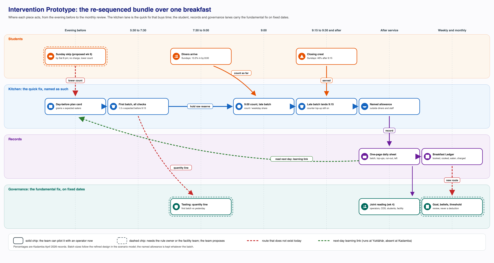
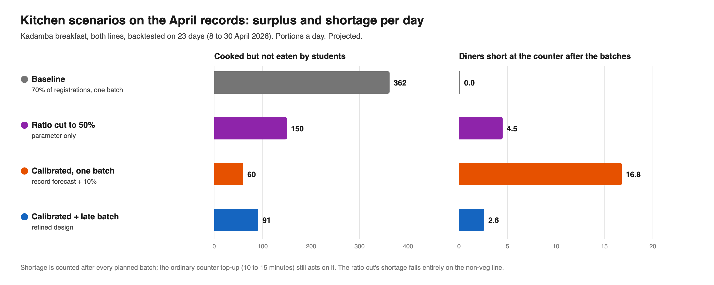
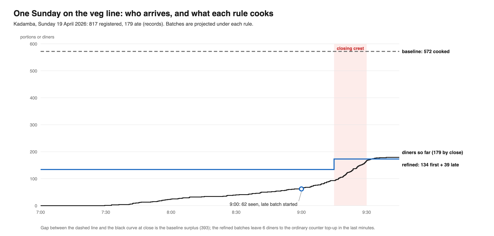
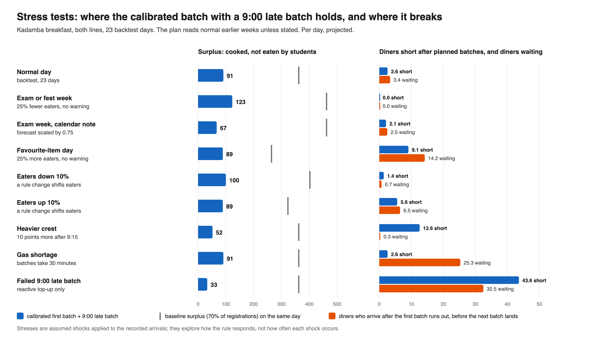
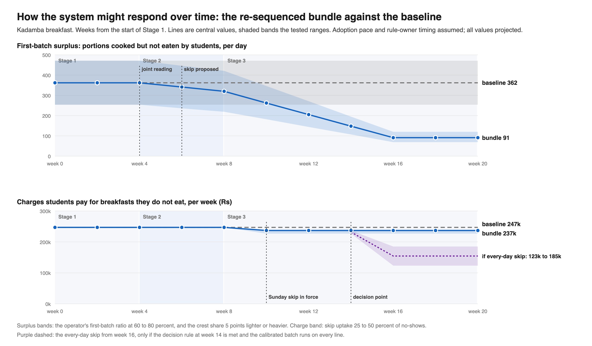

# Overview

Activity 10 develops and assesses interventions that improve system-level outcomes rather than optimising one stakeholder's interests. It produces the last three of the five Phase 3 and 4 deliverables.

| Deliverable | Framework output it carries | Where it sits |
|---|---|---|
| 3: Intervention Concepts / Prototypes | System Intervention Prototype | Generate Alternative Interventions; Develop Scenarios / Prototypes |
| 4: Scenario Model and Impact Evaluation | Scenario Model; Evaluation Framework | Develop Scenarios / Prototypes through Identify Unintended Consequences |
| 5: Final System Design Recommendation | Recommended Intervention | After Refine the Intervention |

The document follows the activity's six methods in the framework's order, from generating alternative interventions to refining the intervention, and the recommendation follows the refinement.

Everything here builds on the Leverage-Point / System Intervention Map and the Design Principles. The system is a stable equilibrium held in place by three structures: registration as an automatic standing default with a narrow exit (confirmed), billing at the booking rather than at consumption (confirmed), and a gap that is measured but unrouted (confirmed). Beneath the kitchen half sits the conversion of registrations into a cooked first batch: Kadamba cooks a fixed 70 percent of registrations per line (single-sourced), Yuktāhār plans from its own books, and every kitchen can top up a batch but never shrink one. The map ranked twelve leverage points, LP1 to LP12, placed them on fourteen intervention points, IP1 to IP14, and set seven principles, P1 to P7, that every concept here must pass. Each leverage point carries its place on the twelve-place leverage scale, counted from the deepest: place 2 is mindset, place 3 the goals of the system, place 5 its rules, place 6 its information flows and place 12 its parameters.

The map also read the loops as a shifting-the-burden structure, and that reading sets the order of everything below. The kitchen levers (LP5 and LP6) are the quick fix: they make each morning work better without touching why too many plates are booked and cooked. The route, the default and its exit, the goal and the beliefs (LP1, LP2, LP12 and LP11) are the fundamental fix. A quick fix is worth doing because it saves food and buys time, but when it is presented as the answer the search for the fundamental fix stops. The recommendation is therefore built so that the fundamental fix runs on fixed dates, whatever the kitchen pilot shows.

Claims carry the project's confidence vocabulary. Confirmed means read off a record (the Kadamba April 2026 breakfast scan export, the photographed Yuktāhār registers, posted rates) or seen on site. Single-sourced means one account; the Kadamba operator's figures are first-hand, so the numbers are not in doubt, but they remain the operator's own account of its practice. Candidate means an inference that combines sources. Assumed means a judgment offered without direct evidence. Three further labels apply to this activity only. **Projected** marks every output of the scenario model: arithmetic applied to real records under stated assumptions, not an observed outcome. **Simulated** marks every stakeholder response in the simulation section: a reasoned expectation from each actor's stated position and incentives, not feedback from that actor. **Planned** marks every co-design test: a protocol set out for the pilot, none of which has yet been run. Loop and chain IDs (L1 to L17 and L3b) and their verdicts are those of the Causal Loop and Feedback Analysis.

# Generate Alternative Interventions

## Deliverable 3: Intervention Concepts / Prototypes

Deliverable 3 has three parts. This section sets out eight genuinely different intervention concepts, each built from the leverage points rather than from one parameter. The next section turns the strongest of them into concrete prototypes and sets out how they are to be tested with the people who would use them. One concept, G, is a deliberate foil: the obvious parameter move, carried through the tests so that its failure is shown rather than asserted.

| Concept | Name | Leverage points | Intervention points | Place | Role | Mechanism in one line |
|---|---|---|---|---|---|---|
| A | The Breakfast Ledger | LP1, LP7, with LP9 as its eventual receiver | IP13, IP6, IP12, IP4 (calendar note) | 6 and 8 (5 for the standing threshold) | Fundamental (route) | A standing booked, cooked, eaten, left and charged view, per hall, weekday and line, routed up to the rule owner and back to the operators, with a cost threshold |
| B | The Kitchen Learning Kit | LP3, LP4, LP5 | IP4, IP5, IP10, IP11, IP14 | 3 and 8; 4; 6 and 8, with 11 and 12 as settings | Quick fix (LP5), carried by operator levers | A day-before plan card and a one-page daily sheet that turn Kadamba's fixed ratio into a record-calibrated first batch, carried by an operator forum |
| C | The Crest Plan | LP6 | IP7, IP8, IP9 | 6 and 10 | Quick fix | A weekday arrival profile, a late batch started at 9:00 from the count so far, and a bounded grace period |
| D | The Sunday Exit | LP2 | IP1, IP2, IP3 | 5 | Fundamental (default and exit) | Sunday breakfast drafted as opt-in, confirmed by the evening before, with an evening-before skip that removes the charge carried as the lighter variant; either lowers the count the kitchen reads |
| E | The Operator Menu Slot | LP8 | IP14 | 6 (5 for the standing slot) | Fundamental (route) | A standing operator slot at each two-week menu cycle, carrying item-level waste and run-outs |
| F | Breakfast Billed at Consumption | LP10 (held) | Monthly billing and payment, outside the daily chain | 5 | Fundamental (held) | Breakfast charged on the scan rather than on the booking, as already run during the gas shortage and some fest periods |
| G | Ratio Cut to 50 Percent (foil) | None; a place 12 parameter | IP4, IP5 as a number only | 12 | Neither | The first-batch ratio lowered by instruction, with nothing else changed |
| H | The Shared Reading | LP11, LP12 | IP13, IP14, IP4, IP1 | 2 and 3 | Fundamental (goal and belief) | Joint sessions in which the people who hold each belief read the ledger together, and the institution's own stated goal is carried by its owners as two indicators |

### Concept A: The Breakfast Ledger

**Mechanism.** Once a week the CDS scan export and the operators' books are combined into one sheet per hall: for each weekday and each line, how many were registered, how many portions were cooked in the first batch and in top-ups, how many were eaten, what was left and where it went, and the money students were charged for breakfasts they did not eat. The charge line is there so that a falling surplus is never read as the problem being solved: the kitchen levers shrink the surplus while the charge stays almost flat until a rule moves. A standing threshold, such as cooked against eaten above a set level for several weeks, sends the case to the escalation forum beside the existing trigger that fires on complaint volume. The threshold is anchored outside the hall's own past, to the institution's stated goal, lunch turnout under the same booking or Yuktāhār's recorded rate. At Kadamba the tasting that precedes every meal adds one line: first batch per line against the previous day's eaten. The same sheet carries a weekly note of exams, events and holidays down into the planning meeting.

**Loops acted on.** L10 (the measured-but-unrouted gap) is given a route; L4's governance pathway gains a second trigger type; L17 is countered, because the gap and its charge stay visible upstream even as the kitchen improves; L7's exam dips reach the kitchen by note instead of by chance.

**Principles honoured.** P1 (routes from existing records, on paper), P2 (the threshold triggers a review, never a deduction), P6 (the measure is cooked against eaten, not turnout), P7 (every figure is read beside portion, quality and run-out figures).

### Concept B: The Kitchen Learning Kit

**Mechanism.** Kadamba's "70 percent of registrations" is replaced by a day-before plan card: the gram standard per dish multiplied by the expected eaters for that weekday and line, taken from the same weekday in earlier weeks, plus a named allowance for the 30 to 50 outside diners and about half of Kadamba's staff, plus a float allowance for bonda, puri, vada and idli. A one-page paper sheet per line records the first batch, top-ups, run-out time, what was left and where it went, and is read the next day by whoever sets the batch. A standing operator forum, convened by CDS and hosted by Yuktāhār's project managers, lets each hall run its own trial and carries the preconditions of the Wastage Book routine: blame-free weighing, a daily discussion, and a goal that treats surplus as cost.

**Loops acted on.** L11, which closes at Yuktāhār and is absent at Kadamba, is created at Kadamba; the kitchen half of L13 is shortened; L8 is approached through cost rather than revenue.

**Principles honoured.** P1, P2, P3 (the operator's goal, not its people), P4 (acts the day before), P5 (the named allowance), P6, P7.

### Concept C: The Crest Plan

**Mechanism.** A weekday arrival card, built from the April records, shows what share of a typical day's diners has arrived by each clock time. At 9:00 the supervisor counts the diners so far on each line, divides by the card's share for that weekday, and starts a late batch sized to the projected remainder; it lands by about 9:15, before the crest. The first batch is sized only for the diners expected before the late batch lands. A stated grace period after 9:30 is always paired with the late batch, applies only to food from that batch, and the back door stays open.

**Loops acted on.** L12 gains a forward projection that can see the crest; L14's reason for a just-in-case hedge is removed; L15 is made explicit rather than left informal, and bounded.

**Principles honoured.** P4 (acts on the morning only through the top-up, per weekday), P5 (late service kept), P6.

### Concept D: The Sunday Exit

**Mechanism.** On Sundays, the lowest-turnout day at both halls, breakfast is first drafted as opt-in: the default is off, a student who wants breakfast confirms by 8 pm on Saturday and is charged only if confirmed, and the kitchen reads the confirmed count. This is the heavier of the candidate changes to the default and its exit. The lighter variant is carried alongside it into the prototype and the tests: an evening-before skip, open until 8 pm on Saturday, that removes the charge and lowers the count the kitchen reads while the default stays on. The four-day lead and the cap of five cancellations stay as they are for every other day during the pilot. No skip may cost a student a place at a hall.

**Loops acted on.** The booking end of L13, the Skip Meal chain L2 (which fails because a skip returns nothing), and L1 (the need for resale on Sundays).

**Principles honoured.** P3 (changes the default and its exit, not student behaviour), P4 (acts the day before, scoped to breakfast, Sundays), P5 (no absorber removed; the need for resale shrinks). Under the opt-in draft a student who forgets to confirm and still comes pays the walk-in rate, a fairness risk the tests take up.

### Concept E: The Operator Menu Slot

**Mechanism.** At each two-week menu cycle, each operator brings a short list: items that wasted most (uttapam, set dosa and upma at Kadamba, single-sourced), items that ran out, and items diners take more of than the gram standard.

**Loops acted on.** L16, which is absent, gains the link from operator waste to menu choice that L4 already has for complaints. Building the route does not make L16 a loop until it is used and closes.

**Principles honoured.** P1, P6.

### Concept F: Breakfast Billed at Consumption (Held)

**Mechanism.** The breakfast charge fires on the scan rather than on the registration, the arrangement the institution has already run during an LPG shortage and during some holiday and fest periods (confirmed).

**Loops acted on.** L1, L2, L6 and L8.

**Principles honoured.** P3 and P5, subject to a check on students who rely on resale income. It stays held because whether operators are paid on registered or on served plates is unknown, and that one fact decides whether this concept points the operator incentive the right way.

### Concept G: Ratio Cut to 50 Percent (Foil)

**Mechanism.** The Kadamba first batch is lowered from 70 to 50 percent of registrations by instruction, with no record, no late batch and no allowance.

**Loops acted on.** None structurally; the ratio is a place 12 output of missing feedback. It is carried through the tests to show what a parameter move does.

**Principles honoured.** None. It breaks P4 (lowering the ratio as a number without the record behind it) and P5 (no allowance for the people who eat the surplus).

### Concept H: The Shared Reading

**Mechanism.** The ledger becomes the shared data for a short series of joint sessions. In each, the team states what the record shows and how it reads it, then asks the holder of a belief what leads to their figure and what would change it. The Yuktāhār site head sets his "about 50 percent" beside his own register at about 28; the Kadamba supervisor predicts the closing crest before seeing the scan curve; the registration and billing side is asked what data keeps the automatic default. At the institutional level, CFS and CDS are asked to carry the goal already printed on the CDS poster, minimising food wastage through advance planning, and to adopt the two indicators that show it: booked against eaten and cooked against eaten, per hall and line, always read beside the quality measures of P7. People who already hold the tested view are placed where others can see them: student representatives in the escalation forum, and Yuktāhār's managers in the operator forum.

**Loops acted on.** The mental models beneath every chain (the base of the Iceberg analysis), and the working goal that L10, L13 and L17 serve: the system seeks the registration count while it states a goal of minimising wastage.

**Principles honoured.** P2 (joint inquiry, never being caught out), P3 (the belief and the goal, not the people), P6, P7.

# Develop Scenarios / Prototypes

## Prototypes

The six concepts that pass the principles and are not held are prototyped here in the form they would take on the ground. Each prototype uses the records and practices that already exist.

*The re-sequenced bundle across one breakfast. Columns run from the evening before to the monthly review; lanes separate students, the kitchen, the records and governance. The kitchen lane is the quick fix, named as such; the student, records and governance lanes carry the fundamental fix on fixed dates. Solid chips can be piloted with an operator now; dashed chips need the rule owner or the facility team. Red dashed arrows are routes that do not exist today; the green dashed arrow is the next-day learning link that runs at Yuktāhār and is absent at Kadamba.*

### Prototype A: The Breakfast Ledger Sheet

One A4 page per hall per week, filled from the CDS export and the operator's daily sheets. It can be written by hand and typed later, which is how Yuktāhār already digitises its books (single-sourced).

| Weekday | Line | Registered | First batch | Top-ups | Eaten (scans) | Left over | Where it went | Run-out time | Charged, not eaten |
|---|---|---|---|---|---|---|---|---|---|
| Sunday | Veg | 817 | from the sheet | from the sheet | 179 | from the sheet | outside diners, staff, reuse, bin | from the sheet | 638 × ₹48 = ₹30,624 |
| Sunday | Non-veg | 252 | from the sheet | from the sheet | 94 | from the sheet | as above | from the sheet | 158 × ₹66 = ₹10,428 |

The registered and eaten columns above are the recorded Kadamba figures for Sunday 19 April 2026 (confirmed); the charge column applies the posted rates to them (projected, since applying the current rates to April is assumed); the other columns are what the kitchen's daily sheet would supply. Four rules sit at the foot of the page. "Ate" means a scan against a registration, plus hand-logged scanner failures, one definition for every hall, with the hand-logged count shown on its own line. On a day with a run-out, eaten is marked as a floor, not a count, because no one can eat food that was not there. The weekly total of charges for uneaten breakfasts is printed beside the surplus, so that one cannot be read without the other. And no figure on the page can be used as grounds for a deduction. The page goes to the operator's site manager, to CDS, and to the escalation forum when the threshold fires.

### Prototype B: The Day-Before Plan Card and the Daily Sheet

The plan card is one line per dish per line, filled at the evening planning step. Worked through for the Kadamba veg line on Sunday 19 April 2026, using only records available by the Saturday evening:

| Step | Rule | Value |
|---|---|---|
| Expected eaters | Mean eaten on the same weekday in earlier weeks (5 and 12 April: 168 and 159, confirmed) | 164 |
| Share arriving before the late batch lands (9:15) | Earlier Sundays, both lines pooled, from the scan records (confirmed) | 54.7 percent |
| First batch | Expected eaters × share before 9:15 × 1.5 cover | 134 portions |
| Named allowance | About 30 portions for outside diners (single-sourced) and a staff allowance (headcount unknown, assumed) | Added by name, whatever the batch |
| Float | Extra for bonda, puri, vada, idli (single-sourced) | Per item, on the card |
| Raw reserve | Kept ready for the late batch and the ordinary top-up | Kept |

Each portion is then converted into grams by the existing gram standard (four idlis a person from 120 grams of batter, 100 grams of sambar, single-sourced). The baseline for the same morning was 70 percent of 817 registrations, 572 portions. With the 9:00 late batch below, the refined design would have cooked 173 portions against 179 eaten, leaving 6 diners to the ordinary top-up (projected). The daily sheet has six columns per line: first batch, late batch, other top-ups, run-out time, left over, and where the left-over went. It is the Kadamba form of Yuktāhār's Wastage Book, reduced to what the supervisor can fill on paper during and after service.

### Prototype C: The Weekday Arrival Card and the 9:00 Rule

The card is one table, printed from the April records (confirmed):

| Weekday | Share of diners in by 8:00 | By 9:00 | By 9:15 | After 9:15 | Scans a day in 9:15 to 9:30 |
|---|---|---|---|---|---|
| Monday | 17.7% | 50.7% | 64.6% | 35.4% | 117 |
| Tuesday | 17.0% | 55.2% | 68.5% | 31.5% | 110 |
| Wednesday | 22.5% | 54.6% | 68.7% | 31.3% | 93 |
| Thursday | 21.9% | 52.9% | 64.5% | 35.5% | 108 |
| Friday | 13.9% | 48.2% | 62.7% | 37.3% | 106 |
| Saturday | 15.8% | 49.4% | 62.2% | 37.8% | 106 |
| Sunday | 13.5% | 38.9% | 54.4% | 45.6% | 103 |

The 9:00 rule reads: count the diners so far on the line, divide by the day's share by 9:00, add 10 percent, subtract the first batch, and start that many portions now. The printed card shows the whole month; the rule itself uses the earlier same-weekday days only. On 19 April, 62 veg diners had scanned by 9:00; 62 divided by 39.4 percent, the share by 9:00 on the two earlier Sundays, projects about 157 for the day; the late batch is about 39 portions and lands by 9:15. The ordinary top-up (L12) stays available after that. A grace period after 9:30 is written on the card, is valid only while the late batch lasts, and is withdrawn if the share of scans after 9:30 stays above its April level of 9.2 percent (confirmed) for four weeks running.

### Prototype D: The Sunday Exit on the Portal

A single control on the existing Skip Meal screen for Sunday breakfast, open until 8 pm on Saturday, in one of two forms.

| Variant | What the student sees | Charge | Count the kitchen reads on Saturday evening |
|---|---|---|---|
| Opt-in (first draft) | "Confirm Sunday breakfast: you will be charged only if you confirm" | Only on a confirmation | The confirmed count |
| Evening-before skip | "Skip Sunday breakfast: you will not be charged, and the kitchen will cook less" | Removed on a skip | The registered count minus skips |

Either form must lower the kitchen's count; whether today's Skip Meal already does so is an open conflict, so the prototype specifies it explicitly. The wording is a first draft for testing with students, below.

### Prototype E: The Menu Slot Note

A half-page note per operator per menu cycle: the three items with the most left over, the three that ran out earliest, and the items that float above the gram standard, all taken from the daily sheets.

### Prototype H: The Shared Reading Session

One hour, around one printed ledger page and the arrival curve. The session runs in three steps. Each participant first writes down their own figure for the thing being tested (the share who eat breakfast, the size of the closing crest, the share of bookings that go uneaten). The page is then read together, figure by figure, with the team saying how it reads each one and asking each participant how they read it. The session closes by recording, in the participants' own words, what would show the belief has shifted, as set out for each belief in the leverage-point map. Nothing said is attributed outside the room.

## Co-design and User Testing (Planned)

A design that is right for the system can still fail the people who must use it. The tests below are planned for Stage 1, before any piece is piloted, and none has yet been run. Each states what it checks and which result would change the design.

| Test (planned) | With whom | What it checks | Result that would change the design |
|---|---|---|---|
| Portal wording of the Sunday skip | 8 to 12 students, including regular Sunday skippers, students who resell on Mess Cell, and students who eat most days | Whether the skip is understood in one reading; whether students believe the charge is removed and the kitchen will cook less; whether anyone fears losing their hall slot or resale option; which of the two variants they would use | Misreading by more than a few students: rewrite and retest. A stated fear for the hall slot: add the slot guarantee to the screen itself. A preference for the confirm form: carry opt-in forward as the later default option |
| Plan card and 9:00 rule walk-through | The Kadamba supervisor, and the cook who would start the late batch | Whether the card can be filled in the evening planning step; whether a late batch can start at 9:00 without delaying counter service; which items can be cooked in 15 minutes; the supervisor's own prediction of the crest before the curve is shown | A late batch that cannot land by 9:15: move the trigger to 8:45 and raise the first-batch cover (the design grid below gives the cost). A card that takes too long: cut it to the veg line's three highest-volume items |
| Ledger review | Yuktāhār's project managers and Wastage Register keeper | Whether the page reads as an audit or as a shared record; whether it fits their paper routine; which of their two records of "ate" they would use | A page read as an audit: remove per-person entries and move the threshold to monthly. A mismatch with their books: take their columns as the template for Kadamba |
| Export effort | The CDS staff member who would compile the weekly view | How long the weekly export and page take; whether the charge line can be produced | More than about an hour a week: move to a monthly page with weekly figures inside it |

The tests are small on purpose. Their job is to catch a design that nobody would use before it reaches a pilot, which a model of the records cannot do.

## Deliverable 4: Scenario Model and Impact Evaluation

Deliverable 4 is the scenario model in this section, with its eight scenarios, the stakeholder simulation and the Evaluation Framework with its scores in the next two sections, and the unintended consequences after them.

### What the Model Does

The model is a way to explore how the breakfast system might respond to each intervention, not a prediction of what will happen. It replays the Kadamba April 2026 breakfast records, one row per registration with a scan time where the student ate (confirmed, 32,162 rows), under each scenario. For every day and line it compares what each rule would have cooked with what was actually eaten, and uses the real order of arrivals to find when a batch would have run out. Kitchen scenarios that need a forecast use only records from earlier in April, so every day is tested out of sample: the backtest covers the 23 days from 8 April to 30 April, the first days with an earlier same-weekday record. Student-side scenarios apply to the whole month. A portion means one diner's breakfast at the gram standard. No food cost and no waste weight is used, because neither is in evidence; money appears only as the posted registered rate multiplied by counted uneaten registrations. Every central figure is reported with the range it takes when the uncertain inputs are varied, and the model is then pushed through stress conditions it was not built for, because a rule's weak points show more clearly under strain than in an average month.

### Assumptions

| Input | Central value | Tested range | Basis |
|---|---|---|---|
| Kadamba first-batch ratio | 70 percent of registrations, per line | 60 to 80 percent | Single-sourced; the off-site kitchen moved from 70 to 80 percent (single-sourced) |
| Registered breakfast rates | ₹48 veg and ₹66 non-veg at Kadamba, ₹53 at Yuktāhār | None | Confirmed as posted; applying the current posted rates to April is assumed |
| Forecast of eaters | Mean of the same weekday and line on earlier April days | Scaled by 0.75 when a calendar note warns of an exam week | Rule chosen for the model; records confirmed |
| Arrival profile | Share of scans before each clock time on earlier same-weekday days, both lines pooled | Crest 5 points lighter to 10 points heavier | Records confirmed; use as a conversion factor is candidate |
| Top-up time | 15 minutes, the upper end of 10 to 15 | 30 minutes under a gas shortage | Single-sourced; the stress value is assumed |
| Named allowance | About 30 portions for outside diners, plus an assumed 0 to 30 for staff | 0 to 60 in all | Single-sourced and assumed |
| Flat projection | 25 percent of diners in by 8:00 (30 of 120 minutes) | None | Assumed stand-in for a flat first-half-hour projection |
| Skip uptake when a skip removes the charge | 25 or 50 percent of eventual no-shows | 10 to 75 percent | Assumed |
| Skippers who still eat | None | 10 to 25 percent of skippers, eating on another student's scan or walking in | Assumed |
| Skip uptake when a skip returns nothing | Zero | None | Direction confirmed: Skip Meal is almost never used (L2) |
| Opt-in turnout, for the default-off variant | 60, 72 or 85 percent of those who opt in | As shown | 60 percent is candidate (Yuktāhār June Saturdays, registration regime unconfirmed); the others assumed |
| Walk-ins under the opt-in variant | 5 percent of Sunday eaters come without confirming and pay the walk-in rate | None | Assumed |
| Eaters under a rule change | Held at the records | 10 percent fewer or more; 25 percent fewer (exam week) or more (favourite item) | Assumed; the central case is a no-adaptation baseline, and the tested range shows what adaptation would do |
| Adoption pace and the rule owner's timing | Kitchen routine adopted over weeks 5 to 16; Sunday skip proposed at week 6 and in force from week 10; every-day skip from week 16 only if its decision rule is met | None | Assumed |

Three limits apply to every result. The records cover one hall, one meal and one month, and the batch arithmetic rests on the operator's own ratio. The model cannot see Kadamba's stated waste of 5 to 10 percent, whose base is unknown: a first-batch surplus of several hundred portions a day does not fit that figure unless most of it is eaten by outside diners and staff, held and reheated, or never cooked. That conflict stays open, and the model therefore reports surplus as portions cooked beyond what registered students ate, not as waste. And demand is censored: a scan records a diner who was served, so on a day when a batch ran out, "eaten" is a floor on demand rather than a count of it. The April baseline cooked far ahead of demand and rarely ran out, so its records are close to uncensored, but any design that cuts the batch will produce censored days, and a forecast that learns from them unadjusted will drift downward. The ledger's run-out rule answers this.

### Scenario 1: The Kitchen Rules, Backtested

*Portions a day on 23 backtest days, both lines. Shortage is what remains after every planned batch; the ordinary counter top-up still acts on it. All values projected.*

| Rule | Cooked a day | Surplus a day | Short a day | Line-days with any shortage (of 46) |
|---|---|---|---|---|
| Baseline: 70 percent of registrations, one batch | 759 | 362 | 0 | 0 |
| G: ratio cut to 50 percent | 542 | 150 | 4.5 | 7 |
| B alone: record forecast plus 10 percent, one batch | 440 | 60 | 16.8 | 16 |
| B with C: calibrated first batch plus 9:00 late batch (refined) | 485 | 91 | 2.6 | 7 |

The baseline never runs short in aggregate because it cooks far ahead of demand: on the veg line it cooks about 525 portions a day for about 237 eaten, and on Sundays about 563 for about 190 (projected from confirmed records and the single-sourced ratio). Three findings follow.

- **The parameter move fails both ways.** Cutting the ratio to 50 percent still leaves 150 portions a day of surplus, almost all on the veg line (138), and it starts running the non-veg line short on 7 of 23 days, because non-veg turnout reaches 59 percent on the busiest days. One ratio cannot serve two lines whose turnout differs by 16 points. This is why a parameter appears in the recommendation only as an output of a record.
- **Calibration alone moves the cost into the crest.** A record-calibrated single batch cuts surplus to 60 portions a day but leaves 16.8 diners a day short, 13.7 of them after 9:15; on Sunday 26 April the veg line would have run out at 9:24, 45 portions short. This is L14 in reverse: without a late batch, a smaller first batch trades waste for run-outs at the exact moment the operator fears most.
- **Calibration with a late batch holds both on an ordinary day.** The refined design cooks 274 fewer portions a day than the baseline and leaves 91 portions of surplus against 2.6 short, a residue the ordinary 10 to 15 minute top-up already covers. The effective ratio of cooked to registered becomes an output that varies from 29 percent (Sunday veg) to 67 percent (Friday non-veg). Scenario 6 shows where it stops holding.

The size of the reduction depends on two things the records cannot settle: the operator's true ratio, and whether the outside-diner and staff allowance is already inside it. Across a ratio of 60 to 80 percent the refined design cooks 165 to 382 fewer portions a day, and net of an allowance of up to 60 portions added back by name, about 105 to 382 (projected). At the stated 70 percent the net figure is about 214 to 274. The refined design's own surplus, 91 a day, does not depend on the ratio, because it reads eaters rather than bookings.

### Scenario 2: Projecting the Day from the Morning

| Projection | Mean error | Mean absolute error | Range of error |
|---|---|---|---|
| Flat, from the count at 8:00 | Under-reads by 26.9% | 34.8% | −56% to +54% |
| Weekday profile, from the count at 8:00 | Over-reads by 15.6% | 28.6% | −35% to +113% |
| Weekday profile, from the count at 9:00 | Over-reads by 2.6% | 13.4% | −23% to +70% |

A flat projection from the first half hour under-reads the day by about a quarter, because only 13.5 to 22.5 percent of diners have arrived by 8:00, not the quarter a flat extrapolation assumes (projected, on confirmed records). Using the weekday profile at the same hour removes most of the bias but not the noise, because the early count is small. Reading the count at 9:00 halves the error again. That is why Concept C starts the late batch at 9:00 and not from the first half hour: the evidence supports a crest-aware projection at 9:00, not an earlier one. The weekday profile is a pattern in past records, and a rule change that shifts when students arrive could weaken it; the arrival card is therefore rebuilt from each month's records rather than printed once.

### Scenario 3: One Sunday on the Veg Line

*Kadamba, Sunday 19 April 2026. The black curve is the recorded count of veg diners through the morning (confirmed). The dashed line is the baseline batch; the blue step is the refined first batch and the late batch started at 9:00 (projected).*

Averaged over the three backtest Sundays, the veg line cooked about 563 portions for about 190 eaten under the baseline, a surplus of about 373 portions each Sunday, or 2.5 to 3.4 times what was eaten across a ratio of 60 to 80 percent. Under the refined design it would cook about 233, with about 45 left and about 2 short (projected). Sunday veg is the single largest block of surplus in the week and the natural pilot slice.

### Scenario 4: The Student Side and the Default

In April, Kadamba students were charged for 20,221 breakfasts they did not eat (confirmed): about ₹7.4 lakh on the veg line and ₹3.2 lakh on the non-veg line, ₹10.6 lakh in all at the posted rates (projected, since applying the current rates to April is assumed). Kitchen rules do not touch this number at all. Only the rule side does.

| Scenario | April charges for uneaten breakfasts | Change |
|---|---|---|
| Baseline | ₹10.58 lakh | None |
| Skip that returns nothing, any day | ₹10.58 lakh | None; nobody uses it (L2) |
| D: Sunday skip that removes the charge, 25 to 50 percent uptake | ₹9.78 to ₹10.18 lakh | ₹0.40 to ₹0.80 lakh less |
| Sunday opt-in (default off), opted-in turnout 60 to 85 percent | ₹9.05 to ₹9.35 lakh | ₹1.23 to ₹1.53 lakh less |
| Skip that removes the charge, every day, 25 to 50 percent uptake | ₹5.29 to ₹7.94 lakh | ₹2.65 to ₹5.29 lakh less |
| F: billing at consumption (held) | None charged for uneaten meals | ₹10.58 lakh moved off students; who bears it depends on the plate basis |
| Shorter lead, cap of five unchanged | At most 26.5 percent of no-shows removable | Upper bound only: 1,072 registered students × 5 cancellations against 20,221 no-shows |

All values projected. The skip result is the decisive one for design: a skip that returns nothing changes nothing, because nothing rewards using it, which is exactly why Skip Meal fails today. A skip that removes the charge is the smallest rule change that moves money back to students, and it scales from a Sunday pilot to every day. The shorter lead with the cap unchanged is a bound, not a projection, because current cancellation use is unknown; it shows that the cap, not only the lead, limits how much any exit can do.

Uptake is the largest unknown on this side, so the result is shown across it:

| Uptake among no-shows | Sunday skip: returned to students a week | Every-day skip: returned a week | Sunday skip: fewer registered plates a week | Every-day skip: fewer registered plates a week |
|---|---|---|---|---|
| 10 percent | ₹4,010 | ₹24,692 | 78 | 472 |
| 25 percent | ₹10,025 | ₹61,729 | 194 | 1,180 |
| 50 percent | ₹20,050 | ₹1.23 lakh | 389 | 2,359 |
| 75 percent | ₹30,075 | ₹1.85 lakh | 583 | 3,539 |

The fewer registered plates are what the vendor would lose if it is paid on registered plates (projected; the plate basis is unknown).

**Does a skip starve the crest if the kitchen keeps its ratio?** The default-off variant does. If Sunday registrations shrink to those who opt in and Kadamba keeps cooking 70 percent of the new count, the two lines together run about 23 portions short each Sunday at 72 percent opted-in turnout, and about 65 short at 85 percent, all after 9:15 (projected). The 70 percent ratio silently assumes that about 30 percent of bookings will not be eaten; make bookings accurate and the same ratio under-cooks at the crest.

A skip is less exposed, and the model gives the uptake at which a kitchen that keeps its ratio would start to run short, per line, as the lowest value over the April days:

| Operator ratio | Line | Safe uptake, Sundays | Safe uptake, every day | April days short at 50 percent uptake, every day (of 30) |
|---|---|---|---|---|
| 60 percent | Veg | 72.5% | 47.2% | 1 |
| 60 percent | Non-veg | 49.0% | 3.6% | 25 |
| 70 percent | Veg | 82.3% | 66.1% | 0 |
| 70 percent | Non-veg | 67.2% | 38.0% | 7 |
| 80 percent | Veg | 89.7% | 80.2% | 0 |
| 80 percent | Non-veg | 80.9% | 63.8% | 0 |

A Sunday skip is therefore unlikely to cause a crest shortage, provided uptake stays below about two-thirds of Sunday no-shows on the non-veg line at the stated 70 percent ratio, or about half if the true ratio is nearer 60 percent (projected). Skippers who still eat, on another student's scan or as walk-ins, do not change this for Sundays: at 50 percent uptake with a quarter of skippers still eating, the Sunday count stays above the eaters. An every-day skip is different. At 50 percent uptake with the ratio kept, the non-veg line would run short on 7 of 30 April days, about 1.4 diners a day on average, rising to 3.0 if a tenth of skippers still eat and 8.9 if a quarter do (projected). The Sunday skip can therefore go ahead on its own date, while the every-day skip waits until the kitchen reads eaters on every line. That is a feedback rule, stated in the recommendation, not a reason to hold the Sunday step.

### Scenario 5: Yuktāhār's Belief Against Its Register

On the nine September breakfasts whose rows are fully legible, Yuktāhār registered 228 to 325 and served 41 to 105 (confirmed). If the day-before plan anchored on the site head's belief of about 50 percent, it would cook about 63 portions a day more than were eaten (projected); anchoring on the weekday register, whose Sundays sit at 18 to 24 percent and whose Tuesdays reach 31 to 40 percent, removes that gap without any new instrument. Students there were charged about ₹10,500 a day for breakfasts they did not eat on those days (projected at the posted ₹53). The kitchen lever at Yuktāhār is therefore a change of belief, tested against the register in a shared reading, not a new routine.

### Scenario 6: Sensitivity and Stress

*The refined design (calibrated first batch with a 9:00 late batch) on the 23 backtest days under assumed shocks to the recorded arrivals. The grey tick is the baseline surplus on the same days. Diners waiting are those who arrive after the first batch runs out and before the next batch lands. All values projected.*

**Crest share.** The refined design reads the crest from earlier weeks. If the crest on the day is heavier than the card expects, the 9:00 count under-reads the day and the late batch is too small:

| Crest on the day | Surplus a day | Short a day | Diners waiting a day | Line-days short (of 46) |
|---|---|---|---|---|
| 5 points lighter | 120 | 0.5 | 5.7 | 2 |
| As recorded | 91 | 2.6 | 3.4 | 7 |
| 5 points heavier | 69 | 7.7 | 1.1 | 13 |
| 10 points heavier | 52 | 12.6 | 0.3 | 15 |

**Stress conditions.** Each is an assumed shock applied to the recorded arrivals, and the plan is not warned unless stated:

| Condition | Eaten a day | Baseline surplus | Refined surplus | Refined short | Diners waiting |
|---|---|---|---|---|---|
| Normal (backtest) | 397 | 362 | 91 | 2.6 | 3.4 |
| Exam or fest week, 25 percent fewer eaters | 297 | 462 | 123 | 0 | 0 |
| The same, with the calendar note scaling the forecast | 297 | 462 | 67 | 2.1 | 2.5 |
| Favourite-item day, 25 percent more eaters | 496 | 264 | 89 | 9.1 | 14.2 |
| A rule change lowers eaters by 10 percent | 357 | 402 | 100 | 1.4 | 0.7 |
| A rule change raises eaters by 10 percent | 436 | 323 | 89 | 5.6 | 6.5 |
| Heavier crest, 10 points | 397 | 362 | 52 | 12.6 | 0.3 |
| Gas shortage: every batch takes 30 minutes | 397 | 362 | 91 | 2.6 | 25.3 |
| Failed 9:00 late batch: only the reactive top-up | 397 | 362 | 33 | 43.6 | 32.5 |

Five findings follow, each about direction as much as size.

- **The design fails safe toward fewer eaters and fails loud toward more.** Fewer eaters than expected, from an exam week or from a rule change, raise surplus but cause no run-out, and the calendar note removes most of the extra. More eaters than expected, from a favourite item or a heavier crest, push shortage from about 3 to 9 to 13 diners a day. Menu days therefore belong on the calendar note as much as exam weeks, and the first batch keeps its 1.5 cover.
- **The late batch is the load-bearing part.** If it fails, the day is about 44 diners short before the reactive top-up and about 33 wait for it. The raw reserve for the late batch is therefore not optional, and a failed late batch on two Sundays is a stop condition for the pilot.
- **A slower kitchen hurts through waiting, not shortage.** Under a gas shortage the same food is cooked, but about 25 diners a day wait for it. The institution has already answered one gas shortage by billing on attendance; on such days the plan returns to a larger first batch.
- **The no-adaptation assumption matters, but not decisively.** If a rule change shifts eaters by 10 percent either way, the refined design's surplus stays between 89 and 100 portions a day and shortage between 1.4 and 5.6 (projected). The central figures are not an artefact of holding eaters fixed.
- **The baseline's own surplus is almost pure ratio.** Across a ratio of 60 to 80 percent it ranges from 254 to 471 portions a day, while the refined design stays at 91 on an ordinary day. The baseline's cost moves with the one number nobody measures.

### Scenario 7: Behaviour over Time for the Recommended Bundle

*Kadamba breakfast under the re-sequenced bundle against the baseline. Lines are central values; shaded bands are the tested ranges. Adoption pace and the rule owner's timing are assumed; all values projected.*

| Week | Stage | First-batch surplus a day, baseline | First-batch surplus a day, bundle | Uneaten charges a week, baseline | Uneaten charges a week, bundle |
|---|---|---|---|---|---|
| 0 to 4 | Stage 1: routes, co-design tests, joint reading at week 4 | 362 (254 to 471) | 362 (254 to 471) | ₹2.47 lakh | ₹2.47 lakh |
| 6 | Stage 2: Sunday veg kitchen pilot; Sunday skip proposed | 362 (254 to 471) | 341 (236 to 446) | ₹2.47 lakh | ₹2.47 lakh |
| 8 | Stage 2 | 362 (254 to 471) | 320 (219 to 421) | ₹2.47 lakh | ₹2.47 lakh |
| 10 | Stage 3: kitchen roll-out; Sunday skip in force | 362 (254 to 471) | 262 (182 to 346) | ₹2.47 lakh | ₹2.37 lakh (2.27 to 2.37) |
| 12 | Stage 3 | 362 (254 to 471) | 205 (144 to 271) | ₹2.47 lakh | ₹2.37 lakh (2.27 to 2.37) |
| 14 | Stage 3; decision point on the every-day skip | 362 (254 to 471) | 148 (107 to 195) | ₹2.47 lakh | ₹2.37 lakh (2.27 to 2.37) |
| 16 to 20 | Full kitchen adoption; every-day skip only if its rule is met | 362 (254 to 471) | 91 (69 to 120) | ₹2.47 lakh | ₹2.37 lakh (2.27 to 2.37); ₹1.23 to ₹1.85 lakh with the every-day skip |

The shape is the point. Nothing physical moves in the first month, because Stage 1 builds routes and tests designs with their users rather than cutting food. The surplus then falls over about three months, an assumed pace that may be optimistic, since Yuktāhār's own waste routine took about four months to take hold (August to December, single-sourced). The student charge moves only when a rule does: a little at week 10, from the Sunday skip, and substantially only if the every-day skip follows. A kitchen that improves while the charge line stays flat is the signature of a quick fix standing in for the fundamental one, which is why both lines sit on the same ledger page.

### Scenario 8: How Each Scenario Moves Every Indicator

The matrix reads each scenario across the whole system rather than one measure. Figures are projected from the model; entries without a figure are directions reasoned from the evidence and the simulation (assumed), and are marked as such by having no number.

| Indicator | Current system | Kitchen quick fix only (B with C) | Re-sequenced bundle, Sunday skip in force | Bundle with every-day skip (conditional) | G: ratio cut to 50 percent | F: billing at consumption (held) |
|---|---|---|---|---|---|---|
| Student cost: charges for uneaten breakfasts a week | ₹2.47 lakh | ₹2.47 lakh, unchanged | ₹2.27 to ₹2.37 lakh | ₹1.23 to ₹1.85 lakh | ₹2.47 lakh, unchanged | None; the cost moves to whoever bears it under the plate basis |
| First-batch surplus a day | 254 to 471 | 69 to 120 | 69 to 120 | 69 to 120 | 150 | Falls only if the kitchen also reads eaters |
| Run-outs: diners short a day | 0 | 0.5 to 7.7; up to 44 if the late batch fails | As the quick fix | As the quick fix if the calibrated batch runs on every line; otherwise non-veg short on some busy days | 4.5, all non-veg | Unchanged |
| Late arrivals: share after 9:30 | 9.2% | May rise with the grace period; bounded by its stop rule | As the quick fix | As the quick fix | May rise as late diners find less | Unchanged |
| Staff and outside-diner meals | Fed from the surplus, unplanned | Fed by a named allowance | Named allowance | Named allowance | At risk: no allowance | Unchanged |
| Food quality and reheating | Large surplus held and reheated (candidate) | Less held and reheated; portion watched by P7 | As the quick fix | As the quick fix | Less surplus, but no quality guard | Unchanged |
| Supervisor workload | Low | Higher: a 9:00 decision and a daily sheet, falling as they become routine | As the quick fix | As the quick fix, with more variable counts | Unchanged, with more run-out pressure | Unchanged |
| Vendor revenue, if paid on registered plates | Unchanged | Unchanged; food cost falls | 194 to 389 fewer registered plates a week; food cost falls | 1,180 to 2,359 fewer a week; food cost falls | Unchanged; food cost falls | Follows served plates |
| Resale on Mess Cell | Active | Unchanged | Less need on Sundays | Less need every day | Unchanged | Need largely removed |
| CDS workload | Low | Unchanged | A weekly page and a portal toggle | A wider toggle, partly replacing cancellation handling | Unchanged | Billing change |
| Trust between actors | Low contact; no shared record | Risk that the sheet reads as an audit at Kadamba | Joint reading builds a shared record; audit risk managed by rule | As the bundle | Run-outs erode students' trust in the kitchen | Depends on the vendor settlement |

Two things stand out. Only the rule scenarios move the student cost, and only the kitchen scenarios move the surplus, so no single scenario serves the system and the bundle needs both. And the costs the bundle adds fall on the supervisor, CDS and, on one plate basis, the vendor, which is why the pilot names allowances, bounds workload and asks the plate basis before the Sunday proposal.

# Simulate Stakeholder Responses

Every response in this section is **simulated**: a reasoned expectation built from each actor's stated position, incentives and past behaviour in the evidence. None of it is feedback from the actors named, and none of it may be read as evidence that they would respond this way. The four concepts simulated are the ones that pass the principles, are not held and carry the recommendation: A, the Breakfast Ledger; B with C, the calibrated first batch and late batch; D, the Sunday Exit; and H, the Shared Reading.

| Stakeholder | Grounding in the evidence | A: Breakfast Ledger (simulated) | B with C: calibrated batch and late batch (simulated) | D: Sunday Exit (simulated) | H: Shared Reading (simulated) |
|---|---|---|---|---|---|
| Students who eat most days | Register by default, attend near daily, rare skips from late work (confirmed) | Indifferent | Notice fresher food if less is held and reheated; object at once to any late run-out | Barely affected; may skip the odd Sunday | Indifferent |
| Students who skip Sundays or often (late sleep, fasting, regional habit) | Late sleep the most common reason; one fasts on purpose; Sunday lowest at both halls (confirmed) | Indifferent | Unaffected | Strong uptake if the skip is simple and free; ignored if it returns nothing | Indifferent |
| Students who resell on Mess Cell | Resale recovers value Skip Meal does not (confirmed) | Indifferent | Unaffected | Some shift from resale to skipping on Sundays; buyers of resold Sunday slots lose supply | Indifferent |
| Kadamba operator management (Prism, operations manager and above) | Cooks on registrations as a paid obligation (single-sourced); tender contract; plate basis unknown | Wary that a weekly sheet reads as an audit; accepts it if blame-free and shared back | Receptive if framed as a food-cost saving with revenue untouched; the Yuktāhār case is the argument | Opposed if paid on registered plates, since skipped plates may cut revenue; neutral if paid on served plates | Cautious; engages if the session is joint inquiry and the operator's own figures lead |
| Kadamba supervisor and kitchen staff | Calls top-ups at the counter; layered chain; staff eat from the same food (single-sourced) | Fears a record becoming a reprimand | Fears run-outs at the crest and the extra 9:00 cook; accepts if the raw reserve stays and the staff meal is named | Unaffected, apart from a lower Sunday count | Curious to compare the crest prediction with the curve, if nothing is held against a wrong guess |
| Yuktāhār operator (ABC Hospitality Services) | Goal includes less waste and higher profit; blame-free books; dropped a paid ERP system (single-sourced) | Welcomes a route that uses its books; objects to any digital requirement | Willing host for the forum; adopts the 9:00 rule as its own improvement | Welcomes a lower, truer Sunday count | Uncomfortable at having the site head's figure set against his register, then likely to adopt the register as its anchor |
| CDS (scan data holder; relationship to the Mess Office unconfirmed) | Holds the export; tightened cancellations once to cut workload (confirmed motive) | Accepts a weekly or monthly export if the work is light; the ledger is its own poster goal made concrete | Supportive, no cost to it | Cautious: a new portal toggle is workload, and its December 2024 change went the other way | Receptive to indicators that show its own stated goal, provided they come with no new workload |
| CFS | Knew the breakfast figure for years and it never reached policy (confirmed); acts on loud problems | Receptive to a threshold that reports in its own terms | Neutral to positive | Supportive if it costs nothing and is a pilot | Receptive: the goal is its own |
| Student representatives (Council, Parliament mess seats) | Carried the menu-rotation case end to end (confirmed, L4); met the Mess Office over the December 2024 change | Use the ledger as evidence for a rule case | Neutral | Strong supporters; the natural carriers of the proposal | Natural carriers of the tested view into the escalation forum |
| Outside diners and staff who eat from the surplus | About 30 portions for 30 to 50 outside diners, about half of Kadamba staff (single-sourced) | Unaffected | Unaffected if the allowance is named; harmed if it is not | Unaffected | Unaffected |
| Facility team at the tasting | Tastes every meal with two Prism staff; checks safety and taste only (confirmed, observed) | Accepts one extra line if it adds no delay; reluctant to act as a quantity inspector | Unaffected | Unaffected | Neutral |

Read across, each actor's simulated response is a rational answer to the incentives and information it has, and none needs to be persuaded out of bad faith. What would change each incentive is set out below.

| Actor | Its rational position today | What would change its incentive |
|---|---|---|
| Prism (Kadamba operator) | If paid on registered plates, every booking is revenue and the hedge keeps run-outs away, so a smaller booking and a smaller batch look like pure risk | A food-cost saving it keeps (the calibrated batch saves cost on either plate basis); run-out protection it can see (the late batch and raw reserve); an assurance, in the contract review, that a lower waste figure will not by itself trigger a lower per-plate rate |
| Kadamba supervisor and staff | A run-out is the only failure anyone notices, and a written figure can become a reprimand | The written blame-free rule; a late batch that makes the crest safe; the staff meal named on the plan card |
| CDS | Its last change cut its workload; a new toggle and a standing ledger add to it | A skip that replaces some cancellation handling rather than adding to it; an export that takes under an hour a week; indicators that show the goal it already prints |
| Yuktāhār | Already treats waste as cost; hosting costs time | Recognition as the model hall in the operator forum; a menu voice in return |
| Students | Registering by default costs no decision, and resale recovers some value | An exit that is one step, removes the charge and never costs a hall slot |
| CFS | Attention follows loud problems, and the breakfast gap is quiet | A threshold that makes the gap arrive in its own terms, beside complaints |

The simulation therefore argues for a joint reading, in which the operators, CDS, the student representatives and the facility team see one ledger together, rather than separate proposals carried to each. It does not argue for sequencing the booking change behind the kitchen: the calibrated batch saves the operator food cost on either plate basis, and the plate-basis question is asked before the Sunday proposal, not answered by delaying it.

# Test Interventions Against System Objectives

## Evaluation Framework

The objectives come from the reframe and the design opportunity: give the system a way to notice its own cost, cut the over-cooked first batch without trading waste for run-outs, change nothing by making someone worse off, and produce something the people who run it will use. They are system objectives, not any one stakeholder's interest. Four gates come first; a concept that fails a gate is not eligible for recommendation, whatever its score.

| Gate | Test | Source |
|---|---|---|
| G1: Absorbers kept | Does the concept keep resale, reuse, the meals of outside diners and staff, the walk-in buffer, late service, outside venues and informal accommodation? Only the over-cooked batch, repeated reheating and the bin may be targeted | P5 and the Phase 2 standing constraint |
| G2: Safety kept | Does it leave every step of the food-safety sequence intact? | P4 |
| G3: Aimed at structure | Does it avoid asking students to behave better or treating operators as the source of the waste, and is it not gated on an unknown that could reverse its effect? | P3 and the held status of LP10 |
| G4: Quick fix paired with the fundamental fix | If it contains a kitchen lever, does it also carry a route, default, goal or belief lever on a date that does not depend on how the kitchen performs? | The shifting-the-burden reading and P5 |

Nine criteria are then scored from 0 to 4 against the baseline and weighted.

| Criterion | What it asks | Result measure | Weight |
|---|---|---|---|
| O1: Booked against eaten | Does the booking carry more of the morning's demand? | Charges for uneaten breakfasts; share of registrations not eaten | 15 |
| O2: Cooked against eaten | Does the first batch shrink toward what is eaten? | First-batch surplus in portions a day | 15 |
| O3: Crest service | Does the last diner still eat? | Shortage after all batches; a residue under about ten a day that one ordinary top-up covers counts as protected | 15 |
| O4: Fundamental capability | Does the cost reach a rule owner, does a learning loop exist where one is missing, and are the goal and beliefs that hold the pattern tested? | Route built; L11 present at Kadamba; indicators of the stated goal adopted | 15 |
| O5: Fairness | Does it avoid shifting cost onto the least powerful: students, late diners, staff, outside diners? | Who bears any new cost | 10 |
| O6: Food quality | Does it reduce holding and reheating, and keep portion and taste? | Share of food served from a fresh or late batch; grams per plate; taste at the tasting | 10 |
| O9: Desirability | Is it desirable to the students, supervisors and staff who must use it? | Simulated response and, once run, the co-design tests | 10 |
| O7: Feasibility now | Can the student team build or pilot it with an actor who has engaged? | Who must act, from the power map | 5 |
| O8: Reversibility and learning | Can it be piloted small, measured and undone? | Scope of a first pilot | 5 |

The weights are the team's judgement; four changed from the first draft and one was added, for stated reasons. Food quality rises from 5 to 10 because surplus that is held and reheated rather than binned is a cost students eat every morning, and because the quick way for any kitchen to cut surplus is smaller portions or lower quality, which only a quality weight can catch. Desirability enters at 10 because a design the system needs but nobody will use fails as surely as one that is not needed. Feasibility and reversibility fall from 10 each to 5 each, and cooked against eaten from 20 to 15, because weighting what a student team can do now above what the system needs pulls every score toward the quick fix; feasibility shapes the staging, not the choice. Every score in the table below is on a result measure. Process checks, such as whether the daily sheet is filled or the ledger sent, are monitored in the pilot but never scored as results, because a system that reports effort as result stops looking for the result.

The scale is the same for each criterion: 0 makes the outcome worse, 1 has no effect, 2 is a small or indirect gain, 3 a clear gain, 4 a large gain shown in the model. O3 uses its own anchors: 4 adds no shortage, 3 leaves a residue one ordinary top-up covers, 1 leaves recurring crest shortage beyond one top-up, 0 pushes shortage onto late diners systematically. For O7 the anchors read as feasibility: 0 means the team cannot act on the concept at all, 4 that it can build or pilot it now. O9 draws on the simulated responses for now and is to be rescored after the co-design tests. The total is the weighted sum out of 400, shown as a percentage. The table lists concepts by score, with depth on the leverage scale as the tie-breaker; for recommendation, gates come first, then score.

## Scoring

| Concept | Gates | O1 | O2 | O3 | O4 | O5 | O6 | O9 | O7 | O8 | Score | First-draft score |
|---|---|---|---|---|---|---|---|---|---|---|---|---|
| A: Breakfast Ledger | Pass | 2 | 2 | 4 | 4 | 2 | 1 | 2 | 4 | 4 | 68% | 74% |
| H: Shared Reading | Pass | 2 | 2 | 4 | 3 | 3 | 1 | 2 | 3 | 4 | 65% | New |
| F: Billing at consumption | Fails G3 (held on the plate basis) | 4 | 2 | 4 | 2 | 3 | 1 | 2 | 0 | 2 | 63% | 61% |
| C: Crest Plan, alone | Fails G4 alone | 1 | 2 | 4 | 1 | 3 | 3 | 3 | 4 | 4 | 63% | 64% |
| D as the lighter variant: Sunday skip, ratio kept | Pass | 2 | 2 | 4 | 2 | 3 | 1 | 3 | 1 | 3 | 60% | 59% |
| E: Operator Menu Slot | Pass | 1 | 2 | 4 | 2 | 2 | 2 | 3 | 3 | 4 | 60% | 61% |
| B: Kitchen Learning Kit, alone | Fails G4 alone | 1 | 4 | 1 | 3 | 2 | 3 | 1 | 3 | 4 | 58% | 65% |
| D extended: every-day skip, ratio kept | Pass | 3 | 2 | 1 | 2 | 3 | 1 | 3 | 0 | 2 | 50% | New |
| D as first drafted: Sunday opt-in, ratio kept | Pass | 3 | 3 | 0 | 2 | 2 | 2 | 2 | 1 | 3 | 50% | 51% |
| G: Ratio cut to 50 percent | Fails G1 and P4 | 1 | 3 | 3 | 1 | 1 | 1 | 1 | 4 | 4 | 48% | 58% |
| First-draft bundle: A with B and C, Sunday skip only after the kitchen reads eaters | Fails G4 (the skip is gated on the kitchen) | 2 | 4 | 3 | 4 | 3 | 3 | 3 | 3 | 3 | 79% | 80% |
| Re-sequenced bundle: A, H and the Sunday skip on fixed dates; B with C as the quick fix; the every-day skip on a decision rule | Pass | 2 | 4 | 3 | 4 | 3 | 3 | 3 | 3 | 3 | 79% | New |

The reasons behind the scores:

- **A** still scores highest alone because it builds the one route every other lever needs and the team can build it now from records in hand, but it moves no food and no money by itself (O1 and O2 indirect), and it adds work for CDS and a record that operator staff may read as an audit (O9 at 2).
- **H** is new. It acts on the deepest places in the set, the beliefs and the working goal, and moves food directly only where a belief sets a batch (Yuktāhār's 50 percent anchor, about 63 portions a day). Being shown one's own figure against a record is uncomfortable, which caps O9.
- **C alone** protects the crest and makes the projection honest, but without B's record forecast its first batch can only be trimmed by the arrival share of a registration-based count, a small and indirect cut (O2 at 2).
- **D as the lighter variant** moves ₹0.40 to ₹0.80 lakh a month and is unlikely to cause a crest shortage below about two-thirds uptake on the non-veg line. It needs the rule owner, which caps O7.
- **E** is cheap and safe and acts on L16 only.
- **B alone** has the largest physical effect in the model, surplus from 362 to 60 portions a day, and the worst crest result, 16.8 short a day, mostly after 9:15; that run-out risk also makes it the least desirable to the supervisor who must run it and the students who arrive late (O9 at 1). Under the new weights it falls from second to seventh of the single concepts on score alone.
- **D extended to every day** moves the booking most among the unheld concepts, ₹2.65 to ₹5.29 lakh a month, but with the ratio kept at 50 percent uptake it runs the non-veg line short on 7 of 30 days (O3 at 1). It scores as a later step, not a first one.
- **D as first drafted** moves ₹1.23 to ₹1.53 lakh a month, but with the ratio kept the model runs the crest 23 to 65 portions short each Sunday at 72 to 85 percent opted-in turnout (O3 at 0); a student who forgets to confirm pays the walk-in rate, which caps O5.
- **F** has the deepest student-side effect but is held: whether it helps or harms the operator side depends on the plate basis, and the team cannot move it.
- **G** looks feasible and fails the gates: it cuts the batch with no allowance for the people who eat the surplus, still leaves 150 portions a day and starts non-veg run-outs. The quality weight and desirability pull it further down.
- **The two bundles** contain the same parts and score the same, which is the honest limit of a weighted score: it cannot see order. The gate can. The first-draft bundle made the Sunday skip wait until the kitchen could read eaters, so the fundamental fix depended on the quick fix performing, which is the shifting-the-burden pattern in miniature. Scenario 4 shows the wait is not needed for a Sunday skip. The re-sequenced bundle passes G4 and is the recommendation.

**What changed on rescoring.** The single-concept ranking on score changed: B fell from second to seventh, H entered second, and A's lead narrowed from 74 to 68 percent. The recommendation did not change in its parts; it changed in its order and in how its parts are described. The kitchen bundle is now labelled the quick fix, and the route, the Sunday exit, the goal and the beliefs run on fixed dates in Stages 1 and 2.

# Identify Unintended Consequences

Each second-order effect below is mapped to the loop or chain it acts through. Several are the loops themselves pushing back.

| Intervention | Possible unintended consequence | Loop or chain | Mitigation built into the refined design |
|---|---|---|---|
| B, C | A smaller first batch takes food from the 30 to 50 outside diners and staff who now eat the surplus | L9 (candidate), the absorber constraint | The named allowance on the plan card, recorded as served on the daily sheet |
| B | Run-outs at the crest when a calibrated batch meets a heavy day (16.8 a day in the model without a late batch; 9 to 13 a day with it on a favourite-item day or a heavier crest) | L14 in reverse, L12 | The 9:00 late batch; first batch covers 1.5 times the diners expected before 9:15; raw reserve kept; menu days on the calendar note |
| B, C | A shortage, being loud, pushes the supervisor back to the hedge after one bad morning | L14 candidate ratchet | Judge over months (P2); the daily sheet records every run-out so one bad day is seen against the rest |
| B, A | A more competent kitchen makes the gap even less visible upstream | L17 (candidate) | The ledger carries registered, eaten and the charge for uneaten meals, not only cooked; the kitchen is labelled the quick fix on the page |
| C | The 9:00 late batch lands in the busiest kitchen quarter-hour | L12 | Late batch drawn from quick items already cooked live (dosa from 7:00) or steamed; the supervisor walk-through tests it before the pilot |
| B | Exam weeks, events and holidays break a weekday forecast | L7 | The calendar note in the ledger (LP1's downward route) adjusts the card; the model shows it removes most of the exam-week surplus |
| D | Resale buyers lose cheap Sunday slots | L1 | Accepted: the need for resale shrinks; no market is closed |
| D | A default-off version with the fixed ratio under-cooks the crest by 23 to 65 portions a Sunday at 72 to 85 percent opted-in turnout (projected) | L13, L14 | Refined to a skip that keeps the default; opt-in comes later, once the kitchen reads eaters on every line |
| B, C | Less surplus to hold and reheat changes what reaches students | L13 reheating branch (open) | Positive if confirmed; recorded as where the left-over went on the sheet |
| A | CDS workload rises, the motive behind its last tightening | Governance | Weekly page, paper-first, filled by the team during the pilot; handed over with a tested time budget |
| A, D | The receiver cannot be named while two different people are on record as head of CDS | L10 | Send to the CDS office and the escalation forum by role until the identity is settled |

## How the System Might Adapt: Policy Resistance

A system that settles into a pattern also pushes back against a change to it. Each row below is a way the actors, each acting rationally, could adapt so that the intervention is delayed, diluted or defeated. Likelihood is the team's judgement (assumed).

| How the system adapts | Loop or chain | Likelihood | Early-warning indicator | Mitigation |
|---|---|---|---|---|
| The vendor raises its per-plate rate at the next contract renegotiation if billed plates fall | L8 (unresolved) | Medium if paid on registered plates; low if on served plates | Rate proposals at renegotiation; operator statements that fewer plates make the contract unviable | Ask the plate basis before the Sunday proposal; present the food-cost saving alongside the lost plates so both sides of the vendor's account are on one page; state in the contract review that a lower waste figure alone does not lower the rate |
| Students skip, then eat on another student's scan | L1 (candidate), rule beating | Medium on Sundays, higher if the skip goes every day | Eaten per remaining registration rising on skip days; walk-in counts; hand-logged scans | Keep the walk-in rate at ₹81, above the ₹48 registered rate (confirmed); keep the every-day step behind its decision rule, since the model shows skip-then-eat matters there and not on Sundays |
| Operators meet cooked against eaten by shrinking portions, under-recording leftovers or leaning on reheated stock | L11's goal; L13 reheating branch (open) | Medium | Grams per plate at the tasting; taste complaints; the "where it went" column shifting to "reuse"; cooked against eaten improving faster than issues from the store | Cooked against eaten is never read alone (P7): grams per plate, taste and run-outs sit beside it; store issues reconciled against cooked, as Yuktāhār already does |
| The "ate" definition is gamed through hand-logged scanner failures | L10 (the measure itself) | Low to medium | Hand-logged share of eaten rising week on week, or concentrated on one line or day | Hand-logged failures reported on their own line; any rise above the first month's share triggers a check of the scanner, not of the staff |
| Staff and outside-diner food is quietly cut below the named allowance | L9 (candidate) | Medium, and the least visible | Allowance served less than planned on the daily sheet; outside diners or staff reporting missed meals | The allowance is a named line, recorded as served; any missed allowance meal is a stop condition |
| CDS re-tightens cancellations to cut its workload | Governance; the December 2024 precedent (single-sourced) | Low to medium | Proposals to shorten the skip window or cap skips | Design the skip to replace cancellation handling, not add to it; bring CDS into the joint reading from week 4 so the workload case is heard before it is acted on |
| A demand-censoring spiral: run-outs cap "eaten", which lowers the forecast, which lowers the next batch | L11's learning record, reading censored data (a candidate chain, not a loop) | Medium once batches shrink | Run-out days followed by lower forecasts for the same weekday; the same weekday running out repeatedly | On a run-out day, demand is read as the count at run-out divided by the arrival card's share by that time, never as the raw eaten figure; a weekday that runs out twice has its forecast raised, not lowered |
| The ledger is read as an audit, and operators and CDS defend figures rather than share them | Accidental adversaries, a risk on L10 and L16 | Medium at Kadamba, given the layered chain | Sheets filled late or in round numbers; the "left over" column always small | Blame-free rule on the page; the joint reading sets the ledger as shared data; threshold breaches trigger a review, never a deduction |
| Fixes-that-fail drift: after a run-out, the supervisor quietly restores the hedge | L14 candidate ratchet | Medium to high after any bad morning | The effective ratio of cooked to registered, tracked weekly per line, drifting back toward 70 percent | Weekly ratio line on the ledger; judge over months; the late batch removes the reason for the hedge |
| The grace period raises the gain of L15: reliable late food teaches students that the close is soft | L15 (reinforcing, candidate) | Medium | Share of scans after 9:30, 9.2 percent in April (confirmed) | Grace period bounded to the late batch; if the share after 9:30 rises above the April level for four weeks running, the grace period is withdrawn while the late batch stays |

# Refine the Intervention

The tests, the stress runs and the consequences changed the first concepts in eleven ways.

| First concept | Test or consequence that changed it | Refined version |
|---|---|---|
| B alone: a record-calibrated single batch | Backtest: 16.8 diners a day short, 13.7 after 9:15; one Sunday 45 short at 9:24 | B with C: a first batch sized for the diners expected before 9:15, plus a late batch started at 9:00 |
| C with a projection from the first half hour | Mean absolute error of the day's projection: 35 percent flat from 8:00, 29 percent from the weekday profile at 8:00, 13 percent from the profile at 9:00 | Projection read at 9:00 from the weekday card, not at 8:00 |
| First batch with a 10 percent buffer | Design grid over trigger times (8:45, 9:00) and buffers (10 to 50 percent): at 10 percent about 18 diners a day wait for the late batch | First batch covers 1.5 times the diners expected before 9:15; about 3 a day wait, 2.6 left to the ordinary top-up, surplus 91 |
| The kitchen bundle as the design | The shifting-the-burden reading: a better kitchen presented as the answer stops the search for the fundamental fix | The kitchen bundle labelled the quick fix on the prototype, the ledger and the recommendation |
| D as a Sunday skip only after the kitchen reads eaters | Scenario 4: with the ratio kept, a Sunday skip is unlikely to run the crest short below about two-thirds uptake on the non-veg line | The Sunday skip proposed on a fixed date, week 6, independent of the kitchen pilot; the every-day skip, which does carry that risk, waits on a decision rule |
| D as Sunday opt-in (default off) | With the 70 percent ratio kept, 23 to 65 portions short each Sunday at the crest at 72 to 85 percent opted-in turnout; a student who forgets to opt in faces the ₹81 walk-in rate | D as an evening-before skip that removes the charge, default kept; opt-in held as a later step on the architecture path |
| D as a skip, any design | A skip that returns nothing is not used (L2) | The skip must remove the charge and lower the count the kitchen reads, both stated in the prototype |
| A without the charge | A falling surplus could be read as the problem solved while students keep paying | A weekly line of money charged for uneaten breakfasts, beside the surplus |
| B without an allowance | Absorber gate G1 | A named allowance for outside diners and staff on every plan card |
| A as a digital dashboard | Yuktāhār dropped a paid ERP system; staff are not digitally inclined (single-sourced) | A paper-first A4 ledger, typed later, with the blame-free rule on the page |
| Designs judged on the records alone | The records cannot show whether anyone will use the design | A planned co-design test for the portal wording, the plan card and the ledger before any pilot |

The design grid behind the third row, from the scenario model (projected):

| Late batch starts | First-batch cover | Late-batch buffer | Surplus a day | Short a day | Diners waiting a day |
|---|---|---|---|---|---|
| 8:45 | 1.1 | 10% | 77 | 10.6 | 20.0 |
| 8:45 | 1.5 | 20% | 116 | 4.9 | 6.2 |
| 9:00 | 1.1 | 10% | 67 | 8.6 | 17.7 |
| 9:00 | 1.3 | 10% | 75 | 6.5 | 7.4 |
| 9:00 | 1.5 | 10% | 91 | 2.6 | 3.4 |
| 9:00 | 1.5 | 20% | 118 | 0.8 | 3.4 |

The refined choice is the least surplus among designs that keep waiting diners under five a day. Capping the day's cooked total at 1.5 times the forecast would save a further 21 portions a day at the cost of 2.7 more short (projected); it is left for the pilot to test.

# Deliverable 5: Final System Design Recommendation

## The Recommended Intervention

**Route and read the gap together, open the Sunday exit on a fixed date, and calibrate the kitchen to buy time.** The fundamental fix (the route, the default and its exit, the goal and the beliefs) runs on fixed dates in Stages 1 and 2, whatever the kitchen pilot shows. The kitchen bundle runs alongside it as the quick fix: it saves food and protects the crest while the slower changes take hold, and it is named as a quick fix wherever it is reported.

| Stage | Weeks | Fundamental fix, on fixed dates | Quick fix, named as such | Leverage points and places |
|---|---|---|---|---|
| 1: Routes and joint reading | 0 to 4 | The team builds the Breakfast Ledger, including the weekly charge line, from the April export and Yuktāhār's registers; runs the planned co-design tests; at week 4, one joint session reads the ledger with the operators, CDS, the student representatives and the facility team, and puts the stated goal and its two indicators to CFS and CDS | The weekday arrival card, plan card and daily sheet are drafted and walked through with the Kadamba supervisor | LP1 (6), LP11 (2), LP12 (3); LP5 and LP6 drafted |
| 2: Sunday exit proposed; Sunday veg kitchen pilot | 5 to 8 | At week 6, whatever the kitchen pilot shows, the Sunday skip proposal goes to the rule owner through the student representatives, with the plate-basis question asked alongside it; shared-reading sessions with the Yuktāhār site head and the Kadamba supervisor | Kadamba's veg line on Sundays runs the plan card, the named allowance, the 9:00 late batch and the daily sheet; Yuktāhār re-anchors its breakfast plan to its register; the facility team adds one quantity line at the tasting if its parent body agrees | LP2 (5), LP11 (2); LP5 (6, 8), LP6 (6, 10), LP3 (3, 8), LP7 (8) |
| 3: Sunday skip in force; roll-out; decision point | 9 to 20 | Sunday skip in force from week 10 if the rule owner adopts it (timing assumed); at week 14, the every-day skip decision below; from week 16, handover of the ledger to its owner; team exit at week 20 | The card and sheet extend to every day and both lines; the operator forum meets on a fixed cycle; operators bring the menu note to each cycle | LP2 (5), LP4 (4), LP8 (6); LP5, LP6 |
| Held | Until the facts are known | Billing and payment basis; a named outcome owner | None | LP10 (5), LP9 (5) |

## The Architecture Path: Decision Points and Feedback Rules

The recommendation commits to a direction, from a default that must be escaped to a booking matched to intent, and states the evidence that moves each step. Each step is reversible, and each has a rule for what happens if the evidence goes the other way.

| Decision point | When | Step taken if the rule is met | Rule | If the evidence goes the other way |
|---|---|---|---|---|
| DP1: Sunday skip | Week 6, fixed | Proposal to the rule owner; in force from about week 10 | None; the proposal goes on this date | If the rule owner declines, the ledger's Sunday charge line goes to the escalation forum at the next threshold review |
| DP2: Every-day skip | Week 14, after four Sundays of the skip | Every-day evening-before skip that removes the charge, from about week 16 | Sunday uptake at or above 25 percent of Sunday no-shows; no Sunday with more than 10 diners short; eaten per remaining registration on skip days not rising by more than a few points (the skip-then-eat check); the calibrated batch running on both lines, because at 50 percent uptake a kitchen that keeps its ratio would run the non-veg line short on 7 of 30 days | Uptake under 10 percent: the exit is not reaching students; retest the wording and timing, do not extend. Shortage beyond one top-up: the kitchen must read eaters on that line before any extension |
| DP3: Default matched to intent | After one term of the every-day skip | Opt-in breakfast on the lowest-turnout days, and no automatic registration while a student is off campus | Every-day skip used by more than half of no-shows for a term, which would show the default itself no longer matches intent; the kitchen reading eaters on every line; no skip or opt-in ever costing a hall slot | Low uptake with a stable charge line: keep the skip and the default; the booking is closer to intent than the April records suggested |
| DP4: Billing and payment basis | Once the plate basis is known | Billing at consumption for breakfast, or a payment basis aligned with served plates | The plate basis is known, and a check shows how many students rely on resale income | If operators are paid on registered plates and no agreement on the rate is possible, billing stays at the booking and the skip carries the student side |

## Theory of Change

| Root cause or mechanism | Loop | What the bundle changes | Expected system response (range) |
|---|---|---|---|
| The gap is measured but unrouted | L10 static; L4 fires on loudness only | The ledger, its charge line and the threshold route the records to the rule owner | Cost becomes a trigger beside complaint (candidate, not yet tested) |
| The system seeks the registration count while stating a goal of minimising wastage | The working goal beneath L10, L13 and L17 | CFS and CDS carry the stated goal with two indicators | The indicators are cited in a registration or billing decision (the shift signal; not yet tested) |
| Beliefs that keep the count, the ratio and the default standing | The mental models beneath every chain | Shared readings of the ledger with each belief's holder | Stated figures and planning anchors move toward the records, as listed in the leverage-point map (candidate) |
| The kitchen converts registrations by a fixed ratio with no learning record | L13 kitchen half; L11 absent at Kadamba | The plan card and daily sheet create L11 at Kadamba | Surplus from 254 to 471 portions a day, depending on the true ratio, to about 69 to 120 depending on the crest (projected) |
| Top-ups correct only upward and cannot see the crest | L12, L14 | The 9:00 late batch from the weekday card | Shortage of about 0.5 to 7.7 a day as the crest varies by 5 points either way, within one ordinary top-up on most days; 9 to 13 a day on a favourite-item day or a much heavier crest (projected) |
| Operator goal: the count as a paid obligation | L8 via cost; L17 | The operator forum and the food-cost case | Kadamba gains its own reason to cut surplus (candidate) |
| Registration as an automatic default with a narrow exit | L13 booking end; L2; L1 | The Sunday skip that removes the charge and lowers the count; the every-day skip on its decision rule | ₹4,000 to ₹30,000 a week back to students on Sundays alone across 10 to 75 percent uptake, and ₹62,000 to ₹1.23 lakh a week if the every-day skip follows at 25 to 50 percent (projected) |
| Billing at the booking | L1, L6, L8 | Held; the ledger builds the case | Decided once the plate basis is known |

The bundle works on the place 3 goal the map identified: moving the institution's working measure from the registration count to cooked against eaten, which its own poster already names as the aim.

## Interventions Across the Iceberg

Each level of the pattern gets its own action and its own indicator. The event-level actions are named as responses to symptoms; the deeper levels are where the pattern is changed.

| Level | Action | Indicator |
|---|---|---|
| Events: today's run-out, today's leftover | The daily sheet records first batch, top-ups, run-out time, left over and where it went; a run-out day is marked as censored | Sheet filled on at least nine days in ten (a process check); run-out times per line |
| Patterns: the weekday swing, the closing crest, the drift of the ratio | The weekday arrival card, rebuilt monthly; the behaviour-over-time lines on the ledger | Weekly surplus, shortage and charge for uneaten meals per line; share of scans after 9:30; effective ratio of cooked to registered per line |
| Structures: the unrouted gap, the fixed ratio, the default and exit, the working goal | The ledger route and threshold; the plan card; the Sunday skip and the architecture path; the stated goal carried with two indicators | Ledger received and read by the rule owner; skip uptake among no-shows; booked against eaten and cooked against eaten per hall and line |
| Mental models: "registration is demand", "breakfast is about 50 percent", "cooking to registrations is what we are paid for", "we cannot nullify it", "they are catching us" | Shared-reading sessions on the ledger, one per belief holder | The shift signals set in the leverage-point map, such as the first batch described in expected eaters rather than a share of registrations, or the site head's stated figure matching his register |

## Pilot Design

| Element | Specification |
|---|---|
| Where | Kadamba veg line, Sunday breakfast; Yuktāhār breakfast for the re-anchoring and the 9:00 projection |
| When | Four Sundays in Stage 2, then continued through Stage 3; judged at week 16, not before |
| Joint convening | One session at week 4, before the pilot, in which the operators, CDS, the student representatives and the facility team read the ledger together, agree the definition of "ate", and hear the Sunday skip proposal; repeated at week 12 on the pilot's own ledger |
| Who runs it | Kadamba supervisor with the plan card and sheet; Yuktāhār's project managers as hosts of the operator forum; the student team fills the ledger until handover |
| Who must agree | Prism's operations manager for Kadamba; ABC Hospitality Services for Yuktāhār; the facility team's parent body for the quantity line; the rule owner for the Sunday skip |
| Result measures | Booked against eaten (charges for uneaten meals, per week); cooked against eaten (first-batch surplus); run-outs and diners short after the late batch; grams per plate and taste at the tasting; share of food from a fresh or late batch; allowance meals served |
| Process checks | Sheet filled on at least nine days in ten; ledger sent each week; late batch started by 9:05; joint sessions held on their dates. These are monitored, never reported as results |
| Comparison | Same-weekday non-pilot lines and days at Kadamba (Sunday non-veg, Saturday veg) and the same Sundays in earlier weeks, so that a change is read against days the pilot did not touch rather than against April alone |
| Success criteria | Sunday veg surplus falls from about 370 portions to under 100 (model: about 45); no Sunday with more than 10 diners short after the late batch; every allowance meal served; grams per plate and taste held at the tasting; every safety step recorded as done; no deduction or reprimand citing a sheet figure; the charge line reported beside the surplus every week |
| Stop criteria | Diners short beyond one ordinary top-up on two Sundays running; a failed late batch on two Sundays; any outside diner or staff member missing a meal; grams per plate falling below the gram standard; any figure used against staff; the operator withdrawing consent |
| What would change the plan | The base of the 5 to 10 percent waste figure; whether Skip Meal already lowers the kitchen's count; the plate basis; the co-design test results |

## Monitoring Beyond the Pilot

The team must not become the intervenor the system depends on. A ledger that runs only while the team fills it is itself a quick fix, and the pilot is designed so that the system's own actors hold every piece by week 20.

| Element | Specification |
|---|---|
| Owner after the team leaves | The CDS office, by role, compiles the weekly page from the export; each operator's data role fills its own sheets (Yuktāhār's Wastage Register keeper; a named role in Kadamba's chain, agreed in the forum); the escalation forum receives the threshold. When the head of CDS is identified, the named outcome owner (LP9) takes the page |
| Handover | From week 16, the CDS office compiles the page with the team beside it; from week 18, alone, with the team checking; the team exits at week 20 and leaves the templates, the model and a one-page guide |
| Team exit test | By week 20 the page has been compiled for two weeks without the team, and the operator forum has met once without the team present |
| Comparison | Non-pilot days and lines at Kadamba, and Yuktāhār's own register, read on the same page; Bakul and Palash once their records are obtained |

Each archetype the map found gets its own indicator, read monthly for at least six months after handover:

| Archetype | What to watch | Indicator | Signal that the pattern is returning |
|---|---|---|---|
| Shifting the burden: reliance on the quick fix | Whether the kitchen is carrying the whole change | Share of the fall in surplus that comes from kitchen levers against the fall in charges for uneaten meals | Surplus falling while the charge line stays flat for three months |
| Shifting the burden: progress on the fundamental fix | Whether the route, the exit, the goal and the beliefs are moving | Decision points reached on their dates; indicators of the stated goal cited in a decision; skip uptake | A decision point missed twice |
| Fixes that fail | Whether the hedge is creeping back | Effective ratio of cooked to registered, weekly per line | Drift back toward 70 percent for four weeks |
| The soft close (L15) | Whether late service is teaching later arrival | Share of scans after 9:30 | Above the April 9.2 percent for four weeks running |
| Accidental adversaries | Whether the ledger is being defended rather than shared | Sheet completion; round-number entries; hand-logged share of "ate" | Completion below nine days in ten for two weeks, or round numbers appearing |

The timing of each change is watched explicitly. Some results should look better before they look worse: the first-batch surplus may fall quickly, and then a single bad crest can restore the hedge months later, so the ratio line is kept long after the pilot is judged a success. Other results should look worse before they look better: supervisor workload rises in Stage 2 before the late batch becomes routine, and the charge line stays flat until week 10, so neither is read as failure within its expected delay. The system is judged over months, and each indicator's expected shape is written on the ledger so that a delay is not mistaken for a failure, nor an early gain for a lasting one.

## Who Must Act, and What the Student Team Can Do

| Action | Who holds the power | The student team |
|---|---|---|
| Build the ledger, arrival card, plan card and sheet from records in hand | The team | Can do now |
| Run the co-design tests | The team, with the students, supervisor and staff who agree to take part | Can do now |
| Convene the joint reading and the shared-reading sessions | The team with CDS as the natural convenor; each belief's holder | Can arrange and run; cannot compel attendance |
| Take the Yuktāhār book routine to Kadamba through the operator forum | The operators; CDS as the natural convenor | Can arrange and present; cannot compel |
| Run the calibrated batch and the 9:00 late batch | Prism's supervisor, under its operations manager | Can propose and support the pilot; the operator decides |
| Re-anchor Yuktāhār's breakfast plan to its register | Yuktāhār's daily meeting | Can show the register against the belief |
| Add a quantity line at the tasting | The facility team and its parent body (unknown) | Can propose |
| Set a cost threshold beside the complaint trigger | The escalation pathway: Student Council, Parliament, CDS Committee | Can put the case through the student representatives |
| Carry the stated goal with its two indicators | CFS and CDS | Can show the gap between stated and working goal in their own words and records |
| Change the Sunday exit on the portal | The registration rule owner (Mess Office or CDS, unconfirmed) | Can propose with evidence on a fixed date; cannot enact |
| Change billing or the vendor payment basis | The billing owner and the contract holder | Can ask the plate-basis question; cannot propose until it is answered |
| Name an owner of booked, cooked and eaten | CFS and CDS | Can propose once the head of CDS is identified |
| Hand over the ledger and exit | The CDS office and the operators' data roles | Must do by week 20 |

A student team proposes, pilots, evidences and then leaves. Of the thirteen actions above, the team can complete two on its own, convene or support four that others decide, carry six as evidenced proposals, and must complete one, the handover, so that the system keeps what it has learned.

## Before and After

The behaviour-over-time projection in Scenario 7 is the before-and-after picture, read as a range of responses rather than a forecast. First-batch surplus sits at about 254 to 471 portions a day under the baseline, depending on the operator's true ratio, and falls to about 69 to 120 under the bundle over roughly four months, depending on the crest. The weekly charge for uneaten breakfasts sits at about ₹2.47 lakh under the baseline, falls to about ₹2.27 to ₹2.37 lakh once the Sunday skip is in force, and to about ₹1.23 to ₹1.85 lakh if the every-day skip follows on its decision rule (all projected). The kitchen change is large and the student-side change small until the rule moves, which is the diagnosis restated as a system response: kitchen levers reduce surplus and run-outs, only a rule moves the booking, and the design keeps both in view so that the first is never mistaken for the second.

# Key Findings

- A parameter move fails in both directions: cutting Kadamba's ratio to 50 percent still leaves about 150 portions a day of surplus, 138 of them on the veg line, and starts non-veg run-outs (projected).
- A record-calibrated first batch alone moves the cost into the closing crest; with a late batch started at 9:00 from a weekday arrival card it cuts surplus from about 254 to 471 portions a day, depending on the true ratio, to about 69 to 120, while leaving a residue the ordinary top-up covers on most days (projected).
- The kitchen design fails safe toward fewer eaters and fails loud toward more: a favourite-item day, a heavier crest or a failed late batch runs it short, so the raw reserve, the calendar note and the stop rules are part of the design, not extras (projected).
- The kitchen levers are the quick fix of a shifting-the-burden structure. They do not move the ₹10.6 lakh a month students were charged in April for Kadamba breakfasts they did not eat (projected at posted rates); only a rule does, and a skip that returns nothing moves nothing.
- A Sunday skip is unlikely to run the crest short even if the kitchen keeps its ratio, provided uptake stays below about two-thirds of Sunday no-shows on the non-veg line; an every-day skip is not, so it waits on a decision rule while the Sunday skip goes on a fixed date (projected).
- Rescored with desirability and a higher quality weight, the kitchen kit alone falls from second to seventh of the single concepts; the recommendation keeps its parts but is re-sequenced so that the route, the exit, the goal and the beliefs run on fixed dates, independent of the kitchen pilot.
- The recommended bundle routes and reads the gap together, opens the Sunday exit on a fixed date and calibrates the kitchen to buy time, follows an architecture path toward a booking matched to intent, and hands the ledger to the system's own actors before the team leaves.

# Outstanding Evidence

| Open question | What it would change |
|---|---|
| Are operators paid on registered or on served plates, and what are the deductions? | Whether the Sunday skip costs Prism revenue; how likely a rate rise at renegotiation is; whether billing at consumption leaves hold |
| Does a Skip Meal declaration or a cancellation lower the count Kadamba cooks against? One finding says Skip Meal reaches the kitchen; the Kadamba operator says it cooks on registrations only | Whether the Sunday exit acts on the kitchen as specified or needs a portal change |
| What is the base of Kadamba's 5 to 10 percent waste figure, and where do several hundred first-batch portions a day go? | Whether the projected surplus reduction is waste avoided, reheating avoided or meals reallocated |
| What is Kadamba's true first-batch ratio per line and weekday, and does the supervisor already cook in stages? | Where in the 60 to 80 percent range the baseline sits, and so the size of the reduction (105 to 382 portions a day net) |
| Are the roughly 30 outside-diner portions inside or on top of the 70 percent, how many staff is "half", and is their meal an entitlement? | The size of the named allowance and the net reduction |
| Can a late batch be cooked at 9:00 at Kadamba without delaying the crest service? | Whether the 9:00 rule is workable as specified; the planned supervisor walk-through answers it |
| How many students would use a Sunday skip that removes the charge, and how many would still eat on another student's scan? | The student-side effect, now an assumed 10 to 75 percent, and the every-day decision rule |
| How often do favourite-item days and exam weeks shift turnout, and by how much? | Whether the stress cases tested here are rare or routine |
| Does Yuktāhār use its first-half-hour projection at breakfast? | Whether the 9:00 rule is transferred to Yuktāhār or improves its own practice |
| Who heads CDS? Two different people are on record for the role | The receiver of the ledger, the owner after handover, and the carrier of the stated goal |
| Which body does the facility team report to? | Who approves the quantity line |
| Which registration regime applied to Yuktāhār's June breakfasts, when registered students ate at about 60 percent? | Whether the opt-in step on the architecture path has an evidenced anchor |
| Which of Yuktāhār's two records for 3 September breakfast (77 or 110 eaten) is right, and which definition of "ate" should the ledger use? | The ledger's definition |
| Is the Yuktāhār Wastage Book keeper, known by a given name in one account and by a form of address in another, one person? | The host role in the operator forum |
| What do other months, lunch and dinner, and Bakul and Palash records show? | How far every projection generalises beyond Kadamba breakfast in April, and the comparison halls for monitoring |
