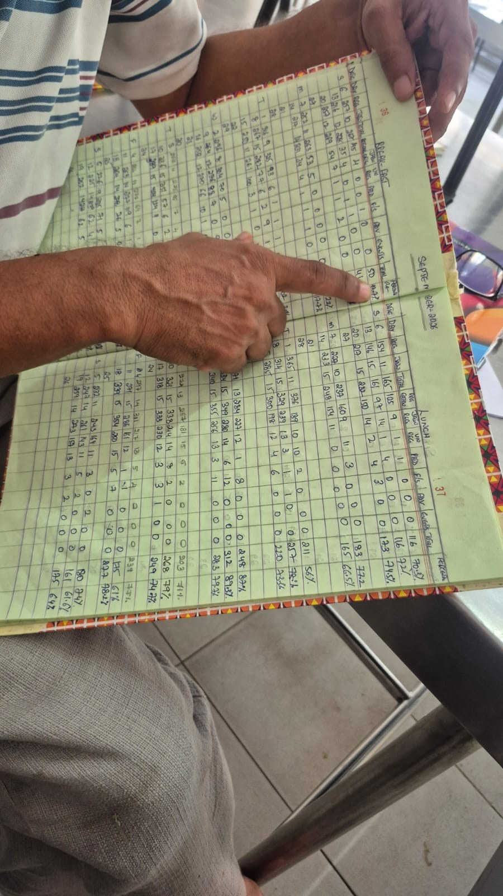
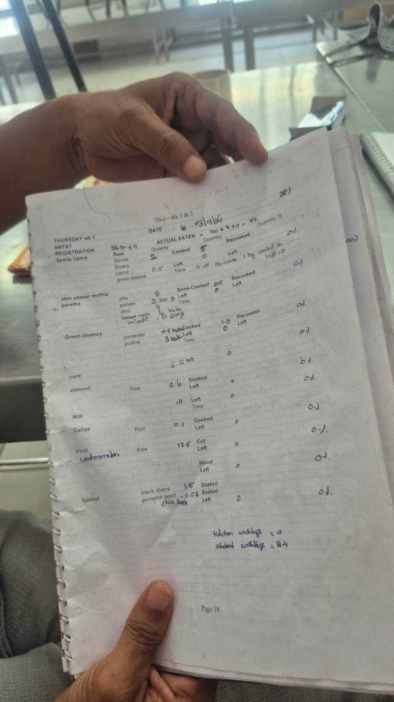
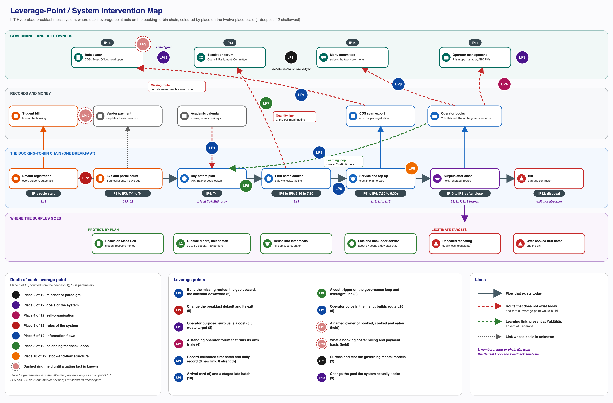
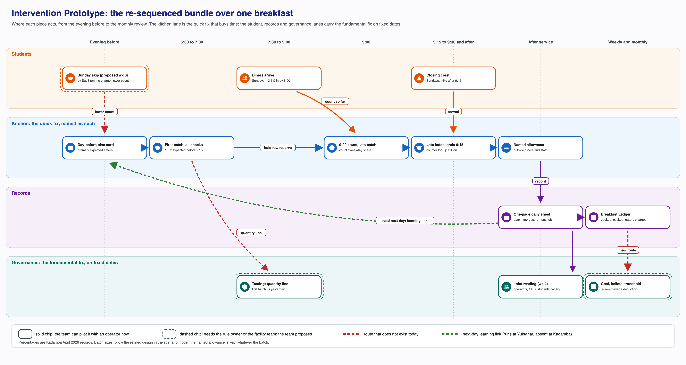
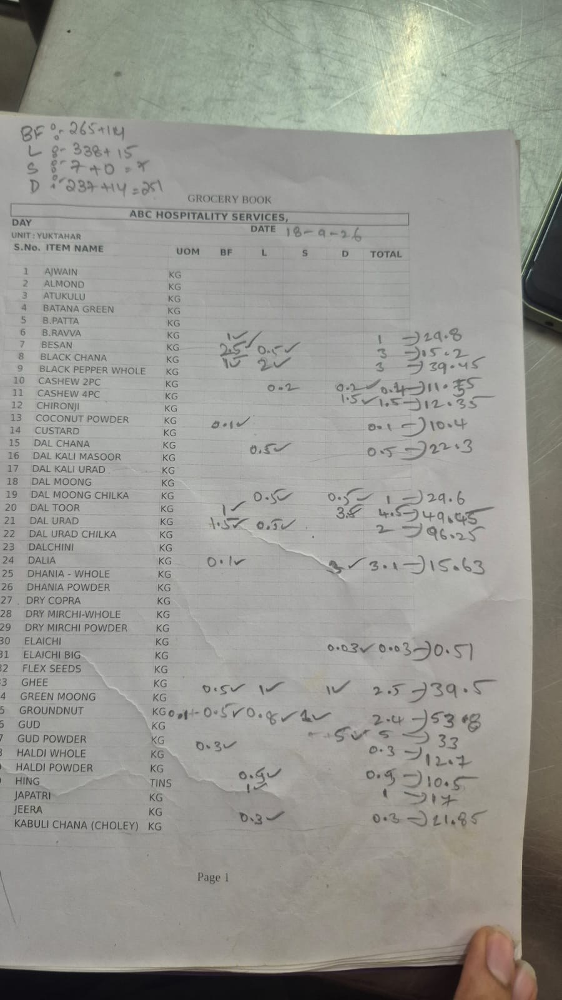
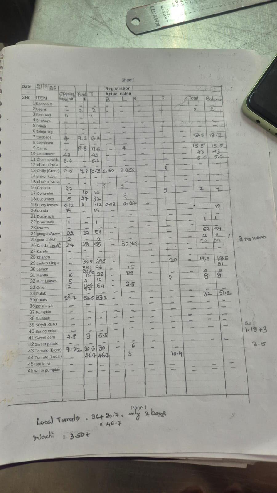
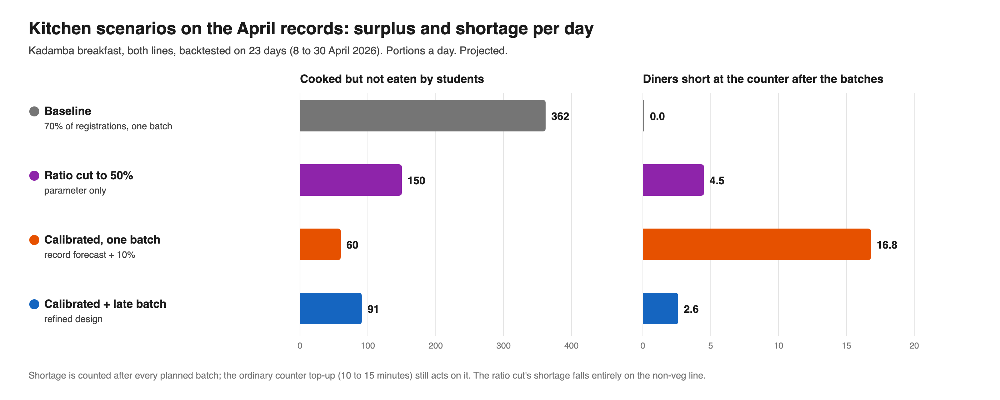
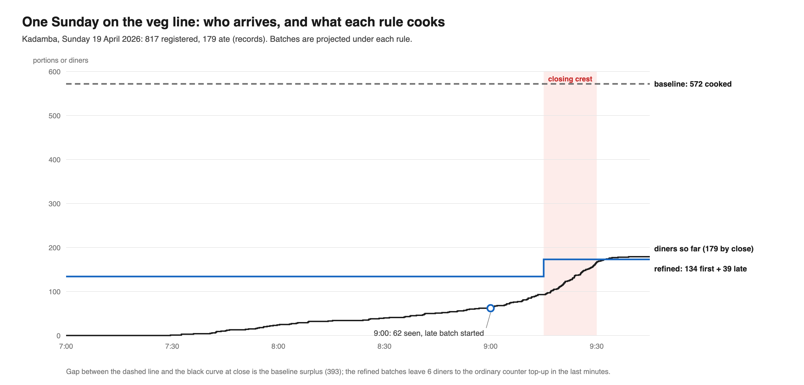
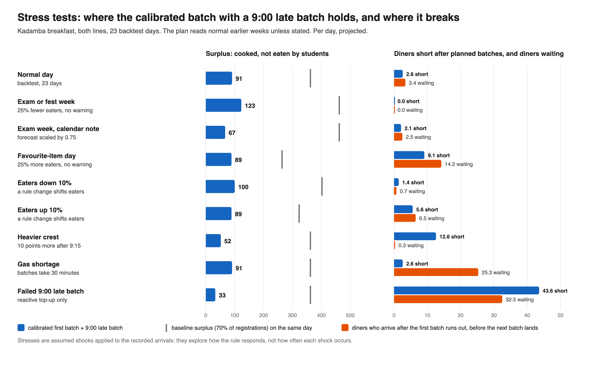
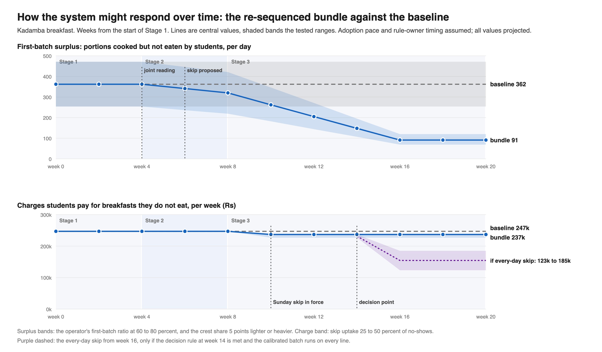

This report covers Phases 3 and 4 of the Breakfast Paradox project: why IIIT Hyderabad students are billed for breakfasts most of them never eat, and what could change that. Activity 9 locates where the system can change and produces the Leverage-Point / System Intervention Map and the Design Principles. Activity 10 tests interventions against the whole system, not any one stakeholder’s interest, and delivers the intervention concepts and prototypes, the scenario model and evaluation framework, and the recommended intervention.

The Phase 2 reframe found that the Breakfast Paradox is a stable equilibrium, not a broken system, and that three structures hold it there. Registration is an automatic default with a narrow exit: five cancellations per meal type per month, each at least four days ahead, after which the charge stands (confirmed). Billing fires at booking, not at eating (confirmed). The CDS scan record and the operators’ books measure the gap between the two, but neither reaches whoever sets the registration, billing or menu rules (confirmed).

Underneath the kitchen side sits one mechanism: registrations become a cooked first batch. Kadamba cooks a fixed 70 percent of registrations per line (single-sourced). Bakul (Vijayalakshmi Caterers) cooks 70 to 80 percent by item; its manager sets the figure each week from his read of past attendance and never lets it fall below about 70 percent, even on the quietest weekends (single-sourced). Yuktāhār plans from its books. Any kitchen will top up a batch; none will shrink one. The surplus is absorbed unnoticed: by resale, top-ups, reuse, the meals of outside diners and staff, late service, holding and reheating, and finally the bin. Each actor acts rationally on its own incentives and information; the unwanted outcome comes from how those actions connect. The design opportunity is to route existing records to whoever sets the first batch and the rules, so the system sees its own cost, and to test the beliefs fixing the working goal on the registration count.

Claims carry the project’s confidence labels. *Confirmed* means read off a record (the Kadamba April 2026 breakfast scan export, the photographed Yuktāhār registers, posted rates) or seen on site. *Single-sourced* means it rests on one account. The Kadamba operator’s figures are first-hand and not in doubt, but remain his account of his own practice; the Bakul manager’s come from a team member’s synthesis of an interview with him. With no Bakul records of any kind, no Bakul effect is sized anywhere in this report. *Candidate* is an inference combining sources, and *assumed* a judgement without direct evidence. Three labels apply only to Activity 10: *Projected* marks every scenario-model output (arithmetic on real records under stated assumptions, never an observed result), *Simulated* every stakeholder response (a reasoned expectation, not the actor’s feedback) and *Planned* every co-design test, none yet run. Loop and chain IDs (L1 to L17 and L3b) and their verdicts carry over from the Phase 2 causal loop analysis. Leverage depth is a place on a twelve-point scale counted from the deepest: place 1 is the power to transcend paradigms, place 2 mindset, place 3 the goals of the system, place 5 its rules, place 6 its information flows and place 12 its parameters.

# 1 Activity 9: Define Design Principles and Intervention Opportunities

Activity 9 works out where and how the breakfast mess system could change and produces two deliverables, the Leverage-Point / System Intervention Map and the Design Principles. It applies four methods in turn: leverage points, read against archetypes and rank; changes to rules, roles, incentives, information flows and processes; the design objective, set against the case for the status quo; and fourteen intervention points. The map and the seven principles follow.

## 1.1 Identify Leverage Points

Place 5 (rules) is used only where a rule itself changes: the default and its exit, who decides, what a booking costs, or the standing rule that keeps another lever in place. Place 9 (delays) would mean flattening the closing crest, which no lever here attempts. Places 11 and 12 appear only as settings inside a deeper lever: lowering Kadamba’s 70 percent ratio by decree would move the cost from surplus into run-outs at the crest, and the cancellation cap, raised from five to ten during a gas shortage and now back at five (single-sourced), changes only how many exits the default allows.

A lever is ruled out if it removes a mechanism that protects someone: resale on Mess Cell, reuse of leftovers, the meals of 30 to 50 outside diners and about half of Kadamba’s own staff, the walk-in buffer, late and back-door service, outside venues, informal accommodation. The over-cooked first batch, repeated holding and reheating, and the bin protect no one, so they are fair targets. Feasibility is judged for a student team, which can propose, pilot and evidence a change but cannot enact a rule. High means a prototype or pilot with an actor already engaged; medium, an evidenced proposal to an existing forum; low, a proposal only, because the holder is out of reach or the lever rests on a fact nobody yet knows.

*Table 1. The twelve leverage points*

| Leverage point | Place | Holder of the power | Feasibility |
|---|---|---|---|
| LP1 Build the missing routes | Place 6 of 12 (information flows) | CDS (scans), operators (books); receiver unnamed | High to prototype, medium to deliver |
| LP2 Change the breakfast default and its exit | Place 5 of 12 (rules) | Registration rule owner (Mess Office or CDS, unconfirmed) | Medium |
| LP3 Operator goal: surplus is a cost | Place 3 of 12 (goals) for purpose; place 8 of 12 (balancing loops) for the target | Prism management; Bakul manager and firm | Low to medium |
| LP4 A standing operator forum that runs its own trials | Place 4 of 12 (self-organisation) | Operators; CDS as convenor | Medium |
| LP5 Record-calibrated first batch with a daily learning record | Place 6 and place 8 of 12; allowances at 11 and 12 | The operator | High (Yuktāhār), medium (Kadamba), unsizeable (Bakul) |
| LP6 Crest-aware top-up and a staged late batch | Place 6 of 12 (card) and place 10 of 12 (stocks and flows) | Operators; Mess Office or CDS for the window | High (Kadamba), low (Bakul) |
| LP7 A cost trigger for attention, carried on the oversight line | Place 8 of 12 (balancing loops); rule at 5 | Escalation pathway; facility team | Medium, after LP1 |
| LP8 Operator voice in the menu | Place 6 of 12 (information flows); slot at 5 | Menu committee (unconfirmed) | Medium |
| LP9 A named owner of booked, cooked and eaten (held) | Place 5 of 12 (rules: who decides) | CFS and CDS | Low |
| LP10 What a booking costs: billing and payment basis (held) | Place 5 of 12 (rules: incentives) | Billing owner; contract holder | Low |
| LP11 Surface and test the governing mental models | Place 2 of 12 (mindset or paradigm) | Each belief’s holder | Medium |
| LP12 Change the goal the system actually seeks | Place 3 of 12 (goals of the system) | CFS and CDS | Low to medium |

**LP1: Build the missing routes.** Of Kadamba’s 32,162 breakfast registrations in April 2026, 37.1 percent were eaten. Yuktāhār’s September breakfast ran at 17.7 to 40.2 percent against lunch at 56 to 89 percent (confirmed). No route from any record to any rule owner has been found (a confirmed absence), and Yuktāhār’s two books disagree on 3 September: 77 eaten against 110 (confirmed). The fix is a standing breakfast view, the ledger, of booked, cooked, eaten and left over per hall, weekday and line (vegetarian and non-vegetarian), sent to the rule owner and back to the operators under one agreed definition of “ate”. The ledger also carries a weekly note of exams, events and holidays into the day-before planning meeting; at Yuktāhār these now arrive by word of mouth only (confirmed). The ledger must be blame-free and accept paper, since Yuktāhār has already dropped a commercial ERP system once (single-sourced). Delivery waits on a receiver: two different people are on record as head of CDS. A monthly bill line showing breakfasts paid for and not eaten is a student-facing variant, conditional on LP2; without a way to respond, it would only confirm that the charge cannot be avoided.

*Figure 1. The records already exist on paper. (a) Yuktāhār’s attendance register for September 2026, breakfast on the left page and lunch on the right, each row closing with a turnout percentage. (b) Its Wastage Book for the Thursday of weeks one and three (3 September 2026): 267 plus 11 registered and 77 eaten, with cooked, left over, re-cook time and waste recorded item by item. Field photographs, confirmed.*

 

**LP2: Change the breakfast default and its exit.** Registrations hold at about 1,070 every weekday while turnout runs from 42.1 percent on Tuesdays to 27.3 percent on Sundays (confirmed). Kadamba buys only dry goods more than four days ahead (single-sourced), and Yuktāhār takes milk daily (confirmed). The Kadamba team has already pushed back on the four-day cut-off (single-sourced), making a student-operator coalition for a shorter lead the first evidenced shared interest found so far (candidate). The lever is the default and its exit, not the cap. Options, lighter to heavier, are a one- or two-day lead, an evening-before confirm-or-skip that lowers the count, Sunday opt-in, and no registration while off campus. At Kadamba, which cooks a fixed share, a lower count shrinks the first batch directly, but only if it is the count the kitchen reads; whether Skip Meal already lowers it is an open conflict. A skip must never cost a hall slot: one Kadamba respondent books the whole month because the hall fills up (L3b, reinforcing, candidate). The payment basis is unconfirmed for every operator: the Bakul manager says plates served, while Kadamba’s remark points to registrations (both single-sourced). If Bakul’s account holds, its position on LP2 is likely neutral or favourable (candidate). If resale falls, it is because the need has gone; no absorber is removed.

**LP3: Operator goal: surplus is a cost.** The purpose would move from “cook for every booking” to “feed whoever comes, at least cost” (place 3), with a numeric target inside L11 (place 8). Under the same rules, operators state different purposes. Yuktāhār names quality, less waste, lower cost, standardisation and profit; Kadamba cooks to registrations “because it is a responsibility and they are getting paid for it”; the Bakul manager’s rule is “there should not be a shortage of food, even if some wastage occurs” (all single-sourced). At Bakul a run-out sends a complaint straight to the managing director while surplus stays silent, a kitchen-level case of a system that reacts only to what is loud (candidate). The fix is a wastage board, a target and a purpose stated by the operations manager, with the target anchored to the hall’s best recorded performance, Yuktāhār’s rate or the institution’s goal, never last month’s average, which drifts down. At Bakul it holds only as a cut to surplus with no rise in run-outs. If operators are paid on registered plates, cutting surplus lowers cost while revenue holds, though the rate may be renegotiated once savings show. Smaller portions are the cheapest cut, so the target always comes with grams per plate, taste and run-outs (P7). We can put a cost-per-line case to Prism’s operations manager, not yet interviewed.

**LP4: A standing operator forum that runs its own trials.** The operators already plan differently: Yuktāhār from a matching-week lookup and weekday register, Kadamba a fixed 70 percent, Bakul 70 to 80 percent by item with a floor of about 70 percent, topped up by phoning the Hafizpet kitchen (single-sourced; Yuktāhār’s books photographed, confirmed). Yuktāhār’s waste fell between August and December once weighing was made blame-free (single-sourced, no before-and-after figures); Kadamba keeps gram standards but no learning record. The Bakul operator believes Kadamba fills 90 to 95 percent; the records say 37 percent at breakfast (confirmed). The fix is a forum convened by CDS and hosted by Yuktāhār’s two project managers, where each hall runs its own trial and the ledger shows the results. Exchanging books alone would sit at place 6; an empowered forum using the ledger to select what works is place 4. What must transfer is the preconditions: blame-free weighing, daily discussion and a purpose that treats waste as cost. Kadamba’s layered chain of command adds a reprimand risk absent from Yuktāhār’s flat team.

**LP5: Record-calibrated first batch with a daily learning record.** L11 closes at Yuktāhār, runs as a candidate instance bounded by a floor at Bakul, and is absent at Kadamba. Creating it at Kadamba is place 6; strengthening it where it runs, place 8. Kadamba’s 70 percent becomes 100 percent for biryani lunch (single-sourced), so the ratio follows expectation rather than any record. April turnout was 32.4 percent veg and 48.5 percent non-veg (confirmed), so the batch is roughly 2.2 times what was eaten on veg and about 1.4 times on non-veg (candidate arithmetic). The fix sets the batch as the gram standard times expected turnout per hall, weekday and line, plus a named allowance for outside diners and staff and a float for bonda, puri, vada and idli, starting on the veg line with a one-page daily paper record read the next day. Kadamba already cooks about 30 extra portions for outside diners and feeds about half its staff (single-sourced), so the allowance and the raw reserve must be budgeted. The lever cannot yet be sized precisely: a 70 percent batch against about 398 eaten implies roughly 350 surplus portions (candidate), at odds with Kadamba’s stated 5 to 10 percent waste. Bakul’s manager puts turnout at most around 60 percent, under his floor of about 70 percent (single-sourced). Item-level cooked-and-eaten figures would test his weekly adjustment; the floor stays a named constraint. LP5 is a quick fix, paired with LP1 against the L17 risk and with LP6 against run-outs.

**LP6: Crest-aware top-up and a staged late batch.** At Kadamba, 26.5 percent of April scans land between 9:15 and 9:30, rising to about nine a minute by 9:29, and 9.2 percent, about 37 a day, arrive at or after 9:30, the latest at 10:07 (confirmed). The operator’s estimate of about 150 diners in the last ten minutes (single-sourced) overstates this and may drive the hedge (candidate). Yuktāhār projects from the first half hour (single-sourced), when only 15.3 percent of Kadamba’s scans have arrived (confirmed). The fix has three parts: a weekday arrival card telling the supervisor at 8:00 what share of the day has already come (place 6); a late batch started shortly after 9:00 on that basis (place 10, since it changes when stock is created); and a grace period after 9:30, always paired with the late batch. Place 9 is not claimed. The share seen by 8:00 runs from 13.5 percent on Sundays to 22.5 on Wednesdays, and the share after 9:15 from about 32 percent (Tuesdays, Wednesdays) to about 46 (Sundays) (confirmed; used as factors, candidate), so one flat factor would misread Sunday and Wednesday by about a quarter. None of this transfers to Bakul, where the manager puts his rush at 8:00 to 8:30 and aims to have food ready for about 50 diners at 9:20 (single-sourced). A top-up there needs a phone call, cooking at the Hafizpet kitchen and a drive of about 8 km, roughly 20 minutes if called early and 40 otherwise; the end-to-end lead time has never been measured. There the lever is the size of the held reserve and the latest call that can still land, both set from measured data; the reserve is a hedge, not an absorber (candidate). LP6 is part of the quick fix.

**LP7: A cost trigger for attention, carried on the oversight line.** Loud menu fatigue was fixed through the Student Council, Parliament and CDS Committee (confirmed, L4); the far larger breakfast gap never entered that pathway. The facility team tastes every Kadamba meal with two Prism staff (confirmed, observed) but never checks quantity. The fix is a standing threshold, such as cooked-against-eaten above a set level for several weeks, that sends the case to the Committee as complaints already do. It is anchored to the stated goal, lunch turnout or Yuktāhār’s rate, never the hall’s past, and reports run-outs with surplus. The cheapest carrier is one extra line at the tasting. An inspector recording quantity can look like an audit, so a breach triggers a review, never a deduction, and the line adds no delay to safety.

**LP8: Operator voice in the menu.** At Kadamba, uttapam, set dosa and upma waste the most while puri, bonda, vada and idli move well (single-sourced), yet students or the committee choose the menu, not the kitchen. The Bakul manager wants menu input and knows what sells (pav bhaji) and which pairings he thinks work (kachori with chole) (single-sourced); his view that students would eat more of familiar pairings is untested with residents. The fix is a standing operator slot at each two-week menu cycle to report item waste and run-outs, building the missing route L16 as the quiet counterpart to L4. Operator input is read with consumption records and checked against residents’ views: a voice, never authority. No pairing view counts as student evidence alone.

**LP9: A named owner of booked, cooked and eaten (held).** Decision rights are split at least five ways, across registration, billing, menu, cooked quantity and the academic calendar (confirmed). Whoever sets registration and billing rules bears none of the cost they produce. A named owner, not a committee, would put the consequence where the decision is made and inherit LP1; Yuktāhār’s Wastage Register keeper is a lighter version. The lever is held until the head of CDS is identified.

**LP10: What a booking costs: billing and payment basis (held).** Attendance-tracked billing ran during an LPG shortage and some holiday and fest periods, and it worked (confirmed). Operators are paid monthly as a lump sum on plates, with deductions (single-sourced, noisy audio). The Bakul manager says plates served (single-sourced), though “served” is the normalised wording of one remark; Kadamba’s “paid for it” is a hint, not a contract term. No contract has been seen, and the basis may differ by operator. The lever is held because a billing change made blind to the payment terms could push the operator incentive the wrong way, and student reliance on resale income needs checking first.

**LP11: Surface and test the governing mental models.** The beliefs holding the default, the fixed ratio and the unrouted gap in place sit at the base of the Iceberg chains; nobody can change them for someone else. Eight meet a record that does not fit; the four Bakul beliefs meet none yet, so a test record is named for each.

*Table 2. Governing beliefs and the records they meet*

| Belief (holder, confidence) | What the record shows | Sign of a shift |
|---|---|---|
| Registration count stands in for demand (administration; candidate) | 37.1 percent eaten at Kadamba in April; flat count against 27.3 to 42.1 percent by weekday (confirmed) | Rule owner cites booked against eaten |
| “Attendance billing is for emergencies” (candidate) | It ran and worked in the shortage and some fest periods (confirmed) | Discussed for Sunday breakfast |
| “Cooking to registrations is what we are paid for” (Kadamba; single-sourced) | Yuktāhār plans the same booking from records (confirmed) | Batch set in expected eaters |
| “Breakfast is about 50 percent” (Yuktāhār site head; confirmed) | His register shows about 28 percent (confirmed) | Stated and planned figures match the register |
| “Student fluctuation is very high” (Yuktāhār; confirmed) | Weekday arrival profile is regular (confirmed; projection candidate) | A staged cook is tried and tracked |
| About 150 in the last ten minutes (Kadamba; single-sourced) | About 79 scans a day from 9:20 to 9:29 (confirmed) | Supervisor’s prior guess comes close |
| “We don’t have any opportunity to nullify it” (students; confirmed) | The exit exists but is narrow | Skip use rises after LP2 |
| “They are catching us” (Yuktāhār staff; single-sourced) | Dissolved once weighing was made blame-free | Sheets filled unprompted |
| At most about 60 percent come (Bakul manager; single-sourced) | No record; other halls show about 37 and 28 (confirmed). Test: Bakul scans | Batch follows Bakul’s scans |
| Students skip for taste, menu or sleep (Bakul manager; single-sourced) | No resident asked; six students elsewhere cite late sleep most (confirmed). Test: residents’ reasons | Menu changes follow residents’ reasons |
| Pairings, not dishes, are the problem (Bakul manager; single-sourced) | No item or pairing record. Test: cooked and eaten by pairing | Proposal arrives with figures |
| “There should not be a shortage of food, even if some wastage occurs” (Bakul manager; single-sourced) | No record of how often a smaller batch would run short. Test: daily run-out record | Floor and reserve set from that record |

Each session starts from the ledger, settles disagreements by the record, pairs advocacy with inquiry and points at specific anomalies such as 50 against 28; at Bakul, which has no record, one must be built first. Effort goes to actors already open to the data, and holders of tested views are made visible.

**LP12: Change the goal the system actually seeks.** The CDS poster gives the institution’s goal as minimising food wastage through advance meal planning (confirmed). The goal it actually seeks is the registration count: students are billed on it (confirmed) and Kadamba cooks on it (single-sourced); treating these together as the working goal is a candidate reading. The stated goal’s measure is recorded but read by no one (confirmed). The fix makes booked-against-eaten and cooked-against-eaten, per hall and line, the real indicators, read with quality and run-outs, since a wastage goal alone could be met by running short (candidate). CFS and CDS carry this by restating their own goal and asking for its indicators. LP12 is the move from the registration count to cooked-against-eaten; the other levers make that move possible.

### Identify System Archetypes

Of six structures checked, only the first three read as present.

*Table 3. Archetype reading*

| Archetype | Loops and evidence | Confidence | Way out and levers |
|---|---|---|---|
| Shifting the burden | Quick fix L11, L12, L9, L1 (resale); fundamental fix withered (L10 route, L13 upward link, L2, reverted L6); side effect L17. Resale replaces Skip Meal; attendance billing reverted (confirmed) | Candidate; the link from kitchen competence to less pressure upstream is assumed | Strengthen the fundamental fix (LP1, LP2, LP12, LP10); name the quick fix (LP5, LP6); P5 |
| Balancing process with delay | L12, L14. Top-up of 10 to 15 minutes against the crest; at Bakul a 20 to 40 minute drive and a held reserve | L12 confirmed; delays single-sourced; overshoot candidate | Be more responsive; do not over-correct (LP6) |
| Fixes that fail | December 2024 cap tightening; a candidate ratio ratchet on L14 (premise only); reheating branch of L13. No backfire observed | Candidate | Make the implicit target explicit (LP3, LP5, P2) |
| Eroding goals | Stated goal against the count; “this cannot be helped”; 50 against 28. No lowered target on record | Not established; a risk (assumed) | Anchor standards outside (LP3, LP7, LP12) |
| Accidental adversaries | Operators and rule owner (L10, L16). No antagonism found | A risk if the ledger reads as audit | Map the structure together (LP4, LP11, P2) |
| Commons or success to the successful | L3b (candidate); Kadamba full, Bakul under-registered; no Bakul or Palash records | Low, outside scope | None; LP2’s hall-slot condition guards L3b |

Shifting the burden orders the whole set. LP5 and LP6 are the quick fix, worth doing because students eat the food saved and it buys time, but the ledger must label them so: a better-run kitchen presented as the answer would end the search for the fundamental fix (the L17 risk). LP1, LP2, LP11 and LP12, with LP10 once released, form the fundamental fix, and LP12 answers the sharpest finding of the problem analysis, that the system chases the wrong goal. One past change pushed the wrong way: the cap was tightened in December 2024 to ease Mess Office workload, narrowing the exit (single-sourced; effect on no-shows candidate). We withdraw an earlier reading that Bakul raised its ratio from 70 to 80 percent after run-outs; the figures describe variation by item and day.

### Ranking: Depth and Feasibility

Depth combines place with role, so a fundamental-fix lever outranks a quick fix at the same place. Feasibility is judged for a student team over the weeks remaining.

*Table 4. Ranking of leverage points*

| Rank | Lever (place) | Role | Depth / feasibility | Gated on |
|---|---|---|---|---|
| 1 | LP1 (6) | Fundamental, enabling | High / high to prototype | A named receiver |
| 2 | LP11 (2) | Fundamental | Very high / medium | The ledger |
| 3 | LP2 (5) | Fundamental | High / medium | Lowering the kitchen’s count |
| 4 | LP12 (3) | Fundamental | Very high / low to medium | CFS and CDS |
| 5 | LP3 with LP4 (3, 8; 4) | Links both | High / low to medium | Access to Prism management |
| 6 | LP5 with LP6 (6, 8; 6, 10) | Quick fix | Medium / high to low by hall | Waste base; Bakul records |
| 7 | LP7 (8) | Fundamental | Medium / medium | Facility team’s parent body |
| 8 | LP8 (6) | Fundamental | Medium / medium | Records and resident views |
| Held | LP9 (5) | Fundamental | High / low | Head of CDS |
| Held | LP10 (5) | Fundamental | High / low | The plate basis |

LP1 ranks first, though shallower than LP11, LP12 and LP2, because every other lever needs its input. LP11, the deepest, needs the ledger first. LP2 is the deepest rule lever not gated on the plate basis. LP12 is fourth because nobody who could carry it has engaged, and a goal without indicators or an exit does nothing alone. LP3 and LP4 carry the goal into the operator’s routine; Kadamba has the information but no reason or routine to use it. LP5 and LP6, the fastest physical levers, are the quick fix, unsizeable until the waste conflict is settled, and at Kadamba they land only through LP3 and LP4. LP7 outranks LP8 because it gives governance a response to cost; LP9 and LP10 are held, not dropped.

## 1.2 Explore Changes to Rules, Roles, Incentives, Information Flows and Processes

*Table 5. Changes by type*

| Type | Current state | Candidate change | Lever |
|---|---|---|---|
| Rules | Automatic registration; five cancellations per meal type per month, four days ahead (confirmed) | Shorter lead; evening skip that lowers the count; Sunday opt-in; no hall-slot penalty | LP2 |
| Rules | Attention follows loud complaints (L4); billing at booking; back-door entry after 9:30 cannot be refused (single-sourced); no protection for recorders | Standing cost threshold; consumption billing as already run; grace period with late batch; no deductions from recorded figures | LP7, LP10, LP6, LP1 |
| Roles | Facility team checks safety and taste; nobody convenes operators or owns the outcome; menu chosen without operator input | Quantity line at tasting; CDS-convened forum; named owner; operator menu slot; CFS and CDS as goal carrier | LP7, LP4, LP9, LP8, LP12 |
| Incentives | A non-eater pays anyway; Skip Meal returns nothing (confirmed); recording read as being caught; shortage loud, surplus silent (candidate, L14) | A later exit that removes the charge; surplus shown as cost; blame-free recording; late batch or sized reserve | LP2, LP3, LP5, LP6 |
| Information flows | Records reach no rule owner; two definitions of “ate”; calendar by word of mouth; no kitchen-to-menu route (L16) | The ledger; bill line after LP2; weekly calendar note; item waste into menu cycle | LP1, LP8 |
| Processes | Fixed 70 percent at Kadamba, weekly judgement with floor at Bakul, no record; whole hedge cooked at start | Calibrated batch with daily record; arrival card; late batch after 9:00; safety steps unchanged | LP5, LP6 |

The widest rule change costs the kitchen least: the four-day lead only protects dry goods. The incentive finding depends on how plates are paid. On registered plates, cutting surplus lowers cost while revenue holds, a route open now that closes if the rate is renegotiated and turns harmful if surplus is cut through smaller portions. On served plates, the gain and the pressure to serve more both grow. If the Bakul manager’s account holds, Bakul already absorbs the cost of uneaten portions to avoid shortage (candidate). P7’s paired measures cover both cases.

### The Natural Comparison

Kadamba and Yuktāhār share registration, billing and, as far as is known, tendered plate payment. Yuktāhār plans from records, re-cooks by run-out time and weighs blame-free on paper (books confirmed, practice single-sourced); Kadamba cooks a fixed ratio. A learning practice is thus possible under current rules, but the halls differ in five other ways, so the comparison cannot prove the cause.

*Table 6. Rival explanations*

| Rival explanation | Kadamba | Yuktāhār |
|---|---|---|
| Scale | About 1,070 registrations a day | About 230 to 400 a day |
| Menu and lines | Veg and non-veg | Veg only, with Jain service |
| Firm and layers | Prism, four-level chain | ABC Hospitality Services, flat team |
| Month of records | April 2026 | September 2026 |
| Measurement | CDS scan export | Handwritten registers |

Two claims stay candidate: that the difference is goal and culture, and that LP3 through LP6 work without a rule change. The gap is similar at both halls (63 percent unused at Kadamba, about 72 percent at Yuktāhār, confirmed). Kitchen practice reduces waste and run-outs, but only LP2, LP10 and the goal-and-belief levers move the booking. Bakul, a third regime with its own rival explanations (an off-site kitchen, a different payment report), needs its own records before joining the comparison.

## 1.3 Develop Design Principles

The objective is a breakfast system where registration matches each student’s intent, the kitchen cooks to expected eaters, and the cost of any gap reaches whoever sets the rules. It does not mean ending registration, resale or all waste. Registration gives the planning count, resale recovers money, and some surplus is the price of never running out. Over-booking and over-cooking should become noticed exceptions. The guiding idea, from the archetypes: change the architecture instead of competing at the kitchen layer.

The status quo persists because it pays each actor something.

*Table 7. The case for the status quo*

| Actor | What it gives | Cost of change | Cost of not changing |
|---|---|---|---|
| Students | No decision; a guaranteed seat; resale income | A nightly decision; less resale | Paying for uneaten breakfasts (63 percent of Kadamba’s April registrations); reheated food |
| Prism (Kadamba) | Revenue possibly on registered plates; few run-outs | Possible revenue fall; a daily record | Food cooked that no one eats; reheating |
| Bakul operator | No shortage, secured by a floor and reserve (single-sourced) | A check on the manager’s judgement | Food held hot for hours, softening items such as aloo paratha |
| CDS | Low workload | A standing ledger; portal changes | A stated goal it cannot show it meets |
| Staff and outside diners | Food from surplus | Meals must be budgeted | Meals stay a by-product |
| CFS | A predictable budget | A budget varying with consumption | Spending on food nobody eats |

The levers keep what each actor values (the seat, the resale, the absorbers, run-out protection) and change what drives over-booking. CDS and the Mess Office gain most from low workload and own the rules the fundamental fix touches, so LP1, LP11 and LP12 must reach them before any rule proposal.

## 1.4 Identify Potential Intervention Points

The fourteen intervention points follow a breakfast from booking to bin, then its governance.

*Table 8. Intervention points*

| IP | Where and when | What happens today | Levers |
|---|---|---|---|
| IP1 | Default registration, each cycle | Every student registered, on campus or not | LP2, LP11 |
| IP2 | Cancellation exit, four days ahead | Five cancellations; Skip Meal removes no charge | LP2 |
| IP3 | Kitchen’s count, evening before | Registrations; Skip Meal effect in conflict | LP2 |
| IP4 | Day-before plan; Bakul’s weekly review | Lookup, fixed ratio or judgement with floor | LP5, LP1, LP3, LP4, LP11 |
| IP5 | First batch and safety, 5:30 to 7:30; Bakul from about 3 AM | Whole hedge cooked before any signal | LP5, LP7 |
| IP6 | Tasting and weekly inspection | No quantity check | LP7 |
| IP7 | First half hour, 7:30 to 8:00 | Flat projection or judgement | LP6 |
| IP8 | Counter check, about 9:00; Bakul phone top-up | 10 to 15 minutes; 20 to 40 at Bakul | LP6 |
| IP9 | Crest and back door, 9:15 onward | A quarter of scans in fifteen minutes | LP6 |
| IP10 | Surplus after close | Held, reheated, reused; eaten by outside diners and staff; some returned to the Hafizpet kitchen | LP5 |
| IP11 | Daily record | Wastage Book at Yuktāhār only | LP5, LP4 |
| IP12 | Disposal | Bin to contractor at Kadamba | LP1 |
| IP13 | Records to rule owners | Export reviewed by no one | LP1, LP7, LP9, LP11, LP12 |
| IP14 | Menu cycle, two-weekly | No operator input or forum | LP8, LP3, LP4, LP11 |

Monthly billing and vendor payment carry LP10 and LP1’s bill line. Bakul needs no point of its own, since its dispatch is IP5 and its phoned top-up is IP8 with a longer delay.

### Sunday Breakfast: Where Three Levers Meet

Sunday has Kadamba’s lowest turnout, 27.3 percent, against about 1,070 registrations (confirmed). A 70 percent veg batch is about 3.1 times what Sunday diners ate, against about 1.9 times on Tuesdays (candidate arithmetic), and about 46 percent of Sunday scans arrive after 9:15 (confirmed). Yuktāhār’s Sundays run at 17.9 to 24.1 percent (confirmed). The Bakul manager calls weekends “very low” (single-sourced) but gives no figure, so the slice stays specific to Kadamba’s veg line. LP2 (IP1 to IP3), LP5 (IP4) and LP6 (IP8, IP9) bite hardest on Sunday, the natural first slice for Activity 10.

## 1.5 Deliverable 1: Leverage-Point / System Intervention Map

The map draws breakfast as one chain from the automatic default through the day-before plan, first batch, service and surplus to the bin, with records and money above and governance on top. Markers are coloured by place; LP5 and LP6 appear once per part, LP3 at its deeper part, and a dashed ring marks a held lever. Dashed red lines are routes that do not exist today and that a lever would have to build; the dashed green learning link runs at Yuktāhār and is absent at Kadamba. Grey tags carry the intervention points, with IP13 and IP14 at the governance bodies the dashed routes would reach.

*Figure 2. Leverage-point and intervention map for the breakfast mess system*

Every solid flow runs along the chain or up into a record, and stops there. The levers that build a route, set a goal, test a belief or convene operators (LP1, LP3, LP4, LP7, LP8, LP11, LP12) sit on routes or bodies not yet doing that work; the rule levers (LP2, LP9, LP10) sit on the booking, the bill and the owner those routes would reach. The learning link, confirmed at one hall of three, is the only working feedback into the day-before plan. Bakul’s weekly review is a candidate second instance, bounded by its floor and not yet drawn.

*Table 9. Map table*

| Intervention point | Levers (place) | Holder of the power | Absorber check |
|---|---|---|---|
| IP1 to IP3 Default, exit, kitchen count | LP2 (5); LP11 students’ belief (2) | Rule owner and portal owner; student representatives | Resale need shrinks; none removed |
| IP4 Day-before plan | LP5 (6 Kadamba; 8 Yuktāhār, Bakul); LP1 calendar (6); LP3 (3, 8); LP4 (4); LP11 operator beliefs (2) | Operators; academic administration via CDS; Prism management | Budget outside diners, staff and reserve |
| IP5, IP10, IP11 Batch, surplus, record | LP5 (6, 8); LP4 (4) | Operator | Keep safety steps and raw reserve; diners fed by allocation |
| IP6 Tasting and inspection | LP7 (8; 5 for the rule) | Facility team; escalation pathway | Adds no delay to safety |
| IP7 to IP9 Projection, top-up, crest | LP6 (6, 10) | Supervisor; Yuktāhār team; Bakul manager; Mess Office or CDS for the window | Keeps back-door service, made explicit; Bakul reserve sized |
| IP12, IP13 Disposal, records upward | LP1 (6); LP7 (8); LP9 (5); LP11 (2); LP12 (3) | CDS, receiver unnamed; CFS and CDS | Bin is a target |
| IP14 Menu and management | LP8 (6); LP3 (3, 8); LP4 (4); LP11 (2) | Menu committee (unconfirmed); Prism management | Removes nothing |
| Monthly billing | LP10 held (5); LP1 bill line (6) | Billing owner; contract holder | Check reliance on resale |

Only LP5 and LP6 touch an absorber that protects someone, and both are written to keep it intact. LP5 budgets outside diners and half of Kadamba’s staff by name and keeps reuse, the walk-in buffer and the top-up reserve; LP6 keeps them too and makes late and back-door service explicit with a late batch. LP2 and LP10 shrink resale by removing the need for it, not the market itself. LP1 records repeated reheating and the bin; LP3 through LP6 cut them directly, and LP2, LP10, LP11 and LP12 upstream. No lever removes an absorber to create a signal, though that does not mean no lever costs anyone anything.

*Table 10. Stakeholder impact check*

| Stakeholder | Gains | Bears | Levers |
|---|---|---|---|
| Students | A later exit; less reheated food; fewer late run-outs; an honest bill | A nightly decision; possible loss of resale income | LP1, LP2, LP5, LP6, LP10, LP11 |
| Prism (Kadamba) | Lower food cost; fewer late shortages | Possible revenue loss and rate renegotiation; a daily record | LP2, LP3, LP5, LP6, LP10 |
| Kadamba supervisor, staff, storekeeper | A clearer late-batch rule; issues matched to a plan | A 9:00 cook decision, a daily sheet, blame risk, a varying batch | LP5, LP6, LP7 |
| Yuktāhār operator | A menu voice; a better breakfast anchor | Hosting time; its site head’s figure set against his own register | LP4, LP5, LP8, LP11 |
| Outside diners and Kadamba staff | Meals by allocation, not accident | Being squeezed if the allowance lapses | LP5 |
| Rule owner (CDS or Mess Office) | The gap visible in its own terms | A ledger, a threshold to answer, portal changes, an ownership role | LP1, LP2, LP7, LP9, LP12 |
| CFS and facility team | Evidence the goal is met; a remit reaching quantity | A less predictable budget; being seen as auditors | LP7, LP10, LP12 |
| Bakul operator | A check on its judgement; a menu voice; no revenue loss from LP2 if paid on plates served (candidate) | Requests for records it may not keep; any rise in shortage risk | LP2, LP3, LP5, LP6, LP8, LP11 |

Each actor has a rational reason to keep the present arrangement, so resistance is expected and is not a fault to fix. The Kadamba operator loses most from LP2 yet is most needed for LP5, so at Kadamba LP3 and LP4 come before LP5. At Bakul the likeliest objection is to anything raising shortage risk (candidate, held behind the unconfirmed plate basis).

## 1.6 Deliverable 2: Design Principles

Seven principles follow from the leverage points, archetypes and evidence, and every Activity 10 concept must pass all seven.

**P1: Route before you measure, and route on paper.** The CDS export, Yuktāhār’s books and Kadamba’s own stated waste share already measure the gap; connect them to the decisions needing them before adding any instrument. Yuktāhār dropped a commercial ERP system over cost and staff readiness (single-sourced), so routes start from a book page and use existing channels: the daily meeting, the tasting, the menu cycle. Ruled out: new apps, sensors or forecasting software as a first step, surveys re-measuring what records hold, and designs that need operators to go digital.

**P2: Make measurement blame-free, and judge it over months.** No recorded figure may justify a deduction against the staff who recorded it, and results are judged over months, not days. Yuktāhār’s weighing worked only once it was blame-free and discussed daily, and waste took from August to December to fall (single-sourced). One run-out after a smaller batch, judged over a week, would bring the hedge straight back. So no quantity checks framed as audits, no waste-linked deductions and no one-week trials.

**P3: Change the default, the goal and the belief, not the people.** Target the default for students, the goal for operators and the institution, and the beliefs holding both, treating every actor as rational given its incentives and information. Students are registered by a default they never chose and hold the least power; operators run the only working balancing loops (L11, L12); the institution states one goal and pursues another. This rules out nudges and campaigns aimed at students, the “students should just register more accurately” logic, blaming operators, and changing the cancellation count while the default stays untouched.

**P4: Act on the first batch the day before, and on the morning only through the top-up.** Morning levers work only through smaller, later top-ups or, where a top-up cannot land in time, a sized reserve. No lever may cut waste by raising shortage risk, and scope stays per hall, weekday, line and, where records allow, item. Kadamba fixes the batch three and a half to four hours before the crest, Bakul can start cooking around 3 AM (single-sourced), and arrival curves and line turnouts (32.4 against 48.5 percent) differ widely. Ruled out: same-morning signals aimed at the first batch, shorter safety steps, one ratio for everything, waste cut through run-outs, and carrying one hall’s rule to another before that hall has records.

**P5: Feed the absorbers by plan, name them as symptomatic outlets, and target only the over-cooked batch, repeated reheating and the bin.** A concept that shrinks surplus must name who eats it and budget their meals; the ledger lists absorbers as outlets of the gap, never solutions. Thirty to fifty outside diners and about half of Kadamba’s staff already eat this food (single-sourced), and calling their meals “not wasted” would hide the gap again, the shifting-the-burden trap in miniature. This rules out restricting resale, closing the back door, cutting the batch without an allowance, and reporting absorbed surplus as success.

**P6: Measure success as cooked against eaten, run-outs and food quality, not turnout.** Success is the cooked-eaten gap, run-outs, food quality as eaten (holding time and texture as well as temperature and taste), and whether the cost reaches a rule owner; falling waste with rising run-outs does not count. Some skipping is legitimate (confirmed across interviews). Bakul’s food, held at about 60 to 72°C, keeps its temperature while aloo paratha softens (single-sourced). So no turnout targets or attendance drives, no waste cuts sized before Kadamba’s own 5 to 10 percent base is known, and no temperature-only quality checks.

**P7: Measures are diagnostic and plural, never a single target.** Measures are for learning, never reward or penalty, and cooked-against-eaten always comes with grams served per plate, taste and quality, and run-outs. A kitchen held to one figure can meet it by cutting portions or letting the crest run short; a vendor rewarded on it can meet it through the rate. Paired measures close both routes, and the targets in LP3 and LP7 serve review and are not to be gamed. This rules out a single headline target, any bonus, deduction or ranking tied to one ledger figure, and waste figures reported alone.

# 2 Activity 10: Design, Test and Evaluate Interventions

Activity 10 develops and tests interventions for system-level outcomes rather than one stakeholder’s interest. It yields the intervention concepts and prototypes (Deliverable 3, the first two sections below), the scenario model and evaluation framework (Deliverable 4, from the scenario model through the unintended consequences) and the final system design recommendation (Deliverable 5, after the refinement). The shifting-the-burden reading from Activity 9 sets the order. The kitchen levers (LP5 and LP6) are the quick fix: they save food and buy time but leave unchanged why too many plates are booked and cooked. The fundamental fix (route, default and exit, goal and beliefs: LP1, LP2, LP12 and LP11) is therefore run by the recommendation on fixed dates whatever the kitchen pilot shows.

## 2.1 Generate Alternative Interventions (Deliverable 3: Intervention Concepts)

The concepts target the three confirmed structures holding the equilibrium (registration as a standing default with a narrow exit, billing at the booking, and a measured but unrouted gap) and the step where registrations become a first batch. Kadamba cooks a fixed 70 percent of registrations per line; Bakul (Vijayalakshmi Caterers) cooks 70 to 80 percent by item, set weekly by its manager’s judgement and never below about 70 percent (both single-sourced); Yuktāhār plans from its own books. Any kitchen can top up a batch, but none will shrink one. Concept G is a deliberate foil, kept in every test so its failure is demonstrated by the tests themselves.

*Table 11. The eight intervention concepts*

| Concept | Leverage points (place) | Intervention points | Role |
|---|---|---|---|
| A: The Breakfast Ledger | LP1, LP7; LP9 later (6, 8; 5 for the threshold) | IP13, IP6, IP12, IP4 | Fundamental: route |
| B: The Kitchen Learning Kit | LP3, LP4, LP5 (3 to 8) | IP4, IP5, IP10, IP11, IP14 | Quick fix, carried by operator levers |
| C: The Crest Plan | LP6 (6, 10) | IP7, IP8, IP9 | Quick fix |
| D: The Sunday Exit | LP2 (5) | IP1, IP2, IP3 | Fundamental: default and exit |
| E: The Operator Menu Slot | LP8 (6) | IP14 | Fundamental: route |
| F: Billed at Consumption | LP10 (5) | Billing, outside the daily chain | Fundamental, held |
| G: Ratio Cut to 50 Percent | None (place 12 parameter) | IP4, IP5 as a number | Foil |
| H: The Shared Reading | LP11, LP12 (2, 3) | IP13, IP14, IP4, IP1 | Fundamental: goal and belief |

**A: The Breakfast Ledger.** Each week the CDS scan export and the operators’ books merge into one sheet per hall, by weekday and line, with the money charged for uneaten breakfasts. Kitchen levers shrink surplus but leave that charge flat until a rule moves, so a falling surplus cannot pass for “problem solved”. A cooked-against-eaten threshold, anchored outside the hall’s own past, alerts the escalation forum beside the existing complaint trigger; a weekly note of exams and events goes to planning. A routes L10, adds a second trigger to L4, counters L17 and brings L7’s exam dips to the kitchen (P1, P2, P6, P7).

**B: The Kitchen Learning Kit.** Kadamba’s fixed ratio becomes a day-before plan card from expected eaters, allowing by name for the 30 to 50 outside diners and about half of Kadamba’s staff, with a daily paper sheet read next day. An operator forum, convened by CDS and hosted by Yuktāhār’s project managers, carries over the preconditions behind Yuktāhār’s Wastage Book: blame-free weighing, daily discussion and surplus treated as cost. At Bakul, whose manager already adjusts weekly by item, the kit works more as a check than a new rule; the floor stays until a record shows how often a smaller batch would run short, and nothing there is sized yet. B creates L11 at Kadamba (a candidate second instance at Bakul), shortens L13’s kitchen half and reaches L8 through cost (P1 to P7).

**C: The Crest Plan.** At 9:00 the supervisor projects the day from a weekday arrival card and starts a late batch that lands by about 9:15, before the crest, so the first batch covers only earlier diners. A grace period after 9:30 covers only late-batch food. All of it depends on Kadamba’s 10 to 15 minute on-site top-up. A Bakul top-up needs a phone call, cooking at the Hafizpet kitchen and a 20 to 40 minute drive (single-sourced), so its hedge is about 50 portions held at 9:20 (candidate), and C there means sizing that reserve and the latest call that can still land. C gives L12 sight of the crest, removes L14’s reason to hedge and bounds L15 (P4, P5, P6).

**D: The Sunday Exit.** Sunday, the lowest-turnout day at both recorded halls, is drafted first as opt-in, charged only if confirmed by 8 pm Saturday; a student who forgets to confirm pays the walk-in rate. A lighter variant keeps the default and adds a skip, open until the same hour, that removes the charge and lowers the kitchen’s count. Other days keep the four-day lead and the cap of five cancellations, and no skip may cost a hall place. D acts on L13’s booking end, on L2 (Skip Meal fails because a skip now returns nothing) and on L1 (P3, P4, P5).

**E: The Operator Menu Slot.** At each two-week menu cycle, operators bring the items that wasted most (uttapam, set dosa and upma at Kadamba, single-sourced) and those that ran out. Since the Bakul manager thinks pairings are the real problem (single-sourced), operator input counts as a voice, never authority, read with consumption data and residents’ wishes. E supplies L16’s missing link, a loop only once used (P1, P6).

**F: Billed at Consumption (held).** Breakfast is charged on the scan, as during an LPG shortage and some fest periods (confirmed), acting on L1, L2, L6 and L8 (P3, P5, subject to a check on resale income). It is held until each operator’s payment basis is confirmed: the Bakul manager reports plates served (single-sourced), but the Kadamba operator says it cooks on, and is paid for, registrations.

**G: Ratio Cut to 50 Percent (foil).** Kadamba’s first batch drops from 70 to 50 percent by instruction, with no record, late batch or allowance. It changes no loop and breaks P4 and P5.

**H: The Shared Reading.** Joint sessions around the ledger ask each belief holder what produces their figure and what would change it, covering the Yuktāhār site head’s “about 50 percent” against his own register at about 28, the Kadamba supervisor’s crest prediction and the registration side’s reasons for the automatic default. The Bakul manager’s beliefs wait on a Bakul record. CFS and CDS are asked to adopt the CDS poster’s existing goal (minimising food wastage through advance planning) as two indicators, booked-against-eaten and cooked-against-eaten, read beside P7’s quality measures. H acts on the mental models under every chain and the working goal behind L10, L13 and L17 (P2, P3, P6, P7).

## 2.2 Develop Scenarios and Prototypes (Deliverables 3 and 4: Prototypes and Scenario Model)

*Figure 3. The re-sequenced bundle across one breakfast*

*Figure 3. The re-sequenced bundle across one breakfast: the kitchen lane is the quick fix, while the student, records and governance lanes carry the fundamental fix on fixed dates*

### Prototypes

**Prototype A: the ledger sheet.** One A4 page per hall per week, filled from the CDS export and the operator’s daily sheets, handwritten if need be and typed up later, as Yuktāhār does with its books (single-sourced).

*Table 12. Prototype A, the ledger sheet, filled for Kadamba on Sunday 19 April 2026*

| Weekday | Line | Registered | First batch and top-ups | Eaten (scans) | Left over, and where it went | Run-out time | Charged, not eaten |
|---|---|---|---|---|---|---|---|
| Sunday | Veg | 817 | From the sheet | 179 | From the sheet: outside diners, staff, reuse, bin | From the sheet | 638 × ₹48 = ₹30,624 |
| Sunday | Non-veg | 252 | From the sheet | 94 | As above | From the sheet | 158 × ₹66 = ₹10,428 |

Registered and eaten are recorded (confirmed); the charge applies posted rates to April (projected: using them this way is assumed). Four rules sit at the foot of the page: “ate” means a scan against a registration plus any hand-logged scanner failures, shown separately; on a run-out day, eaten is a floor; the uneaten charge is printed beside the surplus; and no figure on the page may ground a deduction.

**Prototype B: the plan card and daily sheet.** The plan card is one line per dish per line, filled in at evening planning. Here it is for the Kadamba veg line on Sunday 19 April 2026, using only records available by Saturday evening:

*Table 13. Prototype B, the day-before plan card*

| Step | Rule | Value |
|---|---|---|
| Expected eaters | Mean eaten on the same weekday in earlier weeks (5 and 12 April: 168 and 159, confirmed) | 164 |
| Share arriving before the late batch lands (9:15) | Earlier Sundays, both lines pooled (confirmed) | 54.7 percent |
| First batch | Expected eaters × share before 9:15 × 1.5 cover | 134 portions |
| Named allowance | About 30 portions for outside diners (single-sourced) and a staff allowance (headcount unknown, assumed) | Added by name, whatever the batch |
| Float | Extra for bonda, puri, vada and idli (single-sourced) | Per item, on the card |
| Raw reserve | Kept ready for the late batch and the ordinary top-up | Kept |

Grams follow the existing standard (four idlis a person from 120 grams of batter, 100 grams of sambar; single-sourced). The baseline cooked 70 percent of 817, 572 portions; with the late batch the design would have cooked 173 against 179 eaten, leaving 6 diners to the ordinary top-up (projected). The daily sheet logs each batch and top-up, the run-out time, and leftovers and where they went. At Bakul the prototype is just a per-item sheet.

*Figure 4. The paper formats Prototype B borrows from Yuktāhār. (a) The Grocery Book for 18 September 2026, where the day-before meeting’s output is issued per meal (headed BF 265 plus 14, L 338 plus 15, S 7, D 237 plus 14) with a running balance. (b) The daily vegetable sheet for 21 September 2026, with opening stock, issue by meal and balance. Field photographs, confirmed.*

 

**Prototype C: the arrival card and the 9:00 rule.** The card is printed from the April records.

*Table 14. Prototype C, the weekday arrival card, Kadamba, April 2026 (confirmed)*

| Weekday | In by 8:00 | By 9:00 | By 9:15 | After 9:15 | Scans a day, 9:15 to 9:30 |
|---|---|---|---|---|---|
| Monday | 17.7% | 50.7% | 64.6% | 35.4% | 117 |
| Tuesday | 17.0% | 55.2% | 68.5% | 31.5% | 110 |
| Wednesday | 22.5% | 54.6% | 68.7% | 31.3% | 93 |
| Thursday | 21.9% | 52.9% | 64.5% | 35.5% | 108 |
| Friday | 13.9% | 48.2% | 62.7% | 37.3% | 106 |
| Saturday | 15.8% | 49.4% | 62.2% | 37.8% | 106 |
| Sunday | 13.5% | 38.9% | 54.4% | 45.6% | 103 |

At 9:00, divide diners so far by the day’s usual share by then, add 10 percent, subtract the first batch and cook the difference. On 19 April, 62 veg diners divided by 39.4 percent (the two earlier Sundays) projects about 157, a late batch of about 39. The grace period is withdrawn if scans after 9:30 stay above April’s 9.2 percent (confirmed) for four weeks running.

**Prototype D: the Sunday exit on the portal.** One control on the existing Skip Meal screen for Sunday breakfast, open until 8 pm on Saturday, in one of two forms.

*Table 15. Prototype D, the two forms of the Sunday exit*

| Variant | What the student sees | Charge | Count the kitchen reads on Saturday evening |
|---|---|---|---|
| Opt-in (first draft) | “Confirm Sunday breakfast: you will be charged only if you confirm” | Only on a confirmation | The confirmed count |
| Evening-before skip | “Skip Sunday breakfast: you will not be charged, and the kitchen will cook less” | Removed on a skip | The registered count minus skips |

Whether Skip Meal already lowers the kitchen’s count is an open conflict, so the prototype requires that either form does.

**Prototypes E and H.** The menu note is a half page per operator per cycle: the three items most left over, the three that ran out earliest, items above the gram standard, and residents’ views beside any proposed pairing. In the hour-long shared reading, each participant writes their own figure before the page is read together, and the session records, in their words, what would show the belief has shifted. Nothing said is attributed outside the room.

### Co-design and User Testing (Planned)

These tests are planned for Stage 1, before any pilot; none has been run yet. They would catch a design nobody would use, which no model can do on its own.

*Table 16. Planned co-design tests (none yet run)*

| Test (planned) | With whom | What it checks | Result that would change the design |
|---|---|---|---|
| Sunday skip wording | 8 to 12 students: skippers, resellers, daily eaters | Understood at once; fear for slot or resale; preferred variant | Misreading: rewrite. Slot fear: guarantee on screen. Preference for confirming: opt-in later |
| Plan card and 9:00 walk-through | Kadamba supervisor and cook | Card fits the evening step; 9:00 batch without delay; 15-minute items; crest guess | Cannot land by 9:15: 8:45 trigger, higher cover. Too slow: three main veg items only |
| Ledger review | Yuktāhār’s managers and register keeper | Audit or shared record; fit with paper routine; which “ate” | Audit reading: no per-person entries, monthly threshold. Mismatch: their columns as template |
| Export effort | CDS staff member | Time for export and page; charge line possible | Over an hour a week: monthly page |
| Why Bakul residents skip | 8 to 12 Bakul residents | Their reasons against the manager’s; pairings; held items | Mostly sleep: menu is no attendance lever. Shared pairings: into the note. Texture complaints: holding time recorded |
| Bakul reserve walk-through | Bakul manager | Call-to-counter time; basis of the reserve; whether anything is written | Long lead: reserve kept, sized from arrivals. Nothing written: per-item sheet first |

The Bakul tests prepare a later extension and do not gate the Kadamba pilot.

### Scenario Model and Impact Evaluation

The model explores how the system might respond and makes no predictions. Every output is projected, arithmetic on real records under stated assumptions. It replays Kadamba’s April 2026 breakfast records (confirmed, 32,162 registration rows with scan times) setting what each rule would have cooked against what was eaten, arrival by arrival. Kitchen forecasts use only earlier records, so the backtest covers 23 out-of-sample days (8 to 30 April); student-side scenarios use the whole month. No food cost or waste weight is used; money is the posted rate times counted uneaten registrations.

*Table 17. Model assumptions*

| Input | Central value (tested range) | Basis |
|---|---|---|
| Kadamba first-batch ratio | 70 percent per line (60 to 80) | Single-sourced; a sensitivity band |
| Rates | ₹48 veg, ₹66 non-veg at Kadamba; ₹53 at Yuktāhār | Confirmed as posted; use for April assumed |
| Forecast of eaters | Mean of earlier same weekday and line (× 0.75 with an exam note) | Model rule; records confirmed |
| Arrival profile | Earlier same weekdays (crest 5 lighter to 10 points heavier) | Records confirmed; use candidate |
| Top-up time | 15 minutes (30 in a gas shortage) | Single-sourced; stress assumed |
| Named allowance; flat projection | About 30 outside diners plus 0 to 30 staff (0 to 60); 25 percent in by 8:00 | Single-sourced and assumed |
| Skip uptake | Charge removed: 25 or 50 percent of no-shows (10 to 75), 10 to 25 percent of skippers still eating (assumed). Nothing returned: zero | Direction confirmed (L2) |
| Opt-in turnout | 60, 72 or 85 percent; 5 percent walk-ins | 60 candidate (Yuktāhār June Saturdays); rest assumed |
| Eaters under a rule change | Held at records (±10 percent; ±25 for exams or a favourite item) | Assumed |
| Adoption and timing | Kitchen weeks 5 to 16; skip proposed week 6, in force week 10 | Assumed |

The records cover one hall, one meal and one month, and rest on the operator’s own ratio. Kadamba’s stated waste of 5 to 10 percent (base unknown) fits a surplus of several hundred portions only if most of it is eaten by others, reheated or never cooked; here, surplus means portions cooked beyond what registered students ate, which is not waste in the strict sense. Demand is censored: on a run-out day “eaten” is a floor, and an unadjusted forecast would drift down; the ledger’s run-out rule corrects for this.

Bakul has no records, and none of this transfers. Its manager’s account (single-sourced) differs on every kitchen input: a rush at 8:00 to 8:30 with 10 to 15 arrivals in the last ten minutes, cooking about 8 km away from around 3 AM for some items, an unmeasured top-up lead time, and turnout at most about 60 percent, possibly itself an upper bound (candidate). The arrival card, the 9:00 batch, the 1.5 cover and the Scenario 4 thresholds apply to Kadamba only.

**Scenario 1. The kitchen rules, backtested.**

*Figure 5. Kitchen rules backtested on 23 April days*

*Figure 5. Kitchen rules backtested on 23 April days, portions a day, both lines (projected)*

*Table 18. Kitchen rules on 23 backtest days (projected)*

| Rule | Cooked a day | Surplus a day | Short a day | Line-days short (of 46) |
|---|---|---|---|---|
| Baseline: 70 percent, one batch | 759 | 362 | 0 | 0 |
| G: ratio cut to 50 percent | 542 | 150 | 4.5 | 7 |
| B alone: forecast plus 10 percent, one batch | 440 | 60 | 16.8 | 16 |
| B with C: calibrated batch plus 9:00 late batch | 485 | 91 | 2.6 | 7 |

The baseline cooks far ahead of demand (veg about 525 a day for 237 eaten). The ratio cut fails both ways: 150 surplus remains (138 on veg), and non-veg, whose turnout reaches 59 percent on busy days, runs short on 7 of 23 days; one flat ratio cannot serve two lines 16 points apart. A calibrated single batch cuts surplus to 60 but shifts the cost to the crest, 16.8 short a day (13.7 after 9:15); on 26 April the veg line would have run out at 9:24, 45 short, L14 in reverse. With the late batch added, 274 fewer portions are cooked, leaving 91 surplus and 2.6 short, which the ordinary top-up covers. The effective ratio becomes an output, from 29 percent (Sunday veg) to 67 percent (Friday non-veg). Across true ratios of 60 to 80 percent the reduction is 165 to 382 portions a day, about 105 to 382 net of an allowance of up to 60, and about 214 to 274 at 70 percent.

**Scenario 2. Projecting the day from the morning.**

*Table 19. Scenario 2, error in projecting the day from the morning (projected, on confirmed records)*

| Projection | Mean error | Mean absolute error | Range of error |
|---|---|---|---|
| Flat, from the count at 8:00 | Under-reads by 26.9% | 34.8% | −56% to +54% |
| Weekday profile, from the count at 8:00 | Over-reads by 15.6% | 28.6% | −35% to +113% |
| Weekday profile, from the count at 9:00 | Over-reads by 2.6% | 13.4% | −23% to +70% |

The flat projection assumes a quarter of diners are in by 8:00; only 13.5 to 22.5 percent are. The weekday profile removes most of the bias but not the noise of a small early count. Reading at 9:00 halves the error again, hence the 9:00 trigger, with the card rebuilt monthly.

**Scenario 3. One Sunday on the veg line.** Across three backtest Sundays the baseline cooked about 563 for about 190 eaten, a surplus of about 373 (2.5 to 3.4 times what was eaten across ratios of 60 to 80 percent). The refined design would cook about 233, leaving about 45 surplus and about 2 short. As the week’s largest single surplus block, Sunday veg is the natural pilot slice.

*Figure 6. Kadamba veg line, Sunday 19 April 2026*

*Figure 6. Kadamba veg line, Sunday 19 April 2026: recorded diners against the baseline batch and the refined first and late batches (projected)*

**Scenario 4. The student side and the default.** In April, Kadamba students were charged for 20,221 breakfasts they did not eat (confirmed): about ₹7.4 lakh veg and ₹3.2 lakh non-veg, ₹10.6 lakh in all (projected). Kitchen rules leave this unchanged.

*Table 20. April charges for uneaten breakfasts (projected)*

| Scenario | Charges | Change |
|---|---|---|
| Baseline | ₹10.58 lakh | None |
| Skip returning nothing, any day | ₹10.58 lakh | None; unused (L2) |
| D: Sunday skip, 25 to 50 percent uptake | ₹9.78 to ₹10.18 lakh | ₹0.40 to ₹0.80 lakh less |
| Sunday opt-in, turnout 60 to 85 percent | ₹9.05 to ₹9.35 lakh | ₹1.23 to ₹1.53 lakh less |
| Every-day skip, 25 to 50 percent uptake | ₹5.29 to ₹7.94 lakh | ₹2.65 to ₹5.29 lakh less |
| F (held) | None | ₹10.58 lakh off students; bearer per plate basis |
| Shorter lead, cap of five kept | At most 26.5 percent of no-shows removable | Bound only: 1,072 students × 5 against 20,221 |

A skip that returns nothing changes nothing, which is why Skip Meal fails today. A skip that removes the charge is the smallest rule change that returns money, and it scales from Sunday to every day. The lead-time bound shows the cap limits any exit, however framed.

*Table 21. Skip effect a week, by uptake among no-shows (projected)*

| Uptake | Sunday: returned | Every day: returned | Sunday: fewer registered plates | Every day: fewer registered plates |
|---|---|---|---|---|
| 10 percent | ₹4,010 | ₹24,692 | 78 | 472 |
| 25 percent | ₹10,025 | ₹61,729 | 194 | 1,180 |
| 50 percent | ₹20,050 | ₹1.23 lakh | 389 | 2,359 |
| 75 percent | ₹30,075 | ₹1.85 lakh | 583 | 3,539 |

Fewer registered plates cost the vendor only if it is paid on them (unconfirmed). If the kitchen keeps its ratio, opt-in starves the crest, because the ratio assumes 30 percent of bookings go uneaten: 70 percent of a confirmed count leaves the two lines about 23 short each on Sundays at 72 percent opt-in turnout, and about 65 short at 85 percent, nearly all after 9:15. A skip is less exposed.

*Table 22. Lowest uptake at which a kitchen keeping its ratio runs short (projected)*

| Ratio | Line | Safe, Sundays | Safe, every day | Days short at 50 percent, every day (of 30) |
|---|---|---|---|---|
| 60 percent | Veg | 72.5% | 47.2% | 1 |
| 60 percent | Non-veg | 49.0% | 3.6% | 25 |
| 70 percent | Veg | 82.3% | 66.1% | 0 |
| 70 percent | Non-veg | 67.2% | 38.0% | 7 |
| 80 percent | Veg | 89.7% | 80.2% | 0 |
| 80 percent | Non-veg | 80.9% | 63.8% | 0 |

A Sunday skip is unlikely to short the crest below about two-thirds uptake on non-veg at 70 percent, or about half at 60 percent, even if a quarter of skippers still eat. An every-day skip at 50 percent uptake runs non-veg short on 7 of 30 days, about 1.4 a day, rising to 3.0 if a tenth of skippers still eat, and 8.9 if a quarter do. The Sunday skip can go on its own fixed date; the every-day skip waits until the kitchen reads eaters on every line.

**Scenario 5. Yuktāhār’s belief against its register.** Across nine legible September breakfasts, Yuktāhār registered 228 to 325 and served 41 to 105 (confirmed). Planning on the site head’s “about 50 percent” would overcook by about 63 portions a day, a gap the register removes (Sundays 18 to 24 percent, Tuesdays 31 to 40), with uneaten charges of about ₹10,500 a day at ₹53 (both projected). Yuktāhār’s lever here is a change of belief; it does not need a new routine.

**Scenario 6. Sensitivity and stress.** Each condition is an assumed shock to Kadamba’s recorded arrivals, unwarned unless stated. “Waiting” diners arrive after one batch runs out and before the next lands.

*Table 23. Refined design under stress, per day (projected)*

| Condition | Eaten | Baseline surplus | Refined surplus | Short | Waiting |
|---|---|---|---|---|---|
| Normal (backtest) | 397 | 362 | 91 | 2.6 | 3.4 |
| Crest 5 points lighter | 397 | 362 | 120 | 0.5 | 5.7 |
| Crest 5 points heavier | 397 | 362 | 69 | 7.7 | 1.1 |
| Crest 10 points heavier | 397 | 362 | 52 | 12.6 | 0.3 |
| Exam week, 25 percent fewer | 297 | 462 | 123 | 0 | 0 |
| The same, with calendar note | 297 | 462 | 67 | 2.1 | 2.5 |
| Favourite item, 25 percent more | 496 | 264 | 89 | 9.1 | 14.2 |
| Rule change, 10 percent fewer | 357 | 402 | 100 | 1.4 | 0.7 |
| Rule change, 10 percent more | 436 | 323 | 89 | 5.6 | 6.5 |
| Gas shortage, 30-minute batches | 397 | 362 | 91 | 2.6 | 25.3 |
| Failed 9:00 late batch | 397 | 362 | 33 | 43.6 | 32.5 |

From the lightest to the heaviest crest, line-days short (of 46) run 2, 7, 13 and 15. The design fails safe toward fewer eaters and loud toward more. The late batch is load-bearing: if it fails, about 44 diners are short and 33 wait, so the raw reserve is mandatory and two failed Sundays running should stop the pilot. A gas shortage hurts mainly through waiting; on such days the plan reverts to a larger first batch. A 10 percent shift in eaters keeps surplus between 89 and 100, so the no-adaptation assumption is not decisive. The baseline’s surplus is almost pure ratio, 254 to 471 across 60 to 80 percent.

*Figure 7. Refined kitchen design under assumed shocks*

*Figure 7. Refined kitchen design under assumed shocks on the 23 backtest days, beside the baseline surplus (projected)*

**Scenario 7. Behaviour over time for the recommended bundle.** Adoption pace and timing are assumed; the baseline holds at 362 portions a day (254 to 471) and ₹2.47 lakh a week throughout.

*Table 24. The bundle over twenty weeks (projected)*

| Week | Stage | Surplus a day | Uneaten charges a week |
|---|---|---|---|
| 0 to 4 | 1: routes, tests, joint reading at week 4 | 362 (254 to 471) | ₹2.47 lakh |
| 6 | 2: Sunday veg pilot; skip proposed | 341 (236 to 446) | ₹2.47 lakh |
| 8 | 2 | 320 (219 to 421) | ₹2.47 lakh |
| 10 | 3: roll-out; Sunday skip in force | 262 (182 to 346) | ₹2.37 lakh (2.27 to 2.37) |
| 12 | 3 | 205 (144 to 271) | ₹2.37 lakh (2.27 to 2.37) |
| 14 | 3; every-day skip decision | 148 (107 to 195) | ₹2.37 lakh (2.27 to 2.37) |
| 16 to 20 | Full adoption | 91 (69 to 120) | ₹2.37 lakh (2.27 to 2.37); ₹1.23 to ₹1.85 lakh with the every-day skip |

*Figure 8. How Kadamba breakfast might respond over time*

*Figure 8. How Kadamba breakfast might respond over time under the bundle, against the baseline (projected)*

Nothing physical moves in Stage 1, which is spent building routes and testing designs. Surplus then falls over roughly three months, perhaps optimistically, as Yuktāhār’s own routine took about four (August to December, single-sourced). The charge moves only when a rule does; a kitchen improving under a flat charge line signals a quick fix standing in for the fundamental one.

**Scenario 8. How each scenario moves every indicator.** Figures are projected; directions given without figures are reasoned (assumed).

*Table 25. Each scenario across the system*

| Indicator (today) | Quick fix only | Bundle, Sunday skip | With every-day skip | G | F (held) |
|---|---|---|---|---|---|
| Uneaten charges a week (₹2.47 lakh) | Unchanged | ₹2.27 to 2.37 lakh | ₹1.23 to 1.85 lakh | Unchanged | None; moves per plate basis |
| First-batch surplus a day (254 to 471) | 69 to 120 | 69 to 120 | 69 to 120 | 150 | Falls only if kitchen reads eaters |
| Diners short a day (0) | 0.5 to 7.7; 44 if late batch fails | As quick fix | Non-veg short some days unless calibrated | 4.5, non-veg | Unchanged |
| Vendor, if paid on registered plates | Food cost falls | 194 to 389 fewer plates a week | 1,180 to 2,359 fewer | Food cost falls | Follows served plates |

Every kitchen scenario except G names the staff allowance and reheats less; supervisor workload rises at first, and the share arriving after 9:30 (9.2 percent today) may creep up within its stop rule. The bundle adds a weekly page and a portal toggle for CDS and eases pressure on Mess Cell resale. G risks the allowance and trust. Only rule scenarios move the student cost, and only kitchen scenarios the surplus, so the bundle needs both.

## 2.3 Simulate Stakeholder Responses

All responses are simulated from each actor’s stated position and incentives, not actor feedback.

Table 26. Simulated responses to A, B with C, D and H

| Stakeholder (grounding) | A: Ledger | B with C | D: Sunday Exit | H: Shared Reading |
|---|---|---|---|---|
| Near-daily eaters (confirmed) | Indifferent | Fresher food; object to any run-out | Barely affected | Indifferent |
| Sunday or frequent skippers (confirmed) | Indifferent | Unaffected | Strong uptake if simple and free | Indifferent |
| Mess Cell resellers (confirmed) | Indifferent | Unaffected | Some shift to skipping | Indifferent |
| Prism, Kadamba management (single-sourced) | Wary of audit; accepts if blame-free | Receptive as food-cost saving | Opposed if paid on registered plates; neutral if served | Engages if its figures lead |
| Kadamba supervisor and staff | Fears reprimand | Fears run-outs; accepts with reserve and staff meal named | Unaffected | Curious, if a wrong guess costs nothing |
| Bakul operator (“there should not be a shortage of food, even if some wastage occurs”, single-sourced) | Accepts a check on its judgement; may lack records | Bakul form only; resists any run-out risk | Likely neutral or favourable if paid on plates served (candidate) | Engages once a record exists |
| Yuktāhār, ABC Hospitality Services | Welcomes if paper-based | Willing host; adopts the 9:00 rule | Welcomes a truer count | Uncomfortable, then anchors on register |
| CDS (tightened cancellations to cut workload, confirmed) | Accepts a light export | Supportive | Cautious about workload | Receptive if no new work |
| CFS (knew the figure for years, confirmed) | Receptive to a threshold | Neutral to positive | Supportive if a no-cost pilot | Receptive: its own goal |
| Student representatives (carried L4’s case, confirmed) | Use as evidence | Neutral | Natural carriers | Carry the tested view |
| Outside diners and staff (single-sourced) | Unaffected | Harmed only if the allowance is unnamed | Unaffected | Unaffected |
| Facility team at the tasting (observed) | One line if no delay | Unaffected | Unaffected | Neutral |

Each response is rational given the actor’s incentives, which can change. Prism needs a food-cost saving it keeps, visible run-out protection and a contract assurance that lower waste alone will not lower its rate; the supervisor, the blame-free rule and a named staff meal; CDS, a skip that replaces cancellation work and does not add to it. Bakul’s floor is rational when a late call cannot land in time, so it needs a record of how often a smaller batch would have run short. If Bakul is paid on plates served, it would most likely object to shortage risk, not a lower booking count (simulated, candidate). The simulation favours one joint reading over separate proposals, and not holding the booking change behind the kitchen.

## 2.4 Test Interventions Against System Objectives (Deliverable 4: Evaluation Framework)

The objectives come from the reframe and belong to the system, not to any one stakeholder: notice its own cost, cut the first batch without trading waste for run-outs, leave no one worse off, and be usable. Failing any of four gates makes a concept ineligible, whatever its score.

**G1, absorbers kept:** resale, reuse, outside-diner and staff meals, walk-ins, late service and outside venues all survive; only the over-cooked batch, reheating and the bin are targeted (P5). **G2, safety kept:** every food-safety step stays (P4). **G3, aimed at structure:** it neither asks students to behave better nor blames operators, and is not gated on an unknown that could reverse it (P3; LP10 held). **G4, quick fix paired:** any kitchen lever comes with a route, default, goal or belief lever landing on a date independent of kitchen performance.

Table 27. Criteria, scored 0 to 4 and weighted

| Criterion | Result measure | Weight |
|---|---|---|
| O1: Booked against eaten | Uneaten charges; share of registrations uneaten | 15 |
| O2: Cooked against eaten (only with O3) | First-batch surplus a day | 15 |
| O3: Crest service, every hall | Shortage after all batches per hall and line; a residue under about ten a day counts as protected | 15 |
| O4: Fundamental capability | Route built; L11 at Kadamba; goal indicators adopted | 15 |
| O5: Fairness | Who bears any new cost | 10 |
| O6: Food quality | Share from a fresh or late batch; holding time; grams per plate; taste and texture | 10 |
| O9: Desirability | Simulated response; co-design tests once run | 10 |
| O7: Feasibility now | Who must act | 5 |
| O8: Reversibility and learning | Scope of a first pilot | 5 |

The weights are the team’s judgement. Food quality rose from 5 to 10, since students eat reheated surplus and worse portions are the quickest way to cut surplus; desirability entered at 10. Feasibility and reversibility fell from 10 to 5, and cooked-against-eaten from 20 to 15, as weighting too heavily toward what a student team can do pulls every score toward the quick fix. Process checks are monitored, never scored. O2 is never read on its own. O6 now includes holding time and texture, after the Bakul manager reported that aloo paratha carried over from the Hafizpet kitchen loses its texture (single-sourced); no score moved, as all scoring rests on Kadamba’s records. Scores run from 0 (worse) through 1 (no effect) to 4 (large gain in the model). On O3, 3 means a residue one top-up can cover; at Bakul, a concept is judged against its held reserve. The total is out of 400, shown as a percentage.

Table 28. Scoring against the criteria (0 to 4 per criterion; total out of 400 as a percentage)

| Concept | Gates | O1 | O2 | O3 | O4 | O5 | O6 | O9 | O7 | O8 | Score | First draft |
|---|---|---|---|---|---|---|---|---|---|---|---|---|
| A: Breakfast Ledger | Pass | 2 | 2 | 4 | 4 | 2 | 1 | 2 | 4 | 4 | 68% | 74% |
| H: Shared Reading | Pass | 2 | 2 | 4 | 3 | 3 | 1 | 2 | 3 | 4 | 65% | New |
| F: Billing at consumption | Fails G3 (held) | 4 | 2 | 4 | 2 | 3 | 1 | 2 | 0 | 2 | 63% | 61% |
| C: Crest Plan, alone | Fails G4 alone | 1 | 2 | 4 | 1 | 3 | 3 | 3 | 4 | 4 | 63% | 64% |
| D: Sunday skip, ratio kept | Pass | 2 | 2 | 4 | 2 | 3 | 1 | 3 | 1 | 3 | 60% | 59% |
| E: Operator Menu Slot | Pass | 1 | 2 | 4 | 2 | 2 | 2 | 3 | 3 | 4 | 60% | 61% |
| B: Kitchen Kit, alone | Fails G4 alone | 1 | 4 | 1 | 3 | 2 | 3 | 1 | 3 | 4 | 58% | 65% |
| D: every-day skip | Pass | 3 | 2 | 1 | 2 | 3 | 1 | 3 | 0 | 2 | 50% | New |
| D: Sunday opt-in (first draft) | Pass | 3 | 3 | 0 | 2 | 2 | 2 | 2 | 1 | 3 | 50% | 51% |
| G: Ratio cut to 50 percent | Fails G1, P4 | 1 | 3 | 3 | 1 | 1 | 1 | 1 | 4 | 4 | 48% | 58% |
| First-draft bundle (skip waits for the kitchen) | Fails G4 | 2 | 4 | 3 | 4 | 3 | 3 | 3 | 3 | 3 | 79% | 80% |
| Re-sequenced bundle (A, H, Sunday skip on fixed dates; B with C as quick fix) | Pass | 2 | 4 | 3 | 4 | 3 | 3 | 3 | 3 | 3 | 79% | New |

A leads because it builds the route every other lever needs, though alone it moves no food or money. H acts deepest, but discomfort at seeing one’s own figure caps its O9. B alone has the largest physical effect (surplus from 362 to 60) and the worst crest performance (16.8 short), falling from second to seventh. The every-day and opt-in forms of D move ₹2.65 to ₹5.29 lakh and ₹1.23 to ₹1.53 lakh a month respectively but fail the crest test (O3 at 1 and 0). G fails the gates outright and still leaves 150 surplus portions. The two bundles have the same parts and score, since a weighted score cannot see sequencing; the gate can. The first-draft bundle made the Sunday skip wait for the kitchen to prove itself, a small case of shifting the burden. Scenario 4 shows the wait is unnecessary, so we recommend the re-sequenced bundle, which passes G4.

## 2.5 Identify Unintended Consequences

Several second-order effects are the loops pushing back.

Table 29. Unintended consequences and mitigations

| Intervention | Consequence | Loop | Mitigation |
|---|---|---|---|
| B, C | Food taken from outside diners and staff | L9 (candidate) | Named allowance, recorded as served |
| B | Crest run-outs on heavy days | L14 reversed, L12 | Late batch, 1.5 cover, reserve, menu days noted |
| B, C | One loud shortage restores the hedge | L14 ratchet | Judge over months; every run-out recorded |
| B, A | Better kitchen hides the gap upstream | L17 (candidate) | Ledger carries the charge; kitchen labelled quick fix |
| C | Late batch lands in the busiest quarter-hour | L12 | Live or steamed quick items; walk-through first |
| B | Exams and events break the forecast | L7 | Calendar note |
| D | Resale buyers lose Sunday slots | L1 | Accepted; no market closed |
| D | Opt-in with a fixed ratio under-cooks the crest | L13, L14 | Skip keeping the default |
| B, C | Less reheating changes what students get | L13 (open) | Recorded on the sheet |
| B, C at Bakul | Kadamba rule trims a batch no top-up can replace | L12 with delay | No Kadamba rule applied; floor kept |
| C at Bakul | Bigger reserve softens held items (candidate) | L13 holding (open) | Reserve sized from own arrivals; texture under O6 |
| A | CDS workload rises | Governance | Paper-first; tested time budget |
| A, D | Two people on record as head of CDS | L10 | Send by role |

Table 30. Policy resistance (likelihood assumed)

| Adaptation | Loop | Likelihood | Early warning | Mitigation |
|---|---|---|---|---|
| Vendor raises its rate at renegotiation | L8 | Medium on registered plates, low on served | Rate proposals | Ask plate basis first; show food-cost saving beside lost plates |
| Skip, then eat on another’s scan | L1 | Medium Sundays; higher daily | Eaten per registration rising | Walk-in ₹81 above ₹48 (confirmed); daily step behind its rule |
| Smaller portions, hidden leftovers, reheated stock | L11 goal; L13 | Medium | Grams per plate; “reuse” rising | Never read alone (P7); store issues reconciled |
| “Ate” gamed via hand-logged scans | L10 | Low to medium | Hand-logged share rising | Own line; a rise triggers a scanner check, not a staff check |
| Allowance quietly cut | L9 | Medium, least visible | Allowance below plan | Missed meal is a stop condition |
| CDS re-tightens cancellations | Governance (December 2024 precedent) | Low to medium | Proposals to cap skips | Skip replaces cancellation work; CDS in from week 4 |
| Censoring spiral lowers forecasts | Candidate chain on L11 | Medium | Repeat weekday run-outs | Demand read as count at run-out ÷ card share; two run-outs raise the forecast |
| Ledger read as an audit | Accidental adversaries | Medium at Kadamba | Round numbers; “left over” always small | Blame-free rule; review, never deduction |
| Hedge quietly restored | L14 ratchet | Medium to high | Effective ratio drifting to 70 percent | Weekly ratio line |
| Grace period softens the close | L15 (candidate) | Medium | Share after 9:30 above 9.2 percent | Withdraw grace after four weeks; late batch stays |

## 2.6 Refine the Intervention

Tests, stress runs, consequences and Bakul evidence changed the first concepts in twelve ways.

Table 31. Refinements

| First concept | What changed it | Refined version |
|---|---|---|
| B alone | 16.8 short a day; 45 short at 9:24 one Sunday | B with C: batch for diners before 9:15, late batch at 9:00 |
| C projecting at 8:00 | Error 35 percent flat, 29 profile at 8:00, 13 at 9:00 | Projection at 9:00 |
| 10 percent first-batch buffer | About 18 a day wait | 1.5 cover: 3 wait, 2.6 short, surplus 91 |
| One C for every hall | Bakul’s rush, phoned top-up, held reserve | C per hall; Bakul reserve once records exist |
| Kitchen bundle as the design | Shifting the burden | Labelled the quick fix everywhere |
| Sunday skip after the kitchen reads eaters | Scenario 4: safe below two-thirds uptake | Fixed date, week 6; every-day skip on a rule |
| Sunday opt-in | 23 to 65 short; ₹81 for the forgetful | Evening-before skip; opt-in later on the path |
| Any skip | Returning nothing, it is unused (L2) | Must remove the charge and lower the count |
| A without the charge | Surplus read as solved | Weekly charge line |
| B without allowance | G1 | Named allowance on every card |
| A as dashboard | Yuktāhār dropped a paid ERP (single-sourced) | Paper-first A4 ledger |
| Records alone | Records cannot show use | Planned co-design tests |

Table 32. Late-batch design grid (projected)

| Start | Cover | Buffer | Surplus | Short | Waiting |
|---|---|---|---|---|---|
| 8:45 | 1.1 | 10% | 77 | 10.6 | 20.0 |
| 8:45 | 1.5 | 20% | 116 | 4.9 | 6.2 |
| 9:00 | 1.1 | 10% | 67 | 8.6 | 17.7 |
| 9:00 | 1.3 | 10% | 75 | 6.5 | 7.4 |
| 9:00 | 1.5 | 10% | 91 | 2.6 | 3.4 |
| 9:00 | 1.5 | 20% | 118 | 0.8 | 3.4 |

We chose the least surplus that keeps waiting under five a day. A daily cap at 1.5 times the forecast would save 21 more portions for 2.7 more short (projected); the pilot can decide.

## 2.7 Deliverable 5: Final System Design Recommendation

### The Recommended Intervention

**Route and read the gap together, open the Sunday exit on a fixed date, and calibrate the kitchen to buy time.** The kitchen bundle runs alongside, labelled the quick fix wherever reported.

Table 33. The recommended sequence

| Stage | Weeks | Fundamental fix, on fixed dates | Quick fix | Leverage points (places) |
|---|---|---|---|---|
| 1: Routes and joint reading | 0 to 4 | Ledger with charge line; co-design tests; week 4 joint reading; goal and indicators to CFS and CDS | Cards and sheet drafted with the Kadamba supervisor | LP1 (6), LP11 (2), LP12 (3) |
| 2: Exit proposed; Sunday veg pilot | 5 to 8 | Week 6: Sunday skip to the rule owner via student representatives, with the plate-basis question; shared readings | Kadamba Sunday veg runs card, allowance, 9:00 batch and sheet; Yuktāhār re-anchors; tasting line if agreed | LP2 (5), LP11; LP5 (6, 8), LP6 (6, 10), LP3 (3, 8), LP7 (8) |
| 3: Skip in force; roll-out | 9 to 20 | Skip from week 10 if adopted; week 14 decision; handover from week 16; exit at week 20 | Every day, both lines; forum on a cycle; menu notes | LP2, LP4 (4), LP8 (6); LP5, LP6 |
| Held | Until facts known | Billing and payment basis; outcome owner | None | LP10 (5), LP9 (5) |

Bakul, a later hall outside this pilot, is a third regime with no records, where the Kadamba model does not transfer. The recommendation extends there only once Bakul’s scan export gives weekday turnout and arrivals, the call-to-counter lead time is measured, an item-level record backs the weekly review, any Bakul kitchen lever cuts waste without raising shortage risk, and, for the Sunday exit, its plate basis (reported as plates served, single-sourced) is confirmed.

### The Architecture Path

The path moves in reversible steps from a default that must be escaped to a booking that matches intent.

Table 34. Decision points and feedback rules

| Decision point | When | Step | Rule | If evidence goes the other way |
|---|---|---|---|---|
| DP1: Sunday skip | Week 6, fixed | Proposal; in force about week 10 | None; goes on this date | If declined, the Sunday charge line goes to the escalation forum |
| DP2: Every-day skip | Week 14 | From about week 16 | Sunday uptake at least 25 percent; no Sunday over 10 short; eaten per remaining registration rising only a few points; calibrated batch on both lines | Uptake under 10 percent: retest wording. Shortage: that line reads eaters first |
| DP3: Default matched to intent | After a term of DP2 | Opt-in on lowest-turnout days; no automatic registration off campus | Skip used by over half of no-shows; kitchen reads eaters everywhere; never costs a hall slot | Low uptake, stable charge: keep skip and default |
| DP4: Billing and payment | Plate basis known | Billing at consumption, or payment on served plates | Basis known operator by operator; resale reliance checked | If registered plates and no rate agreement: billing stays; the skip carries students |

### Theory of Change

Table 35. From root cause to expected response

| Root cause | Bundle change | Expected response |
|---|---|---|
| Gap measured but unrouted (L10; L4 fires on loudness) | Ledger, charge line, threshold | Cost becomes a trigger beside complaint (candidate) |
| Registration count sought while minimising wastage is stated | Goal carried with two indicators | Indicators cited in a decision (untested) |
| Beliefs holding count, ratio and default | Shared readings | Anchors move toward records (candidate) |
| Fixed ratio, no learning record at Kadamba (L13, L11 absent) | Plan card and sheet create L11 | Surplus 254 to 471 down to 69 to 120 a day (projected) |
| Top-ups blind to the crest (L12, L14) | 9:00 late batch | 0.5 to 7.7 short; 9 to 13 on heavy days (projected) |
| Count as a paid obligation (L8, L17) | Forum and food-cost case | Kadamba’s own reason to cut (candidate) |
| Default with a narrow exit (L13, L2, L1) | Sunday skip, then every-day on its own rule | ₹4,000 to ₹30,000 a week on Sundays; ₹62,000 to ₹1.23 lakh a week every day (projected) |
| Billing at the booking (L1, L6, L8) | Held; ledger builds the case | Decided once the basis is known |

The bundle acts on the place-3 goal, shifting the working measure from registration count to cooked-against-eaten, an aim already on the institution’s own poster.

### Interventions Across the Iceberg

The daily sheet records events (batches, run-outs, leftovers), marking run-out days censored by run-out time per line. Patterns come from the monthly arrival card and the ledger’s behaviour-over-time lines (weekly surplus, shortage and charge, share after 9:30, effective ratio). Structures (ledger route, plan card, skip, stated goal) are tracked by whether the ledger reaches the rule owner, skip uptake and the two indicators. The mental models are “registration is demand,” “breakfast is about 50 percent,” “cooking to registrations is what we are paid for,” “we cannot nullify it” and “they are catching us.” Shared readings address each holder; Bakul’s beliefs stay open questions. Shift signals include the site head’s figure matching his own register.

### Pilot Design and Monitoring

Table 36. Pilot design

| Element | Specification |
|---|---|
| Where and when | Kadamba veg line, Sunday breakfast: four Sundays in Stage 2, continued in Stage 3, judged at week 16; Yuktāhār for re-anchoring |
| Convening | Joint reading at week 4 agrees the definition of “ate” and hears the Sunday proposal; repeated at week 12 |
| Runs and agrees | Kadamba supervisor runs it; the team fills the ledger. Prism’s operations manager, ABC Hospitality Services, the facility team’s parent body and the rule owner agree |
| Result measures | Uneaten charges; surplus; run-outs and diners short; grams, taste and texture; holding time; fresh or late share; allowance meals |
| Process checks | Sheet nine days in ten; ledger weekly; late batch by 9:05; sessions on date (never reported as results) |
| Comparison | Sunday non-veg, Saturday veg and earlier Sundays |
| Success | Sunday veg surplus from about 370 to under 100 (model about 45); no Sunday over 10 short; run-outs no more frequent than comparison days; every allowance meal served; grams and taste held; safety recorded; no sheet-based reprimand; charge line reported weekly |
| Stop | Shortage beyond one top-up two Sundays running; late batch failing twice; any allowance meal missed; grams below standard; any figure used against staff; consent withdrawn |
| Would change the plan | Base of the waste figure; whether Skip Meal lowers the count; plate basis; co-design results |

To keep the team from becoming the intervenor the system depends on, the CDS office compiles the page by role, operators’ data roles fill their sheets, the escalation forum receives the threshold, and a named outcome owner (LP9) takes over once the head of CDS is known. CDS compiles with the team from week 16 and alone from week 18. The team steps back at week 20, once two pages and one forum have run without it; each archetype is checked monthly for at least six months after that.

Table 37. Monitoring after handover

| Archetype | Indicator | Signal of return |
|---|---|---|
| Shifting the burden: reliance on quick fix | Kitchen-led fall in surplus against fall in charges | Surplus falling, charge flat for three months |
| Shifting the burden: fundamental progress | Decision points on date; indicators cited; uptake | A decision point missed twice |
| Fixes that fail | Effective ratio, weekly per line | Drift toward 70 percent for four weeks |
| Soft close (L15) | Share after 9:30 | Above 9.2 percent for four weeks |
| Accidental adversaries | Completion; round numbers; hand-logged share | Completion under nine in ten for two weeks |

Each waste indicator is read beside the run-out indicator for the same hall and line. Some results improve before they worsen (a bad crest can bring the hedge back months later); others worsen first (supervisor workload in Stage 2, the charge flat until week 10). Each expected shape is written on the ledger beforehand.

### Who Must Act

Of thirteen actions, the student team can complete two alone: building the ledger, cards and sheet, and running the co-design tests. It can convene or support four that others decide: joint and shared readings (CDS convenes), taking Yuktāhār’s routine to Kadamba, the calibrated and 9:00 batches (Prism’s supervisor decides), and Yuktāhār’s re-anchoring. It can carry six forward as evidenced proposals: the tasting line (facility team, parent body unknown), a cost threshold (Student Council, Parliament, CDS Committee), the stated goal (CFS and CDS), the Sunday exit (rule owner, Mess Office or CDS, unconfirmed), the billing or payment basis (only once the plate-basis question is answered), and an owner of booked, cooked and eaten (CFS and CDS). One it must complete outright: the handover, by week 20.

### Before and After

First-batch surplus falls from about 254 to 471 portions a day to about 69 to 120 over roughly four months. The weekly uneaten charge falls from about ₹2.47 lakh to ₹2.27 to ₹2.37 lakh with the Sunday skip, and to ₹1.23 to ₹1.85 lakh if the every-day skip follows (all projected). The kitchen change is large and the student-side change small until the rule moves, which matches the diagnosis. Kitchen levers cut surplus and run-outs, but only a rule moves the booking. The design keeps both in view so the first is never mistaken for the second.

# 3 Key Findings

1. The system has its measurements but no routes for them. The enabling lever (place 6 of 12) routes existing records to the kitchen and rule owners; a student team can prototype it now as a paper ledger.
2. The loops form a shifting-the-burden structure. Kitchen levers are the quick fix; booking, goal, belief and route levers are the fundamental fix, which the recommendation runs on fixed dates whatever the kitchen pilot shows.
3. The deepest levers are the beliefs letting the registration count stand in for demand (place 2) and the system’s working goal (place 3). The deepest rule lever not gated on an unknown is the breakfast default and its exit (place 5), provided no skip ever costs a student a hall slot.
4. Cutting Kadamba’s ratio to 50 percent fails on both counts, leaving about 150 surplus portions a day and starting non-veg run-outs. A calibrated first batch alone moves the cost into the crest. Adding a 9:00 late batch cuts first-batch surplus from about 254 to 471 portions a day to about 69 to 120, with a residue the ordinary top-up covers (all projected). The design fails loud when eaters exceed the forecast, so it depends on the raw reserve and stop rules.
5. Kitchen levers leave the student cost untouched: ₹10.6 lakh was charged in April alone for uneaten Kadamba breakfasts (projected), and only a rule that returns something moves it. A Sunday skip is unlikely to run the crest short below about two-thirds uptake on non-veg, so it can start on a fixed date now; the every-day skip waits on its own decision rule (projected).
6. Kadamba and Yuktāhār show a learning practice is possible under the same rules. The halls differ in five other ways yet leave a similar breakfast gap, so the cause stays a candidate reading. Targets are anchored outside each hall’s past and paired with portion, quality and run-out measures; no lever may cut waste by raising shortage risk.
7. Every modelled figure here is Kadamba’s. Bakul, the third regime, has no records and needs its own scans, a measured top-up lead time and an item-level record before any lever can be sized. Sunday breakfast on Kadamba’s veg line is the first test slice.

